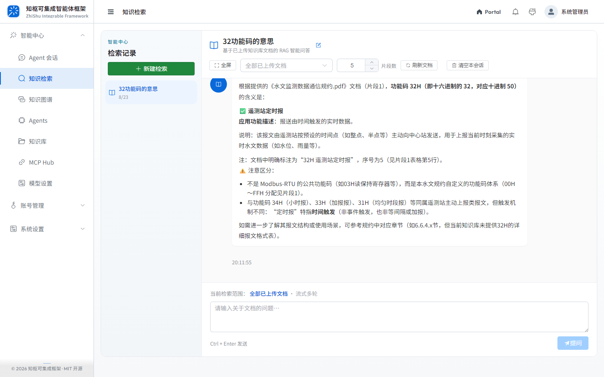
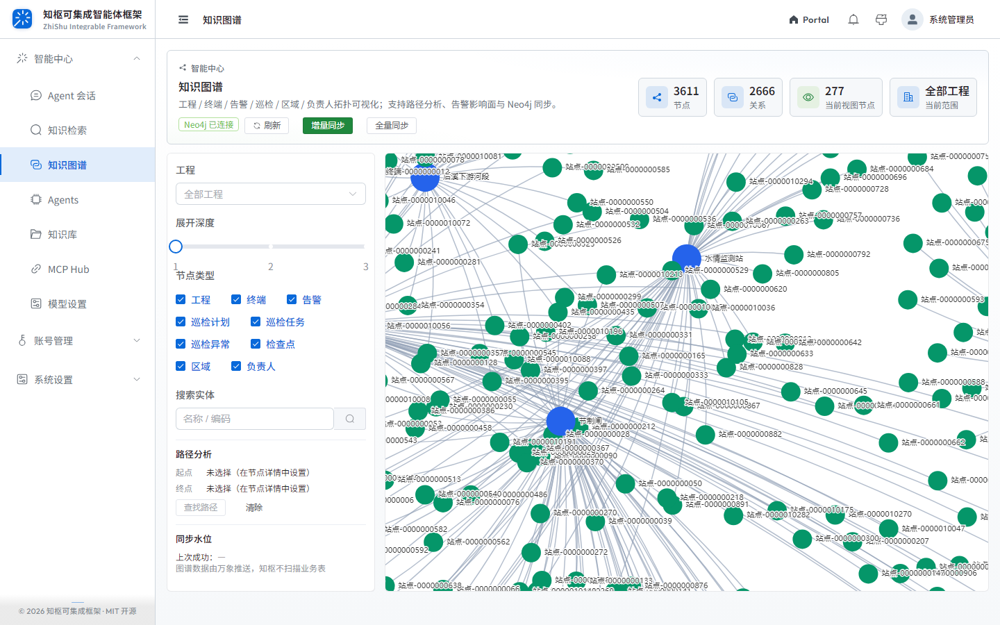
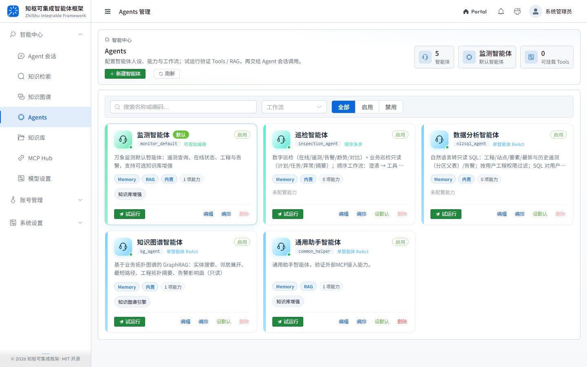
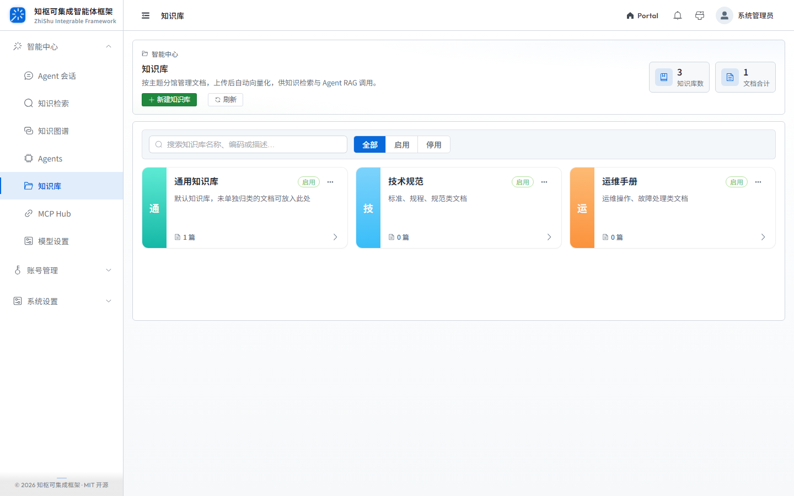
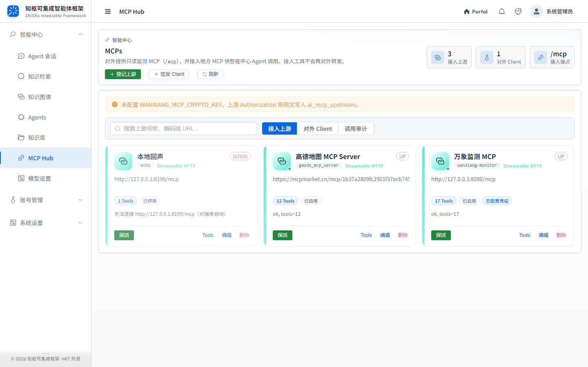
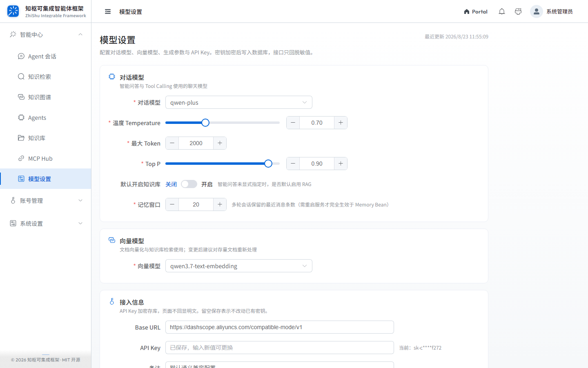
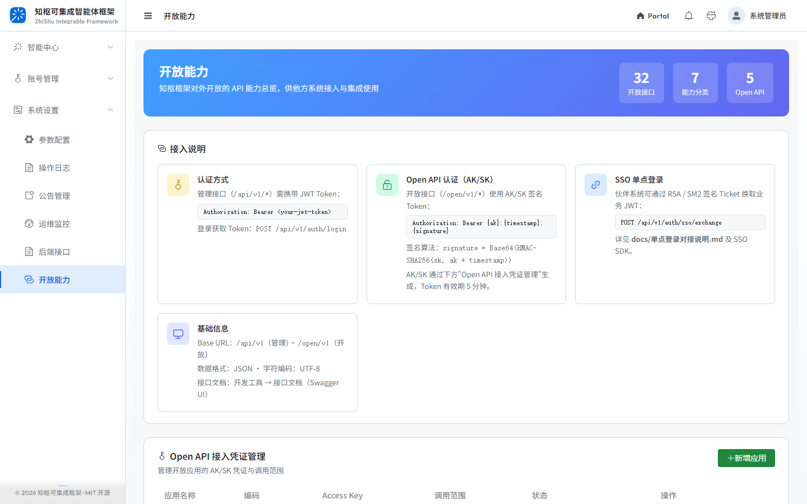

<p align="center">
  
</p>

<h1 align="center">知枢可集成智能体框架 · 快速开始</h1>

一套面向企业数字化与智能化应用集成的模块化开发底座（MIT），简称 **ZSIF**（ZhiShu Integrable Framework）。提供前后端一体架构、RBAC 权限、伙伴 SSO，以及 Agent / RAG / 知识图谱 / MCP Hub / 开放 API。

**源码仓库**：[DataFutureX/zhishu-integrable-framework](https://github.com/DataFutureX/zhishu-integrable-framework)（`origin` / `main`）

**在线演示**：[产品门户](https://zhishu.datafuturex.cn/portal) · [登录](https://zhishu.datafuturex.cn/login) · [文档](https://zhishu.datafuturex.cn/docs)

## 目录

- [界面一览](#界面一览)
- [两种体验路径](#两种体验路径)
- [路径 A：仅前端演示（无需后端）](#路径-a仅前端演示无需后端)
- [路径 B：前后端联调](#路径-b前后端联调)
- [默认账号](#默认账号)
- [联调验证清单](#联调验证清单)
- [技术栈一览](#技术栈一览)
- [工程结构说明](#工程结构说明)
- [常见问题](#常见问题)
- [下一步](#下一步)
- [许可证](#许可证)

## 界面一览

截图来自联调环境 `http://localhost:3100`（`admin`）。完整清单见 [`screenshot/`](./screenshot/)。

产品门户（`/portal`，按顶部导航分屏）：

<table>
  <tr>
    <td align="center" width="20%"><br>首屏</td>
    <td align="center" width="20%"><br>开源</td>
    <td align="center" width="20%"><br>能力</td>
    <td align="center" width="20%"><br>技术栈</td>
    <td align="center" width="20%"><br>文档</td>
  </tr>
</table>

登录页：

<p align="center">
  
</p>

登录后默认进入智能中心 · Agent 会话（工作台与仪表盘已禁用）：

<table>
  <tr>
    <td align="center" width="25%"><br>Agent 会话</td>
    <td align="center" width="25%"><br>知识检索</td>
    <td align="center" width="25%"><br>知识图谱</td>
    <td align="center" width="25%"><br>Agents</td>
  </tr>
  <tr>
    <td align="center"><br>知识库</td>
    <td align="center"><br>MCP Hub</td>
    <td align="center"><br>模型设置</td>
    <td align="center"><br>开放能力</td>
  </tr>
  <tr>
    <td align="center"><br>用户管理</td>
    <td align="center"><br>单位管理</td>
    <td align="center"><br>角色管理</td>
    <td align="center"><br>菜单管理</td>
  </tr>
  <tr>
    <td align="center"><br>参数配置</td>
    <td align="center"><br>公告管理</td>
    <td align="center"><br>操作日志</td>
    <td align="center"><br>运维监控</td>
  </tr>
  <tr>
    <td align="center"><br>后端接口</td>
    <td align="center"><br>个人信息</td>
    <td align="center"><br>修改密码</td>
    <td></td>
  </tr>
</table>

> 重新截图：`node scripts/capture-demo-screenshots.mjs`（默认 `http://localhost:3100`）。门户分屏也可单独跑 `node scripts/capture-portal-sections.mjs`。

## 两种体验路径

| 路径 | 适用场景 | 需要准备 |
|------|----------|----------|
| **A. 前端演示模式** | 快速浏览界面与交互，不接真实 API | Node.js ≥ 18、npm ≥ 9 |
| **B. 前后端联调** | 完整权限、持久化数据、Swagger 调试 | 另需 JDK 21、Maven 3.9+、PostgreSQL 14+（`vector` 扩展）；知识图谱可选 Neo4j 5.x |

建议：先走路径 A 熟悉产品，再按路径 B 启动后端完成真实联调。

## 路径 A：仅前端演示（无需后端）

```bash
cd zhishu-frontend
npm install
npm run dev:demo
```

浏览器打开 [http://localhost:3100](http://localhost:3100)（可先看 `/portal`，再登录）。

演示账号：`demo` / `demo123`（演示态任意账号密码均可登录）。

演示模式通过 `--mode demo` 加载 `.env.demo`（`VITE_DEMO_MODE=true`），Axios 挂载内置 Mock，覆盖登录、权限、CRUD、智能中心与开放应用 AK/SK。

可选启动脚本（在 `zhishu-frontend/`）：`start.bat` / `.\start.ps1` / `./start.sh`。

## 路径 B：前后端联调

本仓库为前后端一体的 monorepo：

```text
zhishu-integrable-framework/
├── zhishu-frontend/   # Vue 3 前端
├── zhishu-backend/    # Java 后端（Maven 父工程）
├── zhishu-sdk/        # 伙伴 SSO SDK、开放 API Java SDK
├── docs/              # 对接说明
├── screenshot/        # 界面截图
├── start.bat / start.ps1 / start.sh
└── README.md
```

### 1. 启动后端

#### 环境要求

- JDK **21+**
- Maven **3.9+**
- PostgreSQL **14+**（RAG 需 `vector` 扩展）
- Neo4j **5.x**（可选，知识图谱）

#### 初始化数据库

```bash
cd zhishu-backend
psql -U postgres -c "CREATE DATABASE zhishu_integrable_framework WITH ENCODING 'UTF8' TEMPLATE template0;"
psql -U postgres -d zhishu_integrable_framework -f zhishu-core/src/main/resources/db/init.sql
psql -U postgres -d zhishu_integrable_framework -f zhishu-core/src/main/resources/db/init_ai.sql
```

默认库名：`zhishu_integrable_framework`。系统表在 `init.sql`，AI 表（pgvector / Agent / MCP / 开放应用）在 `init_ai.sql`。

#### 修改数据源

编辑 `zhishu-backend/zhishu-core/src/main/resources/application-dev.yml`：

```yaml
yunqi:
  datasource:
    host: localhost
    port: 5432
    database: zhishu_integrable_framework
    username: postgres
    password: 你的密码
```

#### 启动服务

```bash
cd zhishu-backend

# Windows
start-dev.bat

# Linux / macOS
chmod +x start-dev.sh
./start-dev.sh

# 或 Maven
mvn -pl zhishu-core -am spring-boot:run -DskipTests
```

`zhishu-ai` 与 `zhishu-core` **同进程**，dev 默认端口 **8180**，不单独占端口。

| 地址 | 说明 |
|------|------|
| http://localhost:8180 | 后端 HTTP（dev） |
| http://localhost:8180/swagger-ui.html | API 文档（dev 放行） |
| http://localhost:8180/api/v1/system/health | 健康检查（无需登录） |

### 2. 启动前端（联调模式）

```bash
cd zhishu-frontend
npm install
npm run dev
```

确认 `zhishu-frontend/.env.development`：

```env
VITE_PORT=3100
VITE_API_BASE_URL=http://localhost:8180
```

| 地址 | 说明 |
|------|------|
| http://localhost:3100 | 前端联调 |
| http://localhost:3100/portal | 产品门户 |
| http://localhost:3100/login | 登录 |

联调默认管理员：`admin` / `admin123`（滑动验证码）。

## 默认账号

| 场景 | 用户名 | 密码 | 说明 |
|------|--------|------|------|
| 前端演示模式 | `demo` | `demo123` | 演示态任意账号密码均可登录 |
| 后端联调 | `admin` | `admin123` | `init.sql` 默认管理员 |

> 默认账户仅用于本地开发。上线前务必修改密码，并更换 `jwt.secret` 等敏感配置。

## 联调验证清单

1. 打开 http://localhost:8180/api/v1/system/health ，确认后端健康
2. 打开 http://localhost:3100/portal ，再进入登录页
3. 使用 `admin / admin123` 完成滑动验证码登录
4. 确认侧栏菜单由 `GET /api/v1/menus/current-user` 动态加载，默认落地 `/ai/chat`
5. （可选）`cd zhishu-frontend && npm run test:e2e:integration`

## 技术栈一览

### 前端

| 类别 | 技术 |
|------|------|
| 框架 | Vue 3.5（Composition API + `<script setup>`） |
| 语言 | TypeScript 5.7（`strict`） |
| 构建 | Vite 5.4 |
| UI | Element Plus 2.9 |
| 状态 / 路由 | Pinia 2.3、Vue Router 4.5（动态菜单） |
| 请求 | Axios 1.8（`/api/v1`、大整数安全） |

### 后端

| 类别 | 技术 |
|------|------|
| 语言 / 框架 | Java 21、Spring Boot 4.1 |
| 安全 | Spring Security 7 + JWT |
| 持久化 | MyBatis-Plus 3.5、PostgreSQL 14 + pgvector |
| 模块 | Spring Modulith（`api` → `security` → `biz` / `ai` → `core`） |
| AI | Spring AI 2.0、Agent Framework、Neo4j 5.x（可选） |
| 文档 | SpringDoc / Swagger UI |

开放双平面：控制台 JWT（`/api/v1/**`）、开放 REST（`/open/v1/**`，AK/SK）、MCP Streamable HTTP（`/mcp`）。

## 工程结构说明

| 项 | 值 |
|----|-----|
| 中文名称 | 知枢可集成智能体框架 |
| 英文名称 | ZhiShu Integrable Framework |
| 简称 | ZSIF |
| 前端目录 / 包名 | `zhishu-frontend/` · `zhishu-integrable-framework` |
| 后端目录 / 模块 | `zhishu-backend/` · `zhishu-*` |
| SDK | `zhishu-sdk/`（伙伴 SSO、开放 API） |
| Java 包名 | `cn.datafuturex.zhishu` |
| 数据库 | `zhishu_integrable_framework` |
| 源码远程 | `origin` → `git@github.com:DataFutureX/zhishu-integrable-framework.git` |

## 常见问题

**前端依赖安装失败**

```bash
cd zhishu-frontend
npm cache clean --force
# PowerShell
Remove-Item -Recurse -Force node_modules, package-lock.json -ErrorAction SilentlyContinue
npm install
```

**后端数据库连接被拒**

- 确认 PostgreSQL 已启动，且已执行 `init.sql` 与 `init_ai.sql` 初始化 `zhishu_integrable_framework`
- 检查 `zhishu-backend/zhishu-core/src/main/resources/application-dev.yml` 中 `yunqi.datasource` 账号密码

**端口被占用**

```bash
# 前端 3100 / 后端 8180
netstat -ano | findstr ":3100 :8180"
```

## 下一步

- 产品门户文档：本地 [http://localhost:3100/docs](http://localhost:3100/docs) · 线上 [https://zhishu.datafuturex.cn/docs](https://zhishu.datafuturex.cn/docs)
- 前端完整说明：[zhishu-frontend/README.md](./zhishu-frontend/README.md)
- 后端完整说明：[zhishu-backend/README.md](./zhishu-backend/README.md)
- 单点登录协议：[docs/单点登录对接说明.md](./docs/单点登录对接说明.md)
- 开放 API SDK：[zhishu-sdk/zhishu-openapi-sdk/README.md](./zhishu-sdk/zhishu-openapi-sdk/README.md)

## 许可证

本项目基于 [MIT License](./LICENSE) 开源。
