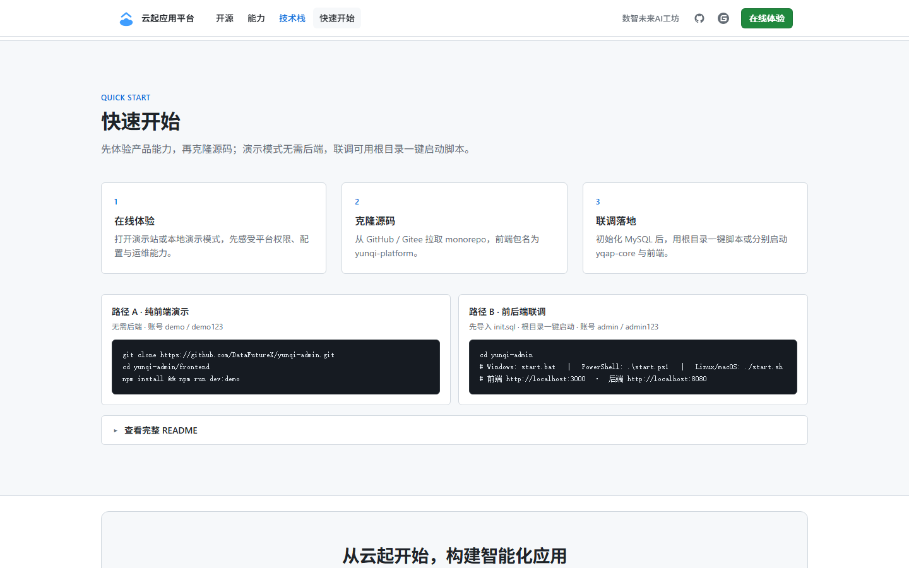

# 云起应用平台 · 快速开始

一套面向企业数字化应用建设的模块化开发基础平台（MIT），简称 **YQAP**（YunQi Application Platform）。本文综合 [前端 README](https://gitee.com/DataFutureX/yunqi-application-platform/blob/master/frontend/README.md) 与 [后端 README](https://gitee.com/DataFutureX/yunqi-application-platform/blob/master/backend/README.md)，帮助你尽快跑通**演示**或**前后端联调**。

**在线演示**：[https://yunqi.datafuturex.cn](https://yunqi.datafuturex.cn)　·　**源码**：[GitHub](https://github.com/DataFutureX/yunqi-application-platform) / [Gitee](https://gitee.com/DataFutureX/yunqi-application-platform)

## 目录

- [界面一览](#界面一览)
- [两种体验路径](#两种体验路径)
- [路径 A：仅前端演示（无需后端）](#路径-a仅前端演示无需后端)
- [路径 B：前后端联调](#路径-b前后端联调)
- [默认账号](#默认账号)
- [联调验证清单](#联调验证清单)
- [技术栈一览](#技术栈一览)
- [源码仓库](#源码仓库)
- [常见问题](#常见问题)
- [下一步](#下一步)
- [许可证](#许可证)

## 界面一览

产品门户（`/portal`，按顶部导航分屏截取视口）：

| 首屏 | 开源 | 能力 | 技术栈 | 快速开始 |
|:---:|:---:|:---:|:---:|:---:|
|  |  |  |  |  |

登录页：


登录后工作台：

| 仪表盘 | 用户管理 | 单位管理 | 角色管理 |
|:---:|:---:|:---:|:---:|
|  |  |  |  |

| 菜单管理 | 系统设置 | 公告管理 | 操作日志 |
|:---:|:---:|:---:|:---:|
|  |  |  |  |

| 系统监控 | API 文档 | 个人信息 | 修改密码 |
|:---:|:---:|:---:|:---:|
|  |  |  |  |

> 截图资源见 [`screenshot/`](./screenshot/)。门户分屏（点击顶部导航后截视口）：`node scripts/capture-portal-sections.mjs`；其它页面：`node scripts/capture-demo-screenshots.mjs`。前端非 3000 端口时设置 `DEMO_BASE_URL`（如 `http://localhost:3001`）。

## 两种体验路径

| 路径 | 适用场景 | 需要准备 |
|------|----------|----------|
| **A. 前端演示模式** | 快速浏览界面与交互，不接真实 API | Node.js ≥ 18、npm ≥ 9 |
| **B. 前后端联调** | 完整权限、持久化数据、Swagger 调试 | 另需 JDK 21、Maven 3.9+、MySQL 8.0+ |

建议：先走路径 A 熟悉产品，再按路径 B 启动后端完成真实联调。

## 路径 A：仅前端演示（无需后端）

```bash
# GitHub
git clone git@github.com:DataFutureX/yunqi-application-platform.git
# 或 Gitee
git clone git@gitee.com:DataFutureX/yunqi-application-platform.git

cd yunqi-application-platform/frontend
npm install
npm run dev:demo
```

浏览器打开 [http://localhost:3000](http://localhost:3000)（可先看 `/portal`，再登录）。

演示账号：`demo` / `demo123`（演示态任意账号密码均可登录）。

演示模式通过 `--mode demo` 加载 `.env.demo`（`VITE_DEMO_MODE=true`），Axios 挂载内置 Mock：

- 覆盖登录、公钥、权限、CRUD、监控、审计等与正式接口对齐的行为
- 数据存于内存会话，刷新后回到初始 Mock
- 无后端时 Swagger 页展示空状态说明

可选启动脚本（在 `frontend/` 目录）：`start.bat` / `.\start.ps1` / `./start.sh`（可选开发或演示模式）。

## 路径 B：前后端联调

本仓库为前后端一体的 monorepo：

```text
yunqi-application-platform/
├── backend/     # Java 后端
├── frontend/    # Vue 前端
├── start.bat    # 根目录一键启动（Windows）
├── start.ps1    # 根目录一键启动（PowerShell）
├── start.sh     # 根目录一键启动（Linux / macOS）
└── screenshot/  # 界面截图
```

### 一键启动前后端（推荐）

确认已安装 JDK 21、Maven、Node.js，并完成下方「初始化数据库 / 修改数据源」后，在**仓库根目录**执行：

```bash
# Windows
start.bat
# 或
.\start.ps1

# Linux / macOS
chmod +x start.sh
./start.sh
```

脚本会分别启动后端（`yqap-core`）与前端（`npm run dev`）：

| 地址 | 说明 |
|------|------|
| http://localhost:3000 | 前端 |
| http://localhost:8080 | 后端 |
| http://localhost:8080/swagger-ui.html | API 文档 |

> Windows / PowerShell 会打开两个独立控制台窗口；Linux / macOS 在后台运行，日志写入根目录 `logs/`，`Ctrl+C` 结束全部进程。

### 1. 启动后端

#### 环境要求

- JDK **21+**
- Maven **3.9+**
- MySQL **8.0+**

#### 初始化数据库

若尚未克隆，先按路径 A 的方式克隆仓库，然后：

```bash
cd yunqi-application-platform/backend
mysql -u root -p < yqap-core/src/main/resources/db/init.sql
```

默认库名：`yunqi_application_platform`。

#### 修改数据源

编辑 `yqap-core/src/main/resources/application-dev.yml`：

```yaml
yunqi:
  datasource:
    host: localhost
    port: 3306
    database: yunqi_application_platform
    username: root
    password: 你的密码
```

数据源使用自定义前缀 `yunqi.datasource.*`（非 `spring.datasource`）。

#### 启动服务

```bash
# Windows
start-dev.bat

# Linux / macOS
chmod +x start-dev.sh
./start-dev.sh

# 或 Maven
mvn -pl yqap-core -am spring-boot:run -DskipTests
```

启动成功后可访问：

| 地址 | 说明 |
|------|------|
| http://localhost:8080 | HTTP 服务 |
| http://localhost:8080/swagger-ui.html | API 文档（dev 放行） |
| http://localhost:8080/api/v1/system/health | 健康检查（无需登录） |

> **安全提示**：默认账户与 `jwt.secret` 仅用于本地开发；上线前务必修改。

### 2. 启动前端（联调模式）

```bash
cd yunqi-application-platform/frontend
```

确认 `.env.development`：

```env
VITE_PORT=3000
VITE_API_BASE_URL=http://localhost:8080
```

```bash
npm install
npm run dev
```

开发服务器监听 `0.0.0.0`：

- 本机：[http://localhost:3000](http://localhost:3000)
- 局域网：`http://本机IP:3000`

前端请求走相对路径 `/api/v1/...`，由 Vite 代理转发到 `VITE_API_BASE_URL`。

### 3. 登录对接顺序（前后端一致）

1. `GET /api/v1/auth/public-key` — RSA 公钥与 `keyId`
2. `GET /api/v1/auth/captcha` — 滑动验证码
3. `POST /api/v1/auth/captcha/verify` — 获得 `captchaToken`
4. `POST /api/v1/auth/login` — 提交加密用户名/密码 + `captchaToken` + `keyId`，返回 JWT
5. 后续请求头：`Authorization: Bearer <token>`

联调默认管理员：`admin` / `admin123`。

## 默认账号

| 场景 | 用户名 | 密码 | 说明 |
|------|--------|------|------|
| 前端演示模式 | `demo` | `demo123` | 演示态任意账号密码均可登录 |
| 后端联调 | `admin` | `admin123` | `init.sql` 默认管理员 |

## 联调验证清单

1. 打开 http://localhost:8080/api/v1/system/health ，确认后端健康
2. 打开 http://localhost:3000/portal ，再进入登录页
3. 使用 `admin / admin123` 完成滑动验证码登录
4. 确认侧栏菜单由 `GET /menus/current-user` 动态加载
5. 需要时可打开前端「API 文档」页或后端 Swagger 对照接口
6. （可选）在已启动前后端的前提下执行前端冒烟：`cd frontend && npm run test:e2e:integration`（日常无后端可用 `npm run test:e2e:demo`）

## 技术栈一览

### 前端

| 类别 | 技术 |
|------|------|
| 框架 | Vue 3.5（Composition API + `<script setup>`） |
| 语言 | TypeScript 5.7（`strict`） |
| 构建 | Vite 5.4 |
| UI | Element Plus 2.9 |
| 状态 / 路由 | Pinia 2.3、Vue Router 4.5（动态菜单） |
| 请求 | Axios 1.8（`/api/v1`、大整数安全） |

### 后端

| 类别 | 技术 |
|------|------|
| 语言 / 框架 | Java 21、Spring Boot 4.1 |
| 安全 | Spring Security 7 + JWT |
| 持久化 | MyBatis-Plus 3.5、MySQL 8 |
| 模块 | Spring Modulith（`api` → `security` → `biz` → `core`） |
| 文档 | SpringDoc / Swagger UI |

## 源码仓库

| 平台 | 仓库 | 说明 |
|------|------|------|
| GitHub | `git@github.com:DataFutureX/yunqi-application-platform.git` | 国际镜像，默认 `origin` |
| Gitee | `git@gitee.com:DataFutureX/yunqi-application-platform.git` | 国内镜像，远程名 `gitee` |

| 路径 | 内容说明 |
|------|----------|
| [`frontend/`](./frontend/) | 前端源码（Vue 3） |
| [`backend/`](./backend/) | 后端源码（Java / Spring Boot） |
| [`screenshot/`](./screenshot/) | 界面截图资源 |
| [`LICENSE`](./LICENSE) | MIT 开源许可证 |

## 常见问题

**前端依赖安装失败**

```bash
npm cache clean --force
# PowerShell
Remove-Item -Recurse -Force node_modules, package-lock.json -ErrorAction SilentlyContinue
npm install
```

**前端端口被占用**

修改 `frontend/.env.development` 中 `VITE_PORT`，或结束占用 3000 的进程。

**后端数据库连接被拒**

- 确认 MySQL 已启动，且已执行 `init.sql` 创建 `yunqi_application_platform`
- 检查 `backend/yqap-core/src/main/resources/application-dev.yml` 中 `yunqi.datasource` 账号密码

**联调登录 401**

- 确认走完验证码 + RSA 登录链路（不可跳过）
- Token 是否过期，或后端是否已重启导致密钥变化

**联调进系统后 403**

- 当前角色缺少对应 BUTTON 权限；用 `admin` 验证，或给角色分配菜单按钮
- 前端路由 `meta.permissions` 与后端菜单 BUTTON 的 `routeName` 需一致

**跨域 / 代理异常**

- 开发联调请使用 `npm run dev`（非 demo），并确认 `VITE_API_BASE_URL=http://localhost:8080`
- 修改环境变量后需重启 Vite

## 下一步

- 前端完整说明：[frontend/README.md](https://gitee.com/DataFutureX/yunqi-application-platform/blob/master/frontend/README.md)（项目结构、配置、部署、开发规范）
- 菜单与权限对照：[frontend/docs/MENU_ROUTES.json](./frontend/docs/MENU_ROUTES.json)
- 后端完整说明：[backend/README.md](https://gitee.com/DataFutureX/yunqi-application-platform/blob/master/backend/README.md)
- API 契约：后端 Swagger `http://localhost:8080/swagger-ui.html`

## 许可证

本项目基于 [MIT License](./LICENSE) 开源。
