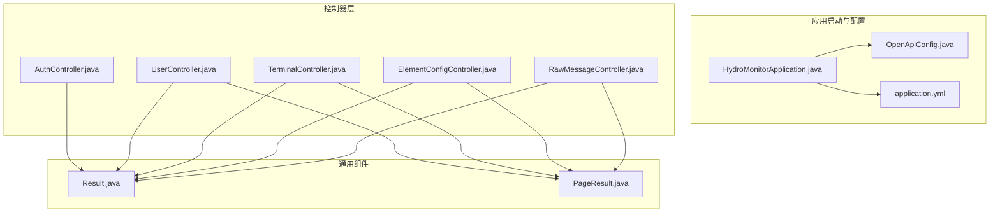
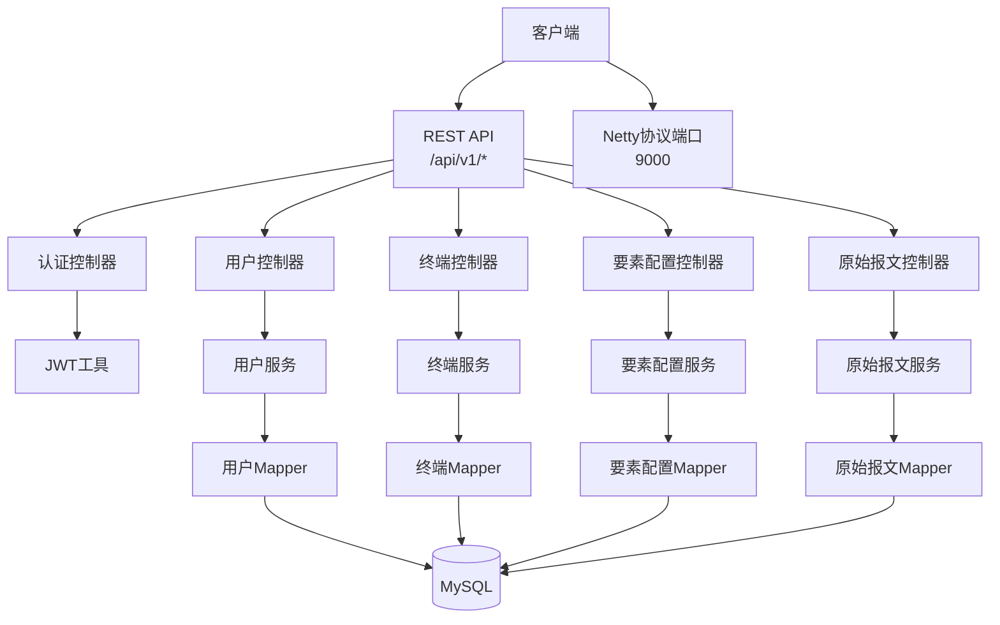
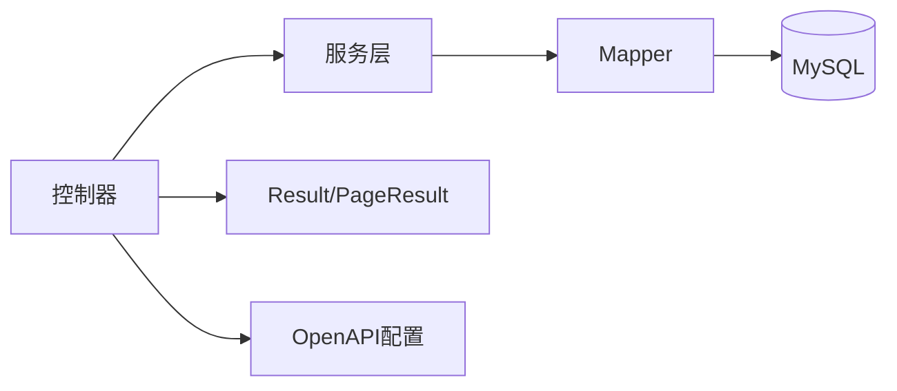

# API接口文档

<cite>
**本文档引用的文件**
- [HydroMonitorApplication.java](file://src/main/java/com/hydro/monitor/HydroMonitorApplication.java)
- [OpenApiConfig.java](file://src/main/java/com/hydro/monitor/config/OpenApiConfig.java)
- [Result.java](file://src/main/java/com/hydro/monitor/common/Result.java)
- [PageResult.java](file://src/main/java/com/hydro/monitor/common/PageResult.java)
- [application.yml](file://src/main/resources/application.yml)
- [AuthController.java](file://src/main/java/com/hydro/monitor/modules/controller/AuthController.java)
- [UserController.java](file://src/main/java/com/hydro/monitor/modules/controller/UserController.java)
- [TerminalController.java](file://src/main/java/com/hydro/monitor/modules/controller/TerminalController.java)
- [ElementConfigController.java](file://src/main/java/com/hydro/monitor/modules/controller/ElementConfigController.java)
- [RawMessageController.java](file://src/main/java/com/hydro/monitor/modules/controller/RawMessageController.java)
- [LoginRequestDTO.java](file://src/main/java/com/hydro/monitor/modules/dto/LoginRequestDTO.java)
- [LoginResponseDTO.java](file://src/main/java/com/hydro/monitor/modules/dto/LoginResponseDTO.java)
- [UserCreateDTO.java](file://src/main/java/com/hydro/monitor/modules/dto/UserCreateDTO.java)
- [UserQueryDTO.java](file://src/main/java/com/hydro/monitor/modules/dto/UserQueryDTO.java)
- [TerminalCreateDTO.java](file://src/main/java/com/hydro/monitor/modules/dto/TerminalCreateDTO.java)
</cite>

## 目录
1. [简介](#简介)
2. [项目结构](#项目结构)
3. [核心组件](#核心组件)
4. [架构总览](#架构总览)
5. [详细组件分析](#详细组件分析)
6. [依赖关系分析](#依赖关系分析)
7. [性能考虑](#性能考虑)
8. [故障排除指南](#故障排除指南)
9. [结论](#结论)
10. [附录](#附录)

## 简介
本文件为水文监测系统后端的完整API接口文档，覆盖认证、用户管理、终端管理、要素配置、原始报文等所有公共RESTful接口。文档包含接口的HTTP方法、URL模式、请求参数、响应格式、错误处理、分页查询、排序规则、过滤条件及最佳实践。系统采用Spring Boot + Spring Security + JWT + MyBatis-Plus + Netty架构，并通过Swagger/OpenAPI提供在线文档。

## 项目结构
后端采用标准Spring Boot目录结构，核心模块包括：
- 启动类与配置：应用启动入口、OpenAPI配置、全局响应封装、分页封装、应用配置
- 控制器层：各业务模块的REST接口控制器
- DTO/VO/Entity：请求参数、视图对象、实体模型
- Mapper/Service：数据访问与业务逻辑
- Netty：串口/网络协议解析与消息处理

**图表来源**
- [HydroMonitorApplication.java:1-36](file://src/main/java/com/hydro/monitor/HydroMonitorApplication.java#L1-L36)
- [OpenApiConfig.java:1-52](file://src/main/java/com/hydro/monitor/config/OpenApiConfig.java#L1-L52)
- [application.yml:1-86](file://src/main/resources/application.yml#L1-L86)
- [Result.java:1-79](file://src/main/java/com/hydro/monitor/common/Result.java#L1-L79)
- [PageResult.java:1-58](file://src/main/java/com/hydro/monitor/common/PageResult.java#L1-L58)
- [AuthController.java:1-68](file://src/main/java/com/hydro/monitor/modules/controller/AuthController.java#L1-L68)
- [UserController.java:1-142](file://src/main/java/com/hydro/monitor/modules/controller/UserController.java#L1-L142)
- [TerminalController.java:1-138](file://src/main/java/com/hydro/monitor/modules/controller/TerminalController.java#L1-L138)
- [ElementConfigController.java:1-97](file://src/main/java/com/hydro/monitor/modules/controller/ElementConfigController.java#L1-L97)
- [RawMessageController.java:1-81](file://src/main/java/com/hydro/monitor/modules/controller/RawMessageController.java#L1-L81)

**章节来源**
- [HydroMonitorApplication.java:1-36](file://src/main/java/com/hydro/monitor/HydroMonitorApplication.java#L1-L36)
- [OpenApiConfig.java:1-52](file://src/main/java/com/hydro/monitor/config/OpenApiConfig.java#L1-L52)
- [application.yml:1-86](file://src/main/resources/application.yml#L1-L86)

## 核心组件
- 统一响应封装：Result<T> 提供统一的响应结构，包含状态码、消息与数据体；PageResult<T> 提供分页响应结构，包含当前页、页大小、总记录数、总页数与记录列表。
- OpenAPI/Swagger：通过OpenApiConfig配置全局安全方案（JWT Bearer）与文档信息，Swagger UI路径为 /swagger-ui.html。
- 应用配置：application.yml定义服务端口、数据源、MyBatis-Plus配置、JWT密钥与过期时间、日志级别与输出、Netty端口、SpringDoc路径等。

**章节来源**
- [Result.java:1-79](file://src/main/java/com/hydro/monitor/common/Result.java#L1-L79)
- [PageResult.java:1-58](file://src/main/java/com/hydro/monitor/common/PageResult.java#L1-L58)
- [OpenApiConfig.java:1-52](file://src/main/java/com/hydro/monitor/config/OpenApiConfig.java#L1-L52)
- [application.yml:1-86](file://src/main/resources/application.yml#L1-L86)

## 架构总览
系统采用前后端分离架构，后端提供RESTful API与WebSocket/Netty协议接入点。认证采用JWT，全局拦截器负责鉴权与异常处理。

**图表来源**
- [AuthController.java:1-68](file://src/main/java/com/hydro/monitor/modules/controller/AuthController.java#L1-L68)
- [UserController.java:1-142](file://src/main/java/com/hydro/monitor/modules/controller/UserController.java#L1-L142)
- [TerminalController.java:1-138](file://src/main/java/com/hydro/monitor/modules/controller/TerminalController.java#L1-L138)
- [ElementConfigController.java:1-97](file://src/main/java/com/hydro/monitor/modules/controller/ElementConfigController.java#L1-L97)
- [RawMessageController.java:1-81](file://src/main/java/com/hydro/monitor/modules/controller/RawMessageController.java#L1-L81)
- [application.yml:44-47](file://src/main/resources/application.yml#L44-L47)

## 详细组件分析

### 认证管理接口
- 版本：v1
- 基础路径：/api/v1/auth
- 认证方式：无（登录获取Token）
- 全局安全：除登录外其他接口均需携带 Bearer Token

接口定义
- POST /login
  - 功能：用户登录获取JWT Token
  - 请求体：LoginRequestDTO
    - username: 字符串，必填
    - password: 字符串，必填
  - 响应体：Result<LoginResponseDTO>
    - token: 字符串，JWT Token
    - expiration: 数字，过期时间戳（毫秒）
  - 示例请求：
    - POST /api/v1/auth/login
    - Content-Type: application/json
    - {"username":"admin","password":"password"}
  - 示例响应：
    - 200 OK
    - {"code":200,"message":"success","data":{"token":"...","expiration":...}}
  - 错误处理：
    - 用户名或密码错误：400/500，message提示

**章节来源**
- [AuthController.java:1-68](file://src/main/java/com/hydro/monitor/modules/controller/AuthController.java#L1-L68)
- [LoginRequestDTO.java:1-20](file://src/main/java/com/hydro/monitor/modules/dto/LoginRequestDTO.java#L1-L20)
- [LoginResponseDTO.java:1-20](file://src/main/java/com/hydro/monitor/modules/dto/LoginResponseDTO.java#L1-L20)
- [OpenApiConfig.java:40-49](file://src/main/java/com/hydro/monitor/config/OpenApiConfig.java#L40-L49)

### 用户管理接口
- 版本：v1
- 基础路径：/api/v1/users
- 认证方式：需要 Bearer Token

通用响应
- 成功：Result<T>，code=200
- 失败：Result<T>，code=500 或自定义

分页与查询
- 默认分页：pageNum>=1，pageSize>=1
- 排序：按创建时间倒序（由服务端实现）
- 过滤：支持按用户名、真实姓名、手机号、角色、状态模糊或精确过滤

接口定义
- POST /
  - 功能：创建用户
  - 请求体：UserCreateDTO
    - username: 字符串，必填
    - realName: 字符串，必填
    - email: 邮箱，必填
    - phone: 手机号，必填
    - password: 字符串，必填
    - role: 字符串，必填
    - status: 数字，1-正常，0-禁用
  - 响应体：Result<UserEntity>

- PUT /
  - 功能：更新用户
  - 请求体：UserUpdateDTO（对应服务端DTO）
  - 响应体：Result<UserEntity>

- DELETE /{id}
  - 功能：删除用户
  - 路径参数：id: 数字，必填
  - 响应体：Result<Void>

- GET /{id}
  - 功能：根据ID查询用户详情
  - 路径参数：id: 数字，必填
  - 响应体：Result<UserEntity>

- GET /username/{username}
  - 功能：根据用户名查询用户
  - 路径参数：username: 字符串，必填
  - 响应体：Result<UserVO>

- GET /page
  - 功能：分页查询用户
  - 查询参数：UserQueryDTO
    - username: 字符串，模糊查询
    - realName: 字符串，模糊查询
    - phone: 字符串，模糊查询
    - role: 字符串，过滤
    - status: 数字，过滤
    - pageNum: 数字，分页页码
    - pageSize: 数字，分页大小
  - 响应体：Result<PageResult<UserVO>>

请求示例
- POST /api/v1/users
  - Content-Type: application/json
  - {"username":"test","realName":"Test User","email":"test@example.com","phone":"13800001111","password":"Passw0rd!","role":"USER","status":1}

- GET /api/v1/users/page?pageSize=10&pageNum=1&role=USER
  - Authorization: Bearer <token>

响应示例
- 200 OK
- {"code":200,"message":"success","data":{"current":1,"size":10,"total":100,"pages":10,"records":[...]}}

错误处理
- 用户不存在：返回错误消息
- 参数校验失败：返回400/500
- 权限不足：返回401/403

**章节来源**
- [UserController.java:1-142](file://src/main/java/com/hydro/monitor/modules/controller/UserController.java#L1-L142)
- [UserCreateDTO.java:1-55](file://src/main/java/com/hydro/monitor/modules/dto/UserCreateDTO.java#L1-L55)
- [UserQueryDTO.java:1-54](file://src/main/java/com/hydro/monitor/modules/dto/UserQueryDTO.java#L1-L54)
- [Result.java:1-79](file://src/main/java/com/hydro/monitor/common/Result.java#L1-L79)
- [PageResult.java:1-58](file://src/main/java/com/hydro/monitor/common/PageResult.java#L1-L58)

### 终端管理接口
- 版本：v1
- 基础路径：/api/v1/terminals
- 认证方式：需要 Bearer Token

接口定义
- POST /
  - 功能：创建终端
  - 请求体：TerminalCreateDTO
    - terminalName: 字符串，必填
    - terminalCode: 字符串，必填
    - longitude: 数字，可选
    - latitude: 数字，可选
    - installLocation: 字符串，可选
    - connectPassword: 字符串，可选
  - 响应体：Result<TerminalEntity>

- PUT /
  - 功能：更新终端
  - 请求体：TerminalUpdateDTO（对应服务端DTO）
  - 响应体：Result<TerminalEntity>

- DELETE /{id}
  - 功能：删除终端
  - 路径参数：id: 数字，必填
  - 响应体：Result<Void>

- GET /{id}
  - 功能：根据ID查询终端详情
  - 路径参数：id: 数字，必填
  - 响应体：Result<TerminalEntity>

- GET /page
  - 功能：分页查询终端
  - 查询参数：TerminalQueryDTO（由服务端DTO定义）
  - 响应体：Result<PageResult<TerminalEntity>>

- GET /list
  - 功能：获取所有终端列表（不分页）
  - 响应体：Result<List<TerminalEntity>>

请求示例
- POST /api/v1/terminals
  - Content-Type: application/json
  - {"terminalName":"站点A","terminalCode":"ST001","longitude":120.123,"latitude":30.456,"installLocation":"杭州","connectPassword":"pwd"}

- GET /api/v1/terminals/list
  - Authorization: Bearer <token>

响应示例
- 200 OK
- {"code":200,"message":"success","data":[{"id":1,...},{"id":2,...}]}

错误处理
- 终端不存在：返回错误消息
- 参数校验失败：返回400/500

**章节来源**
- [TerminalController.java:1-138](file://src/main/java/com/hydro/monitor/modules/controller/TerminalController.java#L1-L138)
- [TerminalCreateDTO.java:1-44](file://src/main/java/com/hydro/monitor/modules/dto/TerminalCreateDTO.java#L1-L44)
- [Result.java:1-79](file://src/main/java/com/hydro/monitor/common/Result.java#L1-L79)
- [PageResult.java:1-58](file://src/main/java/com/hydro/monitor/common/PageResult.java#L1-L58)

### 要素配置管理接口
- 版本：v1
- 基础路径：/api/v1/element-configs
- 认证方式：需要 Bearer Token

接口定义
- POST /page
  - 功能：分页查询要素配置
  - 请求体：ElementConfigQueryDTO（由服务端DTO定义）
  - 响应体：Result<PageResult<ElementConfigEntity>>
  - 说明：支持按要素标识符、编码、名称模糊查询，以及启用状态筛选

- GET /{id}
  - 功能：根据ID查询要素配置详情
  - 路径参数：id: 数字，必填
  - 响应体：Result<ElementConfigEntity>

- POST /
  - 功能：新增要素配置
  - 请求体：ElementConfigCreateDTO（由服务端DTO定义）
  - 响应体：Result<ElementConfigEntity>

- PUT /
  - 功能：更新要素配置
  - 请求体：ElementConfigUpdateDTO（由服务端DTO定义）
  - 响应体：Result<ElementConfigEntity>

- DELETE /{id}
  - 功能：删除要素配置
  - 路径参数：id: 数字，必填
  - 响应体：Result<Void>

请求示例
- POST /api/v1/element-configs/page
  - Content-Type: application/json
  - {"pageNum":1,"pageSize":20,"keyword":"水位"}

- GET /api/v1/element-configs/1
  - Authorization: Bearer <token>

响应示例
- 200 OK
- {"code":200,"message":"success","data":{"current":1,"size":20,"total":50,"pages":3,"records":[...]}}

错误处理
- 要素配置不存在：返回错误消息
- 参数校验失败：返回400/500

**章节来源**
- [ElementConfigController.java:1-97](file://src/main/java/com/hydro/monitor/modules/controller/ElementConfigController.java#L1-L97)
- [Result.java:1-79](file://src/main/java/com/hydro/monitor/common/Result.java#L1-L79)
- [PageResult.java:1-58](file://src/main/java/com/hydro/monitor/common/PageResult.java#L1-L58)

### 原始报文管理接口
- 版本：v1
- 基础路径：/api/v1/raw-messages
- 认证方式：需要 Bearer Token

接口定义
- POST /page
  - 功能：分页查询原始报文
  - 请求体：RawMessageQueryDTO（由服务端DTO定义）
  - 响应体：Result<PageResult<RawMessageVO>>
  - 说明：默认每页20条，按接收时间倒序排列；支持按遥测站地址、功能码筛选

- GET /{id}
  - 功能：根据ID查询原始报文详情
  - 路径参数：id: 数字，必填
  - 响应体：Result<RawMessageVO>

- GET /{id}/parse
  - 功能：解析原始报文（调用SL651协议解析器）
  - 路径参数：id: 数字，必填
  - 响应体：Result<String>（返回结构化JSON字符串）

请求示例
- POST /api/v1/raw-messages/page
  - Content-Type: application/json
  - {"pageNum":1,"pageSize":20,"stationAddress":"ST001","functionCode":"RR"}

- GET /api/v1/raw-messages/1/parse
  - Authorization: Bearer <token>

响应示例
- 200 OK
- {"code":200,"message":"success","data":"{...}"}

错误处理
- 原始报文不存在：返回错误消息
- 解析失败：返回错误消息

**章节来源**
- [RawMessageController.java:1-81](file://src/main/java/com/hydro/monitor/modules/controller/RawMessageController.java#L1-L81)
- [Result.java:1-79](file://src/main/java/com/hydro/monitor/common/Result.java#L1-L79)
- [PageResult.java:1-58](file://src/main/java/com/hydro/monitor/common/PageResult.java#L1-L58)

## 依赖关系分析
- 控制器依赖服务层，服务层依赖Mapper，Mapper依赖数据库
- 统一响应封装被所有控制器使用
- OpenAPI配置提供全局安全方案与文档信息
- 应用配置决定端口、数据源、MyBatis-Plus行为、JWT参数、日志策略等

**图表来源**
- [Result.java:1-79](file://src/main/java/com/hydro/monitor/common/Result.java#L1-L79)
- [PageResult.java:1-58](file://src/main/java/com/hydro/monitor/common/PageResult.java#L1-L58)
- [OpenApiConfig.java:1-52](file://src/main/java/com/hydro/monitor/config/OpenApiConfig.java#L1-L52)

**章节来源**
- [Result.java:1-79](file://src/main/java/com/hydro/monitor/common/Result.java#L1-L79)
- [PageResult.java:1-58](file://src/main/java/com/hydro/monitor/common/PageResult.java#L1-L58)
- [OpenApiConfig.java:1-52](file://src/main/java/com/hydro/monitor/config/OpenApiConfig.java#L1-L52)

## 性能考虑
- 分页查询：合理设置pageNum与pageSize，避免一次性返回大量数据；服务端默认排序按创建时间倒序，建议前端结合业务场景选择合适字段排序
- 缓存策略：对于高频读取的静态配置（如要素配置），可在服务层引入缓存以降低数据库压力
- 并发控制：在高并发场景下，注意数据库连接池与事务隔离级别配置
- 日志级别：生产环境建议调整日志级别，减少INFO/DEBUG日志输出对性能的影响
- Netty端口：9000端口用于协议接入，建议与HTTP端口8080隔离监控与限流

[本节为通用性能建议，无需特定文件引用]

## 故障排除指南
- 认证失败
  - 确认请求头携带正确的Authorization: Bearer <token>
  - 检查JWT过期时间与签名密钥配置
- 参数校验失败
  - 检查请求体字段类型与必填项
  - 参考DTO注解约束（邮箱格式、手机号格式、非空等）
- 数据不存在
  - 确认资源ID是否存在
  - 检查软删除字段与查询条件
- 数据库连接异常
  - 检查application.yml中的数据源配置与网络连通性
- 日志定位
  - 查看控制台输出与日志文件，定位具体异常堆栈

**章节来源**
- [application.yml:1-86](file://src/main/resources/application.yml#L1-L86)

## 结论
本API文档覆盖了水文监测系统后端的主要REST接口，提供了统一的响应格式、分页查询能力、认证与安全机制，以及OpenAPI在线文档支持。建议在实际集成时严格遵循参数约束与认证流程，并结合性能与安全最佳实践进行优化。

[本节为总结性内容，无需特定文件引用]

## 附录

### API版本管理
- 版本前缀：/api/v1
- 后续升级可通过新增版本前缀保持向后兼容

**章节来源**
- [AuthController.java:26](file://src/main/java/com/hydro/monitor/modules/controller/AuthController.java#L26)
- [UserController.java:25](file://src/main/java/com/hydro/monitor/modules/controller/UserController.java#L25)
- [TerminalController.java:24](file://src/main/java/com/hydro/monitor/modules/controller/TerminalController.java#L24)
- [ElementConfigController.java:25](file://src/main/java/com/hydro/monitor/modules/controller/ElementConfigController.java#L25)
- [RawMessageController.java:22](file://src/main/java/com/hydro/monitor/modules/controller/RawMessageController.java#L22)

### 分页查询、排序与过滤
- 分页：pageNum>=1，pageSize>=1（默认值在DTO构造中处理）
- 排序：按创建时间倒序（由服务端实现）
- 过滤：支持按用户名、真实姓名、手机号、角色、状态等字段模糊或精确过滤

**章节来源**
- [UserQueryDTO.java:44-53](file://src/main/java/com/hydro/monitor/modules/dto/UserQueryDTO.java#L44-L53)
- [UserController.java:130-140](file://src/main/java/com/hydro/monitor/modules/controller/UserController.java#L130-L140)

### Swagger/OpenAPI 使用说明
- 在线文档：http://localhost:8080/swagger-ui.html
- API文档：/v3/api-docs
- 全局安全方案：Bearer Authentication（JWT Bearer Token）
- 使用步骤：
  1) 启动应用后访问Swagger UI
  2) 点击Authorize按钮，输入Bearer <token>
  3) 开始调试各接口

**章节来源**
- [HydroMonitorApplication.java:32](file://src/main/java/com/hydro/monitor/HydroMonitorApplication.java#L32)
- [OpenApiConfig.java:28-50](file://src/main/java/com/hydro/monitor/config/OpenApiConfig.java#L28-L50)
- [application.yml:54-60](file://src/main/resources/application.yml#L54-L60)

### 接口测试方法
- 使用Postman或curl进行接口测试
- 认证接口：先调用POST /api/v1/auth/login获取token
- 业务接口：在请求头添加Authorization: Bearer <token>
- 分页接口：构造pageNum与pageSize参数，验证total与records一致性
- 错误场景：传入无效ID、缺失必填字段、过期token等

[本节为通用测试指导，无需特定文件引用]