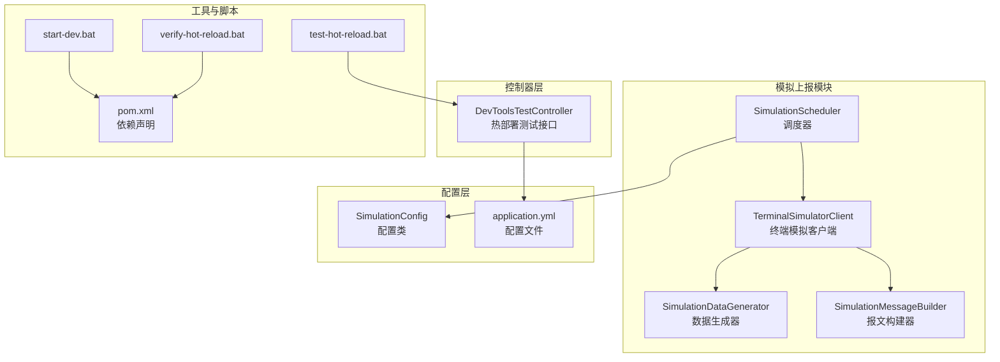
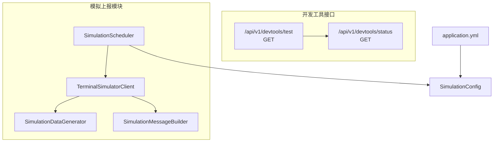
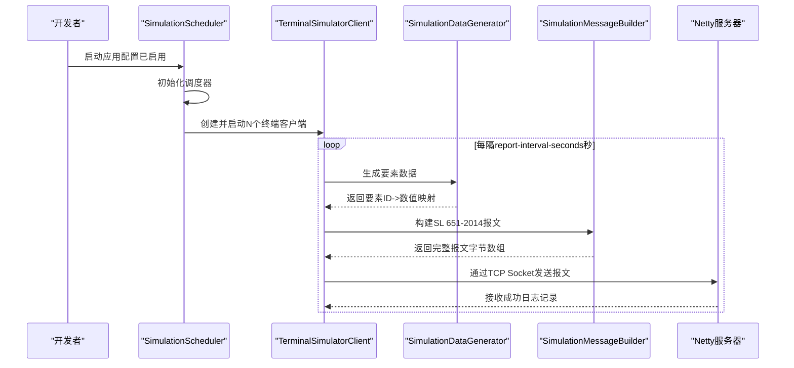
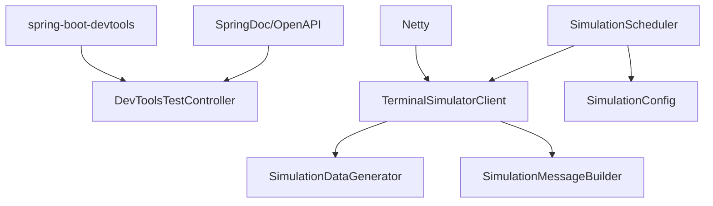

# 开发工具接口

<cite>
**本文引用的文件**
- [DevToolsTestController.java](file://src/main/java/com/hydro/monitor/modules/controller/DevToolsTestController.java)
- [SimulationDataGenerator.java](file://src/main/java/com/hydro/monitor/simulation/SimulationDataGenerator.java)
- [TerminalSimulatorClient.java](file://src/main/java/com/hydro/monitor/simulation/TerminalSimulatorClient.java)
- [SimulationMessageBuilder.java](file://src/main/java/com/hydro/monitor/simulation/SimulationMessageBuilder.java)
- [SimulationScheduler.java](file://src/main/java/com/hydro/monitor/simulation/SimulationScheduler.java)
- [SimulationConfig.java](file://src/main/java/com/hydro/monitor/config/SimulationConfig.java)
- [application.yml](file://src/main/resources/application.yml)
- [pom.xml](file://pom.xml)
- [start-dev.bat](file://start-dev.bat)
- [test-hot-reload.bat](file://test-hot-reload.bat)
- [verify-hot-reload.bat](file://verify-hot-reload.bat)
- [README.md](file://README.md)
</cite>

## 目录
1. [简介](#简介)
2. [项目结构](#项目结构)
3. [核心组件](#核心组件)
4. [架构总览](#架构总览)
5. [详细组件分析](#详细组件分析)
6. [依赖分析](#依赖分析)
7. [性能考虑](#性能考虑)
8. [故障排除指南](#故障排除指南)
9. [结论](#结论)
10. [附录](#附录)

## 简介
本文件面向开发与测试工程师，系统化梳理开发工具模块的辅助接口与工具链，重点覆盖以下方面：
- 开发环境测试与调试工具：包括热部署测试接口与状态检查接口
- 开发辅助功能：终端模拟上报模块（真实 TCP Socket 模式）、配置开关与参数控制
- 接口用途与使用场景：接口调试、开发环境验证、数据导入测试（通过模拟上报）
- 请求示例与使用说明：如何验证热部署、如何启用/禁用模拟上报、如何观察模拟数据流
- 安全限制与使用范围：仅限开发/测试环境，生产环境需禁用模拟模块

## 项目结构
开发工具相关的核心文件分布如下：
- 控制器层：DevToolsTestController 提供热部署测试与状态检查接口
- 模拟上报模块：SimulationScheduler、TerminalSimulatorClient、SimulationDataGenerator、SimulationMessageBuilder
- 配置层：SimulationConfig 与 application.yml 的 simulation.* 配置项
- 启动与验证脚本：start-dev.bat、test-hot-reload.bat、verify-hot-reload.bat
- 依赖声明：pom.xml 中的 spring-boot-devtools 与相关依赖

**图表来源**
- [DevToolsTestController.java:1-64](file://src/main/java/com/hydro/monitor/modules/controller/DevToolsTestController.java#L1-L64)
- [SimulationScheduler.java:1-136](file://src/main/java/com/hydro/monitor/simulation/SimulationScheduler.java#L1-L136)
- [TerminalSimulatorClient.java:1-207](file://src/main/java/com/hydro/monitor/simulation/TerminalSimulatorClient.java#L1-L207)
- [SimulationDataGenerator.java:1-164](file://src/main/java/com/hydro/monitor/simulation/SimulationDataGenerator.java#L1-L164)
- [SimulationMessageBuilder.java:1-447](file://src/main/java/com/hydro/monitor/simulation/SimulationMessageBuilder.java#L1-L447)
- [SimulationConfig.java:1-59](file://src/main/java/com/hydro/monitor/config/SimulationConfig.java#L1-L59)
- [application.yml:78-86](file://src/main/resources/application.yml#L78-L86)
- [pom.xml:146-152](file://pom.xml#L146-L152)
- [start-dev.bat:1-28](file://start-dev.bat#L1-L28)
- [test-hot-reload.bat:1-28](file://test-hot-reload.bat#L1-L28)
- [verify-hot-reload.bat:1-55](file://verify-hot-reload.bat#L1-L55)

**章节来源**
- [DevToolsTestController.java:1-64](file://src/main/java/com/hydro/monitor/modules/controller/DevToolsTestController.java#L1-L64)
- [SimulationScheduler.java:1-136](file://src/main/java/com/hydro/monitor/simulation/SimulationScheduler.java#L1-L136)
- [TerminalSimulatorClient.java:1-207](file://src/main/java/com/hydro/monitor/simulation/TerminalSimulatorClient.java#L1-L207)
- [SimulationDataGenerator.java:1-164](file://src/main/java/com/hydro/monitor/simulation/SimulationDataGenerator.java#L1-L164)
- [SimulationMessageBuilder.java:1-447](file://src/main/java/com/hydro/monitor/simulation/SimulationMessageBuilder.java#L1-L447)
- [SimulationConfig.java:1-59](file://src/main/java/com/hydro/monitor/config/SimulationConfig.java#L1-L59)
- [application.yml:78-86](file://src/main/resources/application.yml#L78-L86)
- [pom.xml:146-152](file://pom.xml#L146-L152)
- [start-dev.bat:1-28](file://start-dev.bat#L1-L28)
- [test-hot-reload.bat:1-28](file://test-hot-reload.bat#L1-L28)
- [verify-hot-reload.bat:1-55](file://verify-hot-reload.bat#L1-L55)

## 核心组件
- 热部署测试控制器：提供 /api/v1/devtools/test 与 /api/v1/devtools/status 两个接口，用于验证 DevTools 热部署功能与检查 DevTools 是否启用
- 终端模拟上报模块：通过 SimulationScheduler 管理多个 TerminalSimulatorClient 实例，周期性通过真实 TCP Socket 发送 SL 651-2014 协议报文
- 配置管理：SimulationConfig 与 application.yml 的 simulation.* 配置项控制模拟上报的开关、终端数量、上报间隔、服务器地址与端口等
- 开发工具链：start-dev.bat、test-hot-reload.bat、verify-hot-reload.bat 与 pom.xml 中的 spring-boot-devtools 依赖共同构成开发环境的热部署与验证工具链

**章节来源**
- [DevToolsTestController.java:19-63](file://src/main/java/com/hydro/monitor/modules/controller/DevToolsTestController.java#L19-L63)
- [SimulationScheduler.java:30-96](file://src/main/java/com/hydro/monitor/simulation/SimulationScheduler.java#L30-L96)
- [SimulationConfig.java:14-58](file://src/main/java/com/hydro/monitor/config/SimulationConfig.java#L14-L58)
- [application.yml:78-86](file://src/main/resources/application.yml#L78-L86)
- [pom.xml:146-152](file://pom.xml#L146-L152)

## 架构总览
开发工具模块在系统中的位置与交互如下：

**图表来源**
- [DevToolsTestController.java:28-63](file://src/main/java/com/hydro/monitor/modules/controller/DevToolsTestController.java#L28-L63)
- [SimulationScheduler.java:30-96](file://src/main/java/com/hydro/monitor/simulation/SimulationScheduler.java#L30-L96)
- [TerminalSimulatorClient.java:24-51](file://src/main/java/com/hydro/monitor/simulation/TerminalSimulatorClient.java#L24-L51)
- [SimulationDataGenerator.java:23-59](file://src/main/java/com/hydro/monitor/simulation/SimulationDataGenerator.java#L23-L59)
- [SimulationMessageBuilder.java:16-42](file://src/main/java/com/hydro/monitor/simulation/SimulationMessageBuilder.java#L16-L42)
- [SimulationConfig.java:14-58](file://src/main/java/com/hydro/monitor/config/SimulationConfig.java#L14-L58)
- [application.yml:78-86](file://src/main/resources/application.yml#L78-L86)

## 详细组件分析

### 热部署测试接口
- 接口列表
  - GET /api/v1/devtools/test
    - 用途：触发热部署测试，返回包含当前时间的消息，用于验证修改代码后无需重启即可生效
    - 请求参数：无
    - 响应格式：Result<String>，包含测试消息
    - 使用场景：开发过程中验证 DevTools 热部署是否正常工作
  - GET /api/v1/devtools/status
    - 用途：检查 DevTools 是否已启用
    - 请求参数：无
    - 响应格式：Result<String>，包含状态信息
    - 使用场景：启动后快速确认热部署环境配置是否正确

- 请求示例
  - curl -X GET "http://localhost:8080/api/v1/devtools/status" -H "accept: application/json"
  - curl -X GET "http://localhost:8080/api/v1/devtools/test" -H "accept: application/json"

- 使用说明
  - 通过 verify-hot-reload.bat 验证 DevTools 依赖与配置
  - 通过 test-hot-reload.bat 启动应用并测试热部署接口
  - 修改 DevToolsTestController.java 后保存，再次访问 /api/v1/devtools/test 观察是否无需重启即可看到变化

- 安全限制与使用范围
  - 仅限开发/测试环境使用，生产环境应禁用热部署功能
  - 该接口不涉及鉴权，直接暴露于 HTTP 服务

**章节来源**
- [DevToolsTestController.java:28-63](file://src/main/java/com/hydro/monitor/modules/controller/DevToolsTestController.java#L28-L63)
- [test-hot-reload.bat:16-26](file://test-hot-reload.bat#L16-L26)
- [verify-hot-reload.bat:8-27](file://verify-hot-reload.bat#L8-L27)
- [pom.xml:146-152](file://pom.xml#L146-L152)

### 终端模拟上报模块
- 组件职责
  - SimulationScheduler：应用启动时根据配置初始化并启动多个终端模拟客户端；应用关闭时负责优雅停机
  - TerminalSimulatorClient：每个实例代表一个独立终端，周期性生成模拟要素数据并通过真实 TCP Socket 发送 SL 651-2014 报文
  - SimulationDataGenerator：根据要素配置表生成合理范围内的随机数据
  - SimulationMessageBuilder：严格遵循 SL 651-2014 协议规范构建报文头、正文与校验和
  - SimulationConfig：集中管理模拟上报的开关、终端数量、上报间隔、服务器地址与端口等参数

- 配置项说明（simulation.*）
  - enabled：是否启用模拟上报功能（默认关闭）
  - terminal-count：模拟终端数量（默认16）
  - report-interval-seconds：上报间隔（秒，默认300秒即5分钟）
  - center-station-address：中心站地址（默认2）
  - password：密码（BCD编码，默认a000）
  - station-category-code：遥测站分类码（默认48）
  - server-host：Netty服务器地址（默认127.0.0.1）
  - server-port：Netty服务器端口（默认9000）

- 使用场景
  - 接口调试：通过模拟上报观察后端对 SL 651-2014 报文的解析与处理
  - 开发环境验证：验证 Netty 服务端接收、协议解析、数据入库等链路
  - 数据导入测试：批量生成历史数据或压力测试数据（谨慎使用）

- 安全限制与使用范围
  - 仅限开发/测试环境使用，生产环境必须禁用（simulation.enabled=false）
  - 该模块通过真实 TCP Socket 连接，需确保服务器地址与端口正确配置

**图表来源**
- [SimulationScheduler.java:45-96](file://src/main/java/com/hydro/monitor/simulation/SimulationScheduler.java#L45-L96)
- [TerminalSimulatorClient.java:56-90](file://src/main/java/com/hydro/monitor/simulation/TerminalSimulatorClient.java#L56-L90)
- [TerminalSimulatorClient.java:119-156](file://src/main/java/com/hydro/monitor/simulation/TerminalSimulatorClient.java#L119-L156)
- [SimulationDataGenerator.java:37-59](file://src/main/java/com/hydro/monitor/simulation/SimulationDataGenerator.java#L37-L59)
- [SimulationMessageBuilder.java:34-106](file://src/main/java/com/hydro/monitor/simulation/SimulationMessageBuilder.java#L34-L106)

**章节来源**
- [SimulationScheduler.java:30-136](file://src/main/java/com/hydro/monitor/simulation/SimulationScheduler.java#L30-L136)
- [TerminalSimulatorClient.java:24-207](file://src/main/java/com/hydro/monitor/simulation/TerminalSimulatorClient.java#L24-L207)
- [SimulationDataGenerator.java:16-164](file://src/main/java/com/hydro/monitor/simulation/SimulationDataGenerator.java#L16-L164)
- [SimulationMessageBuilder.java:9-447](file://src/main/java/com/hydro/monitor/simulation/SimulationMessageBuilder.java#L9-L447)
- [SimulationConfig.java:14-58](file://src/main/java/com/hydro/monitor/config/SimulationConfig.java#L14-L58)
- [application.yml:78-86](file://src/main/resources/application.yml#L78-L86)

### 开发工具链与脚本
- start-dev.bat：清理构建、编译项目、以支持热部署的方式启动应用
- test-hot-reload.bat：启动应用并测试热部署接口，提供修改代码后的验证步骤
- verify-hot-reload.bat：验证 DevTools 依赖、配置文件、启动脚本与热部署测试控制器是否存在
- pom.xml：声明 spring-boot-devtools 依赖，启用热部署能力

**章节来源**
- [start-dev.bat:1-28](file://start-dev.bat#L1-L28)
- [test-hot-reload.bat:1-28](file://test-hot-reload.bat#L1-L28)
- [verify-hot-reload.bat:1-55](file://verify-hot-reload.bat#L1-L55)
- [pom.xml:146-152](file://pom.xml#L146-L152)

## 依赖分析
- 外部依赖
  - spring-boot-devtools：提供热部署能力，开发时启用，生产禁用
  - Netty：用于接收 SL 651-2014 报文（模拟模块通过 TCP Socket 发送）
  - SpringDoc/OpenAPI：提供 API 文档（Swagger UI）
- 内部依赖
  - DevToolsTestController 依赖日志与 Result 工具类
  - SimulationScheduler 依赖 SimulationConfig、SimulationDataGenerator
  - TerminalSimulatorClient 依赖 SimulationDataGenerator、SimulationMessageBuilder、SimulationConfig
  - SimulationMessageBuilder 依赖日期时间、BCD 编码与校验和计算逻辑

**图表来源**
- [pom.xml:146-152](file://pom.xml#L146-L152)
- [DevToolsTestController.java:17-21](file://src/main/java/com/hydro/monitor/modules/controller/DevToolsTestController.java#L17-L21)
- [SimulationScheduler.java:30-40](file://src/main/java/com/hydro/monitor/simulation/SimulationScheduler.java#L30-L40)
- [TerminalSimulatorClient.java:24-51](file://src/main/java/com/hydro/monitor/simulation/TerminalSimulatorClient.java#L24-L51)
- [SimulationDataGenerator.java:23-29](file://src/main/java/com/hydro/monitor/simulation/SimulationDataGenerator.java#L23-L29)
- [SimulationMessageBuilder.java:16-42](file://src/main/java/com/hydro/monitor/simulation/SimulationMessageBuilder.java#L16-L42)
- [SimulationConfig.java:14-58](file://src/main/java/com/hydro/monitor/config/SimulationConfig.java#L14-L58)

**章节来源**
- [pom.xml:146-152](file://pom.xml#L146-L152)
- [DevToolsTestController.java:17-21](file://src/main/java/com/hydro/monitor/modules/controller/DevToolsTestController.java#L17-L21)
- [SimulationScheduler.java:30-40](file://src/main/java/com/hydro/monitor/simulation/SimulationScheduler.java#L30-L40)
- [TerminalSimulatorClient.java:24-51](file://src/main/java/com/hydro/monitor/simulation/TerminalSimulatorClient.java#L24-L51)
- [SimulationDataGenerator.java:23-29](file://src/main/java/com/hydro/monitor/simulation/SimulationDataGenerator.java#L23-L29)
- [SimulationMessageBuilder.java:16-42](file://src/main/java/com/hydro/monitor/simulation/SimulationMessageBuilder.java#L16-L42)
- [SimulationConfig.java:14-58](file://src/main/java/com/hydro/monitor/config/SimulationConfig.java#L14-L58)

## 性能考虑
- 模拟上报模块的性能影响
  - 终端数量与上报间隔成反比：终端越多、间隔越短，网络与CPU开销越大
  - TCP Socket 发送与报文构建均为同步阻塞操作，建议在开发环境适度配置
  - 建议在生产环境禁用模拟模块，避免对真实业务造成干扰
- 热部署性能
  - DevTools 仅在开发阶段启用，生产环境禁用可减少不必要的资源消耗

[本节为通用指导，不直接分析具体文件]

## 故障排除指南
- 热部署未生效
  - 使用 verify-hot-reload.bat 检查 DevTools 依赖与配置文件是否存在
  - 确认 application.yml 中 devtools 配置正确
  - 使用 test-hot-reload.bat 启动应用并访问 /api/v1/devtools/status 与 /api/v1/devtools/test 验证
- 模拟上报不工作
  - 检查 simulation.enabled 是否为 true
  - 确认 server-host 与 server-port 与 Netty 服务端一致
  - 查看日志中“发送报文成功/失败”记录，定位网络问题
- 生产环境风险
  - 确保 production 环境 simulation.enabled=false，避免模拟数据污染生产数据库

**章节来源**
- [verify-hot-reload.bat:8-27](file://verify-hot-reload.bat#L8-L27)
- [test-hot-reload.bat:16-26](file://test-hot-reload.bat#L16-L26)
- [application.yml:78-86](file://src/main/resources/application.yml#L78-L86)
- [README.md:110-113](file://README.md#L110-L113)

## 结论
开发工具模块通过热部署测试接口与终端模拟上报模块，显著提升了开发与测试效率。热部署接口用于快速验证代码变更，模拟上报模块用于构建完整的数据流闭环。建议在开发/测试环境充分利用这些工具，同时严格遵守生产环境禁用模拟模块的原则，确保系统稳定与安全。

[本节为总结性内容，不直接分析具体文件]

## 附录

### 接口清单与使用说明
- 热部署测试接口
  - GET /api/v1/devtools/test：测试热部署是否生效
  - GET /api/v1/devtools/status：检查 DevTools 是否启用
- 模拟上报配置
  - 在 application.yml 中设置 simulation.enabled=true 启用模拟上报
  - 调整 terminal-count、report-interval-seconds、server-host、server-port 等参数

**章节来源**
- [DevToolsTestController.java:28-63](file://src/main/java/com/hydro/monitor/modules/controller/DevToolsTestController.java#L28-L63)
- [application.yml:78-86](file://src/main/resources/application.yml#L78-L86)