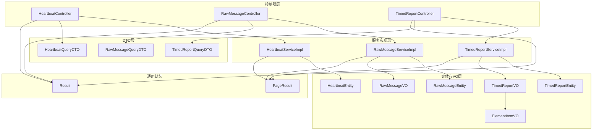
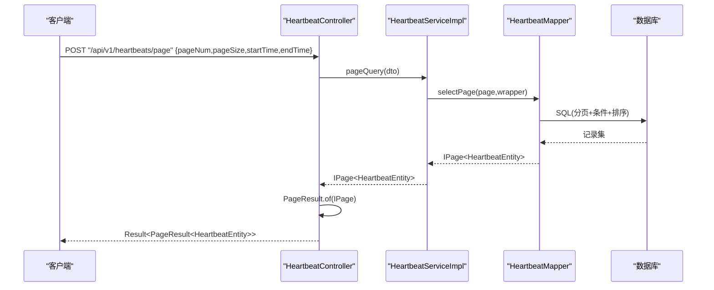
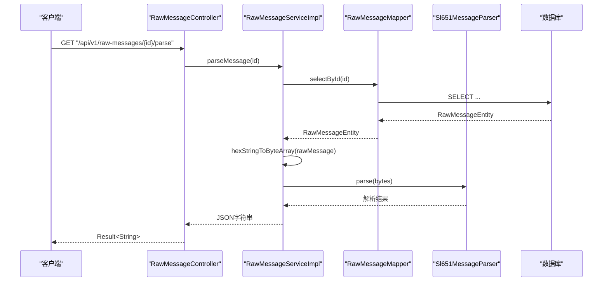
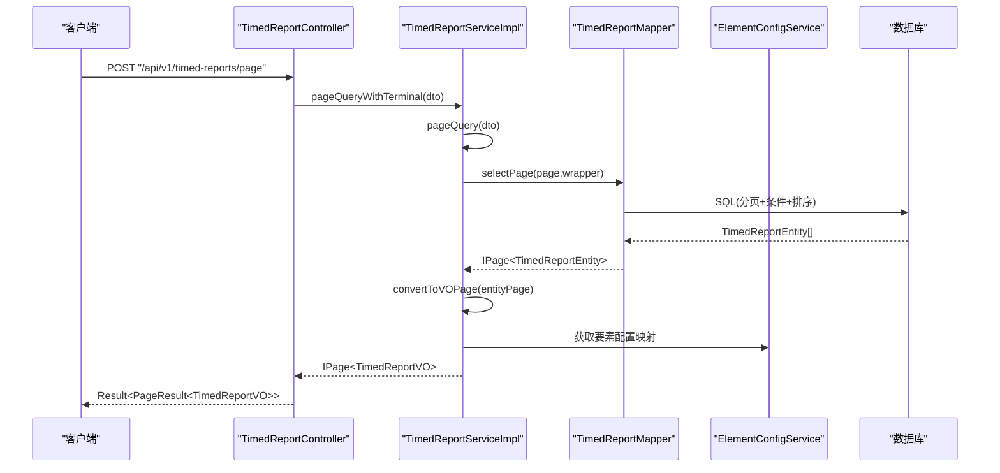
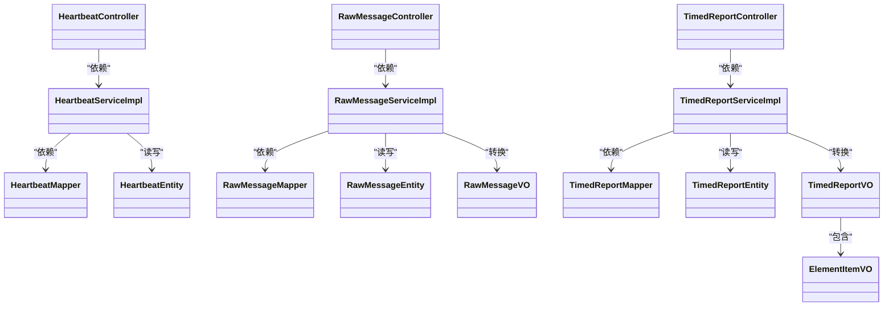

# 数据查询接口

<cite>
**本文引用的文件**
- [HeartbeatController.java](file://src/main/java/com/hydro/monitor/modules/controller/HeartbeatController.java)
- [RawMessageController.java](file://src/main/java/com/hydro/monitor/modules/controller/RawMessageController.java)
- [TimedReportController.java](file://src/main/java/com/hydro/monitor/modules/controller/TimedReportController.java)
- [HeartbeatQueryDTO.java](file://src/main/java/com/hydro/monitor/modules/dto/HeartbeatQueryDTO.java)
- [RawMessageQueryDTO.java](file://src/main/java/com/hydro/monitor/modules/dto/RawMessageQueryDTO.java)
- [TimedReportQueryDTO.java](file://src/main/java/com/hydro/monitor/modules/dto/TimedReportQueryDTO.java)
- [HeartbeatEntity.java](file://src/main/java/com/hydro/monitor/modules/entity/HeartbeatEntity.java)
- [RawMessageEntity.java](file://src/main/java/com/hydro/monitor/modules/entity/RawMessageEntity.java)
- [TimedReportEntity.java](file://src/main/java/com/hydro/monitor/modules/entity/TimedReportEntity.java)
- [RawMessageVO.java](file://src/main/java/com/hydro/monitor/modules/vo/RawMessageVO.java)
- [TimedReportVO.java](file://src/main/java/com/hydro/monitor/modules/vo/TimedReportVO.java)
- [ElementItemVO.java](file://src/main/java/com/hydro/monitor/modules/vo/ElementItemVO.java)
- [HeartbeatServiceImpl.java](file://src/main/java/com/hydro/monitor/modules/service/impl/HeartbeatServiceImpl.java)
- [RawMessageServiceImpl.java](file://src/main/java/com/hydro/monitor/modules/service/impl/RawMessageServiceImpl.java)
- [TimedReportServiceImpl.java](file://src/main/java/com/hydro/monitor/modules/service/impl/TimedReportServiceImpl.java)
- [PageResult.java](file://src/main/java/com/hydro/monitor/common/PageResult.java)
- [Result.java](file://src/main/java/com/hydro/monitor/common/Result.java)
</cite>

## 目录
1. [简介](#简介)
2. [项目结构](#项目结构)
3. [核心组件](#核心组件)
4. [架构总览](#架构总览)
5. [详细组件分析](#详细组件分析)
6. [依赖分析](#依赖分析)
7. [性能考虑](#性能考虑)
8. [故障排查指南](#故障排查指南)
9. [结论](#结论)
10. [附录](#附录)

## 简介
本文件面向“数据查询模块”的RESTful接口，覆盖以下三类查询能力：
- 心跳报文查询：支持按发报时间范围分页查询。
- 原始报文查询：支持按遥测站地址与功能码过滤、按接收时间倒序分页查询，并提供报文解析能力。
- 定时报文查询：支持按发报时间范围与遥测站地址过滤、按观测时间倒序分页查询；提供“所有站点最新”、“按站点最新”、“按站点分页”等多维度查询。

接口统一采用JSON请求/响应，分页结果通过通用包装类返回，便于前端统一处理。

## 项目结构
围绕查询接口的关键目录与文件如下：
- 控制器层：分别在心跳、原始报文、定时报模块下提供REST端点
- DTO层：封装查询请求参数
- 实体与VO层：描述数据库字段与对外展示字段
- 服务实现层：封装查询逻辑、分页与数据转换
- 通用响应与分页封装：Result与PageResult

图表来源
- [HeartbeatController.java:20-46](file://src/main/java/com/hydro/monitor/modules/controller/HeartbeatController.java#L20-L46)
- [RawMessageController.java:20-80](file://src/main/java/com/hydro/monitor/modules/controller/RawMessageController.java#L20-L80)
- [TimedReportController.java:20-110](file://src/main/java/com/hydro/monitor/modules/controller/TimedReportController.java#L20-L110)
- [HeartbeatQueryDTO.java:14-40](file://src/main/java/com/hydro/monitor/modules/dto/HeartbeatQueryDTO.java#L14-L40)
- [RawMessageQueryDTO.java:11-35](file://src/main/java/com/hydro/monitor/modules/dto/RawMessageQueryDTO.java#L11-L35)
- [TimedReportQueryDTO.java:14-46](file://src/main/java/com/hydro/monitor/modules/dto/TimedReportQueryDTO.java#L14-L46)
- [HeartbeatServiceImpl.java:37-57](file://src/main/java/com/hydro/monitor/modules/service/impl/HeartbeatServiceImpl.java#L37-L57)
- [RawMessageServiceImpl.java:54-79](file://src/main/java/com/hydro/monitor/modules/service/impl/RawMessageServiceImpl.java#L54-L79)
- [TimedReportServiceImpl.java:131-156](file://src/main/java/com/hydro/monitor/modules/service/impl/TimedReportServiceImpl.java#L131-L156)
- [HeartbeatEntity.java:15-49](file://src/main/java/com/hydro/monitor/modules/entity/HeartbeatEntity.java#L15-L49)
- [RawMessageEntity.java:15-54](file://src/main/java/com/hydro/monitor/modules/entity/RawMessageEntity.java#L15-L54)
- [TimedReportEntity.java:15-47](file://src/main/java/com/hydro/monitor/modules/entity/TimedReportEntity.java#L15-L47)
- [RawMessageVO.java:12-55](file://src/main/java/com/hydro/monitor/modules/vo/RawMessageVO.java#L12-L55)
- [TimedReportVO.java:13-57](file://src/main/java/com/hydro/monitor/modules/vo/TimedReportVO.java#L13-L57)
- [ElementItemVO.java:14-40](file://src/main/java/com/hydro/monitor/modules/vo/ElementItemVO.java#L14-L40)
- [PageResult.java:14-56](file://src/main/java/com/hydro/monitor/common/PageResult.java#L14-L56)
- [Result.java:11-78](file://src/main/java/com/hydro/monitor/common/Result.java#L11-L78)

章节来源
- [HeartbeatController.java:20-46](file://src/main/java/com/hydro/monitor/modules/controller/HeartbeatController.java#L20-L46)
- [RawMessageController.java:20-80](file://src/main/java/com/hydro/monitor/modules/controller/RawMessageController.java#L20-L80)
- [TimedReportController.java:20-110](file://src/main/java/com/hydro/monitor/modules/controller/TimedReportController.java#L20-L110)

## 核心组件
- 统一响应包装：Result，包含code、message、data，成功默认200，失败默认500。
- 分页结果包装：PageResult，包含current、size、total、pages、records。
- 查询控制器：分别暴露REST端点，接收JSON请求体或路径/查询参数，返回Result包裹的PageResult。
- 查询服务：实现分页查询、条件过滤、排序与VO转换。
- 数据模型：实体与VO分离，确保对外输出字段与内部存储字段解耦。

章节来源
- [Result.java:11-78](file://src/main/java/com/hydro/monitor/common/Result.java#L11-L78)
- [PageResult.java:14-56](file://src/main/java/com/hydro/monitor/common/PageResult.java#L14-L56)

## 架构总览
查询接口遵循典型的分层架构：Controller接收请求，Service执行业务逻辑，Mapper访问数据库，VO负责对外展示。分页查询通过MyBatis-Plus Page与IPage实现，支持条件过滤与排序。

图表来源
- [HeartbeatController.java:35-45](file://src/main/java/com/hydro/monitor/modules/controller/HeartbeatController.java#L35-L45)
- [HeartbeatServiceImpl.java:37-57](file://src/main/java/com/hydro/monitor/modules/service/impl/HeartbeatServiceImpl.java#L37-L57)

## 详细组件分析

### 心跳报文查询接口
- 方法与URL
  - POST /api/v1/heartbeats/page
- 请求参数（JSON）
  - pageNum: 页码（从1开始，默认1）
  - pageSize: 每页大小（默认20）
  - startTime: 发报时间起始（可选）
  - endTime: 发报时间结束（可选）
- 过滤与排序
  - 条件：按观测时间 observeTime 在 [startTime, endTime] 区间内
  - 排序：按观测时间倒序
- 响应
  - Result<PageResult<HeartbeatEntity>>
  - PageResult包含 total、pages、records 等
- 请求示例
  - POST /api/v1/heartbeats/page
  - Body:
    - {
      - "pageNum": 1,
      - "pageSize": 20,
      - "startTime": "2024-01-01 00:00:00",
      - "endTime": "2024-12-31 23:59:59"
      - }
- 响应示例
  - {
    - "code": 200,
    - "message": "success",
    - "data": {
      - "current": 1,
      - "size": 20,
      - "total": 1000,
      - "pages": 50,
      - "records": [
        - {
          - "id": 10001,
          - "stationAddress": "ST001",
          - "observeTime": "2024-12-31 23:59:59",
          - "voltage": 13.2,
          - "rawMessage": "7E01...",
          - "receiveTime": "2024-12-31 23:59:59"
          - },
        - ...
        - ]
      - }
      - }
- 数据格式说明
  - HeartbeatEntity 字段：id、stationAddress、observeTime、voltage、rawMessage、receiveTime
- 性能与使用建议
  - 明确 startTime 与 endTime 可显著缩小扫描范围
  - 合理设置 pageSize，避免过大导致内存压力
  - 仅在必要时传入时间范围，减少数据库索引无效扫描

章节来源
- [HeartbeatController.java:35-45](file://src/main/java/com/hydro/monitor/modules/controller/HeartbeatController.java#L35-L45)
- [HeartbeatQueryDTO.java:14-40](file://src/main/java/com/hydro/monitor/modules/dto/HeartbeatQueryDTO.java#L14-L40)
- [HeartbeatServiceImpl.java:37-57](file://src/main/java/com/hydro/monitor/modules/service/impl/HeartbeatServiceImpl.java#L37-L57)
- [HeartbeatEntity.java:15-49](file://src/main/java/com/hydro/monitor/modules/entity/HeartbeatEntity.java#L15-L49)

### 原始报文查询接口
- 方法与URL
  - POST /api/v1/raw-messages/page
  - GET /api/v1/raw-messages/{id}
  - GET /api/v1/raw-messages/{id}/parse
- 请求参数（JSON）
  - pageNum: 页码（从1开始，默认1）
  - pageSize: 每页大小（默认20）
  - stationAddress: 遥测站地址（可选）
  - functionCode: 功能码（可选）
- 过滤与排序
  - 条件：stationAddress 精确匹配；functionCode 精确匹配
  - 排序：按接收时间 receiveTime 倒序
- 响应
  - POST /page 返回 Result<PageResult<RawMessageVO>>
  - GET /{id} 返回 Result<RawMessageVO>
  - GET /{id}/parse 返回 Result<String>（解析后的JSON字符串）
- 请求示例
  - POST /api/v1/raw-messages/page
  - Body:
    - {
      - "pageNum": 1,
      - "pageSize": 20,
      - "stationAddress": "ST001",
      - "functionCode": 1
      - }
- 响应示例
  - POST /page
  - {
    - "code": 200,
    - "message": "success",
    - "data": {
      - "current": 1,
      - "size": 20,
      - "total": 500,
      - "pages": 25,
      - "records": [
        - {
          - "id": 10001,
          - "stationAddress": "ST001",
          - "functionCode": 1,
          - "directionFlag": 0,
          - "rawMessage": "7E01...",
          - "receiveTime": "2024-12-31 23:59:59",
          - "createTime": "2024-12-31 23:59:59"
          - },
        - ...
        - ]
      - }
      - }
- 数据格式说明
  - RawMessageEntity 字段：id、stationAddress、functionCode、directionFlag、rawMessage、receiveTime、createTime
  - RawMessageVO 字段：id、stationAddress、functionCode、directionFlag、rawMessage、receiveTime、createTime
- 报文解析流程
  - 将十六进制字符串转为字节数组
  - 调用协议解析器解析为结构化数据
  - 序列化为JSON字符串返回

图表来源
- [RawMessageController.java:71-79](file://src/main/java/com/hydro/monitor/modules/controller/RawMessageController.java#L71-L79)
- [RawMessageServiceImpl.java:90-110](file://src/main/java/com/hydro/monitor/modules/service/impl/RawMessageServiceImpl.java#L90-L110)

章节来源
- [RawMessageController.java:35-80](file://src/main/java/com/hydro/monitor/modules/controller/RawMessageController.java#L35-L80)
- [RawMessageQueryDTO.java:11-35](file://src/main/java/com/hydro/monitor/modules/dto/RawMessageQueryDTO.java#L11-L35)
- [RawMessageServiceImpl.java:54-110](file://src/main/java/com/hydro/monitor/modules/service/impl/RawMessageServiceImpl.java#L54-L110)
- [RawMessageEntity.java:15-54](file://src/main/java/com/hydro/monitor/modules/entity/RawMessageEntity.java#L15-L54)
- [RawMessageVO.java:12-55](file://src/main/java/com/hydro/monitor/modules/vo/RawMessageVO.java#L12-L55)

### 定时报文查询接口
- 方法与URL
  - POST /api/v1/timed-reports/page
  - GET /api/v1/timed-reports/latest
  - GET /api/v1/timed-reports/station/{stationAddress}
  - GET /api/v1/timed-reports/station/{stationAddress}/latest
- 请求参数（JSON 或 路径/查询参数）
  - POST /page:
    - pageNum: 页码（从1开始，默认1）
    - pageSize: 每页大小（默认20）
    - startTime: 发报时间起始（可选）
    - endTime: 发报时间结束（可选）
    - stationAddress: 遥测站地址（可选）
  - GET /latest:
    - pageNum、pageSize（默认1、20）
  - GET /station/{stationAddress}:
    - pageNum、pageSize（默认1、20）
  - GET /station/{stationAddress}/latest:
    - 无参数
- 过滤与排序
  - POST /page：按观测时间 observeTime 在 [startTime, endTime] 区间内，且 stationAddress 精确匹配
  - GET /latest：按观测时间倒序，每个站点取最新记录（子查询按最大ID分组）
  - GET /station/{stationAddress}：按观测时间倒序
  - GET /station/{stationAddress}/latest：按观测时间倒序取第一条
- 响应
  - POST /page、GET /latest、GET /station/{stationAddress}：Result<PageResult<TimedReportVO>>
  - GET /station/{stationAddress}/latest：Result<TimedReportVO>（若无数据返回错误）
- 请求示例
  - POST /api/v1/timed-reports/page
  - Body:
    - {
      - "pageNum": 1,
      - "pageSize": 20,
      - "startTime": "2024-01-01 00:00:00",
      - "endTime": "2024-12-31 23:59:59",
      - "stationAddress": "ST001"
      - }
- 响应示例
  - POST /page
  - {
    - "code": 200,
    - "message": "success",
    - "data": {
      - "current": 1,
      - "size": 20,
      - "total": 1000,
      - "pages": 50,
      - "records": [
        - {
          - "id": 10001,
          - "stationAddress": "ST001",
          - "stationName": "站点A",
          - "onlineStatus": 1,
          - "observeTime": "2024-12-31 23:59:59",
          - "receiveTime": "2024-12-31 23:59:59",
          - "elementSet": [
            - {
              - "elementCode": "pn05",
              - "elementName": "5分钟时段降雨量",
              - "value": 2.5,
              - "unit": "mm"
              - },
            - ...
            - ]
          - },
        - ...
        - ]
      - }
      - }
- 数据格式说明
  - TimedReportEntity 字段：id、stationAddress、observeTime、receiveTime、elementSet(JSON)
  - TimedReportVO 字段：id、stationAddress、stationName、onlineStatus、observeTime、receiveTime、elementSet(List<ElementItemVO>)
  - ElementItemVO 字段：elementCode、elementName、value(BigDecimal)、unit

图表来源
- [TimedReportController.java:36-46](file://src/main/java/com/hydro/monitor/modules/controller/TimedReportController.java#L36-L46)
- [TimedReportServiceImpl.java:131-156](file://src/main/java/com/hydro/monitor/modules/service/impl/TimedReportServiceImpl.java#L131-L156)

章节来源
- [TimedReportController.java:36-110](file://src/main/java/com/hydro/monitor/modules/controller/TimedReportController.java#L36-L110)
- [TimedReportQueryDTO.java:14-46](file://src/main/java/com/hydro/monitor/modules/dto/TimedReportQueryDTO.java#L14-L46)
- [TimedReportServiceImpl.java:55-103](file://src/main/java/com/hydro/monitor/modules/service/impl/TimedReportServiceImpl.java#L55-L103)
- [TimedReportEntity.java:15-47](file://src/main/java/com/hydro/monitor/modules/entity/TimedReportEntity.java#L15-L47)
- [TimedReportVO.java:13-57](file://src/main/java/com/hydro/monitor/modules/vo/TimedReportVO.java#L13-L57)
- [ElementItemVO.java:14-40](file://src/main/java/com/hydro/monitor/modules/vo/ElementItemVO.java#L14-L40)

## 依赖分析
- 控制器依赖服务实现，服务实现依赖Mapper与外部解析器/服务
- 分页查询通过MyBatis-Plus Page与LambdaQueryWrapper构建条件
- VO转换在服务层完成，避免控制器直接操作实体
- 统一响应Result与分页包装PageResult贯穿所有查询接口

图表来源
- [HeartbeatController.java:25-45](file://src/main/java/com/hydro/monitor/modules/controller/HeartbeatController.java#L25-L45)
- [RawMessageController.java:25-80](file://src/main/java/com/hydro/monitor/modules/controller/RawMessageController.java#L25-L80)
- [TimedReportController.java:25-110](file://src/main/java/com/hydro/monitor/modules/controller/TimedReportController.java#L25-L110)
- [HeartbeatServiceImpl.java:22-57](file://src/main/java/com/hydro/monitor/modules/service/impl/HeartbeatServiceImpl.java#L22-L57)
- [RawMessageServiceImpl.java:24-110](file://src/main/java/com/hydro/monitor/modules/service/impl/RawMessageServiceImpl.java#L24-L110)
- [TimedReportServiceImpl.java:33-183](file://src/main/java/com/hydro/monitor/modules/service/impl/TimedReportServiceImpl.java#L33-L183)
- [HeartbeatEntity.java:15-49](file://src/main/java/com/hydro/monitor/modules/entity/HeartbeatEntity.java#L15-L49)
- [RawMessageEntity.java:15-54](file://src/main/java/com/hydro/monitor/modules/entity/RawMessageEntity.java#L15-L54)
- [TimedReportEntity.java:15-47](file://src/main/java/com/hydro/monitor/modules/entity/TimedReportEntity.java#L15-L47)
- [RawMessageVO.java:12-55](file://src/main/java/com/hydro/monitor/modules/vo/RawMessageVO.java#L12-L55)
- [TimedReportVO.java:13-57](file://src/main/java/com/hydro/monitor/modules/vo/TimedReportVO.java#L13-L57)
- [ElementItemVO.java:14-40](file://src/main/java/com/hydro/monitor/modules/vo/ElementItemVO.java#L14-L40)

## 性能考虑
- 分页策略
  - 合理设置 pageNum 与 pageSize，避免超大页码或超大每页数量
  - 优先使用时间范围过滤，缩小扫描范围
- 查询优化
  - 心跳与定时报文按观测时间倒序，建议在 observeTime 建立索引
  - 原始报文按接收时间倒序，建议在 receiveTime 建立索引
  - stationAddress 精确过滤时建议建立组合索引（stationAddress, observeTime/receiveTime）
- 数据转换
  - 定时报文VO转换涉及要素配置与JSON解析，建议缓存要素配置映射以降低重复查询成本
- 大数据量处理
  - 使用时间窗口分片查询，避免一次性拉取过长周期
  - 对于“所有站点最新”场景，利用子查询按最大ID分组，减少全表扫描
- 报文解析
  - 解析过程为CPU密集型，建议异步化或限流，避免阻塞请求线程

## 故障排查指南
- 常见错误与定位
  - 参数非法：pageNum/pageSize 小于1会被重置为默认值；stationAddress为空会触发参数校验异常
  - 数据不存在：查询单条原始报文或定时报文时，若ID或站点不存在，服务层抛出运行时异常
  - 解析失败：原始报文解析异常时，服务层记录错误日志并抛出运行时异常
- 日志与追踪
  - 控制器与服务层均记录关键请求参数与处理日志，便于问题定位
- 响应状态
  - 成功：code=200，message="success"
  - 失败：code=500，message=错误信息

章节来源
- [RawMessageServiceImpl.java:82-110](file://src/main/java/com/hydro/monitor/modules/service/impl/RawMessageServiceImpl.java#L82-L110)
- [TimedReportServiceImpl.java:158-183](file://src/main/java/com/hydro/monitor/modules/service/impl/TimedReportServiceImpl.java#L158-L183)
- [Result.java:52-77](file://src/main/java/com/hydro/monitor/common/Result.java#L52-L77)

## 结论
本查询模块提供了统一的REST接口，覆盖心跳、原始报文与定时报文三大类数据的分页查询需求。通过DTO参数化、服务层分页与条件过滤、VO转换与统一响应包装，实现了清晰的职责分离与良好的扩展性。配合合理的索引与分页策略，可在大数据量场景下保持稳定性能。

## 附录
- 统一响应结构
  - 成功：{ "code": 200, "message": "success", "data": ... }
  - 失败：{ "code": 500, "message": "...", "data": null }
- 分页结构
  - { "current": 1, "size": 20, "total": 1000, "pages": 50, "records": [...] }