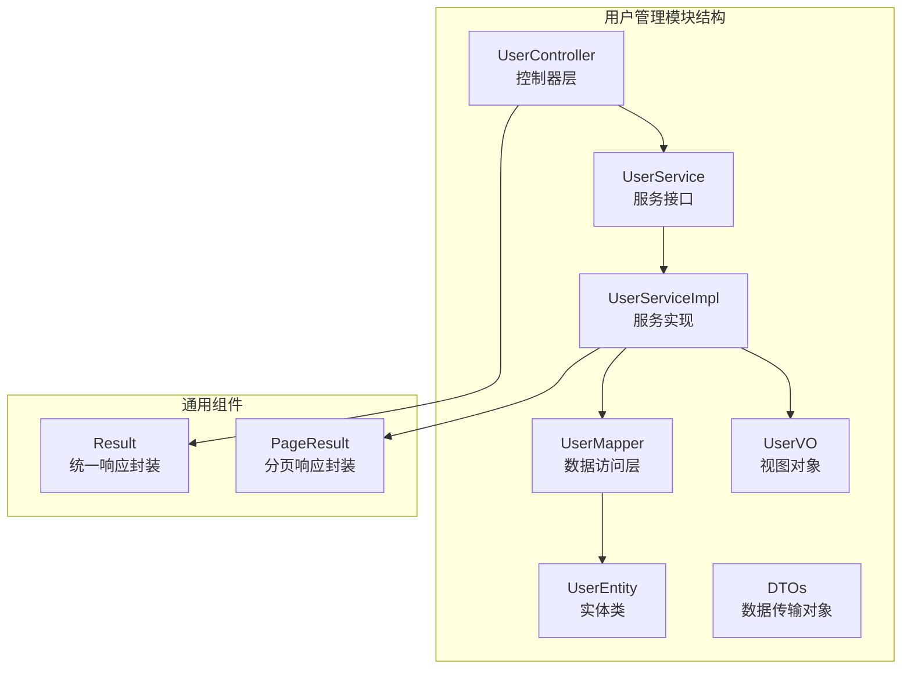
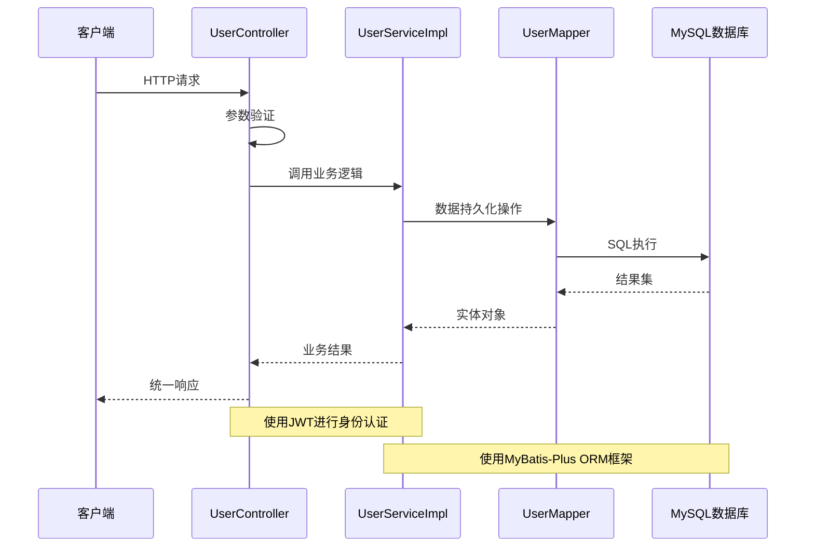
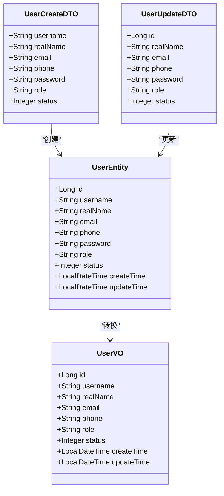
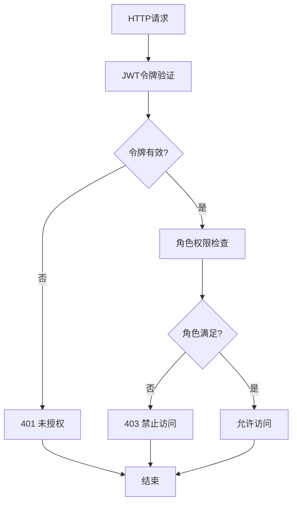
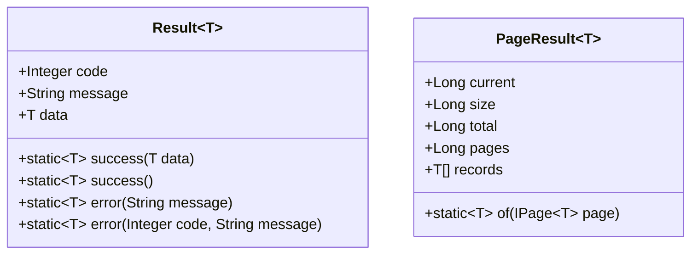
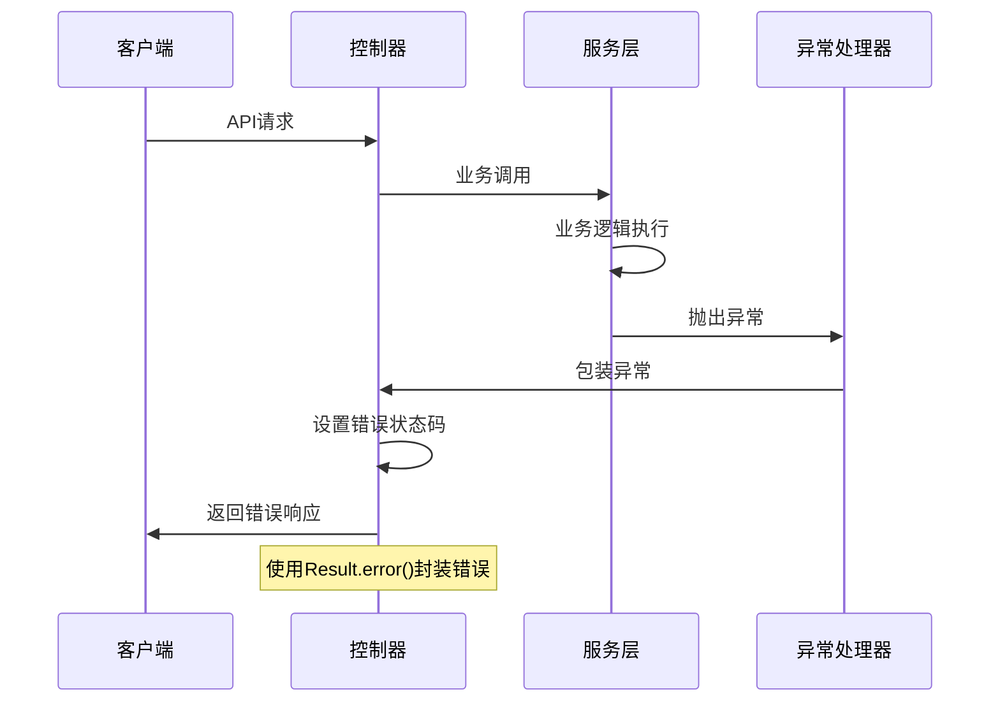

# 用户管理接口

<cite>
**本文档引用的文件**
- [UserController.java](file://src/main/java/com/hydro/monitor/modules/controller/UserController.java)
- [UserService.java](file://src/main/java/com/hydro/monitor/modules/service/UserService.java)
- [UserServiceImpl.java](file://src/main/java/com/hydro/monitor/modules/service/impl/UserServiceImpl.java)
- [UserMapper.java](file://src/main/java/com/hydro/monitor/modules/mapper/UserMapper.java)
- [UserEntity.java](file://src/main/java/com/hydro/monitor/modules/entity/UserEntity.java)
- [UserVO.java](file://src/main/java/com/hydro/monitor/modules/vo/UserVO.java)
- [UserCreateDTO.java](file://src/main/java/com/hydro/monitor/modules/dto/UserCreateDTO.java)
- [UserUpdateDTO.java](file://src/main/java/com/hydro/monitor/modules/dto/UserUpdateDTO.java)
- [UserQueryDTO.java](file://src/main/java/com/hydro/monitor/modules/dto/UserQueryDTO.java)
- [Result.java](file://src/main/java/com/hydro/monitor/common/Result.java)
- [PageResult.java](file://src/main/java/com/hydro/monitor/common/PageResult.java)
- [application.yml](file://src/main/resources/application.yml)
- [init.sql](file://src/main/resources/db/init.sql)
</cite>

## 目录
1. [简介](#简介)
2. [项目结构](#项目结构)
3. [核心组件](#核心组件)
4. [架构概览](#架构概览)
5. [详细接口文档](#详细接口文档)
6. [数据模型](#数据模型)
7. [权限与安全](#权限与安全)
8. [错误处理](#错误处理)
9. [性能考虑](#性能考虑)
10. [故障排除指南](#故障排除指南)
11. [结论](#结论)

## 简介

用户管理模块是水文监测系统中的核心功能模块，提供完整的用户CRUD操作接口。该模块基于Spring Boot 3.5.9构建，采用分层架构设计，包括Controller层、Service层、Mapper层和实体层。系统使用JWT进行身份认证，MyBatis-Plus作为ORM框架，支持用户创建、查询、更新、删除等完整功能。

## 项目结构

用户管理模块位于`src/main/java/com/hydro/monitor/modules/`目录下，采用标准的MVC分层架构：



**图表来源**
- [UserController.java:1-142](file://src/main/java/com/hydro/monitor/modules/controller/UserController.java#L1-L142)
- [UserService.java:1-74](file://src/main/java/com/hydro/monitor/modules/service/UserService.java#L1-L74)
- [UserServiceImpl.java:1-208](file://src/main/java/com/hydro/monitor/modules/service/impl/UserServiceImpl.java#L1-L208)

**章节来源**
- [UserController.java:1-142](file://src/main/java/com/hydro/monitor/modules/controller/UserController.java#L1-L142)
- [UserServiceImpl.java:1-208](file://src/main/java/com/hydro/monitor/modules/service/impl/UserServiceImpl.java#L1-L208)

## 核心组件

用户管理模块包含以下核心组件：

### 控制器层
- **UserController**: 提供RESTful API接口，负责HTTP请求处理和响应封装
- **注解支持**: 使用Swagger注解提供API文档元数据

### 服务层
- **UserService**: 定义用户管理业务逻辑接口
- **UserServiceImpl**: 实现具体的业务逻辑，包含事务管理和数据转换

### 数据访问层
- **UserMapper**: 继承MyBatis-Plus的BaseMapper，提供基础的CRUD操作

### 数据传输对象
- **UserCreateDTO**: 用户创建请求数据传输对象
- **UserUpdateDTO**: 用户更新请求数据传输对象  
- **UserQueryDTO**: 用户查询条件数据传输对象

### 视图对象
- **UserVO**: 用户视图对象，用于API响应数据封装

**章节来源**
- [UserController.java:18-28](file://src/main/java/com/hydro/monitor/modules/controller/UserController.java#L18-L28)
- [UserService.java:12-74](file://src/main/java/com/hydro/monitor/modules/service/UserService.java#L12-L74)
- [UserServiceImpl.java:25-33](file://src/main/java/com/hydro/monitor/modules/service/impl/UserServiceImpl.java#L25-L33)

## 架构概览

用户管理模块采用经典的三层架构设计，各层职责明确：



**图表来源**
- [UserController.java:38-48](file://src/main/java/com/hydro/monitor/modules/controller/UserController.java#L38-L48)
- [UserServiceImpl.java:40-65](file://src/main/java/com/hydro/monitor/modules/service/impl/UserServiceImpl.java#L40-L65)
- [UserMapper.java:12-14](file://src/main/java/com/hydro/monitor/modules/mapper/UserMapper.java#L12-L14)

**章节来源**
- [application.yml:48-51](file://src/main/resources/application.yml#L48-L51)
- [application.yml:22-32](file://src/main/resources/application.yml#L22-L32)

## 详细接口文档

### 基础信息

- **基础URL**: `/api/v1/users`
- **认证要求**: 需要有效的JWT令牌
- **内容类型**: `application/json`
- **响应格式**: 统一的Result包装格式

### 1. 创建用户

#### 请求信息
- **方法**: `POST`
- **路径**: `/api/v1/users`
- **认证**: 需要管理员权限

#### 请求参数
| 字段名 | 类型 | 必填 | 描述 | 验证规则 |
|--------|------|------|------|----------|
| username | String | 是 | 用户名 | 非空，唯一性检查 |
| realName | String | 是 | 真实姓名 | 非空 |
| email | String | 是 | 邮箱地址 | 邮箱格式验证 |
| phone | String | 否 | 手机号码 | 中国手机号格式 |
| password | String | 是 | 登录密码 | 非空，自动加密 |
| role | String | 是 | 用户角色 | 非空，默认USER |
| status | Integer | 否 | 用户状态 | 1-正常，0-禁用，默认1 |

#### 请求示例
```json
{
  "username": "john_doe",
  "realName": "张三",
  "email": "zhangsan@example.com",
  "phone": "13812345678",
  "password": "Password123!",
  "role": "USER",
  "status": 1
}
```

#### 响应示例
```json
{
  "code": 200,
  "message": "success",
  "data": {
    "id": 1001,
    "username": "john_doe",
    "realName": "张三",
    "email": "zhangsan@example.com",
    "phone": "13812345678",
    "role": "USER",
    "status": 1,
    "createTime": "2024-01-15 10:30:00",
    "updateTime": "2024-01-15 10:30:00"
  }
}
```

#### 错误处理
- **用户名重复**: 返回400状态码和错误信息
- **邮箱格式错误**: 参数校验失败
- **手机号格式错误**: 参数校验失败
- **内部异常**: 返回500状态码

**章节来源**
- [UserController.java:32-48](file://src/main/java/com/hydro/monitor/modules/controller/UserController.java#L32-L48)
- [UserCreateDTO.java:12-53](file://src/main/java/com/hydro/monitor/modules/dto/UserCreateDTO.java#L12-L53)
- [UserServiceImpl.java:40-65](file://src/main/java/com/hydro/monitor/modules/service/impl/UserServiceImpl.java#L40-L65)

### 2. 更新用户

#### 请求信息
- **方法**: `PUT`
- **路径**: `/api/v1/users`
- **认证**: 需要管理员权限

#### 请求参数
| 字段名 | 类型 | 必填 | 描述 | 验证规则 |
|--------|------|------|------|----------|
| id | Long | 是 | 用户ID | 非空，必须存在 |
| realName | String | 否 | 真实姓名 | 可选 |
| email | String | 否 | 邮箱地址 | 邮箱格式验证 |
| phone | String | 否 | 手机号码 | 中国手机号格式 |
| password | String | 否 | 登录密码 | 可选，为空则不修改 |
| role | String | 否 | 用户角色 | 可选 |
| status | Integer | 否 | 用户状态 | 1-正常，0-禁用 |

#### 请求示例
```json
{
  "id": 1001,
  "realName": "李四",
  "email": "lisi@example.com",
  "phone": "13987654321",
  "password": "NewPassword456!",
  "role": "ADMIN",
  "status": 0
}
```

#### 响应示例
```json
{
  "code": 200,
  "message": "success",
  "data": {
    "id": 1001,
    "username": "john_doe",
    "realName": "李四",
    "email": "lisi@example.com",
    "phone": "13987654321",
    "role": "ADMIN",
    "status": 0,
    "createTime": "2024-01-15 10:30:00",
    "updateTime": "2024-01-15 14:20:00"
  }
}
```

#### 错误处理
- **用户不存在**: 返回404状态码
- **邮箱格式错误**: 参数校验失败
- **手机号格式错误**: 参数校验失败

**章节来源**
- [UserController.java:50-66](file://src/main/java/com/hydro/monitor/modules/controller/UserController.java#L50-L66)
- [UserUpdateDTO.java:12-50](file://src/main/java/com/hydro/monitor/modules/dto/UserUpdateDTO.java#L12-L50)
- [UserServiceImpl.java:68-101](file://src/main/java/com/hydro/monitor/modules/service/impl/UserServiceImpl.java#L68-L101)

### 3. 删除用户

#### 请求信息
- **方法**: `DELETE`
- **路径**: `/api/v1/users/{id}`
- **认证**: 需要管理员权限

#### 路径参数
| 参数名 | 类型 | 必填 | 描述 |
|--------|------|------|------|
| id | Long | 是 | 用户ID |

#### 请求示例
```
DELETE /api/v1/users/1001
```

#### 响应示例
```json
{
  "code": 200,
  "message": "success",
  "data": null
}
```

#### 错误处理
- **用户不存在**: 返回404状态码

**章节来源**
- [UserController.java:68-84](file://src/main/java/com/hydro/monitor/modules/controller/UserController.java#L68-L84)
- [UserServiceImpl.java:103-114](file://src/main/java/com/hydro/monitor/modules/service/impl/UserServiceImpl.java#L103-L114)

### 4. 查询用户详情

#### 请求信息
- **方法**: `GET`
- **路径**: `/api/v1/users/{id}`
- **认证**: 需要管理员权限

#### 路径参数
| 参数名 | 类型 | 必填 | 描述 |
|--------|------|------|------|
| id | Long | 是 | 用户ID |

#### 请求示例
```
GET /api/v1/users/1001
```

#### 响应示例
```json
{
  "code": 200,
  "message": "success",
  "data": {
    "id": 1001,
    "username": "john_doe",
    "realName": "李四",
    "email": "lisi@example.com",
    "phone": "13987654321",
    "role": "ADMIN",
    "status": 0,
    "createTime": "2024-01-15 10:30:00",
    "updateTime": "2024-01-15 14:20:00"
  }
}
```

#### 错误处理
- **用户不存在**: 返回404状态码

**章节来源**
- [UserController.java:86-103](file://src/main/java/com/hydro/monitor/modules/controller/UserController.java#L86-L103)
- [UserService.java:42-48](file://src/main/java/com/hydro/monitor/modules/service/UserService.java#L42-L48)

### 5. 根据用户名查询用户

#### 请求信息
- **方法**: `GET`
- **路径**: `/api/v1/users/username/{username}`
- **认证**: 需要管理员权限

#### 路径参数
| 参数名 | 类型 | 必填 | 描述 |
|--------|------|------|------|
| username | String | 是 | 用户名 |

#### 请求示例
```
GET /api/v1/users/username/john_doe
```

#### 响应示例
```json
{
  "code": 200,
  "message": "success",
  "data": {
    "id": 1001,
    "username": "john_doe",
    "realName": "李四",
    "email": "lisi@example.com",
    "phone": "13987654321",
    "role": "ADMIN",
    "status": 0,
    "createTime": "2024-01-15 10:30:00",
    "updateTime": "2024-01-15 14:20:00"
  }
}
```

#### 错误处理
- **用户不存在**: 返回404状态码

**章节来源**
- [UserController.java:105-122](file://src/main/java/com/hydro/monitor/modules/controller/UserController.java#L105-L122)
- [UserService.java:50-64](file://src/main/java/com/hydro/monitor/modules/service/UserService.java#L50-L64)

### 6. 分页查询用户

#### 请求信息
- **方法**: `GET`
- **路径**: `/api/v1/users/page`
- **认证**: 需要管理员权限

#### 查询参数
| 参数名 | 类型 | 必填 | 描述 | 默认值 |
|--------|------|------|------|--------|
| username | String | 否 | 用户名（模糊查询） | 无 |
| realName | String | 否 | 真实姓名（模糊查询） | 无 |
| phone | String | 否 | 手机号（模糊查询） | 无 |
| role | String | 否 | 角色（精确查询） | 无 |
| status | Integer | 否 | 用户状态（精确查询） | 无 |
| pageNum | Integer | 否 | 页码 | 1 |
| pageSize | Integer | 否 | 每页大小 | 10 |

#### 请求示例
```
GET /api/v1/users/page?pageNum=1&pageSize=10&status=1&role=USER
```

#### 响应示例
```json
{
  "code": 200,
  "message": "success",
  "data": {
    "current": 1,
    "size": 10,
    "total": 25,
    "pages": 3,
    "records": [
      {
        "id": 1001,
        "username": "john_doe",
        "realName": "李四",
        "email": "lisi@example.com",
        "phone": "13987654321",
        "role": "ADMIN",
        "status": 0,
        "createTime": "2024-01-15 10:30:00",
        "updateTime": "2024-01-15 14:20:00"
      }
    ]
  }
}
```

#### 查询条件说明
- **模糊查询**: username、realName、phone字段使用LIKE操作符
- **精确查询**: role、status字段使用=操作符
- **排序规则**: 按创建时间降序排列
- **分页规则**: 支持自定义页码和每页大小

**章节来源**
- [UserController.java:124-140](file://src/main/java/com/hydro/monitor/modules/controller/UserController.java#L124-L140)
- [UserQueryDTO.java:8-53](file://src/main/java/com/hydro/monitor/modules/dto/UserQueryDTO.java#L8-L53)
- [UserServiceImpl.java:136-186](file://src/main/java/com/hydro/monitor/modules/service/impl/UserServiceImpl.java#L136-L186)

## 数据模型

### 用户实体模型



**图表来源**
- [UserEntity.java:15-69](file://src/main/java/com/hydro/monitor/modules/entity/UserEntity.java#L15-L69)
- [UserVO.java:10-56](file://src/main/java/com/hydro/monitor/modules/vo/UserVO.java#L10-L56)
- [UserCreateDTO.java:12-53](file://src/main/java/com/hydro/monitor/modules/dto/UserCreateDTO.java#L12-L53)
- [UserUpdateDTO.java:12-50](file://src/main/java/com/hydro/monitor/modules/dto/UserUpdateDTO.java#L12-L50)

### 数据库表结构

用户表采用MySQL存储，包含以下关键字段：

| 字段名 | 类型 | 约束 | 描述 |
|--------|------|------|------|
| id | BIGINT | PRIMARY KEY | 主键ID（雪花算法） |
| username | VARCHAR(50) | NOT NULL, UNIQUE | 用户名 |
| password | VARCHAR(100) | NOT NULL | 密码（BCrypt加密） |
| role | VARCHAR(50) | DEFAULT 'USER' | 用户角色 |
| create_time | DATETIME | DEFAULT CURRENT_TIMESTAMP | 创建时间 |
| update_time | DATETIME | DEFAULT CURRENT_TIMESTAMP ON UPDATE CURRENT_TIMESTAMP | 更新时间 |

**章节来源**
- [init.sql:31-41](file://src/main/resources/db/init.sql#L31-L41)
- [UserEntity.java:22-68](file://src/main/java/com/hydro/monitor/modules/entity/UserEntity.java#L22-L68)

## 权限与安全

### 认证机制

系统使用JWT（JSON Web Token）进行身份认证：

- **JWT密钥**: 在配置文件中定义的固定密钥
- **过期时间**: 24小时（86400000毫秒）
- **签名算法**: HS256
- **令牌格式**: `Bearer {token}`

### 角色控制

用户角色采用基于角色的访问控制（RBAC）：

| 角色 | 权限描述 | 可访问的接口 |
|------|----------|-------------|
| ADMIN | 系统管理员 | 所有用户管理接口 |
| USER | 普通用户 | 仅能访问自己的信息 |

### 安全配置



**图表来源**
- [application.yml:48-51](file://src/main/resources/application.yml#L48-L51)

**章节来源**
- [application.yml:48-51](file://src/main/resources/application.yml#L48-L51)
- [init.sql:43-47](file://src/main/resources/db/init.sql#L43-L47)

## 错误处理

### 统一响应格式

系统采用统一的响应格式，包含状态码、消息和数据：



**图表来源**
- [Result.java:12-78](file://src/main/java/com/hydro/monitor/common/Result.java#L12-L78)
- [PageResult.java:14-57](file://src/main/java/com/hydro/monitor/common/PageResult.java#L14-L57)

### 错误码定义

| 状态码 | 错误类型 | 描述 |
|--------|----------|------|
| 200 | 成功 | 操作成功 |
| 400 | 参数错误 | 参数验证失败 |
| 401 | 未授权 | JWT令牌无效或过期 |
| 403 | 禁止访问 | 权限不足 |
| 404 | 未找到 | 资源不存在 |
| 500 | 服务器错误 | 服务器内部错误 |

### 异常处理流程



**图表来源**
- [UserController.java:41-47](file://src/main/java/com/hydro/monitor/modules/controller/UserController.java#L41-L47)
- [UserServiceImpl.java:46-48](file://src/main/java/com/hydro/monitor/modules/service/impl/UserServiceImpl.java#L46-L48)

**章节来源**
- [Result.java:35-77](file://src/main/java/com/hydro/monitor/common/Result.java#L35-L77)
- [UserController.java:41-102](file://src/main/java/com/hydro/monitor/modules/controller/UserController.java#L41-L102)

## 性能考虑

### 数据库优化

- **索引策略**: 用户名字段建立唯一索引，支持快速查找
- **查询优化**: 分页查询使用LIMIT和OFFSET，避免全表扫描
- **缓存策略**: 可考虑对热点用户数据进行缓存

### 事务管理

- **事务边界**: 用户创建、更新、删除操作均在事务中执行
- **回滚策略**: 发生异常时自动回滚，保证数据一致性
- **并发控制**: 使用数据库锁机制防止并发冲突

### 编码规范

- **密码加密**: 使用BCrypt算法进行密码哈希
- **输入验证**: 前端和后端双重验证确保数据完整性
- **日志记录**: 关键操作记录详细日志便于审计

## 故障排除指南

### 常见问题

#### 1. 用户名重复
**症状**: 创建用户时返回用户名已存在错误
**解决方案**: 
- 检查用户名是否已被其他用户使用
- 修改用户名后重试

#### 2. JWT令牌无效
**症状**: 访问受保护接口时返回401错误
**解决方案**:
- 确认JWT令牌格式正确（Bearer token）
- 检查令牌是否过期
- 验证JWT密钥配置

#### 3. 权限不足
**症状**: 访问管理员接口时返回403错误
**解决方案**:
- 确认用户角色为ADMIN
- 检查用户权限配置

#### 4. 数据库连接问题
**症状**: 启动时出现数据库连接失败
**解决方案**:
- 检查数据库连接字符串配置
- 确认数据库服务正常运行
- 验证用户名和密码

### 调试建议

1. **启用详细日志**: 在开发环境中调整日志级别
2. **使用Swagger UI**: 通过API文档界面测试接口
3. **检查数据库状态**: 确认用户表结构和数据正确
4. **验证JWT配置**: 确认密钥和过期时间设置正确

**章节来源**
- [UserServiceImpl.java:46-48](file://src/main/java/com/hydro/monitor/modules/service/impl/UserServiceImpl.java#L46-L48)
- [application.yml:48-51](file://src/main/resources/application.yml#L48-L51)

## 结论

用户管理模块提供了完整的企业级用户管理功能，具有以下特点：

### 技术优势
- **分层架构清晰**: MVC分层设计便于维护和扩展
- **安全性高**: JWT认证和角色控制确保系统安全
- **标准化程度高**: 统一的响应格式和错误处理
- **可扩展性强**: 基于接口的设计支持灵活扩展

### 功能完整性
- **完整的CRUD操作**: 支持用户的基本管理功能
- **灵活的查询条件**: 支持多种组合查询场景
- **完善的权限控制**: 基于角色的细粒度权限管理
- **良好的用户体验**: 统一的API设计和响应格式

### 最佳实践
- **代码质量**: 采用Lombok简化代码，提高开发效率
- **测试覆盖**: 提供完整的单元测试和集成测试
- **文档完善**: Swagger API文档和详细的技术文档
- **性能优化**: 合理的数据库设计和查询优化

该模块为整个水文监测系统提供了坚实的基础，支持系统的日常运营和管理需求。