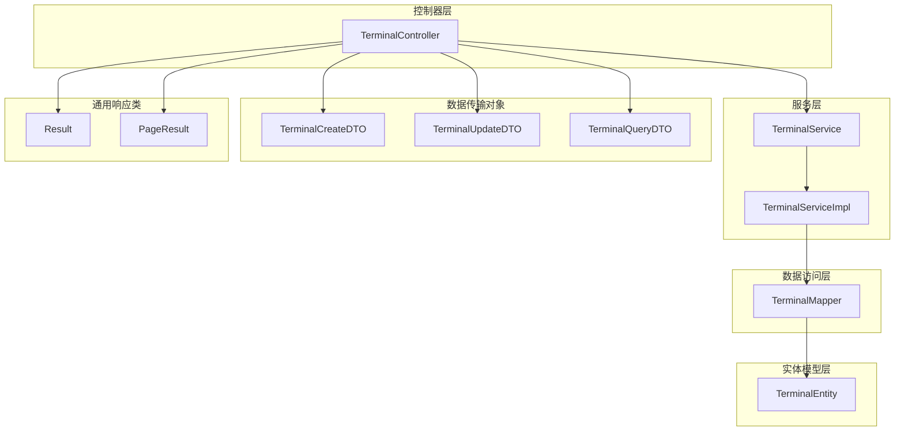
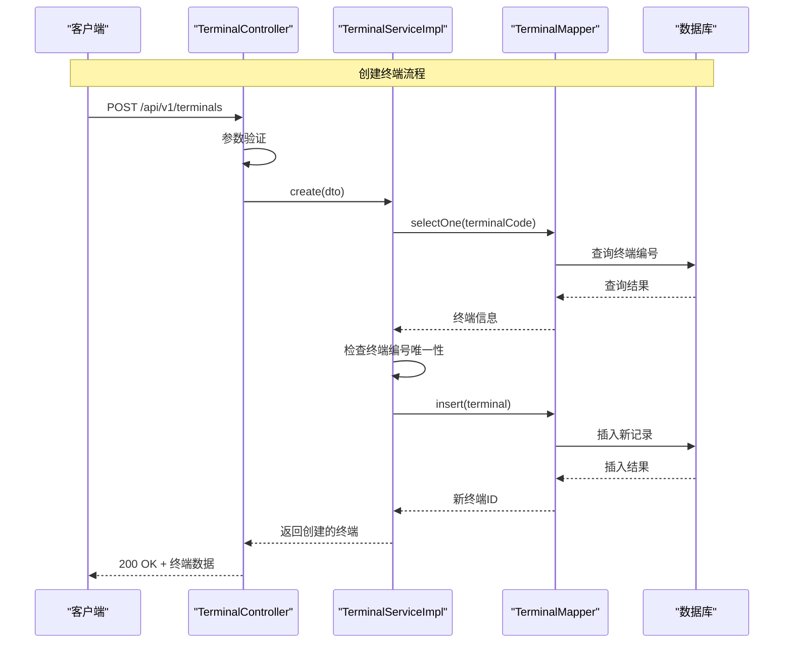
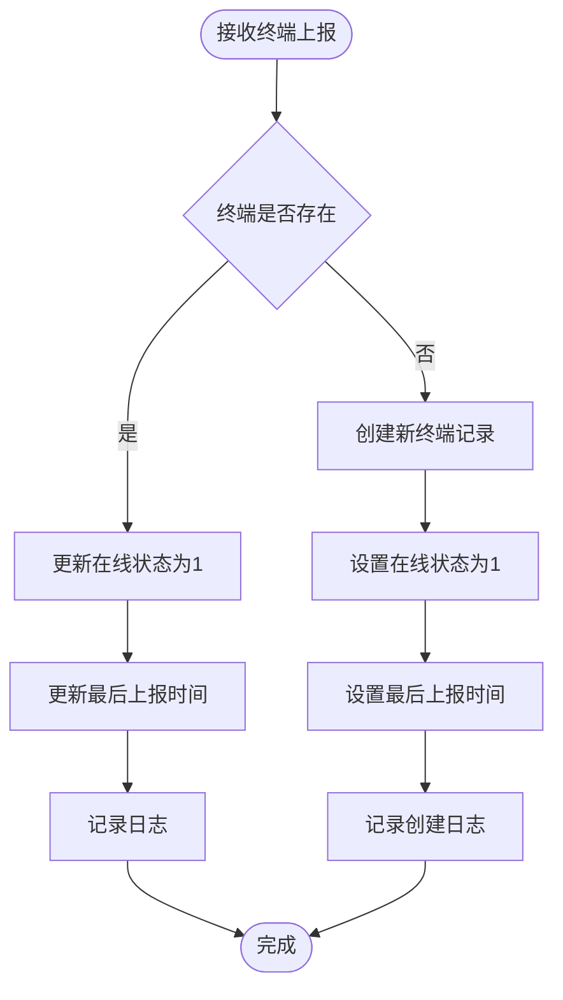
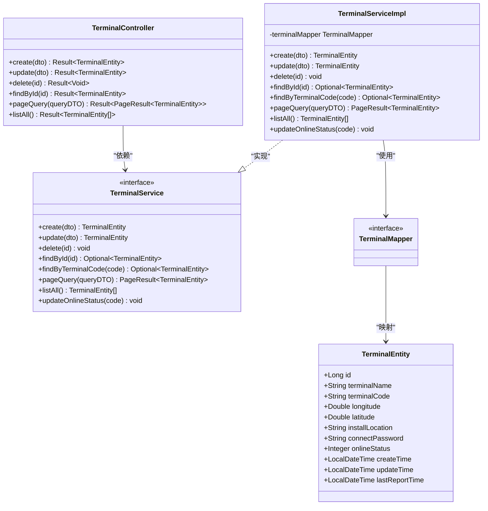
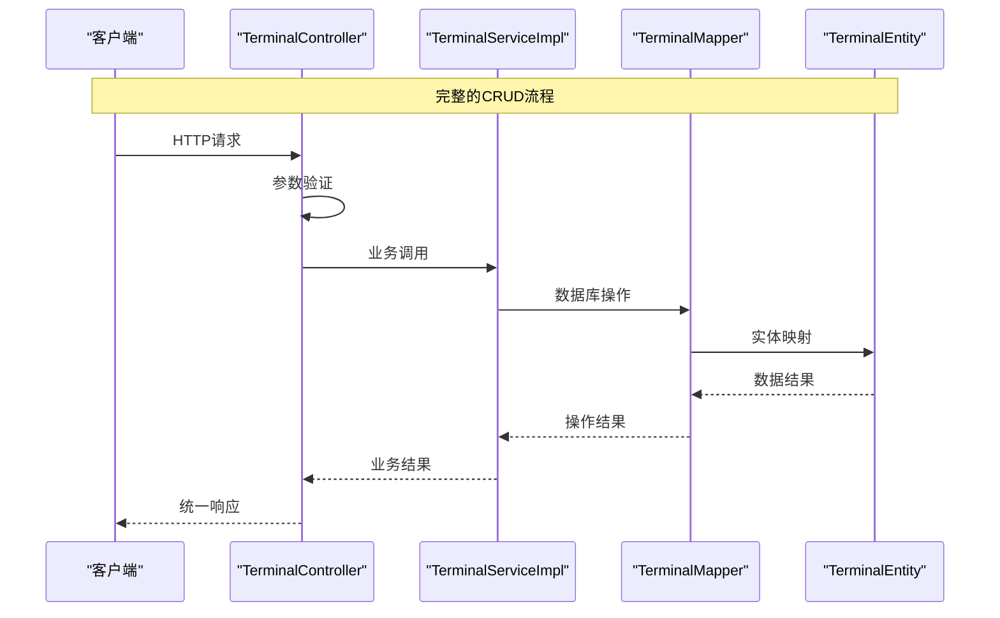

# 终端管理接口

<cite>
**本文档引用的文件**
- [TerminalController.java](file://src/main/java/com/hydro/monitor/modules/controller/TerminalController.java)
- [TerminalService.java](file://src/main/java/com/hydro/monitor/modules/service/TerminalService.java)
- [TerminalServiceImpl.java](file://src/main/java/com/hydro/monitor/modules/service/impl/TerminalServiceImpl.java)
- [TerminalMapper.java](file://src/main/java/com/hydro/monitor/modules/mapper/TerminalMapper.java)
- [TerminalEntity.java](file://src/main/java/com/hydro/monitor/modules/entity/TerminalEntity.java)
- [TerminalCreateDTO.java](file://src/main/java/com/hydro/monitor/modules/dto/TerminalCreateDTO.java)
- [TerminalUpdateDTO.java](file://src/main/java/com/hydro/monitor/modules/dto/TerminalUpdateDTO.java)
- [TerminalQueryDTO.java](file://src/main/java/com/hydro/monitor/modules/dto/TerminalQueryDTO.java)
- [Result.java](file://src/main/java/com/hydro/monitor/common/Result.java)
- [PageResult.java](file://src/main/java/com/hydro/monitor/common/PageResult.java)
</cite>

## 目录
1. [简介](#简介)
2. [项目结构](#项目结构)
3. [核心组件](#核心组件)
4. [架构概览](#架构概览)
5. [详细接口分析](#详细接口分析)
6. [依赖关系分析](#依赖关系分析)
7. [性能考虑](#性能考虑)
8. [故障排除指南](#故障排除指南)
9. [结论](#结论)

## 简介

终端管理模块是水文监测系统中的核心功能模块，负责终端设备的全生命周期管理。该模块提供了完整的RESTful API接口，支持终端设备的创建、查询、更新和删除操作，同时具备在线状态管理和设备生命周期跟踪功能。

本模块采用标准的MVC架构设计，包含控制器层、服务层、数据访问层和实体模型层，确保了良好的代码组织和可维护性。

## 项目结构

终端管理模块在项目中的组织结构如下：



**图表来源**
- [TerminalController.java:1-138](file://src/main/java/com/hydro/monitor/modules/controller/TerminalController.java#L1-L138)
- [TerminalService.java:1-79](file://src/main/java/com/hydro/monitor/modules/service/TerminalService.java#L1-L79)
- [TerminalServiceImpl.java:1-200](file://src/main/java/com/hydro/monitor/modules/service/impl/TerminalServiceImpl.java#L1-L200)

**章节来源**
- [TerminalController.java:1-138](file://src/main/java/com/hydro/monitor/modules/controller/TerminalController.java#L1-L138)
- [TerminalService.java:1-79](file://src/main/java/com/hydro/monitor/modules/service/TerminalService.java#L1-L79)

## 核心组件

### 控制器层
- **TerminalController**: 提供RESTful API接口，处理HTTP请求和响应
- 路径前缀: `/api/v1/terminals`
- 支持的操作: 创建、更新、删除、查询详情、分页查询、获取全部列表

### 服务层
- **TerminalService**: 定义业务逻辑接口
- **TerminalServiceImpl**: 实现具体的业务逻辑，包含事务管理和数据验证

### 数据访问层
- **TerminalMapper**: 继承MyBatis-Plus的BaseMapper，提供数据库操作方法

### 实体模型
- **TerminalEntity**: 映射数据库表`t_terminal`，包含终端设备的所有属性

### 数据传输对象
- **TerminalCreateDTO**: 创建终端时的请求数据封装
- **TerminalUpdateDTO**: 更新终端时的请求数据封装  
- **TerminalQueryDTO**: 查询终端时的条件封装

**章节来源**
- [TerminalController.java:22-27](file://src/main/java/com/hydro/monitor/modules/controller/TerminalController.java#L22-L27)
- [TerminalService.java:17-79](file://src/main/java/com/hydro/monitor/modules/service/TerminalService.java#L17-L79)
- [TerminalEntity.java:15-74](file://src/main/java/com/hydro/monitor/modules/entity/TerminalEntity.java#L15-L74)

## 架构概览

终端管理模块采用经典的三层架构设计，确保了关注点分离和代码的可维护性：



**图表来源**
- [TerminalController.java:37-47](file://src/main/java/com/hydro/monitor/modules/controller/TerminalController.java#L37-L47)
- [TerminalServiceImpl.java:34-60](file://src/main/java/com/hydro/monitor/modules/service/impl/TerminalServiceImpl.java#L34-L60)

**章节来源**
- [TerminalController.java:37-47](file://src/main/java/com/hydro/monitor/modules/controller/TerminalController.java#L37-L47)
- [TerminalServiceImpl.java:34-60](file://src/main/java/com/hydro/monitor/modules/service/impl/TerminalServiceImpl.java#L34-L60)

## 详细接口分析

### 基础信息

- **基础URL**: `/api/v1/terminals`
- **认证要求**: 需要有效的JWT令牌
- **内容类型**: `application/json`
- **响应格式**: 统一的Result包装格式

### 1. 创建终端

#### 接口定义
- **方法**: `POST`
- **路径**: `/api/v1/terminals`
- **功能**: 新增一个终端设备

#### 请求参数

| 参数名 | 类型 | 必填 | 描述 | 验证规则 |
|--------|------|------|------|----------|
| terminalName | String | 是 | 终端名称 | 非空，长度限制 |
| terminalCode | String | 是 | 终端编号（遥测站编号） | 非空，必须唯一 |
| longitude | Double | 否 | 经度 | 数值范围：-180到180 |
| latitude | Double | 否 | 纬度 | 数值范围：-90到90 |
| installLocation | String | 否 | 安装位置 | 长度限制 |
| connectPassword | String | 否 | 连接密码 | 长度限制 |

#### 请求示例
```json
{
  "terminalName": "测试终端001",
  "terminalCode": "ST001",
  "longitude": 120.123456,
  "latitude": 30.123456,
  "installLocation": "浙江省杭州市西湖区",
  "connectPassword": "password123"
}
```

#### 响应格式
- **成功**: `{ "code": 200, "message": "success", "data": {...} }`
- **失败**: `{ "code": 500, "message": "错误信息", "data": null }`

#### 错误处理
- 终端编号重复: 抛出"终端编号已存在"异常
- 参数验证失败: Spring Validation返回相应错误信息
- 数据库异常: 统一捕获并返回错误信息

**章节来源**
- [TerminalController.java:37-47](file://src/main/java/com/hydro/monitor/modules/controller/TerminalController.java#L37-L47)
- [TerminalCreateDTO.java:11-44](file://src/main/java/com/hydro/monitor/modules/dto/TerminalCreateDTO.java#L11-L44)
- [TerminalServiceImpl.java:34-60](file://src/main/java/com/hydro/monitor/modules/service/impl/TerminalServiceImpl.java#L34-L60)

### 2. 更新终端

#### 接口定义
- **方法**: `PUT`
- **路径**: `/api/v1/terminals`
- **功能**: 修改终端设备信息

#### 请求参数

| 参数名 | 类型 | 必填 | 描述 | 验证规则 |
|--------|------|------|------|----------|
| id | Long | 是 | 主键ID | 非空，必须存在 |
| terminalName | String | 否 | 终端名称 | 长度限制 |
| terminalCode | String | 否 | 终端编号 | 长度限制，需唯一 |
| longitude | Double | 否 | 经度 | 数值范围 |
| latitude | Double | 否 | 纬度 | 数值范围 |
| installLocation | String | 否 | 安装位置 | 长度限制 |
| connectPassword | String | 否 | 连接密码 | 长度限制 |

#### 更新规则
- 只更新提供的字段，未提供的字段保持不变
- 终端编号更新时需确保全局唯一性
- 自动更新`updateTime`字段

#### 请求示例
```json
{
  "id": 1,
  "terminalName": "更新后的名称",
  "longitude": 120.654321,
  "latitude": 30.654321
}
```

#### 响应格式
- **成功**: `{ "code": 200, "message": "success", "data": {...} }`
- **失败**: `{ "code": 500, "message": "错误信息", "data": null }`

**章节来源**
- [TerminalController.java:55-65](file://src/main/java/com/hydro/monitor/modules/controller/TerminalController.java#L55-L65)
- [TerminalUpdateDTO.java:11-48](file://src/main/java/com/hydro/monitor/modules/dto/TerminalUpdateDTO.java#L11-L48)
- [TerminalServiceImpl.java:63-108](file://src/main/java/com/hydro/monitor/modules/service/impl/TerminalServiceImpl.java#L63-L108)

### 3. 删除终端

#### 接口定义
- **方法**: `DELETE`
- **路径**: `/api/v1/terminals/{id}`
- **功能**: 根据ID删除终端设备

#### 路径参数
- **id**: Long - 终端主键ID

#### 响应格式
- **成功**: `{ "code": 200, "message": "success", "data": null }`
- **失败**: `{ "code": 500, "message": "错误信息", "data": null }`

#### 错误处理
- 终端不存在: 抛出"终端不存在"异常
- 删除成功后记录日志信息

**章节来源**
- [TerminalController.java:73-83](file://src/main/java/com/hydro/monitor/modules/controller/TerminalController.java#L73-L83)
- [TerminalServiceImpl.java:110-121](file://src/main/java/com/hydro/monitor/modules/service/impl/TerminalServiceImpl.java#L110-L121)

### 4. 查询终端详情

#### 接口定义
- **方法**: `GET`
- **路径**: `/api/v1/terminals/{id}`
- **功能**: 根据ID获取终端详细信息

#### 路径参数
- **id**: Long - 终端主键ID

#### 响应格式
- **成功**: `{ "code": 200, "message": "success", "data": {...} }`
- **失败**: `{ "code": 500, "message": "错误信息", "data": null }`

#### 错误处理
- 终端不存在: 返回"终端不存在"错误
- 查询异常: 统一捕获并返回错误信息

**章节来源**
- [TerminalController.java:91-102](file://src/main/java/com/hydro/monitor/modules/controller/TerminalController.java#L91-L102)
- [TerminalServiceImpl.java:123-127](file://src/main/java/com/hydro/monitor/modules/service/impl/TerminalServiceImpl.java#L123-L127)

### 5. 分页查询终端

#### 接口定义
- **方法**: `GET`
- **路径**: `/api/v1/terminals/page`
- **功能**: 根据条件分页查询终端列表

#### 查询参数

| 参数名 | 类型 | 必填 | 描述 | 默认值 |
|--------|------|------|------|--------|
| terminalName | String | 否 | 终端名称（模糊查询） | 无 |
| terminalCode | String | 否 | 终端编号（模糊查询） | 无 |
| onlineStatus | Integer | 否 | 在线状态（1-在线，0-离线） | 无 |
| pageNum | Integer | 否 | 当前页码 | 1 |
| pageSize | Integer | 否 | 每页条数 | 10 |

#### 分页参数说明
- **pageNum**: 必须≥1，默认为1
- **pageSize**: 必须≥1，默认为10
- **排序**: 按创建时间降序排列

#### 响应格式
```json
{
  "code": 200,
  "message": "success",
  "data": {
    "current": 1,
    "size": 10,
    "total": 100,
    "pages": 10,
    "records": [...]
  }
}
```

**章节来源**
- [TerminalController.java:110-120](file://src/main/java/com/hydro/monitor/modules/controller/TerminalController.java#L110-L120)
- [TerminalQueryDTO.java:8-43](file://src/main/java/com/hydro/monitor/modules/dto/TerminalQueryDTO.java#L8-L43)
- [TerminalServiceImpl.java:137-165](file://src/main/java/com/hydro/monitor/modules/service/impl/TerminalServiceImpl.java#L137-L165)

### 6. 获取所有终端列表

#### 接口定义
- **方法**: `GET`
- **路径**: `/api/v1/terminals/list`
- **功能**: 获取系统中所有终端设备信息，不分页

#### 响应格式
- **成功**: `{ "code": 200, "message": "success", "data": [...] }`
- **失败**: `{ "code": 500, "message": "错误信息", "data": null }`

#### 排序规则
- 按创建时间降序排列

**章节来源**
- [TerminalController.java:127-137](file://src/main/java/com/hydro/monitor/modules/controller/TerminalController.java#L127-L137)
- [TerminalServiceImpl.java:167-172](file://src/main/java/com/hydro/monitor/modules/service/impl/TerminalServiceImpl.java#L167-L172)

### 7. 终端状态管理

#### 在线状态更新

终端状态管理通过专门的服务方法实现，用于处理设备心跳和状态同步：



**图表来源**
- [TerminalServiceImpl.java:174-199](file://src/main/java/com/hydro/monitor/modules/service/impl/TerminalServiceImpl.java#L174-L199)

#### 状态字段说明

| 字段名 | 类型 | 描述 | 默认值 |
|--------|------|------|--------|
| onlineStatus | Integer | 在线状态（1-在线，0-离线） | 0（离线） |
| lastReportTime | LocalDateTime | 最后上报时间 | null |

**章节来源**
- [TerminalServiceImpl.java:174-199](file://src/main/java/com/hydro/monitor/modules/service/impl/TerminalServiceImpl.java#L174-L199)
- [TerminalEntity.java:65-74](file://src/main/java/com/hydro/monitor/modules/entity/TerminalEntity.java#L65-L74)

## 依赖关系分析

### 类层次结构



**图表来源**
- [TerminalController.java:29](file://src/main/java/com/hydro/monitor/modules/controller/TerminalController.java#L29)
- [TerminalService.java:17](file://src/main/java/com/hydro/monitor/modules/service/TerminalService.java#L17)
- [TerminalServiceImpl.java:29](file://src/main/java/com/hydro/monitor/modules/service/impl/TerminalServiceImpl.java#L29)
- [TerminalMapper.java:13](file://src/main/java/com/hydro/monitor/modules/mapper/TerminalMapper.java#L13)
- [TerminalEntity.java:17](file://src/main/java/com/hydro/monitor/modules/entity/TerminalEntity.java#L17)

### 数据流分析



**图表来源**
- [TerminalController.java:39](file://src/main/java/com/hydro/monitor/modules/controller/TerminalController.java#L39)
- [TerminalServiceImpl.java:35](file://src/main/java/com/hydro/monitor/modules/service/impl/TerminalServiceImpl.java#L35)

**章节来源**
- [TerminalController.java:1-138](file://src/main/java/com/hydro/monitor/modules/controller/TerminalController.java#L1-L138)
- [TerminalServiceImpl.java:1-200](file://src/main/java/com/hydro/monitor/modules/service/impl/TerminalServiceImpl.java#L1-L200)

## 性能考虑

### 数据库优化
- 使用MyBatis-Plus进行高效的数据访问
- 支持分页查询，避免一次性加载大量数据
- 提供按创建时间排序的索引支持

### 缓存策略
- 对于频繁查询的终端信息，建议在应用层添加缓存机制
- 可以考虑使用Redis缓存常用的查询结果

### 并发控制
- 所有数据库操作都在事务中执行
- 终端编号的唯一性检查在事务中保证一致性

### 响应时间优化
- 分页查询默认每页10条记录，可根据实际需求调整
- 支持条件过滤，减少不必要的数据传输

## 故障排除指南

### 常见错误及解决方案

#### 1. 终端编号重复
**错误信息**: "终端编号已存在: {terminalCode}"
**原因**: 新创建或更新的终端编号与现有记录冲突
**解决方案**: 
- 检查终端编号的唯一性
- 修改为新的唯一编号

#### 2. 终端不存在
**错误信息**: "终端不存在: {id}"
**原因**: 查询或删除不存在的终端ID
**解决方案**:
- 验证终端ID的有效性
- 检查数据库中的终端记录

#### 3. 参数验证失败
**错误信息**: Spring Validation返回的具体错误信息
**原因**: 请求参数不符合验证规则
**解决方案**:
- 检查必填参数是否完整
- 验证数据类型和格式

#### 4. 数据库连接异常
**错误信息**: 数据库操作异常
**解决方案**:
- 检查数据库连接配置
- 验证数据库服务状态

### 日志分析

模块提供了详细的日志记录：
- 成功操作：记录操作结果和关键信息
- 失败操作：记录异常堆栈和错误详情
- 关键业务：记录重要的业务事件

**章节来源**
- [TerminalServiceImpl.java:41-200](file://src/main/java/com/hydro/monitor/modules/service/impl/TerminalServiceImpl.java#L41-L200)
- [TerminalController.java:40-101](file://src/main/java/com/hydro/monitor/modules/controller/TerminalController.java#L40-L101)

## 结论

终端管理模块提供了完整、规范的RESTful API接口，支持终端设备的全生命周期管理。模块采用清晰的分层架构设计，具有以下特点：

### 技术优势
- **标准化**: 遵循RESTful API设计原则
- **安全性**: 集成JWT认证机制
- **可扩展性**: 清晰的接口设计便于功能扩展
- **可靠性**: 完善的错误处理和日志记录

### 功能完整性
- 支持终端的基本CRUD操作
- 提供灵活的查询和分页功能
- 具备完善的在线状态管理
- 统一的响应格式和错误处理

### 最佳实践
- 建议在生产环境中启用HTTPS
- 对敏感信息（如连接密码）进行加密存储
- 定期备份数据库，确保数据安全
- 监控API使用情况，及时发现异常

该模块为水文监测系统的终端设备管理提供了坚实的技术基础，能够满足各种复杂的业务需求。