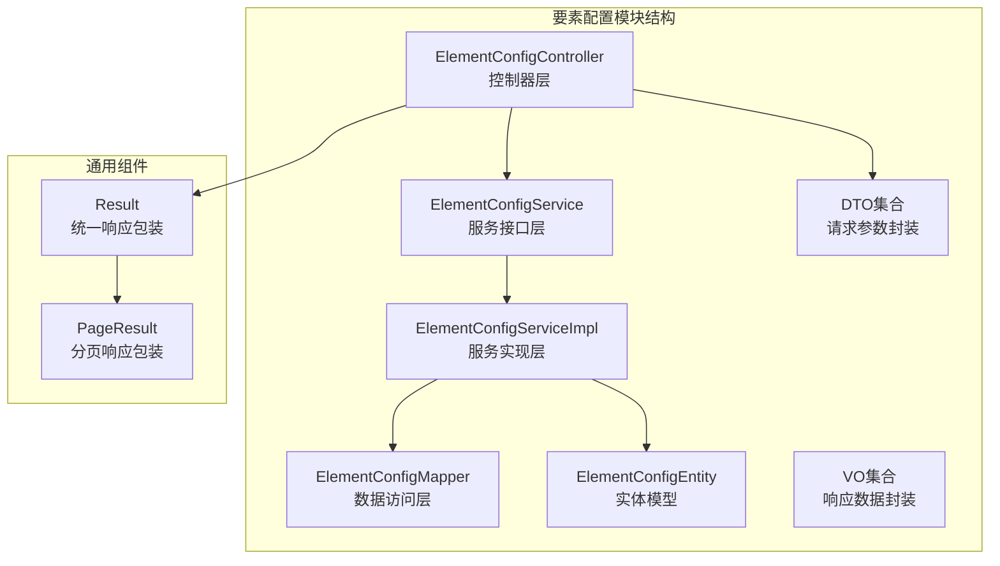
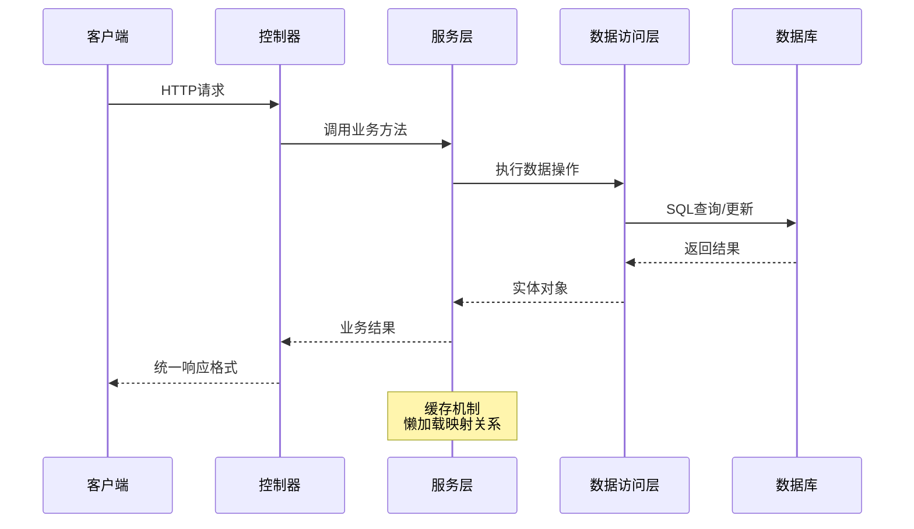
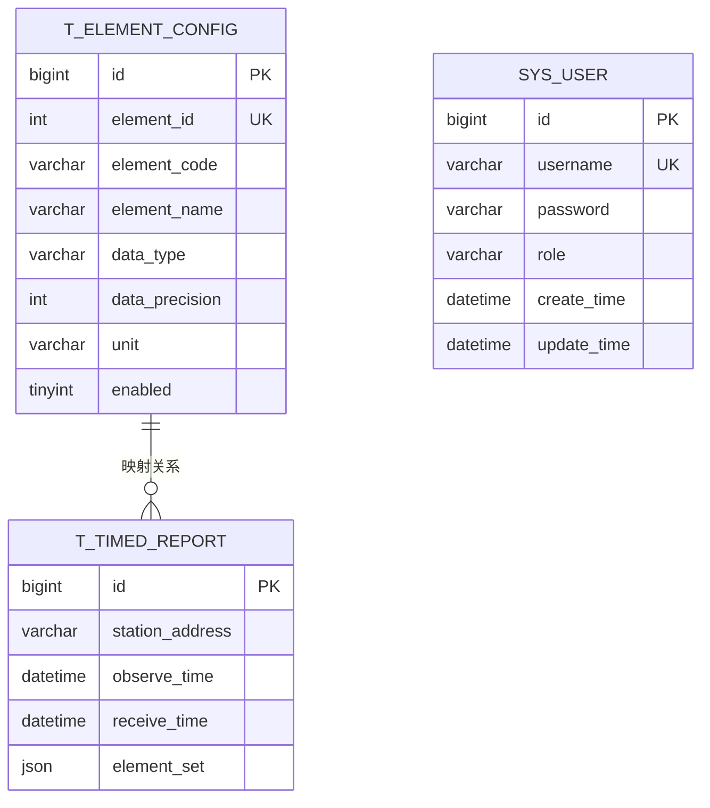
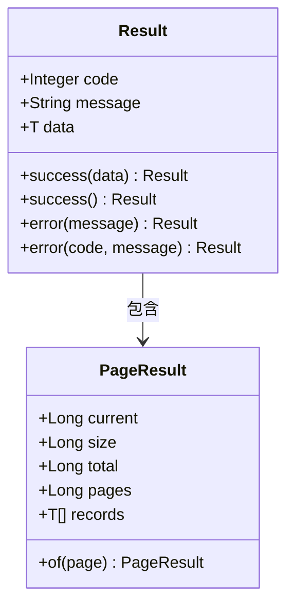
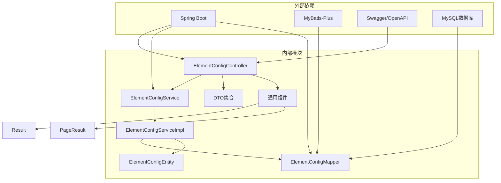
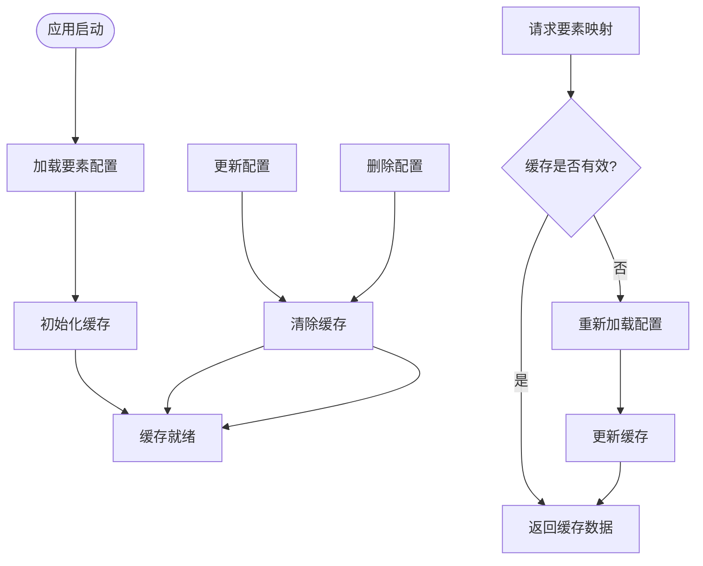

# 要素配置接口

<cite>
**本文引用的文件**
- [ElementConfigController.java](file://src/main/java/com/hydro/monitor/modules/controller/ElementConfigController.java)
- [ElementConfigService.java](file://src/main/java/com/hydro/monitor/modules/service/ElementConfigService.java)
- [ElementConfigServiceImpl.java](file://src/main/java/com/hydro/monitor/modules/service/impl/ElementConfigServiceImpl.java)
- [ElementConfigMapper.java](file://src/main/java/com/hydro/monitor/modules/mapper/ElementConfigMapper.java)
- [ElementConfigCreateDTO.java](file://src/main/java/com/hydro/monitor/modules/dto/ElementConfigCreateDTO.java)
- [ElementConfigUpdateDTO.java](file://src/main/java/com/hydro/monitor/modules/dto/ElementConfigUpdateDTO.java)
- [ElementConfigQueryDTO.java](file://src/main/java/com/hydro/monitor/modules/dto/ElementConfigQueryDTO.java)
- [ElementConfigEntity.java](file://src/main/java/com/hydro/monitor/modules/entity/ElementConfigEntity.java)
- [PageResult.java](file://src/main/java/com/hydro/monitor/common/PageResult.java)
- [Result.java](file://src/main/java/com/hydro/monitor/common/Result.java)
- [init.sql](file://src/main/resources/db/init.sql)
- [update_element_config_add_unit.sql](file://src/main/resources/db/update_element_config_add_unit.sql)
- [OpenApiConfig.java](file://src/main/java/com/hydro/monitor/config/OpenApiConfig.java)
</cite>

## 目录
1. [简介](#简介)
2. [项目结构](#项目结构)
3. [核心组件](#核心组件)
4. [架构概览](#架构概览)
5. [详细组件分析](#详细组件分析)
6. [依赖关系分析](#依赖关系分析)
7. [性能考虑](#性能考虑)
8. [故障排除指南](#故障排除指南)
9. [结论](#结论)
10. [附录](#附录)

## 简介

要素配置接口是水文监测系统中用于管理SL 651-2014协议要素配置的核心RESTful API。该模块负责维护要素标识符与数据库字段之间的映射关系，支持要素配置的完整生命周期管理，包括创建、查询、更新和删除操作。

系统采用Spring Boot + MyBatis-Plus架构，通过统一的响应格式和分页机制提供稳定的服务接口。要素配置数据存储在`t_element_config`表中，包含要素标识符、编码、名称、数据类型、精度、单位和启用状态等关键字段。

## 项目结构

要素配置模块位于`src/main/java/com/hydro/monitor/modules/`目录下，采用标准的MVC架构模式：



**图表来源**
- [ElementConfigController.java:1-97](file://src/main/java/com/hydro/monitor/modules/controller/ElementConfigController.java#L1-L97)
- [ElementConfigService.java:1-72](file://src/main/java/com/hydro/monitor/modules/service/ElementConfigService.java#L1-L72)
- [ElementConfigServiceImpl.java:1-239](file://src/main/java/com/hydro/monitor/modules/service/impl/ElementConfigServiceImpl.java#L1-L239)

**章节来源**
- [ElementConfigController.java:1-97](file://src/main/java/com/hydro/monitor/modules/controller/ElementConfigController.java#L1-L97)
- [ElementConfigService.java:1-72](file://src/main/java/com/hydro/monitor/modules/service/ElementConfigService.java#L1-L72)
- [ElementConfigServiceImpl.java:1-239](file://src/main/java/com/hydro/monitor/modules/service/impl/ElementConfigServiceImpl.java#L1-L239)

## 核心组件

要素配置模块包含以下核心组件：

### 控制器层
- **ElementConfigController**: 提供RESTful API接口，处理HTTP请求和响应
- 支持CRUD操作：分页查询、详情查询、创建、更新、删除

### 服务层
- **ElementConfigService**: 定义业务逻辑接口
- **ElementConfigServiceImpl**: 实现具体业务逻辑，包含缓存机制和事务管理

### 数据访问层
- **ElementConfigMapper**: 继承MyBatis-Plus基础Mapper，提供数据持久化操作

### 数据传输对象
- **ElementConfigCreateDTO**: 创建请求参数封装
- **ElementConfigUpdateDTO**: 更新请求参数封装  
- **ElementConfigQueryDTO**: 查询请求参数封装

### 实体模型
- **ElementConfigEntity**: 数据库表映射实体，包含所有要素配置字段

**章节来源**
- [ElementConfigController.java:18-97](file://src/main/java/com/hydro/monitor/modules/controller/ElementConfigController.java#L18-L97)
- [ElementConfigService.java:12-72](file://src/main/java/com/hydro/monitor/modules/service/ElementConfigService.java#L12-L72)
- [ElementConfigServiceImpl.java:22-239](file://src/main/java/com/hydro/monitor/modules/service/impl/ElementConfigServiceImpl.java#L22-L239)

## 架构概览

要素配置模块采用经典的三层架构设计，通过统一的响应格式和分页机制提供服务：



**图表来源**
- [ElementConfigController.java:38-95](file://src/main/java/com/hydro/monitor/modules/controller/ElementConfigController.java#L38-L95)
- [ElementConfigServiceImpl.java:38-87](file://src/main/java/com/hydro/monitor/modules/service/impl/ElementConfigServiceImpl.java#L38-L87)

### 数据模型关系



**图表来源**
- [init.sql:49-73](file://src/main/resources/db/init.sql#L49-L73)

**章节来源**
- [ElementConfigEntity.java:9-62](file://src/main/java/com/hydro/monitor/modules/entity/ElementConfigEntity.java#L9-L62)
- [init.sql:49-73](file://src/main/resources/db/init.sql#L49-L73)

## 详细组件分析

### RESTful API接口规范

#### 基础信息
- **基础URL**: `/api/v1/element-configs`
- **认证方式**: Bearer Token (JWT)
- **响应格式**: 统一JSON格式

#### 统一响应格式



**图表来源**
- [Result.java:11-79](file://src/main/java/com/hydro/monitor/common/Result.java#L11-L79)
- [PageResult.java:14-58](file://src/main/java/com/hydro/monitor/common/PageResult.java#L14-L58)

**章节来源**
- [Result.java:11-79](file://src/main/java/com/hydro/monitor/common/Result.java#L11-L79)
- [PageResult.java:14-58](file://src/main/java/com/hydro/monitor/common/PageResult.java#L14-L58)

### 接口定义

#### 1. 分页查询要素配置

**HTTP方法**: `POST`
**URL**: `/api/v1/element-configs/page`
**功能**: 支持按要素标识符、编码、名称模糊查询，以及启用状态筛选

**请求参数** (`ElementConfigQueryDTO`):
- `pageNum`: 页码（从1开始，默认1）
- `pageSize`: 每页大小（1-100，默认20）
- `elementId`: 要素标识符（可选）
- `elementCode`: 要素编码（可选，支持模糊查询）
- `elementName`: 要素名称（可选，支持模糊查询）
- `enabled`: 是否启用（可选：1-启用，0-禁用）

**响应数据** (`PageResult<ElementConfigEntity>`):
- `current`: 当前页码
- `size`: 每页大小
- `total`: 总记录数
- `pages`: 总页数
- `records`: 要素配置列表

**请求示例**:
```json
{
  "pageNum": 1,
  "pageSize": 10,
  "elementCode": "pn%",
  "enabled": 1
}
```

**响应示例**:
```json
{
  "code": 200,
  "message": "success",
  "data": {
    "current": 1,
    "size": 10,
    "total": 7,
    "pages": 1,
    "records": [
      {
        "id": 1,
        "elementId": 22,
        "elementCode": "pn05",
        "elementName": "5分钟时段降雨量",
        "dataType": "数值型",
        "dataPrecision": 1,
        "unit": "mm",
        "enabled": 1
      }
    ]
  }
}
```

**章节来源**
- [ElementConfigController.java:38-43](file://src/main/java/com/hydro/monitor/modules/controller/ElementConfigController.java#L38-L43)
- [ElementConfigQueryDTO.java:8-51](file://src/main/java/com/hydro/monitor/modules/dto/ElementConfigQueryDTO.java#L8-L51)
- [ElementConfigServiceImpl.java:89-119](file://src/main/java/com/hydro/monitor/modules/service/impl/ElementConfigServiceImpl.java#L89-L119)

#### 2. 查询要素配置详情

**HTTP方法**: `GET`
**URL**: `/api/v1/element-configs/{id}`
**路径参数**: `id` - 要素配置主键ID

**响应数据**: `ElementConfigEntity`

**请求示例**:
```
GET /api/v1/element-configs/1
```

**响应示例**:
```json
{
  "code": 200,
  "message": "success",
  "data": {
    "id": 1,
    "elementId": 22,
    "elementCode": "pn05",
    "elementName": "5分钟时段降雨量",
    "dataType": "数值型",
    "dataPrecision": 1,
    "unit": "mm",
    "enabled": 1
  }
}
```

**章节来源**
- [ElementConfigController.java:51-56](file://src/main/java/com/hydro/monitor/modules/controller/ElementConfigController.java#L51-L56)
- [ElementConfigServiceImpl.java:121-128](file://src/main/java/com/hydro/monitor/modules/service/impl/ElementConfigServiceImpl.java#L121-L128)

#### 3. 创建要素配置

**HTTP方法**: `POST`
**URL**: `/api/v1/element-configs`
**功能**: 创建新的要素配置记录

**请求参数** (`ElementConfigCreateDTO`):
- `elementId`: 要素标识符（必填，整数类型）
- `elementCode`: 要素编码（必填，字符串类型）
- `elementName`: 要素名称（必填，字符串类型）
- `dataType`: 数据类型（可选，默认"数值型"）
- `dataPrecision`: 数据精度（可选，默认1）
- `unit`: 要素单位（可选）
- `enabled`: 是否启用（可选，默认1）

**验证规则**:
- `elementId`: 非空且唯一，必须大于0
- `elementCode`: 非空，长度限制
- `elementName`: 非空，长度限制
- `dataType`: 默认值处理
- `dataPrecision`: 整数类型，非负数
- `enabled`: 1或0

**响应数据**: `ElementConfigEntity`

**请求示例**:
```json
{
  "elementId": 40,
  "elementCode": "test",
  "elementName": "测试要素",
  "dataType": "数值型",
  "dataPrecision": 2,
  "unit": "m",
  "enabled": 1
}
```

**响应示例**:
```json
{
  "code": 200,
  "message": "success",
  "data": {
    "id": 8,
    "elementId": 40,
    "elementCode": "test",
    "elementName": "测试要素",
    "dataType": "数值型",
    "dataPrecision": 2,
    "unit": "m",
    "enabled": 1
  }
}
```

**错误处理**:
- 要素标识符重复：抛出运行时异常
- 参数验证失败：Spring Validation返回400错误

**章节来源**
- [ElementConfigController.java:64-69](file://src/main/java/com/hydro/monitor/modules/controller/ElementConfigController.java#L64-L69)
- [ElementConfigCreateDTO.java:11-65](file://src/main/java/com/hydro/monitor/modules/dto/ElementConfigCreateDTO.java#L11-L65)
- [ElementConfigServiceImpl.java:130-158](file://src/main/java/com/hydro/monitor/modules/service/impl/ElementConfigServiceImpl.java#L130-L158)

#### 4. 更新要素配置

**HTTP方法**: `PUT`
**URL**: `/api/v1/element-configs`
**功能**: 修改已有的要素配置记录

**请求参数** (`ElementConfigUpdateDTO`):
- `id`: 主键ID（必填）
- `elementId`: 要素标识符（可选）
- `elementCode`: 要素编码（可选）
- `elementName`: 要素名称（可选）
- `dataType`: 数据类型（可选）
- `dataPrecision`: 数据精度（可选）
- `unit`: 要素单位（可选）
- `enabled`: 是否启用（可选）

**更新规则**:
- 仅更新提供的字段
- 若修改elementId，需确保不与其他记录冲突
- 支持部分字段更新

**响应数据**: `ElementConfigEntity`

**请求示例**:
```json
{
  "id": 1,
  "elementName": "修改后的要素名称",
  "unit": "mm",
  "enabled": 0
}
```

**响应示例**:
```json
{
  "code": 200,
  "message": "success",
  "data": {
    "id": 1,
    "elementId": 22,
    "elementCode": "pn05",
    "elementName": "修改后的要素名称",
    "dataType": "数值型",
    "dataPrecision": 1,
    "unit": "mm",
    "enabled": 0
  }
}
```

**错误处理**:
- 要素配置不存在：抛出运行时异常
- 要素标识符冲突：抛出运行时异常
- 参数验证失败：Spring Validation返回400错误

**章节来源**
- [ElementConfigController.java:77-82](file://src/main/java/com/hydro/monitor/modules/controller/ElementConfigController.java#L77-L82)
- [ElementConfigUpdateDTO.java:11-54](file://src/main/java/com/hydro/monitor/modules/dto/ElementConfigUpdateDTO.java#L11-L54)
- [ElementConfigServiceImpl.java:160-210](file://src/main/java/com/hydro/monitor/modules/service/impl/ElementConfigServiceImpl.java#L160-L210)

#### 5. 删除要素配置

**HTTP方法**: `DELETE`
**URL**: `/api/v1/element-configs/{id}`
**路径参数**: `id` - 要素配置主键ID

**响应数据**: `Void`（无数据）

**请求示例**:
```
DELETE /api/v1/element-configs/1
```

**响应示例**:
```json
{
  "code": 200,
  "message": "success",
  "data": null
}
```

**错误处理**:
- 要素配置不存在：抛出运行时异常

**章节来源**
- [ElementConfigController.java:90-95](file://src/main/java/com/hydro/monitor/modules/controller/ElementConfigController.java#L90-L95)
- [ElementConfigServiceImpl.java:212-226](file://src/main/java/com/hydro/monitor/modules/service/impl/ElementConfigServiceImpl.java#L212-L226)

### 数据模型详解

#### 要素配置实体属性

| 属性名 | 类型 | 必填 | 默认值 | 描述 | 验证规则 |
|--------|------|------|--------|------|----------|
| id | Long | 是 | 自增 | 主键ID | 雪花算法生成 |
| elementId | Integer | 是 | 无 | 要素标识符 | 唯一性约束 |
| elementCode | String | 是 | 无 | 要素编码 | 非空，唯一性 |
| elementName | String | 是 | 无 | 要素名称 | 非空 |
| dataType | String | 否 | "数值型" | 数据类型 | 枚举值 |
| dataPrecision | Integer | 否 | 1 | 数据精度 | 非负整数 |
| unit | String | 否 | 无 | 要素单位 | 可选 |
| enabled | Integer | 否 | 1 | 是否启用 | 1或0 |

**章节来源**
- [ElementConfigEntity.java:16-62](file://src/main/java/com/hydro/monitor/modules/entity/ElementConfigEntity.java#L16-L62)
- [ElementConfigCreateDTO.java:11-65](file://src/main/java/com/hydro/monitor/modules/dto/ElementConfigCreateDTO.java#L11-L65)
- [ElementConfigUpdateDTO.java:11-54](file://src/main/java/com/hydro/monitor/modules/dto/ElementConfigUpdateDTO.java#L11-L54)

## 依赖关系分析

要素配置模块的依赖关系呈现清晰的层次结构：



**图表来源**
- [ElementConfigController.java:1-16](file://src/main/java/com/hydro/monitor/modules/controller/ElementConfigController.java#L1-L16)
- [ElementConfigServiceImpl.java:1-21](file://src/main/java/com/hydro/monitor/modules/service/impl/ElementConfigServiceImpl.java#L1-L21)

### 关键依赖特性

1. **Spring Boot集成**: 提供自动配置和依赖注入
2. **MyBatis-Plus增强**: 提供CRUD和分页功能
3. **Swagger文档**: 自动生成API文档
4. **JWT认证**: 提供安全访问控制

**章节来源**
- [OpenApiConfig.java:19-52](file://src/main/java/com/hydro/monitor/config/OpenApiConfig.java#L19-L52)
- [ElementConfigMapper.java:1-15](file://src/main/java/com/hydro/monitor/modules/mapper/ElementConfigMapper.java#L1-L15)

## 性能考虑

### 缓存策略

要素配置模块实现了智能缓存机制来提升性能：



**图表来源**
- [ElementConfigServiceImpl.java:34-63](file://src/main/java/com/hydro/monitor/modules/service/impl/ElementConfigServiceImpl.java#L34-L63)
- [ElementConfigServiceImpl.java:231-237](file://src/main/java/com/hydro/monitor/modules/service/impl/ElementConfigServiceImpl.java#L231-L237)

### 性能优化建议

1. **缓存机制**: 使用双重检查锁实现懒加载，避免频繁数据库访问
2. **分页查询**: 默认每页20条记录，最大100条，防止大数据量查询
3. **索引优化**: `t_element_config`表对`element_id`建立唯一索引
4. **事务管理**: 所有写操作使用事务保证数据一致性

**章节来源**
- [ElementConfigServiceImpl.java:34-63](file://src/main/java/com/hydro/monitor/modules/service/impl/ElementConfigServiceImpl.java#L34-L63)
- [ElementConfigQueryDTO.java:42-49](file://src/main/java/com/hydro/monitor/modules/dto/ElementConfigQueryDTO.java#L42-L49)
- [init.sql:60](file://src/main/resources/db/init.sql#L60)

## 故障排除指南

### 常见错误及解决方案

#### 1. 参数验证错误
**症状**: 请求返回400错误，包含验证失败信息
**原因**: DTO参数验证失败
**解决方案**: 检查请求参数格式和必填字段

#### 2. 要素标识符冲突
**症状**: 创建/更新时抛出"要素标识符已存在"异常
**原因**: elementId重复
**解决方案**: 使用唯一的要素标识符

#### 3. 要素配置不存在
**症状**: 查询/更新/删除时抛出"要素配置不存在"异常
**原因**: ID不存在或已被删除
**解决方案**: 确认要素配置ID的有效性

#### 4. 缓存问题
**症状**: 更新后仍显示旧数据
**原因**: 缓存未及时刷新
**解决方案**: 系统会自动清除缓存，等待下次请求重新加载

**章节来源**
- [ElementConfigServiceImpl.java:137-139](file://src/main/java/com/hydro/monitor/modules/service/impl/ElementConfigServiceImpl.java#L137-L139)
- [ElementConfigServiceImpl.java:165-167](file://src/main/java/com/hydro/monitor/modules/service/impl/ElementConfigServiceImpl.java#L165-L167)
- [ElementConfigServiceImpl.java:215-218](file://src/main/java/com/hydro/monitor/modules/service/impl/ElementConfigServiceImpl.java#L215-L218)

### 调试建议

1. **启用日志**: 查看服务层的日志输出
2. **检查数据库**: 验证t_element_config表的数据完整性
3. **验证权限**: 确保Bearer Token有效
4. **测试缓存**: 观察缓存清除和重新加载行为

## 结论

要素配置接口模块提供了完整的SL 651-2014协议要素管理能力，具有以下特点：

1. **完整的CRUD支持**: 支持要素配置的全生命周期管理
2. **智能缓存机制**: 提升查询性能，减少数据库压力
3. **统一响应格式**: 标准化的API响应，便于客户端集成
4. **严格的参数验证**: 确保数据质量和系统稳定性
5. **完善的错误处理**: 提供清晰的错误信息和处理建议

该模块为水文监测系统的数据采集和处理提供了坚实的基础，通过标准化的要素配置管理，确保了监测数据的一致性和准确性。

## 附录

### 数据库表结构

要素配置表`t_element_config`包含以下字段：
- `id`: 主键，bigint类型
- `element_id`: 要素标识符，int类型，唯一约束
- `element_code`: 要素编码，varchar类型
- `element_name`: 要素名称，varchar类型
- `data_type`: 数据类型，varchar类型，默认"数值型"
- `data_precision`: 数据精度，int类型，默认1
- `unit`: 要素单位，varchar类型
- `enabled`: 是否启用，tinyint类型，默认1

**章节来源**
- [init.sql:49-73](file://src/main/resources/db/init.sql#L49-L73)

### 默认要素配置

系统预置了7种常用的水文要素配置，包括降雨量、水位、流速、流量和电压等关键监测指标。

**章节来源**
- [init.sql:64-73](file://src/main/resources/db/init.sql#L64-L73)