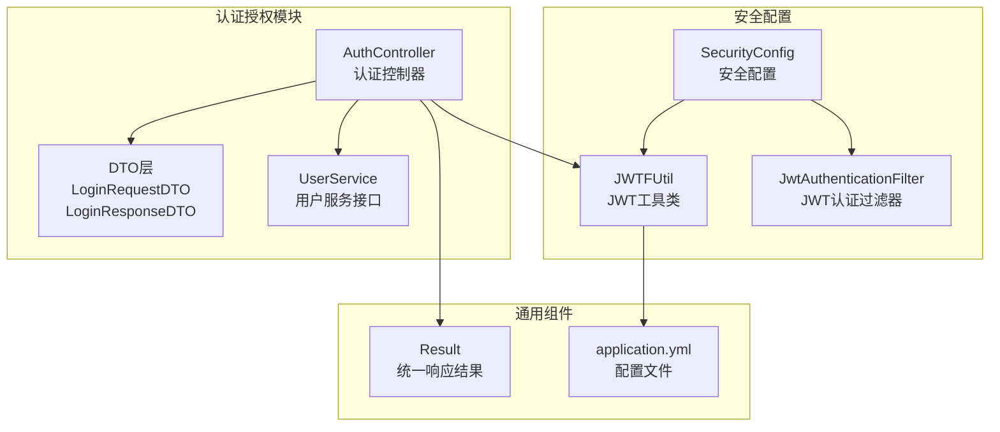
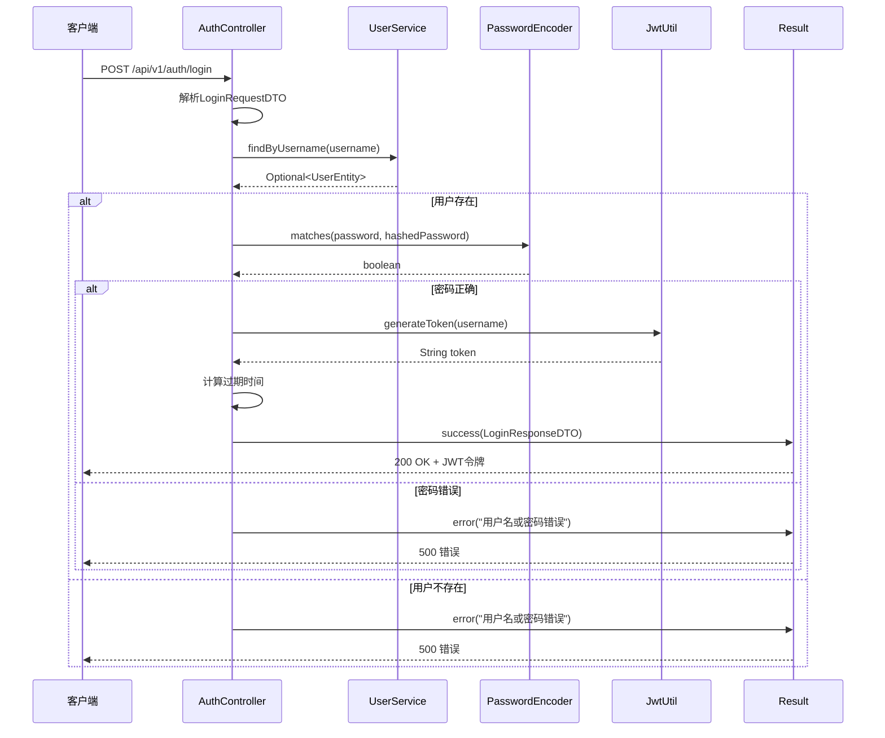
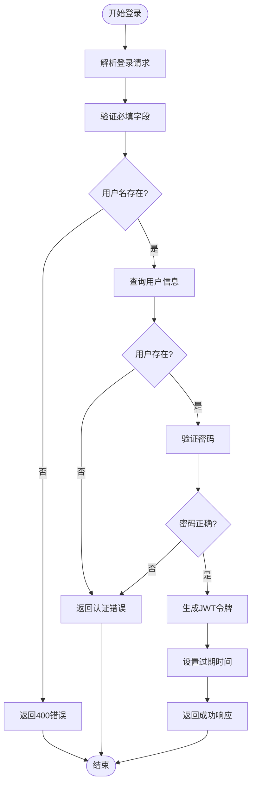
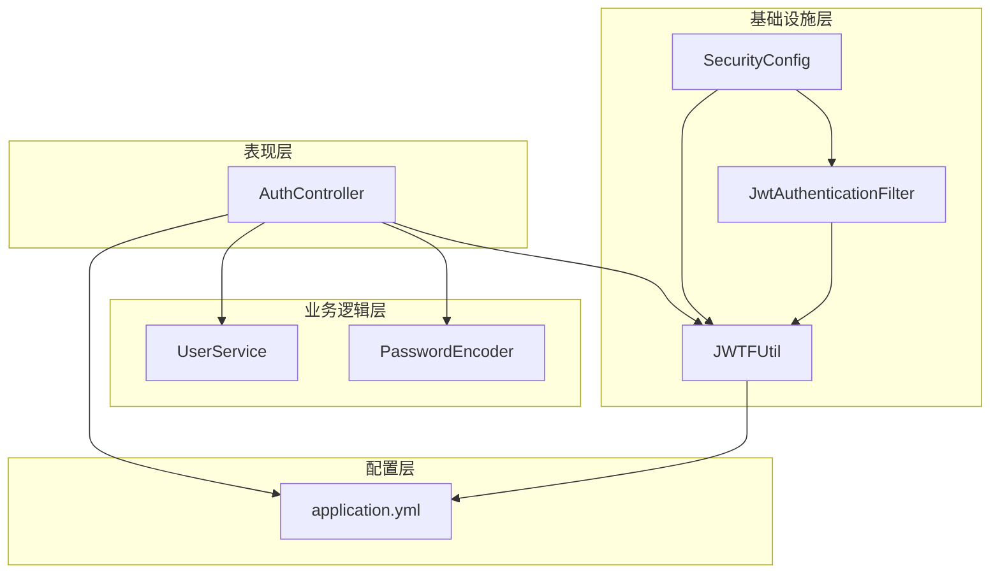

# 认证授权接口

<cite>
**本文档引用的文件**
- [AuthController.java](file://src/main/java/com/hydro/monitor/modules/controller/AuthController.java)
- [LoginRequestDTO.java](file://src/main/java/com/hydro/monitor/modules/dto/LoginRequestDTO.java)
- [LoginResponseDTO.java](file://src/main/java/com/hydro/monitor/modules/dto/LoginResponseDTO.java)
- [JwtUtil.java](file://src/main/java/com/hydro/monitor/config/security/JwtUtil.java)
- [JwtAuthenticationFilter.java](file://src/main/java/com/hydro/monitor/config/security/JwtAuthenticationFilter.java)
- [SecurityConfig.java](file://src/main/java/com/hydro/monitor/config/security/SecurityConfig.java)
- [application.yml](file://src/main/resources/application.yml)
- [Result.java](file://src/main/java/com/hydro/monitor/common/Result.java)
- [UserService.java](file://src/main/java/com/hydro/monitor/modules/service/UserService.java)
- [AuthControllerTest.java](file://src/test/java/com/hydro/monitor/modules/controller/AuthControllerTest.java)
</cite>

## 目录
1. [简介](#简介)
2. [项目结构](#项目结构)
3. [核心组件](#核心组件)
4. [架构概览](#架构概览)
5. [详细组件分析](#详细组件分析)
6. [依赖关系分析](#依赖关系分析)
7. [性能考虑](#性能考虑)
8. [故障排除指南](#故障排除指南)
9. [结论](#结论)

## 简介

本文件详细记录了Hydro Monitor后端系统的认证授权模块API接口文档。该系统采用基于JWT（JSON Web Token）的无状态认证机制，通过Spring Security实现安全控制。认证模块提供了用户登录功能，支持用户名密码认证，并返回具有固定有效期的JWT令牌。

## 项目结构

认证授权模块位于以下目录结构中：



**图表来源**
- [AuthController.java:1-68](file://src/main/java/com/hydro/monitor/modules/controller/AuthController.java#L1-L68)
- [SecurityConfig.java:1-76](file://src/main/java/com/hydro/monitor/config/security/SecurityConfig.java#L1-L76)
- [JwtUtil.java:1-126](file://src/main/java/com/hydro/monitor/config/security/JwtUtil.java#L1-L126)

**章节来源**
- [AuthController.java:1-68](file://src/main/java/com/hydro/monitor/modules/controller/AuthController.java#L1-L68)
- [SecurityConfig.java:1-76](file://src/main/java/com/hydro/monitor/config/security/SecurityConfig.java#L1-L76)

## 核心组件

### 认证控制器 (AuthController)

认证控制器是用户登录功能的主要入口点，负责处理登录请求并返回JWT令牌。

**主要功能：**
- 接收登录请求参数
- 验证用户凭据
- 生成JWT访问令牌
- 返回标准化响应格式

**HTTP端点：**
- 方法：POST
- 路径：`/api/v1/auth/login`
- 描述：用户登录获取JWT Token

**章节来源**
- [AuthController.java:24-68](file://src/main/java/com/hydro/monitor/modules/controller/AuthController.java#L24-L68)

### DTO数据传输对象

#### LoginRequestDTO
登录请求数据传输对象，包含用户登录所需的认证信息。

**字段定义：**
- `username` (String): 用户名
  - 类型：字符串
  - 必填：是
  - 长度：1-50字符
  - 格式：字母数字组合，可包含下划线
- `password` (String): 密码
  - 类型：字符串
  - 必填：是
  - 长度：6-128字符
  - 格式：至少包含一个字母和一个数字

#### LoginResponseDTO
登录响应数据传输对象，包含JWT令牌和过期时间信息。

**字段定义：**
- `token` (String): JWT访问令牌
  - 类型：字符串
  - 格式：JWT标准格式
- `expiration` (Long): 令牌过期时间戳
  - 类型：整数
  - 单位：毫秒
  - 格式：Unix时间戳

**章节来源**
- [LoginRequestDTO.java:8-19](file://src/main/java/com/hydro/monitor/modules/dto/LoginRequestDTO.java#L8-L19)
- [LoginResponseDTO.java:8-19](file://src/main/java/com/hydro/monitor/modules/dto/LoginResponseDTO.java#L8-L19)

### 安全配置组件

#### SecurityConfig
Spring Security配置类，定义了整个应用的安全策略。

**关键配置：**
- CSRF保护：禁用（基于JWT）
- 会话管理：无状态（STATELESS）
- 授权规则：
  - `/api/v1/auth/**`：完全开放
  - Swagger文档：完全开放
  - 其他接口：需要认证

#### JwtUtil
JWT工具类，提供令牌生成、验证和解析功能。

**令牌结构：**
- Header：算法标识（HS256）
- Payload：包含用户名声明
- Signature：基于密钥的签名

**章节来源**
- [SecurityConfig.java:33-52](file://src/main/java/com/hydro/monitor/config/security/SecurityConfig.java#L33-L52)
- [JwtUtil.java:37-48](file://src/main/java/com/hydro/monitor/config/security/JwtUtil.java#L37-L48)

## 架构概览

认证授权模块采用分层架构设计，实现了清晰的关注点分离：



**图表来源**
- [AuthController.java:41-66](file://src/main/java/com/hydro/monitor/modules/controller/AuthController.java#L41-L66)
- [UserService.java:55-56](file://src/main/java/com/hydro/monitor/modules/service/UserService.java#L55-L56)
- [JwtUtil.java:37-48](file://src/main/java/com/hydro/monitor/config/security/JwtUtil.java#L37-L48)

## 详细组件分析

### 认证流程详解

#### 登录请求处理流程



**图表来源**
- [AuthController.java:43-66](file://src/main/java/com/hydro/monitor/modules/controller/AuthController.java#L43-L66)

#### JWT令牌结构分析

JWT令牌由三个部分组成，采用Base64URL编码：

**Header部分：**
- `alg`: HS256（对称加密算法）
- `typ`: JWT（令牌类型）

**Payload部分：**
- `sub`: 用户名（主题）
- `iat`: 签发时间（Unix时间戳）
- `exp`: 过期时间（Unix时间戳）
- `iss`: 签发者（可选）

**Signature部分：**
- 使用HMAC SHA256算法对Header和Payload进行签名

**章节来源**
- [JwtUtil.java:41-47](file://src/main/java/com/hydro/monitor/config/security/JwtUtil.java#L41-L47)

### 错误处理机制

系统实现了完善的错误处理机制，确保客户端能够准确理解认证失败的原因：

#### 认证失败场景

| 场景 | HTTP状态码 | 错误代码 | 错误信息 | 说明 |
|------|------------|----------|----------|------|
| 用户名不存在 | 200 | 500 | "用户名或密码错误" | 用户名不存在时返回 |
| 密码错误 | 200 | 500 | "用户名或密码错误" | 密码验证失败时返回 |
| 请求格式错误 | 400 | - | - | JSON格式不正确时返回 |
| 服务器内部错误 | 500 | - | - | 系统异常时返回 |

#### 错误响应格式

所有错误响应都遵循统一的Result格式：

```json
{
  "code": 500,
  "message": "用户名或密码错误",
  "data": null
}
```

**章节来源**
- [AuthController.java:48-57](file://src/main/java/com/hydro/monitor/modules/controller/AuthController.java#L48-L57)
- [Result.java:58-77](file://src/main/java/com/hydro/monitor/common/Result.java#L58-L77)

### 安全配置详解

#### Spring Security配置

系统采用基于过滤器链的安全架构：

```mermaid
graph LR
Request[HTTP请求] --> CSRF[CSRF过滤器]
CSRF --> Session[会话管理]
Session --> Authz[授权检查]
Authz --> JWTFilter[JWT认证过滤器]
JWTFilter --> Controller[业务控制器]
subgraph "配置规则"
Public[/api/v1/auth/** - 公开访问]
Swagger[/swagger/** - 文档访问]
Protected[其他接口 - 需要认证]
end
Authz --> Public
Authz --> Swagger
Authz --> Protected
```

**图表来源**
- [SecurityConfig.java:41-47](file://src/main/java/com/hydro/monitor/config/security/SecurityConfig.java#L41-L47)

#### JWT认证过滤器

JWT认证过滤器负责在每个请求到达控制器之前进行身份验证：

**过滤流程：**
1. 从Authorization头提取Bearer令牌
2. 验证令牌格式和签名
3. 解析令牌中的用户信息
4. 在SecurityContext中设置认证信息
5. 继续执行后续过滤器链

**章节来源**
- [JwtAuthenticationFilter.java:31-59](file://src/main/java/com/hydro/monitor/config/security/JwtAuthenticationFilter.java#L31-L59)

## 依赖关系分析

认证授权模块的依赖关系体现了清晰的分层架构：



**图表来源**
- [AuthController.java:31-33](file://src/main/java/com/hydro/monitor/modules/controller/AuthController.java#L31-L33)
- [SecurityConfig.java:24](file://src/main/java/com/hydro/monitor/config/security/SecurityConfig.java#L24)

**章节来源**
- [AuthController.java:1-68](file://src/main/java/com/hydro/monitor/modules/controller/AuthController.java#L1-L68)
- [SecurityConfig.java:1-76](file://src/main/java/com/hydro/monitor/config/security/SecurityConfig.java#L1-L76)

## 性能考虑

### JWT令牌性能特性

- **无状态性**：JWT令牌包含所有必要信息，无需服务器存储会话状态
- **轻量级**：令牌大小通常小于1KB，网络传输开销小
- **缓存友好**：客户端可以缓存令牌，减少服务器负载
- **过期时间**：默认24小时有效期，平衡安全性与用户体验

### 安全配置优化

- **密码哈希**：使用BCrypt算法，成本因子适中，提供良好的安全性和性能平衡
- **令牌刷新**：建议实现刷新令牌机制，避免频繁重新登录
- **速率限制**：建议添加登录尝试频率限制，防止暴力破解攻击

## 故障排除指南

### 常见问题诊断

#### 登录失败排查步骤

1. **检查请求格式**
   - 确认Content-Type为application/json
   - 验证JSON格式正确性
   - 检查必需字段是否完整

2. **验证用户凭据**
   - 确认用户名存在且激活
   - 验证密码长度和复杂度要求
   - 检查账户是否被锁定

3. **检查令牌有效性**
   - 验证Authorization头格式
   - 确认令牌未过期
   - 检查签名完整性

#### 单元测试验证

系统提供了完整的单元测试覆盖：

- **登录成功场景**：验证正常登录流程
- **用户名错误场景**：验证用户不存在时的错误处理
- **密码错误场景**：验证密码验证失败的处理
- **请求格式错误场景**：验证参数校验机制

**章节来源**
- [AuthControllerTest.java:51-100](file://src/test/java/com/hydro/monitor/modules/controller/AuthControllerTest.java#L51-L100)

### 最佳实践建议

#### 安全最佳实践

1. **传输安全**
   - 始终使用HTTPS协议
   - 避免在URL中传递敏感信息
   - 实施严格的CORS策略

2. **令牌管理**
   - 定期轮换JWT密钥
   - 实现令牌撤销机制
   - 监控异常登录活动

3. **输入验证**
   - 实施严格的参数验证
   - 防止SQL注入和XSS攻击
   - 限制请求频率和并发连接数

#### 开发最佳实践

1. **错误处理**
   - 提供有意义的错误信息
   - 记录详细的日志信息
   - 实施优雅的降级策略

2. **性能优化**
   - 缓存常用查询结果
   - 实施异步处理机制
   - 监控系统性能指标

## 结论

Hydro Monitor认证授权模块实现了现代化的JWT无状态认证机制，具有以下特点：

**技术优势：**
- 基于Spring Security的成熟安全框架
- 完善的JWT令牌管理和验证机制
- 清晰的分层架构设计
- 全面的错误处理和日志记录

**安全特性：**
- 无状态认证，支持水平扩展
- 强密码哈希和令牌签名
- CSRF防护和会话无状态化
- 统一的错误响应格式

**开发体验：**
- 完整的单元测试覆盖
- 清晰的API文档和示例
- 灵活的配置选项
- 良好的可维护性

该模块为Hydro Monitor系统提供了可靠、安全、易用的认证授权能力，满足了现代Web应用的安全需求。