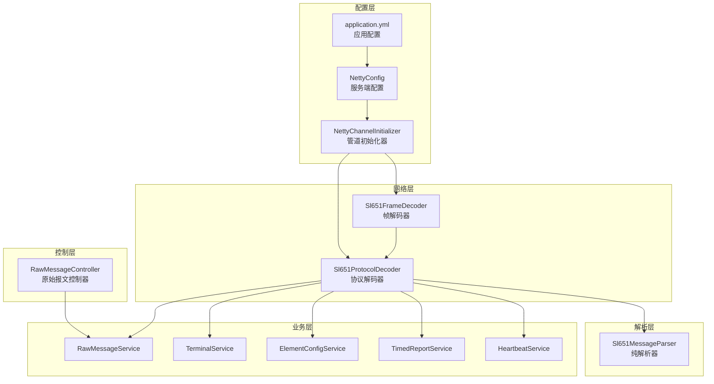
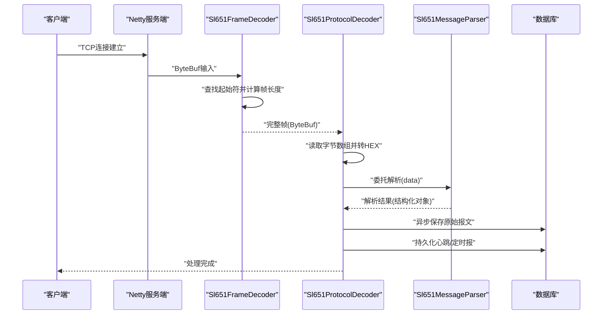
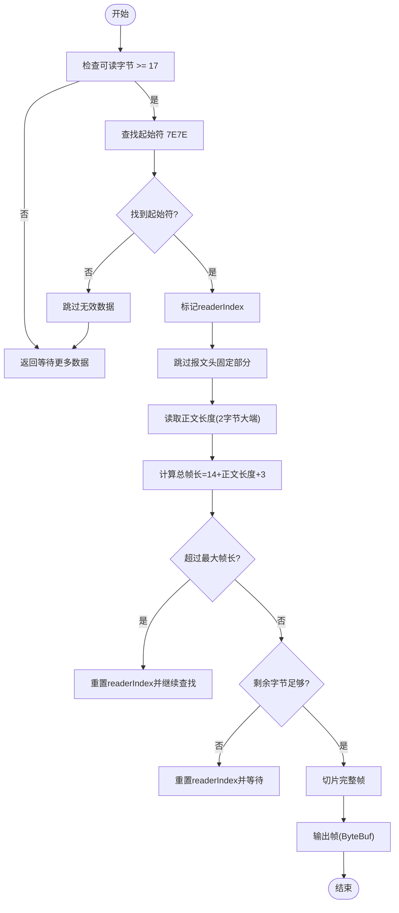
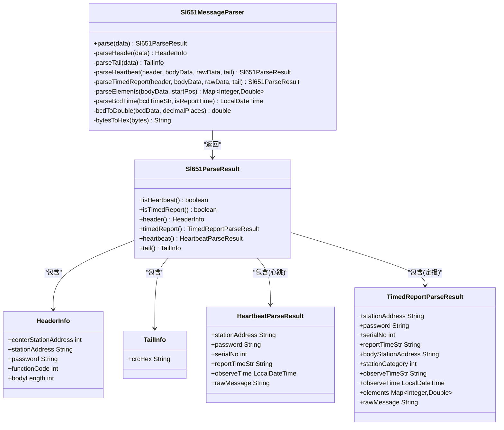
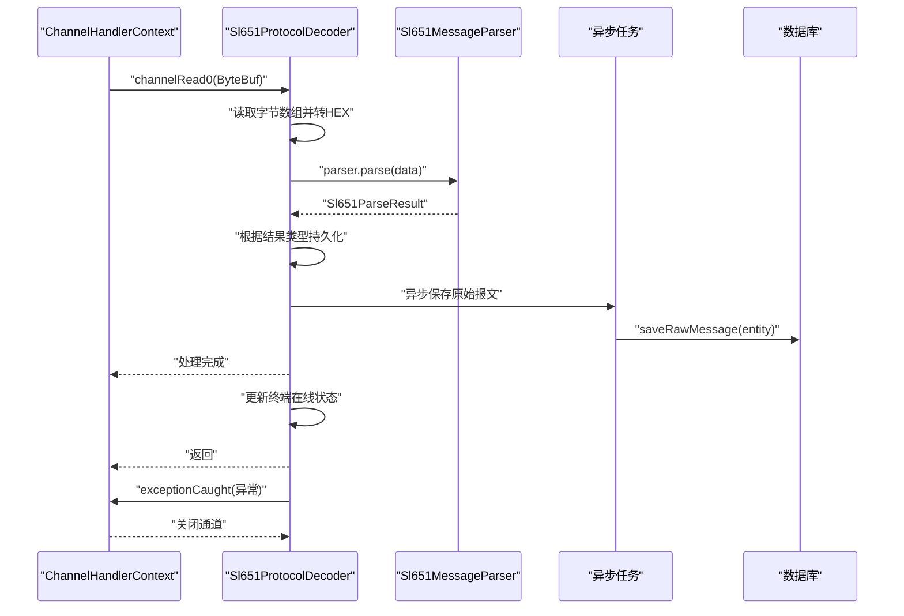
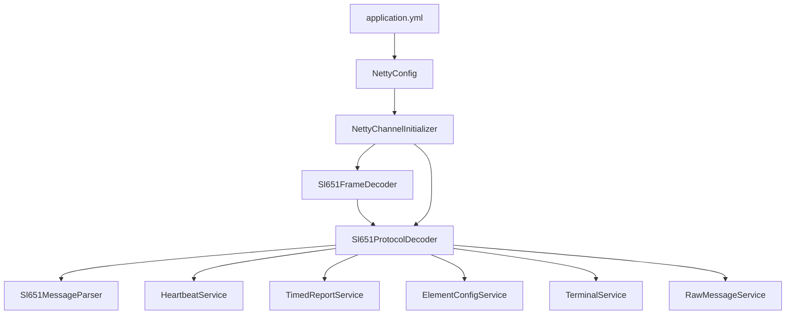

# Netty编解码器实现

<cite>
**本文档引用的文件**
- [Sl651ProtocolDecoder.java](file://src/main/java/com/hydro/monitor/netty/Sl651ProtocolDecoder.java)
- [Sl651MessageParser.java](file://src/main/java/com/hydro/monitor/netty/Sl651MessageParser.java)
- [Sl651FrameDecoder.java](file://src/main/java/com/hydro/monitor/netty/Sl651FrameDecoder.java)
- [NettyChannelInitializer.java](file://src/main/java/com/hydro/monitor/config/NettyChannelInitializer.java)
- [NettyConfig.java](file://src/main/java/com/hydro/monitor/config/NettyConfig.java)
- [application.yml](file://src/main/resources/application.yml)
- [Sl651ProtocolDecoderTest.java](file://src/test/java/com/hydro/monitor/netty/Sl651ProtocolDecoderTest.java)
- [Sl651MessageParserTest.java](file://src/test/java/com/hydro/monitor/netty/Sl651MessageParserTest.java)
- [RawMessageEntity.java](file://src/main/java/com/hydro/monitor/modules/entity/RawMessageEntity.java)
- [RawMessageService.java](file://src/main/java/com/hydro/monitor/modules/service/RawMessageService.java)
- [RawMessageController.java](file://src/main/java/com/hydro/monitor/modules/controller/RawMessageController.java)
</cite>

## 目录
1. [简介](#简介)
2. [项目结构](#项目结构)
3. [核心组件](#核心组件)
4. [架构概览](#架构概览)
5. [详细组件分析](#详细组件分析)
6. [依赖关系分析](#依赖关系分析)
7. [性能考虑](#性能考虑)
8. [故障排查指南](#故障排查指南)
9. [结论](#结论)
10. [附录](#附录)

## 简介
本文件深入解析基于Netty实现的SL 651-2014水文监测协议编解码器，重点阐述Sl651ProtocolDecoder的设计原理与实现细节。该实现采用分层架构：Sl651FrameDecoder负责TCP粘包/拆包处理，Sl651MessageParser专注于协议纯解析，Sl651ProtocolDecoder作为Netty与业务层的桥梁，协调数据流转与持久化。文档涵盖异步非阻塞架构、线程安全设计、内存优化策略、异常处理流程以及扩展定制化方案。

## 项目结构
该项目采用Spring Boot + Netty的混合架构，核心网络处理位于netty包，业务服务位于modules包，配置位于config包。

**图表来源**
- [Sl651FrameDecoder.java:25-121](file://src/main/java/com/hydro/monitor/netty/Sl651FrameDecoder.java#L25-L121)
- [Sl651ProtocolDecoder.java:39-278](file://src/main/java/com/hydro/monitor/netty/Sl651ProtocolDecoder.java#L39-L278)
- [Sl651MessageParser.java:25-648](file://src/main/java/com/hydro/monitor/netty/Sl651MessageParser.java#L25-L648)
- [NettyChannelInitializer.java:18-36](file://src/main/java/com/hydro/monitor/config/NettyChannelInitializer.java#L18-L36)
- [NettyConfig.java:26-87](file://src/main/java/com/hydro/monitor/config/NettyConfig.java#L26-L87)
- [application.yml:43-47](file://src/main/resources/application.yml#L43-L47)

**章节来源**
- [NettyChannelInitializer.java:18-36](file://src/main/java/com/hydro/monitor/config/NettyChannelInitializer.java#L18-L36)
- [NettyConfig.java:26-87](file://src/main/java/com/hydro/monitor/config/NettyConfig.java#L26-L87)
- [application.yml:43-47](file://src/main/resources/application.yml#L43-L47)

## 核心组件
本节概述三个关键组件及其职责：
- Sl651FrameDecoder：处理TCP粘包/拆包，基于起始符与正文长度字段进行帧边界识别。
- Sl651MessageParser：纯解析器，无状态、无副作用，专注将原始报文解析为结构化数据对象。
- Sl651ProtocolDecoder：Netty通道处理器，负责ByteBuf数据处理、异步持久化与异常捕获。

**章节来源**
- [Sl651FrameDecoder.java:25-121](file://src/main/java/com/hydro/monitor/netty/Sl651FrameDecoder.java#L25-L121)
- [Sl651MessageParser.java:25-648](file://src/main/java/com/hydro/monitor/netty/Sl651MessageParser.java#L25-L648)
- [Sl651ProtocolDecoder.java:39-278](file://src/main/java/com/hydro/monitor/netty/Sl651ProtocolDecoder.java#L39-L278)

## 架构概览
下图展示从接收到解析再到持久化的完整流程，体现异步非阻塞与线程安全设计。

**图表来源**
- [Sl651FrameDecoder.java:38-100](file://src/main/java/com/hydro/monitor/netty/Sl651FrameDecoder.java#L38-L100)
- [Sl651ProtocolDecoder.java:54-89](file://src/main/java/com/hydro/monitor/netty/Sl651ProtocolDecoder.java#L54-L89)
- [Sl651MessageParser.java:66-126](file://src/main/java/com/hydro/monitor/netty/Sl651MessageParser.java#L66-L126)

## 详细组件分析

### Sl651FrameDecoder：帧解码器
- 设计要点
  - 基于起始符7E7E与功能码后的正文长度字段进行帧边界识别。
  - 使用mark/reset机制确保在不完整帧时回退到帧起始位置，避免数据丢失。
  - 设置最大帧长度阈值，防止异常或恶意数据导致内存溢出。
- 关键流程
  - 扫描起始符7E7E，跳过无效数据。
  - 读取正文长度字段，计算总帧长。
  - 校验剩余数据是否足够，不足则等待后续数据。
  - 读取完整帧并输出至下游处理器。

**图表来源**
- [Sl651FrameDecoder.java:38-100](file://src/main/java/com/hydro/monitor/netty/Sl651FrameDecoder.java#L38-L100)

**章节来源**
- [Sl651FrameDecoder.java:25-121](file://src/main/java/com/hydro/monitor/netty/Sl651FrameDecoder.java#L25-L121)

### Sl651MessageParser：纯解析器
- 设计原则
  - 无状态、无副作用，与存储解耦，便于单元测试与复用。
  - 严格遵循SL 651-2014协议帧结构：报文头(14字节)+正文+报文尾(3字节)。
- 解析流程
  - 校验最小长度与起始符。
  - 解析报文头(中心站地址、遥测站地址、密码、功能码、正文长度、正文起始标识)。
  - 解析报文尾(CRC校验码)。
  - 根据功能码分发：心跳报(0x2F)或定时报(0x32)。
  - 对定时报解析要素数据循环，支持多要素并转换为结构化映射。
- 时间与BCD处理
  - 发报时间(6字节BCD)与观测时间(5字节BCD)分别按不同格式解析。
  - BCD数据转换为double值，小数位由数据定义位决定。

**图表来源**
- [Sl651MessageParser.java:25-648](file://src/main/java/com/hydro/monitor/netty/Sl651MessageParser.java#L25-L648)

**章节来源**
- [Sl651MessageParser.java:25-648](file://src/main/java/com/hydro/monitor/netty/Sl651MessageParser.java#L25-L648)

### Sl651ProtocolDecoder：协议解码器
- Netty集成
  - 继承SimpleChannelInboundHandler<ByteBuf>，直接处理ByteBuf类型。
  - 使用@ChannelHandler.Sharable注解，允许多个通道共享同一实例，提升资源利用率。
- 数据处理
  - 将ByteBuf读取为字节数组并转为HEX字符串，记录原始报文。
  - 委托Sl651MessageParser进行纯解析，获取结构化结果。
  - 根据解析结果类型进行业务处理：心跳报与定时报分别持久化。
- 异步非阻塞
  - 原始报文保存采用CompletableFuture.runAsync异步执行，避免阻塞Netty线程。
  - 业务层持久化(心跳/定时报)在当前线程执行，保证顺序一致性。
- 线程安全与内存优化
  - 解析器parser为final且无状态，天然线程安全。
  - ByteBuf读取后复制为字节数组，避免引用共享问题；异步任务中使用副本。
  - HEX转换与JSON序列化在必要时进行，减少不必要的开销。
- 异常处理
  - exceptionCaught统一捕获并关闭通道，防止异常传播导致连接泄漏。

**图表来源**
- [Sl651ProtocolDecoder.java:54-89](file://src/main/java/com/hydro/monitor/netty/Sl651ProtocolDecoder.java#L54-L89)
- [Sl651ProtocolDecoder.java:203-249](file://src/main/java/com/hydro/monitor/netty/Sl651ProtocolDecoder.java#L203-L249)

**章节来源**
- [Sl651ProtocolDecoder.java:39-278](file://src/main/java/com/hydro/monitor/netty/Sl651ProtocolDecoder.java#L39-L278)

### 生命周期管理与线程安全
- 生命周期
  - NettyConfig在Spring启动后异步启动服务端，绑定端口并等待连接。
  - NettyChannelInitializer在每个新连接建立时创建管道，添加帧解码器与协议解码器。
  - 优雅停机：@PreDestroy释放boss与worker线程组资源。
- 线程安全
  - Sl651ProtocolDecoder使用@ChannelHandler.Sharable，多个Channel共享同一实例。
  - Sl651MessageParser为final字段且无状态，天然线程安全。
  - 异步任务使用CompletableFuture，避免阻塞事件循环线程。

**章节来源**
- [NettyConfig.java:26-87](file://src/main/java/com/hydro/monitor/config/NettyConfig.java#L26-L87)
- [NettyChannelInitializer.java:18-36](file://src/main/java/com/hydro/monitor/config/NettyChannelInitializer.java#L18-L36)
- [Sl651ProtocolDecoder.java:39-39](file://src/main/java/com/hydro/monitor/netty/Sl651ProtocolDecoder.java#L39-L39)

### 与业务层的协作机制
- 原始报文持久化
  - 从HEX报文中提取站址、功能码、上下行标识等元信息，封装为RawMessageEntity。
  - 异步保存至数据库，避免影响网络处理性能。
- 心跳报与定时报处理
  - 心跳报：转换为HeartbeatEntity并持久化。
  - 定时报：转换为TimedReportEntity，结合要素配置表将十进制要素ID映射为业务代码，并序列化为JSON存储。
- 终端在线状态
  - 根据解析结果中的站址信息更新终端在线状态。

**章节来源**
- [Sl651ProtocolDecoder.java:98-182](file://src/main/java/com/hydro/monitor/netty/Sl651ProtocolDecoder.java#L98-L182)
- [RawMessageEntity.java:17-55](file://src/main/java/com/hydro/monitor/modules/entity/RawMessageEntity.java#L17-L55)
- [RawMessageService.java:13-48](file://src/main/java/com/hydro/monitor/modules/service/RawMessageService.java#L13-L48)
- [RawMessageController.java:25-81](file://src/main/java/com/hydro/monitor/modules/controller/RawMessageController.java#L25-L81)

## 依赖关系分析

**图表来源**
- [Sl651FrameDecoder.java:25-121](file://src/main/java/com/hydro/monitor/netty/Sl651FrameDecoder.java#L25-L121)
- [Sl651ProtocolDecoder.java:41-48](file://src/main/java/com/hydro/monitor/netty/Sl651ProtocolDecoder.java#L41-L48)
- [NettyChannelInitializer.java:18-36](file://src/main/java/com/hydro/monitor/config/NettyChannelInitializer.java#L18-L36)
- [NettyConfig.java:26-87](file://src/main/java/com/hydro/monitor/config/NettyConfig.java#L26-L87)
- [application.yml:43-47](file://src/main/resources/application.yml#L43-L47)

**章节来源**
- [Sl651ProtocolDecoder.java:41-48](file://src/main/java/com/hydro/monitor/netty/Sl651ProtocolDecoder.java#L41-L48)
- [NettyChannelInitializer.java:18-36](file://src/main/java/com/hydro/monitor/config/NettyChannelInitializer.java#L18-L36)

## 性能考虑
- 异步非阻塞
  - 原始报文保存使用CompletableFuture.runAsync，避免阻塞Netty事件线程。
  - 建议将业务层持久化也改为异步，进一步降低延迟抖动。
- 内存优化
  - ByteBuf读取后复制为字节数组，避免长时间持有缓冲区引用。
  - HEX转换与JSON序列化仅在必要时执行，减少GC压力。
- 线程模型
  - 使用共享的@Sharable处理器，减少实例创建与销毁成本。
  - 合理设置worker线程数，避免过多上下文切换。
- 资源管理
  - 优雅停机释放线程组，防止资源泄露。
  - 设置合理的最大帧长度阈值，防止内存溢出。

[本节提供通用指导，无需特定文件来源]

## 故障排查指南
- 常见问题
  - 报文解析失败：检查起始符、正文长度、CRC校验与功能码。
  - 异步保存失败：查看异步任务日志，确认数据库连接与事务配置。
  - 线程阻塞：确认异步任务是否正确执行，避免在Netty线程中进行阻塞操作。
- 调试方法
  - 启用Netty LoggingHandler，观察数据流向。
  - 在Sl651ProtocolDecoder中增加更详细的日志记录，定位问题环节。
  - 使用单元测试验证解析逻辑，分离存储依赖。
- 单元测试参考
  - Sl651MessageParserTest：验证心跳报与定时报解析。
  - Sl651ProtocolDecoderTest：验证功能码识别与十六进制转换。

**章节来源**
- [Sl651MessageParserTest.java:20-268](file://src/test/java/com/hydro/monitor/netty/Sl651MessageParserTest.java#L20-L268)
- [Sl651ProtocolDecoderTest.java:21-337](file://src/test/java/com/hydro/monitor/netty/Sl651ProtocolDecoderTest.java#L21-L337)

## 结论
该实现通过清晰的分层设计与严格的职责划分，实现了高性能、可维护的SL 651-2014协议编解码器。Sl651FrameDecoder负责帧边界识别，Sl651MessageParser专注纯解析，Sl651ProtocolDecoder桥接网络与业务层。异步非阻塞与线程安全设计确保了系统的高吞吐与稳定性。建议在生产环境中进一步优化异步持久化策略与监控告警体系。

[本节为总结性内容，无需特定文件来源]

## 附录

### 扩展与定制化示例
- 新增功能码支持
  - 在Sl651MessageParser中添加对应功能码的解析分支，并在Sl651ProtocolDecoder中补充相应业务处理。
- 自定义解析结果
  - 通过新增Record类型扩展Sl651ParseResult，以支持新的报文类型。
- 参数化配置
  - 将最大帧长度、日志级别等参数从代码迁移到application.yml，便于运行时调整。

[本节为概念性内容，无需特定文件来源]