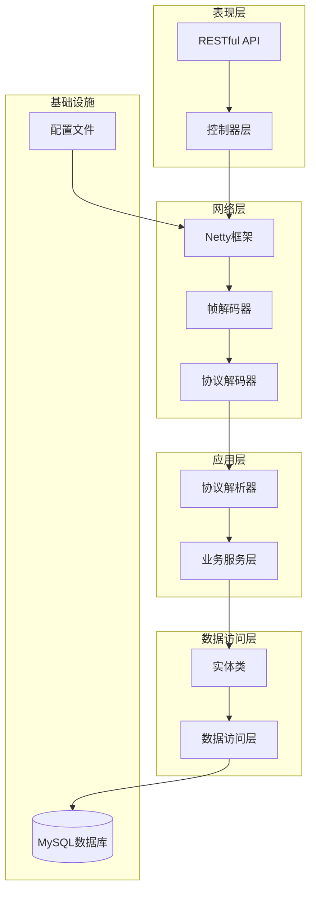
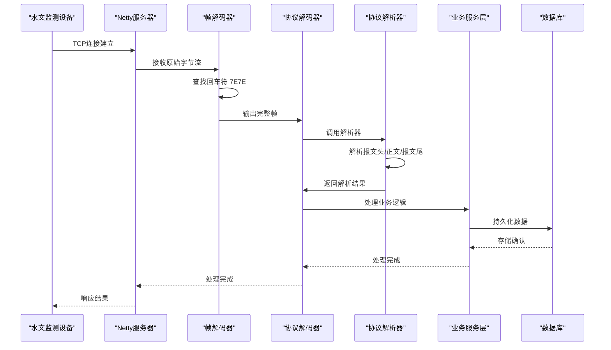
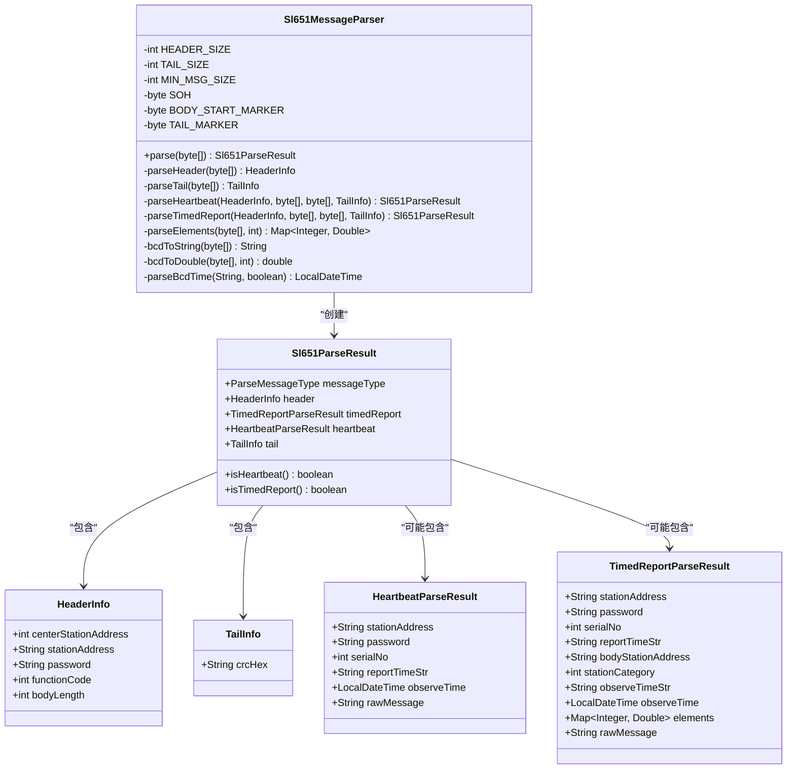
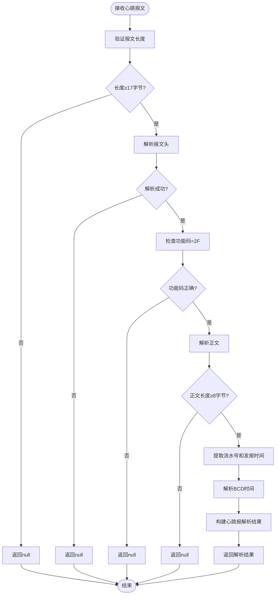
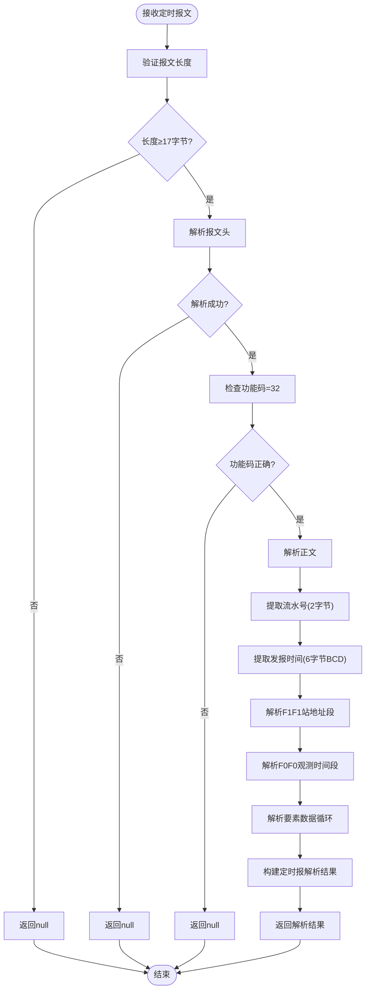
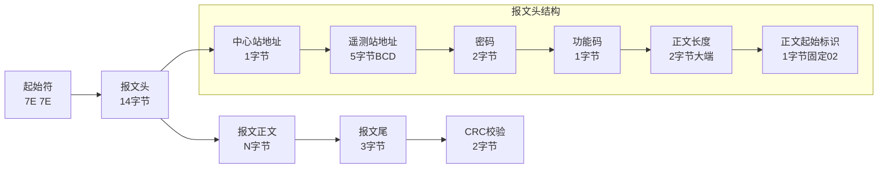
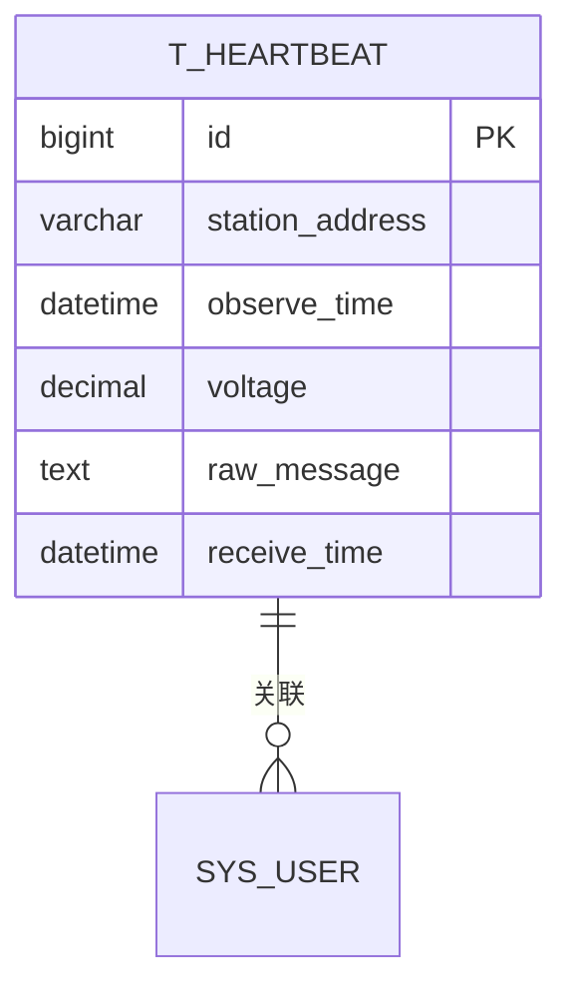
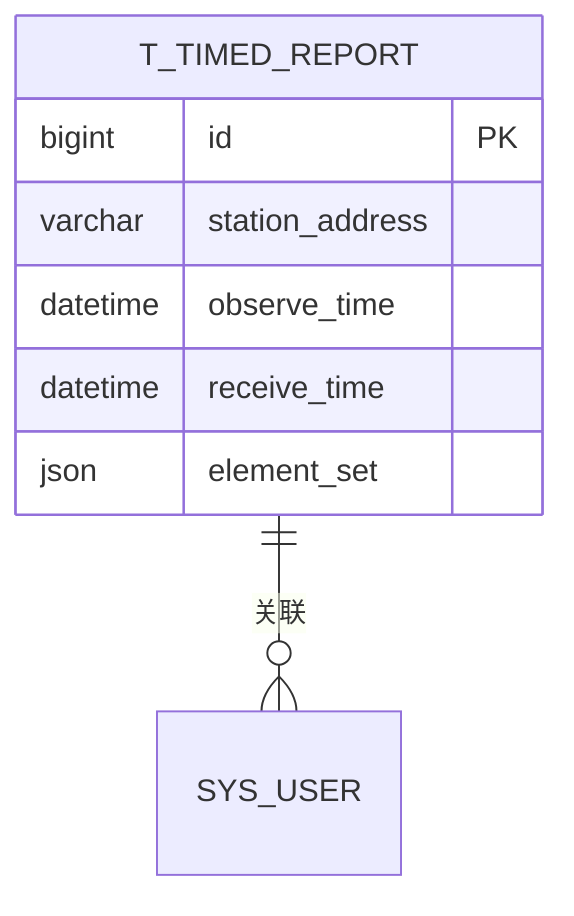
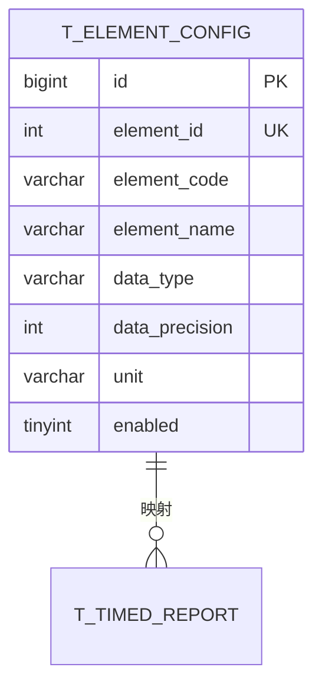
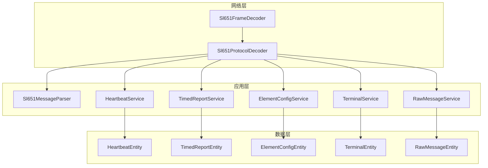

# SL 651协议规范

<cite>
**本文档引用的文件**
- [Sl651FrameDecoder.java](file://src/main/java/com/hydro/monitor/netty/Sl651FrameDecoder.java)
- [Sl651MessageParser.java](file://src/main/java/com/hydro/monitor/netty/Sl651MessageParser.java)
- [Sl651ProtocolDecoder.java](file://src/main/java/com/hydro/monitor/netty/Sl651ProtocolDecoder.java)
- [HeartbeatEntity.java](file://src/main/java/com/hydro/monitor/modules/entity/HeartbeatEntity.java)
- [TimedReportEntity.java](file://src/main/java/com/hydro/monitor/modules/entity/TimedReportEntity.java)
- [init.sql](file://src/main/resources/db/init.sql)
- [migration_raw_message.sql](file://src/main/resources/db/migration_raw_message.sql)
- [migration_timed_report.sql](file://src/main/resources/db/migration_timed_report.sql)
- [application.yml](file://src/main/resources/application.yml)
- [Sl651MessageParserTest.java](file://src/test/java/com/hydro/monitor/netty/Sl651MessageParserTest.java)
- [Sl651ProtocolDecoderTest.java](file://src/test/java/com/hydro/monitor/netty/Sl651ProtocolDecoderTest.java)
- [HeartbeatController.java](file://src/main/java/com/hydro/monitor/modules/controller/HeartbeatController.java)
- [TimedReportController.java](file://src/main/java/com/hydro/monitor/modules/controller/TimedReportController.java)
</cite>

## 目录
1. [简介](#简介)
2. [项目结构](#项目结构)
3. [核心组件](#核心组件)
4. [架构概览](#架构概览)
5. [详细组件分析](#详细组件分析)
6. [协议规范详解](#协议规范详解)
7. [数据模型](#数据模型)
8. [依赖关系分析](#依赖关系分析)
9. [性能考虑](#性能考虑)
10. [故障排除指南](#故障排除指南)
11. [结论](#结论)

## 简介

SL 651-2014《水文监测数据传输协议》是中国水文行业的重要标准，用于规范水文监测设备与数据中心之间的数据传输。本项目实现了该协议的完整解析和处理逻辑，包括心跳报文和定时报文的解析、存储和业务处理。

该系统采用Netty框架实现高性能的网络通信，通过独立的解析器实现协议解析与业务逻辑的解耦，确保了代码的可维护性和可测试性。

## 项目结构

项目采用典型的分层架构设计，主要分为以下层次：



**图表来源**
- [Sl651FrameDecoder.java:1-121](file://src/main/java/com/hydro/monitor/netty/Sl651FrameDecoder.java#L1-L121)
- [Sl651ProtocolDecoder.java:1-278](file://src/main/java/com/hydro/monitor/netty/Sl651ProtocolDecoder.java#L1-L278)
- [Sl651MessageParser.java:1-648](file://src/main/java/com/hydro/monitor/netty/Sl651MessageParser.java#L1-L648)

**章节来源**
- [Sl651FrameDecoder.java:1-121](file://src/main/java/com/hydro/monitor/netty/Sl651FrameDecoder.java#L1-L121)
- [Sl651ProtocolDecoder.java:1-278](file://src/main/java/com/hydro/monitor/netty/Sl651ProtocolDecoder.java#L1-L278)
- [Sl651MessageParser.java:1-648](file://src/main/java/com/hydro/monitor/netty/Sl651MessageParser.java#L1-L648)

## 核心组件

### 协议解析器 (Sl651MessageParser)

协议解析器是整个系统的核心组件，负责将原始的二进制报文解析为结构化的数据对象。其主要特点包括：

- **无状态设计**：解析器是线程安全的，可以在多线程环境中并发使用
- **纯解析逻辑**：专注于协议解析，不包含任何业务逻辑
- **完整的协议支持**：支持心跳报文和定时报文的解析
- **错误处理机制**：完善的错误检测和处理机制

### 帧解码器 (Sl651FrameDecoder)

帧解码器负责处理TCP粘包/拆包问题，确保网络传输的完整性：

- **起始符识别**：准确识别报文起始符 0x7E 0x7E
- **长度计算**：根据报文头中的长度字段计算完整帧大小
- **边界检查**：防止内存溢出和非法数据
- **缓冲区管理**：高效管理ByteBuf缓冲区

### 协议解码器 (Sl651ProtocolDecoder)

协议解码器作为Netty的ChannelHandler，负责整个协议处理流程：

- **Netty集成**：与Netty框架无缝集成
- **业务处理**：协调解析器和业务服务层
- **异步处理**：采用异步方式处理原始报文存储
- **异常处理**：统一的异常捕获和处理机制

**章节来源**
- [Sl651MessageParser.java:25-126](file://src/main/java/com/hydro/monitor/netty/Sl651MessageParser.java#L25-L126)
- [Sl651FrameDecoder.java:26-121](file://src/main/java/com/hydro/monitor/netty/Sl651FrameDecoder.java#L26-L121)
- [Sl651ProtocolDecoder.java:39-89](file://src/main/java/com/hydro/monitor/netty/Sl651ProtocolDecoder.java#L39-L89)

## 架构概览

系统采用分层架构设计，实现了协议解析与业务逻辑的完全分离：



**图表来源**
- [Sl651FrameDecoder.java:38-100](file://src/main/java/com/hydro/monitor/netty/Sl651FrameDecoder.java#L38-L100)
- [Sl651ProtocolDecoder.java:54-89](file://src/main/java/com/hydro/monitor/netty/Sl651ProtocolDecoder.java#L54-L89)
- [Sl651MessageParser.java:66-126](file://src/main/java/com/hydro/monitor/netty/Sl651MessageParser.java#L66-L126)

## 详细组件分析

### 协议解析器类图



**图表来源**
- [Sl651MessageParser.java:25-648](file://src/main/java/com/hydro/monitor/netty/Sl651MessageParser.java#L25-L648)

### 心跳报文处理流程



**图表来源**
- [Sl651MessageParser.java:141-176](file://src/main/java/com/hydro/monitor/netty/Sl651MessageParser.java#L141-L176)

### 定时报文处理流程



**图表来源**
- [Sl651MessageParser.java:196-283](file://src/main/java/com/hydro/monitor/netty/Sl651MessageParser.java#L196-L283)

**章节来源**
- [Sl651MessageParser.java:128-283](file://src/main/java/com/hydro/monitor/netty/Sl651MessageParser.java#L128-L283)
- [Sl651ProtocolDecoder.java:98-182](file://src/main/java/com/hydro/monitor/netty/Sl651ProtocolDecoder.java#L98-L182)

## 协议规范详解

### 帧结构规范

SL 651-2014协议采用固定帧格式，完整的帧结构如下：



**图表来源**
- [Sl651MessageParser.java:341-390](file://src/main/java/com/hydro/monitor/netty/Sl651MessageParser.java#L341-L390)

### 报文头字段定义

| 字节位置 | 字段名称 | 长度 | 数据类型 | 描述 |
|---------|---------|------|---------|------|
| 0-1 | 起始符 | 2字节 | 十六进制 | 固定值 0x7E 0x7E |
| 2 | 中心站地址 | 1字节 | 十进制 | 中心站标识符 |
| 3-7 | 遥测站地址 | 5字节 | BCD编码 | 遥测站编号（10位数字） |
| 8-9 | 密码 | 2字节 | 十六进制 | 连接认证密码 |
| 10 | 功能码 | 1字节 | 十六进制 | 报文类型标识 |
| 11-12 | 正文长度 | 2字节 | 大端序 | 正文字节数 |
| 13 | 正文起始标识 | 1字节 | 十六进制 | 固定值 0x02 |

### 报文尾字段定义

| 字节位置 | 字段名称 | 长度 | 数据类型 | 描述 |
|---------|---------|------|---------|------|
| 0 | 报文尾标识 | 1字节 | 十六进制 | 固定值 0x03 |
| 1-2 | CRC校验码 | 2字节 | 十六进制 | 报文完整性校验 |

### 心跳报文格式

心跳报文用于监测设备与数据中心的连接状态，功能码为 0x2F：

**报文结构：**
```
7E7E + 报文头 + 02 + 流水号(2字节) + 发报时间(6字节BCD) + 03 + CRC(2字节)
```

**字段说明：**
- **流水号**：2字节，递增计数器
- **发报时间**：6字节BCD编码，格式为 YYMMDDHHMMSS
- **功能码**：0x2F

### 定时报文格式

定时报文包含实时监测数据，功能码为 0x32：

**报文结构：**
```
7E7E + 报文头 + 02 + 流水号(2字节) + 发报时间(6字节BCD) + 
[F1F1段] + [F0F0段] + 要素数据循环 + 03 + CRC(2字节)
```

**F1F1站地址段：**
- 标识符：F1F1 (2字节)
- 站地址：5字节BCD
- 站分类码：1字节

**F0F0观测时间段：**
- 标识符：F0F0 (2字节)
- 观测时间：5字节BCD，格式为 YYMMDDHHMM

**要素数据循环：**
每个要素包含：
- 标识符：1字节
- 数据定义位：1字节
- 数据值：N字节BCD

### 数据定义位格式

数据定义位采用1字节格式，高5位表示数据字节数，低3位表示小数位数：

```
数据定义位 = [高5位: 数据字节数][低3位: 小数位数]
```

**解析规则：**
- 数据字节数 = 高5位值
- 小数位数 = 低3位值
- 数据值 = BCD编码的数值字符串

### 校验机制

系统实现了多层次的校验机制：

1. **起始符校验**：验证 0x7E 0x7E 起始符
2. **长度校验**：验证正文长度与报文头一致
3. **标识符校验**：验证正文起始标识符 0x02 和特殊标识符 F1F1/F0F0
4. **CRC校验**：验证报文尾CRC码（注：当前实现中CRC校验码解析但未执行具体校验）

### 错误处理规则

系统实现了完善的错误处理机制：

- **长度不足**：报文长度小于最小值时直接丢弃
- **格式错误**：起始符、标识符或功能码错误时返回null
- **数据溢出**：正文长度超过最大限制时丢弃并继续查找
- **解析异常**：BCD数据解析失败时记录警告并跳过该要素

**章节来源**
- [Sl651MessageParser.java:341-482](file://src/main/java/com/hydro/monitor/netty/Sl651MessageParser.java#L341-L482)
- [Sl651FrameDecoder.java:37-100](file://src/main/java/com/hydro/monitor/netty/Sl651FrameDecoder.java#L37-L100)

## 数据模型

### 心跳报文实体



**图表来源**
- [HeartbeatEntity.java:17-49](file://src/main/java/com/hydro/monitor/modules/entity/HeartbeatEntity.java#L17-L49)
- [init.sql:7-17](file://src/main/resources/db/init.sql#L7-L17)

### 定时报文实体



**图表来源**
- [TimedReportEntity.java:18-47](file://src/main/java/com/hydro/monitor/modules/entity/TimedReportEntity.java#L18-L47)
- [init.sql:19-29](file://src/main/resources/db/init.sql#L19-L29)

### 要素配置表



**图表来源**
- [init.sql:49-73](file://src/main/resources/db/init.sql#L49-L73)

**章节来源**
- [HeartbeatEntity.java:17-49](file://src/main/java/com/hydro/monitor/modules/entity/HeartbeatEntity.java#L17-L49)
- [TimedReportEntity.java:18-47](file://src/main/java/com/hydro/monitor/modules/entity/TimedReportEntity.java#L18-L47)
- [init.sql:49-73](file://src/main/resources/db/init.sql#L49-L73)

## 依赖关系分析

系统采用模块化设计，各组件之间的依赖关系清晰明确：



**图表来源**
- [Sl651FrameDecoder.java:26-121](file://src/main/java/com/hydro/monitor/netty/Sl651FrameDecoder.java#L26-L121)
- [Sl651ProtocolDecoder.java:41-48](file://src/main/java/com/hydro/monitor/netty/Sl651ProtocolDecoder.java#L41-L48)

### 组件耦合度分析

- **低耦合设计**：协议解析器与业务服务层完全解耦
- **单一职责**：每个组件都有明确的职责边界
- **可替换性**：网络层和业务层都可以独立替换
- **可测试性**：协议解析器可以独立进行单元测试

**章节来源**
- [Sl651ProtocolDecoder.java:41-48](file://src/main/java/com/hydro/monitor/netty/Sl651ProtocolDecoder.java#L41-L48)
- [Sl651MessageParser.java:25-126](file://src/main/java/com/hydro/monitor/netty/Sl651MessageParser.java#L25-L126)

## 性能考虑

### 网络性能优化

1. **零拷贝技术**：使用Netty的ByteBuf减少内存复制
2. **异步处理**：原始报文存储采用异步方式，避免阻塞Netty线程
3. **缓冲区管理**：高效的ByteBuf缓冲区管理和复用
4. **连接池**：合理的Netty线程池配置

### 内存管理

1. **帧大小限制**：最大帧长度限制为4096字节，防止内存溢出
2. **对象复用**：解析器设计为无状态，可重复使用
3. **及时释放**：正确释放ByteBuf资源

### 并发处理

1. **线程安全**：协议解析器是线程安全的
2. **无锁设计**：避免不必要的同步开销
3. **异步I/O**：充分利用Netty的异步特性

## 故障排除指南

### 常见问题及解决方案

#### 1. 报文解析失败

**症状**：日志显示"报文解析失败，返回null"

**可能原因**：
- 报文长度不足
- 起始符错误
- 功能码不支持
- 正文长度与实际不符

**解决方法**：
- 检查网络连接质量
- 验证报文格式
- 查看日志中的详细错误信息

#### 2. 心跳报文丢失

**症状**：终端长时间无心跳报文

**可能原因**：
- 网络中断
- 设备掉电
- 配置错误

**解决方法**：
- 检查终端设备状态
- 验证网络连通性
- 确认设备配置参数

#### 3. 数据存储异常

**症状**：数据库插入失败或数据不完整

**可能原因**：
- 数据库连接异常
- 表结构不匹配
- 数据类型转换错误

**解决方法**：
- 检查数据库连接配置
- 验证表结构定义
- 查看具体的异常堆栈信息

### 调试技巧

1. **启用详细日志**：在application.yml中调整日志级别
2. **单元测试**：使用提供的测试用例验证解析逻辑
3. **网络抓包**：使用Wireshark等工具分析网络通信
4. **数据库监控**：监控数据库连接和查询性能

**章节来源**
- [Sl651ProtocolDecoder.java:272-277](file://src/main/java/com/hydro/monitor/netty/Sl651ProtocolDecoder.java#L272-L277)
- [Sl651MessageParserTest.java:215-248](file://src/test/java/com/hydro/monitor/netty/Sl651MessageParserTest.java#L215-L248)

## 结论

本项目成功实现了SL 651-2014水文监测协议的完整解析和处理逻辑，具有以下特点：

### 技术优势

1. **架构清晰**：采用分层架构，职责分离明确
2. **性能优异**：基于Netty的高性能网络处理
3. **可维护性强**：协议解析与业务逻辑完全解耦
4. **测试完备**：提供了完整的单元测试覆盖

### 功能完整性

1. **协议支持**：完整支持心跳报文和定时报文
2. **数据处理**：支持多种要素类型的解析和存储
3. **业务集成**：与业务服务层无缝集成
4. **扩展性好**：易于添加新的要素类型和功能

### 实践价值

该实现为水文监测系统的开发提供了可靠的参考模板，开发者可以根据具体需求进行定制和扩展。系统的模块化设计使得后续的功能增强和维护都变得更加容易。

通过本项目的实现，开发者可以快速理解和掌握SL 651协议的处理逻辑，为构建稳定可靠的水文监测系统奠定坚实基础。