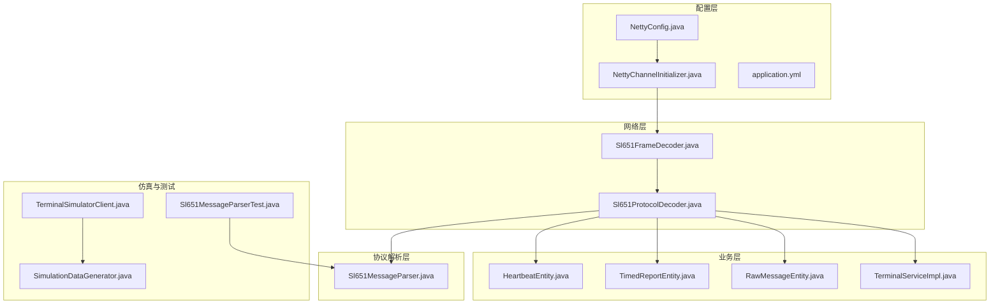
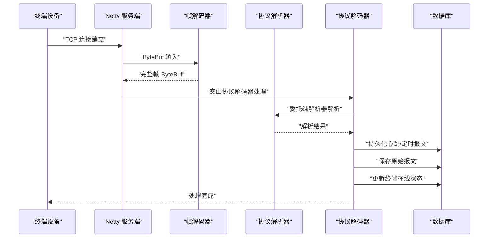
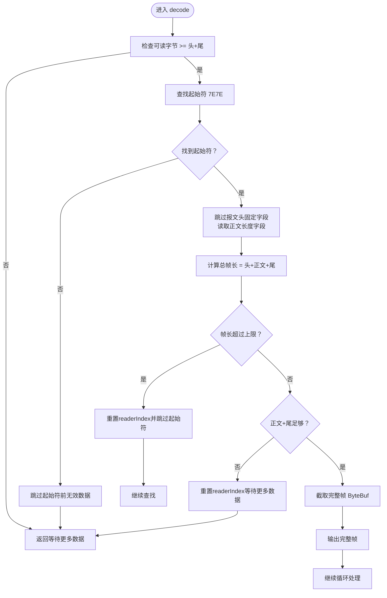
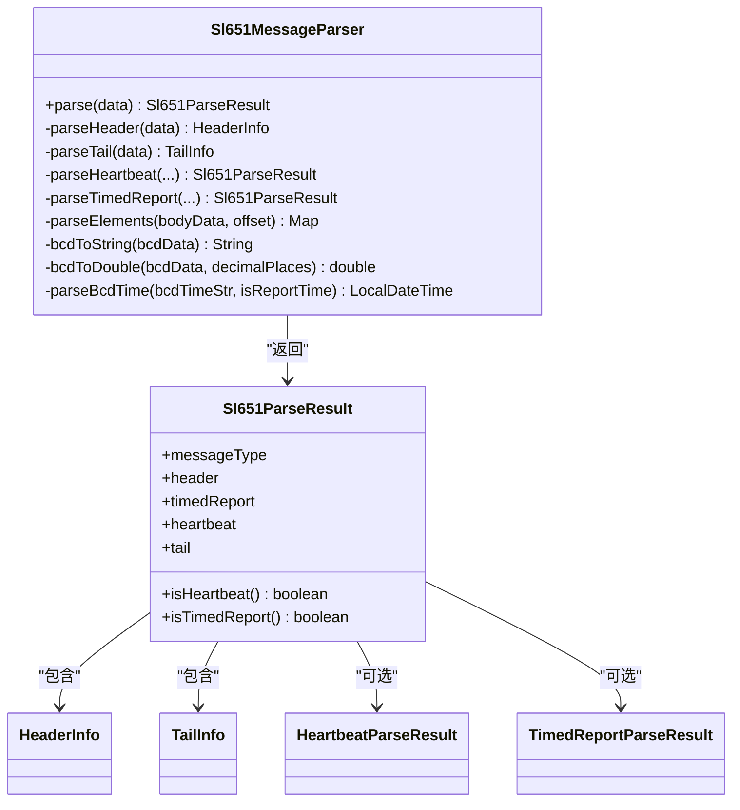
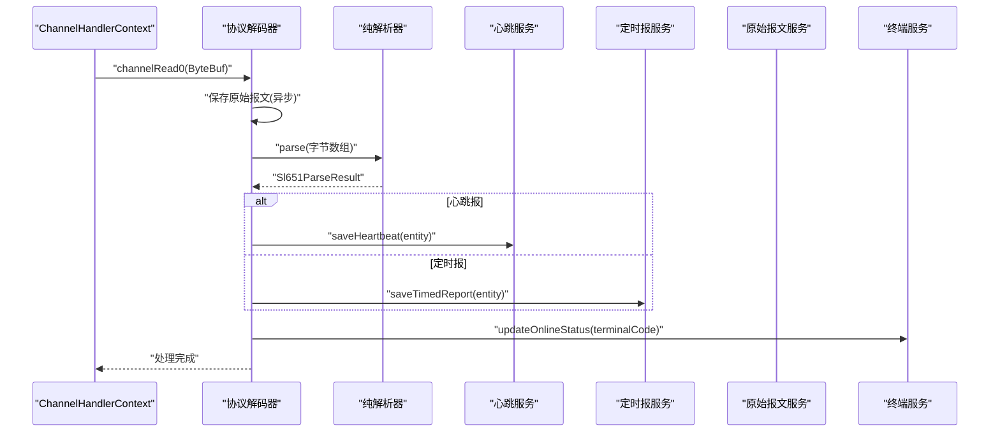
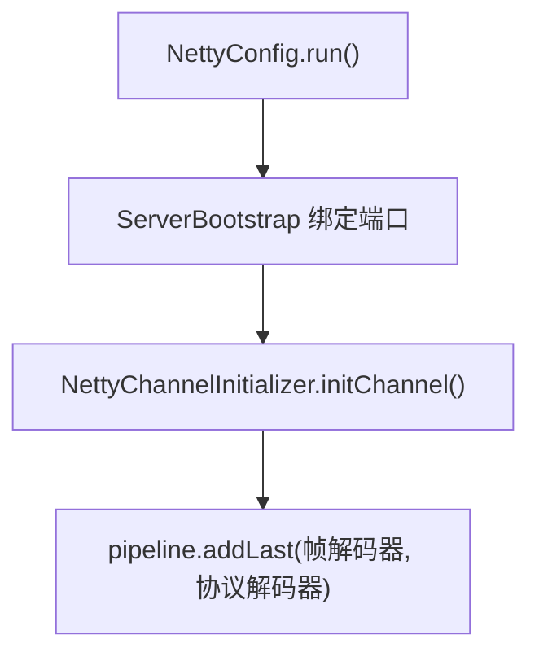
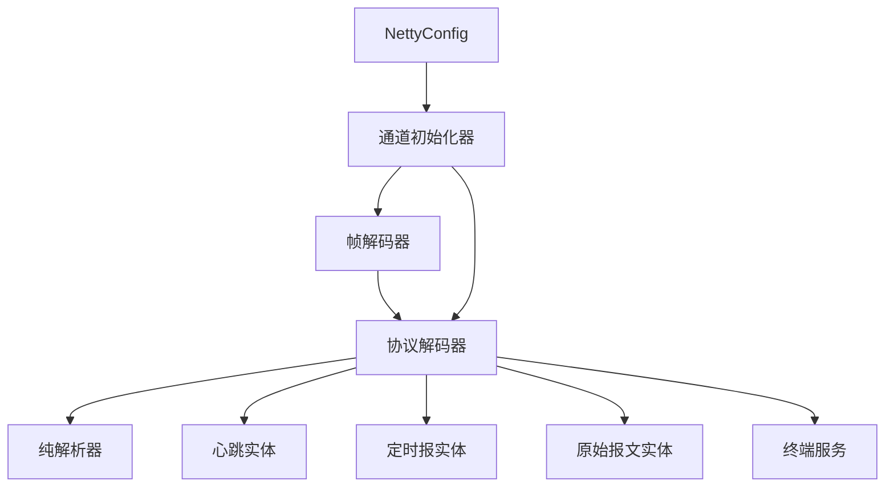

# 协议处理系统

<cite>
**本文引用的文件列表**
- [Sl651FrameDecoder.java](file://src/main/java/com/hydro/monitor/netty/Sl651FrameDecoder.java)
- [Sl651MessageParser.java](file://src/main/java/com/hydro/monitor/netty/Sl651MessageParser.java)
- [Sl651ProtocolDecoder.java](file://src/main/java/com/hydro/monitor/netty/Sl651ProtocolDecoder.java)
- [NettyChannelInitializer.java](file://src/main/java/com/hydro/monitor/config/NettyChannelInitializer.java)
- [NettyConfig.java](file://src/main/java/com/hydro/monitor/config/NettyConfig.java)
- [TerminalSimulatorClient.java](file://src/main/java/com/hydro/monitor/simulation/TerminalSimulatorClient.java)
- [SimulationDataGenerator.java](file://src/main/java/com/hydro/monitor/simulation/SimulationDataGenerator.java)
- [application.yml](file://src/main/resources/application.yml)
- [README.md](file://README.md)
- [Sl651MessageParserTest.java](file://src/test/java/com/hydro/monitor/netty/Sl651MessageParserTest.java)
- [HeartbeatEntity.java](file://src/main/java/com/hydro/monitor/modules/entity/HeartbeatEntity.java)
- [TimedReportEntity.java](file://src/main/java/com/hydro/monitor/modules/entity/TimedReportEntity.java)
- [RawMessageEntity.java](file://src/main/java/com/hydro/monitor/modules/entity/RawMessageEntity.java)
- [TerminalServiceImpl.java](file://src/main/java/com/hydro/monitor/modules/service/impl/TerminalServiceImpl.java)
</cite>

## 目录
1. [简介](#简介)
2. [项目结构](#项目结构)
3. [核心组件](#核心组件)
4. [架构总览](#架构总览)
5. [详细组件分析](#详细组件分析)
6. [依赖关系分析](#依赖关系分析)
7. [性能考量](#性能考量)
8. [故障排查指南](#故障排查指南)
9. [结论](#结论)
10. [附录](#附录)

## 简介
本项目是面向 SL 651-2014 水文监测标准协议的高性能协议处理系统，基于 Spring Boot 与 Netty 实现。系统通过自定义编解码器完成 TCP 粘包/拆包、帧识别与协议解析，支持心跳报文与定时报文两类消息的解析与落库，配套提供终端模拟器与测试用例，便于开发、联调与性能验证。

## 项目结构
系统采用按功能域分层的组织方式：
- config：Netty 服务端配置与通道初始化
- netty：协议编解码与解析器
- simulation：终端模拟器与数据生成器
- modules：业务模块（实体、服务、控制器等）
- resources：配置与数据库脚本

图表来源
- [NettyConfig.java:1-87](file://src/main/java/com/hydro/monitor/config/NettyConfig.java#L1-L87)
- [NettyChannelInitializer.java:1-36](file://src/main/java/com/hydro/monitor/config/NettyChannelInitializer.java#L1-L36)
- [Sl651FrameDecoder.java:1-121](file://src/main/java/com/hydro/monitor/netty/Sl651FrameDecoder.java#L1-L121)
- [Sl651ProtocolDecoder.java:1-278](file://src/main/java/com/hydro/monitor/netty/Sl651ProtocolDecoder.java#L1-L278)
- [Sl651MessageParser.java:1-648](file://src/main/java/com/hydro/monitor/netty/Sl651MessageParser.java#L1-L648)
- [HeartbeatEntity.java:1-50](file://src/main/java/com/hydro/monitor/modules/entity/HeartbeatEntity.java#L1-L50)
- [TimedReportEntity.java:1-48](file://src/main/java/com/hydro/monitor/modules/entity/TimedReportEntity.java#L1-L48)
- [RawMessageEntity.java:1-55](file://src/main/java/com/hydro/monitor/modules/entity/RawMessageEntity.java#L1-L55)
- [TerminalServiceImpl.java:1-200](file://src/main/java/com/hydro/monitor/modules/service/impl/TerminalServiceImpl.java#L1-L200)
- [TerminalSimulatorClient.java:1-207](file://src/main/java/com/hydro/monitor/simulation/TerminalSimulatorClient.java#L1-L207)
- [SimulationDataGenerator.java:1-164](file://src/main/java/com/hydro/monitor/simulation/SimulationDataGenerator.java#L1-L164)
- [Sl651MessageParserTest.java:1-268](file://src/test/java/com/hydro/monitor/netty/Sl651MessageParserTest.java#L1-L268)

章节来源
- [README.md:85-106](file://README.md#L85-L106)
- [application.yml:1-86](file://src/main/resources/application.yml#L1-L86)

## 核心组件
- 帧解码器：负责识别起始符、计算帧长、处理粘包/拆包
- 协议解析器：纯解析器，无状态、无副作用，完成报文头/尾解析与消息分发
- 协议解码器：Netty 通道处理器，桥接网络与业务层，负责持久化与状态更新
- Netty 配置：服务端启动、优雅停机与线程池管理
- 仿真与测试：终端模拟器与单元测试，覆盖心跳与定时报文解析

章节来源
- [Sl651FrameDecoder.java:10-26](file://src/main/java/com/hydro/monitor/netty/Sl651FrameDecoder.java#L10-L26)
- [Sl651MessageParser.java:10-25](file://src/main/java/com/hydro/monitor/netty/Sl651MessageParser.java#L10-L25)
- [Sl651ProtocolDecoder.java:25-39](file://src/main/java/com/hydro/monitor/netty/Sl651ProtocolDecoder.java#L25-L39)
- [NettyConfig.java:18-26](file://src/main/java/com/hydro/monitor/config/NettyConfig.java#L18-L26)

## 架构总览
系统采用“Netty 管道 + 纯解析器 + 业务服务”的分层架构：
- 网络层：通过自定义帧解码器与协议解码器完成报文接收与解析
- 解析层：纯解析器独立于业务，保证可测试性与可维护性
- 业务层：将解析结果持久化到数据库，并更新终端在线状态

图表来源
- [NettyConfig.java:47-70](file://src/main/java/com/hydro/monitor/config/NettyConfig.java#L47-L70)
- [NettyChannelInitializer.java:22-34](file://src/main/java/com/hydro/monitor/config/NettyChannelInitializer.java#L22-L34)
- [Sl651FrameDecoder.java:37-100](file://src/main/java/com/hydro/monitor/netty/Sl651FrameDecoder.java#L37-L100)
- [Sl651ProtocolDecoder.java:53-89](file://src/main/java/com/hydro/monitor/netty/Sl651ProtocolDecoder.java#L53-L89)
- [Sl651MessageParser.java:66-126](file://src/main/java/com/hydro/monitor/netty/Sl651MessageParser.java#L66-L126)

## 详细组件分析

### 帧解码器（Sl651FrameDecoder）
- 设计目标：基于起始符 7E7E 与正文长度字段进行帧识别，解决 TCP 粘包/拆包问题
- 关键机制：
  - 扫描起始符 7E7E，跳过起始符前无效数据
  - 读取功能码与正文长度字段，计算总帧长
  - 校验最大帧长，避免内存溢出
  - 数据不足时回退 readerIndex，等待后续数据
- 性能与健壮性：
  - 使用 mark/reset 控制回退，避免重复解析
  - 严格长度校验与日志记录，便于定位问题

图表来源
- [Sl651FrameDecoder.java:37-100](file://src/main/java/com/hydro/monitor/netty/Sl651FrameDecoder.java#L37-L100)

章节来源
- [Sl651FrameDecoder.java:10-26](file://src/main/java/com/hydro/monitor/netty/Sl651FrameDecoder.java#L10-L26)
- [Sl651FrameDecoder.java:37-100](file://src/main/java/com/hydro/monitor/netty/Sl651FrameDecoder.java#L37-L100)

### 协议解析器（Sl651MessageParser）
- 设计原则：纯解析器，无状态、无副作用，与存储解耦
- 报文结构：
  - 报文头（14字节）：起始符、中心站地址、遥测站地址、密码、功能码、正文长度、正文起始标识
  - 报文尾（3字节）：03 + CRC（2字节）
- 解析流程：
  - 校验最小长度与起始符
  - 解析报文头与报文尾
  - 根据功能码分发：心跳报（0x2F）或定时报（0x32）
  - 心跳报：流水号 + 发报时间（BCD）
  - 定时报：流水号 + 发报时间 + 站地址段（F1F1）+ 观测时间（F0F0）+ 要素数据循环
- 数据类型与校验：
  - BCD 编码：按字节解析为两位十六进制字符串，再按定义位构造数值
  - 时间解析：发报时间（12位）与观测时间（10位）分别解析
  - 要素映射：已知标识符与名称映射，未知标识符记录日志但不中断解析

图表来源
- [Sl651MessageParser.java:66-126](file://src/main/java/com/hydro/monitor/netty/Sl651MessageParser.java#L66-L126)
- [Sl651MessageParser.java:589-646](file://src/main/java/com/hydro/monitor/netty/Sl651MessageParser.java#L589-L646)

章节来源
- [Sl651MessageParser.java:10-25](file://src/main/java/com/hydro/monitor/netty/Sl651MessageParser.java#L10-L25)
- [Sl651MessageParser.java:66-126](file://src/main/java/com/hydro/monitor/netty/Sl651MessageParser.java#L66-L126)
- [Sl651MessageParser.java:141-176](file://src/main/java/com/hydro/monitor/netty/Sl651MessageParser.java#L141-L176)
- [Sl651MessageParser.java:196-283](file://src/main/java/com/hydro/monitor/netty/Sl651MessageParser.java#L196-L283)
- [Sl651MessageParser.java:292-339](file://src/main/java/com/hydro/monitor/netty/Sl651MessageParser.java#L292-L339)

### 协议解码器（Sl651ProtocolDecoder）
- 职责：接收 ByteBuf → 调用纯解析器 → 持久化 → 更新终端状态
- 关键流程：
  - 保存原始报文（异步非阻塞）
  - 解析结果分发：心跳报或定时报
  - 心跳报：持久化心跳实体
  - 定时报：构建要素集 JSON，持久化定时报实体
  - 更新终端在线状态与最后上报时间
- 错误处理：异常捕获并记录，关闭通道

图表来源
- [Sl651ProtocolDecoder.java:53-89](file://src/main/java/com/hydro/monitor/netty/Sl651ProtocolDecoder.java#L53-L89)
- [Sl651ProtocolDecoder.java:98-182](file://src/main/java/com/hydro/monitor/netty/Sl651ProtocolDecoder.java#L98-L182)
- [Sl651ProtocolDecoder.java:203-249](file://src/main/java/com/hydro/monitor/netty/Sl651ProtocolDecoder.java#L203-L249)

章节来源
- [Sl651ProtocolDecoder.java:25-39](file://src/main/java/com/hydro/monitor/netty/Sl651ProtocolDecoder.java#L25-L39)
- [Sl651ProtocolDecoder.java:53-89](file://src/main/java/com/hydro/monitor/netty/Sl651ProtocolDecoder.java#L53-L89)
- [Sl651ProtocolDecoder.java:98-182](file://src/main/java/com/hydro/monitor/netty/Sl651ProtocolDecoder.java#L98-L182)

### Netty 配置与通道初始化
- NettyConfig：CommandLineRunner 启动服务端，绑定端口，优雅停机
- NettyChannelInitializer：在管道中添加帧解码器与协议解码器

图表来源
- [NettyConfig.java:39-70](file://src/main/java/com/hydro/monitor/config/NettyConfig.java#L39-L70)
- [NettyChannelInitializer.java:22-34](file://src/main/java/com/hydro/monitor/config/NettyChannelInitializer.java#L22-L34)

章节来源
- [NettyConfig.java:18-26](file://src/main/java/com/hydro/monitor/config/NettyConfig.java#L18-L26)
- [NettyChannelInitializer.java:11-18](file://src/main/java/com/hydro/monitor/config/NettyChannelInitializer.java#L11-L18)

### 心跳报文与定时报文处理
- 心跳报（功能码 0x2F）：包含流水号与发报时间（BCD），解析后持久化并更新在线状态
- 定时报（功能码 0x32）：包含流水号、发报时间、站地址段（F1F1）、观测时间（F0F0）、要素数据循环；要素数据按定义位解析为数值并映射为要素编码，最终以 JSON 形式存储

章节来源
- [Sl651MessageParser.java:141-176](file://src/main/java/com/hydro/monitor/netty/Sl651MessageParser.java#L141-L176)
- [Sl651MessageParser.java:196-283](file://src/main/java/com/hydro/monitor/netty/Sl651MessageParser.java#L196-L283)
- [Sl651ProtocolDecoder.java:98-182](file://src/main/java/com/hydro/monitor/netty/Sl651ProtocolDecoder.java#L98-L182)

### 数据校验与错误处理
- 帧解码器：最大帧长限制、正文长度校验、起始符扫描
- 解析器：最小长度校验、起始符与正文起始标识校验、功能码分发、要素数据长度截断保护
- 解码器：异常捕获、通道关闭、异步保存原始报文

章节来源
- [Sl651FrameDecoder.java:77-83](file://src/main/java/com/hydro/monitor/netty/Sl651FrameDecoder.java#L77-L83)
- [Sl651MessageParser.java:73-100](file://src/main/java/com/hydro/monitor/netty/Sl651MessageParser.java#L73-L100)
- [Sl651ProtocolDecoder.java:272-276](file://src/main/java/com/hydro/monitor/netty/Sl651ProtocolDecoder.java#L272-L276)

### 协议兼容性与扩展建议
- 已支持功能码：0x2F（心跳报）、0x32（定时报）
- 可扩展点：新增功能码时在解析器中增加分发逻辑；要素标识符映射可配置化，便于扩展新的监测要素

章节来源
- [Sl651MessageParser.java:108-115](file://src/main/java/com/hydro/monitor/netty/Sl651MessageParser.java#L108-L115)

## 依赖关系分析
- 组件内聚与解耦：
  - 帧解码器与协议解码器通过 ByteBuf 传递，职责清晰
  - 纯解析器与业务层通过实体对象解耦，便于单元测试
- 外部依赖：
  - Netty：网络传输与事件驱动
  - Spring：IoC、事务与配置管理
  - MyBatis-Plus：数据库访问与实体映射

图表来源
- [Sl651FrameDecoder.java:1-121](file://src/main/java/com/hydro/monitor/netty/Sl651FrameDecoder.java#L1-L121)
- [Sl651ProtocolDecoder.java:1-278](file://src/main/java/com/hydro/monitor/netty/Sl651ProtocolDecoder.java#L1-L278)
- [Sl651MessageParser.java:1-648](file://src/main/java/com/hydro/monitor/netty/Sl651MessageParser.java#L1-L648)
- [NettyConfig.java:1-87](file://src/main/java/com/hydro/monitor/config/NettyConfig.java#L1-L87)
- [NettyChannelInitializer.java:1-36](file://src/main/java/com/hydro/monitor/config/NettyChannelInitializer.java#L1-L36)

章节来源
- [Sl651FrameDecoder.java:1-121](file://src/main/java/com/hydro/monitor/netty/Sl651FrameDecoder.java#L1-L121)
- [Sl651ProtocolDecoder.java:1-278](file://src/main/java/com/hydro/monitor/netty/Sl651ProtocolDecoder.java#L1-L278)
- [Sl651MessageParser.java:1-648](file://src/main/java/com/hydro/monitor/netty/Sl651MessageParser.java#L1-L648)
- [NettyConfig.java:1-87](file://src/main/java/com/hydro/monitor/config/NettyConfig.java#L1-L87)
- [NettyChannelInitializer.java:1-36](file://src/main/java/com/hydro/monitor/config/NettyChannelInitializer.java#L1-L36)

## 性能考量
- 线程模型：NIO 事件循环组，单个 boss 线程负责 accept，多 worker 线程处理 I/O
- 异步持久化：原始报文保存采用异步任务，避免阻塞 Netty 线程
- 内存控制：帧解码器设置最大帧长，防止内存溢出
- 日志级别：生产环境建议调整日志级别，减少高频日志对性能的影响

章节来源
- [NettyConfig.java:47-70](file://src/main/java/com/hydro/monitor/config/NettyConfig.java#L47-L70)
- [Sl651ProtocolDecoder.java:234-249](file://src/main/java/com/hydro/monitor/netty/Sl651ProtocolDecoder.java#L234-L249)
- [Sl651FrameDecoder.java:34-35](file://src/main/java/com/hydro/monitor/netty/Sl651FrameDecoder.java#L34-L35)

## 故障排查指南
- 常见问题与定位：
  - 起始符错误：检查物理链路与对端设备
  - 正文长度不一致：核对功能码与正文结构
  - BCD 解析异常：确认数据编码与定义位
  - 数据库连接异常：检查连接参数与权限
- 调试方法：
  - 启用 Netty 日志处理器（注释掉 LoggingHandler）
  - 检查 application.yml 中的日志配置
  - 使用单元测试验证解析逻辑

章节来源
- [Sl651MessageParser.java:358-390](file://src/main/java/com/hydro/monitor/netty/Sl651MessageParser.java#L358-L390)
- [Sl651MessageParser.java:400-414](file://src/main/java/com/hydro/monitor/netty/Sl651MessageParser.java#L400-L414)
- [Sl651ProtocolDecoder.java:272-276](file://src/main/java/com/hydro/monitor/netty/Sl651ProtocolDecoder.java#L272-L276)
- [application.yml:62-77](file://src/main/resources/application.yml#L62-L77)

## 结论
本系统通过清晰的分层设计与自定义编解码器，实现了 SL 651-2014 协议的稳定解析与高效处理。纯解析器确保了解析逻辑的可测试性与可维护性，配合异步持久化与在线状态管理，满足水文监测场景的高并发与可靠性需求。建议在生产环境中进一步完善配置项与监控告警体系。

## 附录

### 协议测试用例
- 心跳报测试：覆盖正常报文、长度不足、起始符错误等边界条件
- 定时报测试：单要素与多要素报文解析，验证要素定义位与 BCD 数值转换
- 工具方法：十六进制字符串转字节数组辅助测试

章节来源
- [Sl651MessageParserTest.java:31-100](file://src/test/java/com/hydro/monitor/netty/Sl651MessageParserTest.java#L31-L100)
- [Sl651MessageParserTest.java:104-212](file://src/test/java/com/hydro/monitor/netty/Sl651MessageParserTest.java#L104-L212)
- [Sl651MessageParserTest.java:215-248](file://src/test/java/com/hydro/monitor/netty/Sl651MessageParserTest.java#L215-L248)

### 模拟数据生成与终端仿真
- 模拟数据生成器：根据要素配置生成合理范围内的随机值
- 终端模拟器：定时发送定时报文，支持多终端并发上报
- 配置项：中心站地址、密码、上报间隔、终端数量等

章节来源
- [SimulationDataGenerator.java:37-59](file://src/main/java/com/hydro/monitor/simulation/SimulationDataGenerator.java#L37-L59)
- [TerminalSimulatorClient.java:56-90](file://src/main/java/com/hydro/monitor/simulation/TerminalSimulatorClient.java#L56-L90)
- [TerminalSimulatorClient.java:119-156](file://src/main/java/com/hydro/monitor/simulation/TerminalSimulatorClient.java#L119-L156)
- [application.yml:78-86](file://src/main/resources/application.yml#L78-L86)

### 实体模型与数据库设计
- 心跳报实体：遥测站地址、观测时间、原始报文、接收时间
- 定时报实体：遥测站地址、观测时间、接收时间、要素集 JSON
- 原始报文实体：遥测站地址、功能码、上下行标识、原始报文、接收时间、创建时间
- 终端服务：在线状态更新与新终端自动创建

章节来源
- [HeartbeatEntity.java:17-49](file://src/main/java/com/hydro/monitor/modules/entity/HeartbeatEntity.java#L17-L49)
- [TimedReportEntity.java:17-47](file://src/main/java/com/hydro/monitor/modules/entity/TimedReportEntity.java#L17-L47)
- [RawMessageEntity.java:17-54](file://src/main/java/com/hydro/monitor/modules/entity/RawMessageEntity.java#L17-L54)
- [TerminalServiceImpl.java:175-199](file://src/main/java/com/hydro/monitor/modules/service/impl/TerminalServiceImpl.java#L175-L199)