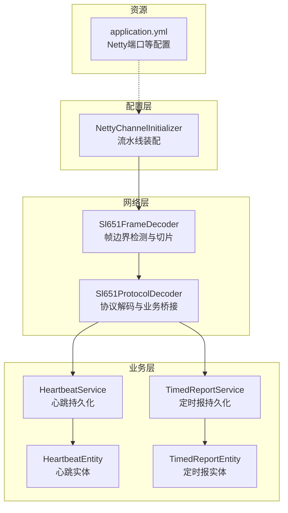
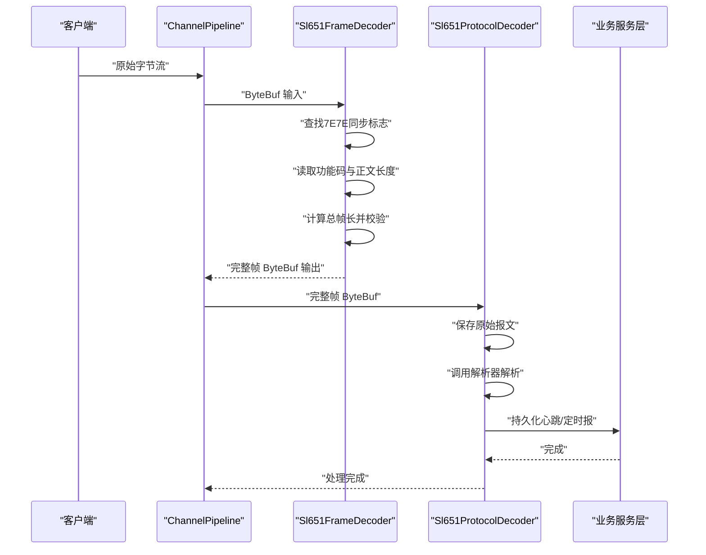
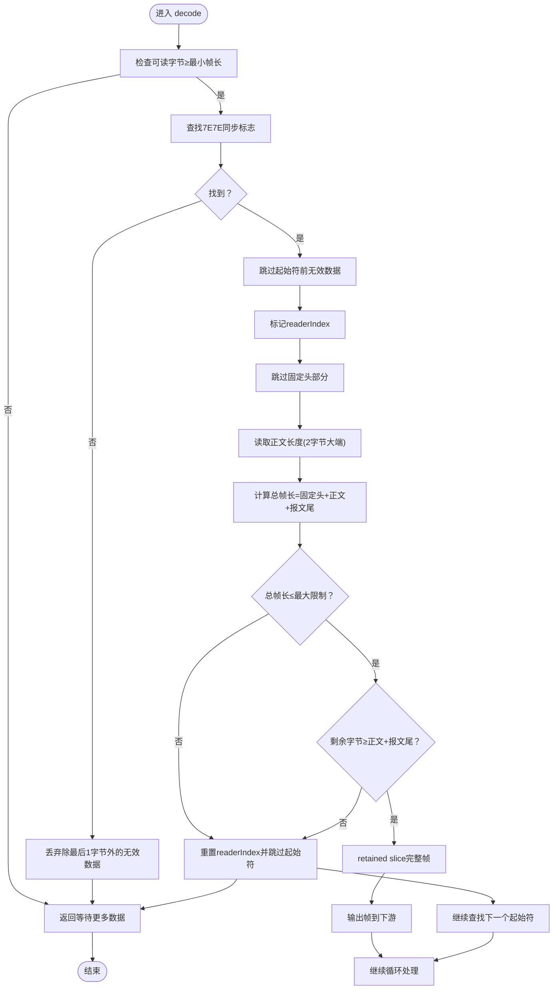
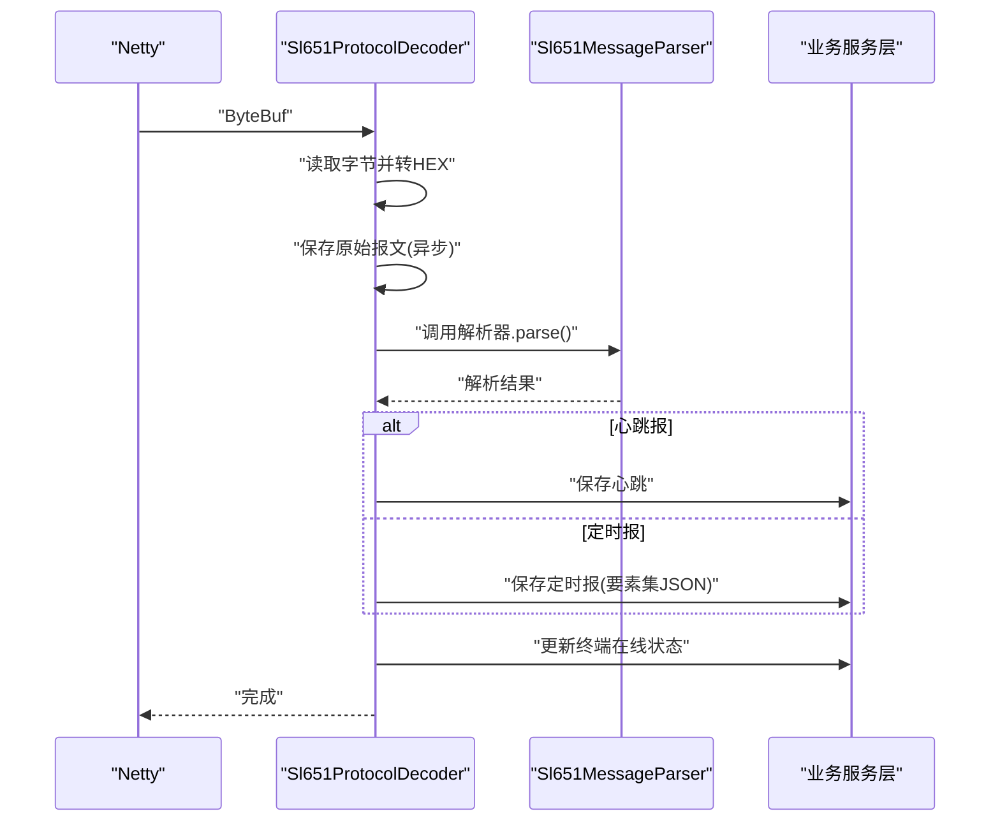
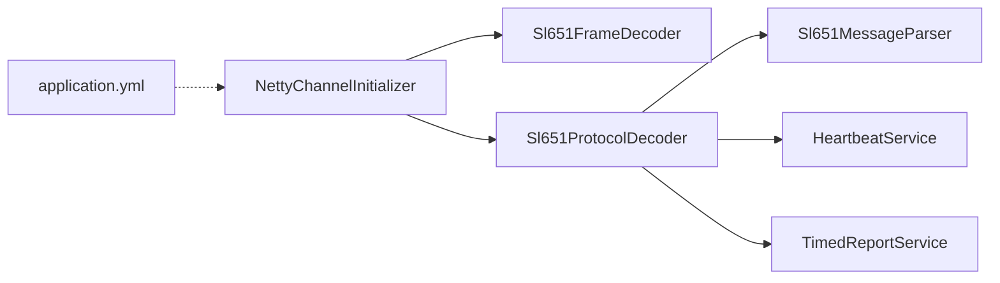

# 帧解码器

<cite>
**本文引用的文件列表**
- [Sl651FrameDecoder.java](file://src/main/java/com/hydro/monitor/netty/Sl651FrameDecoder.java)
- [Sl651MessageParser.java](file://src/main/java/com/hydro/monitor/netty/Sl651MessageParser.java)
- [Sl651ProtocolDecoder.java](file://src/main/java/com/hydro/monitor/netty/Sl651ProtocolDecoder.java)
- [NettyChannelInitializer.java](file://src/main/java/com/hydro/monitor/config/NettyChannelInitializer.java)
- [Sl651ProtocolDecoderTest.java](file://src/test/java/com/hydro/monitor/netty/Sl651ProtocolDecoderTest.java)
- [Sl651MessageParserTest.java](file://src/test/java/com/hydro/monitor/netty/Sl651MessageParserTest.java)
- [application.yml](file://src/main/resources/application.yml)
- [HeartbeatEntity.java](file://src/main/java/com/hydro/monitor/modules/entity/HeartbeatEntity.java)
- [TimedReportEntity.java](file://src/main/java/com/hydro/monitor/modules/entity/TimedReportEntity.java)
- [HeartbeatService.java](file://src/main/java/com/hydro/monitor/modules/service/HeartbeatService.java)
- [TimedReportService.java](file://src/main/java/com/hydro/monitor/modules/service/TimedReportService.java)
</cite>

## 目录
1. [简介](#简介)
2. [项目结构](#项目结构)
3. [核心组件](#核心组件)
4. [架构总览](#架构总览)
5. [详细组件分析](#详细组件分析)
6. [依赖关系分析](#依赖关系分析)
7. [性能考量](#性能考量)
8. [故障排查指南](#故障排查指南)
9. [结论](#结论)
10. [附录](#附录)

## 简介
本文件聚焦于 SL 651-2014 协议在 Netty 流水线中的帧解码器实现，系统性阐述 Sl651FrameDecoder 的帧边界检测机制、同步标志处理、数据帧提取算法，以及其在整体协议栈中的位置与协作关系。文档同时覆盖帧同步丢失处理、乱序帧处理与缓冲区管理策略，并提供配置参数、性能调优与故障诊断方法，帮助读者快速掌握该解码器的设计思想与工程实践。

## 项目结构
本项目采用基于模块的分层组织，网络层位于 netty 包内，包含帧解码器、消息解析器与协议解码器；配置层通过 NettyChannelInitializer 将处理器串联至 Netty ChannelPipeline；业务层负责将解析结果持久化至数据库。

图表来源
- [NettyChannelInitializer.java:18-34](file://src/main/java/com/hydro/monitor/config/NettyChannelInitializer.java#L18-L34)
- [Sl651FrameDecoder.java:26-100](file://src/main/java/com/hydro/monitor/netty/Sl651FrameDecoder.java#L26-L100)
- [Sl651ProtocolDecoder.java:39-89](file://src/main/java/com/hydro/monitor/netty/Sl651ProtocolDecoder.java#L39-L89)
- [application.yml:43-46](file://src/main/resources/application.yml#L43-L46)

章节来源
- [NettyChannelInitializer.java:18-34](file://src/main/java/com/hydro/monitor/config/NettyChannelInitializer.java#L18-L34)
- [application.yml:43-46](file://src/main/resources/application.yml#L43-L46)

## 核心组件
- Sl651FrameDecoder：基于 7E7E 同步标志与正文长度字段进行帧边界检测与切片，确保下游处理器接收完整帧。
- Sl651MessageParser：纯解析器，无状态、无副作用，负责将原始报文解析为结构化对象，不涉及存储。
- Sl651ProtocolDecoder：Netty 通道处理器，负责接收 ByteBuf、保存原始报文、调用解析器并持久化业务数据。
- NettyChannelInitializer：装配流水线，将帧解码器与协议解码器按顺序加入 ChannelPipeline。

章节来源
- [Sl651FrameDecoder.java:26-100](file://src/main/java/com/hydro/monitor/netty/Sl651FrameDecoder.java#L26-L100)
- [Sl651MessageParser.java:25-126](file://src/main/java/com/hydro/monitor/netty/Sl651MessageParser.java#L25-L126)
- [Sl651ProtocolDecoder.java:39-89](file://src/main/java/com/hydro/monitor/netty/Sl651ProtocolDecoder.java#L39-L89)
- [NettyChannelInitializer.java:18-34](file://src/main/java/com/hydro/monitor/config/NettyChannelInitializer.java#L18-L34)

## 架构总览
下图展示了 SL 651-2014 协议在 Netty 中的处理流程：客户端发送原始字节流，Sl651FrameDecoder 进行帧切片，随后 Sl651ProtocolDecoder 进行协议解析与业务落库。

图表来源
- [Sl651FrameDecoder.java:38-100](file://src/main/java/com/hydro/monitor/netty/Sl651FrameDecoder.java#L38-L100)
- [Sl651ProtocolDecoder.java:54-89](file://src/main/java/com/hydro/monitor/netty/Sl651ProtocolDecoder.java#L54-L89)
- [NettyChannelInitializer.java:22-33](file://src/main/java/com/hydro/monitor/config/NettyChannelInitializer.java#L22-L33)

## 详细组件分析

### Sl651FrameDecoder：帧边界检测与切片
- 同步标志识别：扫描 ByteBuf 中连续的 7E7E 字节序列作为帧起始标志。
- 帧长度计算：从报文头读取功能码与正文长度字段，计算总帧长 = 固定头长 + 正文长度 + 报文尾长度。
- 帧完整性验证：检查总帧长是否超过最大限制，以及缓冲区剩余字节是否足以组成完整帧。
- 数据帧提取：使用 retained slice 提取完整帧，避免复制，降低内存压力。
- 缓冲区管理：当未找到起始符或数据不足时，丢弃无效数据或回退到起始位置，保证后续处理的正确性。

图表来源
- [Sl651FrameDecoder.java:38-100](file://src/main/java/com/hydro/monitor/netty/Sl651FrameDecoder.java#L38-L100)
- [Sl651FrameDecoder.java:108-119](file://src/main/java/com/hydro/monitor/netty/Sl651FrameDecoder.java#L108-L119)

章节来源
- [Sl651FrameDecoder.java:26-100](file://src/main/java/com/hydro/monitor/netty/Sl651FrameDecoder.java#L26-L100)

### Sl651MessageParser：纯解析器
- 职责：将原始报文解析为结构化对象，不依赖数据库或网络，无副作用。
- 报文结构：报文头（固定长度）、正文、报文尾（03 + CRC）。解析器根据功能码分发到不同解析路径。
- 功能码分发：心跳报（0x2F）与定时报（0x32）分别解析。
- BCD 编码处理：支持 BCD 字节到字符串与数值的转换，支持小数位数控制。
- 结果模型：统一返回解析结果对象，包含报文头、报文尾与具体业务结果。

```mermaid
classDiagram
class Sl651MessageParser {
+parse(data) Sl651ParseResult
-parseHeader(data) HeaderInfo
-parseTail(data) TailInfo
-parseHeartbeat(header, body, raw, tail) Sl651ParseResult
-parseTimedReport(header, body, raw, tail) Sl651ParseResult
-parseElements(body, start) Map
-bcdToString(bcd) String
-bcdToDouble(bcd, decimals) double
-parseBcdTime(str, isReport) LocalDateTime
}
class Sl651ParseResult {
+messageType
+header
+timedReport
+heartbeat
+tail
+isHeartbeat() boolean
+isTimedReport() boolean
}
class HeaderInfo
class TailInfo
class HeartbeatParseResult
class TimedReportParseResult
Sl651MessageParser --> Sl651ParseResult : "返回"
Sl651ParseResult --> HeaderInfo : "包含"
Sl651ParseResult --> TailInfo : "包含"
Sl651ParseResult --> HeartbeatParseResult : "可选"
Sl651ParseResult --> TimedReportParseResult : "可选"
```

图表来源
- [Sl651MessageParser.java:66-126](file://src/main/java/com/hydro/monitor/netty/Sl651MessageParser.java#L66-L126)
- [Sl651MessageParser.java:358-390](file://src/main/java/com/hydro/monitor/netty/Sl651MessageParser.java#L358-L390)
- [Sl651MessageParser.java:400-414](file://src/main/java/com/hydro/monitor/netty/Sl651MessageParser.java#L400-L414)
- [Sl651MessageParser.java:626-646](file://src/main/java/com/hydro/monitor/netty/Sl651MessageParser.java#L626-L646)

章节来源
- [Sl651MessageParser.java:25-126](file://src/main/java/com/hydro/monitor/netty/Sl651MessageParser.java#L25-L126)

### Sl651ProtocolDecoder：协议解码与业务桥接
- 职责：接收 ByteBuf，保存原始报文，调用解析器进行纯解析，根据消息类型持久化到数据库。
- 异步持久化：原始报文保存采用异步方式，避免阻塞 Netty IO 线程。
- 在线状态更新：根据解析结果更新终端在线状态。
- 业务实体：心跳报与定时报分别映射到 HeartbeatEntity 与 TimedReportEntity。

图表来源
- [Sl651ProtocolDecoder.java:54-89](file://src/main/java/com/hydro/monitor/netty/Sl651ProtocolDecoder.java#L54-L89)
- [Sl651ProtocolDecoder.java:98-182](file://src/main/java/com/hydro/monitor/netty/Sl651ProtocolDecoder.java#L98-L182)
- [HeartbeatEntity.java:17-49](file://src/main/java/com/hydro/monitor/modules/entity/HeartbeatEntity.java#L17-L49)
- [TimedReportEntity.java:18-47](file://src/main/java/com/hydro/monitor/modules/entity/TimedReportEntity.java#L18-L47)

章节来源
- [Sl651ProtocolDecoder.java:39-89](file://src/main/java/com/hydro/monitor/netty/Sl651ProtocolDecoder.java#L39-L89)

### NettyChannelInitializer：流水线装配
- 将 Sl651FrameDecoder 与 Sl651ProtocolDecoder 依次加入 ChannelPipeline。
- 可选添加日志处理器用于调试。

章节来源
- [NettyChannelInitializer.java:18-34](file://src/main/java/com/hydro/monitor/config/NettyChannelInitializer.java#L18-L34)

## 依赖关系分析
- Sl651FrameDecoder 依赖 Netty ByteBuf API，实现帧边界检测与切片。
- Sl651ProtocolDecoder 依赖 Sl651MessageParser 进行纯解析，并依赖业务服务层进行持久化。
- NettyChannelInitializer 依赖两个处理器，负责装配流水线。
- application.yml 提供 Netty 服务器端口配置。

图表来源
- [NettyChannelInitializer.java:20-33](file://src/main/java/com/hydro/monitor/config/NettyChannelInitializer.java#L20-L33)
- [Sl651ProtocolDecoder.java:41-48](file://src/main/java/com/hydro/monitor/netty/Sl651ProtocolDecoder.java#L41-L48)
- [application.yml:43-46](file://src/main/resources/application.yml#L43-L46)

章节来源
- [NettyChannelInitializer.java:18-34](file://src/main/java/com/hydro/monitor/config/NettyChannelInitializer.java#L18-L34)
- [Sl651ProtocolDecoder.java:41-48](file://src/main/java/com/hydro/monitor/netty/Sl651ProtocolDecoder.java#L41-L48)

## 性能考量
- 帧长度上限：通过最大帧长度常量限制内存占用，防止异常报文导致内存膨胀。
- retained slice：使用 retained slice 提取完整帧，减少拷贝与 GC 压力。
- 异步持久化：原始报文保存采用异步任务，避免阻塞 Netty IO 线程。
- 缓冲区管理：未找到起始符或数据不足时，合理丢弃与回退，避免无效处理。
- 日志级别：生产环境建议调整日志级别以降低开销。

章节来源
- [Sl651FrameDecoder.java:35-36](file://src/main/java/com/hydro/monitor/netty/Sl651FrameDecoder.java#L35-L36)
- [Sl651FrameDecoder.java:95](file://src/main/java/com/hydro/monitor/netty/Sl651FrameDecoder.java#L95)
- [Sl651ProtocolDecoder.java:234-244](file://src/main/java/com/hydro/monitor/netty/Sl651ProtocolDecoder.java#L234-L244)
- [application.yml:64-76](file://src/main/resources/application.yml#L64-L76)

## 故障排查指南
- 帧同步丢失
  - 现象：持续丢弃无效数据或长时间等待数据。
  - 排查：确认上游设备是否正确发送 7E7E 同步标志；检查网络传输是否出现丢包或乱序。
  - 处理：Sl651FrameDecoder 已内置丢弃策略与回退逻辑，必要时可增加日志级别定位问题。
- 数据不足
  - 现象：多次返回等待更多数据。
  - 排查：确认网络粘包/拆包是否由 Sl651FrameDecoder 正确处理；检查正文长度字段是否正确。
- 帧超长
  - 现象：日志警告帧长度超过最大限制并丢弃。
  - 排查：核对正文长度字段与协议规范；检查是否存在异常报文。
- 解析失败
  - 现象：解析器返回 null 或日志警告。
  - 排查：使用单元测试样例对比报文结构；确认功能码与标识符是否符合预期。
- 持久化异常
  - 现象：日志报错但不中断连接。
  - 排查：检查数据库连接与表结构；确认要素映射配置是否正确。

章节来源
- [Sl651FrameDecoder.java:44-49](file://src/main/java/com/hydro/monitor/netty/Sl651FrameDecoder.java#L44-L49)
- [Sl651FrameDecoder.java:77-83](file://src/main/java/com/hydro/monitor/netty/Sl651FrameDecoder.java#L77-L83)
- [Sl651ProtocolDecoder.java:70-73](file://src/main/java/com/hydro/monitor/netty/Sl651ProtocolDecoder.java#L70-L73)
- [Sl651ProtocolDecoderTest.java:248-260](file://src/test/java/com/hydro/monitor/netty/Sl651ProtocolDecoderTest.java#L248-L260)
- [Sl651MessageParserTest.java:72-78](file://src/test/java/com/hydro/monitor/netty/Sl651MessageParserTest.java#L72-L78)

## 结论
Sl651FrameDecoder 通过严格的同步标志识别与长度计算，实现了对 SL 651-2014 协议的稳健帧切片；配合纯解析器与协议解码器，形成清晰的职责分离与高内聚低耦合的处理链。在工程实践中，应重点关注帧同步丢失、数据不足与帧超长等场景的处理策略，并结合异步持久化与合理的日志级别优化整体性能与可观测性。

## 附录

### 配置参数与调优建议
- Netty 服务器端口：在 application.yml 中配置 netty.server.port，默认 9000。
- 日志级别：生产环境建议提升日志级别，减少高频日志输出。
- 帧长度上限：MAX_FRAME_LENGTH 默认 4096，可根据实际报文规模调整。
- 异步持久化：原始报文保存采用异步任务，避免阻塞 IO 线程。

章节来源
- [application.yml:43-46](file://src/main/resources/application.yml#L43-L46)
- [Sl651FrameDecoder.java:35](file://src/main/java/com/hydro/monitor/netty/Sl651FrameDecoder.java#L35)
- [Sl651ProtocolDecoder.java:234-244](file://src/main/java/com/hydro/monitor/netty/Sl651ProtocolDecoder.java#L234-L244)

### 特殊帧格式与协议变体处理
- 心跳报（功能码 0x2F）：包含流水号与发报时间，解析器按固定结构提取。
- 定时报（功能码 0x32）：包含站地址段、观测时间段与要素数据循环，解析器按标识符与数据定义位解析。
- 未知功能码：解析器返回 null，协议解码器丢弃无效帧。
- BCD 编码：解析器提供 BCD 到字符串与数值的转换，支持小数位数控制。

章节来源
- [Sl651MessageParser.java:108-115](file://src/main/java/com/hydro/monitor/netty/Sl651MessageParser.java#L108-L115)
- [Sl651MessageParserTest.java:31-68](file://src/test/java/com/hydro/monitor/netty/Sl651MessageParserTest.java#L31-L68)
- [Sl651MessageParserTest.java:104-162](file://src/test/java/com/hydro/monitor/netty/Sl651MessageParserTest.java#L104-L162)