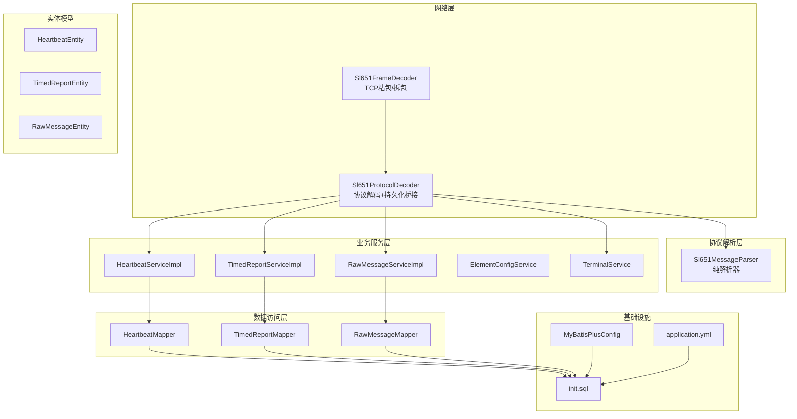
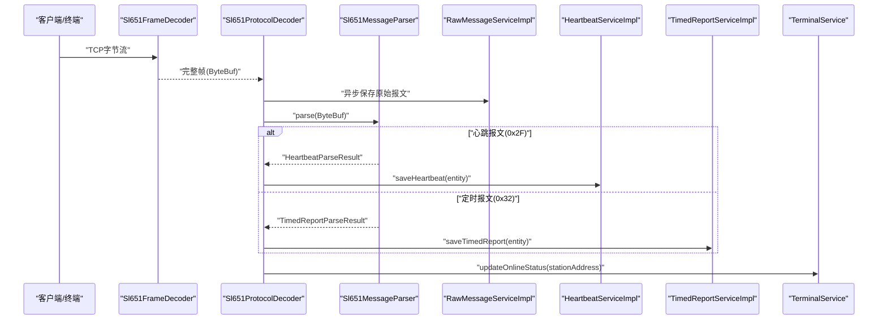
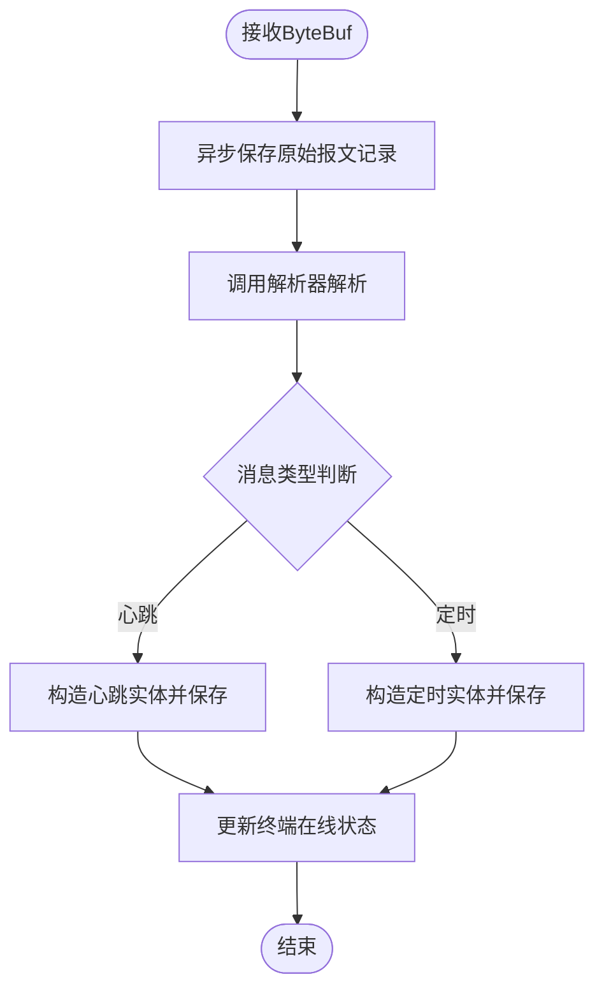
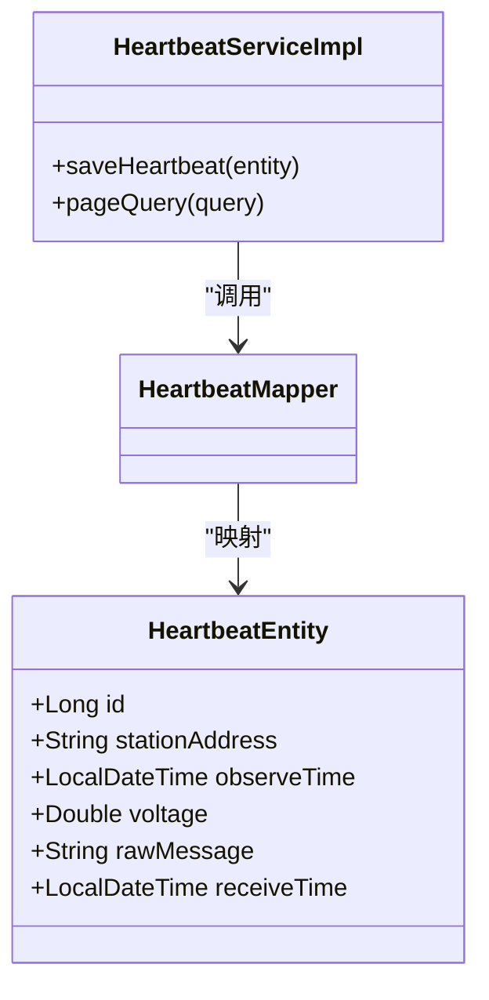
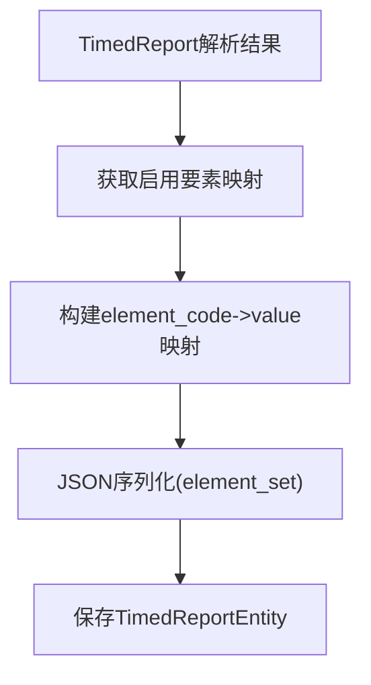
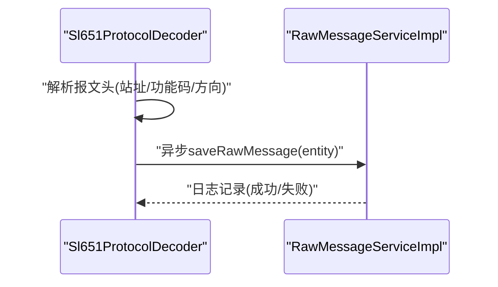
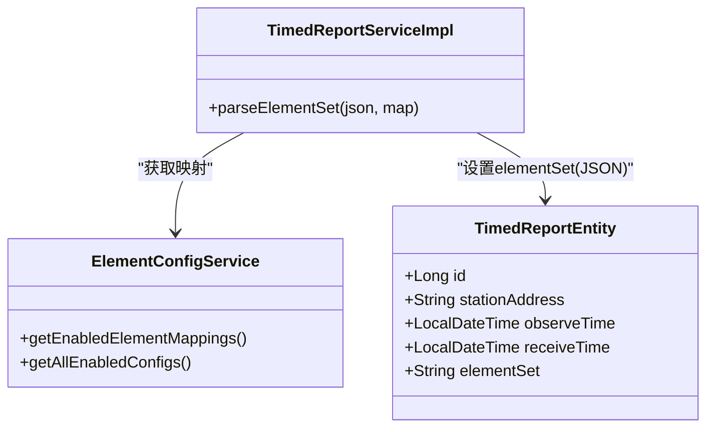
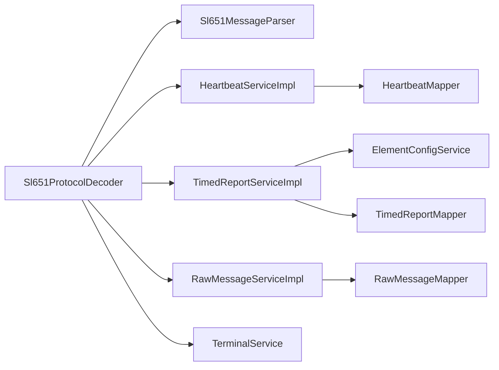

# 数据持久化处理

<cite>
**本文引用的文件**
- [Sl651ProtocolDecoder.java](file://src/main/java/com/hydro/monitor/netty/Sl651ProtocolDecoder.java)
- [Sl651MessageParser.java](file://src/main/java/com/hydro/monitor/netty/Sl651MessageParser.java)
- [Sl651FrameDecoder.java](file://src/main/java/com/hydro/monitor/netty/Sl651FrameDecoder.java)
- [HeartbeatEntity.java](file://src/main/java/com/hydro/monitor/modules/entity/HeartbeatEntity.java)
- [RawMessageEntity.java](file://src/main/java/com/hydro/monitor/modules/entity/RawMessageEntity.java)
- [TimedReportEntity.java](file://src/main/java/com/hydro/monitor/modules/entity/TimedReportEntity.java)
- [HeartbeatMapper.java](file://src/main/java/com/hydro/monitor/modules/mapper/HeartbeatMapper.java)
- [RawMessageMapper.java](file://src/main/java/com/hydro/monitor/modules/mapper/RawMessageMapper.java)
- [TimedReportMapper.java](file://src/main/java/com/hydro/monitor/modules/mapper/TimedReportMapper.java)
- [HeartbeatServiceImpl.java](file://src/main/java/com/hydro/monitor/modules/service/impl/HeartbeatServiceImpl.java)
- [RawMessageServiceImpl.java](file://src/main/java/com/hydro/monitor/modules/service/impl/RawMessageServiceImpl.java)
- [TimedReportServiceImpl.java](file://src/main/java/com/hydro/monitor/modules/service/impl/TimedReportServiceImpl.java)
- [ElementConfigService.java](file://src/main/java/com/hydro/monitor/modules/service/ElementConfigService.java)
- [TerminalService.java](file://src/main/java/com/hydro/monitor/modules/service/TerminalService.java)
- [MyBatisPlusConfig.java](file://src/main/java/com/hydro/monitor/config/MyBatisPlusConfig.java)
- [application.yml](file://src/main/resources/application.yml)
- [init.sql](file://src/main/resources/db/init.sql)
</cite>

## 目录
1. [简介](#简介)
2. [项目结构](#项目结构)
3. [核心组件](#核心组件)
4. [架构总览](#架构总览)
5. [详细组件分析](#详细组件分析)
6. [依赖分析](#依赖分析)
7. [性能考量](#性能考量)
8. [故障排查指南](#故障排查指南)
9. [结论](#结论)
10. [附录](#附录)

## 简介
本文件聚焦于协议处理后的数据持久化流程，覆盖心跳报文、定时报文与原始报文的存储策略；详解数据库实体映射、JSON序列化与要素配置映射；阐述异步非阻塞保存、批量处理优化与事务管理现状；并给出数据一致性、错误恢复与性能监控建议，以及索引设计、查询优化与备份策略，最后提供扩展新数据类型的实践路径。

## 项目结构
围绕数据持久化的相关模块与文件组织如下：
- Netty协议栈：帧解码、协议解析、业务落库
- 实体与映射：心跳、原始报文、定时报文三类实体及对应Mapper
- 服务层：各报文的保存、查询与要素集解析
- 配置：MyBatis-Plus分页、数据源、Jackson序列化等
- 数据库：初始化脚本与索引设计

**图表来源**
- [Sl651FrameDecoder.java:1-121](file://src/main/java/com/hydro/monitor/netty/Sl651FrameDecoder.java#L1-L121)
- [Sl651ProtocolDecoder.java:1-278](file://src/main/java/com/hydro/monitor/netty/Sl651ProtocolDecoder.java#L1-L278)
- [Sl651MessageParser.java:1-648](file://src/main/java/com/hydro/monitor/netty/Sl651MessageParser.java#L1-L648)
- [HeartbeatServiceImpl.java:1-59](file://src/main/java/com/hydro/monitor/modules/service/impl/HeartbeatServiceImpl.java#L1-L59)
- [TimedReportServiceImpl.java:1-332](file://src/main/java/com/hydro/monitor/modules/service/impl/TimedReportServiceImpl.java#L1-L332)
- [RawMessageServiceImpl.java:1-160](file://src/main/java/com/hydro/monitor/modules/service/impl/RawMessageServiceImpl.java#L1-L160)
- [MyBatisPlusConfig.java:1-39](file://src/main/java/com/hydro/monitor/config/MyBatisPlusConfig.java#L1-L39)
- [application.yml:1-86](file://src/main/resources/application.yml#L1-L86)
- [init.sql:1-93](file://src/main/resources/db/init.sql#L1-L93)

**章节来源**
- [Sl651FrameDecoder.java:1-121](file://src/main/java/com/hydro/monitor/netty/Sl651FrameDecoder.java#L1-L121)
- [Sl651ProtocolDecoder.java:1-278](file://src/main/java/com/hydro/monitor/netty/Sl651ProtocolDecoder.java#L1-L278)
- [Sl651MessageParser.java:1-648](file://src/main/java/com/hydro/monitor/netty/Sl651MessageParser.java#L1-L648)
- [HeartbeatServiceImpl.java:1-59](file://src/main/java/com/hydro/monitor/modules/service/impl/HeartbeatServiceImpl.java#L1-L59)
- [TimedReportServiceImpl.java:1-332](file://src/main/java/com/hydro/monitor/modules/service/impl/TimedReportServiceImpl.java#L1-L332)
- [RawMessageServiceImpl.java:1-160](file://src/main/java/com/hydro/monitor/modules/service/impl/RawMessageServiceImpl.java#L1-L160)
- [MyBatisPlusConfig.java:1-39](file://src/main/java/com/hydro/monitor/config/MyBatisPlusConfig.java#L1-L39)
- [application.yml:1-86](file://src/main/resources/application.yml#L1-L86)
- [init.sql:1-93](file://src/main/resources/db/init.sql#L1-L93)

## 核心组件
- 协议解析器：纯函数式、无状态、可复用，负责将原始字节流解析为结构化结果。
- 协议解码器：Netty处理器，负责帧提取、调用解析器、异步持久化与终端状态更新。
- 服务层：分别对心跳、定时报文与原始报文执行保存、分页查询与要素集解析。
- 数据访问层：基于MyBatis-Plus的通用Mapper，提供插入与分页查询能力。
- 配置：MyBatis-Plus分页拦截器、数据源与Jackson序列化配置。

**章节来源**
- [Sl651MessageParser.java:1-648](file://src/main/java/com/hydro/monitor/netty/Sl651MessageParser.java#L1-L648)
- [Sl651ProtocolDecoder.java:1-278](file://src/main/java/com/hydro/monitor/netty/Sl651ProtocolDecoder.java#L1-L278)
- [HeartbeatServiceImpl.java:1-59](file://src/main/java/com/hydro/monitor/modules/service/impl/HeartbeatServiceImpl.java#L1-L59)
- [TimedReportServiceImpl.java:1-332](file://src/main/java/com/hydro/monitor/modules/service/impl/TimedReportServiceImpl.java#L1-L332)
- [RawMessageServiceImpl.java:1-160](file://src/main/java/com/hydro/monitor/modules/service/impl/RawMessageServiceImpl.java#L1-L160)
- [MyBatisPlusConfig.java:1-39](file://src/main/java/com/hydro/monitor/config/MyBatisPlusConfig.java#L1-L39)
- [application.yml:1-86](file://src/main/resources/application.yml#L1-L86)

## 架构总览
下图展示了从网络接收原始报文到数据库落库的关键流转，强调异步非阻塞与纯解析解耦。

**图表来源**
- [Sl651FrameDecoder.java:1-121](file://src/main/java/com/hydro/monitor/netty/Sl651FrameDecoder.java#L1-L121)
- [Sl651ProtocolDecoder.java:1-278](file://src/main/java/com/hydro/monitor/netty/Sl651ProtocolDecoder.java#L1-L278)
- [Sl651MessageParser.java:1-648](file://src/main/java/com/hydro/monitor/netty/Sl651MessageParser.java#L1-L648)
- [RawMessageServiceImpl.java:1-160](file://src/main/java/com/hydro/monitor/modules/service/impl/RawMessageServiceImpl.java#L1-L160)
- [HeartbeatServiceImpl.java:1-59](file://src/main/java/com/hydro/monitor/modules/service/impl/HeartbeatServiceImpl.java#L1-L59)
- [TimedReportServiceImpl.java:1-332](file://src/main/java/com/hydro/monitor/modules/service/impl/TimedReportServiceImpl.java#L1-L332)
- [TerminalService.java:1-79](file://src/main/java/com/hydro/monitor/modules/service/TerminalService.java#L1-L79)

## 详细组件分析

### 协议解析与持久化桥接
- 帧解码：通过扫描起始符与功能码后的正文长度字段计算总帧长，确保完整帧输出。
- 协议解码：在channelRead0中接收ByteBuf，先异步保存原始报文，再调用解析器获取结构化结果，随后根据消息类型分别持久化心跳或定时报文，并更新终端在线状态。

**图表来源**
- [Sl651ProtocolDecoder.java:54-89](file://src/main/java/com/hydro/monitor/netty/Sl651ProtocolDecoder.java#L54-L89)
- [Sl651ProtocolDecoder.java:203-249](file://src/main/java/com/hydro/monitor/netty/Sl651ProtocolDecoder.java#L203-L249)

**章节来源**
- [Sl651FrameDecoder.java:38-100](file://src/main/java/com/hydro/monitor/netty/Sl651FrameDecoder.java#L38-L100)
- [Sl651ProtocolDecoder.java:54-89](file://src/main/java/com/hydro/monitor/netty/Sl651ProtocolDecoder.java#L54-L89)
- [Sl651ProtocolDecoder.java:203-249](file://src/main/java/com/hydro/monitor/netty/Sl651ProtocolDecoder.java#L203-L249)

### 心跳报文持久化策略
- 存储内容：站址、观测时间、原始报文HEX、接收时间。
- 保存流程：由协议解码器将解析结果映射为实体，调用服务层保存，日志记录成功/失败。
- 查询：按观测时间倒序分页，支持起止时间过滤。

**图表来源**
- [HeartbeatEntity.java:1-50](file://src/main/java/com/hydro/monitor/modules/entity/HeartbeatEntity.java#L1-L50)
- [HeartbeatMapper.java:1-15](file://src/main/java/com/hydro/monitor/modules/mapper/HeartbeatMapper.java#L1-L15)
- [HeartbeatServiceImpl.java:26-57](file://src/main/java/com/hydro/monitor/modules/service/impl/HeartbeatServiceImpl.java#L26-L57)

**章节来源**
- [HeartbeatEntity.java:1-50](file://src/main/java/com/hydro/monitor/modules/entity/HeartbeatEntity.java#L1-L50)
- [HeartbeatServiceImpl.java:26-57](file://src/main/java/com/hydro/monitor/modules/service/impl/HeartbeatServiceImpl.java#L26-L57)

### 定时报文持久化策略
- 存储内容：站址、观测时间、接收时间、要素集(JSON)。
- 要素集映射：解析器产出的要素标识符集合，结合要素配置映射为数据库字段名，序列化为JSON存入element_set。
- 查询：支持按站址、观测时间区间过滤，按观测时间倒序；提供“最新记录”与“按站址分页”等场景。
- VO转换：关联终端信息与要素配置，将JSON解析为结构化数组返回。

**图表来源**
- [Sl651ProtocolDecoder.java:126-182](file://src/main/java/com/hydro/monitor/netty/Sl651ProtocolDecoder.java#L126-L182)
- [TimedReportServiceImpl.java:283-330](file://src/main/java/com/hydro/monitor/modules/service/impl/TimedReportServiceImpl.java#L283-L330)

**章节来源**
- [TimedReportEntity.java:1-48](file://src/main/java/com/hydro/monitor/modules/entity/TimedReportEntity.java#L1-L48)
- [TimedReportServiceImpl.java:44-80](file://src/main/java/com/hydro/monitor/modules/service/impl/TimedReportServiceImpl.java#L44-L80)
- [TimedReportServiceImpl.java:131-156](file://src/main/java/com/hydro/monitor/modules/service/impl/TimedReportServiceImpl.java#L131-L156)
- [TimedReportServiceImpl.java:185-246](file://src/main/java/com/hydro/monitor/modules/service/impl/TimedReportServiceImpl.java#L185-L246)
- [TimedReportServiceImpl.java:283-330](file://src/main/java/com/hydro/monitor/modules/service/impl/TimedReportServiceImpl.java#L283-L330)

### 原始报文持久化策略
- 存储内容：站址、功能码、上下行标识、原始报文HEX、接收时间、创建时间。
- 异步保存：在解码器中解析报文头提取站址、功能码、方向，封装实体后通过CompletableFuture异步提交至服务层，避免阻塞Netty线程。
- 查询：支持按站址、功能码过滤，按接收时间倒序分页；提供按ID解析为JSON的能力（调用解析器与Jackson）。

**图表来源**
- [Sl651ProtocolDecoder.java:203-249](file://src/main/java/com/hydro/monitor/netty/Sl651ProtocolDecoder.java#L203-L249)
- [RawMessageServiceImpl.java:32-52](file://src/main/java/com/hydro/monitor/modules/service/impl/RawMessageServiceImpl.java#L32-L52)

**章节来源**
- [RawMessageEntity.java:1-55](file://src/main/java/com/hydro/monitor/modules/entity/RawMessageEntity.java#L1-L55)
- [RawMessageServiceImpl.java:32-52](file://src/main/java/com/hydro/monitor/modules/service/impl/RawMessageServiceImpl.java#L32-L52)
- [RawMessageServiceImpl.java:54-79](file://src/main/java/com/hydro/monitor/modules/service/impl/RawMessageServiceImpl.java#L54-L79)
- [RawMessageServiceImpl.java:90-110](file://src/main/java/com/hydro/monitor/modules/service/impl/RawMessageServiceImpl.java#L90-L110)

### 数据库实体映射与JSON序列化
- 实体映射：使用MyBatis-Plus注解映射表名与字段，ID采用雪花策略；定时报文的element_set字段以JSON类型存储。
- JSON序列化：使用Jackson将要素映射序列化为JSON字符串；解析时反序列化为结构化数组，结合要素配置映射名称与单位。
- 要素配置映射：服务层提供启用要素映射（要素ID->数据库字段名），用于将解析标识符转换为稳定字段名。

**图表来源**
- [TimedReportEntity.java:1-48](file://src/main/java/com/hydro/monitor/modules/entity/TimedReportEntity.java#L1-L48)
- [ElementConfigService.java:17-31](file://src/main/java/com/hydro/monitor/modules/service/ElementConfigService.java#L17-L31)
- [TimedReportServiceImpl.java:283-330](file://src/main/java/com/hydro/monitor/modules/service/impl/TimedReportServiceImpl.java#L283-L330)

**章节来源**
- [TimedReportEntity.java:42-46](file://src/main/java/com/hydro/monitor/modules/entity/TimedReportEntity.java#L42-L46)
- [TimedReportServiceImpl.java:283-330](file://src/main/java/com/hydro/monitor/modules/service/impl/TimedReportServiceImpl.java#L283-L330)
- [ElementConfigService.java:24-31](file://src/main/java/com/hydro/monitor/modules/service/ElementConfigService.java#L24-L31)

### 异步非阻塞保存机制
- 原始报文：在解码器中通过CompletableFuture.runAsync异步保存，避免阻塞网络线程。
- 心跳/定时报文：服务层直接同步保存，但整体仍保持非阻塞的网络处理链路。
- 建议：对高频定时报文可考虑引入队列+批处理，进一步削峰填谷。

**章节来源**
- [Sl651ProtocolDecoder.java:234-244](file://src/main/java/com/hydro/monitor/netty/Sl651ProtocolDecoder.java#L234-L244)
- [RawMessageServiceImpl.java:32-52](file://src/main/java/com/hydro/monitor/modules/service/impl/RawMessageServiceImpl.java#L32-L52)

### 批量处理优化
- 定时报文VO转换：一次性收集所有站址，批量查询终端与要素配置，减少多次数据库往返。
- 建议：可引入批量插入与批量更新策略，配合异步队列实现更高效的吞吐。

**章节来源**
- [TimedReportServiceImpl.java:191-246](file://src/main/java/com/hydro/monitor/modules/service/impl/TimedReportServiceImpl.java#L191-L246)

### 事务管理策略
- 当前实现：服务层保存操作未显式声明事务，遵循Spring默认传播行为。
- 建议：对需要强一致性的复合操作（如保存原始报文与要素集）可使用@Transactional标注，确保原子性。

**章节来源**
- [HeartbeatServiceImpl.java:26-35](file://src/main/java/com/hydro/monitor/modules/service/impl/HeartbeatServiceImpl.java#L26-L35)
- [TimedReportServiceImpl.java:44-53](file://src/main/java/com/hydro/monitor/modules/service/impl/TimedReportServiceImpl.java#L44-L53)
- [RawMessageServiceImpl.java:32-52](file://src/main/java/com/hydro/monitor/modules/service/impl/RawMessageServiceImpl.java#L32-L52)

## 依赖分析
- 组件内聚与耦合
  - 解码器依赖解析器、服务层与终端服务，职责清晰；解析器完全无状态，便于复用。
  - 服务层依赖Mapper与配置服务，面向接口编程，利于测试与替换。
- 外部依赖
  - Netty用于TCP帧处理与事件驱动；MyBatis-Plus提供ORM与分页；Jackson负责JSON序列化；MySQL提供持久化存储。

**图表来源**
- [Sl651ProtocolDecoder.java:41-48](file://src/main/java/com/hydro/monitor/netty/Sl651ProtocolDecoder.java#L41-L48)
- [Sl651MessageParser.java:25-25](file://src/main/java/com/hydro/monitor/netty/Sl651MessageParser.java#L25-L25)
- [HeartbeatServiceImpl.java:24-24](file://src/main/java/com/hydro/monitor/modules/service/impl/HeartbeatServiceImpl.java#L24-L24)
- [TimedReportServiceImpl.java:38-42](file://src/main/java/com/hydro/monitor/modules/service/impl/TimedReportServiceImpl.java#L38-L42)
- [RawMessageServiceImpl.java:28-30](file://src/main/java/com/hydro/monitor/modules/service/impl/RawMessageServiceImpl.java#L28-L30)

**章节来源**
- [Sl651ProtocolDecoder.java:41-48](file://src/main/java/com/hydro/monitor/netty/Sl651ProtocolDecoder.java#L41-L48)
- [Sl651MessageParser.java:25-25](file://src/main/java/com/hydro/monitor/netty/Sl651MessageParser.java#L25-L25)
- [HeartbeatServiceImpl.java:24-24](file://src/main/java/com/hydro/monitor/modules/service/impl/HeartbeatServiceImpl.java#L24-L24)
- [TimedReportServiceImpl.java:38-42](file://src/main/java/com/hydro/monitor/modules/service/impl/TimedReportServiceImpl.java#L38-L42)
- [RawMessageServiceImpl.java:28-30](file://src/main/java/com/hydro/monitor/modules/service/impl/RawMessageServiceImpl.java#L28-L30)

## 性能考量
- 异步与非阻塞
  - 原始报文异步保存避免阻塞网络线程，提升并发处理能力。
- 批量与缓存
  - VO转换阶段已做批量查询终端与要素配置，建议进一步引入队列与批处理。
- 分页与索引
  - 初始化脚本已建立常用索引（站址、观测时间），建议结合慢查询日志持续优化。
- 连接池与参数
  - 合理配置数据库连接池大小与超时参数，避免高并发下的连接争用。

[本节为通用指导，无需列出具体文件来源]

## 故障排查指南
- 常见问题定位
  - 原始报文保存失败：检查异步任务日志与数据库连接；确认报文头解析（站址、功能码、方向）正确。
  - 定时报文要素集为空：核对要素配置映射是否启用，解析标识符是否在映射表中存在。
  - 心跳/定时报文保存异常：查看服务层日志与异常堆栈，确认实体字段映射与数据库约束。
- 错误恢复
  - 对异步保存增加重试与死信队列，保障消息不丢失。
  - 对解析失败的报文单独记录，便于后续人工复核与规则调整。
- 性能监控
  - 结合应用日志与数据库慢查询日志，识别热点SQL与瓶颈环节。

**章节来源**
- [Sl651ProtocolDecoder.java:234-244](file://src/main/java/com/hydro/monitor/netty/Sl651ProtocolDecoder.java#L234-L244)
- [RawMessageServiceImpl.java:32-52](file://src/main/java/com/hydro/monitor/modules/service/impl/RawMessageServiceImpl.java#L32-L52)
- [TimedReportServiceImpl.java:283-330](file://src/main/java/com/hydro/monitor/modules/service/impl/TimedReportServiceImpl.java#L283-L330)
- [HeartbeatServiceImpl.java:26-35](file://src/main/java/com/hydro/monitor/modules/service/impl/HeartbeatServiceImpl.java#L26-L35)

## 结论
该系统通过“纯解析器+Netty桥接+服务层落库”的架构实现了高效、可扩展的数据持久化。原始报文采用异步保存，心跳与定时报文分别以结构化与JSON形式存储，结合要素配置映射实现灵活的要素表达。建议在高并发场景下引入队列与批处理、完善事务管理与监控告警，以进一步提升稳定性与吞吐。

[本节为总结性内容，无需列出具体文件来源]

## 附录

### 数据库索引设计与查询优化
- 索引现状
  - t_heartbeat：station_address、observe_time
  - t_timed_report：station_address、observe_time
  - t_element_config：element_id、enabled
  - t_terminal：online_status、last_report_time
- 查询优化建议
  - 为高频查询字段建立复合索引（如station_address+observe_time）
  - 控制单页最大条数，避免超大数据量分页
  - 使用EXPLAIN分析慢查询，针对性优化

**章节来源**
- [init.sql:15-29](file://src/main/resources/db/init.sql#L15-L29)
- [init.sql:60-62](file://src/main/resources/db/init.sql#L60-L62)
- [init.sql:89-92](file://src/main/resources/db/init.sql#L89-L92)

### 备份策略
- 建议采用增量+全量备份结合的方式，定期导出关键表（心跳、定时、原始报文）并校验完整性。
- 对生产环境开启binlog，配合时间点恢复（PITR）能力。

[本节为通用指导，无需列出具体文件来源]

### 扩展新数据类型的实践路径
- 新增实体与Mapper：定义新实体类与对应Mapper接口
- 新增服务层：实现保存、查询与必要的转换逻辑
- 协议侧适配：在解析器中新增功能码分支与结果映射
- 配置与索引：补充要素配置映射与数据库索引
- 测试与监控：编写单元/集成测试，加入性能与异常监控

**章节来源**
- [Sl651MessageParser.java:108-115](file://src/main/java/com/hydro/monitor/netty/Sl651MessageParser.java#L108-L115)
- [Sl651ProtocolDecoder.java:126-182](file://src/main/java/com/hydro/monitor/netty/Sl651ProtocolDecoder.java#L126-L182)
- [HeartbeatEntity.java:1-50](file://src/main/java/com/hydro/monitor/modules/entity/HeartbeatEntity.java#L1-L50)
- [TimedReportEntity.java:1-48](file://src/main/java/com/hydro/monitor/modules/entity/TimedReportEntity.java#L1-L48)
- [RawMessageEntity.java:1-55](file://src/main/java/com/hydro/monitor/modules/entity/RawMessageEntity.java#L1-L55)