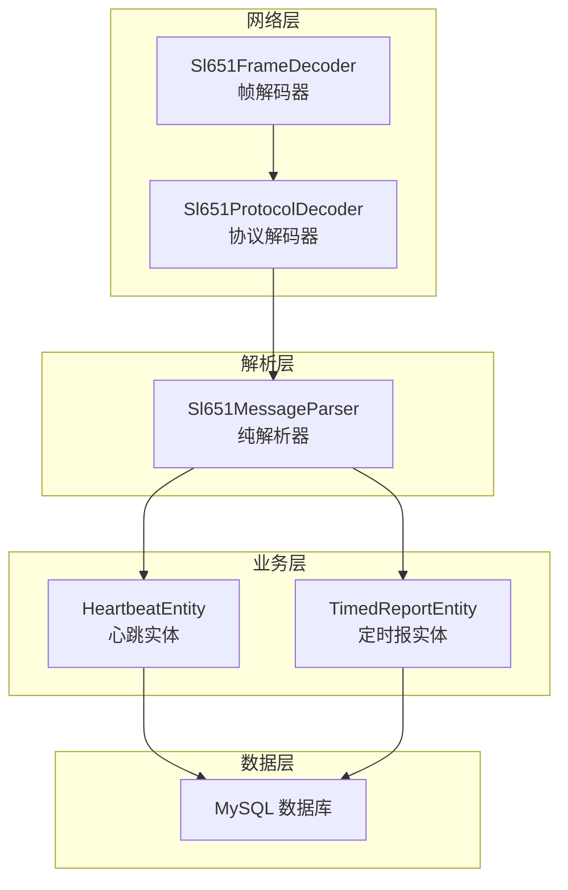
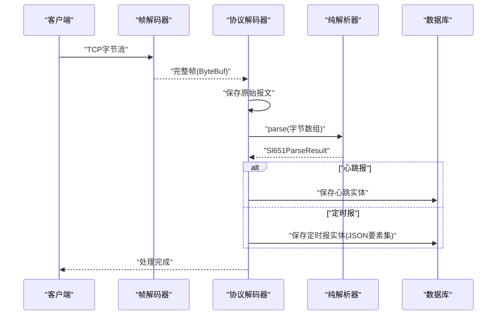
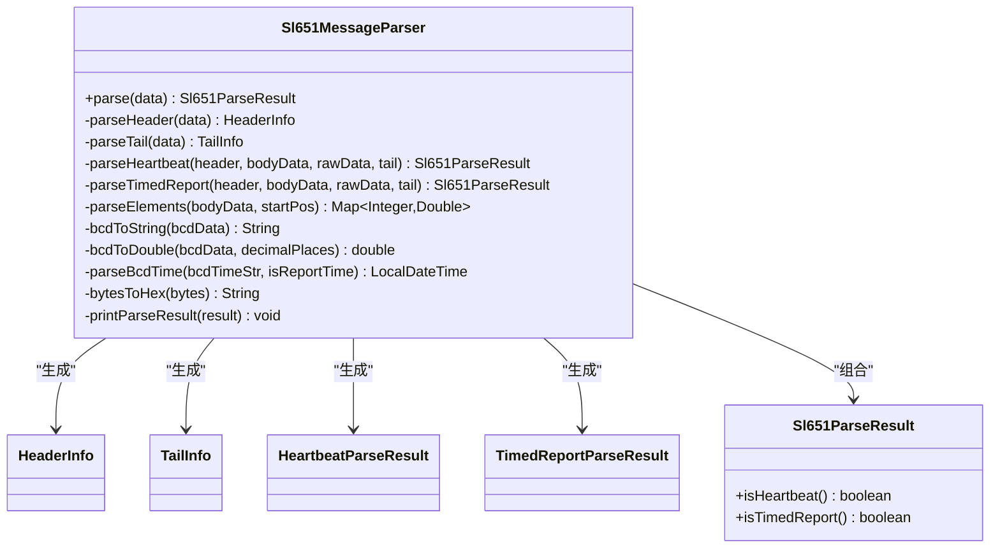
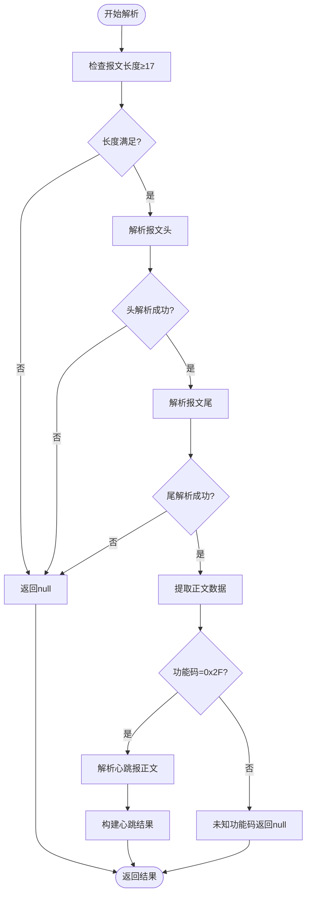
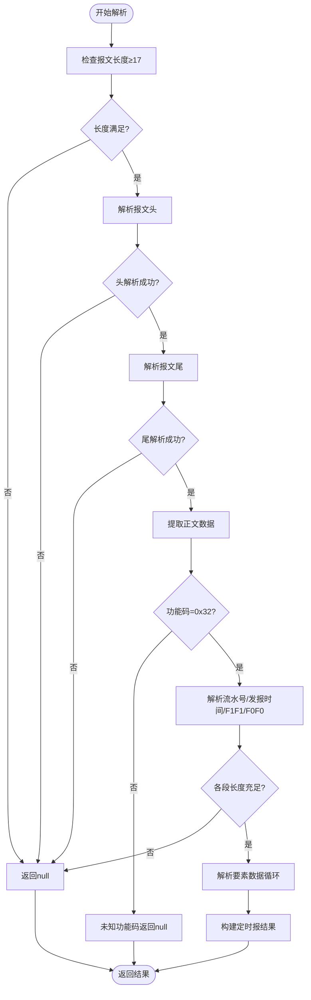
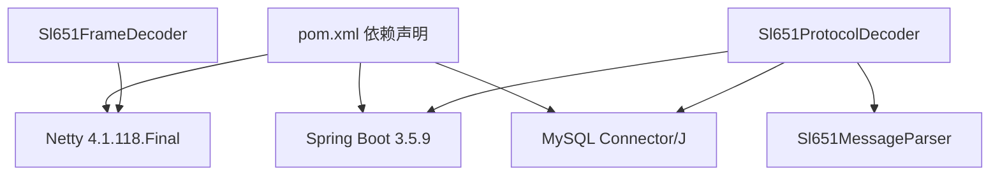

# 消息解析器

<cite>
**本文引用的文件列表**
- [Sl651MessageParser.java](file://src/main/java/com/hydro/monitor/netty/Sl651MessageParser.java)
- [Sl651FrameDecoder.java](file://src/main/java/com/hydro/monitor/netty/Sl651FrameDecoder.java)
- [Sl651ProtocolDecoder.java](file://src/main/java/com/hydro/monitor/netty/Sl651ProtocolDecoder.java)
- [Sl651MessageParserTest.java](file://src/test/java/com/hydro/monitor/netty/Sl651MessageParserTest.java)
- [BcdDecodeTest.java](file://src/test/java/com/hydro/monitor/netty/BcdDecodeTest.java)
- [HeartbeatEntity.java](file://src/main/java/com/hydro/monitor/modules/entity/HeartbeatEntity.java)
- [TimedReportEntity.java](file://src/main/java/com/hydro/monitor/modules/entity/TimedReportEntity.java)
- [migration_timed_report.sql](file://src/main/resources/db/migration_timed_report.sql)
- [migration_raw_message.sql](file://src/main/resources/db/migration_raw_message.sql)
- [application.yml](file://src/main/resources/application.yml)
- [pom.xml](file://pom.xml)
</cite>

## 目录
1. [简介](#简介)
2. [项目结构](#项目结构)
3. [核心组件](#核心组件)
4. [架构概览](#架构概览)
5. [详细组件分析](#详细组件分析)
6. [依赖分析](#依赖分析)
7. [性能考虑](#性能考虑)
8. [故障排查指南](#故障排查指南)
9. [结论](#结论)
10. [附录](#附录)

## 简介
本文件面向“消息解析器”的技术文档，聚焦于 Sl651MessageParser 的纯解析逻辑设计与实现细节。该解析器遵循 SL 651-2014 水文监测协议，采用无状态、线程安全的设计理念，将原始报文字节数组解析为结构化的数据对象，不依赖数据库或网络等外部资源，确保解析过程的可测试性与可移植性。文档将深入讲解：
- 心跳报文与定时报文的解析算法、数据提取方法与格式验证规则
- BCD 编码处理、十六进制转换与数值计算的具体实现
- 解析结果的数据结构设计、错误处理策略与边界条件处理
- 单元测试用例、性能基准测试与调试技巧
- 如何扩展解析器以支持新的报文类型

## 项目结构
本项目基于 Spring Boot 3 + Netty 的架构，消息解析器位于 netty 包中，配合帧解码器与协议解码器共同完成从网络字节流到业务实体的完整链路。关键文件如下：
- Sl651MessageParser：纯解析器，负责协议解析与结果封装
- Sl651FrameDecoder：TCP 粘包/拆包处理，定位帧边界
- Sl651ProtocolDecoder：Netty 通道处理器，桥接解析器与业务层
- 测试用例：Sl651MessageParserTest、BcdDecodeTest
- 数据实体与数据库迁移：HeartbeatEntity、TimedReportEntity、migration_*_report.sql
- 配置文件：application.yml、pom.xml

图表来源
- [Sl651FrameDecoder.java:25-121](file://src/main/java/com/hydro/monitor/netty/Sl651FrameDecoder.java#L25-L121)
- [Sl651ProtocolDecoder.java:35-278](file://src/main/java/com/hydro/monitor/netty/Sl651ProtocolDecoder.java#L35-L278)
- [Sl651MessageParser.java:24-648](file://src/main/java/com/hydro/monitor/netty/Sl651MessageParser.java#L24-L648)
- [HeartbeatEntity.java:15-50](file://src/main/java/com/hydro/monitor/modules/entity/HeartbeatEntity.java#L15-L50)
- [TimedReportEntity.java:15-48](file://src/main/java/com/hydro/monitor/modules/entity/TimedReportEntity.java#L15-L48)

章节来源
- [Sl651MessageParser.java:10-25](file://src/main/java/com/hydro/monitor/netty/Sl651MessageParser.java#L10-L25)
- [Sl651FrameDecoder.java:10-26](file://src/main/java/com/hydro/monitor/netty/Sl651FrameDecoder.java#L10-L26)
- [Sl651ProtocolDecoder.java:25-40](file://src/main/java/com/hydro/monitor/netty/Sl651ProtocolDecoder.java#L25-L40)

## 核心组件
- Sl651MessageParser：无状态、线程安全的纯解析器，负责报文头/正文/报文尾的解析、功能码分发、BCD 编码处理、时间解析与结果封装。
- Sl651FrameDecoder：在 TCP 层处理粘包/拆包，通过扫描起始符与读取正文长度字段计算总帧长，输出完整帧。
- Sl651ProtocolDecoder：Netty 通道处理器，负责接收 ByteBuf、调用解析器、持久化结果与更新终端状态。

章节来源
- [Sl651MessageParser.java:24-648](file://src/main/java/com/hydro/monitor/netty/Sl651MessageParser.java#L24-L648)
- [Sl651FrameDecoder.java:25-121](file://src/main/java/com/hydro/monitor/netty/Sl651FrameDecoder.java#L25-L121)
- [Sl651ProtocolDecoder.java:35-278](file://src/main/java/com/hydro/monitor/netty/Sl651ProtocolDecoder.java#L35-L278)

## 架构概览
解析器采用“纯解析 + 业务解耦”的架构模式：
- 纯解析器只负责协议解析与结构化输出，不访问数据库或网络
- 协议解码器负责网络接入、原始报文持久化与业务实体落库
- 帧解码器负责 TCP 层的帧边界识别，保证纯解析器输入为完整帧

图表来源
- [Sl651FrameDecoder.java:37-100](file://src/main/java/com/hydro/monitor/netty/Sl651FrameDecoder.java#L37-L100)
- [Sl651ProtocolDecoder.java:53-89](file://src/main/java/com/hydro/monitor/netty/Sl651ProtocolDecoder.java#L53-L89)
- [Sl651MessageParser.java:66-126](file://src/main/java/com/hydro/monitor/netty/Sl651MessageParser.java#L66-L126)

## 详细组件分析

### Sl651MessageParser：纯解析器
- 设计特点
  - 无状态：所有方法均为静态或实例方法，不持有可变状态
  - 线程安全：无共享可变变量，解析过程完全基于局部变量
  - 与存储解耦：解析结果对象不包含数据库实体，便于测试与复用
- 报文结构与解析流程
  - 报文头（14字节）：起始符、中心站地址、遥测站地址（5字节BCD）、密码（2字节）、功能码（1字节）、正文长度（2字节大端）、正文起始标识（固定0x02）
  - 正文：按功能码区分，心跳报（流水号+发报时间）、定时报（流水号+发报时间+F1F1站地址+F0F0观测时间+要素数据循环）
  - 报文尾（3字节）：结束符0x03+CRC（2字节）
- 关键解析算法
  - 心跳报解析：提取流水号（2字节大端）、发报时间（6字节BCD=12位）、构造 HeartbeatParseResult
  - 定时报解析：提取流水号、发报时间、F1F1段（站地址5字节BCD+分类码1字节）、F0F0段（观测时间5字节BCD）、要素数据循环（标识符1字节+数据定义位1字节+数据N字节BCD）
  - BCD 编码处理：将每字节视为两个十六进制字符拼接，形成字符串；数值解析时根据数据定义位的小数位插入小数点
  - 时间解析：根据是否为发报时间（12位）或观测时间（10位）选择不同的 DateTimeFormatter 进行解析
- 数据结构设计
  - HeaderInfo：报文头信息
  - TailInfo：报文尾信息
  - HeartbeatParseResult：心跳报解析结果
  - TimedReportParseResult：定时报解析结果
  - Sl651ParseResult：统一解析结果，包含消息类型与对应结果对象
- 错误处理与边界条件
  - 输入校验：空输入、长度不足、起始符错误、正文长度越界、标识符错误
  - 数据截断：要素数据长度不足时进行截断处理并记录警告
  - 数值解析：BCD 数值解析失败时返回0并记录日志
  - 未知功能码：直接返回null
- 性能特性
  - O(n) 时间复杂度，n为报文长度
  - 使用System.arraycopy进行高效字节复制
  - 字符串拼接使用StringBuilder，减少对象创建

图表来源
- [Sl651MessageParser.java:24-648](file://src/main/java/com/hydro/monitor/netty/Sl651MessageParser.java#L24-L648)

章节来源
- [Sl651MessageParser.java:66-126](file://src/main/java/com/hydro/monitor/netty/Sl651MessageParser.java#L66-L126)
- [Sl651MessageParser.java:141-176](file://src/main/java/com/hydro/monitor/netty/Sl651MessageParser.java#L141-L176)
- [Sl651MessageParser.java:196-283](file://src/main/java/com/hydro/monitor/netty/Sl651MessageParser.java#L196-L283)
- [Sl651MessageParser.java:292-339](file://src/main/java/com/hydro/monitor/netty/Sl651MessageParser.java#L292-L339)
- [Sl651MessageParser.java:358-390](file://src/main/java/com/hydro/monitor/netty/Sl651MessageParser.java#L358-L390)
- [Sl651MessageParser.java:400-414](file://src/main/java/com/hydro/monitor/netty/Sl651MessageParser.java#L400-L414)
- [Sl651MessageParser.java:427-496](file://src/main/java/com/hydro/monitor/netty/Sl651MessageParser.java#L427-L496)

### 心跳报文解析算法
- 正文结构：流水号（2字节大端）+ 发报时间（6字节BCD=12位）
- 解析步骤
  - 校验正文长度≥8
  - 提取流水号并转为整数
  - 提取发报时间BCD字节，转换为字符串后解析为LocalDateTime
  - 构造HeartbeatParseResult并封装到Sl651ParseResult
- 格式验证规则
  - 起始符必须为0x7E7E
  - 正文长度字段需与实际长度一致
  - 结束符必须为0x03
- 边界条件
  - 正文长度不足时返回null
  - BCD时间解析失败时返回null

图表来源
- [Sl651MessageParser.java:66-126](file://src/main/java/com/hydro/monitor/netty/Sl651MessageParser.java#L66-L126)
- [Sl651MessageParser.java:141-176](file://src/main/java/com/hydro/monitor/netty/Sl651MessageParser.java#L141-L176)

章节来源
- [Sl651MessageParser.java:141-176](file://src/main/java/com/hydro/monitor/netty/Sl651MessageParser.java#L141-L176)

### 定时报文解析算法
- 正文结构：流水号（2字节）+ 发报时间（6字节BCD）+ F1F1站地址段（2字节标识+F1F1+5字节站地址+1字节分类码）+ F0F0观测时间段（2字节标识+F0F0+5字节观测时间）+ 要素数据循环（标识符1字节+数据定义位1字节+数据N字节BCD）
- 解析步骤
  - 校验各段长度，逐段提取
  - F1F1段：校验标识符为0xF1F1，提取站地址（5字节BCD）与分类码
  - F0F0段：校验标识符为0xF0F0，提取观测时间（5字节BCD）
  - 要素数据循环：解析每个要素的标识符、数据定义位与BCD数据，计算小数位并转为数值
  - 构造TimedReportParseResult并封装到Sl651ParseResult
- 格式验证规则
  - 各标识符必须与预期一致
  - 数据定义位的高5位表示数据字节数，低3位表示小数位数
  - 数据字节总数必须与正文剩余长度一致
- 边界条件
  - 正文长度不足时返回null
  - 标识符不匹配时记录警告并继续解析
  - 数据字节数为0时跳过该要素

图表来源
- [Sl651MessageParser.java:66-126](file://src/main/java/com/hydro/monitor/netty/Sl651MessageParser.java#L66-L126)
- [Sl651MessageParser.java:196-283](file://src/main/java/com/hydro/monitor/netty/Sl651MessageParser.java#L196-L283)
- [Sl651MessageParser.java:292-339](file://src/main/java/com/hydro/monitor/netty/Sl651MessageParser.java#L292-L339)

章节来源
- [Sl651MessageParser.java:196-283](file://src/main/java/com/hydro/monitor/netty/Sl651MessageParser.java#L196-L283)
- [Sl651MessageParser.java:292-339](file://src/main/java/com/hydro/monitor/netty/Sl651MessageParser.java#L292-L339)

### BCD 编码处理、十六进制转换与数值计算
- BCD 编码理解
  - SL 651-2014 协议中的“BCD编码”实际指每字节存储两位十六进制字符，而非标准BCD（0-9）
  - 例如：0xa2 → "a2"，0x40 → "40"
- 字符串转换
  - bcdToString：遍历字节数组，将每个字节格式化为两位十六进制字符串
  - bytesToHex：将字节数组转为大写十六进制字符串
- 数值计算
  - bcdToDouble：先将BCD字节转为字符串，再根据数据定义位的小数位插入小数点，最后解析为double
  - parseBcdTime：根据是否为发报时间（12位）或观测时间（10位）选择不同格式化器解析为LocalDateTime
- 单元测试覆盖
  - BcdDecodeTest：验证遥测站地址BCD解析
  - Sl651MessageParserTest：验证心跳报与定时报的BCD数值解析

章节来源
- [Sl651MessageParser.java:427-496](file://src/main/java/com/hydro/monitor/netty/Sl651MessageParser.java#L427-L496)
- [BcdDecodeTest.java:14-44](file://src/test/java/com/hydro/monitor/netty/BcdDecodeTest.java#L14-L44)
- [Sl651MessageParserTest.java:104-211](file://src/test/java/com/hydro/monitor/netty/Sl651MessageParserTest.java#L104-L211)

### 解析结果的数据结构设计
- HeaderInfo：报文头信息（中心站地址、遥测站地址、密码、功能码、正文长度）
- TailInfo：报文尾信息（CRC校验码）
- HeartbeatParseResult：心跳报解析结果（站号、密码、流水号、发报时间字符串、解析时间、原始报文HEX）
- TimedReportParseResult：定时报解析结果（报文头站号、密码、流水号、发报时间字符串、正文站号、站分类码、观测时间字符串、解析时间、要素映射、原始报文HEX）
- Sl651ParseResult：统一解析结果（消息类型+报文头+心跳结果+定时报结果+报文尾），并提供isHeartbeat()/isTimedReport()辅助判断

章节来源
- [Sl651MessageParser.java:589-646](file://src/main/java/com/hydro/monitor/netty/Sl651MessageParser.java#L589-L646)

### 错误处理策略与边界条件
- 输入校验
  - 空输入或长度不足：直接返回null并记录警告
  - 起始符错误：返回null并记录警告
  - 正文长度越界：返回null并记录警告
  - 结束符错误：返回null并记录警告
- 数据截断与容错
  - 要素数据长度不足时进行截断，并记录警告
  - 数据定义位为0时跳过该要素
  - BCD数值解析失败时返回0并记录警告
- 未知功能码
  - 返回null，不进行进一步处理

章节来源
- [Sl651MessageParser.java:73-100](file://src/main/java/com/hydro/monitor/netty/Sl651MessageParser.java#L73-L100)
- [Sl651MessageParser.java:142-145](file://src/main/java/com/hydro/monitor/netty/Sl651MessageParser.java#L142-L145)
- [Sl651MessageParser.java:218-228](file://src/main/java/com/hydro/monitor/netty/Sl651MessageParser.java#L218-L228)
- [Sl651MessageParser.java:319-327](file://src/main/java/com/hydro/monitor/netty/Sl651MessageParser.java#L319-L327)
- [Sl651MessageParser.java:450-456](file://src/main/java/com/hydro/monitor/netty/Sl651MessageParser.java#L450-L456)

### 单元测试用例
- 心跳报文测试
  - 正常报文解析：验证站号、密码、流水号、发报时间与解析时间
  - 报文长度不足：返回null
  - 起始符错误：返回null
- 定时报文测试
  - 单要素报文：验证要素标识符、数据定义位与数值解析
  - 多要素报文：验证多个要素的解析与JSON映射
  - 未知功能码：返回null
- 边界情况测试
  - 空输入与空数组：返回null
  - 数据截断与定义位为0：记录警告并继续解析
- BCD编码测试
  - 遥测站地址BCD解析：验证每字节两位十六进制字符拼接

章节来源
- [Sl651MessageParserTest.java:31-100](file://src/test/java/com/hydro/monitor/netty/Sl651MessageParserTest.java#L31-L100)
- [Sl651MessageParserTest.java:104-212](file://src/test/java/com/hydro/monitor/netty/Sl651MessageParserTest.java#L104-L212)
- [Sl651MessageParserTest.java:215-248](file://src/test/java/com/hydro/monitor/netty/Sl651MessageParserTest.java#L215-L248)
- [BcdDecodeTest.java:14-44](file://src/test/java/com/hydro/monitor/netty/BcdDecodeTest.java#L14-L44)

### 性能基准测试与调试技巧
- 性能基准测试建议
  - 使用JMH或自定义基准测试框架对 parse() 方法进行压力测试，关注以下指标：
    - 解析吞吐量（消息/秒）
    - 平均解析耗时（微秒/毫秒）
    - 内存分配（字节数组拷贝次数与大小）
  - 测试场景
    - 不同长度的完整帧（17字节最小帧到最大帧）
    - 不同功能码的消息（心跳报、定时报）
    - 不同要素数量的定时报（1、5、10个要素）
- 调试技巧
  - 启用DEBUG日志级别，观察原始报文HEX、解析中间结果与警告信息
  - 使用单元测试中的十六进制构造器快速构造边界场景
  - 对BCD解析与数值计算进行断点调试，验证数据定义位与小数位处理

章节来源
- [application.yml:62-77](file://src/main/resources/application.yml#L62-L77)
- [Sl651MessageParserTest.java:250-267](file://src/test/java/com/hydro/monitor/netty/Sl651MessageParserTest.java#L250-L267)

### 扩展解析器以支持新的报文类型
- 新增功能码与解析分支
  - 在 parse() 方法中添加新的功能码分支，调用对应的解析方法
  - 定义新的解析结果记录类，封装新报文的字段
- 新增报文头/正文字段
  - 在 parseHeader() 或专门的解析方法中新增字段提取逻辑
  - 更新数据定义位解析或时间解析逻辑（如有需要）
- 新增要素标识符
  - 在 KNOWN_ELEMENT_IDS 中添加新的标识符映射
  - 在单元测试中添加对应的新要素场景
- 数据持久化适配
  - 若新报文需要持久化，新增实体类并在协议解码器中添加相应的业务处理逻辑
  - 参考现有 HeartbeatEntity 与 TimedReportEntity 的设计

章节来源
- [Sl651MessageParser.java:108-115](file://src/main/java/com/hydro/monitor/netty/Sl651MessageParser.java#L108-L115)
- [Sl651MessageParser.java:48-56](file://src/main/java/com/hydro/monitor/netty/Sl651MessageParser.java#L48-L56)
- [HeartbeatEntity.java:15-50](file://src/main/java/com/hydro/monitor/modules/entity/HeartbeatEntity.java#L15-L50)
- [TimedReportEntity.java:15-48](file://src/main/java/com/hydro/monitor/modules/entity/TimedReportEntity.java#L15-L48)

## 依赖分析
- 外部依赖
  - Netty：提供 ByteBuf 与 ByteToMessageDecoder、SimpleChannelInboundHandler
  - Spring Boot：提供Spring容器、MyBatis-Plus、Jackson等
  - MySQL Connector/J：数据库驱动
- 内部模块依赖
  - Sl651FrameDecoder 依赖 Netty ByteBuf
  - Sl651ProtocolDecoder 依赖 Sl651MessageParser 与业务服务（心跳、定时报、要素配置、终端、原始报文）
  - Sl651MessageParser 无外部依赖，仅依赖Java标准库

图表来源
- [pom.xml:30-153](file://pom.xml#L30-L153)
- [Sl651ProtocolDecoder.java:3-18](file://src/main/java/com/hydro/monitor/netty/Sl651ProtocolDecoder.java#L3-L18)
- [Sl651FrameDecoder.java:3-6](file://src/main/java/com/hydro/monitor/netty/Sl651FrameDecoder.java#L3-L6)

章节来源
- [pom.xml:30-153](file://pom.xml#L30-L153)
- [Sl651ProtocolDecoder.java:3-18](file://src/main/java/com/hydro/monitor/netty/Sl651ProtocolDecoder.java#L3-L18)
- [Sl651FrameDecoder.java:3-6](file://src/main/java/com/hydro/monitor/netty/Sl651FrameDecoder.java#L3-L6)

## 性能考虑
- 时间复杂度
  - 解析流程为O(n)，n为报文长度，主要由字节复制与字符串解析组成
- 内存使用
  - 使用System.arraycopy进行高效字节复制
  - 字符串拼接使用StringBuilder，减少临时对象创建
- 线程安全
  - 无共享可变状态，可在多线程环境中并发调用
- I/O优化
  - 帧解码器在TCP层完成粘包/拆包，避免应用层重复解析
  - 协议解码器异步保存原始报文，避免阻塞Netty线程

## 故障排查指南
- 常见问题与解决
  - 报文长度不足：检查帧解码器是否正确识别起始符与正文长度
  - 起始符错误：确认网络传输是否正确，或是否存在缓冲区对齐问题
  - 正文长度越界：检查功能码与正文长度字段是否匹配
  - 未知功能码：确认新增功能码是否已在解析器中注册
  - BCD数值解析失败：检查数据定义位与数据字节长度是否一致
- 日志与调试
  - 启用DEBUG级别日志，查看原始报文HEX与中间解析结果
  - 使用单元测试快速复现问题场景
  - 对BCD解析与时间解析进行断点调试

章节来源
- [Sl651MessageParser.java:67-125](file://src/main/java/com/hydro/monitor/netty/Sl651MessageParser.java#L67-L125)
- [Sl651MessageParserTest.java:215-248](file://src/test/java/com/hydro/monitor/netty/Sl651MessageParserTest.java#L215-L248)
- [application.yml:62-77](file://src/main/resources/application.yml#L62-L77)

## 结论
Sl651MessageParser 通过无状态、线程安全的设计，实现了对 SL 651-2014 协议的纯解析能力，具备良好的可测试性与可扩展性。结合 Sl651FrameDecoder 与 Sl651ProtocolDecoder，形成了从网络接入到业务落库的完整链路。通过对 BCD 编码、十六进制转换与数值计算的精确实现，以及完善的错误处理与边界条件处理，解析器能够在生产环境中稳定运行。未来可通过新增功能码与要素标识符的方式轻松扩展支持新的报文类型。

## 附录
- 数据库迁移
  - 定时报表迁移：将原有要素字段合并为 JSON 类型的 element_set 字段
  - 原始报文记录表：用于保存原始报文与报文头信息
- 配置项
  - Netty 服务器端口、MySQL 数据源、JWT 秘钥与过期时间、日志级别与输出格式

章节来源
- [migration_timed_report.sql:1-44](file://src/main/resources/db/migration_timed_report.sql#L1-L44)
- [migration_raw_message.sql:1-14](file://src/main/resources/db/migration_raw_message.sql#L1-L14)
- [application.yml:43-86](file://src/main/resources/application.yml#L43-L86)