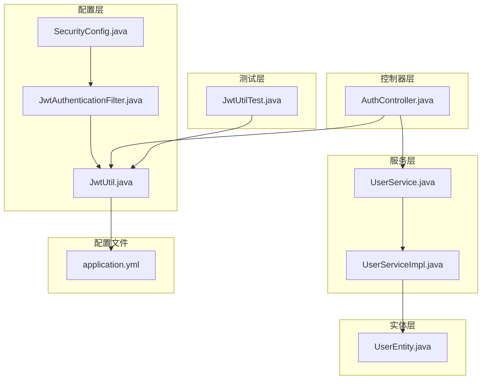
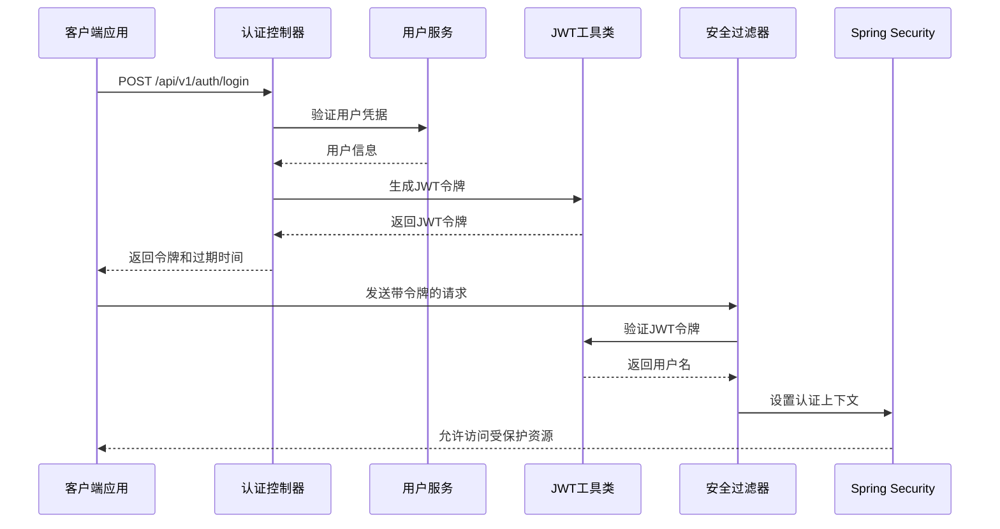
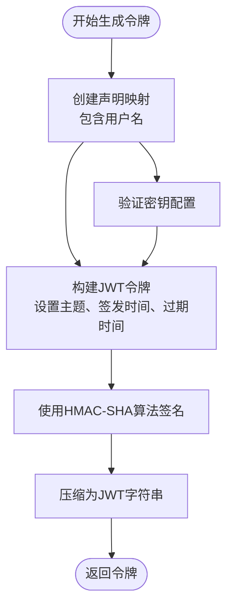
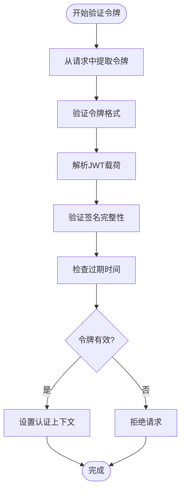
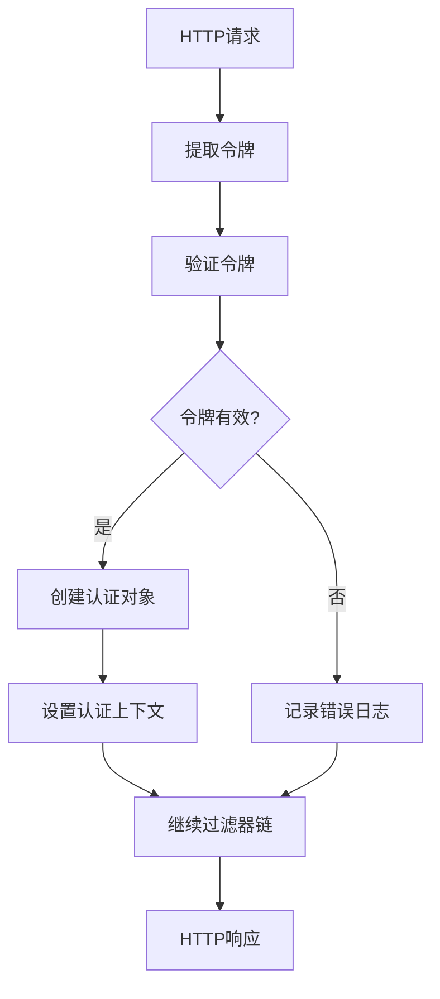
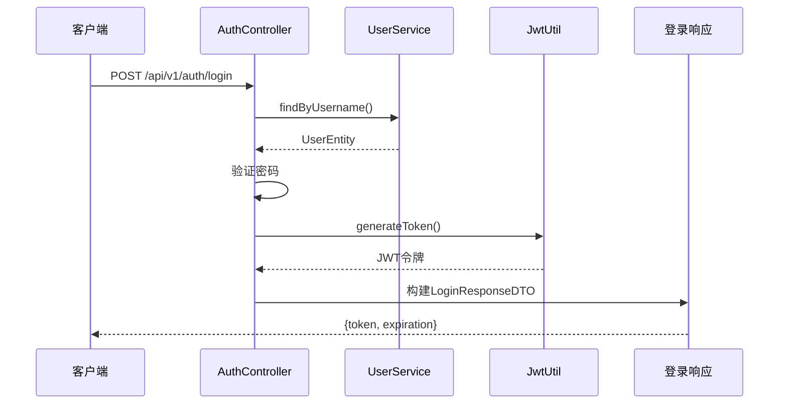
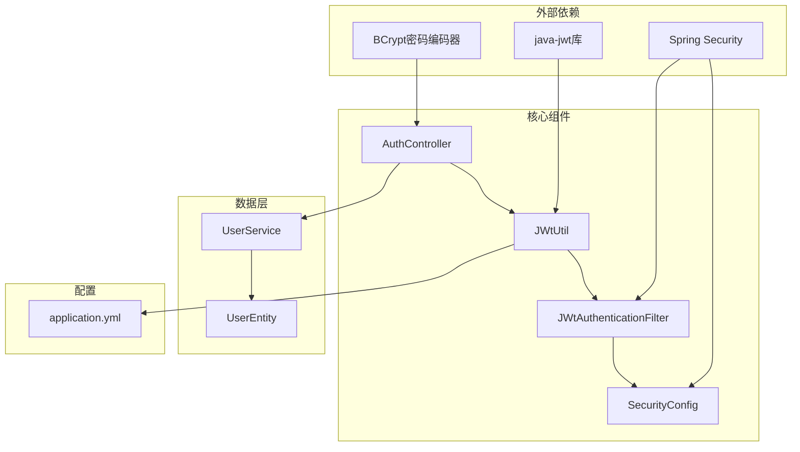
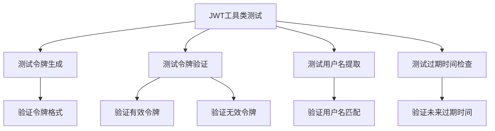

# JWT认证机制

<cite>
**本文档引用的文件**
- [JwtUtil.java](file://src/main/java/com/hydro/monitor/config/security/JwtUtil.java)
- [JwtAuthenticationFilter.java](file://src/main/java/com/hydro/monitor/config/security/JwtAuthenticationFilter.java)
- [SecurityConfig.java](file://src/main/java/com/hydro/monitor/config/security/SecurityConfig.java)
- [AuthController.java](file://src/main/java/com/hydro/monitor/modules/controller/AuthController.java)
- [application.yml](file://src/main/resources/application.yml)
- [JwtUtilTest.java](file://src/test/java/com/hydro/monitor/config/security/JwtUtilTest.java)
- [LoginResponseDTO.java](file://src/main/java/com/hydro/monitor/modules/dto/LoginResponseDTO.java)
- [UserService.java](file://src/main/java/com/hydro/monitor/modules/service/UserService.java)
- [UserServiceImpl.java](file://src/main/java/com/hydro/monitor/modules/service/impl/UserServiceImpl.java)
- [UserEntity.java](file://src/main/java/com/hydro/monitor/modules/entity/UserEntity.java)
- [GlobalExceptionHandler.java](file://src/main/java/com/hydro/monitor/common/GlobalExceptionHandler.java)
</cite>

## 目录
1. [引言](#引言)
2. [项目结构](#项目结构)
3. [核心组件](#核心组件)
4. [架构概览](#架构概览)
5. [详细组件分析](#详细组件分析)
6. [依赖关系分析](#依赖关系分析)
7. [性能考虑](#性能考虑)
8. [故障排除指南](#故障排除指南)
9. [结论](#结论)
10. [附录](#附录)

## 引言

本文件详细阐述了Hydro Monitor后端系统的JWT（JSON Web Token）认证机制。该系统采用基于Spring Security的安全架构，实现了完整的用户身份认证和授权流程。JWT认证机制通过无状态的令牌验证方式，为RESTful API提供了高效的认证解决方案。

系统的核心特性包括：
- 基于HMAC-SHA算法的对称加密签名
- 24小时有效期的令牌管理
- 完整的登录认证流程
- 无状态的会话管理
- 统一的异常处理机制

## 项目结构

JWT认证机制在项目中的组织结构如下：



**图表来源**
- [SecurityConfig.java:1-76](file://src/main/java/com/hydro/monitor/config/security/SecurityConfig.java#L1-L76)
- [JwtAuthenticationFilter.java:1-75](file://src/main/java/com/hydro/monitor/config/security/JwtAuthenticationFilter.java#L1-L75)
- [JwtUtil.java:1-126](file://src/main/java/com/hydro/monitor/config/security/JwtUtil.java#L1-L126)

**章节来源**
- [SecurityConfig.java:1-76](file://src/main/java/com/hydro/monitor/config/security/SecurityConfig.java#L1-L76)
- [application.yml:1-86](file://src/main/resources/application.yml#L1-L86)

## 核心组件

### JWT工具类（JwtUtil）

JwtUtil是JWT认证机制的核心工具类，负责令牌的生成、解析和验证。该类实现了以下关键功能：

#### 令牌生成算法
- 使用HMAC-SHA算法进行对称加密签名
- 包含标准的JWT头部、载荷和签名三部分
- 支持自定义过期时间和用户信息存储

#### 签名验证过程
- 基于相同的密钥和算法进行签名验证
- 实现了完整的异常处理机制
- 提供了详细的日志记录功能

#### 令牌结构设计
- 载荷包含用户名和标准声明字段
- 使用标准的JWT主题字段存储用户名
- 包含签发时间、过期时间和发行者信息

**章节来源**
- [JwtUtil.java:16-126](file://src/main/java/com/hydro/monitor/config/security/JwtUtil.java#L16-L126)

### JWT认证过滤器（JwtAuthenticationFilter）

JwtAuthenticationFilter是Spring Security的过滤器组件，负责拦截HTTP请求并执行JWT认证：

#### 请求拦截机制
- 继承OncePerRequestFilter确保每个请求只处理一次
- 从Authorization头提取Bearer令牌
- 实现了完整的异常处理和日志记录

#### 用户身份验证
- 验证令牌的有效性和未过期状态
- 从令牌中提取用户名信息
- 创建Spring Security认证对象

#### 权限授权过程
- 将认证信息设置到SecurityContext中
- 支持后续的权限检查和访问控制
- 实现了无状态的会话管理

**章节来源**
- [JwtAuthenticationFilter.java:19-75](file://src/main/java/com/hydro/monitor/config/security/JwtAuthenticationFilter.java#L19-L75)

### 安全配置（SecurityConfig）

SecurityConfig类配置了整个Spring Security的安全策略：

#### 过滤器链配置
- 禁用CSRF保护（适用于JWT）
- 设置会话管理为无状态模式
- 配置了自定义的JWT认证过滤器

#### 授权规则
- 公开访问的接口路径
- Swagger文档的访问权限
- 其他所有接口都需要认证

#### 认证管理器
- 配置了基于数据库的用户认证提供程序
- 使用BCrypt密码编码器
- 支持自定义的用户详情服务

**章节来源**
- [SecurityConfig.java:15-76](file://src/main/java/com/hydro/monitor/config/security/SecurityConfig.java#L15-L76)

## 架构概览

JWT认证机制的整体架构如下：



**图表来源**
- [AuthController.java:35-67](file://src/main/java/com/hydro/monitor/modules/controller/AuthController.java#L35-L67)
- [JwtAuthenticationFilter.java:31-59](file://src/main/java/com/hydro/monitor/config/security/JwtAuthenticationFilter.java#L31-L59)
- [JwtUtil.java:31-75](file://src/main/java/com/hydro/monitor/config/security/JwtUtil.java#L31-L75)

## 详细组件分析

### JWT工具类实现原理

#### 令牌生成流程


**图表来源**
- [JwtUtil.java:37-48](file://src/main/java/com/hydro/monitor/config/security/JwtUtil.java#L37-L48)

#### 令牌解析和验证


**图表来源**
- [JwtAuthenticationFilter.java:36-53](file://src/main/java/com/hydro/monitor/config/security/JwtAuthenticationFilter.java#L36-L53)
- [JwtUtil.java:67-75](file://src/main/java/com/hydro/monitor/config/security/JwtUtil.java#L67-L75)

**章节来源**
- [JwtUtil.java:31-125](file://src/main/java/com/hydro/monitor/config/security/JwtUtil.java#L31-L125)

### JwtAuthenticationFilter工作流程

#### 请求拦截和令牌提取
过滤器继承自OncePerRequestFilter，确保每个HTTP请求只被处理一次。主要工作流程包括：

1. **请求拦截**：拦截所有进入的HTTP请求
2. **令牌提取**：从Authorization头中提取Bearer令牌
3. **令牌验证**：调用JwtUtil验证令牌的有效性
4. **用户认证**：创建UsernamePasswordAuthenticationToken认证对象
5. **上下文设置**：将认证信息设置到SecurityContextHolder中

#### 异常处理机制


**图表来源**
- [JwtAuthenticationFilter.java:31-59](file://src/main/java/com/hydro/monitor/config/security/JwtAuthenticationFilter.java#L31-L59)

**章节来源**
- [JwtAuthenticationFilter.java:29-75](file://src/main/java/com/hydro/monitor/config/security/JwtAuthenticationFilter.java#L29-L75)

### 登录认证流程

#### 用户登录接口


**图表来源**
- [AuthController.java:41-66](file://src/main/java/com/hydro/monitor/modules/controller/AuthController.java#L41-L66)

**章节来源**
- [AuthController.java:35-67](file://src/main/java/com/hydro/monitor/modules/controller/AuthController.java#L35-L67)

### 令牌生命周期管理

#### 令牌生成和存储
- **生成时机**：用户成功登录后生成
- **存储位置**：客户端本地存储（localStorage/sessionStorage）
- **传输方式**：Authorization头，格式为"Bearer {token}"

#### 过期处理机制
- **默认有效期**：24小时（86400000毫秒）
- **自动过期**：服务器端验证时检查过期时间
- **刷新策略**：当前实现支持令牌续期，需要重新登录

#### 安全存储方案
- **客户端存储**：建议使用HttpOnly Cookie或内存存储
- **传输安全**：必须通过HTTPS传输
- **存储安全**：避免明文存储敏感信息

**章节来源**
- [application.yml:48-52](file://src/main/resources/application.yml#L48-L52)
- [JwtUtil.java:25-29](file://src/main/java/com/hydro/monitor/config/security/JwtUtil.java#L25-L29)

## 依赖关系分析

JWT认证机制的组件依赖关系如下：



**图表来源**
- [JwtUtil.java:3-14](file://src/main/java/com/hydro/monitor/config/security/JwtUtil.java#L3-L14)
- [SecurityConfig.java:6-13](file://src/main/java/com/hydro/monitor/config/security/SecurityConfig.java#L6-L13)

**章节来源**
- [JwtUtil.java:1-126](file://src/main/java/com/hydro/monitor/config/security/JwtUtil.java#L1-L126)
- [SecurityConfig.java:1-76](file://src/main/java/com/hydro/monitor/config/security/SecurityConfig.java#L1-L76)

## 性能考虑

### JWT认证的性能特征

#### 优势
- **无状态设计**：服务器不需要维护会话状态
- **水平扩展友好**：多实例部署无需共享会话
- **跨域支持**：天然支持跨域请求
- **移动端友好**：适合移动应用和SPA应用

#### 性能优化建议

1. **令牌大小控制**
   - 仅包含必要的声明信息
   - 避免存储大型用户信息
   - 考虑使用用户ID而非完整用户对象

2. **缓存策略**
   - 缓存常用的用户权限信息
   - 实现令牌黑名单缓存
   - 使用Redis等分布式缓存

3. **网络优化**
   - 启用HTTP/2以提高传输效率
   - 压缩响应内容
   - 合理设置缓存头

4. **数据库优化**
   - 优化用户查询索引
   - 实现用户详情的延迟加载
   - 使用连接池管理数据库连接

### 性能监控指标

- **认证响应时间**：平均响应时间应小于100ms
- **令牌验证时间**：单次验证应在50ms以内
- **并发处理能力**：支持至少1000个并发用户
- **内存使用**：单个令牌占用内存小于1KB

## 故障排除指南

### 常见问题及解决方案

#### 令牌验证失败
**问题现象**：用户登录后无法访问受保护资源
**可能原因**：
- 令牌格式不正确（缺少"Bearer "前缀）
- 令牌已过期
- 密钥配置不匹配
- 时间同步问题

**解决步骤**：
1. 检查Authorization头格式
2. 验证令牌过期时间
3. 确认JWT密钥配置
4. 检查服务器时间设置

#### 登录失败
**问题现象**：用户凭据正确但无法登录
**可能原因**：
- 用户不存在
- 密码验证失败
- 数据库连接问题

**解决步骤**：
1. 验证用户是否存在
2. 检查密码编码器配置
3. 确认数据库连接状态

#### 权限拒绝
**问题现象**：用户有令牌但被拒绝访问
**可能原因**：
- 角色权限不足
- 资源访问限制
- 自定义权限检查失败

**解决步骤**：
1. 检查用户角色配置
2. 验证授权规则配置
3. 查看权限检查逻辑

### 调试方法

#### 日志配置
```yaml
logging:
  level:
    com.hydro.monitor: DEBUG
    org.springframework.security: DEBUG
```

#### 关键调试点
1. **令牌生成日志**：记录令牌内容和声明信息
2. **认证过滤器日志**：跟踪请求拦截和验证过程
3. **用户服务日志**：记录用户查询和验证结果
4. **异常处理日志**：捕获和记录所有异常信息

#### 单元测试


**图表来源**
- [JwtUtilTest.java:33-155](file://src/test/java/com/hydro/monitor/config/security/JwtUtilTest.java#L33-L155)

**章节来源**
- [JwtUtilTest.java:1-156](file://src/test/java/com/hydro/monitor/config/security/JwtUtilTest.java#L1-L156)
- [GlobalExceptionHandler.java:15-58](file://src/main/java/com/hydro/monitor/common/GlobalExceptionHandler.java#L15-L58)

## 结论

Hydro Monitor项目的JWT认证机制实现了完整的无状态身份认证解决方案。通过精心设计的组件架构和完善的错误处理机制，系统提供了高效、安全的用户认证服务。

### 主要特点
- **安全性**：采用HMAC-SHA算法进行对称加密，支持自定义密钥配置
- **可扩展性**：无状态设计支持水平扩展和微服务架构
- **易用性**：简洁的API接口和完整的测试覆盖
- **可靠性**：完善的异常处理和日志记录机制

### 改进建议
1. **实现令牌刷新机制**：支持短期访问令牌和长期刷新令牌
2. **添加令牌黑名单**：支持用户登出和令牌撤销
3. **增强安全配置**：支持多种加密算法和密钥轮换
4. **性能监控**：添加详细的性能指标和监控告警

该JWT认证机制为Hydro Monitor系统提供了坚实的安全基础，能够满足当前业务需求并支持未来的功能扩展。

## 附录

### JWT配置示例

#### application.yml配置
```yaml
jwt:
  secret: hydro-monitor-secret-key-for-jwt-token-generation-2024
  expiration: 86400000  # 24小时（毫秒）
```

#### Spring Security配置
```java
@Bean
public SecurityFilterChain securityFilterChain(HttpSecurity http) throws Exception {
    http
        .csrf().disable()
        .sessionManagement()
            .sessionCreationPolicy(SessionCreationPolicy.STATELESS)
        .and()
        .authorizeHttpRequests(auth -> auth
            .requestMatchers("/api/v1/auth/**").permitAll()
            .anyRequest().authenticated())
        .addFilterBefore(jwtAuthenticationFilter, UsernamePasswordAuthenticationFilter.class);
    
    return http.build();
}
```

### 令牌格式规范

#### 标准JWT结构
- **头部（Header）**：包含算法和令牌类型
- **载荷（Payload）**：包含声明信息
- **签名（Signature）**：用于验证令牌完整性

#### 自定义声明
- `username`：用户唯一标识
- `sub`：标准主题字段
- `iat`：签发时间
- `exp`：过期时间

### 加密算法选择

#### 当前实现
- **算法**：HMAC-SHA256
- **密钥长度**：256位
- **密钥来源**：配置文件中的字符串

#### 建议的替代方案
- **RSA算法**：支持公私钥对，更安全但计算开销更大
- **ECDSA算法**：椭圆曲线数字签名，密钥更短但实现复杂
- **密钥轮换**：定期更换密钥以提高安全性

### 性能优化建议

#### 代码层面优化
1. **令牌缓存**：缓存最近使用的令牌以减少解析开销
2. **异步验证**：对于复杂的权限检查可以异步执行
3. **连接池**：优化数据库连接池配置

#### 部署层面优化
1. **负载均衡**：使用Nginx或HAProxy进行请求分发
2. **CDN缓存**：静态资源使用CDN加速
3. **监控告警**：建立完善的性能监控体系