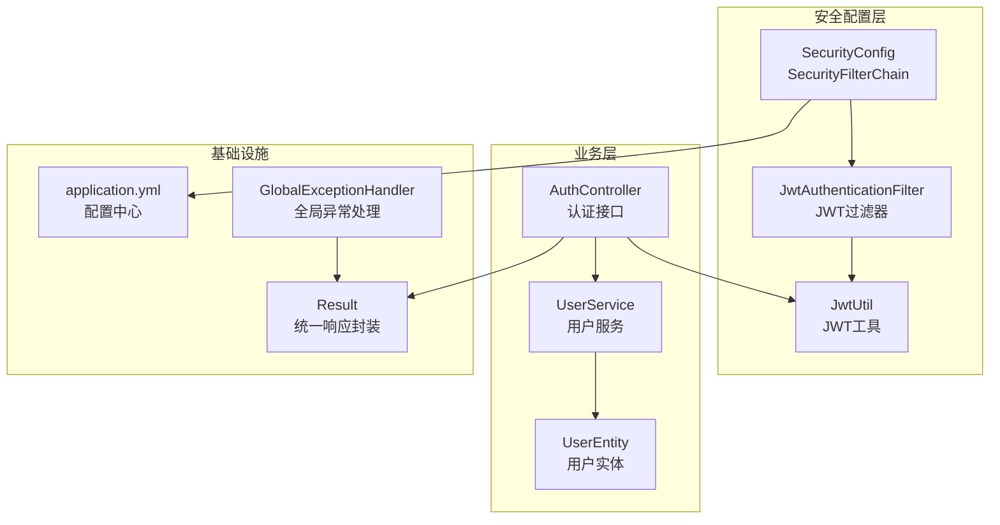
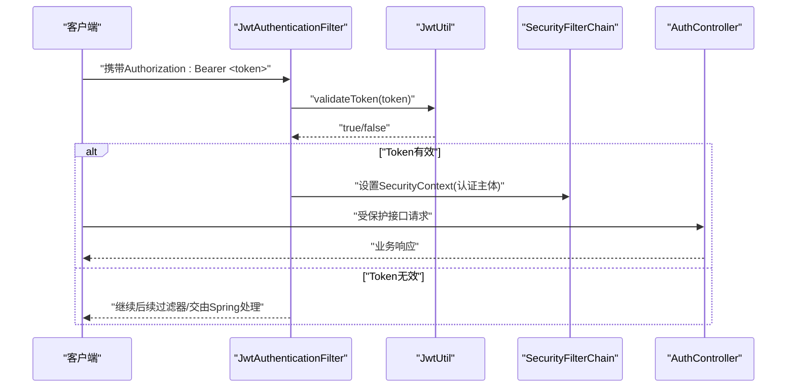
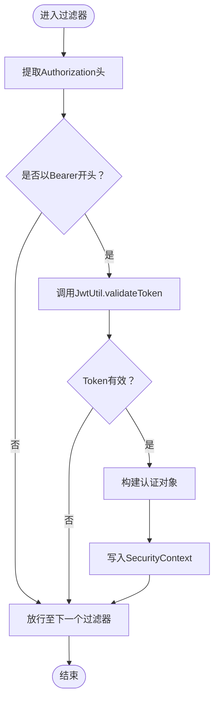
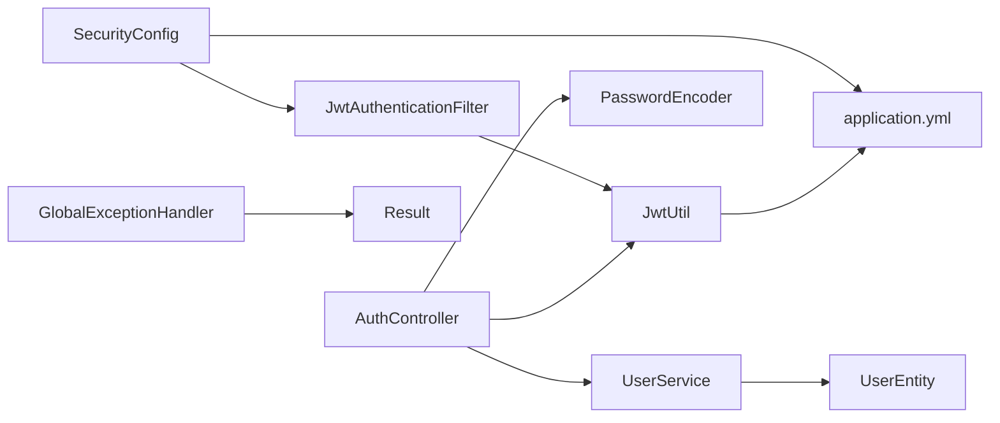

# Spring Security配置

<cite>
**本文引用的文件**
- [SecurityConfig.java](file://src/main/java/com/hydro/monitor/config/security/SecurityConfig.java)
- [JwtAuthenticationFilter.java](file://src/main/java/com/hydro/monitor/config/security/JwtAuthenticationFilter.java)
- [JwtUtil.java](file://src/main/java/com/hydro/monitor/config/security/JwtUtil.java)
- [AuthController.java](file://src/main/java/com/hydro/monitor/modules/controller/AuthController.java)
- [application.yml](file://src/main/resources/application.yml)
- [GlobalExceptionHandler.java](file://src/main/java/com/hydro/monitor/common/GlobalExceptionHandler.java)
- [UserEntity.java](file://src/main/java/com/hydro/monitor/modules/entity/UserEntity.java)
- [Result.java](file://src/main/java/com/hydro/monitor/common/Result.java)
- [JwtUtilTest.java](file://src/test/java/com/hydro/monitor/config/security/JwtUtilTest.java)
- [AuthControllerTest.java](file://src/test/java/com/hydro/monitor/modules/controller/AuthControllerTest.java)
</cite>

## 目录
1. [简介](#简介)
2. [项目结构](#项目结构)
3. [核心组件](#核心组件)
4. [架构总览](#架构总览)
5. [详细组件分析](#详细组件分析)
6. [依赖关系分析](#依赖关系分析)
7. [性能考量](#性能考量)
8. [故障排除指南](#故障排除指南)
9. [结论](#结论)
10. [附录](#附录)

## 简介
本文件面向后端开发与运维人员，系统化梳理本项目的Spring Security安全配置，重点覆盖：
- 基于SecurityFilterChain的安全配置实现
- CSRF禁用策略、会话管理配置与授权规则
- HttpSecurity各项参数（请求匹配器、访问控制、过滤器链）
- 密码编码器与认证管理器的配置与机制
- 无状态会话设计与JWT配合使用的必要性
- 最佳实践、性能优化与扩展建议
- 配置示例、调试技巧与故障排除

## 项目结构
本项目采用“按功能域+层次”混合组织方式，安全相关代码集中在config/security目录，认证控制器位于modules/controller，全局异常处理位于common目录，配置项集中于application.yml。

图表来源
- [SecurityConfig.java:1-76](file://src/main/java/com/hydro/monitor/config/security/SecurityConfig.java#L1-L76)
- [JwtAuthenticationFilter.java:1-75](file://src/main/java/com/hydro/monitor/config/security/JwtAuthenticationFilter.java#L1-L75)
- [JwtUtil.java:1-126](file://src/main/java/com/hydro/monitor/config/security/JwtUtil.java#L1-L126)
- [AuthController.java:1-68](file://src/main/java/com/hydro/monitor/modules/controller/AuthController.java#L1-L68)
- [application.yml:1-86](file://src/main/resources/application.yml#L1-L86)
- [GlobalExceptionHandler.java:1-58](file://src/main/java/com/hydro/monitor/common/GlobalExceptionHandler.java#L1-L58)
- [Result.java:1-79](file://src/main/java/com/hydro/monitor/common/Result.java#L1-L79)

章节来源
- [SecurityConfig.java:1-76](file://src/main/java/com/hydro/monitor/config/security/SecurityConfig.java#L1-L76)
- [application.yml:1-86](file://src/main/resources/application.yml#L1-L86)

## 核心组件
- 安全配置类：负责构建SecurityFilterChain，禁用CSRF，配置无状态会话，设置授权规则，并注入JWT过滤器。
- JWT认证过滤器：从请求头提取Bearer Token，校验有效性，将认证上下文写入SecurityContext。
- JWT工具类：生成、解析、校验JWT，读取过期时间与用户名等声明。
- 认证控制器：提供登录接口，校验用户凭据，签发JWT。
- 全局异常处理：统一处理权限拒绝等安全相关异常。
- 配置文件：集中管理JWT密钥、过期时间、Swagger等。

章节来源
- [SecurityConfig.java:20-76](file://src/main/java/com/hydro/monitor/config/security/SecurityConfig.java#L20-L76)
- [JwtAuthenticationFilter.java:19-75](file://src/main/java/com/hydro/monitor/config/security/JwtAuthenticationFilter.java#L19-L75)
- [JwtUtil.java:16-126](file://src/main/java/com/hydro/monitor/config/security/JwtUtil.java#L16-L126)
- [AuthController.java:19-68](file://src/main/java/com/hydro/monitor/modules/controller/AuthController.java#L19-L68)
- [GlobalExceptionHandler.java:10-58](file://src/main/java/com/hydro/monitor/common/GlobalExceptionHandler.java#L10-L58)
- [application.yml:48-51](file://src/main/resources/application.yml#L48-L51)

## 架构总览
下图展示从HTTP请求到认证完成的关键流程，以及各组件之间的交互关系。

图表来源
- [JwtAuthenticationFilter.java:31-59](file://src/main/java/com/hydro/monitor/config/security/JwtAuthenticationFilter.java#L31-L59)
- [JwtUtil.java:67-75](file://src/main/java/com/hydro/monitor/config/security/JwtUtil.java#L67-L75)
- [SecurityConfig.java:34-52](file://src/main/java/com/hydro/monitor/config/security/SecurityConfig.java#L34-L52)
- [AuthController.java:41-66](file://src/main/java/com/hydro/monitor/modules/controller/AuthController.java#L41-L66)

## 详细组件分析

### 安全过滤链配置（SecurityFilterChain）
- CSRF禁用：因采用JWT无状态认证，无需CSRF防护。
- 会话策略：STATELESS，避免服务器端会话存储，提升可伸缩性。
- 授权规则：
  - 公开路径：认证接口与Swagger相关路径直接放行。
  - 其他接口：需认证后访问。
- 过滤器链：在标准用户名密码过滤器之前插入JWT过滤器，优先解析JWT并建立认证上下文。

章节来源
- [SecurityConfig.java:34-52](file://src/main/java/com/hydro/monitor/config/security/SecurityConfig.java#L34-L52)

### JWT认证过滤器（JwtAuthenticationFilter）
- 责任边界：从请求头提取Bearer Token，调用JwtUtil校验，成功则构造认证对象写入SecurityContext。
- 异常处理：捕获异常并记录日志，不影响后续过滤器执行。
- 请求头规范：要求Authorization头以“Bearer ”前缀携带JWT。

图表来源
- [JwtAuthenticationFilter.java:31-59](file://src/main/java/com/hydro/monitor/config/security/JwtAuthenticationFilter.java#L31-L59)
- [JwtUtil.java:67-75](file://src/main/java/com/hydro/monitor/config/security/JwtUtil.java#L67-L75)

章节来源
- [JwtAuthenticationFilter.java:19-75](file://src/main/java/com/hydro/monitor/config/security/JwtAuthenticationFilter.java#L19-L75)

### JWT工具类（JwtUtil）
- 生成：基于HS256签名，包含用户名声明，设置签发时间与过期时间。
- 解析：从签名密钥派生SecretKey，解析并校验签名，提取声明。
- 校验：判断过期与签名有效性；异常时记录日志并返回false。
- 配置：密钥与过期时间来自application.yml。

章节来源
- [JwtUtil.java:37-48](file://src/main/java/com/hydro/monitor/config/security/JwtUtil.java#L37-L48)
- [JwtUtil.java:94-105](file://src/main/java/com/hydro/monitor/config/security/JwtUtil.java#L94-L105)
- [JwtUtil.java:113-115](file://src/main/java/com/hydro/monitor/config/security/JwtUtil.java#L113-L115)
- [application.yml:48-51](file://src/main/resources/application.yml#L48-L51)

### 认证控制器（AuthController）
- 登录流程：查询用户、校验密码、生成JWT、返回令牌与过期时间。
- 响应封装：使用统一Result包装。
- 依赖：JwtUtil、PasswordEncoder、UserService。

章节来源
- [AuthController.java:41-66](file://src/main/java/com/hydro/monitor/modules/controller/AuthController.java#L41-L66)
- [Result.java:35-77](file://src/main/java/com/hydro/monitor/common/Result.java#L35-L77)

### 全局异常处理（GlobalExceptionHandler）
- 对AccessDeniedException进行统一处理，返回403与友好提示。
- 对运行时异常与通用异常进行统一处理，便于前端展示。

章节来源
- [GlobalExceptionHandler.java:38-43](file://src/main/java/com/hydro/monitor/common/GlobalExceptionHandler.java#L38-L43)

## 依赖关系分析
- SecurityConfig依赖JwtAuthenticationFilter，后者依赖JwtUtil。
- AuthController依赖JwtUtil、PasswordEncoder、UserService。
- 全局异常处理对安全异常进行统一响应。
- 配置文件提供JWT密钥与过期时间，供JwtUtil与SecurityConfig使用。

图表来源
- [SecurityConfig.java:24-24](file://src/main/java/com/hydro/monitor/config/security/SecurityConfig.java#L24-L24)
- [JwtAuthenticationFilter.java:29-29](file://src/main/java/com/hydro/monitor/config/security/JwtAuthenticationFilter.java#L29-L29)
- [JwtUtil.java:25-29](file://src/main/java/com/hydro/monitor/config/security/JwtUtil.java#L25-L29)
- [AuthController.java:31-33](file://src/main/java/com/hydro/monitor/modules/controller/AuthController.java#L31-L33)
- [application.yml:48-51](file://src/main/resources/application.yml#L48-L51)
- [GlobalExceptionHandler.java:38-43](file://src/main/java/com/hydro/monitor/common/GlobalExceptionHandler.java#L38-L43)
- [Result.java:12-27](file://src/main/java/com/hydro/monitor/common/Result.java#L12-L27)

章节来源
- [SecurityConfig.java:24-24](file://src/main/java/com/hydro/monitor/config/security/SecurityConfig.java#L24-L24)
- [JwtAuthenticationFilter.java:29-29](file://src/main/java/com/hydro/monitor/config/security/JwtAuthenticationFilter.java#L29-L29)
- [JwtUtil.java:25-29](file://src/main/java/com/hydro/monitor/config/security/JwtUtil.java#L25-L29)
- [AuthController.java:31-33](file://src/main/java/com/hydro/monitor/modules/controller/AuthController.java#L31-L33)
- [application.yml:48-51](file://src/main/resources/application.yml#L48-L51)
- [GlobalExceptionHandler.java:38-43](file://src/main/java/com/hydro/monitor/common/GlobalExceptionHandler.java#L38-L43)
- [Result.java:12-27](file://src/main/java/com/hydro/monitor/common/Result.java#L12-L27)

## 性能考量
- 无状态会话优势
  - 降低服务器内存占用，便于水平扩展。
  - 减少会话同步与序列化成本。
- JWT负载最小化
  - 仅存放必要声明（如用户名），避免大对象。
  - 使用短生命周期令牌，结合刷新令牌策略。
- 过滤器链顺序
  - 将JWT过滤器置于用户名密码过滤器之前，减少不必要的认证尝试。
- 密码编码器
  - 使用BCrypt，强度高且具备自适应成本因子，适合生产环境。
- 并发与日志
  - 在高并发场景下注意日志级别，避免I/O成为瓶颈。

[本节为通用性能讨论，不直接分析具体文件]

## 故障排除指南
- 无法登录
  - 检查用户名是否存在与密码是否正确。
  - 确认PasswordEncoder匹配逻辑。
- JWT无效
  - 核对Authorization头格式（Bearer前缀）。
  - 检查密钥与过期时间配置是否一致。
  - 关注JwtUtil的异常日志输出。
- 权限拒绝
  - 查看全局异常处理器对403的统一响应。
  - 确认授权规则是否覆盖目标路径。
- 单元测试参考
  - JWT工具类测试覆盖了生成、解析、验证与过期时间等关键场景。
  - 认证控制器测试覆盖了成功、失败与请求格式错误等场景。

章节来源
- [JwtUtilTest.java:36-155](file://src/test/java/com/hydro/monitor/config/security/JwtUtilTest.java#L36-L155)
- [AuthControllerTest.java:51-112](file://src/test/java/com/hydro/monitor/modules/controller/AuthControllerTest.java#L51-L112)
- [GlobalExceptionHandler.java:38-43](file://src/main/java/com/hydro/monitor/common/GlobalExceptionHandler.java#L38-L43)

## 结论
本项目采用“无状态+JWT”的安全架构，通过SecurityFilterChain集中配置CSRF禁用、会话无状态化与授权规则，并在过滤器链中集成JWT解析，形成清晰、可扩展的安全体系。配合全局异常处理与统一响应封装，提升了系统的可观测性与易维护性。建议在生产环境中进一步完善令牌刷新、黑名单与审计日志等能力。

[本节为总结性内容，不直接分析具体文件]

## 附录

### 配置示例与最佳实践
- CSRF禁用
  - 适用于无状态JWT认证场景，避免不必要的会话开销。
- 会话管理
  - 使用STATELESS策略，确保多实例部署的一致性。
- 授权规则
  - 明确区分公开接口与受保护接口，避免过度放行。
- 密码编码器
  - 使用BCrypt，保证密码存储安全。
- 认证管理器
  - 通过DaoAuthenticationProvider与自定义UserDetailsService结合，实现灵活的用户加载与密码校验。

章节来源
- [SecurityConfig.java:34-74](file://src/main/java/com/hydro/monitor/config/security/SecurityConfig.java#L34-L74)

### 调试技巧
- 启用DEBUG日志：关注JwtAuthenticationFilter与JwtUtil的日志输出。
- Swagger放行：确认Swagger相关路径已放行，便于联调。
- 单元测试：利用现有测试用例快速定位问题。

章节来源
- [application.yml:64-66](file://src/main/resources/application.yml#L64-L66)
- [JwtUtilTest.java:36-155](file://src/test/java/com/hydro/monitor/config/security/JwtUtilTest.java#L36-L155)
- [AuthControllerTest.java:51-112](file://src/test/java/com/hydro/monitor/modules/controller/AuthControllerTest.java#L51-L112)