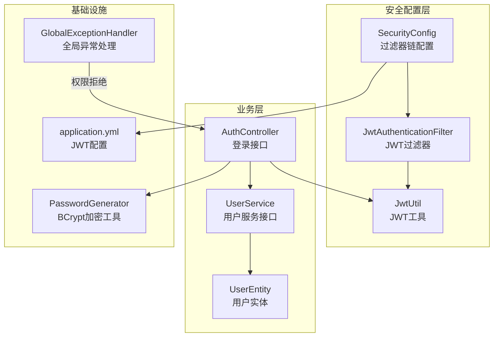
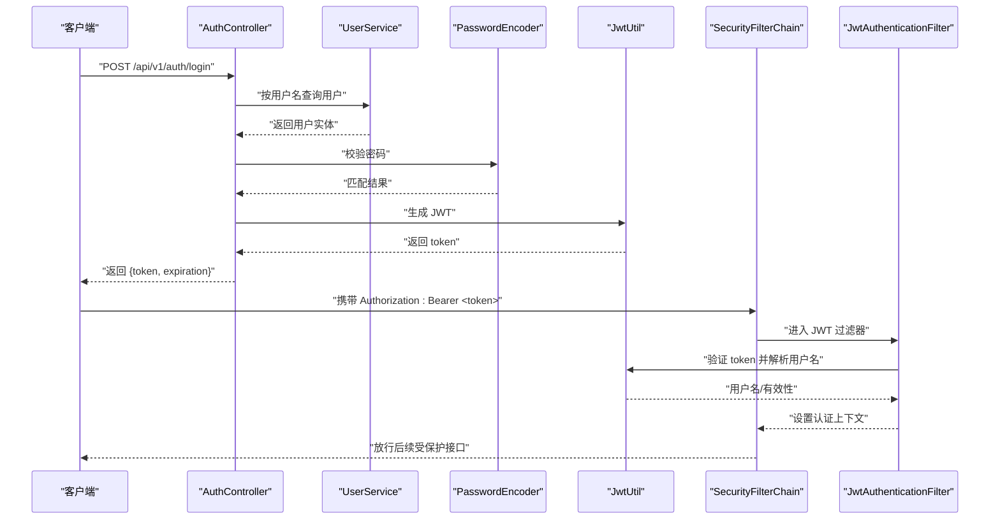
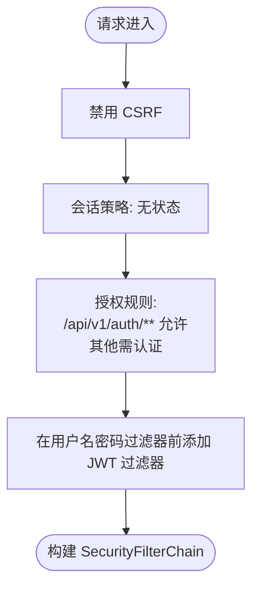
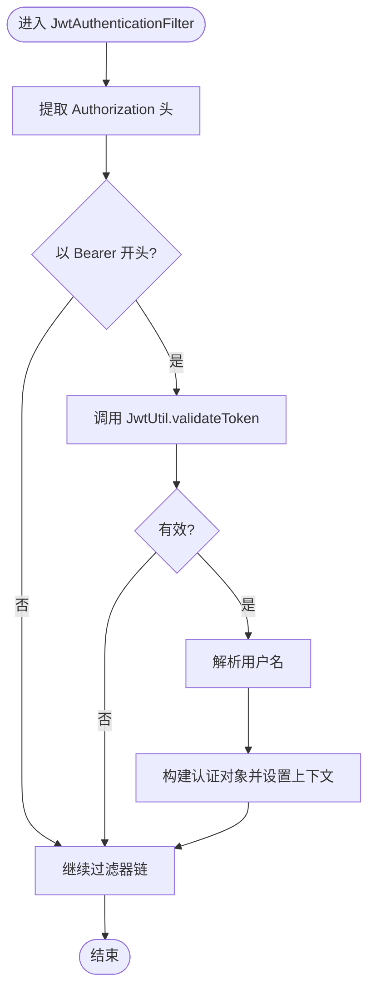
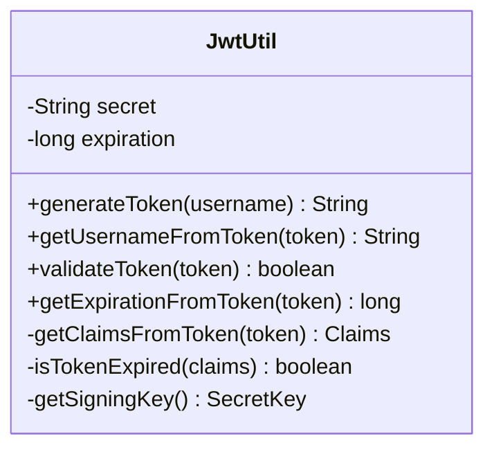
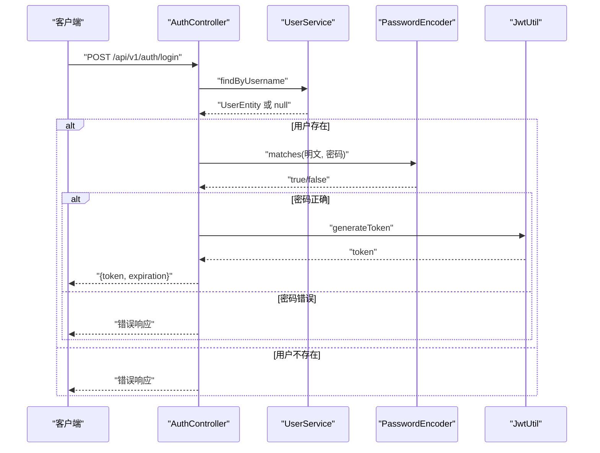
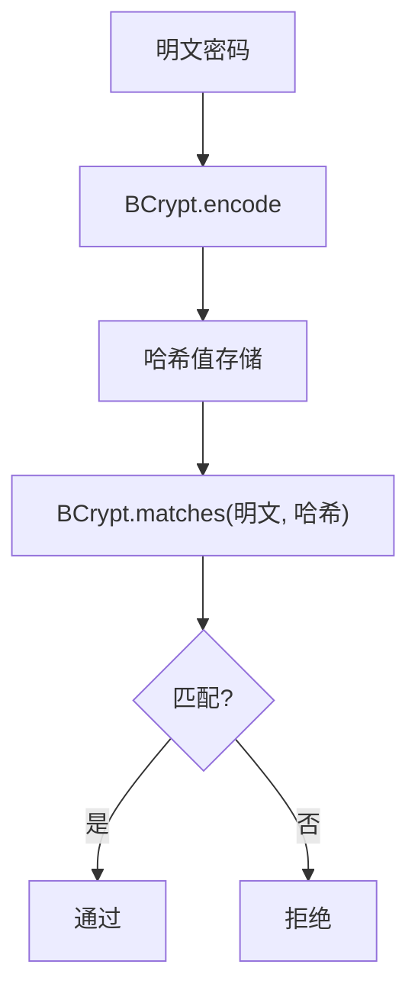
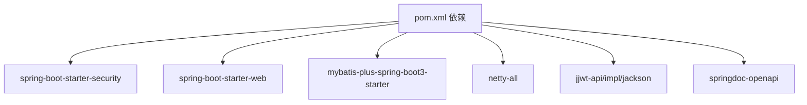

# 安全认证

<cite>
**本文引用的文件列表**
- [SecurityConfig.java](file://src/main/java/com/hydro/monitor/config/security/SecurityConfig.java)
- [JwtAuthenticationFilter.java](file://src/main/java/com/hydro/monitor/config/security/JwtAuthenticationFilter.java)
- [JwtUtil.java](file://src/main/java/com/hydro/monitor/config/security/JwtUtil.java)
- [AuthController.java](file://src/main/java/com/hydro/monitor/modules/controller/AuthController.java)
- [PasswordGenerator.java](file://src/main/java/com/hydro/monitor/common/PasswordGenerator.java)
- [application.yml](file://src/main/resources/application.yml)
- [JwtUtilTest.java](file://src/test/java/com/hydro/monitor/config/security/JwtUtilTest.java)
- [AuthControllerTest.java](file://src/test/java/com/hydro/monitor/modules/controller/AuthControllerTest.java)
- [UserService.java](file://src/main/java/com/hydro/monitor/modules/service/UserService.java)
- [UserEntity.java](file://src/main/java/com/hydro/monitor/modules/entity/UserEntity.java)
- [LoginRequestDTO.java](file://src/main/java/com/hydro/monitor/modules/dto/LoginRequestDTO.java)
- [LoginResponseDTO.java](file://src/main/java/com/hydro/monitor/modules/dto/LoginResponseDTO.java)
- [GlobalExceptionHandler.java](file://src/main/java/com/hydro/monitor/common/GlobalExceptionHandler.java)
- [pom.xml](file://pom.xml)
</cite>

## 目录
1. [简介](#简介)
2. [项目结构](#项目结构)
3. [核心组件](#核心组件)
4. [架构总览](#架构总览)
5. [详细组件分析](#详细组件分析)
6. [依赖分析](#依赖分析)
7. [性能考量](#性能考量)
8. [故障排查指南](#故障排查指南)
9. [结论](#结论)
10. [附录](#附录)

## 简介
本文件面向水文监测系统的安全认证模块，系统采用基于无状态会话的 JWT（JSON Web Token）认证机制，结合 Spring Security 6 的过滤器链实现统一的鉴权与授权控制。本文档将深入解释：
- JWT 令牌生成策略与验证流程
- Spring Security 配置与过滤器链设计
- 用户认证流程、密码加密策略与会话管理
- 角色权限设计、资源访问控制与 API 安全策略
- 安全最佳实践、常见攻击防护与漏洞修复建议
- 令牌生命周期管理、刷新机制与失效处理
- 安全配置示例、调试方法与故障排查指南

## 项目结构
安全相关代码主要集中在以下模块：
- 安全配置与过滤器：config/security
- 认证控制器：modules/controller
- 用户模型与服务：modules/entity、modules/service
- 工具与配置：common、resources
- 单元测试：test/java/com/hydro/monitor/config/security、modules/controller

图表来源
- [SecurityConfig.java:33-52](file://src/main/java/com/hydro/monitor/config/security/SecurityConfig.java#L33-L52)
- [JwtAuthenticationFilter.java:31-59](file://src/main/java/com/hydro/monitor/config/security/JwtAuthenticationFilter.java#L31-L59)
- [JwtUtil.java:37-48](file://src/main/java/com/hydro/monitor/config/security/JwtUtil.java#L37-L48)
- [AuthController.java:41-66](file://src/main/java/com/hydro/monitor/modules/controller/AuthController.java#L41-L66)
- [application.yml:48-51](file://src/main/resources/application.yml#L48-L51)
- [PasswordGenerator.java:22-35](file://src/main/java/com/hydro/monitor/common/PasswordGenerator.java#L22-L35)
- [GlobalExceptionHandler.java:38-43](file://src/main/java/com/hydro/monitor/common/GlobalExceptionHandler.java#L38-L43)

章节来源
- [SecurityConfig.java:15-76](file://src/main/java/com/hydro/monitor/config/security/SecurityConfig.java#L15-L76)
- [JwtAuthenticationFilter.java:19-75](file://src/main/java/com/hydro/monitor/config/security/JwtAuthenticationFilter.java#L19-L75)
- [JwtUtil.java:16-126](file://src/main/java/com/hydro/monitor/config/security/JwtUtil.java#L16-L126)
- [AuthController.java:19-68](file://src/main/java/com/hydro/monitor/modules/controller/AuthController.java#L19-L68)
- [application.yml:48-51](file://src/main/resources/application.yml#L48-L51)
- [PasswordGenerator.java:5-55](file://src/main/java/com/hydro/monitor/common/PasswordGenerator.java#L5-L55)
- [GlobalExceptionHandler.java:10-58](file://src/main/java/com/hydro/monitor/common/GlobalExceptionHandler.java#L10-L58)

## 核心组件
- 安全配置与过滤器链
  - 基于 SecurityFilterChain 的无状态会话策略，禁用 CSRF，对公开接口放行，其余接口需认证。
  - 注册自定义 JwtAuthenticationFilter，在标准用户名密码过滤器之前执行，负责从 Authorization 头提取并验证 JWT，构建认证上下文。
- JWT 工具
  - 提供令牌生成、解析、校验与过期判断；使用 HMAC-SHA 对称密钥签名。
- 认证控制器
  - 实现登录接口，校验用户凭据后签发 JWT，并返回 token 与过期时间。
- 密码加密
  - 使用 BCryptPasswordEncoder 进行密码哈希与匹配，提供独立的 PasswordGenerator 工具类便于生成哈希。
- 全局异常处理
  - 统一处理权限拒绝等异常，返回标准化错误响应。

章节来源
- [SecurityConfig.java:33-52](file://src/main/java/com/hydro/monitor/config/security/SecurityConfig.java#L33-L52)
- [JwtAuthenticationFilter.java:31-73](file://src/main/java/com/hydro/monitor/config/security/JwtAuthenticationFilter.java#L31-L73)
- [JwtUtil.java:37-124](file://src/main/java/com/hydro/monitor/config/security/JwtUtil.java#L37-L124)
- [AuthController.java:41-66](file://src/main/java/com/hydro/monitor/modules/controller/AuthController.java#L41-L66)
- [PasswordGenerator.java:22-35](file://src/main/java/com/hydro/monitor/common/PasswordGenerator.java#L22-L35)
- [GlobalExceptionHandler.java:38-43](file://src/main/java/com/hydro/monitor/common/GlobalExceptionHandler.java#L38-L43)

## 架构总览
下图展示从客户端到服务端的关键交互路径，包括登录、令牌传递与认证过滤器处理流程。

图表来源
- [AuthController.java:41-66](file://src/main/java/com/hydro/monitor/modules/controller/AuthController.java#L41-L66)
- [JwtAuthenticationFilter.java:31-59](file://src/main/java/com/hydro/monitor/config/security/JwtAuthenticationFilter.java#L31-L59)
- [JwtUtil.java:37-75](file://src/main/java/com/hydro/monitor/config/security/JwtUtil.java#L37-L75)
- [SecurityConfig.java:33-52](file://src/main/java/com/hydro/monitor/config/security/SecurityConfig.java#L33-L52)

## 详细组件分析

### 安全配置与过滤器链
- 无状态会话策略
  - SessionCreationPolicy 设为 STATELESS，避免服务器端会话存储，降低横向扩展复杂度。
- 授权规则
  - 对 /api/v1/auth/** 与文档接口放行，其余接口 require authenticated。
- 过滤器注册
  - 在 UsernamePasswordAuthenticationFilter 之前添加 JwtAuthenticationFilter，确保在标准表单登录前完成 JWT 校验。

图表来源
- [SecurityConfig.java:33-52](file://src/main/java/com/hydro/monitor/config/security/SecurityConfig.java#L33-L52)

章节来源
- [SecurityConfig.java:33-76](file://src/main/java/com/hydro/monitor/config/security/SecurityConfig.java#L33-L76)

### JWT 认证过滤器
- 令牌提取
  - 从 Authorization 头读取 Bearer 令牌，若缺失或格式不正确则跳过。
- 令牌验证
  - 调用 JwtUtil.validateToken 校验签名与过期时间；成功则从 token 解析用户名。
- 认证上下文设置
  - 构造 UsernamePasswordAuthenticationToken 并写入 SecurityContext，使后续控制器感知已认证主体。

图表来源
- [JwtAuthenticationFilter.java:31-73](file://src/main/java/com/hydro/monitor/config/security/JwtAuthenticationFilter.java#L31-L73)
- [JwtUtil.java:67-75](file://src/main/java/com/hydro/monitor/config/security/JwtUtil.java#L67-L75)

章节来源
- [JwtAuthenticationFilter.java:19-75](file://src/main/java/com/hydro/monitor/config/security/JwtAuthenticationFilter.java#L19-L75)

### JWT 工具类
- 令牌生成
  - 包含签发时间、过期时间与用户名声明；使用对称密钥进行签名。
- 令牌解析
  - 从 token 提取用户名与过期时间；内部通过解析签名载荷实现。
- 令牌校验
  - 解析并检查过期时间；异常时记录日志并返回无效。

图表来源
- [JwtUtil.java:23-125](file://src/main/java/com/hydro/monitor/config/security/JwtUtil.java#L23-L125)

章节来源
- [JwtUtil.java:16-126](file://src/main/java/com/hydro/monitor/config/security/JwtUtil.java#L16-L126)

### 认证控制器
- 登录流程
  - 根据用户名查询用户；校验密码；成功则生成 JWT 并返回 token 与过期时间。
- 错误处理
  - 用户不存在或密码错误时返回统一错误响应；控制器未直接抛出异常，由全局异常处理器兜底。

图表来源
- [AuthController.java:41-66](file://src/main/java/com/hydro/monitor/modules/controller/AuthController.java#L41-L66)
- [UserService.java:55-56](file://src/main/java/com/hydro/monitor/modules/service/UserService.java#L55-L56)
- [JwtUtil.java:37-48](file://src/main/java/com/hydro/monitor/config/security/JwtUtil.java#L37-L48)

章节来源
- [AuthController.java:19-68](file://src/main/java/com/hydro/monitor/modules/controller/AuthController.java#L19-L68)
- [UserService.java:17-74](file://src/main/java/com/hydro/monitor/modules/service/UserService.java#L17-L74)

### 密码加密策略
- 存储策略
  - 用户密码以 BCrypt 哈希形式存储，UserEntity.password 字段即为哈希值。
- 加密与匹配
  - PasswordGenerator 封装 BCryptPasswordEncoder，提供 encode 与 matches 方法；AuthController 使用 Spring Security 的 PasswordEncoder 进行匹配。
- 开发辅助
  - PasswordGenerator.main 可输出哈希与 SQL 插入语句，便于初始化数据。

图表来源
- [PasswordGenerator.java:22-35](file://src/main/java/com/hydro/monitor/common/PasswordGenerator.java#L22-L35)
- [UserEntity.java:46-48](file://src/main/java/com/hydro/monitor/modules/entity/UserEntity.java#L46-L48)

章节来源
- [PasswordGenerator.java:5-55](file://src/main/java/com/hydro/monitor/common/PasswordGenerator.java#L5-L55)
- [UserEntity.java:46-48](file://src/main/java/com/hydro/monitor/modules/entity/UserEntity.java#L46-L48)

### 会话管理方案
- 无状态会话
  - 通过 SessionCreationPolicy.STATELESS 禁用服务器端会话；所有认证状态由客户端持有 JWT。
- 令牌生命周期
  - 令牌默认有效期 24 小时；过期后需重新登录获取新令牌。
- 令牌刷新
  - 当前实现未提供自动刷新机制；建议在客户端侧检测过期并在过期前主动重新登录获取新令牌。

章节来源
- [SecurityConfig.java:38-39](file://src/main/java/com/hydro/monitor/config/security/SecurityConfig.java#L38-L39)
- [application.yml:48-51](file://src/main/resources/application.yml#L48-L51)
- [JwtUtil.java:28-29](file://src/main/java/com/hydro/monitor/config/security/JwtUtil.java#L28-L29)

### 角色权限设计与资源访问控制
- 角色字段
  - UserEntity.role 字段用于标识用户角色（如 ADMIN），当前安全配置未在过滤器链中显式校验角色。
- 授权扩展
  - 如需基于角色的细粒度授权，可在控制器层使用注解（如 @PreAuthorize）或在 JwtAuthenticationFilter 中解析角色并注入 GrantedAuthority，再在 SecurityFilterChain 中配置相应规则。

章节来源
- [UserEntity.java:52-53](file://src/main/java/com/hydro/monitor/modules/entity/UserEntity.java#L52-L53)
- [SecurityConfig.java:41-47](file://src/main/java/com/hydro/monitor/config/security/SecurityConfig.java#L41-L47)

### API 安全策略
- 公开接口
  - /api/v1/auth/** 与文档接口无需认证即可访问。
- 受保护接口
  - 其余接口均需认证；可通过在控制器上添加 @PreAuthorize 或在 SecurityFilterChain 中增加更严格的授权规则实现 RBAC。
- 异常处理
  - 全局异常处理器统一拦截 AccessDeniedException 并返回 403 错误。

章节来源
- [SecurityConfig.java:41-47](file://src/main/java/com/hydro/monitor/config/security/SecurityConfig.java#L41-L47)
- [GlobalExceptionHandler.java:38-43](file://src/main/java/com/hydro/monitor/common/GlobalExceptionHandler.java#L38-L43)

## 依赖分析
- Spring Security 6
  - 提供基于过滤器链的认证与授权能力；与 Spring Boot 自动装配集成良好。
- JWT（JJWT）
  - 使用 jjwt-api/impl/jackson 组合，支持 HS256 签名与解析。
- BCrypt
  - Spring Security 的 PasswordEncoder 与独立的 PasswordGenerator 均基于 BCrypt。
- Swagger/OpenAPI
  - springdoc-openapi 提供 API 文档，当前配置对文档接口放行。

图表来源
- [pom.xml:30-108](file://pom.xml#L30-L108)

章节来源
- [pom.xml:21-28](file://pom.xml#L21-L28)
- [pom.xml:30-108](file://pom.xml#L30-L108)

## 性能考量
- 无状态会话的优势
  - 降低服务器端会话存储压力，便于水平扩展；适合高并发场景。
- JWT 验证成本
  - 每次请求均需解析与校验签名，建议合理设置令牌有效期，避免频繁重试导致的 CPU 压力。
- 密码验证
  - BCrypt 成本因子较高，匹配过程较慢；建议在登录失败时快速短路，减少不必要的计算。
- 过滤器链顺序
  - 将 JWT 过滤器置于用户名密码过滤器之前，避免重复认证逻辑。

## 故障排查指南
- 登录失败
  - 用户名不存在或密码错误：检查用户名与密码是否正确；确认数据库中用户是否存在且密码哈希匹配。
- 令牌无效
  - 校验失败：检查密钥是否一致、过期时间是否正确；查看日志中关于解析失败的异常堆栈。
- 权限拒绝
  - 控制器返回 403：确认是否正确配置了授权规则或角色校验；检查控制器上的访问限制注解。
- 过滤器未生效
  - 确认 SecurityFilterChain 正确注册了 JwtAuthenticationFilter，并位于 UsernamePasswordAuthenticationFilter 之前。
- 配置问题
  - JWT 密钥与过期时间：检查 application.yml 中的 jwt.secret 与 jwt.expiration；确保生产环境使用强密钥与合理过期时间。

章节来源
- [AuthController.java:48-57](file://src/main/java/com/hydro/monitor/modules/controller/AuthController.java#L48-L57)
- [JwtUtil.java:67-75](file://src/main/java/com/hydro/monitor/config/security/JwtUtil.java#L67-L75)
- [GlobalExceptionHandler.java:38-43](file://src/main/java/com/hydro/monitor/common/GlobalExceptionHandler.java#L38-L43)
- [SecurityConfig.java:33-52](file://src/main/java/com/hydro/monitor/config/security/SecurityConfig.java#L33-L52)
- [application.yml:48-51](file://src/main/resources/application.yml#L48-L51)

## 结论
本系统采用无状态 JWT 认证与 Spring Security 过滤器链相结合的方式，实现了简洁高效的认证与授权控制。通过 BCrypt 密码哈希与严格的令牌校验，保障了用户凭据与会话安全。建议在后续版本中补充基于角色的细粒度授权、令牌刷新机制与更完善的审计日志，以进一步提升安全性与可维护性。

## 附录

### 安全最佳实践清单
- 使用强密钥与定期轮换
  - 生产环境使用高强度随机密钥，定期轮换；避免硬编码在配置文件中。
- 合理设置令牌有效期
  - 根据业务场景调整过期时间；对敏感操作可缩短有效期或启用二次验证。
- 传输安全
  - 使用 HTTPS；避免在日志中打印完整 token。
- 授权最小化
  - 严格区分角色与权限；仅授予必要权限。
- 输入校验与异常处理
  - 对请求参数进行严格校验；统一异常处理，避免泄露内部信息。

### 常见攻击与防护
- JWT 重放与篡改
  - 使用强密钥与 HS256；避免使用弱密钥或无签名模式；服务端严格校验签名与过期时间。
- 暴力破解
  - 登录失败快速短路；限制登录尝试次数；对账户进行临时锁定。
- CSRF（虽禁用，仍需注意）
  - 无状态设计已规避 CSRF 风险；保持无状态策略不变。
- 权限提升
  - 严格基于角色的授权；对敏感接口进行细粒度权限控制。

### 漏洞修复建议
- 令牌刷新
  - 当前未实现自动刷新；建议在客户端检测过期后主动重新登录获取新令牌。
- 会话撤销
  - 无服务器端会话，无法直接撤销；可考虑黑名单机制或缩短令牌有效期。
- 审计与监控
  - 记录登录与关键操作日志；对异常登录行为进行告警。

### 安全配置示例
- JWT 配置项
  - jwt.secret：强随机密钥
  - jwt.expiration：毫秒级过期时间（如 24 小时）
- 过滤器链配置
  - 禁用 CSRF，无状态会话，受保护接口需认证，公开接口放行

章节来源
- [application.yml:48-51](file://src/main/resources/application.yml#L48-L51)
- [SecurityConfig.java:33-52](file://src/main/java/com/hydro/monitor/config/security/SecurityConfig.java#L33-L52)