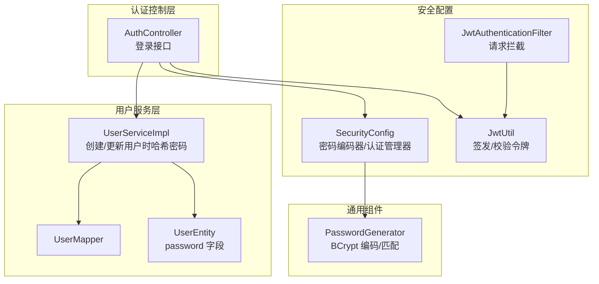
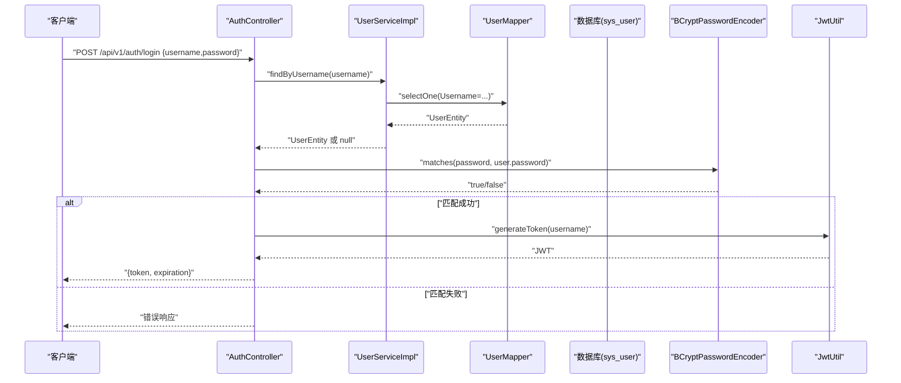
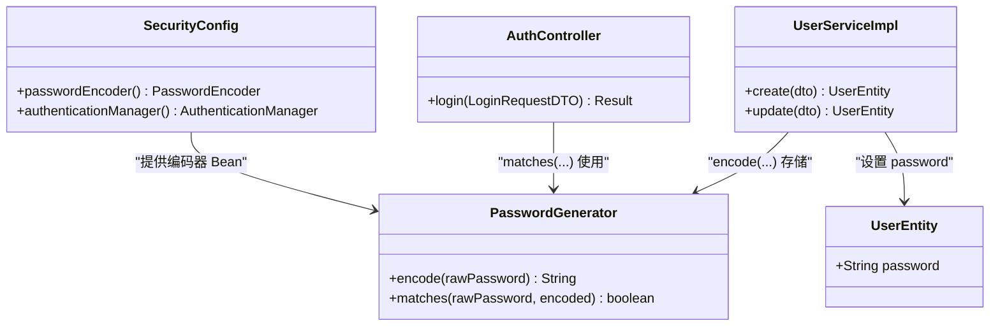
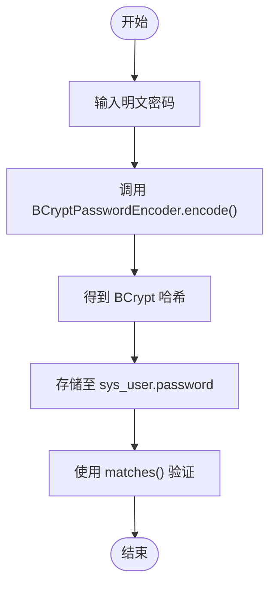
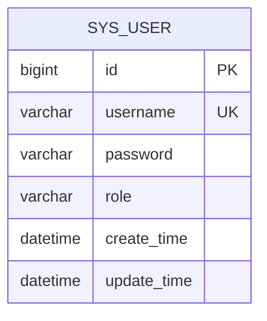
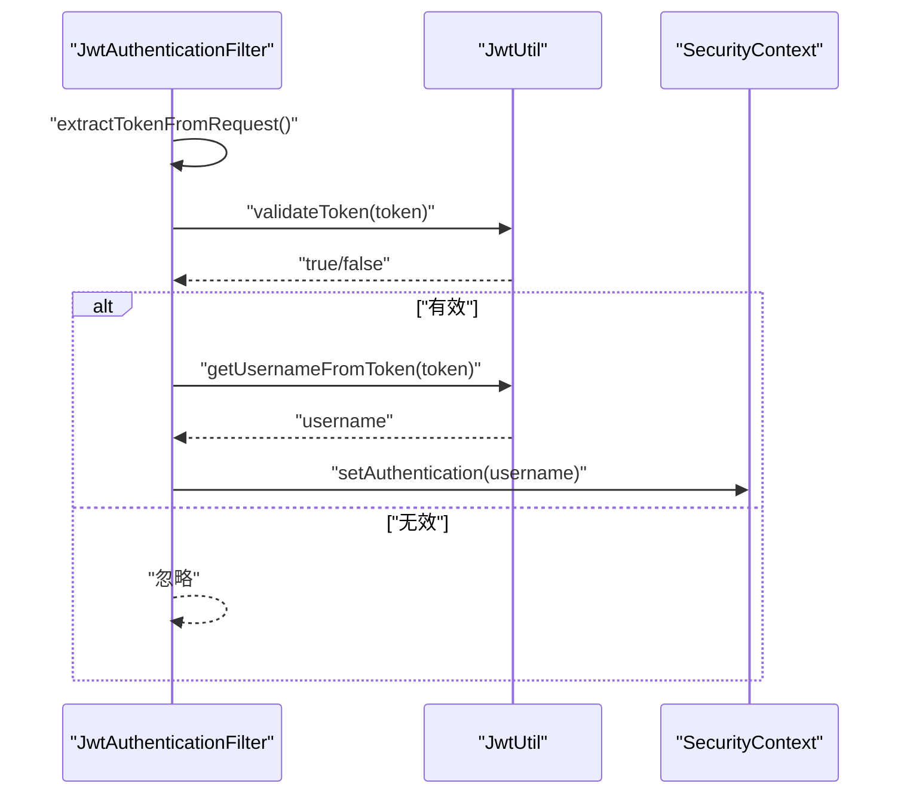
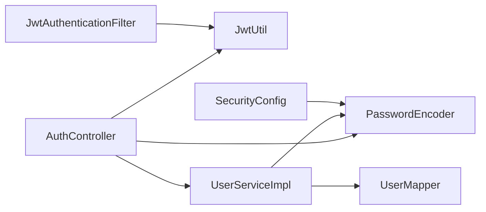

# 密码安全管理

<cite>
**本文引用的文件**
- [PasswordGenerator.java](file://src/main/java/com/hydro/monitor/common/PasswordGenerator.java)
- [PasswordGeneratorTest.java](file://src/test/java/com/hydro/monitor/common/PasswordGeneratorTest.java)
- [SecurityConfig.java](file://src/main/java/com/hydro/monitor/config/security/SecurityConfig.java)
- [JwtUtil.java](file://src/main/java/com/hydro/monitor/config/security/JwtUtil.java)
- [JwtAuthenticationFilter.java](file://src/main/java/com/hydro/monitor/config/security/JwtAuthenticationFilter.java)
- [AuthController.java](file://src/main/java/com/hydro/monitor/modules/controller/AuthController.java)
- [UserServiceImpl.java](file://src/main/java/com/hydro/monitor/modules/service/impl/UserServiceImpl.java)
- [UserEntity.java](file://src/main/java/com/hydro/monitor/modules/entity/UserEntity.java)
- [UserMapper.java](file://src/main/java/com/hydro/monitor/modules/mapper/UserMapper.java)
- [application.yml](file://src/main/resources/application.yml)
- [init.sql](file://src/main/resources/db/init.sql)
- [README.md](file://README.md)
</cite>

## 目录
1. [简介](#简介)
2. [项目结构](#项目结构)
3. [核心组件](#核心组件)
4. [架构总览](#架构总览)
5. [详细组件分析](#详细组件分析)
6. [依赖分析](#依赖分析)
7. [性能考虑](#性能考虑)
8. [故障排查指南](#故障排查指南)
9. [结论](#结论)
10. [附录](#附录)

## 简介
本文件面向密码安全管理，围绕以下目标展开：  
- 深入解释 BCrypt 密码加密算法的实现原理与安全性优势  
- 说明 PasswordGenerator 密码生成器的设计思路（随机密码生成、强度验证与安全存储）  
- 设计密码策略（最小长度、字符类型要求、复杂度规则）  
- 解释密码哈希存储机制、盐值生成与验证流程  
- 提供密码安全最佳实践、常见攻击防护与漏洞修复建议  
- 给出密码管理配置示例、安全审计方法与合规性要求  

本项目采用 Spring Security + BCrypt + JWT 的组合实现认证与授权，密码以 BCrypt 哈希形式持久化存储，登录时通过 PasswordEncoder 进行匹配校验。

## 项目结构
与密码安全相关的关键模块如下：
- 通用组件：PasswordGenerator（BCrypt 编码与匹配）
- 安全配置：SecurityConfig（全局安全链、密码编码器、认证管理器）
- 认证流程：AuthController（登录接口）、JwtUtil（令牌签发与解析）、JwtAuthenticationFilter（请求拦截）
- 用户服务：UserServiceImpl（创建/更新用户时进行密码哈希）、UserEntity（密码字段映射）
- 配置与初始化：application.yml（JWT 密钥与过期时间）、init.sql（默认管理员密码哈希）

图表来源
- [SecurityConfig.java:1-76](file://src/main/java/com/hydro/monitor/config/security/SecurityConfig.java#L1-L76)
- [JwtUtil.java:1-126](file://src/main/java/com/hydro/monitor/config/security/JwtUtil.java#L1-L126)
- [JwtAuthenticationFilter.java:1-75](file://src/main/java/com/hydro/monitor/config/security/JwtAuthenticationFilter.java#L1-L75)
- [AuthController.java:1-68](file://src/main/java/com/hydro/monitor/modules/controller/AuthController.java#L1-L68)
- [UserServiceImpl.java:1-208](file://src/main/java/com/hydro/monitor/modules/service/impl/UserServiceImpl.java#L1-L208)
- [UserMapper.java:1-15](file://src/main/java/com/hydro/monitor/modules/mapper/UserMapper.java#L1-L15)
- [UserEntity.java:1-70](file://src/main/java/com/hydro/monitor/modules/entity/UserEntity.java#L1-L70)
- [PasswordGenerator.java:1-55](file://src/main/java/com/hydro/monitor/common/PasswordGenerator.java#L1-L55)

章节来源
- [SecurityConfig.java:1-76](file://src/main/java/com/hydro/monitor/config/security/SecurityConfig.java#L1-L76)
- [application.yml:48-51](file://src/main/resources/application.yml#L48-L51)
- [init.sql:31-47](file://src/main/resources/db/init.sql#L31-L47)

## 核心组件
- BCrypt 密码编码器：在 SecurityConfig 中定义，用于创建与验证密码哈希；在 PasswordGenerator 中提供便捷静态方法封装
- 登录认证：AuthController 在登录时查询用户并使用 PasswordEncoder.matches 校验密码，成功后签发 JWT
- 用户服务：UserServiceImpl 在创建/更新用户时调用 PasswordEncoder.encode 对明文密码进行哈希存储
- JWT：JwtUtil 负责签发与校验令牌；JwtAuthenticationFilter 从 Authorization 头中提取 Bearer Token 并注入认证上下文

章节来源
- [SecurityConfig.java:59-74](file://src/main/java/com/hydro/monitor/config/security/SecurityConfig.java#L59-L74)
- [PasswordGenerator.java:12-35](file://src/main/java/com/hydro/monitor/common/PasswordGenerator.java#L12-L35)
- [AuthController.java:41-66](file://src/main/java/com/hydro/monitor/modules/controller/AuthController.java#L41-L66)
- [UserServiceImpl.java:38-101](file://src/main/java/com/hydro/monitor/modules/service/impl/UserServiceImpl.java#L38-L101)
- [JwtUtil.java:37-48](file://src/main/java/com/hydro/monitor/config/security/JwtUtil.java#L37-L48)
- [JwtAuthenticationFilter.java:31-59](file://src/main/java/com/hydro/monitor/config/security/JwtAuthenticationFilter.java#L31-L59)

## 架构总览
下图展示登录与认证的端到端流程，包括密码哈希存储与 JWT 令牌发放：

图表来源
- [AuthController.java:41-66](file://src/main/java/com/hydro/monitor/modules/controller/AuthController.java#L41-L66)
- [UserServiceImpl.java:122-129](file://src/main/java/com/hydro/monitor/modules/service/impl/UserServiceImpl.java#L122-L129)
- [UserMapper.java:12-14](file://src/main/java/com/hydro/monitor/modules/mapper/UserMapper.java#L12-L14)
- [SecurityConfig.java:60-62](file://src/main/java/com/hydro/monitor/config/security/SecurityConfig.java#L60-L62)
- [JwtUtil.java:37-48](file://src/main/java/com/hydro/monitor/config/security/JwtUtil.java#L37-L48)

## 详细组件分析

### BCrypt 密码加密与验证
- 实现原理与优势
  - BCrypt 是自适应散列函数，内置成本因子（work factor），能随硬件升级动态调整计算难度，抵御暴力破解
  - 每次加密都会生成唯一盐值（salt），即使相同明文多次加密也会产生不同哈希，有效对抗彩虹表攻击
- 在项目中的使用
  - SecurityConfig 中注册 BCryptPasswordEncoder 作为全局密码编码器
  - PasswordGenerator 提供 encode 与 matches 的静态封装，便于测试与工具化
  - AuthController 使用 PasswordEncoder.matches 校验登录密码
  - UserServiceImpl 在创建/更新用户时调用 encode 存储哈希

图表来源
- [SecurityConfig.java:59-74](file://src/main/java/com/hydro/monitor/config/security/SecurityConfig.java#L59-L74)
- [PasswordGenerator.java:12-35](file://src/main/java/com/hydro/monitor/common/PasswordGenerator.java#L12-L35)
- [AuthController.java:54](file://src/main/java/com/hydro/monitor/modules/controller/AuthController.java#L54)
- [UserServiceImpl.java:55](file://src/main/java/com/hydro/monitor/modules/service/impl/UserServiceImpl.java#L55)
- [UserEntity.java:46](file://src/main/java/com/hydro/monitor/modules/entity/UserEntity.java#L46)

章节来源
- [SecurityConfig.java:60-62](file://src/main/java/com/hydro/monitor/config/security/SecurityConfig.java#L60-L62)
- [PasswordGenerator.java:22-35](file://src/main/java/com/hydro/monitor/common/PasswordGenerator.java#L22-L35)
- [AuthController.java:54](file://src/main/java/com/hydro/monitor/modules/controller/AuthController.java#L54)
- [UserServiceImpl.java:55](file://src/main/java/com/hydro/monitor/modules/service/impl/UserServiceImpl.java#L55)

### 密码生成器 PasswordGenerator
- 设计思路
  - 封装 BCryptPasswordEncoder，提供 encode 与 matches 的静态方法，便于单元测试与命令行工具化
  - main 方法演示如何生成哈希并输出 SQL 插入语句，便于初始化默认用户
- 测试验证
  - PasswordGeneratorTest 验证给定哈希与明文 admin123 的匹配性，确保哈希一致性

图表来源
- [PasswordGenerator.java:22-35](file://src/main/java/com/hydro/monitor/common/PasswordGenerator.java#L22-L35)
- [PasswordGeneratorTest.java:17-43](file://src/test/java/com/hydro/monitor/common/PasswordGeneratorTest.java#L17-L43)

章节来源
- [PasswordGenerator.java:12-55](file://src/main/java/com/hydro/monitor/common/PasswordGenerator.java#L12-L55)
- [PasswordGeneratorTest.java:13-45](file://src/test/java/com/hydro/monitor/common/PasswordGeneratorTest.java#L13-L45)

### 密码策略设计
- 最小长度：建议至少 12 位，结合大小写字母、数字与特殊字符
- 字符类型要求：必须包含大写字母、小写字母、数字与至少一个特殊字符
- 复杂度规则：禁止连续重复字符（如 aaa）、禁止与用户名或历史密码相同
- 生效策略：在用户创建/更新时进行校验，不满足则拒绝入库
- 参考实现位置
  - 用户创建：UserServiceImpl.create 中设置 password 之前进行策略校验
  - 用户更新：UserServiceImpl.update 中对 password 字段进行策略校验

章节来源
- [UserServiceImpl.java:40-65](file://src/main/java/com/hydro/monitor/modules/service/impl/UserServiceImpl.java#L40-L65)
- [UserServiceImpl.java:68-101](file://src/main/java/com/hydro/monitor/modules/service/impl/UserServiceImpl.java#L68-L101)

### 密码哈希存储机制、盐值与验证流程
- 存储机制
  - 数据库表 sys_user 的 password 字段存储 BCrypt 哈希，长度足够容纳完整哈希
  - 初始化脚本中预置默认管理员账户，密码为 admin123 的 BCrypt 哈希
- 盐值生成
  - BCrypt 内置盐值生成，每次编码均不同，无需外部干预
- 验证流程
  - 登录时使用 PasswordEncoder.matches 将明文与存储哈希比对，成功后签发 JWT

图表来源
- [init.sql:31-41](file://src/main/resources/db/init.sql#L31-L41)
- [UserEntity.java:16-48](file://src/main/java/com/hydro/monitor/modules/entity/UserEntity.java#L16-L48)

章节来源
- [init.sql:43-47](file://src/main/resources/db/init.sql#L43-L47)
- [UserEntity.java:46](file://src/main/java/com/hydro/monitor/modules/entity/UserEntity.java#L46)

### JWT 令牌与认证流程
- 令牌签发：JwtUtil 根据用户名生成带过期时间的 JWT
- 请求拦截：JwtAuthenticationFilter 从 Authorization 头中提取 Bearer Token，校验后将用户信息写入 SecurityContext
- 登录接口：AuthController 在用户存在且密码匹配后返回 JWT

图表来源
- [JwtAuthenticationFilter.java:31-59](file://src/main/java/com/hydro/monitor/config/security/JwtAuthenticationFilter.java#L31-L59)
- [JwtUtil.java:67-75](file://src/main/java/com/hydro/monitor/config/security/JwtUtil.java#L67-L75)
- [JwtUtil.java:56-59](file://src/main/java/com/hydro/monitor/config/security/JwtUtil.java#L56-L59)

章节来源
- [JwtUtil.java:37-48](file://src/main/java/com/hydro/monitor/config/security/JwtUtil.java#L37-L48)
- [JwtAuthenticationFilter.java:67-73](file://src/main/java/com/hydro/monitor/config/security/JwtAuthenticationFilter.java#L67-L73)
- [AuthController.java:60-66](file://src/main/java/com/hydro/monitor/modules/controller/AuthController.java#L60-L66)

## 依赖分析
- 组件耦合
  - AuthController 依赖 PasswordEncoder、JwtUtil、UserService
  - UserServiceImpl 依赖 UserMapper 与 PasswordEncoder
  - SecurityConfig 为全局提供 PasswordEncoder 与 AuthenticationManager
  - JwtUtil 与 JwtAuthenticationFilter 形成认证链路
- 外部依赖
  - Spring Security 提供 PasswordEncoder、认证提供者与过滤器链
  - BCryptPasswordEncoder 来自 Spring Security Crypto

图表来源
- [AuthController.java:32](file://src/main/java/com/hydro/monitor/modules/controller/AuthController.java#L32)
- [UserServiceImpl.java:36](file://src/main/java/com/hydro/monitor/modules/service/impl/UserServiceImpl.java#L36)
- [SecurityConfig.java:60-74](file://src/main/java/com/hydro/monitor/config/security/SecurityConfig.java#L60-L74)
- [JwtAuthenticationFilter.java:29](file://src/main/java/com/hydro/monitor/config/security/JwtAuthenticationFilter.java#L29)

章节来源
- [AuthController.java:32-33](file://src/main/java/com/hydro/monitor/modules/controller/AuthController.java#L32-L33)
- [UserServiceImpl.java:36](file://src/main/java/com/hydro/monitor/modules/service/impl/UserServiceImpl.java#L36)
- [SecurityConfig.java:60-74](file://src/main/java/com/hydro/monitor/config/security/SecurityConfig.java#L60-L74)

## 性能考虑
- BCrypt 成本因子：可通过 PasswordEncoder 构造参数调整，默认已具备良好平衡；在高并发场景下建议监控 CPU 使用率并按需提升
- 登录验证：matches 为 O(1) 时间复杂度，但涉及哈希计算；建议配合缓存与限流策略
- 令牌签发：JWT 仅包含少量声明，签发开销极低；注意密钥长度与过期时间设置
- 数据库索引：sys_user.username 建有唯一索引，查询效率高

## 故障排查指南
- 登录失败
  - 现象：返回“用户名或密码错误”
  - 排查：确认用户名是否存在、密码是否与 BCrypt 哈希匹配；检查日志中警告信息
- 令牌无效
  - 现象：接口返回 403 或无法访问受保护资源
  - 排查：确认 Authorization 头格式为 Bearer Token、密钥未被篡改、未过期；检查 JwtUtil.validateToken 返回值
- 密钥泄露风险
  - 现象：生产环境默认密钥导致安全告警
  - 处理：修改 application.yml 中 jwt.secret 为强随机密钥，并通过环境变量注入
- 密码策略未生效
  - 现象：创建/更新用户时未进行复杂度校验
  - 处理：在 UserServiceImpl 的 create/update 中增加策略校验逻辑

章节来源
- [AuthController.java:48-57](file://src/main/java/com/hydro/monitor/modules/controller/AuthController.java#L48-L57)
- [JwtUtil.java:67-75](file://src/main/java/com/hydro/monitor/config/security/JwtUtil.java#L67-L75)
- [application.yml:49-51](file://src/main/resources/application.yml#L49-L51)
- [UserServiceImpl.java:40-101](file://src/main/java/com/hydro/monitor/modules/service/impl/UserServiceImpl.java#L40-L101)

## 结论
本项目通过 BCrypt 哈希与 JWT 令牌实现了安全的密码存储与认证流程。核心要点包括：  
- 使用 BCrypt 保证密码不可逆与抗暴力破解  
- 在创建/更新用户时统一进行哈希处理  
- 登录阶段通过 PasswordEncoder.matches 完成验证  
- 通过 JwtUtil 与 JwtAuthenticationFilter 构建无状态认证链路  
建议在生产环境中强化密钥管理、引入密码复杂度策略与审计日志，并定期评估安全配置的有效性。

## 附录

### 密码安全最佳实践
- 强制复杂度：长度≥12，包含大小写字母、数字与特殊字符，禁止与用户名或历史密码相同
- 定期轮换：强制用户定期更换密码，限制历史密码复用
- 多因素认证：在高危操作场景启用 MFA
- 传输安全：生产环境启用 HTTPS，防止中间人攻击
- 令牌安全：缩短过期时间、使用 HttpOnly SameSite Cookie（如适用）、支持令牌撤销

### 常见攻击防护与漏洞修复建议
- 暴力破解：合理设置 BCrypt 成本因子，配合登录失败次数限制与临时封禁
- 令牌泄露：严格密钥管理，避免硬编码；定期轮换密钥
- 重放攻击：短令牌有效期、服务端校验时间戳（如需）
- 信息泄露：避免在日志中打印明文密码；统一错误提示，不暴露用户存在性差异

### 密码管理配置示例
- JWT 配置（application.yml）
  - jwt.secret：强随机密钥（建议 256-bit 以上）
  - jwt.expiration：合理设置（如 24 小时）
- BCrypt 编码器（SecurityConfig）
  - 可通过构造参数调整成本因子，兼顾安全与性能

章节来源
- [application.yml:49-51](file://src/main/resources/application.yml#L49-L51)
- [SecurityConfig.java:60-62](file://src/main/java/com/hydro/monitor/config/security/SecurityConfig.java#L60-L62)

### 安全审计方法
- 密码哈希一致性：使用 PasswordGeneratorTest 验证默认账户哈希
- 登录行为审计：记录登录时间、IP、用户代理与结果
- 密钥轮换审计：记录密钥变更时间与责任人
- 权限访问审计：记录受保护接口访问情况

章节来源
- [PasswordGeneratorTest.java:17-32](file://src/test/java/com/hydro/monitor/common/PasswordGeneratorTest.java#L17-L32)
- [README.md:112-113](file://README.md#L112-L113)