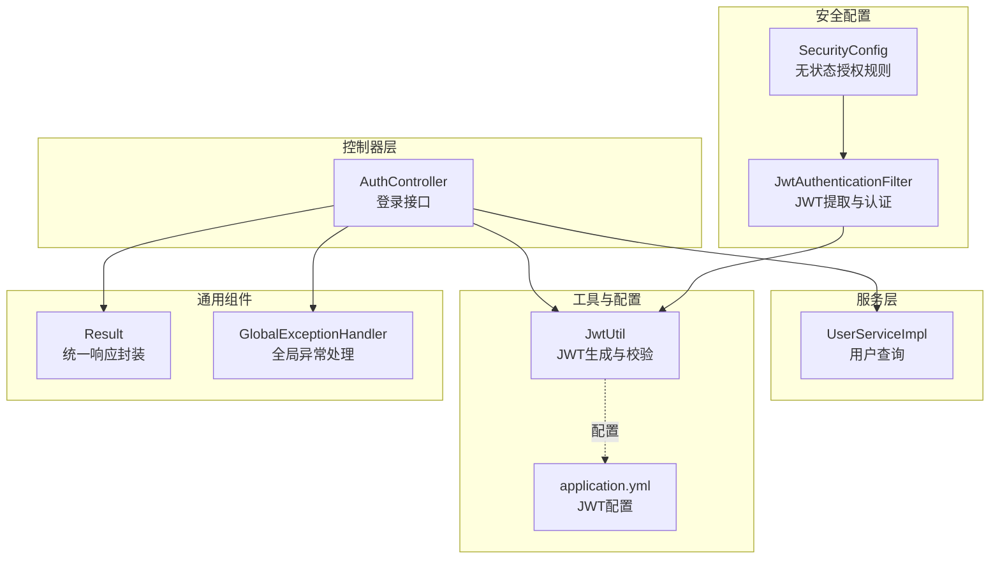
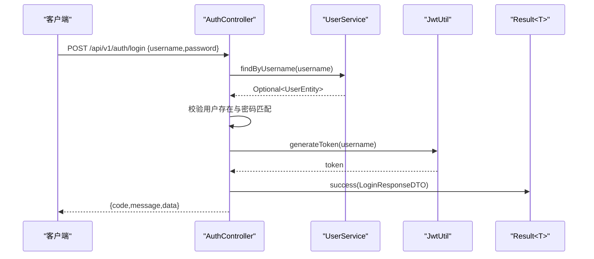
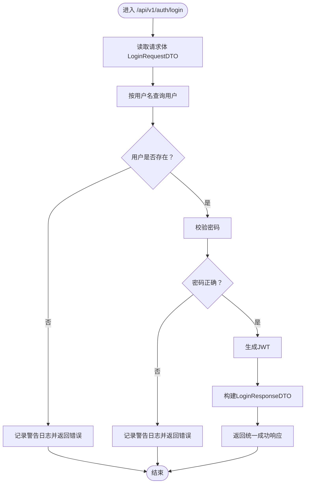
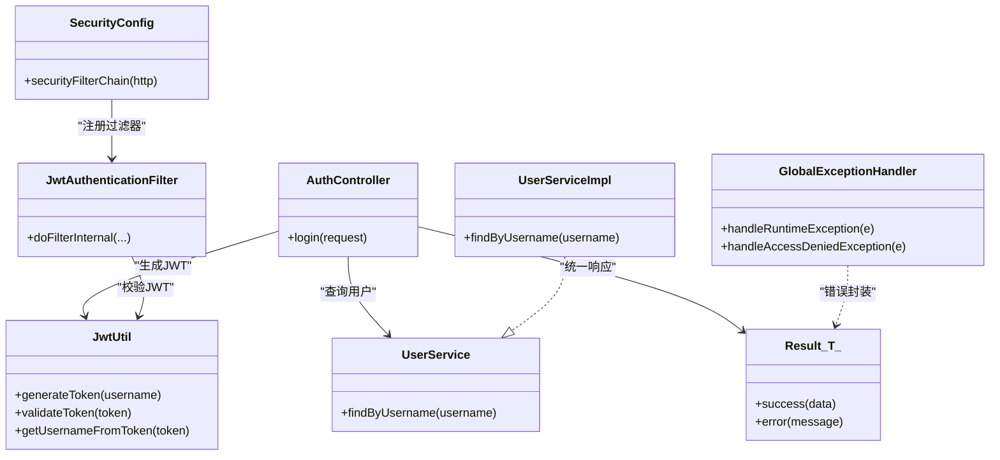

# 认证控制器

<cite>
**本文引用的文件**
- [AuthController.java](file://src/main/java/com/hydro/monitor/modules/controller/AuthController.java)
- [LoginRequestDTO.java](file://src/main/java/com/hydro/monitor/modules/dto/LoginRequestDTO.java)
- [LoginResponseDTO.java](file://src/main/java/com/hydro/monitor/modules/dto/LoginResponseDTO.java)
- [JwtUtil.java](file://src/main/java/com/hydro/monitor/config/security/JwtUtil.java)
- [SecurityConfig.java](file://src/main/java/com/hydro/monitor/config/security/SecurityConfig.java)
- [JwtAuthenticationFilter.java](file://src/main/java/com/hydro/monitor/config/security/JwtAuthenticationFilter.java)
- [GlobalExceptionHandler.java](file://src/main/java/com/hydro/monitor/common/GlobalExceptionHandler.java)
- [Result.java](file://src/main/java/com/hydro/monitor/common/Result.java)
- [UserService.java](file://src/main/java/com/hydro/monitor/modules/service/UserService.java)
- [UserServiceImpl.java](file://src/main/java/com/hydro/monitor/modules/service/impl/UserServiceImpl.java)
- [application.yml](file://src/main/resources/application.yml)
- [AuthControllerTest.java](file://src/test/java/com/hydro/monitor/modules/controller/AuthControllerTest.java)
</cite>

## 目录
1. [简介](#简介)
2. [项目结构](#项目结构)
3. [核心组件](#核心组件)
4. [架构总览](#架构总览)
5. [详细组件分析](#详细组件分析)
6. [依赖分析](#依赖分析)
7. [性能考量](#性能考量)
8. [故障排查指南](#故障排查指南)
9. [结论](#结论)
10. [附录](#附录)

## 简介
本文件面向认证控制器的详细API文档，聚焦用户登录认证接口的实现与使用。内容涵盖：
- 接口请求参数、响应格式与业务逻辑
- 登录请求的数据校验、用户信息查询与JWT令牌生成流程
- 认证失败与成功的处理机制（异常捕获、错误响应、日志记录）
- 安全考虑、防暴力破解策略与频率限制机制
- 完整的API调用示例、参数说明与返回值格式
- 客户端集成指南、错误处理方案与调试方法

## 项目结构
认证相关模块位于后端工程的模块化分层中，采用“控制器-服务-配置-工具”分层设计，配合统一响应封装与全局异常处理，确保接口一致性与可维护性。

图表来源
- [AuthController.java:1-68](file://src/main/java/com/hydro/monitor/modules/controller/AuthController.java#L1-L68)
- [UserServiceImpl.java:122-129](file://src/main/java/com/hydro/monitor/modules/service/impl/UserServiceImpl.java#L122-L129)
- [JwtUtil.java:37-48](file://src/main/java/com/hydro/monitor/config/security/JwtUtil.java#L37-L48)
- [SecurityConfig.java:34-51](file://src/main/java/com/hydro/monitor/config/security/SecurityConfig.java#L34-L51)
- [JwtAuthenticationFilter.java:32-59](file://src/main/java/com/hydro/monitor/config/security/JwtAuthenticationFilter.java#L32-L59)
- [application.yml:48-51](file://src/main/resources/application.yml#L48-L51)
- [Result.java:35-77](file://src/main/java/com/hydro/monitor/common/Result.java#L35-L77)
- [GlobalExceptionHandler.java:25-56](file://src/main/java/com/hydro/monitor/common/GlobalExceptionHandler.java#L25-L56)

章节来源
- [AuthController.java:1-68](file://src/main/java/com/hydro/monitor/modules/controller/AuthController.java#L1-L68)
- [application.yml:1-86](file://src/main/resources/application.yml#L1-L86)

## 核心组件
- 认证控制器：提供登录接口，负责接收登录请求、校验用户凭据、生成JWT并返回统一响应。
- 用户服务：提供按用户名查询用户的能力，供认证控制器使用。
- JWT工具：负责生成与校验JWT，提供用户名提取与过期时间解析能力。
- 安全配置：定义无状态授权规则，开放认证接口访问，并在请求链路中插入JWT过滤器。
- 统一响应封装：所有接口返回统一结构，便于前端处理。
- 全局异常处理：集中处理运行时异常、权限拒绝与通用异常，保证错误信息一致。

章节来源
- [AuthController.java:31-66](file://src/main/java/com/hydro/monitor/modules/controller/AuthController.java#L31-L66)
- [UserService.java:56](file://src/main/java/com/hydro/monitor/modules/service/UserService.java#L56)
- [UserServiceImpl.java:122-129](file://src/main/java/com/hydro/monitor/modules/service/impl/UserServiceImpl.java#L122-L129)
- [JwtUtil.java:37-124](file://src/main/java/com/hydro/monitor/config/security/JwtUtil.java#L37-L124)
- [SecurityConfig.java:34-51](file://src/main/java/com/hydro/monitor/config/security/SecurityConfig.java#L34-L51)
- [Result.java:35-77](file://src/main/java/com/hydro/monitor/common/Result.java#L35-L77)
- [GlobalExceptionHandler.java:25-56](file://src/main/java/com/hydro/monitor/common/GlobalExceptionHandler.java#L25-L56)

## 架构总览
认证流程由“控制器-服务-安全过滤器-工具”协同完成，遵循无状态认证原则，登录成功后返回JWT，后续请求通过Authorization头携带JWT进行身份识别。

图表来源
- [AuthController.java:41-66](file://src/main/java/com/hydro/monitor/modules/controller/AuthController.java#L41-L66)
- [UserService.java:56](file://src/main/java/com/hydro/monitor/modules/service/UserService.java#L56)
- [UserServiceImpl.java:122-129](file://src/main/java/com/hydro/monitor/modules/service/impl/UserServiceImpl.java#L122-L129)
- [JwtUtil.java:37-48](file://src/main/java/com/hydro/monitor/config/security/JwtUtil.java#L37-L48)
- [Result.java:35-41](file://src/main/java/com/hydro/monitor/common/Result.java#L35-L41)

## 详细组件分析

### 认证控制器（AuthController）
- 路径：/api/v1/auth/login
- 方法：POST
- 功能：接收用户名与密码，查询用户并校验密码，成功则生成JWT并返回；失败返回统一错误响应。
- 关键逻辑：
  - 用户查询：通过UserService按用户名查询用户。
  - 密码校验：使用BCryptPasswordEncoder进行匹配。
  - JWT生成：使用JwtUtil生成token，并设置过期时间（默认24小时）。
  - 统一响应：使用Result封装成功或错误信息。
  - 日志记录：对登录失败与成功分别记录警告与信息级别日志。

图表来源
- [AuthController.java:41-66](file://src/main/java/com/hydro/monitor/modules/controller/AuthController.java#L41-L66)

章节来源
- [AuthController.java:41-66](file://src/main/java/com/hydro/monitor/modules/controller/AuthController.java#L41-L66)

### 登录请求DTO（LoginRequestDTO）
- 字段
  - username：字符串，必填
  - password：字符串，必填
- 用途：作为登录接口的请求体载体，用于传递用户名与密码。

章节来源
- [LoginRequestDTO.java:8-18](file://src/main/java/com/hydro/monitor/modules/dto/LoginRequestDTO.java#L8-L18)

### 登录响应DTO（LoginResponseDTO）
- 字段
  - token：字符串，JWT令牌
  - expiration：长整型，过期时间戳（毫秒）
- 用途：作为登录接口的成功响应载体，包含JWT与过期时间。

章节来源
- [LoginResponseDTO.java:8-18](file://src/main/java/com/hydro/monitor/modules/dto/LoginResponseDTO.java#L8-L18)

### JWT工具（JwtUtil）
- 功能
  - generateToken(username)：基于用户名生成JWT，包含签发时间与过期时间，默认24小时。
  - getUsernameFromToken(token)：从JWT中提取用户名。
  - validateToken(token)：校验JWT有效性（解析与过期判断）。
  - getExpirationFromToken(token)：解析JWT过期时间。
- 配置
  - secret：签名密钥，默认值来自配置文件。
  - expiration：过期时间（毫秒），默认24小时。

章节来源
- [JwtUtil.java:25-29](file://src/main/java/com/hydro/monitor/config/security/JwtUtil.java#L25-L29)
- [JwtUtil.java:37-48](file://src/main/java/com/hydro/monitor/config/security/JwtUtil.java#L37-L48)
- [JwtUtil.java:67-75](file://src/main/java/com/hydro/monitor/config/security/JwtUtil.java#L67-L75)
- [JwtUtil.java:83-86](file://src/main/java/com/hydro/monitor/config/security/JwtUtil.java#L83-L86)
- [application.yml:48-51](file://src/main/resources/application.yml#L48-L51)

### 安全配置（SecurityConfig）
- 无状态授权：禁用CSRF，设置会话策略为无状态。
- 授权规则：开放认证接口（/api/v1/auth/**）与文档接口访问；其他接口需认证。
- 过滤器链：在用户名密码过滤器之前添加JWT认证过滤器。

章节来源
- [SecurityConfig.java:34-51](file://src/main/java/com/hydro/monitor/config/security/SecurityConfig.java#L34-L51)

### JWT认证过滤器（JwtAuthenticationFilter）
- 功能：从Authorization头提取Bearer Token，校验有效性，成功则在SecurityContext中设置认证信息。
- 提取逻辑：支持标准“Bearer ”前缀，去除前缀后获取token。

章节来源
- [JwtAuthenticationFilter.java:32-59](file://src/main/java/com/hydro/monitor/config/security/JwtAuthenticationFilter.java#L32-L59)
- [JwtAuthenticationFilter.java:67-73](file://src/main/java/com/hydro/monitor/config/security/JwtAuthenticationFilter.java#L67-L73)

### 统一响应封装（Result<T>）
- 成功：code=200，message="success"，data为具体数据。
- 失败：默认code=500，message为错误信息；支持自定义状态码。
- 用途：认证控制器与全局异常处理器均使用该封装统一输出。

章节来源
- [Result.java:35-77](file://src/main/java/com/hydro/monitor/common/Result.java#L35-L77)

### 全局异常处理（GlobalExceptionHandler）
- 运行时异常：返回500与错误信息。
- 权限拒绝：返回403与“无权访问该资源”。
- 通用异常：返回500与“系统内部错误，请联系管理员”。

章节来源
- [GlobalExceptionHandler.java:25-56](file://src/main/java/com/hydro/monitor/common/GlobalExceptionHandler.java#L25-L56)

### 用户服务（UserService/UserServiceImpl）
- findByUsername(username)：按用户名查询用户，返回Optional<UserEntity>。
- 作用：认证控制器依赖此方法进行用户查询与存在性校验。

章节来源
- [UserService.java:56](file://src/main/java/com/hydro/monitor/modules/service/UserService.java#L56)
- [UserServiceImpl.java:122-129](file://src/main/java/com/hydro/monitor/modules/service/impl/UserServiceImpl.java#L122-L129)

## 依赖分析
认证接口的依赖关系如下所示，体现了清晰的分层与职责分离。

图表来源
- [AuthController.java:31-66](file://src/main/java/com/hydro/monitor/modules/controller/AuthController.java#L31-L66)
- [UserService.java:56](file://src/main/java/com/hydro/monitor/modules/service/UserService.java#L56)
- [UserServiceImpl.java:122-129](file://src/main/java/com/hydro/monitor/modules/service/impl/UserServiceImpl.java#L122-L129)
- [JwtUtil.java:37-124](file://src/main/java/com/hydro/monitor/config/security/JwtUtil.java#L37-L124)
- [JwtAuthenticationFilter.java:32-59](file://src/main/java/com/hydro/monitor/config/security/JwtAuthenticationFilter.java#L32-L59)
- [SecurityConfig.java:34-51](file://src/main/java/com/hydro/monitor/config/security/SecurityConfig.java#L34-L51)
- [Result.java:35-77](file://src/main/java/com/hydro/monitor/common/Result.java#L35-L77)
- [GlobalExceptionHandler.java:25-56](file://src/main/java/com/hydro/monitor/common/GlobalExceptionHandler.java#L25-L56)

## 性能考量
- 无状态认证：避免服务器端会话存储，降低内存占用与扩展复杂度。
- 密码校验：使用BCryptPasswordEncoder，具备抗彩虹表与成本因子控制能力。
- JWT生成：基于HMAC-SHA签名，计算开销低，适合高并发场景。
- 过滤器链：仅在必要路径执行JWT解析与校验，减少不必要的处理。
- 建议
  - 对高频登录接口可引入缓存（如Redis）以降低数据库压力。
  - 合理设置JWT过期时间，平衡安全性与用户体验。
  - 在生产环境使用更长的密钥与更强的随机性。

[本节为通用性能建议，不涉及特定文件分析]

## 故障排查指南
- 登录失败返回“用户名或密码错误”
  - 可能原因：用户不存在、密码不匹配。
  - 排查步骤：确认用户名拼写、检查数据库中用户是否存在、核对密码是否加密存储。
  - 日志定位：控制器会记录警告级别的登录失败日志。
- JWT生成或校验异常
  - 可能原因：密钥不一致、过期时间配置错误。
  - 排查步骤：检查application.yml中的jwt.secret与jwt.expiration配置，确认前后端一致。
  - 日志定位：JwtUtil在解析与校验失败时会记录错误日志。
- 权限拒绝
  - 可能原因：未携带有效JWT或JWT无效。
  - 排查步骤：确认Authorization头格式为“Bearer {token}”，并确保token未过期。
  - 日志定位：JwtAuthenticationFilter在认证失败时会记录错误日志。
- 全局异常
  - 可能原因：未捕获的运行时异常或权限异常。
  - 排查步骤：查看全局异常处理器的日志输出，确认错误码与消息。
  - 日志定位：GlobalExceptionHandler会记录异常堆栈与错误信息。

章节来源
- [AuthController.java:48-57](file://src/main/java/com/hydro/monitor/modules/controller/AuthController.java#L48-L57)
- [JwtUtil.java:67-75](file://src/main/java/com/hydro/monitor/config/security/JwtUtil.java#L67-L75)
- [JwtAuthenticationFilter.java:54-56](file://src/main/java/com/hydro/monitor/config/security/JwtAuthenticationFilter.java#L54-L56)
- [GlobalExceptionHandler.java:25-56](file://src/main/java/com/hydro/monitor/common/GlobalExceptionHandler.java#L25-L56)

## 结论
认证控制器通过简洁的登录流程与完善的统一响应机制，实现了安全、可维护的用户认证能力。结合JWT无状态认证与Spring Security的安全配置，能够满足大多数Web应用的认证需求。建议在生产环境中进一步强化安全配置（如HTTPS、强密钥、速率限制）与监控告警体系。

[本节为总结性内容，不涉及特定文件分析]

## 附录

### API定义与调用示例

- 接口定义
  - 方法：POST
  - 路径：/api/v1/auth/login
  - 请求体：LoginRequestDTO
    - username：字符串，必填
    - password：字符串，必填
  - 响应体：Result<LoginResponseDTO>
    - code：整数，200表示成功，500表示失败
    - message：字符串，成功为"success"，失败为错误信息
    - data：LoginResponseDTO
      - token：字符串，JWT令牌
      - expiration：长整型，过期时间戳（毫秒）

- 成功响应示例
  - 请求
    - POST /api/v1/auth/login
    - Content-Type: application/json
    - Body: {"username":"admin","password":"admin123"}
  - 响应
    - Status: 200
    - Body: {"code":200,"message":"success","data":{"token":"<JWT>","expiration":<时间戳毫秒>}}

- 失败响应示例
  - 用户名错误
    - Status: 200（业务错误仍返回200状态码，code=500）
    - Body: {"code":500,"message":"用户名或密码错误","data":null}
  - 密码错误
    - Status: 200（业务错误仍返回200状态码，code=500）
    - Body: {"code":500,"message":"用户名或密码错误","data":null}

- 单元测试参考
  - 登录成功：Mock密码匹配与JWT生成，断言返回200且包含token与expiration。
  - 用户名错误：断言返回500与错误消息。
  - 密码错误：Mock密码不匹配，断言返回500与错误消息。
  - 请求格式错误：缺少密码字段，断言返回400。

章节来源
- [AuthControllerTest.java:51-100](file://src/test/java/com/hydro/monitor/modules/controller/AuthControllerTest.java#L51-L100)
- [AuthControllerTest.java:107-112](file://src/test/java/com/hydro/monitor/modules/controller/AuthControllerTest.java#L107-L112)

### 客户端集成指南
- 步骤
  - 发送POST请求到 /api/v1/auth/login，携带username与password。
  - 解析响应体中的token与expiration。
  - 后续请求在Authorization头中携带“Bearer {token}”。
- 注意事项
  - 确保Authorization头格式正确，大小写敏感。
  - 注意token有效期，过期后需重新登录。
  - 生产环境务必使用HTTPS传输。

[本节为通用集成建议，不涉及特定文件分析]

### 安全考虑与防暴力破解
- 安全措施
  - 无状态JWT：避免服务器端会话存储，降低会话劫持风险。
  - HTTPS：建议在生产环境强制使用HTTPS，防止明文传输。
  - 密码加密：使用BCryptPasswordEncoder进行密码存储与比对。
  - 最小权限：除认证接口外，其余接口均需认证。
- 防暴力破解与频率限制
  - 当前实现未内置频率限制机制，建议在网关或过滤器层增加IP级限流（如基于Redis的滑动窗口）。
  - 可结合Spring Cloud Gateway或自定义过滤器实现每IP每分钟最大尝试次数限制。
  - 登录失败日志可用于异常行为检测与风控策略触发。

[本节为通用安全建议，不涉及特定文件分析]