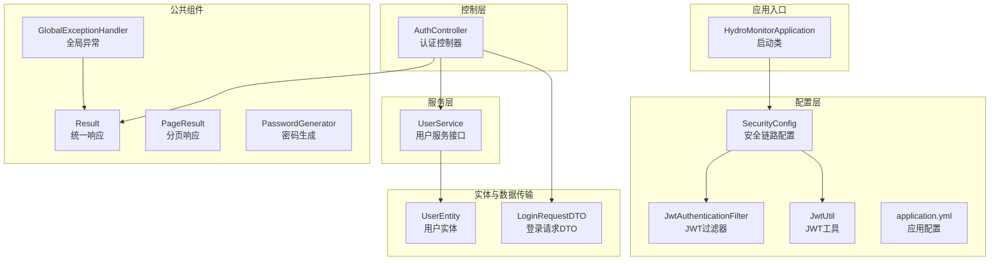
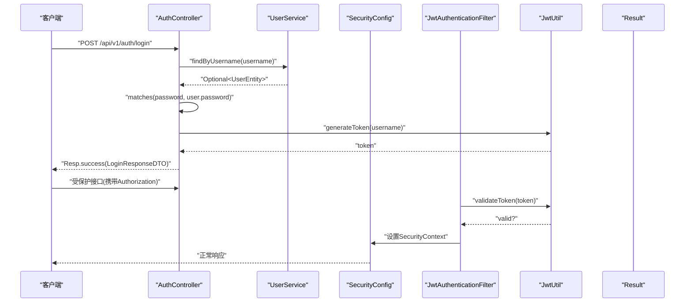
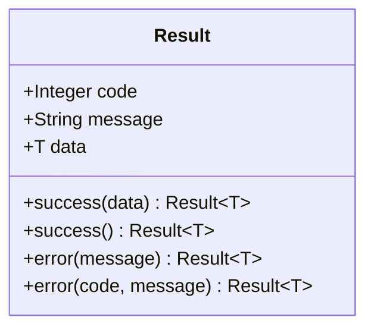
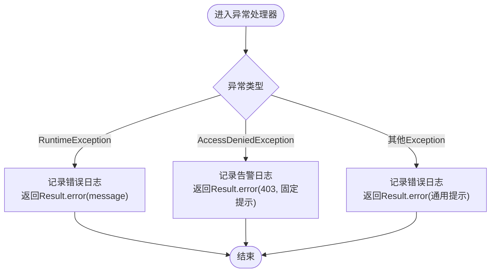
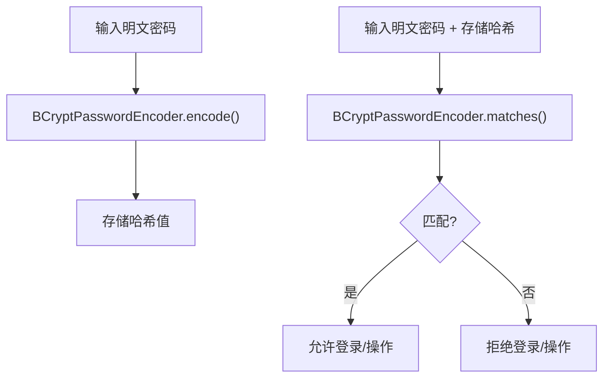
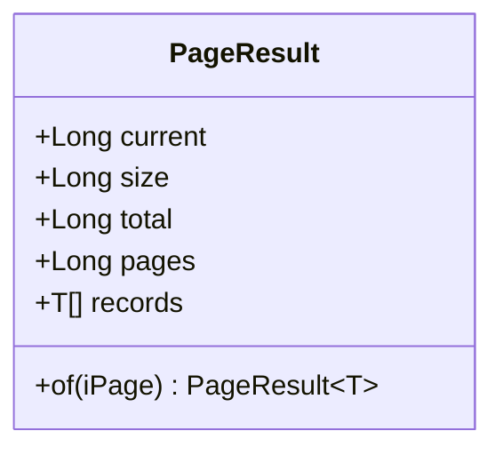
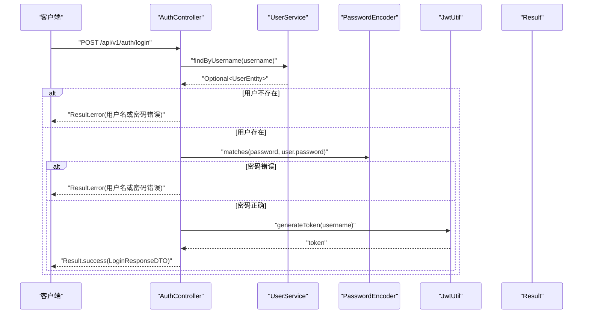
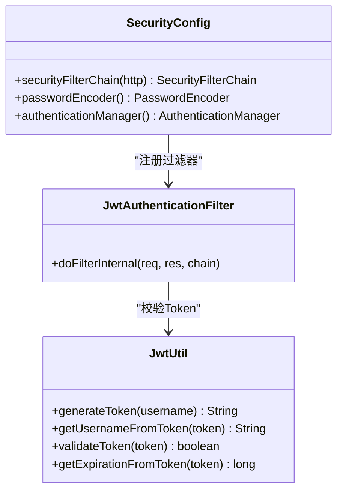
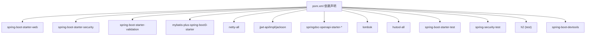

# 代码规范与风格

<cite>
**本文引用的文件**
- [HydroMonitorApplication.java](file://src/main/java/com/hydro/monitor/HydroMonitorApplication.java)
- [Result.java](file://src/main/java/com/hydro/monitor/common/Result.java)
- [GlobalExceptionHandler.java](file://src/main/java/com/hydro/monitor/common/GlobalExceptionHandler.java)
- [PasswordGenerator.java](file://src/main/java/com/hydro/monitor/common/PasswordGenerator.java)
- [PageResult.java](file://src/main/java/com/hydro/monitor/common/PageResult.java)
- [AuthController.java](file://src/main/java/com/hydro/monitor/modules/controller/AuthController.java)
- [SecurityConfig.java](file://src/main/java/com/hydro/monitor/config/security/SecurityConfig.java)
- [JwtUtil.java](file://src/main/java/com/hydro/monitor/config/security/JwtUtil.java)
- [JwtAuthenticationFilter.java](file://src/main/java/com/hydro/monitor/config/security/JwtAuthenticationFilter.java)
- [UserService.java](file://src/main/java/com/hydro/monitor/modules/service/UserService.java)
- [UserEntity.java](file://src/main/java/com/hydro/monitor/modules/entity/UserEntity.java)
- [LoginRequestDTO.java](file://src/main/java/com/hydro/monitor/modules/dto/LoginRequestDTO.java)
- [application.yml](file://src/main/resources/application.yml)
- [pom.xml](file://pom.xml)
- [README.md](file://README.md)
</cite>

## 目录
1. [引言](#引言)
2. [项目结构](#项目结构)
3. [核心组件](#核心组件)
4. [架构总览](#架构总览)
5. [详细组件分析](#详细组件分析)
6. [依赖分析](#依赖分析)
7. [性能考量](#性能考量)
8. [故障排查指南](#故障排查指南)
9. [结论](#结论)
10. [附录](#附录)

## 引言
本指南面向水文监测系统的Java开发团队，旨在建立统一的代码规范与风格，涵盖命名约定、类与方法设计原则、注释规范、代码格式化标准；明确Result统一响应类的使用规范与最佳实践；阐述GlobalExceptionHandler全局异常处理的设计理念与使用方法；说明PasswordGenerator密码生成工具的使用场景与安全考虑；给出Lombok注解的正确使用方式与注意事项；提供代码审查检查清单、重构指导原则与性能优化建议；最后总结Spring框架的最佳实践与常见反模式。

## 项目结构
系统采用分层架构与模块化组织，主要目录与职责如下：
- common：公共组件（统一响应、分页、全局异常、密码生成等）
- config：配置类（安全、MyBatis-Plus、OpenAPI、Netty、仿真）
- modules：业务模块（controller、service、mapper、entity、dto、vo）
- netty：Netty协议编解码与服务端集成
- simulation：终端模拟上报
- resources：配置文件与数据库脚本

图表来源
- [HydroMonitorApplication.java:12-34](file://src/main/java/com/hydro/monitor/HydroMonitorApplication.java#L12-L34)
- [SecurityConfig.java:33-74](file://src/main/java/com/hydro/monitor/config/security/SecurityConfig.java#L33-L74)
- [JwtUtil.java:37-48](file://src/main/java/com/hydro/monitor/config/security/JwtUtil.java#L37-L48)
- [JwtAuthenticationFilter.java:34-59](file://src/main/java/com/hydro/monitor/config/security/JwtAuthenticationFilter.java#L34-L59)
- [AuthController.java:41-66](file://src/main/java/com/hydro/monitor/modules/controller/AuthController.java#L41-L66)
- [UserService.java:17-73](file://src/main/java/com/hydro/monitor/modules/service/UserService.java#L17-L73)
- [UserEntity.java:15-69](file://src/main/java/com/hydro/monitor/modules/entity/UserEntity.java#L15-L69)
- [LoginRequestDTO.java:8-19](file://src/main/java/com/hydro/monitor/modules/dto/LoginRequestDTO.java#L8-L19)
- [Result.java:35-77](file://src/main/java/com/hydro/monitor/common/Result.java#L35-L77)
- [PageResult.java:48-56](file://src/main/java/com/hydro/monitor/common/PageResult.java#L48-L56)
- [GlobalExceptionHandler.java:25-56](file://src/main/java/com/hydro/monitor/common/GlobalExceptionHandler.java#L25-L56)
- [PasswordGenerator.java:22-35](file://src/main/java/com/hydro/monitor/common/PasswordGenerator.java#L22-L35)

章节来源
- [README.md:85-106](file://README.md#L85-L106)
- [application.yml:1-86](file://src/main/resources/application.yml#L1-L86)

## 核心组件
本节聚焦统一响应、全局异常、密码生成与分页响应四大公共组件，阐明其设计目标、使用规范与最佳实践。

- 统一响应 Result
  - 设计目标：标准化所有HTTP接口的响应结构，统一状态码、消息与数据载体，便于前端与客户端消费。
  - 使用规范：
    - 成功响应：优先使用带数据的success(data)，无数据时使用无参success()。
    - 失败响应：优先使用error(message)；若需自定义状态码，使用error(code, message)。
    - 控制器返回：始终返回Result<T>或Result<Void>，避免直接返回业务对象或异常。
  - 最佳实践：
    - 将业务异常转化为Result.error(...)，不要抛出未捕获异常。
    - 对外暴露的DTO/VO应与Result组合，避免泄露内部实现细节。
    - 在分页场景使用PageResult包装IPage，保持前后端一致的数据结构。

- 全局异常处理 GlobalExceptionHandler
  - 设计理念：集中处理运行时异常、权限拒绝与通用异常，统一输出Result.error(...)，屏蔽底层异常细节。
  - 使用方法：
    - 不要在控制器内重复try-catch并手动构造Result；交由@RestControllerAdvice统一处理。
    - 对于AccessDeniedException，返回403并固定提示“无权访问该资源”。
    - 对于RuntimeException，返回500并输出message；对于其他Exception，返回500并输出通用提示。
  - 最佳实践：
    - 记录日志级别：业务异常记录error，权限异常记录warn，通用异常记录error。
    - 避免向客户端暴露堆栈信息与敏感路径。

- 密码生成 PasswordGenerator
  - 使用场景：仅在初始化用户或迁移旧数据时使用encode(rawPassword)生成BCrypt哈希；运行时验证使用matches(raw, encoded)。
  - 安全考虑：
    - 生产环境必须使用强随机密钥（jwt.secret）与安全的密码策略。
    - 不要在日志中打印明文密码或哈希值；避免在URL或请求体中明文传输密码。
    - 通过BCryptPasswordEncoder进行匹配，不自行实现密码校验逻辑。

- 分页响应 PageResult
  - 设计目标：将MyBatis-Plus的IPage转换为统一的分页响应结构，包含current、size、total、pages与records。
  - 使用规范：调用PageResult.of(iPage)完成转换；在控制器中将PageResult封装进Result.success(...)返回。

章节来源
- [Result.java:35-77](file://src/main/java/com/hydro/monitor/common/Result.java#L35-L77)
- [GlobalExceptionHandler.java:25-56](file://src/main/java/com/hydro/monitor/common/GlobalExceptionHandler.java#L25-L56)
- [PasswordGenerator.java:22-35](file://src/main/java/com/hydro/monitor/common/PasswordGenerator.java#L22-L35)
- [PageResult.java:48-56](file://src/main/java/com/hydro/monitor/common/PageResult.java#L48-L56)

## 架构总览
系统采用Spring Boot + Spring Security + JWT + Netty + MyBatis-Plus的架构，核心交互流程如下：

图表来源
- [AuthController.java:41-66](file://src/main/java/com/hydro/monitor/modules/controller/AuthController.java#L41-L66)
- [UserService.java:48-56](file://src/main/java/com/hydro/monitor/modules/service/UserService.java#L48-L56)
- [SecurityConfig.java:34-52](file://src/main/java/com/hydro/monitor/config/security/SecurityConfig.java#L34-L52)
- [JwtAuthenticationFilter.java:34-59](file://src/main/java/com/hydro/monitor/config/security/JwtAuthenticationFilter.java#L34-L59)
- [JwtUtil.java:37-48](file://src/main/java/com/hydro/monitor/config/security/JwtUtil.java#L37-L48)
- [Result.java:35-77](file://src/main/java/com/hydro/monitor/common/Result.java#L35-L77)

## 详细组件分析

### 统一响应 Result 类
- 结构与职责
  - 字段：code、message、data；泛型承载任意数据类型。
  - 方法：静态工厂方法success(data/无参)、error(message/code,message)。
- 设计要点
  - 使用泛型确保类型安全与序列化一致性。
  - 静态工厂方法减少样板代码，提升可读性。
- 使用建议
  - 控制器层统一返回Result<T>，避免直接返回业务对象。
  - 对外DTO/VO与Result组合，隐藏实体细节。

图表来源
- [Result.java:11-77](file://src/main/java/com/hydro/monitor/common/Result.java#L11-L77)

章节来源
- [Result.java:11-77](file://src/main/java/com/hydro/monitor/common/Result.java#L11-L77)

### 全局异常处理 GlobalExceptionHandler
- 职责边界
  - RuntimeException：返回500并输出message。
  - AccessDeniedException：返回403并固定提示。
  - Exception：返回500并输出通用提示。
- 日志策略
  - 业务异常：log.error(...)
  - 权限异常：log.warn(...)
  - 通用异常：log.error(...)
- 最佳实践
  - 不在业务层try-catch并构造Result；异常上抛，由全局处理器统一处理。
  - 对外不暴露内部异常细节与堆栈。

图表来源
- [GlobalExceptionHandler.java:25-56](file://src/main/java/com/hydro/monitor/common/GlobalExceptionHandler.java#L25-L56)

章节来源
- [GlobalExceptionHandler.java:15-56](file://src/main/java/com/hydro/monitor/common/GlobalExceptionHandler.java#L15-L56)

### 密码生成 PasswordGenerator
- 使用场景
  - 初始化用户：使用encode(rawPassword)生成BCrypt哈希，写入数据库。
  - 运行时校验：使用matches(raw, encoded)比对密码。
- 安全考虑
  - 生产环境务必使用强随机密钥（jwt.secret）。
  - 不在日志中输出明文或哈希；不在URL或请求体中明文传输密码。
  - 使用BCryptPasswordEncoder进行匹配，避免自定义校验逻辑。

图表来源
- [PasswordGenerator.java:22-35](file://src/main/java/com/hydro/monitor/common/PasswordGenerator.java#L22-L35)

章节来源
- [PasswordGenerator.java:12-55](file://src/main/java/com/hydro/monitor/common/PasswordGenerator.java#L12-L55)

### 分页响应 PageResult
- 职责：将MyBatis-Plus的IPage转换为统一的分页响应结构。
- 使用：PageResult.of(iPage)；在控制器中返回Result.success(PageResult)。

图表来源
- [PageResult.java:14-56](file://src/main/java/com/hydro/monitor/common/PageResult.java#L14-L56)

章节来源
- [PageResult.java:14-56](file://src/main/java/com/hydro/monitor/common/PageResult.java#L14-L56)

### 认证控制器 AuthController
- 职责：处理用户登录，校验用户名与密码，签发JWT。
- 流程：
  - 根据用户名查询用户；不存在则返回错误。
  - 使用PasswordEncoder.matches校验密码；不匹配则返回错误。
  - 生成JWT并返回Result.success(...)。
- 最佳实践：
  - 不在控制器中直接操作数据库；通过UserService封装。
  - 使用Lombok注解简化日志与依赖注入。

图表来源
- [AuthController.java:41-66](file://src/main/java/com/hydro/monitor/modules/controller/AuthController.java#L41-L66)
- [UserService.java:48-56](file://src/main/java/com/hydro/monitor/modules/service/UserService.java#L48-L56)
- [JwtUtil.java:37-48](file://src/main/java/com/hydro/monitor/config/security/JwtUtil.java#L37-L48)

章节来源
- [AuthController.java:24-66](file://src/main/java/com/hydro/monitor/modules/controller/AuthController.java#L24-L66)

### 安全配置与JWT
- SecurityConfig
  - 禁用CSRF（使用JWT）
  - 无状态会话（STATELESS）
  - 公开接口与受保护接口的授权规则
  - 注册JwtAuthenticationFilter前置过滤链
  - 提供BCryptPasswordEncoder与AuthenticationManager Bean
- JwtUtil
  - 生成token（含username与过期时间）
  - 解析token、校验有效性、提取过期时间
  - 使用HMAC-SHA密钥签名
- JwtAuthenticationFilter
  - 从Authorization头提取Bearer Token
  - 校验Token并设置SecurityContext

图表来源
- [SecurityConfig.java:34-74](file://src/main/java/com/hydro/monitor/config/security/SecurityConfig.java#L34-L74)
- [JwtUtil.java:37-124](file://src/main/java/com/hydro/monitor/config/security/JwtUtil.java#L37-L124)
- [JwtAuthenticationFilter.java:34-74](file://src/main/java/com/hydro/monitor/config/security/JwtAuthenticationFilter.java#L34-L74)

章节来源
- [SecurityConfig.java:20-76](file://src/main/java/com/hydro/monitor/config/security/SecurityConfig.java#L20-L76)
- [JwtUtil.java:21-125](file://src/main/java/com/hydro/monitor/config/security/JwtUtil.java#L21-L125)
- [JwtAuthenticationFilter.java:24-74](file://src/main/java/com/hydro/monitor/config/security/JwtAuthenticationFilter.java#L24-L74)

## 依赖分析
- Spring Boot 3.5.9：Web、Security、Validation、DevTools、Test、Security-Test、H2
- MyBatis-Plus 3.5.9：Spring Boot 3适配与JSqlParser
- Netty 4.1.118：高性能网络通信
- jjwt 0.12.6：JWT API、实现与Jackson绑定
- SpringDoc OpenAPI 2.8.9：Swagger UI
- Lombok 1.18.36：简化代码生成
- Hutool 5.8.23：常用工具集

图表来源
- [pom.xml:30-153](file://pom.xml#L30-L153)

章节来源
- [pom.xml:21-179](file://pom.xml#L21-L179)

## 性能考量
- 网络层
  - Netty服务端口与线程模型需结合硬件与负载评估；避免阻塞操作，充分利用异步非阻塞。
  - 合理设置心跳与超时，防止连接泄漏。
- 安全层
  - JWT密钥长度与随机性；避免短生命周期令牌频繁刷新。
  - 过滤器链尽量精简，减少每请求开销。
- 数据访问层
  - MyBatis-Plus合理使用分页与条件构造器；避免N+1查询。
  - 启用逻辑删除字段，减少物理删除带来的锁竞争。
- 应用层
  - 控制器只做编排与校验，复杂逻辑下沉至Service；避免在Controller中直接操作数据库。
  - 使用Result统一响应，减少序列化差异导致的性能波动。

## 故障排查指南
- 启动阶段
  - 检查application.yml中的数据库连接、JWT密钥与端口配置。
  - 查看启动日志中DevTools状态与端口信息。
- 认证与授权
  - 登录失败：确认用户名是否存在、密码是否匹配；检查日志中的告警信息。
  - 403权限错误：确认请求头Authorization是否为Bearer Token且有效。
  - 500系统错误：查看全局异常日志，定位具体异常类型。
- 密码相关
  - 密码无法匹配：确认使用BCryptPasswordEncoder.matches进行校验；避免自定义校验逻辑。
  - 初始化用户：使用PasswordGenerator.encode生成哈希后写入数据库。
- 分页与数据
  - 分页数据为空：确认IPage构建与PageResult.of转换是否正确。
  - 字段映射问题：检查MyBatis-Plus驼峰映射与表名注解。

章节来源
- [HydroMonitorApplication.java:18-34](file://src/main/java/com/hydro/monitor/HydroMonitorApplication.java#L18-L34)
- [application.yml:1-86](file://src/main/resources/application.yml#L1-L86)
- [GlobalExceptionHandler.java:25-56](file://src/main/java/com/hydro/monitor/common/GlobalExceptionHandler.java#L25-L56)
- [PasswordGenerator.java:22-35](file://src/main/java/com/hydro/monitor/common/PasswordGenerator.java#L22-L35)

## 结论
本规范以统一响应、全局异常、密码安全与分页结构为核心，辅以Spring安全与JWT认证的最佳实践，形成从架构到实现的完整约束。遵循本指南可显著提升代码一致性、安全性与可维护性，并降低回归风险与运维成本。

## 附录

### Java编码规范与风格
- 命名约定
  - 包名：全部小写，如com.hydro.monitor。
  - 类名：帕斯卡命名，如HydroMonitorApplication、GlobalExceptionHandler。
  - 方法与变量：驼峰命名，如findByUsername、passwordEncoder。
  - 常量：全大写+下划线，如DEFAULT_EXPIRATION。
- 类与方法设计原则
  - 单一职责：每个类专注于一个领域或能力。
  - 依赖倒置：接口驱动，避免直接依赖具体实现。
  - 最小暴露：私有字段、包级可见优于public；必要时使用DTO/VO隔离。
- 注释规范
  - 类注释：说明用途、作者、版本与关键行为。
  - 方法注释：参数、返回值、异常与注意事项。
  - 行内注释：仅在复杂逻辑处说明意图，避免显而易见的注释。
- 代码格式化标准
  - 缩进：4空格；行宽不超过120字符。
  - 空行：方法间空一行；逻辑块间空一行。
  - 导入：按字母顺序排列，通配符导入仅在测试中使用。

### Lombok注解正确使用方式与注意事项
- 常用注解
  - @Data：自动生成getter/setter/toString/equals/hashCode。
  - @RequiredArgsConstructor：生成包含必需字段的构造函数（如final字段）。
  - @Slf4j：生成日志实例。
- 使用建议
  - 避免在DTO/VO上滥用@Data，必要时拆分生成器或使用Record。
  - 在实体类上谨慎使用@Data，避免覆盖业务逻辑。
  - 与Jackson/MyBatis-Plus配合时，注意字段映射与序列化行为。

章节来源
- [Result.java:11](file://src/main/java/com/hydro/monitor/common/Result.java#L11)
- [GlobalExceptionHandler.java:15](file://src/main/java/com/hydro/monitor/common/GlobalExceptionHandler.java#L15)
- [UserEntity.java:15](file://src/main/java/com/hydro/monitor/modules/entity/UserEntity.java#L15)
- [LoginRequestDTO.java:8](file://src/main/java/com/hydro/monitor/modules/dto/LoginRequestDTO.java#L8)

### 代码审查检查清单
- 架构与设计
  - 是否遵循分层与单一职责？
  - 是否存在循环依赖或过度耦合？
  - 是否使用统一响应与全局异常？
- 安全
  - 是否使用BCrypt进行密码存储与校验？
  - 是否正确配置JWT与无状态会话？
  - 是否避免在日志与响应中泄露敏感信息？
- 可维护性
  - 是否使用Lombok简化样板代码？
  - 是否提供清晰的注释与文档？
  - 是否遵循命名约定与格式化标准？
- 性能
  - 是否避免N+1查询与阻塞操作？
  - 是否合理使用分页与缓存？

### 重构指导原则
- 从简单到复杂：先保证功能正确，再优化性能与可读性。
- 逐步替换：将new Record(...)替换为record关键字；逐步移除冗余getter/setter。
- 保持兼容：重构期间确保对外API不变，避免破坏客户端契约。

### Spring框架最佳实践与常见反模式
- 最佳实践
  - 使用@RestControllerAdvice统一异常处理。
  - 使用@Bean提供PasswordEncoder与AuthenticationManager。
  - 使用OncePerRequestFilter实现JWT过滤器。
  - 使用@Value注入配置，避免硬编码。
- 常见反模式
  - 在Controller中直接操作数据库或执行复杂业务逻辑。
  - 在Service中直接处理HTTP请求与响应。
  - 在全局异常中吞掉异常而不记录日志。
  - 直接使用明文密码或自定义加密方案。