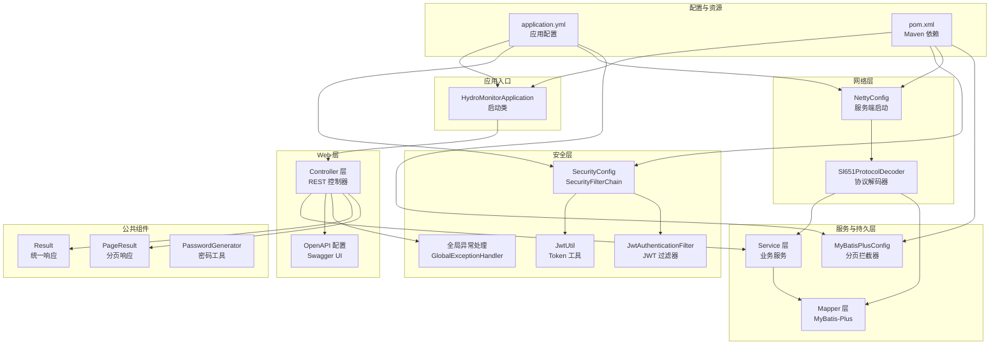
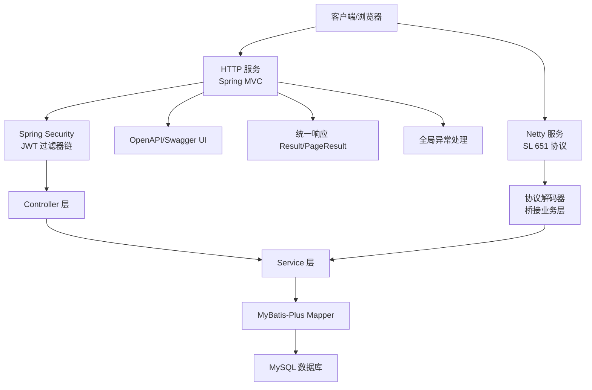
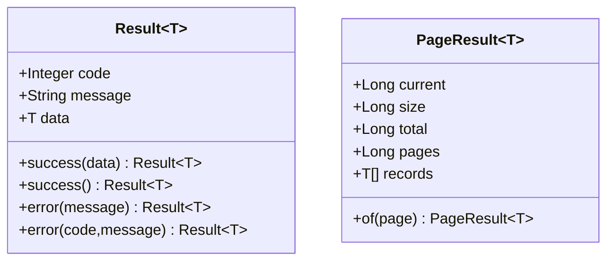
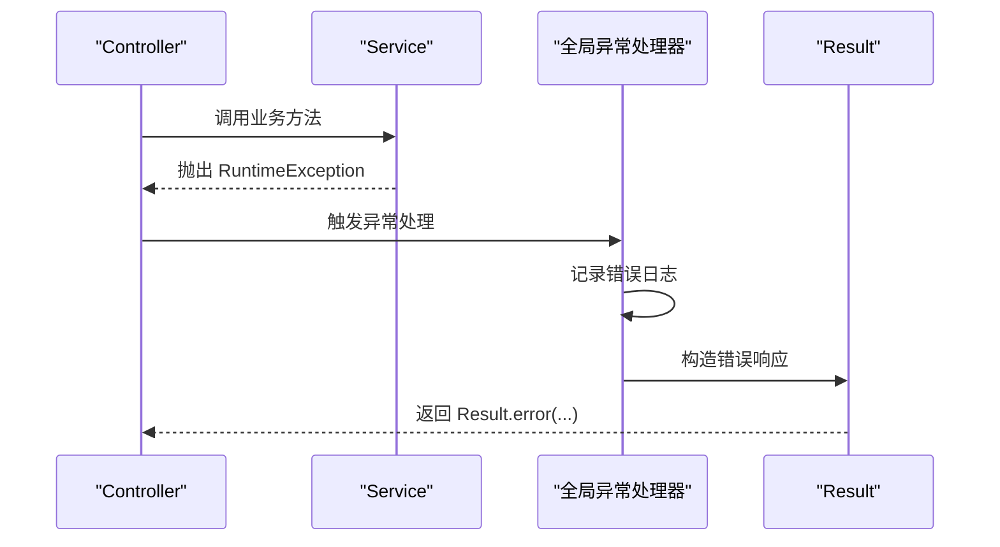
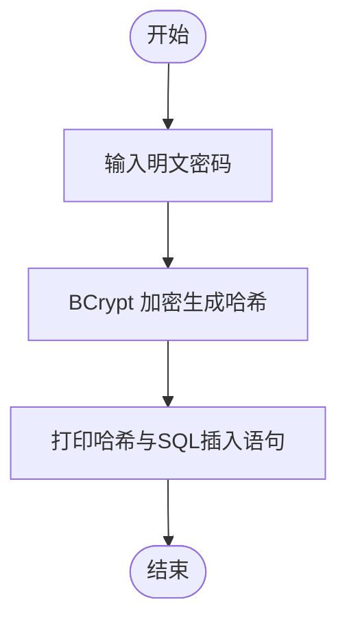
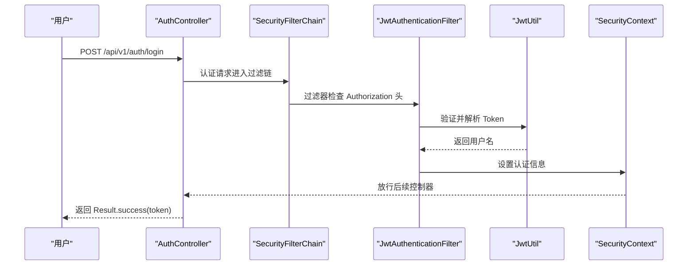
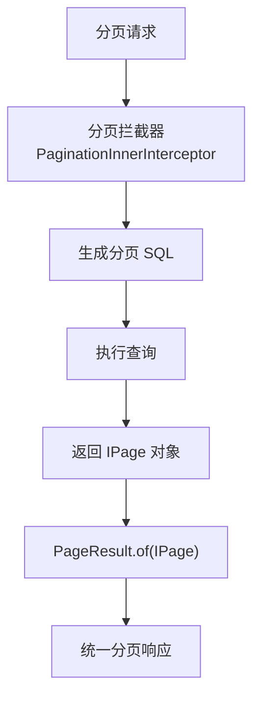
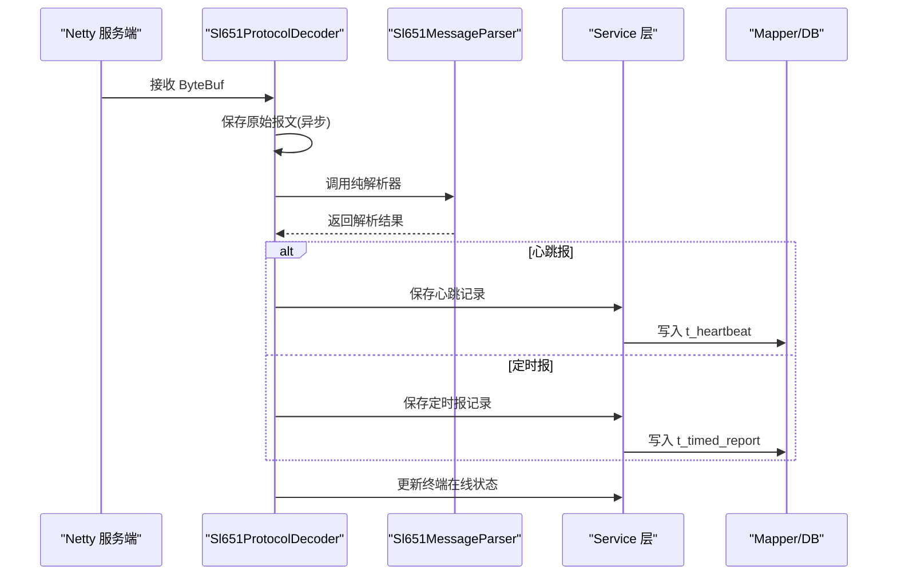
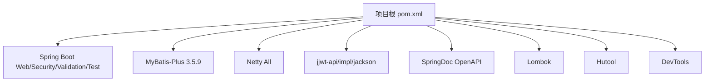

# 开发指南

<cite>
**本文引用的文件**   
- [README.md](file://README.md)
- [DEVELOPER_GUIDE.md](file://DEVELOPER_GUIDE.md)
- [HydroMonitorApplication.java](file://src/main/java/com/hydro/monitor/HydroMonitorApplication.java)
- [application.yml](file://src/main/resources/application.yml)
- [pom.xml](file://pom.xml)
- [Result.java](file://src/main/java/com/hydro/monitor/common/Result.java)
- [PageResult.java](file://src/main/java/com/hydro/monitor/common/PageResult.java)
- [GlobalExceptionHandler.java](file://src/main/java/com/hydro/monitor/common/GlobalExceptionHandler.java)
- [PasswordGenerator.java](file://src/main/java/com/hydro/monitor/common/PasswordGenerator.java)
- [SecurityConfig.java](file://src/main/java/com/hydro/monitor/config/security/SecurityConfig.java)
- [JwtUtil.java](file://src/main/java/com/hydro/monitor/config/security/JwtUtil.java)
- [JwtAuthenticationFilter.java](file://src/main/java/com/hydro/monitor/config/security/JwtAuthenticationFilter.java)
- [MyBatisPlusConfig.java](file://src/main/java/com/hydro/monitor/config/MyBatisPlusConfig.java)
- [NettyConfig.java](file://src/main/java/com/hydro/monitor/config/NettyConfig.java)
- [OpenApiConfig.java](file://src/main/java/com/hydro/monitor/config/OpenApiConfig.java)
- [Sl651ProtocolDecoder.java](file://src/main/java/com/hydro/monitor/netty/Sl651ProtocolDecoder.java)
- [SimulationDataGenerator.java](file://src/main/java/com/hydro/monitor/simulation/SimulationDataGenerator.java)
- [PasswordGeneratorTest.java](file://src/test/java/com/hydro/monitor/common/PasswordGeneratorTest.java)
- [JwtUtilTest.java](file://src/test/java/com/hydro/monitor/config/security/JwtUtilTest.java)
</cite>

## 目录
1. [简介](#简介)
2. [项目结构](#项目结构)
3. [核心组件](#核心组件)
4. [架构总览](#架构总览)
5. [详细组件分析](#详细组件分析)
6. [依赖分析](#依赖分析)
7. [性能考虑](#性能考虑)
8. [故障排查指南](#故障排查指南)
9. [结论](#结论)
10. [附录](#附录)

## 简介
本指南面向参与水文监测系统开发的工程师，系统阐述开发规范、代码风格与最佳实践；详解公共组件（统一响应封装、全局异常处理、密码生成工具）的设计思路与使用方法；给出开发环境搭建、IDE 配置与调试技巧；明确代码审查标准、单元测试编写与文档维护规范；提供新功能开发流程、分支管理策略与版本控制最佳实践；解释性能优化、内存管理与并发处理策略；并推荐开发工具与插件配置，帮助提升开发效率。

## 项目结构
项目采用基于模块的分层组织方式，核心目录与职责如下：
- config：集中配置类，包括安全、MyBatis-Plus、Netty、OpenAPI 等
- common：公共组件（统一响应、分页、全局异常、密码工具）
- modules：业务模块（controller、service、mapper、entity、dto、vo）
- netty：Netty 协议解码与处理链路
- simulation：终端模拟模块（数据生成、报文构建、调度与客户端）
- resources：数据库脚本与应用配置
- test：单元测试与集成测试

图表来源
- [HydroMonitorApplication.java:1-36](file://src/main/java/com/hydro/monitor/HydroMonitorApplication.java#L1-L36)
- [OpenApiConfig.java:1-52](file://src/main/java/com/hydro/monitor/config/OpenApiConfig.java#L1-L52)
- [SecurityConfig.java:1-76](file://src/main/java/com/hydro/monitor/config/security/SecurityConfig.java#L1-L76)
- [JwtUtil.java:1-126](file://src/main/java/com/hydro/monitor/config/security/JwtUtil.java#L1-L126)
- [JwtAuthenticationFilter.java:1-75](file://src/main/java/com/hydro/monitor/config/security/JwtAuthenticationFilter.java#L1-L75)
- [GlobalExceptionHandler.java:1-58](file://src/main/java/com/hydro/monitor/common/GlobalExceptionHandler.java#L1-L58)
- [Result.java:1-79](file://src/main/java/com/hydro/monitor/common/Result.java#L1-L79)
- [PageResult.java:1-58](file://src/main/java/com/hydro/monitor/common/PageResult.java#L1-L58)
- [PasswordGenerator.java:1-55](file://src/main/java/com/hydro/monitor/common/PasswordGenerator.java#L1-L55)
- [MyBatisPlusConfig.java:1-39](file://src/main/java/com/hydro/monitor/config/MyBatisPlusConfig.java#L1-L39)
- [NettyConfig.java:1-87](file://src/main/java/com/hydro/monitor/config/NettyConfig.java#L1-L87)
- [Sl651ProtocolDecoder.java:1-278](file://src/main/java/com/hydro/monitor/netty/Sl651ProtocolDecoder.java#L1-L278)
- [application.yml:1-86](file://src/main/resources/application.yml#L1-L86)
- [pom.xml:1-179](file://pom.xml#L1-L179)

章节来源
- [README.md:85-106](file://README.md#L85-L106)
- [DEVELOPER_GUIDE.md:85-142](file://DEVELOPER_GUIDE.md#L85-L142)

## 核心组件
- 统一响应封装：Result<T> 提供成功/失败两种返回形式，简化前端统一处理
- 分页响应封装：PageResult<T> 将 MyBatis-Plus 分页对象转换为统一分页结构
- 全局异常处理：统一捕获运行时异常、权限拒绝与通用异常，返回标准化错误响应
- 密码生成工具：基于 BCrypt 的加密与匹配工具，支持命令行生成 SQL 插入语句
- 安全与认证：基于 Spring Security 6 的无状态 JWT 认证，过滤器链与密码编码器配置
- 持久层与分页：MyBatis-Plus 分页拦截器，MySQL 适配与最大单页限制
- 网络与协议：Netty 服务端异步启动，SL 651-2014 协议解码器桥接业务层
- OpenAPI 文档：Swagger UI 配置与全局安全方案

章节来源
- [Result.java:1-79](file://src/main/java/com/hydro/monitor/common/Result.java#L1-L79)
- [PageResult.java:1-58](file://src/main/java/com/hydro/monitor/common/PageResult.java#L1-L58)
- [GlobalExceptionHandler.java:1-58](file://src/main/java/com/hydro/monitor/common/GlobalExceptionHandler.java#L1-L58)
- [PasswordGenerator.java:1-55](file://src/main/java/com/hydro/monitor/common/PasswordGenerator.java#L1-L55)
- [SecurityConfig.java:1-76](file://src/main/java/com/hydro/monitor/config/security/SecurityConfig.java#L1-L76)
- [JwtUtil.java:1-126](file://src/main/java/com/hydro/monitor/config/security/JwtUtil.java#L1-L126)
- [JwtAuthenticationFilter.java:1-75](file://src/main/java/com/hydro/monitor/config/security/JwtAuthenticationFilter.java#L1-L75)
- [MyBatisPlusConfig.java:1-39](file://src/main/java/com/hydro/monitor/config/MyBatisPlusConfig.java#L1-L39)
- [NettyConfig.java:1-87](file://src/main/java/com/hydro/monitor/config/NettyConfig.java#L1-L87)
- [OpenApiConfig.java:1-52](file://src/main/java/com/hydro/monitor/config/OpenApiConfig.java#L1-L52)

## 架构总览
系统采用“Web + Netty + 业务服务 + 持久层”的分层架构。HTTP 服务通过 Spring MVC 提供 REST 接口与 Swagger 文档；Netty 服务异步接收 SL 651 协议报文；安全层通过 JWT 无状态认证保护接口；公共组件统一响应与异常处理降低重复代码；MyBatis-Plus 提供高效的数据访问与分页能力。

图表来源
- [HydroMonitorApplication.java:1-36](file://src/main/java/com/hydro/monitor/HydroMonitorApplication.java#L1-L36)
- [SecurityConfig.java:1-76](file://src/main/java/com/hydro/monitor/config/security/SecurityConfig.java#L1-L76)
- [JwtAuthenticationFilter.java:1-75](file://src/main/java/com/hydro/monitor/config/security/JwtAuthenticationFilter.java#L1-L75)
- [Sl651ProtocolDecoder.java:1-278](file://src/main/java/com/hydro/monitor/netty/Sl651ProtocolDecoder.java#L1-L278)
- [OpenApiConfig.java:1-52](file://src/main/java/com/hydro/monitor/config/OpenApiConfig.java#L1-L52)
- [Result.java:1-79](file://src/main/java/com/hydro/monitor/common/Result.java#L1-L79)
- [PageResult.java:1-58](file://src/main/java/com/hydro/monitor/common/PageResult.java#L1-L58)
- [GlobalExceptionHandler.java:1-58](file://src/main/java/com/hydro/monitor/common/GlobalExceptionHandler.java#L1-L58)

## 详细组件分析

### 统一响应与分页封装
- 设计目标：前后端约定统一响应结构，简化错误处理与分页展示
- Result<T>：提供 success(data)、success()、error(message)、error(code,message) 多种静态工厂方法
- PageResult<T>：从 IPage<T> 构建统一分页结构，包含 current、size、total、pages、records

图表来源
- [Result.java:1-79](file://src/main/java/com/hydro/monitor/common/Result.java#L1-L79)
- [PageResult.java:1-58](file://src/main/java/com/hydro/monitor/common/PageResult.java#L1-L58)

章节来源
- [Result.java:1-79](file://src/main/java/com/hydro/monitor/common/Result.java#L1-L79)
- [PageResult.java:1-58](file://src/main/java/com/hydro/monitor/common/PageResult.java#L1-L58)

### 全局异常处理
- 职责：集中捕获运行时异常、权限拒绝与通用异常，返回标准化错误响应
- 返回码策略：业务异常 500，权限拒绝 403，通用异常 500
- 日志记录：对异常进行错误级别日志记录，便于追踪

图表来源
- [GlobalExceptionHandler.java:1-58](file://src/main/java/com/hydro/monitor/common/GlobalExceptionHandler.java#L1-L58)
- [Result.java:1-79](file://src/main/java/com/hydro/monitor/common/Result.java#L1-L79)

章节来源
- [GlobalExceptionHandler.java:1-58](file://src/main/java/com/hydro/monitor/common/GlobalExceptionHandler.java#L1-L58)

### 密码生成工具
- 设计目标：提供 BCrypt 密码加密与匹配能力，支持命令行生成 SQL 插入语句
- 使用场景：用户注册/密码更新时加密存储；登录时匹配验证
- 命令行工具：可直接运行生成指定密码的哈希值与插入语句

图表来源
- [PasswordGenerator.java:1-55](file://src/main/java/com/hydro/monitor/common/PasswordGenerator.java#L1-L55)

章节来源
- [PasswordGenerator.java:1-55](file://src/main/java/com/hydro/monitor/common/PasswordGenerator.java#L1-L55)

### 安全与认证（Spring Security + JWT）
- SecurityFilterChain：禁用 CSRF，无状态 Session，开放认证与文档路径，其余接口需认证
- JwtUtil：生成 Token、解析用户名、验证有效性、获取过期时间
- JwtAuthenticationFilter：从 Authorization 头提取 Bearer Token，验证后写入 SecurityContext
- PasswordEncoder：BCrypt 编码器，DaoAuthenticationProvider 认证提供者

图表来源
- [SecurityConfig.java:1-76](file://src/main/java/com/hydro/monitor/config/security/SecurityConfig.java#L1-L76)
- [JwtAuthenticationFilter.java:1-75](file://src/main/java/com/hydro/monitor/config/security/JwtAuthenticationFilter.java#L1-L75)
- [JwtUtil.java:1-126](file://src/main/java/com/hydro/monitor/config/security/JwtUtil.java#L1-L126)
- [Result.java:1-79](file://src/main/java/com/hydro/monitor/common/Result.java#L1-L79)

章节来源
- [SecurityConfig.java:1-76](file://src/main/java/com/hydro/monitor/config/security/SecurityConfig.java#L1-L76)
- [JwtUtil.java:1-126](file://src/main/java/com/hydro/monitor/config/security/JwtUtil.java#L1-L126)
- [JwtAuthenticationFilter.java:1-75](file://src/main/java/com/hydro/monitor/config/security/JwtAuthenticationFilter.java#L1-L75)

### 持久层与分页（MyBatis-Plus）
- 分页拦截器：配置 PaginationInnerInterceptor，设置 MySQL 适配与最大单页限制
- 雪花算法 ID：全局配置雪花 ID 策略
- 逻辑删除：配置 deleted 字段与逻辑值

图表来源
- [MyBatisPlusConfig.java:1-39](file://src/main/java/com/hydro/monitor/config/MyBatisPlusConfig.java#L1-L39)
- [PageResult.java:1-58](file://src/main/java/com/hydro/monitor/common/PageResult.java#L1-L58)

章节来源
- [MyBatisPlusConfig.java:1-39](file://src/main/java/com/hydro/monitor/config/MyBatisPlusConfig.java#L1-L39)
- [application.yml:22-33](file://src/main/resources/application.yml#L22-L33)

### 网络与协议（Netty + SL 651）
- NettyConfig：CommandLineRunner 启动 Netty 服务端，NIO 事件循环组，优雅停机
- Sl651ProtocolDecoder：接收 ByteBuf → 保存原始报文 → 纯解析器解析 → 持久化 → 更新终端状态
- 线程模型：Netty 线程池处理 I/O，异步保存原始报文避免阻塞

图表来源
- [NettyConfig.java:1-87](file://src/main/java/com/hydro/monitor/config/NettyConfig.java#L1-L87)
- [Sl651ProtocolDecoder.java:1-278](file://src/main/java/com/hydro/monitor/netty/Sl651ProtocolDecoder.java#L1-L278)

章节来源
- [NettyConfig.java:1-87](file://src/main/java/com/hydro/monitor/config/NettyConfig.java#L1-L87)
- [Sl651ProtocolDecoder.java:1-278](file://src/main/java/com/hydro/monitor/netty/Sl651ProtocolDecoder.java#L1-L278)

### 终端模拟模块
- SimulationDataGenerator：根据启用的要素配置生成合理随机数据，支持多种要素类型与精度
- 使用场景：测试、演示、压力测试与开发数据填充
- 生产环境建议：禁用模拟功能，避免数据库膨胀与性能影响

章节来源
- [SimulationDataGenerator.java:1-164](file://src/main/java/com/hydro/monitor/simulation/SimulationDataGenerator.java#L1-L164)
- [application.yml:78-86](file://src/main/resources/application.yml#L78-L86)

## 依赖分析
- 核心框架：Spring Boot 3.5.9、Spring Security 6、MyBatis-Plus 3.5.9、Netty 4.1
- 认证与文档：jjwt 0.12.6、SpringDoc 2.8.9
- 工具库：Lombok 1.18.36、Hutool 5.8.23
- 测试：Spring Boot Starter Test、Spring Security Test、H2 Database

图表来源
- [pom.xml:1-179](file://pom.xml#L1-L179)

章节来源
- [pom.xml:1-179](file://pom.xml#L1-L179)

## 性能考虑
- Netty 异步非阻塞：I/O 与业务处理分离，异步保存原始报文避免阻塞事件循环
- 分页限制：分页拦截器设置最大单页限制，防止超大数据量查询
- 无状态认证：JWT 无状态，减少服务器端会话开销
- 日志与编码：统一日志编码与格式，减少 IO 与解析成本
- 开发热部署：DevTools 支持热加载，提升迭代效率

章节来源
- [Sl651ProtocolDecoder.java:234-249](file://src/main/java/com/hydro/monitor/netty/Sl651ProtocolDecoder.java#L234-L249)
- [MyBatisPlusConfig.java:24-37](file://src/main/java/com/hydro/monitor/config/MyBatisPlusConfig.java#L24-L37)
- [application.yml:34-41](file://src/main/resources/application.yml#L34-L41)

## 故障排查指南
- 端口冲突：8080(HTTP)、9000(Netty)，可通过 netstat 查找并终止占用进程，或修改 application.yml 端口
- 数据库连接失败：确认 MySQL 服务、数据库存在、连接信息正确
- JWT 验证失败：确认 Authorization 头格式为 Bearer Token，Token 未过期
- 分页不生效：确认引入 jsqlparser 依赖并配置分页拦截器

章节来源
- [DEVELOPER_GUIDE.md:743-796](file://DEVELOPER_GUIDE.md#L743-L796)

## 结论
本指南从开发规范、公共组件、安全认证、持久层、网络协议到性能与故障排查，全面覆盖水文监测系统的开发要点。遵循统一响应、分页封装与全局异常处理，结合 Spring Security + JWT 的无状态认证与 Netty 的高性能网络处理，可构建稳定、可扩展且易维护的水文监测平台。

## 附录

### 开发环境搭建与 IDE 配置
- JDK 17、Maven 3.6+、MySQL 8.0+
- application.yml 中配置数据库连接、Jackson 时间格式、MyBatis-Plus、DevTools、Netty、JWT、Swagger、日志
- 启动方式：start-dev.* 脚本或 mvn spring-boot:run

章节来源
- [README.md:20-58](file://README.md#L20-L58)
- [application.yml:1-86](file://src/main/resources/application.yml#L1-L86)

### 代码审查标准
- DTO/VO 使用 record，构造器注入替代 @Autowired
- 时间 API 使用 java.time，日志使用 @Slf4j，禁止 System.out.println
- Controller 统一返回 Result<T>/PageResult<T>
- 分页参数在 DTO compact constructor 中处理默认值
- 时间格式统一 yyyy-MM-dd HH:mm:ss，日志编码 UTF-8

章节来源
- [DEVELOPER_GUIDE.md:605-741](file://DEVELOPER_GUIDE.md#L605-L741)

### 单元测试编写与文档维护
- 测试覆盖：密码工具与 JWT 工具的关键行为
- 测试配置：使用 @ActiveProfiles("test") 与 SpringBootTest
- 文档维护：DEVELOPER_GUIDE.md 作为完整开发文档，README.md 提供快速开始与概览

章节来源
- [PasswordGeneratorTest.java:1-45](file://src/test/java/com/hydro/monitor/common/PasswordGeneratorTest.java#L1-L45)
- [JwtUtilTest.java:1-156](file://src/test/java/com/hydro/monitor/config/security/JwtUtilTest.java#L1-L156)
- [README.md:1-124](file://README.md#L1-L124)
- [DEVELOPER_GUIDE.md:1-23](file://DEVELOPER_GUIDE.md#L1-L23)

### 新功能开发流程与分支管理
- 流程：需求评审 → 设计 DTO/VO/Entity → 编写 Mapper/Service → 实现 Controller → 编写单元测试 → 文档更新 → 提交 PR → 代码审查 → 合并
- 分支策略：主干发布分支 release/*，功能开发 feature/*，热修复 hotfix/*

章节来源
- [DEVELOPER_GUIDE.md:10-22](file://DEVELOPER_GUIDE.md#L10-L22)

### 版本控制最佳实践
- 提交信息：清晰描述变更内容与影响范围
- 标签管理：按版本打标签，记录变更日志
- 依赖升级：统一在 pom.xml 升级，确保兼容性

章节来源
- [pom.xml:1-179](file://pom.xml#L1-L179)

### 开发工具与插件推荐
- IDE：IntelliJ IDEA（启用 Lombok、Spring Assistant、MyBatisX、Swagger）
- 插件：Save Actions、String Manipulation、Rainbow Brackets、SonarLint
- 调试：DevTools 热部署、断点调试、日志级别调整

章节来源
- [application.yml:34-41](file://src/main/resources/application.yml#L34-L41)
- [pom.xml:110-152](file://pom.xml#L110-L152)