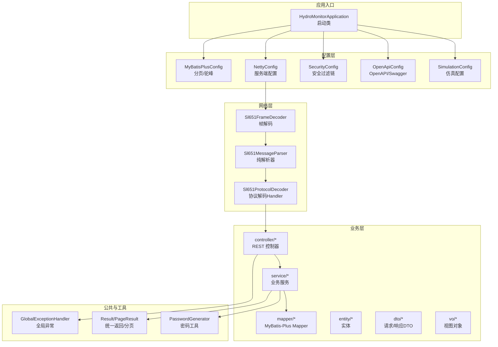
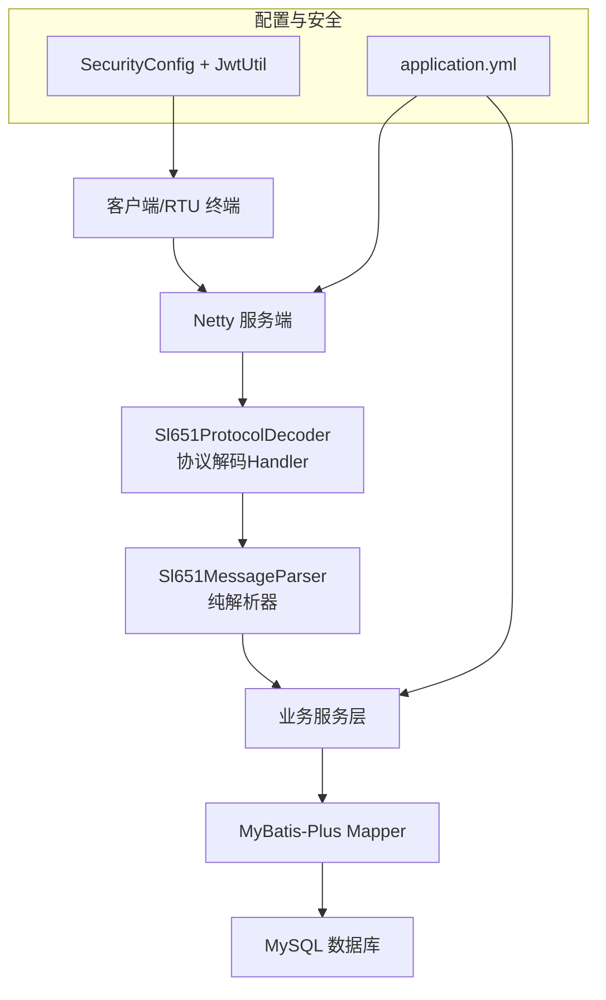
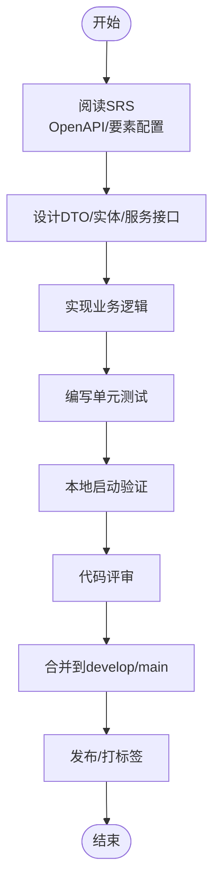
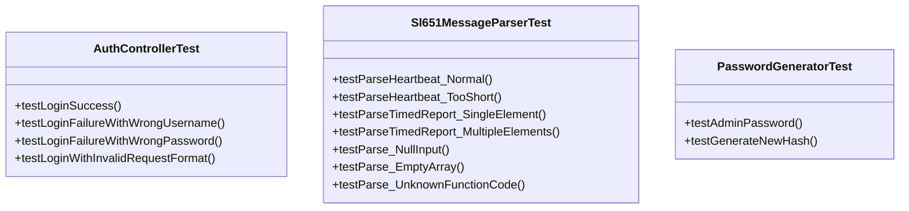
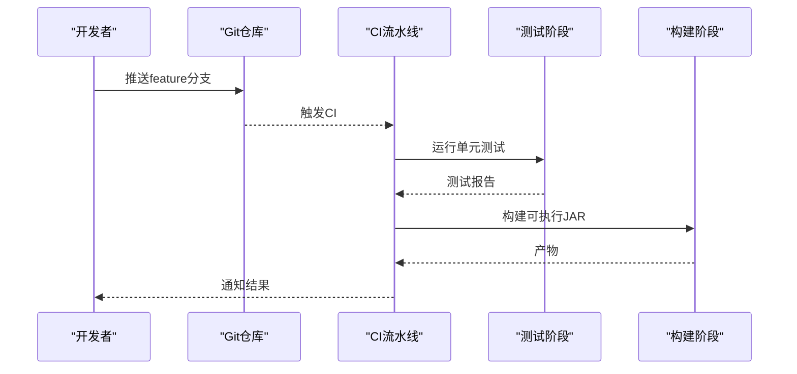
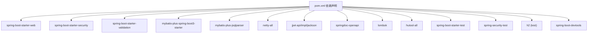
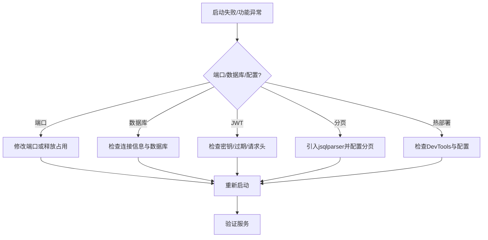

# 开发流程与协作

<cite>
**本文引用的文件**   
- [pom.xml](file://pom.xml)
- [README.md](file://README.md)
- [DEVELOPER_GUIDE.md](file://DEVELOPER_GUIDE.md)
- [.srs/openapi-srs.md](file://.srs/openapi-srs.md)
- [.srs/element-srs.md](file://.srs/element-srs.md)
- [application.yml](file://src/main/resources/application.yml)
- [application-test.yml](file://src/test/resources/application-test.yml)
- [start-dev.bat](file://start-dev.bat)
- [start-dev.sh](file://start-dev.sh)
- [test-hot-reload.bat](file://test-hot-reload.bat)
- [verify-hot-reload.bat](file://verify-hot-reload.bat)
- [DevToolsTestController.java](file://src/main/java/com/hydro/monitor/modules/controller/DevToolsTestController.java)
- [GlobalExceptionHandler.java](file://src/main/java/com/hydro/monitor/common/GlobalExceptionHandler.java)
- [JwtUtil.java](file://src/main/java/com/hydro/monitor/config/security/JwtUtil.java)
- [AuthControllerTest.java](file://src/test/java/com/hydro/monitor/modules/controller/AuthControllerTest.java)
- [Sl651MessageParserTest.java](file://src/test/java/com/hydro/monitor/netty/Sl651MessageParserTest.java)
- [PasswordGeneratorTest.java](file://src/test/java/com/hydro/monitor/common/PasswordGeneratorTest.java)
</cite>

## 目录
1. [引言](#引言)
2. [项目结构](#项目结构)
3. [核心组件](#核心组件)
4. [架构总览](#架构总览)
5. [详细组件分析](#详细组件分析)
6. [依赖分析](#依赖分析)
7. [性能考虑](#性能考虑)
8. [故障排查指南](#故障排查指南)
9. [结论](#结论)
10. [附录](#附录)

## 引言
本文件面向水文监测系统开发团队，系统化梳理从需求到交付的全流程规范，覆盖 Git 工作流、Maven 构建与依赖管理、功能开发标准流程、单元测试与覆盖率、代码评审、持续集成与自动化测试、版本发布与变更日志、以及团队协作与沟通规范。目标是提升协作效率、保障质量与一致性。

## 项目结构
项目采用 Spring Boot 3 + Netty + MyBatis-Plus 的技术栈，模块清晰、层次分明：
- 配置层：MyBatis-Plus、Netty、Security、OpenAPI、仿真配置等
- 网络层：SL 651 协议帧解码、消息解析、协议解码器
- 业务层：控制器、服务、数据传输对象、视图对象、实体与持久层
- 仿真与测试：终端仿真、热部署测试、单元测试与测试配置

图表来源
- [DEVELOPER_GUIDE.md:85-142](file://DEVELOPER_GUIDE.md#L85-L142)
- [application.yml:1-86](file://src/main/resources/application.yml#L1-L86)

章节来源
- [DEVELOPER_GUIDE.md:85-142](file://DEVELOPER_GUIDE.md#L85-L142)
- [README.md:85-106](file://README.md#L85-L106)

## 核心组件
- 统一返回与异常：Result/PageResult 统一响应包装，GlobalExceptionHandler 全局异常处理，确保前后端一致的错误语义。
- 安全与认证：基于 Spring Security 6 + JWT，JwtUtil 提供签发与校验，SecurityConfig 配置过滤链。
- 网络与协议：Netty 服务端 + SL 651 协议解析器，支持心跳与定时报文解析。
- ORM 与分页：MyBatis-Plus + 分页拦截器，配合 jsqlparser 支持复杂查询分页。
- 仿真与测试：终端仿真模块与热部署测试控制器，结合 H2 内存数据库进行测试隔离。

章节来源
- [GlobalExceptionHandler.java:1-58](file://src/main/java/com/hydro/monitor/common/GlobalExceptionHandler.java#L1-L58)
- [JwtUtil.java:1-126](file://src/main/java/com/hydro/monitor/config/security/JwtUtil.java#L1-L126)
- [application.yml:22-32](file://src/main/resources/application.yml#L22-L32)

## 架构总览
系统采用“配置驱动 + 分层架构 + 纯解析器 + 网络解码”的组合，强调可测试性与可扩展性：
- 配置集中于 application.yml，包含数据源、MyBatis-Plus、DevTools、Netty、JWT、OpenAPI、日志与仿真等。
- 控制器层统一返回 Result，服务层通过构造器注入依赖，避免循环依赖与可测试性问题。
- 协议解析器 Sl651MessageParser 无状态、线程安全，便于单元测试与并发处理。

图表来源
- [application.yml:43-86](file://src/main/resources/application.yml#L43-L86)
- [Sl651MessageParserTest.java:19-27](file://src/test/java/com/hydro/monitor/netty/Sl651MessageParserTest.java#L19-L27)

章节来源
- [DEVELOPER_GUIDE.md:68-84](file://DEVELOPER_GUIDE.md#L68-L84)
- [application.yml:1-86](file://src/main/resources/application.yml#L1-L86)

## 详细组件分析

### Git 工作流程与分支策略
- 分支模型
  - main：稳定发布分支，受保护，禁止直接推送。
  - develop：集成分支，合并功能分支后进行集成测试。
  - feature/<name>：功能开发分支，基于 develop 创建，完成后合并回 develop。
  - release/<version>：预发布分支，进行最终验证与打包。
  - hotfix/<name>：线上紧急修复分支，基于 main 创建，修复后同时合并回 develop/main。
- 提交规范
  - 类型：feat、fix、docs、style、refactor、test、chore、perf、ci、revert
  - 格式：type(scope): subject（首字母小写，不超过 100 字符）
  - 示例：feat(controller): 添加用户登录接口
- 合并流程
  - PR 必须通过 CI 与代码评审，冲突需在合并前解决。
  - 合并前需更新变更日志与相关文档。

章节来源
- [DEVELOPER_GUIDE.md:146-239](file://DEVELOPER_GUIDE.md#L146-L239)

### Maven 构建与依赖管理最佳实践
- 版本与属性
  - 使用 Spring Boot Parent 管理版本，集中定义 Java 版本与第三方依赖版本。
  - 依赖分组明确：Web、Security、Validation、MyBatis-Plus、Netty、JWT、OpenAPI、Lombok、Hutool、测试等。
- 插件与构建
  - spring-boot-maven-plugin：打包可执行 JAR，排除 Lombok，设置 JVM UTF-8 参数。
  - DevTools：热部署支持，配合 application.yml 的 devtools 配置。
- 测试与数据库
  - 测试环境使用 H2 内存数据库，application-test.yml 隔离测试配置。
- 依赖升级与锁定
  - 通过属性统一升级版本，避免版本漂移；必要时使用 <dependencyManagement> 锁定关键依赖。

章节来源
- [pom.xml:21-179](file://pom.xml#L21-L179)
- [application-test.yml:1-29](file://src/test/resources/application-test.yml#L1-L29)

### 功能开发标准流程
- 需求分析
  - 依据 SRS 文档（OpenAPI 与要素配置）明确接口与数据模型。
- 设计与建模
  - DTO/VO 使用 record；实体与 Mapper 遵循 MyBatis-Plus 约定；服务层使用构造器注入。
- 实现与测试
  - 先写单元测试，再实现业务逻辑；测试覆盖边界与异常路径。
- 集成与验证
  - 本地启动应用，验证 API 与网络协议解析；使用热部署提升迭代效率。
- 文档与评审
  - 更新接口文档与开发指南；发起代码评审。

章节来源
- [.srs/openapi-srs.md:1-11](file://.srs/openapi-srs.md#L1-L11)
- [.srs/element-srs.md:1-198](file://.srs/element-srs.md#L1-L198)
- [DEVELOPER_GUIDE.md:605-741](file://DEVELOPER_GUIDE.md#L605-L741)

### 单元测试编写规范与覆盖率要求
- 测试组织
  - 控制器测试：WebMvcTest + MockMvc，验证请求/响应与状态码。
  - 协议解析测试：纯解析器无状态、线程安全，适合单元测试。
  - 工具类测试：使用固定输入与断言验证行为。
- 断言与期望
  - 使用 JUnit 5 + Mockito；对异常路径与边界条件进行覆盖。
- 覆盖率
  - 建议关键业务逻辑覆盖率不低于 80%，核心解析器不低于 90%。

图表来源
- [AuthControllerTest.java:27-114](file://src/test/java/com/hydro/monitor/modules/controller/AuthControllerTest.java#L27-L114)
- [Sl651MessageParserTest.java:19-268](file://src/test/java/com/hydro/monitor/netty/Sl651MessageParserTest.java#L19-L268)
- [PasswordGeneratorTest.java:13-45](file://src/test/java/com/hydro/monitor/common/PasswordGeneratorTest.java#L13-L45)

章节来源
- [AuthControllerTest.java:1-114](file://src/test/java/com/hydro/monitor/modules/controller/AuthControllerTest.java#L1-L114)
- [Sl651MessageParserTest.java:1-268](file://src/test/java/com/hydro/monitor/netty/Sl651MessageParserTest.java#L1-L268)
- [PasswordGeneratorTest.java:1-45](file://src/test/java/com/hydro/monitor/common/PasswordGeneratorTest.java#L1-L45)

### 代码审查流程
- 规范检查
  - DTO/VO 使用 record；构造器注入；时间 API 使用 java.time；日志统一使用 SLF4J。
- 安全与健壮性
  - JWT 密钥与过期时间配置；权限控制与异常处理；输入校验与边界检查。
- 可测试性
  - 无状态解析器；Mock 测试；最小化外部依赖。
- 评审清单
  - 是否满足 SRS；是否遵循统一返回与分页；是否具备单元测试；是否更新文档。

章节来源
- [DEVELOPER_GUIDE.md:605-741](file://DEVELOPER_GUIDE.md#L605-L741)
- [GlobalExceptionHandler.java:1-58](file://src/main/java/com/hydro/monitor/common/GlobalExceptionHandler.java#L1-L58)
- [JwtUtil.java:1-126](file://src/main/java/com/hydro/monitor/config/security/JwtUtil.java#L1-L126)

### 持续集成与自动化测试
- CI 配置建议
  - 触发：push 到 feature/release/hotfix；PR 打开/更新。
  - 步骤：安装 JDK 与 Maven；依赖缓存；单元测试；静态分析；构建 JAR。
- 自动化测试
  - 单元测试：mvn test；集成测试：可选（数据库迁移脚本准备）。
- 热部署与验证
  - 使用 DevToolsTestController 验证热部署；start-dev.* 脚本一键启动。

章节来源
- [start-dev.bat:1-28](file://start-dev.bat#L1-L28)
- [start-dev.sh:1-25](file://start-dev.sh#L1-L25)
- [test-hot-reload.bat:1-28](file://test-hot-reload.bat#L1-L28)
- [verify-hot-reload.bat:1-55](file://verify-hot-reload.bat#L1-L55)

### 版本发布与变更日志
- 版本策略
  - 遵循语义化版本（MAJOR.MINOR.PATCH），PATCH 用于修复，MINOR 用于新增兼容功能，MAJOR 用于破坏性变更。
- 发布流程
  - release/<version> 分支：冻结变更，执行回归测试与打包。
  - main 合并：打标签并发布；同步更新 develop。
- 变更日志
  - 记录新增、修复、变更与已知问题；与版本标签关联。

章节来源
- [DEVELOPER_GUIDE.md:146-239](file://DEVELOPER_GUIDE.md#L146-L239)

### 团队协作工具与沟通规范
- 工具
  - Git：分支与 PR 管理；CI：自动化流水线；文档：SRS 与开发指南。
- 沟通
  - 日常站会、需求澄清、评审会议；问题跟踪与知识沉淀。

章节来源
- [.srs/openapi-srs.md:1-11](file://.srs/openapi-srs.md#L1-L11)
- [.srs/element-srs.md:1-198](file://.srs/element-srs.md#L1-L198)
- [DEVELOPER_GUIDE.md:146-239](file://DEVELOPER_GUIDE.md#L146-L239)

## 依赖分析
- 核心依赖
  - Spring Boot Web/Security/Validation/Test：Web 服务与安全基础。
  - MyBatis-Plus 与 jsqlparser：ORM 与分页查询。
  - Netty：高性能网络 I/O。
  - jjwt：JWT 签发与校验。
  - SpringDoc：OpenAPI/Swagger UI。
  - Lombok/Hutool：简化代码与工具类。
  - H2：测试数据库。
- 构建与运行
  - spring-boot-maven-plugin：打包与 JVM 参数（UTF-8）。
  - DevTools：热部署。

图表来源
- [pom.xml:30-153](file://pom.xml#L30-L153)

章节来源
- [pom.xml:21-179](file://pom.xml#L21-L179)

## 性能考虑
- 网络层
  - Netty 异步非阻塞 I/O，合理配置线程池与背压。
- ORM 与查询
  - MyBatis-Plus 分页与 jsqlparser，避免 N+1 查询；索引与 SQL 优化。
- 序列化与时间
  - Jackson 时间格式与时区统一，避免解析开销。
- 仿真与日志
  - 仿真模块仅开发/测试环境启用；日志级别与滚动策略降低 IO 影响。

章节来源
- [application.yml:15-77](file://src/main/resources/application.yml#L15-L77)
- [DEVELOPER_GUIDE.md:514-563](file://DEVELOPER_GUIDE.md#L514-L563)

## 故障排查指南
- 端口占用
  - 8080/9000 端口被占用时，修改 application.yml 或释放端口。
- 数据库连接
  - 检查 MySQL 服务、URL、账号密码与数据库是否存在。
- JWT 验证失败
  - 确认 Authorization 头格式与 Token 未过期；核对密钥与过期时间。
- 分页不生效
  - 确认引入 jsqlparser 依赖并配置分页拦截器。
- 热部署无效
  - 使用 verify-hot-reload.bat 与 test-hot-reload.bat 检查 DevTools 与配置。

章节来源
- [DEVELOPER_GUIDE.md:743-800](file://DEVELOPER_GUIDE.md#L743-L800)
- [verify-hot-reload.bat:1-55](file://verify-hot-reload.bat#L1-L55)
- [test-hot-reload.bat:1-28](file://test-hot-reload.bat#L1-L28)

## 结论
通过规范化的 Git 工作流、Maven 构建与依赖管理、严格的单元测试与评审流程、完善的 CI/CD 与发布机制，以及清晰的协作与沟通规范，团队能够在保证质量的前提下高效交付水文监测系统功能，持续演进并保持向后兼容性。

## 附录
- 快速启动与验证
  - 初始化数据库与配置；使用 start-dev.* 启动；访问 Swagger UI 与 Netty 端口。
- SRS 与 API
  - OpenAPI 与要素配置 SRS 明确接口与数据模型，作为开发与测试依据。

章节来源
- [README.md:20-64](file://README.md#L20-L64)
- [.srs/openapi-srs.md:6-11](file://.srs/openapi-srs.md#L6-L11)
- [.srs/element-srs.md:108-198](file://.srs/element-srs.md#L108-L198)