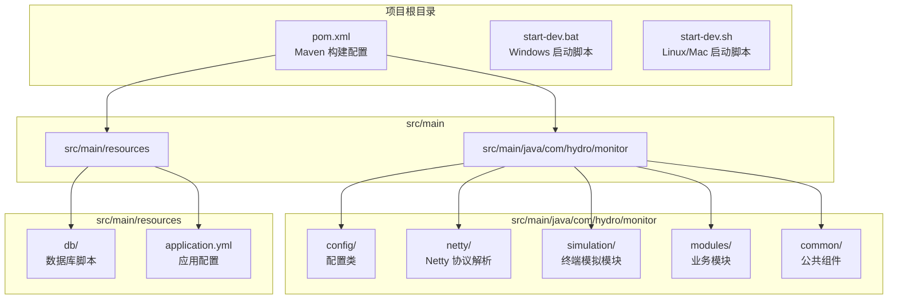
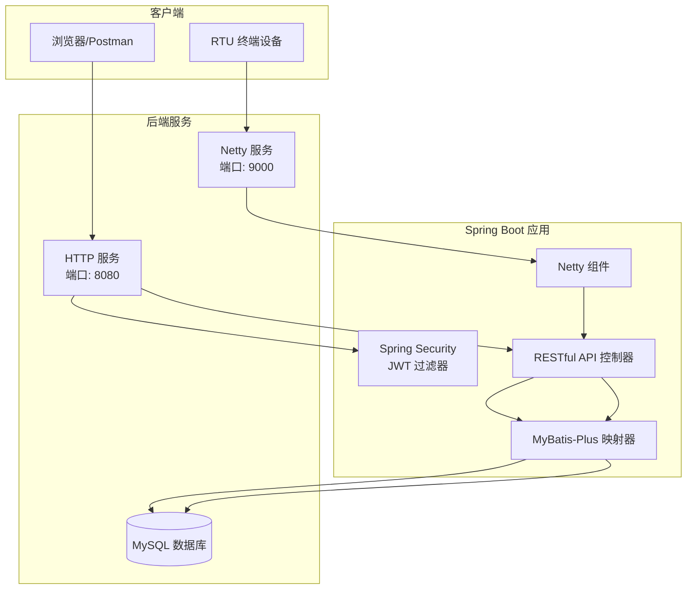
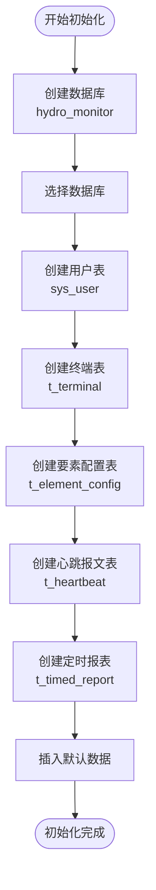
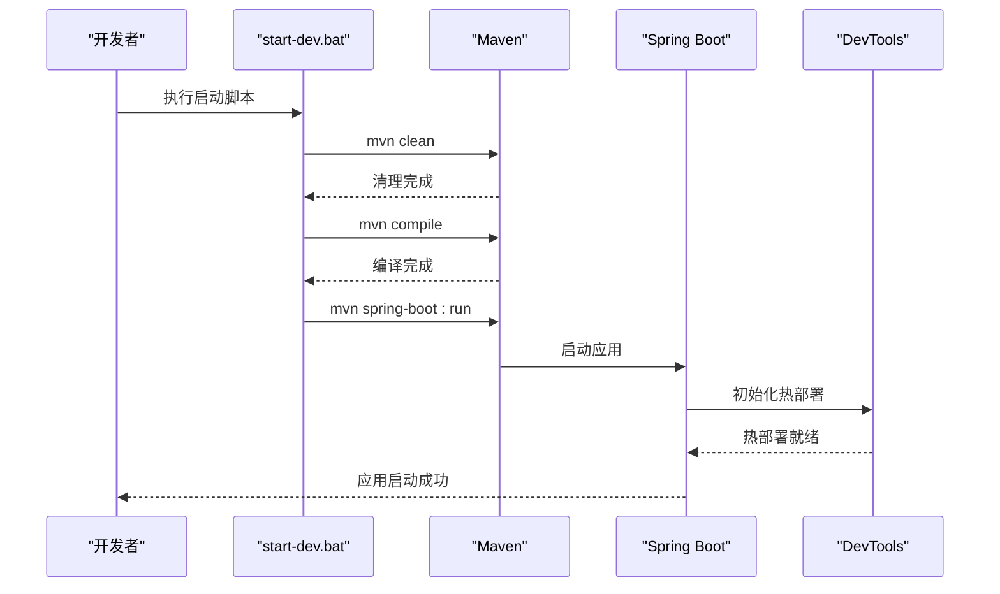
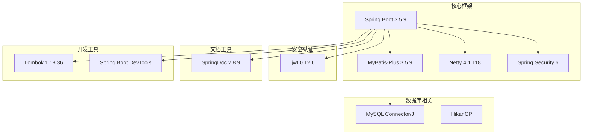

# 开发环境搭建

<cite>
**本文引用的文件列表**
- [README.md](file://README.md)
- [DEVELOPER_GUIDE.md](file://DEVELOPER_GUIDE.md)
- [pom.xml](file://pom.xml)
- [application.yml](file://src/main/resources/application.yml)
- [init.sql](file://src/main/resources/db/init.sql)
- [HydroMonitorApplication.java](file://src/main/java/com/hydro/monitor/HydroMonitorApplication.java)
- [SecurityConfig.java](file://src/main/java/com/hydro/monitor/config/security/SecurityConfig.java)
- [NettyConfig.java](file://src/main/java/com/hydro/monitor/config/NettyConfig.java)
- [OpenApiConfig.java](file://src/main/java/com/hydro/monitor/config/OpenApiConfig.java)
- [start-dev.bat](file://start-dev.bat)
- [start-dev.sh](file://start-dev.sh)
- [application-test.yml](file://src/test/resources/application-test.yml)
</cite>

## 目录
1. [简介](#简介)
2. [项目结构](#项目结构)
3. [核心组件](#核心组件)
4. [架构概览](#架构概览)
5. [详细组件分析](#详细组件分析)
6. [依赖分析](#依赖分析)
7. [性能考虑](#性能考虑)
8. [故障排除指南](#故障排除指南)
9. [结论](#结论)
10. [附录](#附录)

## 简介
本指南面向水文监测系统（Hydro Monitor System）的开发者，提供从零开始搭建开发环境的完整步骤。系统基于 Java 17、Spring Boot 3.5.9、Netty 4.1、Spring Security 6 和 MyBatis-Plus 3.5.9 构建，具备高性能网络服务、JWT 认证、原始报文记录和终端模拟等核心能力。

## 项目结构
项目采用标准的 Maven 多模块结构，主要目录如下：
- src/main/java/com/hydro/monitor：核心源代码
- src/main/resources：资源配置文件（application.yml、数据库脚本）
- src/test：单元测试与集成测试
- 根目录：Maven 构建配置（pom.xml）、启动脚本（start-dev.bat、start-dev.sh）

**图表来源**
- [pom.xml:1-179](file://pom.xml#L1-L179)
- [application.yml:1-86](file://src/main/resources/application.yml#L1-L86)

**章节来源**
- [pom.xml:1-179](file://pom.xml#L1-L179)
- [application.yml:1-86](file://src/main/resources/application.yml#L1-L86)

## 核心组件
- **Spring Boot 应用启动类**：负责应用启动、热部署检测和端口信息输出
- **Spring Security 配置**：基于 SecurityFilterChain 的无状态 JWT 认证
- **Netty 服务配置**：异步非阻塞网络服务，监听 SL 651-2014 协议报文
- **OpenAPI/Swagger 配置**：提供在线 API 文档和安全认证说明
- **数据库初始化脚本**：创建核心表结构和默认数据

**章节来源**
- [HydroMonitorApplication.java:1-36](file://src/main/java/com/hydro/monitor/HydroMonitorApplication.java#L1-L36)
- [SecurityConfig.java:1-76](file://src/main/java/com/hydro/monitor/config/security/SecurityConfig.java#L1-L76)
- [NettyConfig.java:1-87](file://src/main/java/com/hydro/monitor/config/NettyConfig.java#L1-L87)
- [OpenApiConfig.java:1-52](file://src/main/java/com/hydro/monitor/config/OpenApiConfig.java#L1-L52)

## 架构概览
系统采用前后端分离架构，后端提供 RESTful API 和 Netty 网络服务：
- HTTP 服务：Spring Web MVC + Spring Security + JWT
- Netty 服务：SL 651-2014 协议解析与数据接收
- 数据持久化：MyBatis-Plus + MySQL 8.0+
- 文档服务：SpringDoc OpenAPI + Swagger UI

**图表来源**
- [HydroMonitorApplication.java:15-34](file://src/main/java/com/hydro/monitor/HydroMonitorApplication.java#L15-L34)
- [NettyConfig.java:47-70](file://src/main/java/com/hydro/monitor/config/NettyConfig.java#L47-L70)
- [application.yml:1-86](file://src/main/resources/application.yml#L1-L86)

## 详细组件分析

### 开发环境前置要求
- **JDK 17+**：系统要求 Java 17 作为运行时环境
- **Maven 3.6+**：用于项目构建和依赖管理
- **MySQL 8.0+**：关系型数据库，支持 UTF-8mb4 字符集
- **IDE**：推荐 IntelliJ IDEA 或 Eclipse（需支持 Maven 项目）

### 硬件和软件要求
- **操作系统**：Windows 10+/Linux/macOS
- **内存**：建议 4GB+ RAM（开发环境）
- **磁盘空间**：至少 2GB 可用空间
- **网络**：本地回环网络（127.0.0.1）可用

### 数据库初始化步骤
1. **创建数据库**：执行初始化脚本创建 hydro_monitor 数据库
2. **创建核心表**：包含用户表、终端表、要素配置表、心跳报文表、定时报表
3. **插入默认数据**：包含默认管理员用户和要素配置数据
4. **可选：原始报文表**：如需原始报文记录功能，执行迁移脚本

**图表来源**
- [init.sql:1-93](file://src/main/resources/db/init.sql#L1-L93)

**章节来源**
- [init.sql:1-93](file://src/main/resources/db/init.sql#L1-L93)
- [README.md:20-27](file://README.md#L20-L27)

### 项目克隆和依赖安装
1. **克隆项目**：使用 git clone 获取源代码
2. **安装依赖**：执行 mvn clean install 下载所有依赖
3. **验证依赖**：确认关键依赖版本匹配（Spring Boot 3.5.9、Netty 4.1.118、MyBatis-Plus 3.5.9）

### IDE 配置建议
#### IntelliJ IDEA 配置
- **项目导入**：File → Open → 选择 pom.xml
- **JDK 配置**：Project Structure → SDKs → 添加 JDK 17
- **Maven 配置**：Enable Auto-Import
- **插件推荐**：Lombok、MyBatis Log、Rainbow Brackets
- **运行配置**：添加 Maven Run Configuration，命令行参数包含 UTF-8 编码

#### Eclipse 配置
- **项目导入**：Import → Maven → Existing Maven Projects
- **JRE 配置**：右键项目 → Properties → Java Build Path → JRE
- **插件安装**：Marketplace 安装 Lombok 插件
- **编码设置**：Project → Properties → Resource → Text file encoding → UTF-8

### application.yml 配置详解
系统配置分为多个关键部分：

#### 服务器配置
- **HTTP 端口**：默认 8080
- **应用名称**：hydro-monitor

#### 数据源配置
- **驱动类名**：com.mysql.cj.jdbc.Driver
- **数据库 URL**：localhost:3306/hydro_monitor
- **字符集**：UTF-8（useUnicode=true&characterEncoding=utf8）
- **时区**：Asia/Shanghai（serverTimezone=Asia/Shanghai）
- **SSL**：禁用（useSSL=false）

#### Jackson 配置
- **日期格式**：yyyy-MM-dd HH:mm:ss
- **时区**：Asia/Shanghai
- **时间戳**：禁用写入时间戳

#### MyBatis-Plus 配置
- **下划线转驼峰**：开启
- **日志实现**：StdOutImpl（开发环境）
- **雪花算法**：assign_id 主键策略
- **逻辑删除**：deleted 字段，1=已删除，0=未删除

#### DevTools 配置
- **热部署**：启用
- **监听路径**：src/main/java
- **排除路径**：static/**,public/**

#### Netty 配置
- **服务端口**：9000
- **事件循环组**：NioEventLoopGroup
- **SO_BACKLOG**：128
- **SO_KEEPALIVE**：true

#### JWT 配置
- **密钥**：hydro-monitor-secret-key-for-jwt-token-generation-2024
- **过期时间**：24小时（86400000 毫秒）

#### SpringDoc 配置
- **API 文档路径**：/v3/api-docs
- **Swagger UI 路径**：/swagger-ui.html
- **排序方式**：alpha

#### 日志配置
- **根级别**：INFO
- **包级别**：com.hydro.monitor: DEBUG
- **控制台格式**：带时间戳的详细格式
- **文件大小**：10MB
- **保留天数**：30天

#### 终端模拟配置
- **启用状态**：true（开发环境）
- **终端数量**：16
- **上报间隔**：300 秒（5 分钟）
- **中心站地址**：2
- **密码**："a000"
- **分类码**：48

**章节来源**
- [application.yml:1-86](file://src/main/resources/application.yml#L1-L86)
- [application-test.yml:1-29](file://src/test/resources/application-test.yml#L1-L29)

### 启动脚本使用方法
系统提供跨平台启动脚本，支持热部署：

#### Windows 启动脚本（start-dev.bat）

**图表来源**
- [start-dev.bat:1-28](file://start-dev.bat#L1-L28)

#### Linux/Mac 启动脚本（start-dev.sh）
- **权限设置**：chmod +x start-dev.sh
- **执行方式**：./start-dev.sh
- **功能特性**：自动清理、编译和启动，支持热部署

**章节来源**
- [start-dev.bat:1-28](file://start-dev.bat#L1-L28)
- [start-dev.sh:1-25](file://start-dev.sh#L1-L25)

### 开发环境验证步骤
1. **数据库验证**：确认数据库连接正常，表结构完整
2. **HTTP 服务验证**：访问 http://localhost:8080
3. **API 文档验证**：访问 http://localhost:8080/swagger-ui.html
4. **Netty 服务验证**：telnet localhost 9000 或使用协议测试工具
5. **JWT 认证验证**：使用默认账户登录获取 Token
6. **热部署验证**：修改代码后观察控制台自动重启

### 健康检查方法
- **系统状态接口**：GET /api/v1/system/status
- **数据库连接检查**：查看日志中的数据库连接信息
- **Netty 端口检查**：确认端口 9000 监听状态
- **日志检查**：关注 INFO 级别以上的日志输出

**章节来源**
- [HydroMonitorApplication.java:27-34](file://src/main/java/com/hydro/monitor/HydroMonitorApplication.java#L27-L34)

## 依赖分析
系统依赖采用 Maven 管理，核心依赖包括：

**图表来源**
- [pom.xml:30-153](file://pom.xml#L30-L153)

**章节来源**
- [pom.xml:21-28](file://pom.xml#L21-L28)
- [pom.xml:30-153](file://pom.xml#L30-L153)

## 性能考虑
- **Netty 线程池调优**：根据 CPU 核心数调整 boss 和 worker 线程数
- **数据库连接池**：合理配置 HikariCP 连接池大小
- **JVM 参数**：根据服务器内存调整堆大小和垃圾回收策略
- **分页限制**：设置合理的最大页数限制（默认 500）
- **日志级别**：生产环境建议提升日志级别以减少 I/O 压力

## 故障排除指南

### 常见启动问题及解决方案

#### 端口被占用
**症状**：Address already in use: bind
**解决方案**：
1. 查找占用端口的进程：`netstat -ano | findstr :8080` 或 `netstat -ano | findstr :9000`
2. 杀死占用进程：`taskkill /F /PID <PID>`
3. 或修改 application.yml 中的端口配置

#### 数据库连接失败
**症状**：Communications link failure
**解决方案**：
1. 确认 MySQL 服务已启动
2. 检查 application.yml 中的数据库地址、用户名、密码
3. 确认数据库 `hydro_monitor` 已创建

#### JWT Token 验证失败
**症状**：401 Unauthorized
**解决方案**：
1. 确认请求头格式正确：`Authorization: Bearer <token>`
2. 确认 Token 未过期（默认24小时）
3. 重新登录获取新 Token

#### 分页查询不生效
**原因**：MyBatis-Plus 3.5.9 需要额外引入 `mybatis-plus-jsqlparser` 依赖
**解决方案**：
1. 在 pom.xml 中添加 jsqplparser 依赖
2. 配置分页拦截器

#### 日志中文乱码
**解决方案**：
1. 配置日志编码：logging.charset.console/file: UTF-8
2. 在启动脚本中添加 JVM 参数：`-Dfile.encoding=UTF-8 -Dconsole.encoding=UTF-8`
3. 确保 IDE 文件编码设置为 UTF-8

#### Maven 依赖下载失败
**解决方案**：
1. 清理本地仓库缓存：`mvn dependency:purge-local-repository`
2. 重新下载：`mvn clean install`
3. 或配置国内镜像源（阿里云）

#### 热部署不工作
**检查清单**：
- 确认 DevTools 依赖已添加到 pom.xml
- 使用 start-dev.bat/sh 脚本启动应用
- 检查 IDE 自动构建是否启用
- 查看控制台输出确认 DevTools 初始化成功

**章节来源**
- [DEVELOPER_GUIDE.md:743-892](file://DEVELOPER_GUIDE.md#L743-L892)

## 结论
通过本指南，开发者可以顺利完成水文监测系统的开发环境搭建。系统提供了完整的启动脚本、详细的配置说明和全面的故障排除指南。建议在开发环境中启用热部署功能，在生产环境中禁用模拟模块并加强安全配置。

## 附录

### 环境变量配置
如需修改默认配置，可通过环境变量覆盖：
- SPRING_DATASOURCE_URL：数据库连接 URL
- SPRING_DATASOURCE_USERNAME：数据库用户名
- SPRING_DATASOURCE_PASSWORD：数据库密码
- NETTY_SERVER_PORT：Netty 服务端口
- JWT_SECRET：JWT 密钥

### 生产环境部署建议
1. 禁用 DevTools：生产环境不应包含 spring-boot-devtools
2. 启用 HTTPS：配置 SSL 证书
3. 修改 JWT 密钥：使用强随机密钥
4. 数据库优化：创建合适的索引，优化查询性能
5. 日志轮转：配置日志文件大小和保留策略
6. 监控告警：集成 Prometheus + Grafana 监控系统状态
7. 禁用模拟模块：确保 `simulation.enabled: false`

### 性能调优建议
1. Netty 线程池：根据 CPU 核心数调整 boss 和 worker 线程数
2. 数据库连接池：调整 HikariCP 连接池大小
3. JVM 参数：根据服务器内存调整堆大小
4. 分页限制：设置合理的最大页数限制（默认 500）