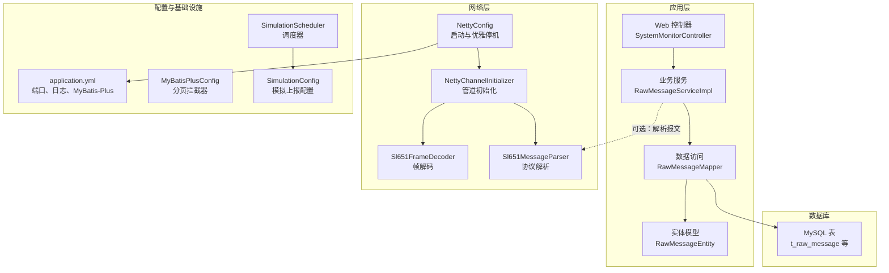
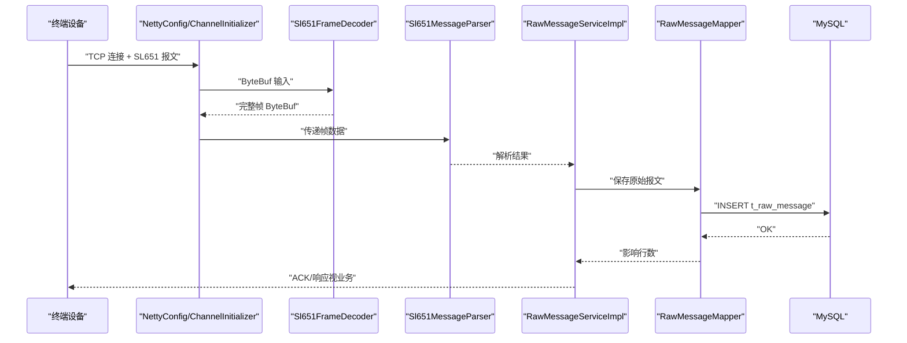
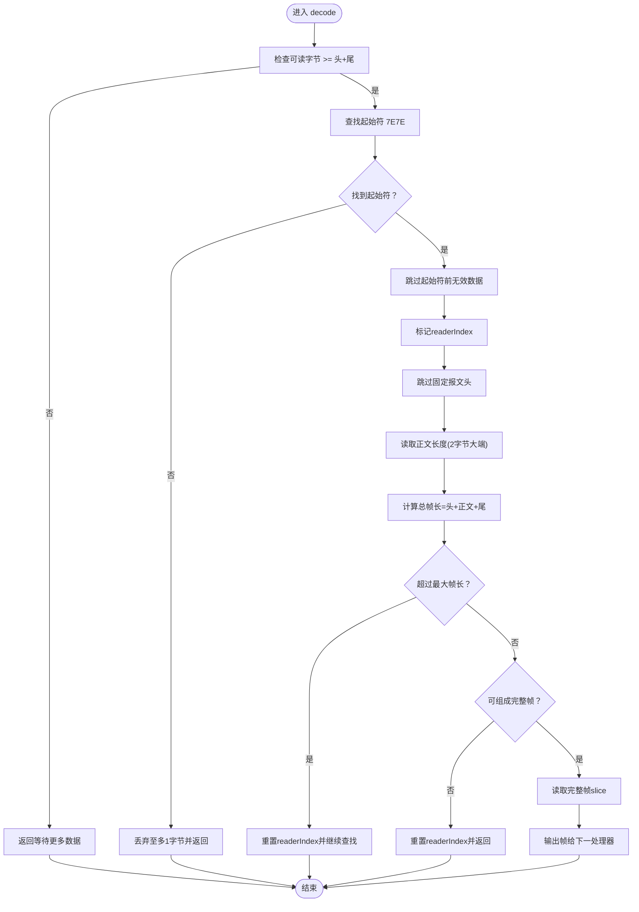
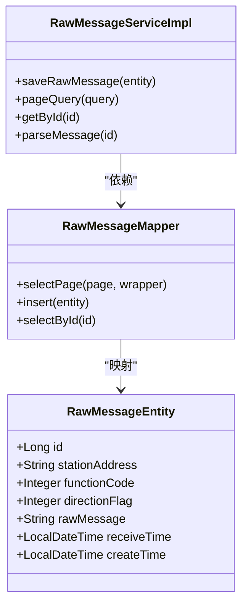
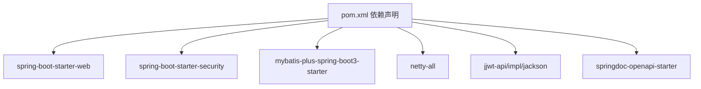

# 性能优化与调试

<cite>
**本文引用的文件**
- [HydroMonitorApplication.java](file://src/main/java/com/hydro/monitor/HydroMonitorApplication.java)
- [application.yml](file://src/main/resources/application.yml)
- [pom.xml](file://pom.xml)
- [NettyConfig.java](file://src/main/java/com/hydro/monitor/config/NettyConfig.java)
- [NettyChannelInitializer.java](file://src/main/java/com/hydro/monitor/config/NettyChannelInitializer.java)
- [Sl651FrameDecoder.java](file://src/main/java/com/hydro/monitor/netty/Sl651FrameDecoder.java)
- [Sl651MessageParser.java](file://src/main/java/com/hydro/monitor/netty/Sl651MessageParser.java)
- [MyBatisPlusConfig.java](file://src/main/java/com/hydro/monitor/config/MyBatisPlusConfig.java)
- [RawMessageMapper.java](file://src/main/java/com/hydro/monitor/modules/mapper/RawMessageMapper.java)
- [RawMessageServiceImpl.java](file://src/main/java/com/hydro/monitor/modules/service/impl/RawMessageServiceImpl.java)
- [RawMessageEntity.java](file://src/main/java/com/hydro/monitor/modules/entity/RawMessageEntity.java)
- [SystemMonitorController.java](file://src/main/java/com/hydro/monitor/modules/controller/SystemMonitorController.java)
- [SimulationConfig.java](file://src/main/java/com/hydro/monitor/config/SimulationConfig.java)
- [SimulationScheduler.java](file://src/main/java/com/hydro/monitor/simulation/SimulationScheduler.java)
- [init.sql](file://src/main/resources/db/init.sql)
</cite>

## 目录
1. [简介](#简介)
2. [项目结构](#项目结构)
3. [核心组件](#核心组件)
4. [架构总览](#架构总览)
5. [详细组件分析](#详细组件分析)
6. [依赖分析](#依赖分析)
7. [性能考虑](#性能考虑)
8. [故障排查指南](#故障排查指南)
9. [结论](#结论)
10. [附录](#附录)

## 简介
本指南面向水文监测系统的性能优化与调试，聚焦以下方面：
- Netty 网络性能优化：线程池配置、缓冲区管理、粘包拆包处理、连接复用策略
- MyBatis-Plus 查询优化：分页拦截器、索引设计、批量入库与序列化开销
- Spring Boot 应用调优：内存与 GC、并发处理、日志与监控
- 系统监控与性能分析工具使用
- Netty 模拟调度器的性能考量与优化
- 常见瓶颈识别与修复：数据库慢查询、网络延迟、内存泄漏等
- 生产环境监控与告警配置建议

## 项目结构
系统采用 Spring Boot 三层结构：Web 控制层、业务服务层、数据访问层；网络接入采用 Netty；协议解析独立于存储。

图表来源
- [NettyConfig.java:47-70](file://src/main/java/com/hydro/monitor/config/NettyConfig.java#L47-L70)
- [NettyChannelInitializer.java:18-34](file://src/main/java/com/hydro/monitor/config/NettyChannelInitializer.java#L18-L34)
- [Sl651FrameDecoder.java:26-100](file://src/main/java/com/hydro/monitor/netty/Sl651FrameDecoder.java#L26-L100)
- [Sl651MessageParser.java:66-126](file://src/main/java/com/hydro/monitor/netty/Sl651MessageParser.java#L66-L126)
- [MyBatisPlusConfig.java:24-37](file://src/main/java/com/hydro/monitor/config/MyBatisPlusConfig.java#L24-L37)
- [RawMessageMapper.java:12-14](file://src/main/java/com/hydro/monitor/modules/mapper/RawMessageMapper.java#L12-L14)
- [RawMessageServiceImpl.java:26-79](file://src/main/java/com/hydro/monitor/modules/service/impl/RawMessageServiceImpl.java#L26-L79)
- [RawMessageEntity.java:16-54](file://src/main/java/com/hydro/monitor/modules/entity/RawMessageEntity.java#L16-L54)
- [application.yml:1-86](file://src/main/resources/application.yml#L1-L86)
- [SimulationConfig.java:16-58](file://src/main/java/com/hydro/monitor/config/SimulationConfig.java#L16-L58)
- [SimulationScheduler.java:32-96](file://src/main/java/com/hydro/monitor/simulation/SimulationScheduler.java#L32-L96)

章节来源
- [HydroMonitorApplication.java:12-35](file://src/main/java/com/hydro/monitor/HydroMonitorApplication.java#L12-L35)
- [application.yml:1-86](file://src/main/resources/application.yml#L1-L86)

## 核心组件
- NettyConfig：异步启动 Netty 服务端，配置 boss/worker 线程组、SO_BACKLOG、SO_KEEPALIVE、日志处理器，提供优雅停机
- NettyChannelInitializer：在 ChannelPipeline 中按序添加帧解码器与协议解析器
- Sl651FrameDecoder：基于起始符与正文长度字段进行帧切分，含最大帧长保护与丢弃策略
- Sl651MessageParser：无状态协议解析器，按功能码分派解析逻辑，输出结构化结果
- MyBatisPlusConfig：注册分页拦截器，设置最大单页限制与溢出策略
- RawMessageServiceImpl：分页查询、保存原始报文、解析报文并转换为 VO
- SystemMonitorController：采集内存、线程数、CPU 使用率等基础指标
- SimulationConfig/SimulationScheduler：模拟上报开关、终端数量、上报间隔与真实 TCP 连接

章节来源
- [NettyConfig.java:26-85](file://src/main/java/com/hydro/monitor/config/NettyConfig.java#L26-L85)
- [NettyChannelInitializer.java:16-35](file://src/main/java/com/hydro/monitor/config/NettyChannelInitializer.java#L16-L35)
- [Sl651FrameDecoder.java:26-120](file://src/main/java/com/hydro/monitor/netty/Sl651FrameDecoder.java#L26-L120)
- [Sl651MessageParser.java:24-126](file://src/main/java/com/hydro/monitor/netty/Sl651MessageParser.java#L24-L126)
- [MyBatisPlusConfig.java:14-38](file://src/main/java/com/hydro/monitor/config/MyBatisPlusConfig.java#L14-L38)
- [RawMessageServiceImpl.java:26-159](file://src/main/java/com/hydro/monitor/modules/service/impl/RawMessageServiceImpl.java#L26-L159)
- [SystemMonitorController.java:27-83](file://src/main/java/com/hydro/monitor/modules/controller/SystemMonitorController.java#L27-L83)
- [SimulationConfig.java:14-58](file://src/main/java/com/hydro/monitor/config/SimulationConfig.java#L14-L58)
- [SimulationScheduler.java:32-135](file://src/main/java/com/hydro/monitor/simulation/SimulationScheduler.java#L32-L135)

## 架构总览
系统采用“Web + Netty 并行接入”的双通道架构：HTTP 用于管理与监控，Netty 用于高频实时报文接入。协议解析器与存储解耦，便于扩展与优化。

图表来源
- [NettyConfig.java:47-70](file://src/main/java/com/hydro/monitor/config/NettyConfig.java#L47-L70)
- [NettyChannelInitializer.java:18-34](file://src/main/java/com/hydro/monitor/config/NettyChannelInitializer.java#L18-L34)
- [Sl651FrameDecoder.java:37-100](file://src/main/java/com/hydro/monitor/netty/Sl651FrameDecoder.java#L37-L100)
- [Sl651MessageParser.java:66-126](file://src/main/java/com/hydro/monitor/netty/Sl651MessageParser.java#L66-L126)
- [RawMessageServiceImpl.java:32-52](file://src/main/java/com/hydro/monitor/modules/service/impl/RawMessageServiceImpl.java#L32-L52)
- [RawMessageMapper.java:12-14](file://src/main/java/com/hydro/monitor/modules/mapper/RawMessageMapper.java#L12-L14)

## 详细组件分析

### Netty 网络性能优化
- 线程池配置
  - bossGroup：1 个线程，负责接受新连接
  - workerGroup：默认线程数，推荐根据 CPU 核心数与并发连接数调整
  - 参考路径：[NettyConfig.java:48-49](file://src/main/java/com/hydro/monitor/config/NettyConfig.java#L48-L49)
- 连接参数
  - SO_BACKLOG：队列长度，建议结合预期并发与系统资源评估
  - SO_KEEPALIVE：保活开启，降低僵尸连接占用
  - 参考路径：[NettyConfig.java:55-56](file://src/main/java/com/hydro/monitor/config/NettyConfig.java#L55-L56)
- 管道处理器
  - 帧解码器优先，确保后续解析只处理完整帧
  - 可按需启用日志处理器进行调试
  - 参考路径：[NettyChannelInitializer.java:18-34](file://src/main/java/com/hydro/monitor/config/NettyChannelInitializer.java#L18-L34)
- 缓冲区管理
  - Sl651FrameDecoder 采用 ByteBuf.slice/readRetainedSlice，避免复制，减少 GC 压力
  - 设置最大帧长，防止异常帧导致内存暴涨
  - 参考路径：[Sl651FrameDecoder.java:28-35](file://src/main/java/com/hydro/monitor/netty/Sl651FrameDecoder.java#L28-L35)
- 连接复用策略
  - 建议客户端侧复用 TCP 连接，避免频繁握手
  - 服务端侧合理设置 SO_TIMEOUT 与 IdleStateHandler（如需）
  - 参考路径：[NettyConfig.java](file://src/main/java/com/hydro/monitor/config/NettyConfig.java#L8)

图表来源
- [Sl651FrameDecoder.java:37-100](file://src/main/java/com/hydro/monitor/netty/Sl651FrameDecoder.java#L37-L100)

章节来源
- [NettyConfig.java:26-85](file://src/main/java/com/hydro/monitor/config/NettyConfig.java#L26-L85)
- [NettyChannelInitializer.java:16-35](file://src/main/java/com/hydro/monitor/config/NettyChannelInitializer.java#L16-L35)
- [Sl651FrameDecoder.java:26-120](file://src/main/java/com/hydro/monitor/netty/Sl651FrameDecoder.java#L26-L120)

### MyBatis-Plus 查询优化
- 分页拦截器
  - 注册 PaginationInnerInterceptor，设置最大单页限制与溢出策略
  - 参考路径：[MyBatisPlusConfig.java:24-37](file://src/main/java/com/hydro/monitor/config/MyBatisPlusConfig.java#L24-L37)
- 查询与排序
  - RawMessageServiceImpl 使用 LambdaQueryWrapper 构建条件并按接收时间倒序
  - 建议对 station_address、receive_time 等常用过滤与排序字段建立索引
  - 参考路径：[RawMessageServiceImpl.java:55-79](file://src/main/java/com/hydro/monitor/modules/service/impl/RawMessageServiceImpl.java#L55-L79)
- 实体与表结构
  - RawMessageEntity 映射 t_raw_message，包含 station_address、functionCode、directionFlag、receiveTime 等
  - 参考路径：[RawMessageEntity.java:16-54](file://src/main/java/com/hydro/monitor/modules/entity/RawMessageEntity.java#L16-L54)
- 索引设计建议
  - t_raw_message 建议索引：station_address、receive_time、functionCode
  - 参考路径：[init.sql:1-93](file://src/main/resources/db/init.sql#L1-L93)

图表来源
- [RawMessageEntity.java:16-54](file://src/main/java/com/hydro/monitor/modules/entity/RawMessageEntity.java#L16-L54)
- [RawMessageMapper.java:12-14](file://src/main/java/com/hydro/monitor/modules/mapper/RawMessageMapper.java#L12-L14)
- [RawMessageServiceImpl.java:26-159](file://src/main/java/com/hydro/monitor/modules/service/impl/RawMessageServiceImpl.java#L26-L159)

章节来源
- [MyBatisPlusConfig.java:14-38](file://src/main/java/com/hydro/monitor/config/MyBatisPlusConfig.java#L14-L38)
- [RawMessageServiceImpl.java:26-159](file://src/main/java/com/hydro/monitor/modules/service/impl/RawMessageServiceImpl.java#L26-L159)
- [RawMessageEntity.java:16-54](file://src/main/java/com/hydro/monitor/modules/entity/RawMessageEntity.java#L16-L54)
- [init.sql:1-93](file://src/main/resources/db/init.sql#L1-L93)

### Spring Boot 应用性能调优
- 内存与 GC
  - application.yml 中配置日志级别与输出，便于定位内存与 GC 问题
  - 参考路径：[application.yml:62-77](file://src/main/resources/application.yml#L62-L77)
- 并发处理
  - Netty 默认 worker 线程数与业务线程池可按 CPU 与 QPS 调整
  - 参考路径：[NettyConfig.java:48-49](file://src/main/java/com/hydro/monitor/config/NettyConfig.java#L48-L49)
- 日志与监控
  - SystemMonitorController 提供内存、线程数、CPU 使用率等基础指标
  - 参考路径：[SystemMonitorController.java:27-83](file://src/main/java/com/hydro/monitor/modules/controller/SystemMonitorController.java#L27-L83)

章节来源
- [application.yml:62-77](file://src/main/resources/application.yml#L62-L77)
- [SystemMonitorController.java:27-83](file://src/main/java/com/hydro/monitor/modules/controller/SystemMonitorController.java#L27-L83)
- [NettyConfig.java:48-49](file://src/main/java/com/hydro/monitor/config/NettyConfig.java#L48-L49)

### 系统监控与性能分析
- 内置监控接口
  - GET /api/v1/system/status 返回内存、CPU、线程数等
  - 参考路径：[SystemMonitorController.java:34-66](file://src/main/java/com/hydro/monitor/modules/controller/SystemMonitorController.java#L34-L66)
- 日志与采样
  - application.yml 配置控制台与文件日志格式、大小与历史
  - 参考路径：[application.yml:62-77](file://src/main/resources/application.yml#L62-L77)
- 建议集成 Micrometer/Actuator 以暴露 JVM 与业务指标

章节来源
- [SystemMonitorController.java:27-83](file://src/main/java/com/hydro/monitor/modules/controller/SystemMonitorController.java#L27-L83)
- [application.yml:62-77](file://src/main/resources/application.yml#L62-L77)

### Netty 模拟调度器性能考量
- 配置项
  - enabled、terminalCount、reportIntervalSeconds、serverHost、serverPort
  - 参考路径：[SimulationConfig.java:16-58](file://src/main/java/com/hydro/monitor/config/SimulationConfig.java#L16-L58)
- 调度器
  - 使用单线程调度器延时启动，逐个创建并启动终端客户端
  - 优雅停机：关闭调度器与所有客户端
  - 参考路径：[SimulationScheduler.java:32-135](file://src/main/java/com/hydro/monitor/simulation/SimulationScheduler.java#L32-L135)
- 性能优化建议
  - 控制 terminalCount 与 reportIntervalSeconds，避免过高并发导致网络拥塞
  - 使用真实 TCP 连接时注意连接池与超时设置
  - 可将调度器改为固定大小线程池以提升吞吐

章节来源
- [SimulationConfig.java:14-58](file://src/main/java/com/hydro/monitor/config/SimulationConfig.java#L14-L58)
- [SimulationScheduler.java:32-135](file://src/main/java/com/hydro/monitor/simulation/SimulationScheduler.java#L32-L135)

## 依赖分析
- 核心依赖
  - Spring Boot Web、Security、Validation、MyBatis-Plus、Netty、JWT、OpenAPI
  - 参考路径：[pom.xml:30-153](file://pom.xml#L30-L153)
- 版本与兼容性
  - Java 17、Spring Boot 3、Netty 4.1、MyBatis-Plus 3.5、JWT 0.12.6、SpringDoc 2.8.9
  - 参考路径：[pom.xml:21-28](file://pom.xml#L21-L28)

图表来源
- [pom.xml:30-153](file://pom.xml#L30-L153)

章节来源
- [pom.xml:21-153](file://pom.xml#L21-L153)

## 性能考虑
- Netty
  - 线程池：worker 线程数与 CPU 核心数匹配，避免过多上下文切换
  - 缓冲区：优先 slice，减少复制；设置最大帧长；及时释放 ByteBuf
  - 粘包拆包：Sl651FrameDecoder 已内置健壮的帧切分逻辑
  - 连接：启用 SO_KEEPALIVE，必要时增加 IdleStateHandler
- MyBatis-Plus
  - 分页：限制单页大小，避免全表扫描
  - 索引：为过滤与排序字段建立合适索引
  - 序列化：解析 JSON 时避免重复转换，必要时缓存解析结果
- Spring Boot
  - 日志：生产环境避免过细粒度日志；使用异步日志
  - GC：关注 Full GC 频率与停顿；调整堆大小与 GC 策略
  - 并发：合理设置线程池大小与队列容量

[本节为通用指导，无需列出具体文件来源]

## 故障排查指南
- 数据库查询慢
  - 现象：分页查询耗时长、排序字段无索引
  - 排查：确认索引是否存在（station_address、receive_time 等）
  - 修复：为常用过滤与排序字段添加索引
  - 参考路径：[init.sql:1-93](file://src/main/resources/db/init.sql#L1-L93)
- 网络延迟高
  - 现象：报文到达但解析耗时长、连接频繁断开
  - 排查：检查 SO_BACKLOG、SO_KEEPALIVE、worker 线程数
  - 修复：适当增大 worker 线程数，启用保活，优化帧解码
  - 参考路径：[NettyConfig.java:55-56](file://src/main/java/com/hydro/monitor/config/NettyConfig.java#L55-L56)
- 内存泄漏
  - 现象：GC 后内存不降、Full GC 频繁
  - 排查：检查 ByteBuf 释放、Jackson 序列化对象生命周期
  - 修复：确保 ByteBuf.slice 使用后释放；避免长时间持有大对象
  - 参考路径：[Sl651FrameDecoder.java:95-98](file://src/main/java/com/hydro/monitor/netty/Sl651FrameDecoder.java#L95-L98)
- 模拟上报异常
  - 现象：终端连接失败、上报频率异常
  - 排查：检查 SimulationConfig 配置与网络连通性
  - 修复：调整 terminalCount 与 reportIntervalSeconds，确保服务端端口开放
  - 参考路径：[SimulationConfig.java:16-58](file://src/main/java/com/hydro/monitor/config/SimulationConfig.java#L16-L58)
- 生产监控与告警
  - 建议：集成 Micrometer/Actuator 暴露指标，Prometheus 抓取，Grafana 展示，Alertmanager 告警
  - 参考路径：[SystemMonitorController.java:27-83](file://src/main/java/com/hydro/monitor/modules/controller/SystemMonitorController.java#L27-L83)

章节来源
- [init.sql:1-93](file://src/main/resources/db/init.sql#L1-L93)
- [NettyConfig.java:47-70](file://src/main/java/com/hydro/monitor/config/NettyConfig.java#L47-L70)
- [Sl651FrameDecoder.java:37-100](file://src/main/java/com/hydro/monitor/netty/Sl651FrameDecoder.java#L37-L100)
- [SimulationConfig.java:16-58](file://src/main/java/com/hydro/monitor/config/SimulationConfig.java#L16-L58)
- [SystemMonitorController.java:27-83](file://src/main/java/com/hydro/monitor/modules/controller/SystemMonitorController.java#L27-L83)

## 结论
本指南从网络、存储、应用三个层面给出了水文监测系统的性能优化与调试要点。通过合理的 Netty 线程池与帧解码策略、MyBatis-Plus 分页与索引设计、Spring Boot 日志与并发配置，以及完善的监控与告警体系，可显著提升系统稳定性与吞吐能力。建议在生产环境中持续观察关键指标，定期复盘并迭代优化。

[本节为总结性内容，无需列出具体文件来源]

## 附录
- 关键端口
  - HTTP 管理端口：8080
  - Netty 接入端口：9000
  - 参考路径：[application.yml:1-86](file://src/main/resources/application.yml#L1-L86)
- 启动提示
  - HydroMonitorApplication 输出 HTTP/Netty 端口与 Swagger 文档地址
  - 参考路径：[HydroMonitorApplication.java:15-34](file://src/main/java/com/hydro/monitor/HydroMonitorApplication.java#L15-L34)

章节来源
- [application.yml:1-86](file://src/main/resources/application.yml#L1-L86)
- [HydroMonitorApplication.java:15-34](file://src/main/java/com/hydro/monitor/HydroMonitorApplication.java#L15-L34)