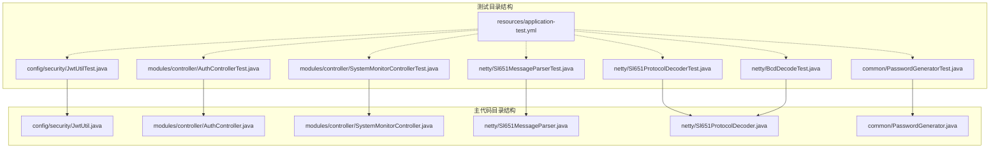
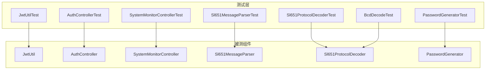
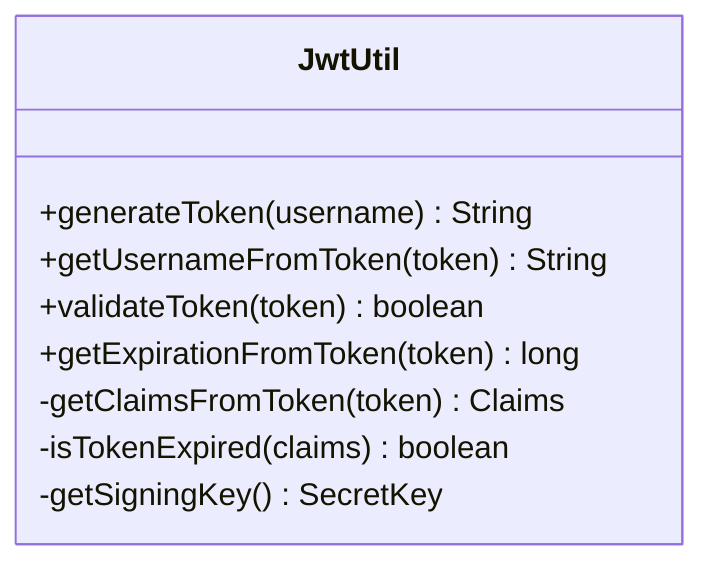
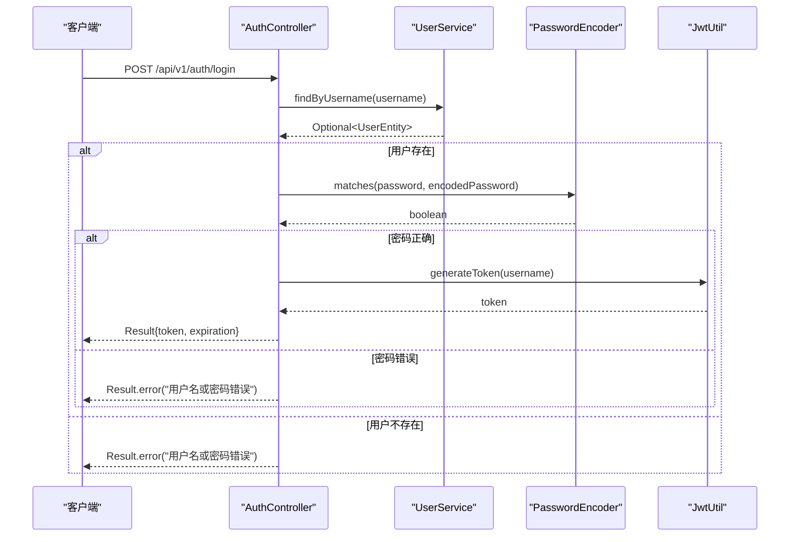
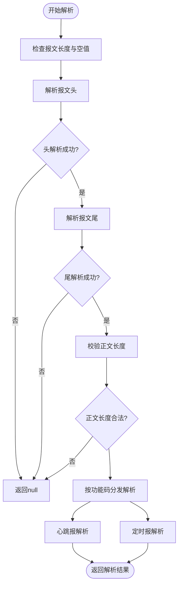
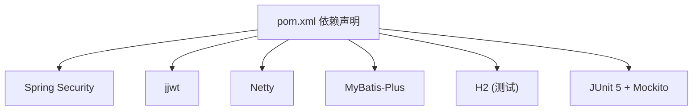

# 测试实践与质量保证

<cite>
**本文引用的文件列表**
- [JwtUtil.java](file://src/main/java/com/hydro/monitor/config/security/JwtUtil.java)
- [JwtUtilTest.java](file://src/test/java/com/hydro/monitor/config/security/JwtUtilTest.java)
- [AuthController.java](file://src/main/java/com/hydro/monitor/modules/controller/AuthController.java)
- [AuthControllerTest.java](file://src/test/java/com/hydro/monitor/modules/controller/AuthControllerTest.java)
- [Sl651ProtocolDecoder.java](file://src/main/java/com/hydro/monitor/netty/Sl651ProtocolDecoder.java)
- [Sl651ProtocolDecoderTest.java](file://src/test/java/com/hydro/monitor/netty/Sl651ProtocolDecoderTest.java)
- [Sl651MessageParser.java](file://src/main/java/com/hydro/monitor/netty/Sl651MessageParser.java)
- [Sl651MessageParserTest.java](file://src/test/java/com/hydro/monitor/netty/Sl651MessageParserTest.java)
- [BcdDecodeTest.java](file://src/test/java/com/hydro/monitor/netty/BcdDecodeTest.java)
- [SystemMonitorController.java](file://src/main/java/com/hydro/monitor/modules/controller/SystemMonitorController.java)
- [SystemMonitorControllerTest.java](file://src/test/java/com/hydro/monitor/modules/controller/SystemMonitorControllerTest.java)
- [PasswordGenerator.java](file://src/main/java/com/hydro/monitor/common/PasswordGenerator.java)
- [PasswordGeneratorTest.java](file://src/test/java/com/hydro/monitor/common/PasswordGeneratorTest.java)
- [application-test.yml](file://src/test/resources/application-test.yml)
- [pom.xml](file://pom.xml)
- [README.md](file://README.md)
</cite>

## 目录
1. [引言](#引言)
2. [项目结构](#项目结构)
3. [核心组件](#核心组件)
4. [架构总览](#架构总览)
5. [详细组件分析](#详细组件分析)
6. [依赖分析](#依赖分析)
7. [性能考虑](#性能考虑)
8. [故障排查指南](#故障排查指南)
9. [结论](#结论)
10. [附录](#附录)

## 引言
本文件面向水文监测系统的测试实践与质量保证，围绕单元测试、集成测试、测试环境与数据管理、覆盖率与持续测试、性能与压力测试、缺陷跟踪与回归测试等方面，结合现有代码库中的测试实现，给出可操作的规范与建议。重点覆盖以下方面：
- JWT 工具类测试与断言策略
- 控制器层测试（含 Spring Security 认证）
- Netty 协议处理（SL 651）的解析与解码测试
- 业务逻辑测试与边界条件
- 测试环境配置与测试数据管理
- 覆盖率与持续测试集成
- 性能与压力测试方法
- 缺陷跟踪、回归测试与质量度量

## 项目结构
项目采用按模块与层次划分的组织方式，测试位于 src/test 下，与主代码包结构一一对应，便于定位与维护。

图表来源
- [JwtUtilTest.java:1-156](file://src/test/java/com/hydro/monitor/config/security/JwtUtilTest.java#L1-L156)
- [AuthControllerTest.java:1-114](file://src/test/java/com/hydro/monitor/modules/controller/AuthControllerTest.java#L1-L114)
- [SystemMonitorControllerTest.java:1-61](file://src/test/java/com/hydro/monitor/modules/controller/SystemMonitorControllerTest.java#L1-L61)
- [Sl651MessageParserTest.java:1-268](file://src/test/java/com/hydro/monitor/netty/Sl651MessageParserTest.java#L1-L268)
- [Sl651ProtocolDecoderTest.java:1-337](file://src/test/java/com/hydro/monitor/netty/Sl651ProtocolDecoderTest.java#L1-L337)
- [BcdDecodeTest.java:1-64](file://src/test/java/com/hydro/monitor/netty/BcdDecodeTest.java#L1-L64)
- [PasswordGeneratorTest.java:1-45](file://src/test/java/com/hydro/monitor/common/PasswordGeneratorTest.java#L1-L45)
- [application-test.yml:1-29](file://src/test/resources/application-test.yml#L1-L29)

章节来源
- [README.md:85-106](file://README.md#L85-L106)

## 核心组件
- JWT 工具类：负责令牌生成、解析与校验，提供用户名提取与过期时间获取能力。
- 认证控制器：整合用户查询、密码匹配与 JWT 生成，返回统一结果包装。
- Netty 协议解码器：接收 ByteBuf，委托纯解析器进行协议解析，并持久化心跳与定时报数据。
- SL 651 纯解析器：无状态、无副作用的协议解析器，输出结构化结果对象。
- 密码生成器：基于 BCrypt 的密码编码与匹配工具。
- 系统监控控制器：提供系统运行状态查询接口。

章节来源
- [JwtUtil.java:1-126](file://src/main/java/com/hydro/monitor/config/security/JwtUtil.java#L1-L126)
- [AuthController.java:1-68](file://src/main/java/com/hydro/monitor/modules/controller/AuthController.java#L1-L68)
- [Sl651ProtocolDecoder.java:1-278](file://src/main/java/com/hydro/monitor/netty/Sl651ProtocolDecoder.java#L1-L278)
- [Sl651MessageParser.java:1-648](file://src/main/java/com/hydro/monitor/netty/Sl651MessageParser.java#L1-L648)
- [PasswordGenerator.java:1-55](file://src/main/java/com/hydro/monitor/common/PasswordGenerator.java#L1-L55)
- [SystemMonitorController.java:1-84](file://src/main/java/com/hydro/monitor/modules/controller/SystemMonitorController.java#L1-L84)

## 架构总览
下图展示测试与被测组件之间的关系，突出测试对控制器、工具类与协议解析器的覆盖路径。

图表来源
- [JwtUtilTest.java:1-156](file://src/test/java/com/hydro/monitor/config/security/JwtUtilTest.java#L1-L156)
- [AuthControllerTest.java:1-114](file://src/test/java/com/hydro/monitor/modules/controller/AuthControllerTest.java#L1-L114)
- [SystemMonitorControllerTest.java:1-61](file://src/test/java/com/hydro/monitor/modules/controller/SystemMonitorControllerTest.java#L1-L61)
- [Sl651MessageParserTest.java:1-268](file://src/test/java/com/hydro/monitor/netty/Sl651MessageParserTest.java#L1-L268)
- [Sl651ProtocolDecoderTest.java:1-337](file://src/test/java/com/hydro/monitor/netty/Sl651ProtocolDecoderTest.java#L1-L337)
- [BcdDecodeTest.java:1-64](file://src/test/java/com/hydro/monitor/netty/BcdDecodeTest.java#L1-L64)
- [PasswordGeneratorTest.java:1-45](file://src/test/java/com/hydro/monitor/common/PasswordGeneratorTest.java#L1-L45)

## 详细组件分析

### JWT 工具类测试
- 测试目标：验证令牌生成、用户名提取、有效性校验、过期时间获取、不同用户令牌唯一性等。
- Mock 策略：无需外部依赖，直接调用工具类方法；通过断言验证行为。
- 断言策略：使用断言组合验证令牌结构、用户名一致性、过期时间合理性与异常场景。
- 覆盖要点：空令牌、非法令牌、空用户名、重复生成令牌的差异性等。

图表来源
- [JwtUtil.java:1-126](file://src/main/java/com/hydro/monitor/config/security/JwtUtil.java#L1-L126)

章节来源
- [JwtUtilTest.java:1-156](file://src/test/java/com/hydro/monitor/config/security/JwtUtilTest.java#L1-L156)

### 认证控制器测试（含 Spring Security）
- 测试目标：验证登录接口在用户名不存在、密码错误、请求格式错误等场景下的响应。
- Mock 策略：使用 WebMvcTest 与 MockBean 注入 PasswordEncoder 与 JwtUtil，隔离外部依赖。
- 断言策略：基于 MockMvc 对 HTTP 状态码与 JSON 结果进行断言，确保统一结果包装。
- 安全策略：当前测试未启用真实安全过滤链，后续可扩展以覆盖真实认证流程。

图表来源
- [AuthController.java:1-68](file://src/main/java/com/hydro/monitor/modules/controller/AuthController.java#L1-L68)
- [AuthControllerTest.java:1-114](file://src/test/java/com/hydro/monitor/modules/controller/AuthControllerTest.java#L1-L114)

章节来源
- [AuthControllerTest.java:1-114](file://src/test/java/com/hydro/monitor/modules/controller/AuthControllerTest.java#L1-L114)

### 系统监控控制器测试（安全策略提示）
- 测试目标：验证未认证访问返回 401，以及接口返回结构的完整性（需配合安全测试支持）。
- 当前实现：未启用安全过滤链，测试预期 401。
- 建议：后续补充安全测试配置，以覆盖真实认证场景。

章节来源
- [SystemMonitorControllerTest.java:1-61](file://src/test/java/com/hydro/monitor/modules/controller/SystemMonitorControllerTest.java#L1-L61)
- [SystemMonitorController.java:1-84](file://src/main/java/com/hydro/monitor/modules/controller/SystemMonitorController.java#L1-L84)

### SL 651 协议解析器测试
- 测试目标：验证纯解析器对心跳报与定时报的解析，包括报文头、正文、要素标识符、BCD 解析与边界条件。
- 测试策略：构造标准与异常报文，断言解析结果类型、字段值与要素映射。
- 覆盖要点：未知功能码、报文长度不足、起始符错误、多要素报文、时间解析等。

图表来源
- [Sl651MessageParser.java:66-126](file://src/main/java/com/hydro/monitor/netty/Sl651MessageParser.java#L66-L126)

章节来源
- [Sl651MessageParserTest.java:1-268](file://src/test/java/com/hydro/monitor/netty/Sl651MessageParserTest.java#L1-L268)

### SL 651 协议解码器测试
- 测试目标：验证 Netty 解码器对 ByteBuf 的处理、原始报文保存、心跳与定时报的持久化分支、BCD 地址解析与异常处理。
- 测试策略：构造心跳与定时报样本，断言功能码、要素映射与日志输出；对异常报文进行健壮性验证。
- 覆盖要点：异步保存、异常捕获、站址解析、要素映射构建与 JSON 序列化。

章节来源
- [Sl651ProtocolDecoderTest.java:1-337](file://src/test/java/com/hydro/monitor/netty/Sl651ProtocolDecoderTest.java#L1-L337)
- [Sl651ProtocolDecoder.java:1-278](file://src/main/java/com/hydro/monitor/netty/Sl651ProtocolDecoder.java#L1-L278)

### BCD 编码解析测试
- 测试目标：验证遥测站地址的 BCD 解析逻辑，确保字节到十六进制字符串的正确转换。
- 测试策略：针对典型字节序列进行断言，确保每个字节的解析与整体结果一致。

章节来源
- [BcdDecodeTest.java:1-64](file://src/test/java/com/hydro/monitor/netty/BcdDecodeTest.java#L1-L64)

### 密码生成器测试
- 测试目标：验证 BCrypt 编码与匹配逻辑，确保与数据库中存储的哈希值一致。
- 测试策略：使用预置哈希值进行匹配验证，同时生成新哈希并断言匹配成功。

章节来源
- [PasswordGeneratorTest.java:1-45](file://src/test/java/com/hydro/monitor/common/PasswordGeneratorTest.java#L1-L45)
- [PasswordGenerator.java:1-55](file://src/main/java/com/hydro/monitor/common/PasswordGenerator.java#L1-L55)

## 依赖分析
- 测试框架与工具：JUnit 5、Mockito、Spring Boot Test、MockMvc、H2 内存数据库。
- 安全与认证：Spring Security、JWT（jjwt）。
- 网络与协议：Netty、SL 651 协议解析。
- 持久层：MyBatis-Plus、MySQL（运行时）、H2（测试时）。

图表来源
- [pom.xml:30-153](file://pom.xml#L30-L153)

章节来源
- [pom.xml:1-179](file://pom.xml#L1-L179)

## 性能考虑
- 单元测试性能：优先使用纯函数与无状态解析器，避免数据库与网络 IO，确保测试执行快速稳定。
- 集成测试性能：使用 H2 内存数据库与简化的配置，减少启动时间与资源占用。
- Netty 解码器：异步保存原始报文，避免阻塞网络线程；测试中可通过构造合理大小的 ByteBuf 验证吞吐能力。
- 建议：对高频接口（如登录）增加基准测试（Benchmark），评估在不同并发下的响应时间与吞吐。

## 故障排查指南
- JWT 验证失败：检查密钥配置与过期时间设置，确认测试环境配置正确。
- 登录接口返回错误：核对用户名是否存在、密码匹配逻辑与统一结果包装。
- 协议解析失败：检查报文长度、起始符、功能码与正文结构，关注日志输出。
- BCD 解析异常：确认字节顺序与小数位数计算，确保数据定义位解析正确。
- 数据库连接问题：确认 H2 内存库初始化与事务回滚策略，避免跨测试污染。

章节来源
- [application-test.yml:1-29](file://src/test/resources/application-test.yml#L1-L29)
- [Sl651ProtocolDecoderTest.java:246-248](file://src/test/java/com/hydro/monitor/netty/Sl651ProtocolDecoderTest.java#L246-L248)

## 结论
本项目已具备较为完善的测试基础，覆盖了 JWT 工具类、控制器层、协议解析器与密码生成器等关键模块。建议在现有基础上进一步完善：
- 补充 Spring Security 的真实认证测试，提升控制器层的安全验证覆盖。
- 引入覆盖率工具与持续集成，设定最低覆盖率阈值。
- 增加性能与压力测试，评估系统在高并发下的稳定性。
- 建立缺陷跟踪与回归测试流程，确保问题闭环与质量度量可视化。

## 附录

### 单元测试编写规范
- 测试用例设计原则
  - 一个测试只验证一个行为或边界条件
  - 使用明确的断言与可读的测试命名
  - 覆盖正常路径、异常路径与边界值
- Mock 对象使用
  - 使用 @MockBean 隔离外部依赖
  - 对关键方法使用 when(...).thenReturn(...) 配置行为
- 断言策略
  - 使用统一的结果包装与状态码断言
  - 对复杂对象使用结构化断言（如 JSONPath）

### 集成测试实施方法
- Netty 协议处理
  - 使用 ByteBuf 构造标准与异常报文，验证解析与持久化分支
  - 对异步保存进行超时与日志断言
- Spring Security 认证
  - 在测试配置中启用安全过滤链，模拟认证与授权
  - 验证受保护接口在未认证与认证成功场景下的行为

### JWT 工具类测试示例
- 生成令牌：断言令牌结构与用户名提取
- 验证令牌：覆盖有效、无效、空与 null 场景
- 过期时间：断言过期时间大于当前时间

章节来源
- [JwtUtilTest.java:36-154](file://src/test/java/com/hydro/monitor/config/security/JwtUtilTest.java#L36-L154)

### 控制器层测试示例
- 登录成功：断言返回 200 且包含 token 与 expiration
- 登录失败：用户名或密码错误时返回统一错误码
- 请求格式错误：断言 400 Bad Request

章节来源
- [AuthControllerTest.java:53-112](file://src/test/java/com/hydro/monitor/modules/controller/AuthControllerTest.java#L53-L112)

### 业务逻辑测试示例
- SL 651 纯解析器：心跳报与定时报的字段断言、多要素解析、未知功能码处理
- 协议解码器：原始报文保存、要素映射构建、异常处理与日志输出

章节来源
- [Sl651MessageParserTest.java:31-248](file://src/test/java/com/hydro/monitor/netty/Sl651MessageParserTest.java#L31-L248)
- [Sl651ProtocolDecoderTest.java:45-93](file://src/test/java/com/hydro/monitor/netty/Sl651ProtocolDecoderTest.java#L45-L93)

### 测试环境配置与测试数据管理
- 测试环境配置：H2 内存库、较短 JWT 过期时间、调试日志级别
- 测试数据管理：使用内存数据库与事务回滚，避免跨测试污染

章节来源
- [application-test.yml:1-29](file://src/test/resources/application-test.yml#L1-L29)

### 测试覆盖率、持续测试与自动化
- 覆盖率要求：建议设定关键模块（控制器、服务、工具类、协议解析）的最低覆盖率阈值
- 持续测试：在 CI 中执行单元测试与集成测试，确保每次提交的质量门禁
- 自动化流程：结合 Maven 插件与 CI 平台，实现一键触发与报告生成

### 性能测试与压力测试
- 性能测试：对高频接口（登录、系统状态）进行基准测试，记录响应时间与吞吐
- 压力测试：逐步增加并发与报文规模，观察系统瓶颈与异常行为

### 缺陷跟踪、回归测试与质量度量
- 缺陷跟踪：建立缺陷模板，记录问题复现步骤与预期/实际结果
- 回归测试：在修复后重新执行相关测试，确保问题不再出现
- 质量度量：结合覆盖率、缺陷密度、测试执行时间与通过率进行综合评估