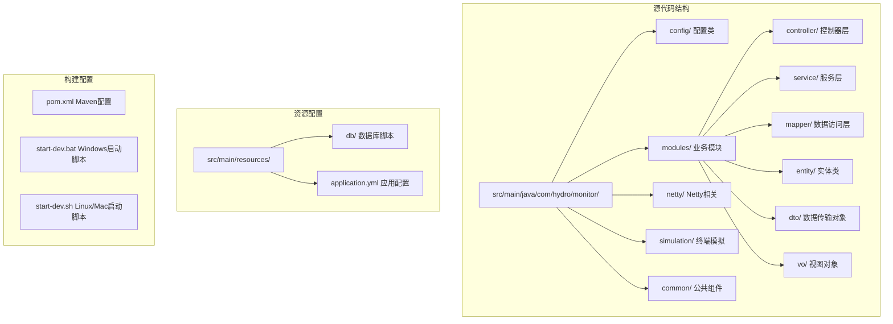
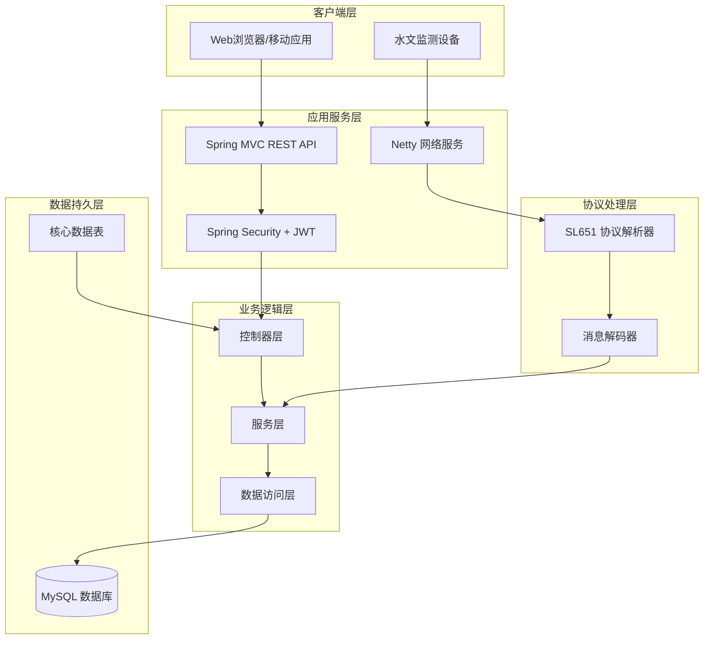
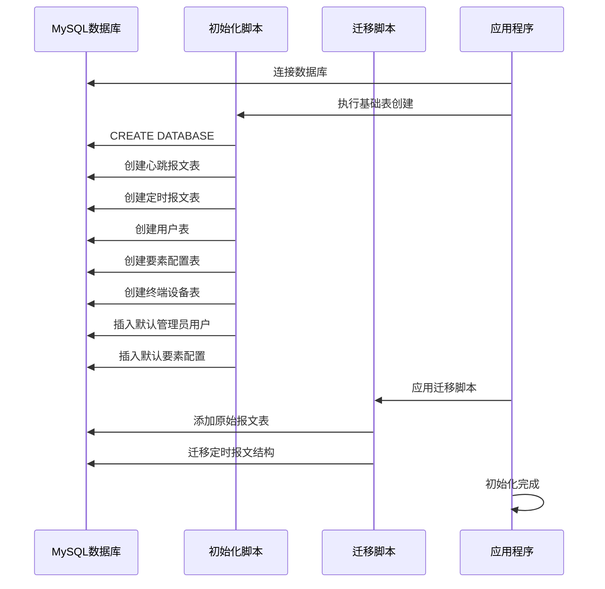
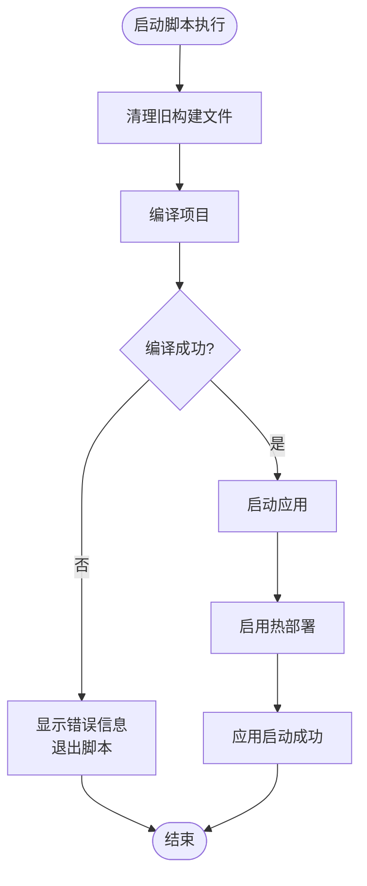
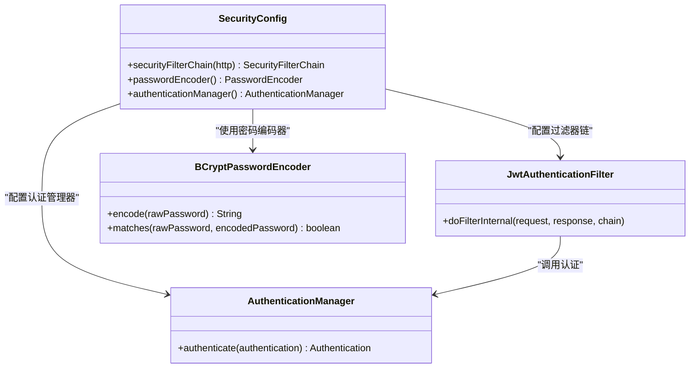
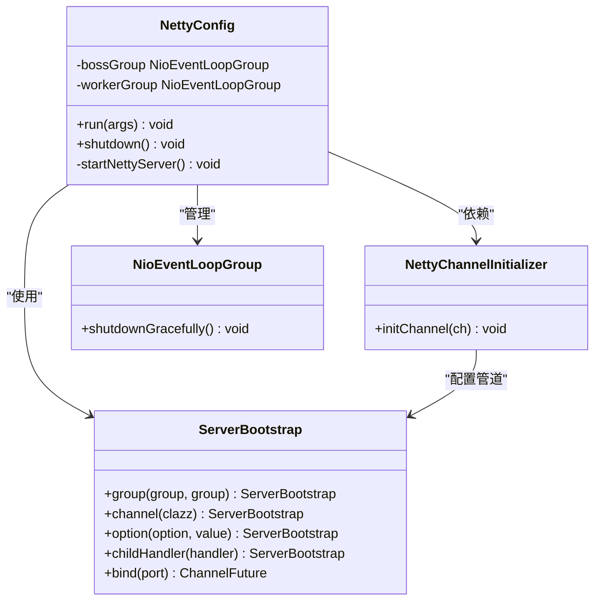
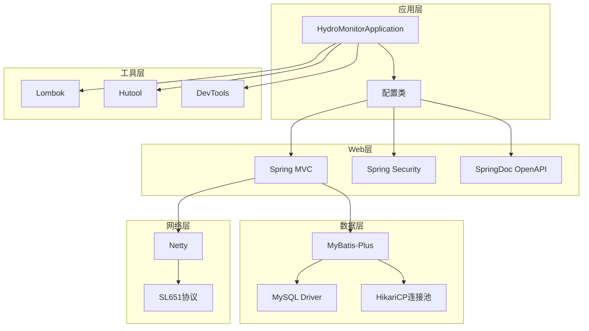

# 快速开始

<cite>
**本文引用的文件**
- [README.md](file://README.md)
- [pom.xml](file://pom.xml)
- [application.yml](file://src/main/resources/application.yml)
- [init.sql](file://src/main/resources/db/init.sql)
- [migration_raw_message.sql](file://src/main/resources/db/migration_raw_message.sql)
- [migration_timed_report.sql](file://src/main/resources/db/migration_timed_report.sql)
- [update_element_config_add_unit.sql](file://src/main/resources/db/update_element_config_add_unit.sql)
- [update_element_config_remove_db_field_name.sql](file://src/main/resources/db/update_element_config_remove_db_field_name.sql)
- [start-dev.bat](file://start-dev.bat)
- [start-dev.sh](file://start-dev.sh)
- [HydroMonitorApplication.java](file://src/main/java/com/hydro/monitor/HydroMonitorApplication.java)
- [SecurityConfig.java](file://src/main/java/com/hydro/monitor/config/security/SecurityConfig.java)
- [NettyConfig.java](file://src/main/java/com/hydro/monitor/config/NettyConfig.java)
- [MyBatisPlusConfig.java](file://src/main/java/com/hydro/monitor/config/MyBatisPlusConfig.java)
</cite>

## 目录
1. [简介](#简介)
2. [项目结构](#项目结构)
3. [核心组件](#核心组件)
4. [架构概览](#架构概览)
5. [详细组件分析](#详细组件分析)
6. [依赖分析](#依赖分析)
7. [性能考虑](#性能考虑)
8. [故障排除指南](#故障排除指南)
9. [结论](#结论)
10. [附录](#附录)

## 简介
水文监测系统是一个基于 Java 17、Spring Boot 3.5.9、Netty 4.1、Spring Security 6 和 MyBatis-Plus 3.5.9 构建的高性能水文监测数据采集与分析平台。该系统支持 SL 651-2014 协议报文接收、原始报文记录、终端模拟上报、定时报表分析等功能。

## 项目结构
该项目采用标准的 Maven 多模块结构，主要包含以下关键目录：



**图表来源**
- [pom.xml:1-179](file://pom.xml#L1-L179)
- [README.md:85-106](file://README.md#L85-L106)

**章节来源**
- [pom.xml:1-179](file://pom.xml#L1-L179)
- [README.md:85-106](file://README.md#L85-L106)

## 核心组件
系统的核心技术栈包括：

### 基础设施层
- **Java 17**: 现代化的语言特性支持
- **Spring Boot 3.5.9**: 应用程序框架
- **MySQL 8.0+**: 关系型数据库
- **Netty 4.1**: 高性能网络通信框架

### 持久层
- **MyBatis-Plus 3.5.9**: ORM 框架，提供自动化 CRUD
- **MySQL Connector/J**: 数据库驱动程序

### 安全与认证
- **Spring Security 6**: 安全框架
- **JWT (jjwt)**: 令牌认证机制

### 网络协议
- **SL 651-2014**: 水文监测标准协议
- **Netty**: TCP/UDP 通信支持

**章节来源**
- [pom.xml:21-28](file://pom.xml#L21-L28)
- [pom.xml:30-153](file://pom.xml#L30-L153)

## 架构概览
系统采用分层架构设计，结合了传统 Web 应用和高性能网络服务的特点：



**图表来源**
- [HydroMonitorApplication.java:12-35](file://src/main/java/com/hydro/monitor/HydroMonitorApplication.java#L12-L35)
- [SecurityConfig.java:34-52](file://src/main/java/com/hydro/monitor/config/security/SecurityConfig.java#L34-L52)
- [NettyConfig.java:47-70](file://src/main/java/com/hydro/monitor/config/NettyConfig.java#L47-L70)

## 详细组件分析

### 数据库初始化流程
系统提供了完整的数据库初始化方案，包括基础表结构创建和后续迁移脚本应用：



**图表来源**
- [init.sql:1-93](file://src/main/resources/db/init.sql#L1-L93)
- [migration_raw_message.sql:1-14](file://src/main/resources/db/migration_raw_message.sql#L1-L14)
- [migration_timed_report.sql:1-44](file://src/main/resources/db/migration_timed_report.sql#L1-L44)

### 启动脚本组件
系统提供了跨平台的启动脚本，支持自动编译和热部署：



**图表来源**
- [start-dev.bat:8-26](file://start-dev.bat#L8-L26)
- [start-dev.sh:8-25](file://start-dev.sh#L8-L25)

**章节来源**
- [start-dev.bat:1-28](file://start-dev.bat#L1-L28)
- [start-dev.sh:1-25](file://start-dev.sh#L1-L25)

### 安全配置组件
系统采用基于 JWT 的无状态认证机制：



**图表来源**
- [SecurityConfig.java:24-75](file://src/main/java/com/hydro/monitor/config/security/SecurityConfig.java#L24-L75)

**章节来源**
- [SecurityConfig.java:1-76](file://src/main/java/com/hydro/monitor/config/security/SecurityConfig.java#L1-L76)

### Netty 网络服务组件
系统通过 Netty 提供高性能的网络通信能力：



**图表来源**
- [NettyConfig.java:26-86](file://src/main/java/com/hydro/monitor/config/NettyConfig.java#L26-L86)

**章节来源**
- [NettyConfig.java:1-87](file://src/main/java/com/hydro/monitor/config/NettyConfig.java#L1-L87)

## 依赖分析
系统的核心依赖关系如下：



**图表来源**
- [pom.xml:30-153](file://pom.xml#L30-L153)
- [HydroMonitorApplication.java:12-35](file://src/main/java/com/hydro/monitor/HydroMonitorApplication.java#L12-L35)

**章节来源**
- [pom.xml:1-179](file://pom.xml#L1-L179)

## 性能考虑
系统在设计时充分考虑了性能优化：

### 数据库性能优化
- 使用索引优化查询性能（心跳报文表、定时报文表、用户表）
- 采用 JSON 存储要素集，减少表结构复杂度
- 分页查询支持，限制单页最大记录数为 500 条

### 网络性能优化
- Netty 异步非阻塞 I/O 模型
- 连接池复用，减少连接建立开销
- 适当的超时配置和心跳检测

### 内存管理
- 合理的 JVM 参数配置
- 对象池化和缓存策略
- 及时的资源释放和垃圾回收

## 故障排除指南

### 环境准备问题
**问题**: JDK 17 未正确安装或配置
- **解决方案**: 确保安装 JDK 17，并设置 JAVA_HOME 环境变量
- **验证方法**: 运行 `java -version` 和 `javac -version`

**问题**: MySQL 服务未启动
- **解决方案**: 启动 MySQL 服务，确保端口 3306 可用
- **验证方法**: 运行 `mysql -u root -p` 测试连接

**问题**: Maven 依赖下载失败
- **解决方案**: 检查网络连接，配置合适的镜像源
- **验证方法**: 运行 `mvn -v` 检查 Maven 版本

### 数据库初始化问题
**问题**: 数据库连接失败
- **检查项**: 
  - 修改 application.yml 中的数据库连接信息
  - 确认数据库用户名和密码正确
  - 验证数据库服务正常运行

**问题**: 表结构创建失败
- **检查项**:
  - 确保 MySQL 版本满足要求
  - 检查权限是否足够创建数据库和表
  - 查看具体的错误信息

**问题**: 迁移脚本执行失败
- **检查项**:
  - 确保先执行 init.sql 再执行迁移脚本
  - 检查数据库中是否存在相关表
  - 验证 SQL 语法正确性

### 应用启动问题
**问题**: 端口被占用
- **解决方案**: 修改 application.yml 中的端口号
- **默认端口**: HTTP 服务 8080，Netty 服务 9000

**问题**: 热部署不生效
- **检查项**:
  - 确认 DevTools 依赖已正确添加
  - 检查 application.yml 中的 devtools 配置
  - 验证修改的文件路径是否在监控范围内

**问题**: JWT 认证失败
- **检查项**:
  - 验证 JWT 密钥配置
  - 检查用户密码是否正确
  - 确认用户角色权限

### 常见启动命令
**Windows 平台**:
```cmd
# 启动开发模式
start-dev.bat

# 或者手动执行
mvn clean compile
mvn spring-boot:run
```

**Linux/Mac 平台**:
```bash
# 给予执行权限
chmod +x start-dev.sh

# 启动开发模式
./start-dev.sh

# 或者手动执行
mvn clean compile
mvn spring-boot:run
```

**章节来源**
- [README.md:20-51](file://README.md#L20-L51)
- [application.yml:1-86](file://src/main/resources/application.yml#L1-L86)

## 结论
水文监测系统后端提供了一个完整、高性能的水文数据采集与分析平台。通过合理的架构设计和技术选型，系统能够有效处理大量的水文监测数据，支持多种数据源接入和协议解析。

系统的快速开始指南涵盖了从环境准备到应用启动的完整流程，包括数据库初始化、配置修改、启动脚本使用等关键步骤。同时，故障排除指南提供了常见问题的解决方案，帮助开发者快速定位和解决问题。

## 附录

### 默认账户信息
- **用户名**: admin
- **密码**: admin123
- **角色**: ADMIN

### 服务访问地址
- **HTTP 服务**: http://localhost:8080
- **Netty 服务**: localhost:9000
- **API 文档**: http://localhost:8080/swagger-ui.html

### 数据库迁移脚本顺序
1. **init.sql**: 基础表结构创建
2. **migration_raw_message.sql**: 原始报文表创建
3. **migration_timed_report.sql**: 定时报文结构迁移
4. **update_element_config_add_unit.sql**: 要素配置添加单位字段
5. **update_element_config_remove_db_field_name.sql**: 移除冗余字段

### 配置文件关键参数说明
- **数据库连接**: 修改 application.yml 中的用户名和密码
- **JWT 密钥**: 修改 jwt.secret 参数
- **端口配置**: 修改 server.port 和 netty.server.port
- **日志级别**: 调整 logging.level 配置

**章节来源**
- [README.md:60-64](file://README.md#L60-L64)
- [README.md:53-58](file://README.md#L53-L58)
- [application.yml:8-51](file://src/main/resources/application.yml#L8-L51)