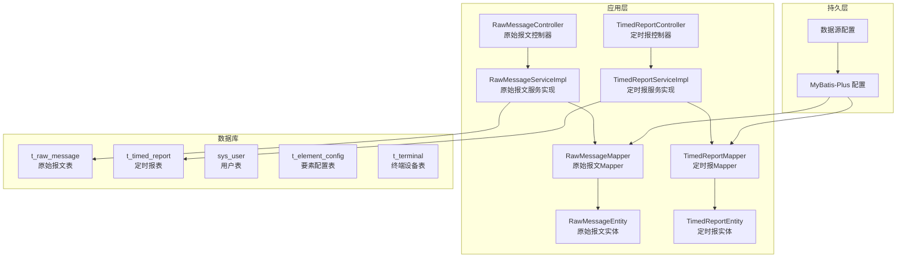
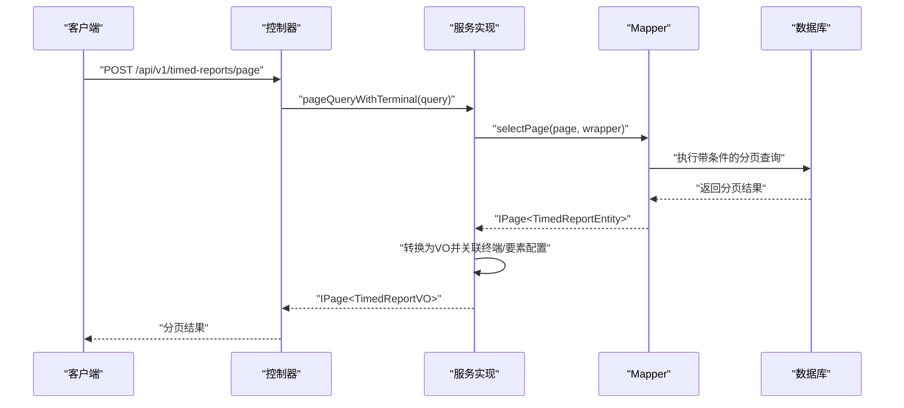
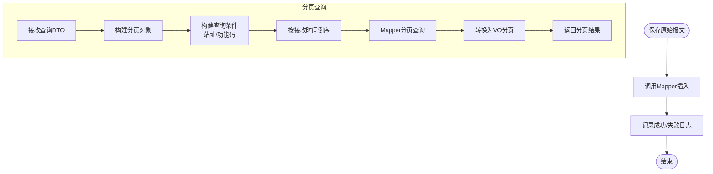
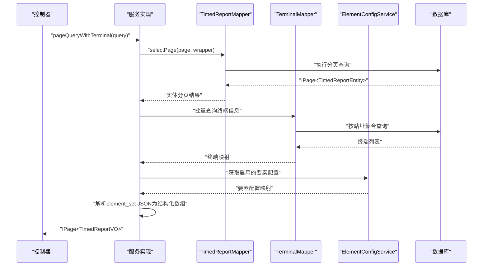
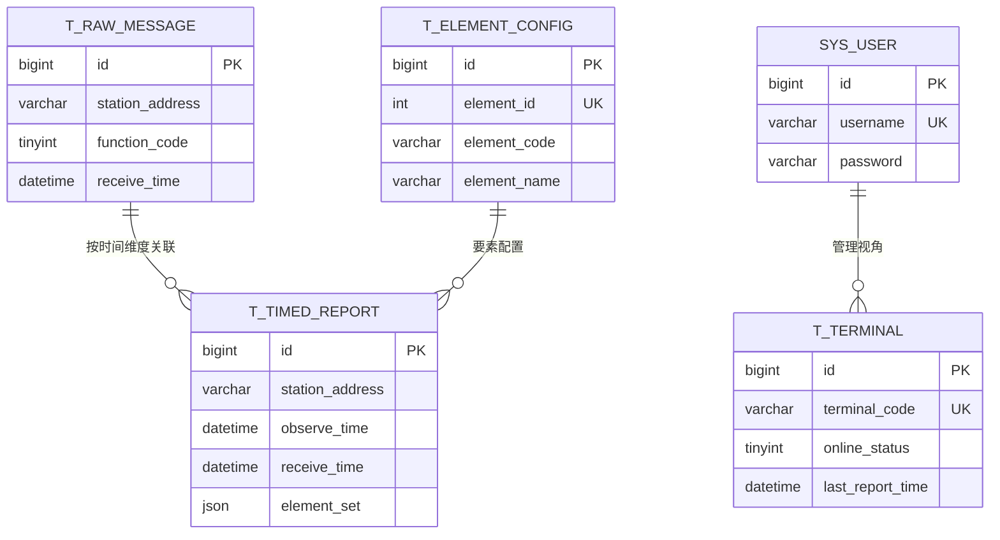
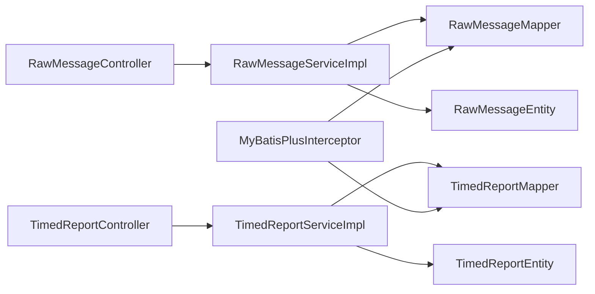

# 数据库性能优化

<cite>
**本文引用的文件**
- [application.yml](file://src/main/resources/application.yml)
- [init.sql](file://src/main/resources/db/init.sql)
- [migration_raw_message.sql](file://src/main/resources/db/migration_raw_message.sql)
- [migration_timed_report.sql](file://src/main/resources/db/migration_timed_report.sql)
- [MyBatisPlusConfig.java](file://src/main/java/com/hydro/monitor/config/MyBatisPlusConfig.java)
- [RawMessageMapper.java](file://src/main/java/com/hydro/monitor/modules/mapper/RawMessageMapper.java)
- [TimedReportMapper.java](file://src/main/java/com/hydro/monitor/modules/mapper/TimedReportMapper.java)
- [RawMessageEntity.java](file://src/main/java/com/hydro/monitor/modules/entity/RawMessageEntity.java)
- [TimedReportEntity.java](file://src/main/java/com/hydro/monitor/modules/entity/TimedReportEntity.java)
- [RawMessageServiceImpl.java](file://src/main/java/com/hydro/monitor/modules/service/impl/RawMessageServiceImpl.java)
- [TimedReportServiceImpl.java](file://src/main/java/com/hydro/monitor/modules/service/impl/TimedReportServiceImpl.java)
- [RawMessageController.java](file://src/main/java/com/hydro/monitor/modules/controller/RawMessageController.java)
- [TimedReportController.java](file://src/main/java/com/hydro/monitor/modules/controller/TimedReportController.java)
</cite>

## 目录
1. [简介](#简介)
2. [项目结构](#项目结构)
3. [核心组件](#核心组件)
4. [架构概览](#架构概览)
5. [详细组件分析](#详细组件分析)
6. [依赖分析](#依赖分析)
7. [性能考虑](#性能考虑)
8. [故障排查指南](#故障排查指南)
9. [结论](#结论)
10. [附录](#附录)

## 简介
本文件面向水文监测系统的数据库性能优化，结合现有代码库中的数据库表结构、MyBatis-Plus配置、查询逻辑与业务接口，系统性地提出查询优化、存储优化、并发控制、缓存策略、慢查询分析与性能监控等方案。特别针对大数据量场景下的分区表设计、查询计划优化、冷热数据分离与存储引擎选择给出可落地建议，并提供数据库监控指标与性能基准测试方法。

## 项目结构
系统采用Spring Boot + MyBatis-Plus架构，数据库层通过实体类与Mapper接口映射到具体表，业务层在Service中组织查询逻辑，Controller对外提供REST接口。数据库初始化脚本定义了核心业务表及索引，应用配置文件包含数据源与MyBatis-Plus相关设置。

**图表来源**
- [RawMessageController.java:1-81](file://src/main/java/com/hydro/monitor/modules/controller/RawMessageController.java#L1-81)
- [TimedReportController.java:1-111](file://src/main/java/com/hydro/monitor/modules/controller/TimedReportController.java#L1-111)
- [RawMessageServiceImpl.java:1-160](file://src/main/java/com/hydro/monitor/modules/service/impl/RawMessageServiceImpl.java#L1-160)
- [TimedReportServiceImpl.java:1-332](file://src/main/java/com/hydro/monitor/modules/service/impl/TimedReportServiceImpl.java#L1-332)
- [RawMessageMapper.java:1-15](file://src/main/java/com/hydro/monitor/modules/mapper/RawMessageMapper.java#L1-15)
- [TimedReportMapper.java:1-15](file://src/main/java/com/hydro/monitor/modules/mapper/TimedReportMapper.java#L1-15)
- [RawMessageEntity.java:1-55](file://src/main/java/com/hydro/monitor/modules/entity/RawMessageEntity.java#L1-55)
- [TimedReportEntity.java:1-48](file://src/main/java/com/hydro/monitor/modules/entity/TimedReportEntity.java#L1-48)
- [MyBatisPlusConfig.java:1-39](file://src/main/java/com/hydro/monitor/config/MyBatisPlusConfig.java#L1-39)
- [application.yml:1-86](file://src/main/resources/application.yml#L1-86)
- [init.sql:1-93](file://src/main/resources/db/init.sql#L1-93)
- [migration_raw_message.sql:1-14](file://src/main/resources/db/migration_raw_message.sql#L1-14)

**章节来源**
- [application.yml:1-86](file://src/main/resources/application.yml#L1-L86)
- [init.sql:1-93](file://src/main/resources/db/init.sql#L1-L93)
- [migration_raw_message.sql:1-14](file://src/main/resources/db/migration_raw_message.sql#L1-L14)

## 核心组件
- 数据源与MyBatis-Plus配置：应用通过数据源连接MySQL，开启下划线转驼峰映射与标准输出日志；MyBatis-Plus配置了分页拦截器并设置最大单页限制。
- 实体与Mapper：原始报文与定时报实体分别映射到对应表，使用雪花ID主键；Mapper接口继承基础接口以获得通用CRUD能力。
- 服务实现：原始报文服务负责保存、分页查询与报文解析；定时报服务负责保存、分页查询、按站点查询、查询各站点最新记录，并关联终端与要素配置信息。
- 控制器：提供原始报文与定时报的REST接口，支持分页查询、按站点查询与最新记录查询。

**章节来源**
- [MyBatisPlusConfig.java:1-39](file://src/main/java/com/hydro/monitor/config/MyBatisPlusConfig.java#L1-L39)
- [RawMessageEntity.java:1-55](file://src/main/java/com/hydro/monitor/modules/entity/RawMessageEntity.java#L1-L55)
- [TimedReportEntity.java:1-48](file://src/main/java/com/hydro/monitor/modules/entity/TimedReportEntity.java#L1-L48)
- [RawMessageMapper.java:1-15](file://src/main/java/com/hydro/monitor/modules/mapper/RawMessageMapper.java#L1-L15)
- [TimedReportMapper.java:1-15](file://src/main/java/com/hydro/monitor/modules/mapper/TimedReportMapper.java#L1-L15)
- [RawMessageServiceImpl.java:1-160](file://src/main/java/com/hydro/monitor/modules/service/impl/RawMessageServiceImpl.java#L1-L160)
- [TimedReportServiceImpl.java:1-332](file://src/main/java/com/hydro/monitor/modules/service/impl/TimedReportServiceImpl.java#L1-L332)
- [RawMessageController.java:1-81](file://src/main/java/com/hydro/monitor/modules/controller/RawMessageController.java#L1-L81)
- [TimedReportController.java:1-111](file://src/main/java/com/hydro/monitor/modules/controller/TimedReportController.java#L1-L111)

## 架构概览
系统数据库层围绕“原始报文”和“定时报”两大高频写入与查询场景展开。写入侧通过服务层批量入库，读取侧通过分页与条件过滤满足监控面板与报表需求。MyBatis-Plus提供分页与SQL构造能力，配合索引提升查询效率。

**图表来源**
- [TimedReportController.java:36-45](file://src/main/java/com/hydro/monitor/modules/controller/TimedReportController.java#L36-L45)
- [TimedReportServiceImpl.java:132-138](file://src/main/java/com/hydro/monitor/modules/service/impl/TimedReportServiceImpl.java#L132-L138)
- [TimedReportMapper.java:1-15](file://src/main/java/com/hydro/monitor/modules/mapper/TimedReportMapper.java#L1-L15)

## 详细组件分析

### 原始报文模块
- 写入路径：服务层接收实体并调用Mapper插入，日志记录写入结果与关键字段。
- 查询路径：支持按遥测站地址、功能码筛选，按接收时间倒序分页，转换为视图对象返回。
- 解析路径：根据ID查询记录，将十六进制字符串转字节数组，交由协议解析器解析为结构化JSON。

**图表来源**
- [RawMessageServiceImpl.java:32-79](file://src/main/java/com/hydro/monitor/modules/service/impl/RawMessageServiceImpl.java#L32-L79)
- [RawMessageController.java:35-45](file://src/main/java/com/hydro/monitor/modules/controller/RawMessageController.java#L35-L45)

**章节来源**
- [RawMessageServiceImpl.java:1-160](file://src/main/java/com/hydro/monitor/modules/service/impl/RawMessageServiceImpl.java#L1-L160)
- [RawMessageController.java:1-81](file://src/main/java/com/hydro/monitor/modules/controller/RawMessageController.java#L1-L81)

### 定时报模块
- 写入路径：服务层插入定时报实体，记录日志。
- 查询路径：支持按时间区间与站址筛选，按观测时间倒序分页；提供“各站点最新记录”与“按站点分页”的专用查询。
- 关联路径：将查询结果转换为VO时，批量查询终端与要素配置，解析JSON要素集为结构化数组。

**图表来源**
- [TimedReportServiceImpl.java:132-156](file://src/main/java/com/hydro/monitor/modules/service/impl/TimedReportServiceImpl.java#L132-L156)
- [TimedReportMapper.java:1-15](file://src/main/java/com/hydro/monitor/modules/mapper/TimedReportMapper.java#L1-L15)

**章节来源**
- [TimedReportServiceImpl.java:1-332](file://src/main/java/com/hydro/monitor/modules/service/impl/TimedReportServiceImpl.java#L1-L332)
- [TimedReportController.java:1-111](file://src/main/java/com/hydro/monitor/modules/controller/TimedReportController.java#L1-L111)

### 数据模型与索引
- 原始报文表：主键ID（雪花算法），站址、接收时间、功能码均有索引，适合按站址与时间范围检索。
- 定时报表：主键ID（雪花算法），站址、观测时间有索引，适合按站点与时间范围检索。
- 用户表、要素配置表、终端表：分别提供唯一索引与常用查询字段索引，支撑登录、要素配置与终端管理。

**图表来源**
- [migration_raw_message.sql:1-14](file://src/main/resources/db/migration_raw_message.sql#L1-L14)
- [init.sql:19-29](file://src/main/resources/db/init.sql#L19-L29)
- [init.sql:31-41](file://src/main/resources/db/init.sql#L31-L41)
- [init.sql:49-62](file://src/main/resources/db/init.sql#L49-L62)
- [init.sql:75-92](file://src/main/resources/db/init.sql#L75-L92)

**章节来源**
- [migration_raw_message.sql:1-14](file://src/main/resources/db/migration_raw_message.sql#L1-L14)
- [init.sql:19-29](file://src/main/resources/db/init.sql#L19-L29)
- [init.sql:31-41](file://src/main/resources/db/init.sql#L31-L41)
- [init.sql:49-62](file://src/main/resources/db/init.sql#L49-L62)
- [init.sql:75-92](file://src/main/resources/db/init.sql#L75-L92)

## 依赖分析
- 控制器依赖服务接口，服务实现依赖Mapper与外部解析器；Mapper通过MyBatis-Plus与数据库交互。
- 分页拦截器统一处理分页逻辑，避免重复实现；实体类与表结构一一对应，保证查询条件与索引匹配。

**图表来源**
- [RawMessageController.java:25-45](file://src/main/java/com/hydro/monitor/modules/controller/RawMessageController.java#L25-L45)
- [TimedReportController.java:28-45](file://src/main/java/com/hydro/monitor/modules/controller/TimedReportController.java#L28-L45)
- [RawMessageServiceImpl.java:26-52](file://src/main/java/com/hydro/monitor/modules/service/impl/RawMessageServiceImpl.java#L26-L52)
- [TimedReportServiceImpl.java:38-53](file://src/main/java/com/hydro/monitor/modules/service/impl/TimedReportServiceImpl.java#L38-L53)
- [MyBatisPlusConfig.java:24-37](file://src/main/java/com/hydro/monitor/config/MyBatisPlusConfig.java#L24-L37)

**章节来源**
- [RawMessageController.java:1-81](file://src/main/java/com/hydro/monitor/modules/controller/RawMessageController.java#L1-L81)
- [TimedReportController.java:1-111](file://src/main/java/com/hydro/monitor/modules/controller/TimedReportController.java#L1-L111)
- [RawMessageServiceImpl.java:1-160](file://src/main/java/com/hydro/monitor/modules/service/impl/RawMessageServiceImpl.java#L1-L160)
- [TimedReportServiceImpl.java:1-332](file://src/main/java/com/hydro/monitor/modules/service/impl/TimedReportServiceImpl.java#L1-L332)
- [MyBatisPlusConfig.java:1-39](file://src/main/java/com/hydro/monitor/config/MyBatisPlusConfig.java#L1-L39)

## 性能考虑

### 查询优化
- 利用现有索引：原始报文表的站址、接收时间、功能码索引；定时报表的站址、观测时间索引，确保按站址与时间范围查询命中索引。
- 分页限制：MyBatis-Plus分页拦截器已设置最大单页限制，避免超大分页导致内存与锁竞争。
- 条件过滤：优先在控制器层传入明确的时间区间与站址，减少全表扫描。
- JSON解析成本：定时报的要素集为JSON，解析会带来CPU开销，建议在展示层按需解析或缓存解析结果。

**章节来源**
- [migration_raw_message.sql:10-12](file://src/main/resources/db/migration_raw_message.sql#L10-L12)
- [init.sql:15-17](file://src/main/resources/db/init.sql#L15-L17)
- [init.sql:27-29](file://src/main/resources/db/init.sql#L27-L29)
- [MyBatisPlusConfig.java:29-32](file://src/main/java/com/hydro/monitor/config/MyBatisPlusConfig.java#L29-L32)
- [TimedReportServiceImpl.java:283-330](file://src/main/java/com/hydro/monitor/modules/service/impl/TimedReportServiceImpl.java#L283-L330)

### 存储优化
- 表结构设计：主键采用雪花ID，避免热点；文本字段使用合适的数据类型（如TEXT存储原始报文）。
- JSON字段：定时报的要素集采用JSON存储，便于扩展但需注意解析成本与索引策略。
- 字符集与排序规则：统一使用utf8mb4，支持emoji与多语言字符。

**章节来源**
- [migration_raw_message.sql:3-9](file://src/main/resources/db/migration_raw_message.sql#L3-L9)
- [init.sql:24-26](file://src/main/resources/db/init.sql#L24-L26)
- [application.yml:10-13](file://src/main/resources/application.yml#L10-L13)

### 并发控制
- 连接池与事务：通过数据源配置连接池参数（如最大连接数、空闲连接数、超时时间）控制并发写入压力。
- 写入批量化：在消息接入层将多条报文合并提交，降低数据库写入频率。
- 读写分离：对读多写少的报表查询使用只读副本，写入集中在主库。

**章节来源**
- [application.yml:9-13](file://src/main/resources/application.yml#L9-L13)

### 缓存策略
- 热点数据缓存：对要素配置、终端信息等静态或低频变更数据进行缓存，减少数据库访问。
- 查询结果缓存：对高频分页查询结果（如各站点最新记录）进行短期缓存，设置合理过期时间。
- 缓存穿透与一致性：对空结果也做缓存，同时通过版本号或时间戳实现失效与更新。

**章节来源**
- [TimedReportServiceImpl.java:212-219](file://src/main/java/com/hydro/monitor/modules/service/impl/TimedReportServiceImpl.java#L212-L219)
- [TimedReportServiceImpl.java:255-268](file://src/main/java/com/hydro/monitor/modules/service/impl/TimedReportServiceImpl.java#L255-L268)

### 大数据量场景优化
- 分区表设计：按时间维度对原始报文与定时报表进行分区（如月分区），便于快速删除历史数据与提升查询效率。
- 归档策略：定期将历史数据归档至冷存储，清理旧分区，保持热数据表规模可控。
- 冷热分离：将近一年的热数据保留在热表，更久远的历史数据迁移到归档表或列式存储。

**章节来源**
- [migration_raw_message.sql:1-14](file://src/main/resources/db/migration_raw_message.sql#L1-L14)
- [init.sql:19-29](file://src/main/resources/db/init.sql#L19-L29)

### MySQL配置参数调优（建议）
- innodb_buffer_pool_size：建议设置为物理内存的50%-70%，确保热点数据常驻缓冲池。
- innodb_log_file_size：适当增大以减少检查点频率，提升写入吞吐。
- innodb_flush_log_at_trx_commit：生产环境可设为1或2，兼顾一致性与性能。
- query_cache_size：MySQL 8.0已移除查询缓存，建议改用应用层缓存或二级缓存。
- max_connections：根据峰值QPS与连接池大小合理设置，避免连接耗尽。
- sort_buffer_size、read_buffer_size：根据排序与顺序读取场景适度调整。

[本节为通用调优建议，不直接分析具体文件]

### 慢查询日志与性能监控
- 启用慢查询日志：设置阈值（如1秒），定期分析慢查询SQL与执行计划。
- 指标采集：关注QPS、TPS、连接数、缓冲池命中率、磁盘IO等待、锁等待时间。
- 监控告警：对查询延迟、错误率、连接池饱和、缓冲池脏页比例设置阈值告警。

**章节来源**
- [application.yml:62-77](file://src/main/resources/application.yml#L62-L77)

### 数据归档与冷热分离
- 归档窗口：按月/季度归档，保留最近12个月的热数据。
- 清理策略：删除超过保留期的分区或表段，释放空间。
- 归档介质：历史数据迁移至对象存储或列式数据库（如ClickHouse）用于分析查询。

**章节来源**
- [migration_raw_message.sql:1-14](file://src/main/resources/db/migration_raw_message.sql#L1-L14)
- [init.sql:19-29](file://src/main/resources/db/init.sql#L19-L29)

### 存储引擎选择建议
- InnoDB：支持事务、行级锁、外键，适合写多读写的水文监测场景。
- MyISAM：仅适用于只读或极少写入的报表场景，不推荐用于核心业务表。

**章节来源**
- [init.sql:17](file://src/main/resources/db/init.sql#L17)
- [init.sql:29](file://src/main/resources/db/init.sql#L29)

### 性能基准测试方法
- 压力测试：使用JMeter/Locust模拟高并发写入与查询，覆盖峰值场景。
- 指标对比：记录不同配置下的QPS、P95/P99延迟、错误率、资源占用。
- 回归测试：每次优化后进行回归测试，确保稳定性与性能提升。

[本节为通用测试方法，不直接分析具体文件]

## 故障排查指南
- 写入失败：检查异常日志与数据库连接状态，确认主键冲突与约束错误。
- 查询缓慢：检查SQL执行计划，确认索引是否被使用；必要时增加复合索引或重写查询。
- 分页异常：确认分页参数合法性与最大单页限制，避免超大页码导致内存溢出。
- JSON解析错误：检查要素集JSON格式与要素配置映射，确保解析流程健壮性。

**章节来源**
- [RawMessageServiceImpl.java:44-52](file://src/main/java/com/hydro/monitor/modules/service/impl/RawMessageServiceImpl.java#L44-L52)
- [TimedReportServiceImpl.java:326-330](file://src/main/java/com/hydro/monitor/modules/service/impl/TimedReportServiceImpl.java#L326-L330)
- [MyBatisPlusConfig.java:29-32](file://src/main/java/com/hydro/monitor/config/MyBatisPlusConfig.java#L29-L32)

## 结论
通过对现有代码库的分析，系统在数据模型、索引设计与分页拦截器方面已具备良好的基础。针对水文监测的高并发写入与多样化查询需求，建议进一步完善分区表、缓存策略与慢查询治理，并建立完善的监控与基准测试体系，持续优化数据库性能与稳定性。

## 附录
- 关键配置参考路径
  - 数据源与MyBatis-Plus配置：[application.yml:9-32](file://src/main/resources/application.yml#L9-L32)
  - 初始化脚本：[init.sql:1-93](file://src/main/resources/db/init.sql#L1-L93)
  - 原始报文表结构：[migration_raw_message.sql:1-14](file://src/main/resources/db/migration_raw_message.sql#L1-L14)
  - 定时报表结构：[init.sql:19-29](file://src/main/resources/db/init.sql#L19-L29)
- 关键实现参考路径
  - 分页拦截器：[MyBatisPlusConfig.java:24-37](file://src/main/java/com/hydro/monitor/config/MyBatisPlusConfig.java#L24-L37)
  - 原始报文服务：[RawMessageServiceImpl.java:54-79](file://src/main/java/com/hydro/monitor/modules/service/impl/RawMessageServiceImpl.java#L54-L79)
  - 定时报服务：[TimedReportServiceImpl.java:55-80](file://src/main/java/com/hydro/monitor/modules/service/impl/TimedReportServiceImpl.java#L55-L80)