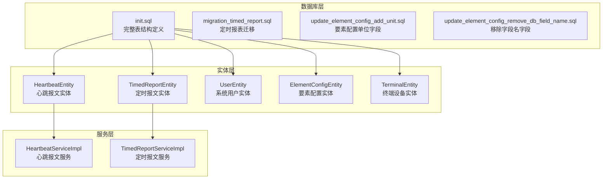
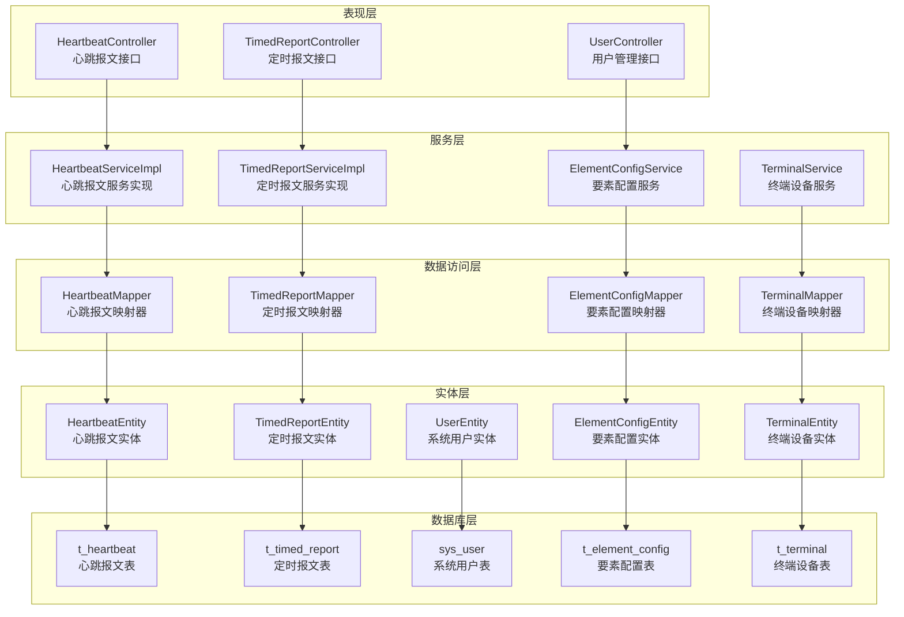
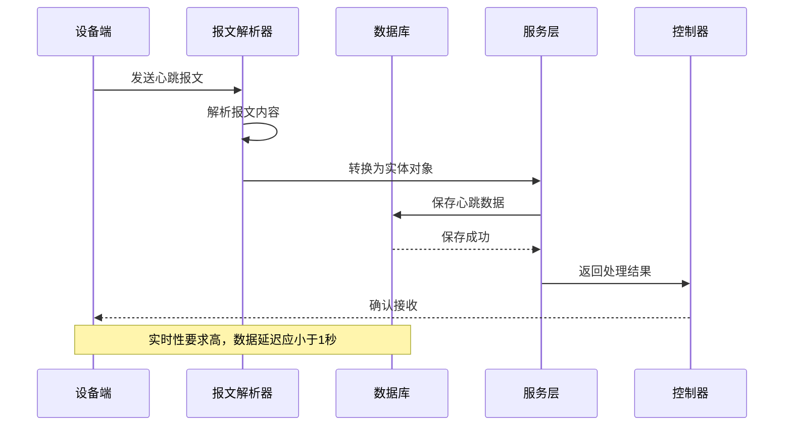
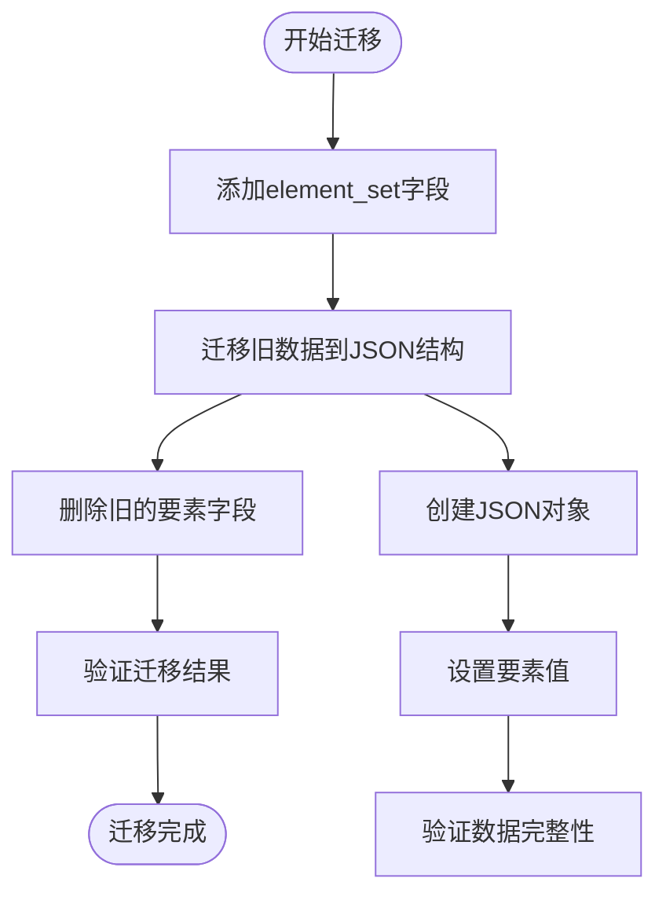
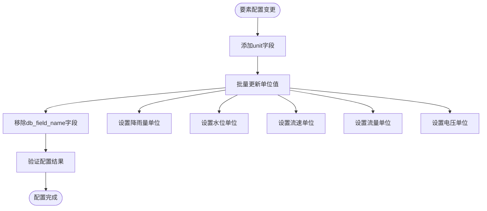
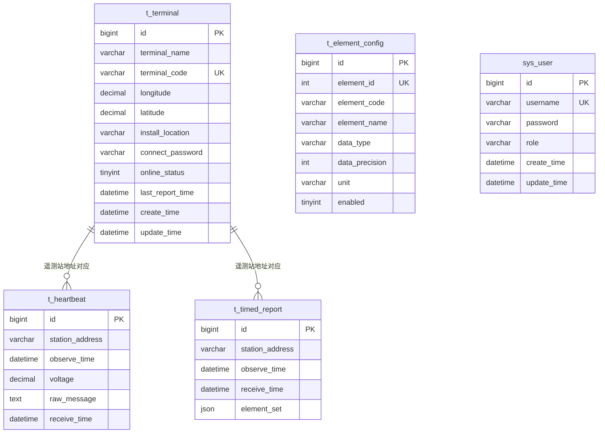

# 数据库表结构设计

<cite>
**本文档引用的文件**
- [init.sql](file://src/main/resources/db/init.sql)
- [migration_timed_report.sql](file://src/main/resources/db/migration_timed_report.sql)
- [update_element_config_add_unit.sql](file://src/main/resources/db/update_element_config_add_unit.sql)
- [update_element_config_remove_db_field_name.sql](file://src/main/resources/db/update_element_config_remove_db_field_name.sql)
- [HeartbeatEntity.java](file://src/main/java/com/hydro/monitor/modules/entity/HeartbeatEntity.java)
- [TimedReportEntity.java](file://src/main/java/com/hydro/monitor/modules/entity/TimedReportEntity.java)
- [UserEntity.java](file://src/main/java/com/hydro/monitor/modules/entity/UserEntity.java)
- [ElementConfigEntity.java](file://src/main/java/com/hydro/monitor/modules/entity/ElementConfigEntity.java)
- [TerminalEntity.java](file://src/main/java/com/hydro/monitor/modules/entity/TerminalEntity.java)
- [TimedReportServiceImpl.java](file://src/main/java/com/hydro/monitor/modules/service/impl/TimedReportServiceImpl.java)
- [HeartbeatServiceImpl.java](file://src/main/java/com/hydro/monitor/modules/service/impl/HeartbeatServiceImpl.java)
- [TimedReportController.java](file://src/main/java/com/hydro/monitor/modules/controller/TimedReportController.java)
- [HeartbeatController.java](file://src/main/java/com/hydro/monitor/modules/controller/HeartbeatController.java)
</cite>

## 目录
1. [简介](#简介)
2. [项目结构](#项目结构)
3. [核心组件](#核心组件)
4. [架构概览](#架构概览)
5. [详细组件分析](#详细组件分析)
6. [依赖分析](#依赖分析)
7. [性能考虑](#性能考虑)
8. [故障排除指南](#故障排除指南)
9. [结论](#结论)
10. [附录](#附录)

## 简介

本文档详细阐述了水文监测系统的数据库表结构设计，重点分析五个核心业务表：心跳报文表(t_heartbeat)、定时报文表(t_timed_report)、系统用户表(sys_user)、要素配置表(t_element_config)和终端设备表(t_terminal)。文档深入解释每个表的设计原理、字段定义、主键外键关系、数据类型选择和约束条件，并提供表设计的最佳实践、规范化设计原则和反规范化考虑。

## 项目结构

水文监测系统采用Spring Boot框架构建，数据库初始化脚本位于resources/db目录下，包含完整的表结构定义和初始数据。实体类文件位于modules/entity包中，对应各个业务表的数据模型。



**图表来源**
- [init.sql:1-93](file://src/main/resources/db/init.sql#L1-L93)
- [HeartbeatEntity.java:1-50](file://src/main/java/com/hydro/monitor/modules/entity/HeartbeatEntity.java#L1-L50)
- [TimedReportEntity.java:1-48](file://src/main/java/com/hydro/monitor/modules/entity/TimedReportEntity.java#L1-L48)

**章节来源**
- [init.sql:1-93](file://src/main/resources/db/init.sql#L1-L93)

## 核心组件

### 心跳报文表(t_heartbeat)

心跳报文表用于存储水文监测终端设备的心跳信号数据，是系统监控设备运行状态的重要数据源。

**表结构设计要点：**
- 主键采用雪花算法生成的64位整数，确保全局唯一性
- 遥测站地址字段支持VARCHAR(50)，满足SL651协议标准
- 电源电压使用DECIMAL(10,3)精确存储，支持三位小数精度
- 原始报文采用TEXT类型存储十六进制字符串
- 提供station_address和observe_time索引优化查询性能

### 定时报文表(t_timed_report)

定时报文表存储实时监测数据，采用JSON格式存储要素集，体现现代数据库对半结构化数据的支持。

**表结构设计要点：**
- 采用JSON字段element_set存储所有监测要素，支持动态扩展
- 通过迁移脚本将原有独立字段统一到JSON结构中
- 支持复杂的要素组合查询和分析
- 保留原始的要素字段便于理解数据结构演进

### 系统用户表(sys_user)

系统用户表负责用户身份管理和权限控制，是系统安全的基础。

**表结构设计要点：**
- 用户名字段设置唯一约束，防止重复注册
- 密码字段存储BCrypt加密后的哈希值
- 角色字段支持多种权限级别
- 自动维护创建和更新时间戳

### 要素配置表(t_element_config)

要素配置表定义了SL651协议中要素标识符与数据库字段的映射关系。

**表结构设计要点：**
- element_id字段唯一标识要素，支持十六进制编码
- element_code作为业务标识符，便于程序处理
- data_precision字段控制数值精度，支持不同要素的精度需求
- unit字段存储要素单位，支持国际化和标准化

### 终端设备表(t_terminal)

终端设备表管理水文监测设备的基本信息和状态。

**表结构设计要点：**
- terminal_code字段唯一标识设备，与遥测站地址对应
- 经纬度使用DECIMAL(10,6)保证地理坐标精度
- online_status字段跟踪设备在线状态
- last_report_time记录设备最后上报时间

**章节来源**
- [HeartbeatEntity.java:15-50](file://src/main/java/com/hydro/monitor/modules/entity/HeartbeatEntity.java#L15-L50)
- [TimedReportEntity.java:15-48](file://src/main/java/com/hydro/monitor/modules/entity/TimedReportEntity.java#L15-L48)
- [UserEntity.java:14-70](file://src/main/java/com/hydro/monitor/modules/entity/UserEntity.java#L14-L70)
- [ElementConfigEntity.java:15-62](file://src/main/java/com/hydro/monitor/modules/entity/ElementConfigEntity.java#L15-L62)
- [TerminalEntity.java:14-74](file://src/main/java/com/hydro/monitor/modules/entity/TerminalEntity.java#L14-L74)

## 架构概览

系统采用分层架构设计，数据库层提供数据持久化，实体层封装数据模型，服务层处理业务逻辑，控制器层提供RESTful接口。



**图表来源**
- [HeartbeatController.java:20-47](file://src/main/java/com/hydro/monitor/modules/controller/HeartbeatController.java#L20-L47)
- [TimedReportController.java:21-111](file://src/main/java/com/hydro/monitor/modules/controller/TimedReportController.java#L21-L111)
- [HeartbeatServiceImpl.java:19-59](file://src/main/java/com/hydro/monitor/modules/service/impl/HeartbeatServiceImpl.java#L19-L59)
- [TimedReportServiceImpl.java:33-332](file://src/main/java/com/hydro/monitor/modules/service/impl/TimedReportServiceImpl.java#L33-L332)

## 详细组件分析

### 心跳报文表(t_heartbeat)详细分析

心跳报文表是系统监控设备运行状态的核心表，设计充分考虑了实时性和可查询性。

**字段详细说明：**

| 字段名 | 数据类型 | 约束条件 | 业务含义 | 取值范围 | 验证规则 |
|--------|----------|----------|----------|----------|----------|
| id | BIGINT | NOT NULL, PRIMARY KEY | 主键ID | 雪花算法生成 | 唯一性，自增长 |
| station_address | VARCHAR(50) | 无 | 遥测站地址 | SL651协议标准 | 遵循协议规范 |
| observe_time | DATETIME | 无 | 观测时间 | 系统时间 | 合理性检查 |
| voltage | DECIMAL(10,3) | 无 | 电源电压(V) | 0-50V | 电压范围验证 |
| raw_message | TEXT | 无 | 原始报文(十六进制) | 十六进制字符串 | 格式验证 |
| receive_time | DATETIME | DEFAULT CURRENT_TIMESTAMP | 接收时间 | 系统时间 | 自动填充 |

**索引设计：**
- idx_station: 基于station_address的普通索引，支持设备查询
- idx_observe_time: 基于observe_time的普通索引，支持时间范围查询

**业务流程序列图：**



**图表来源**
- [HeartbeatServiceImpl.java:26-35](file://src/main/java/com/hydro/monitor/modules/service/impl/HeartbeatServiceImpl.java#L26-L35)
- [HeartbeatController.java:35-45](file://src/main/java/com/hydro/monitor/modules/controller/HeartbeatController.java#L35-L45)

**章节来源**
- [HeartbeatEntity.java:15-50](file://src/main/java/com/hydro/monitor/modules/entity/HeartbeatEntity.java#L15-L50)
- [init.sql:6-17](file://src/main/resources/db/init.sql#L6-L17)

### 定时报文表(t_timed_report)详细分析

定时报文表采用JSON存储要素集的设计体现了现代数据库的灵活性，支持动态要素扩展。

**字段详细说明：**

| 字段名 | 数据类型 | 约束条件 | 业务含义 | 取值范围 | 验证规则 |
|--------|----------|----------|----------|----------|----------|
| id | BIGINT | NOT NULL, PRIMARY KEY | 主键ID | 雪花算法生成 | 唯一性，自增长 |
| station_address | VARCHAR(50) | 无 | 遥测站地址 | SL651协议标准 | 遵循协议规范 |
| observe_time | DATETIME | 无 | 观测时间 | 系统时间 | 合理性检查 |
| receive_time | DATETIME | DEFAULT CURRENT_TIMESTAMP | 接收时间 | 系统时间 | 自动填充 |
| element_set | JSON | 无 | 要素集(JSON格式) | 键值对集合 | JSON格式验证 |

**要素集JSON结构示例：**
```json
{
  "pn05": 2.5,
  "pj": 10.3,
  "z": 125.456,
  "va": 1.234,
  "q": 1.567,
  "qa": 1000.123,
  "vt": 12.5
}
```

**数据迁移流程：**



**图表来源**
- [migration_timed_report.sql:6-38](file://src/main/resources/db/migration_timed_report.sql#L6-L38)
- [TimedReportServiceImpl.java:290-330](file://src/main/java/com/hydro/monitor/modules/service/impl/TimedReportServiceImpl.java#L290-L330)

**章节来源**
- [TimedReportEntity.java:15-48](file://src/main/java/com/hydro/monitor/modules/entity/TimedReportEntity.java#L15-L48)
- [init.sql:19-29](file://src/main/resources/db/init.sql#L19-L29)
- [migration_timed_report.sql:1-44](file://src/main/resources/db/migration_timed_report.sql#L1-L44)

### 系统用户表(sys_user)详细分析

系统用户表采用BCrypt加密存储密码，确保用户信息安全。

**字段详细说明：**

| 字段名 | 数据类型 | 约束条件 | 业务含义 | 取值范围 | 验证规则 |
|--------|----------|----------|----------|----------|----------|
| id | BIGINT | NOT NULL, PRIMARY KEY | 主键ID | 雪花算法生成 | 唯一性，自增长 |
| username | VARCHAR(50) | NOT NULL, UNIQUE | 用户名 | 3-50字符 | 唯一性，字母数字 |
| password | VARCHAR(100) | NOT NULL | 密码(BCrypt加密) | BCrypt哈希值 | 加密存储 |
| role | VARCHAR(50) | DEFAULT 'USER' | 角色 | ADMIN/USER | 枚举值 |
| create_time | DATETIME | DEFAULT CURRENT_TIMESTAMP | 创建时间 | 系统时间 | 自动填充 |
| update_time | DATETIME | DEFAULT CURRENT_TIMESTAMP ON UPDATE CURRENT_TIMESTAMP | 更新时间 | 系统时间 | 自动更新 |

**初始化数据：**
系统包含默认管理员用户，密码经过BCrypt加密处理，确保安全性。

**章节来源**
- [UserEntity.java:14-70](file://src/main/java/com/hydro/monitor/modules/entity/UserEntity.java#L14-L70)
- [init.sql:31-47](file://src/main/resources/db/init.sql#L31-L47)

### 要素配置表(t_element_config)详细分析

要素配置表定义了SL651协议中要素标识符与数据库字段的映射关系，支持动态配置和扩展。

**字段详细说明：**

| 字段名 | 数据类型 | 约束条件 | 业务含义 | 取值范围 | 验证规则 |
|--------|----------|----------|----------|----------|----------|
| id | BIGINT | NOT NULL, PRIMARY KEY | 主键ID | 雪花算法生成 | 唯一性，自增长 |
| element_id | INT | NOT NULL, UNIQUE | 要素标识符(十六进制) | 0x00-0xFF | 十六进制编码 |
| element_code | VARCHAR(50) | NOT NULL | 要素编码 | 如pn05,pj,z | 业务标识符 |
| element_name | VARCHAR(100) | NOT NULL | 要素名称 | 如水位,降雨量 | 描述性文本 |
| data_type | VARCHAR(50) | DEFAULT '数值型' | 数据类型 | 数值型/字符型 | 枚举值 |
| data_precision | INT | DEFAULT 1 | 数据精度(小数位) | 0-6位 | 数值范围 |
| unit | VARCHAR(20) | 无 | 要素单位 | 如mm,m,m/s等 | 单位标准化 |
| enabled | TINYINT | DEFAULT 1 | 是否启用 | 1-启用,0-禁用 | 布尔值 |

**默认要素配置：**

| 要素ID | 要素编码 | 要素名称 | 数据类型 | 精度 | 单位 |
|--------|----------|----------|----------|------|------|
| 0x16 | pn05 | 5分钟时段降雨量 | 数值型 | 1 | mm |
| 0x14 | pj | 当前降雨量 | 数值型 | 1 | mm |
| 0x1D | z | 水位 | 数值型 | 3 | m |
| 0x24 | va | 平均流速 | 数值型 | 3 | m/s |
| 0x1B | q | 瞬时流速 | 数值型 | 3 | m/s |
| 0x1E | qa | 累计流量 | 数值型 | 3 | m³ |
| 0x26 | vt | 电源电压 | 数值型 | 3 | V |

**配置更新流程：**



**图表来源**
- [update_element_config_add_unit.sql:6-17](file://src/main/resources/db/update_element_config_add_unit.sql#L6-L17)
- [update_element_config_remove_db_field_name.sql:6-8](file://src/main/resources/db/update_element_config_remove_db_field_name.sql#L6-L8)

**章节来源**
- [ElementConfigEntity.java:15-62](file://src/main/java/com/hydro/monitor/modules/entity/ElementConfigEntity.java#L15-L62)
- [init.sql:49-73](file://src/main/resources/db/init.sql#L49-L73)
- [update_element_config_add_unit.sql:1-30](file://src/main/resources/db/update_element_config_add_unit.sql#L1-L30)
- [update_element_config_remove_db_field_name.sql:1-21](file://src/main/resources/db/update_element_config_remove_db_field_name.sql#L1-L21)

### 终端设备表(t_terminal)详细分析

终端设备表管理水文监测设备的基本信息和状态，支持地理位置和设备状态跟踪。

**字段详细说明：**

| 字段名 | 数据类型 | 约束条件 | 业务含义 | 取值范围 | 验证规则 |
|--------|----------|----------|----------|----------|----------|
| id | BIGINT | NOT NULL, PRIMARY KEY | 主键ID | 雪花算法生成 | 唯一性，自增长 |
| terminal_name | VARCHAR(100) | 无 | 终端名称 | 1-100字符 | 描述性文本 |
| terminal_code | VARCHAR(50) | NOT NULL, UNIQUE | 终端编号(遥测站编号) | SL651标准 | 唯一性 |
| longitude | DECIMAL(10,6) | 无 | 经度 | -180到180 | 地理坐标范围 |
| latitude | DECIMAL(10,6) | 无 | 纬度 | -90到90 | 地理坐标范围 |
| install_location | VARCHAR(200) | 无 | 安装位置 | 1-200字符 | 地址描述 |
| connect_password | VARCHAR(100) | 无 | 连接密码 | 1-100字符 | 加密存储 |
| online_status | TINYINT | DEFAULT 0 | 在线状态(1-在线,0-离线) | 0或1 | 布尔值 |
| last_report_time | DATETIME | 无 | 最后上报时间 | 系统时间 | 时间戳 |
| create_time | DATETIME | DEFAULT CURRENT_TIMESTAMP | 添加时间 | 系统时间 | 自动填充 |
| update_time | DATETIME | DEFAULT CURRENT_TIMESTAMP ON UPDATE CURRENT_TIMESTAMP | 更新时间 | 系统时间 | 自动更新 |

**索引设计：**
- uk_terminal_code: 唯一索引，确保设备编号唯一性
- idx_online_status: 普通索引，支持在线状态查询
- idx_last_report_time: 普通索引，支持设备活跃度分析

**章节来源**
- [TerminalEntity.java:14-74](file://src/main/java/com/hydro/monitor/modules/entity/TerminalEntity.java#L14-L74)
- [init.sql:75-92](file://src/main/resources/db/init.sql#L75-L92)

## 依赖分析

系统表之间存在明确的依赖关系，通过外键约束保证数据完整性。



**图表来源**
- [init.sql:6-92](file://src/main/resources/db/init.sql#L6-L92)
- [TimedReportServiceImpl.java:198-218](file://src/main/java/com/hydro/monitor/modules/service/impl/TimedReportServiceImpl.java#L198-L218)

**依赖关系说明：**
1. **t_heartbeat与t_terminal**: 通过station_address字段关联，实现设备状态监控
2. **t_timed_report与t_terminal**: 通过station_address字段关联，实现设备数据关联
3. **t_element_config**: 独立配置表，为其他表提供要素配置信息
4. **sys_user**: 独立用户表，不依赖其他业务表

**章节来源**
- [init.sql:6-92](file://src/main/resources/db/init.sql#L6-L92)
- [TimedReportServiceImpl.java:198-218](file://src/main/java/com/hydro/monitor/modules/service/impl/TimedReportServiceImpl.java#L198-L218)

## 性能考虑

### 索引策略

系统采用多维度索引策略优化查询性能：

**热点查询索引：**
- t_heartbeat: idx_station, idx_observe_time
- t_timed_report: idx_station, idx_observe_time  
- t_terminal: idx_online_status, idx_last_report_time

**唯一性约束：**
- sys_user.username: 唯一索引，确保用户名唯一
- t_terminal.terminal_code: 唯一索引，确保设备编号唯一
- t_element_config.element_id: 唯一索引，确保要素标识唯一

### 查询优化建议

1. **时间范围查询**: 利用observe_time索引优化历史数据查询
2. **设备定位查询**: 利用station_address索引快速定位设备数据
3. **状态统计查询**: 利用online_status索引统计设备在线状态
4. **JSON字段查询**: 考虑在高频查询场景下添加虚拟列索引

### 存储优化

1. **JSON存储**: 定时报表采用JSON存储要素集，减少表结构变更成本
2. **数据类型选择**: 精确的数据类型选择平衡存储空间和精度需求
3. **索引维护**: 定期分析和优化索引，避免索引碎片化

## 故障排除指南

### 常见问题及解决方案

**1. 数据插入失败**
- 检查主键冲突，确保雪花算法生成的ID唯一
- 验证唯一性约束，如用户名、设备编号等
- 确认必填字段非空验证

**2. 查询性能问题**
- 检查索引使用情况，确保查询条件命中索引
- 分析执行计划，优化复杂查询
- 考虑分区表策略处理海量历史数据

**3. 数据一致性问题**
- 检查外键约束和级联操作
- 验证事务边界和并发控制
- 确认数据同步机制的有效性

**4. JSON数据解析错误**
- 验证JSON格式的正确性
- 检查要素配置映射关系
- 处理数值精度转换问题

**章节来源**
- [TimedReportServiceImpl.java:290-330](file://src/main/java/com/hydro/monitor/modules/service/impl/TimedReportServiceImpl.java#L290-L330)
- [HeartbeatServiceImpl.java:26-35](file://src/main/java/com/hydro/monitor/modules/service/impl/HeartbeatServiceImpl.java#L26-L35)

## 结论

水文监测系统的数据库表结构设计体现了现代数据库技术的特点，通过合理的规范化设计和必要的反规范化策略，在保证数据一致性的前提下，实现了良好的查询性能和扩展能力。

**设计亮点：**
1. **灵活的JSON存储**: 定时报表采用JSON存储要素集，支持动态扩展
2. **完善的索引策略**: 多维度索引优化关键查询路径
3. **安全的用户管理**: BCrypt加密存储密码，确保用户信息安全
4. **清晰的业务分离**: 各表职责明确，耦合度低
5. **演进式设计**: 通过迁移脚本支持表结构演进

**最佳实践总结：**
- 采用雪花算法生成主键，避免分布式环境下的ID冲突
- 合理选择数据类型，平衡精度和存储空间
- 建立完善的索引体系，支撑高频查询场景
- 实施数据备份和恢复策略，确保数据安全
- 定期进行数据库性能监控和优化

## 附录

### 表设计最佳实践

**规范化设计原则：**
1. **第一范式**: 确保每个字段都是原子值
2. **第二范式**: 消除部分函数依赖
3. **第三范式**: 消除传递函数依赖

**反规范化考虑：**
1. JSON字段存储要素集，提高查询灵活性
2. 缓存常用配置信息，减少查询开销
3. 合理的冗余字段提升查询性能

### 数据类型选择指南

**数值类型选择：**
- DECIMAL用于精确计算，如电压、水位等
- DOUBLE用于科学计算，如流速、流量等
- TINYINT用于布尔值和状态标志

**文本类型选择：**
- VARCHAR用于可变长度字符串
- TEXT用于大文本内容
- JSON用于半结构化数据

### 约束条件清单

**主键约束：**
- 所有表都定义了主键，确保记录唯一性

**唯一性约束：**
- sys_user.username: 用户名唯一
- t_terminal.terminal_code: 设备编号唯一
- t_element_config.element_id: 要素ID唯一

**外键约束：**
- 建议添加外键约束保证引用完整性
- 考虑使用级联更新和删除策略