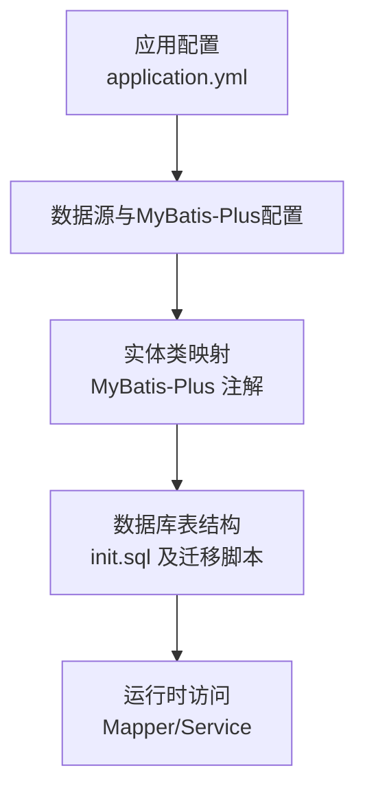
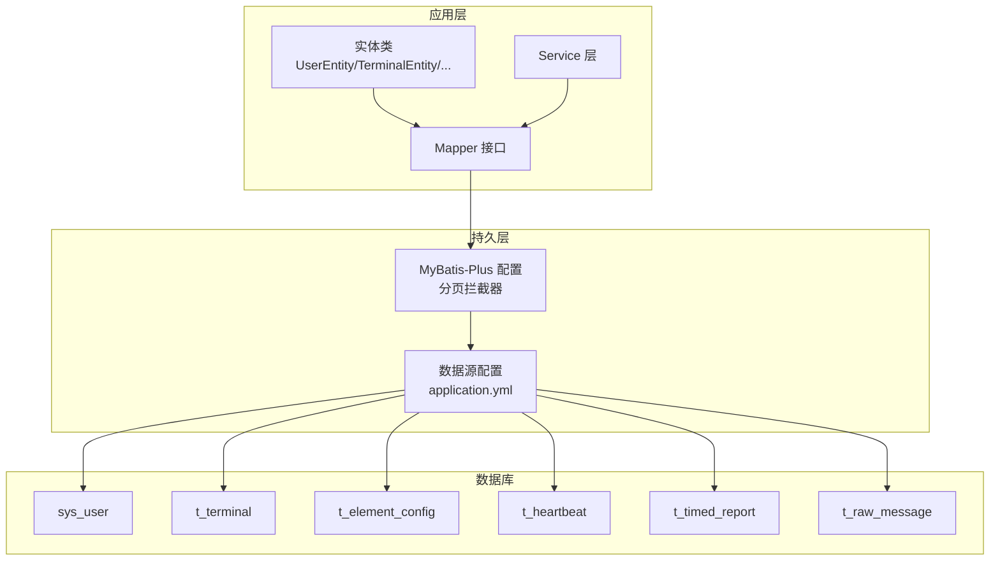
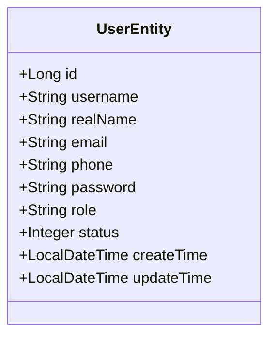
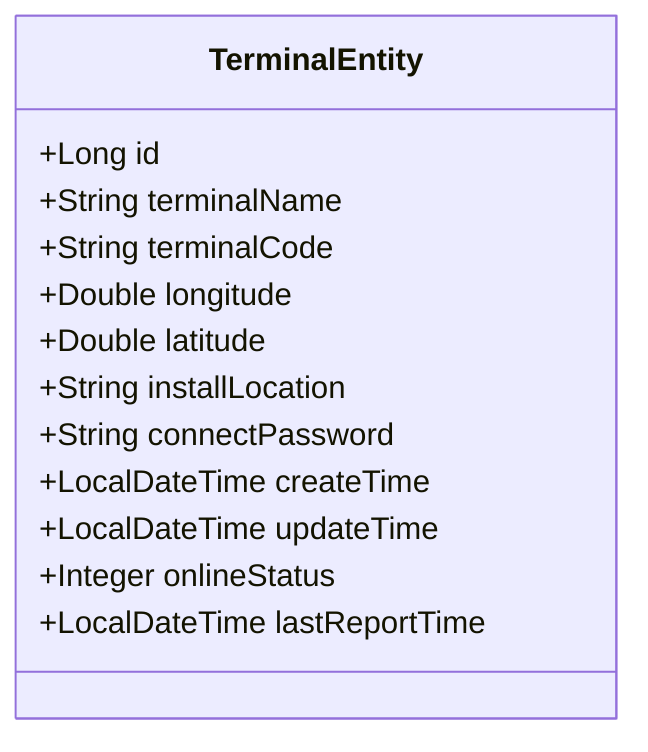
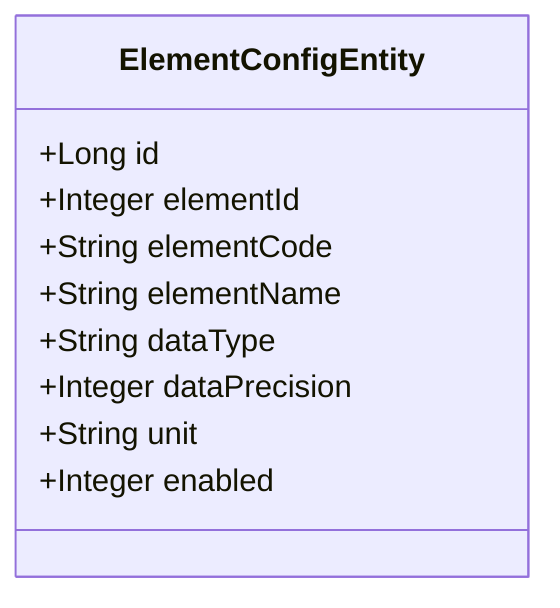
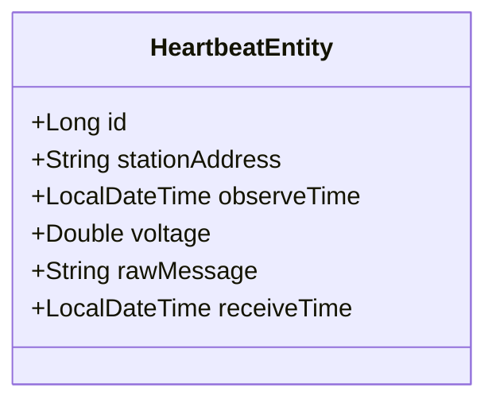
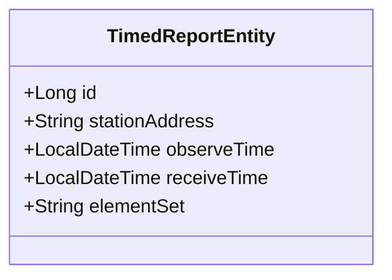
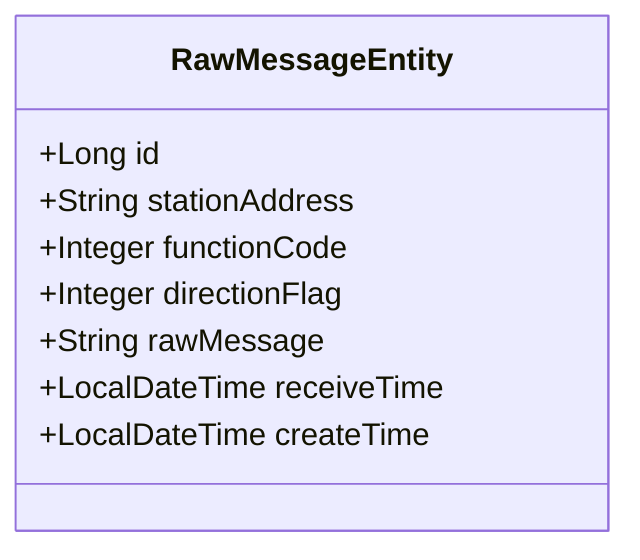
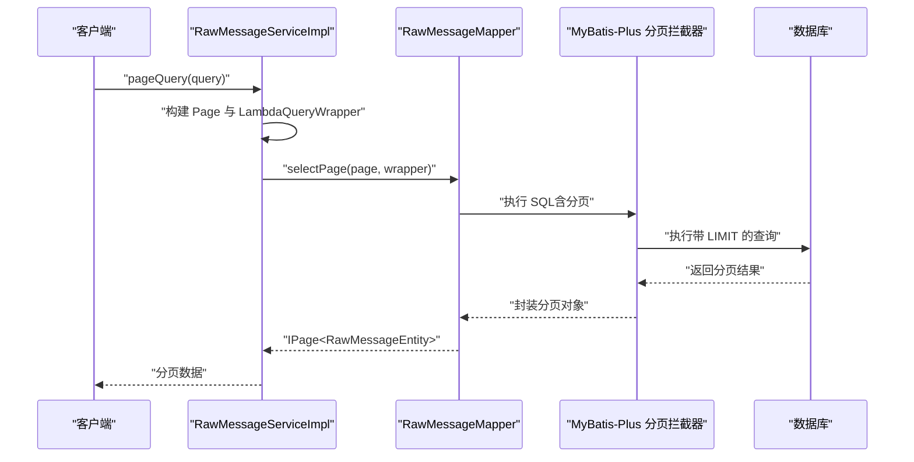
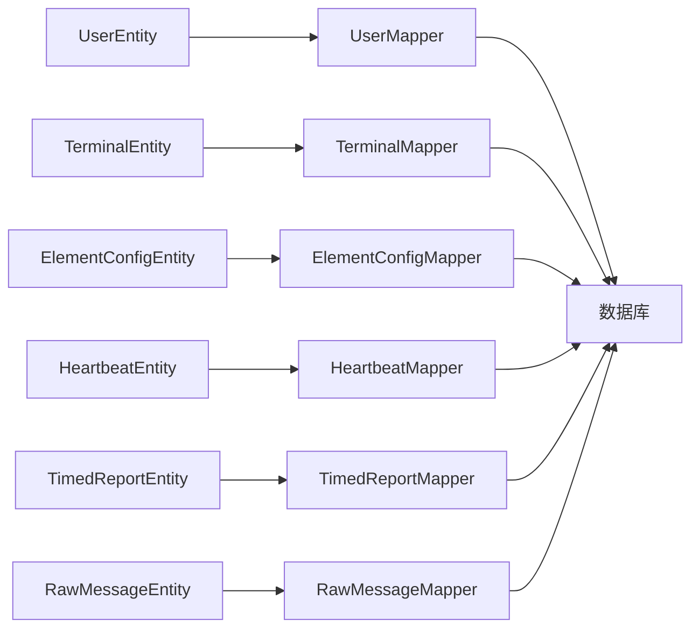

# 数据库设计

<cite>
**本文引用的文件**
- [init.sql](file://src/main/resources/db/init.sql)
- [migration_raw_message.sql](file://src/main/resources/db/migration_raw_message.sql)
- [migration_timed_report.sql](file://src/main/resources/db/migration_timed_report.sql)
- [update_element_config_add_unit.sql](file://src/main/resources/db/update_element_config_add_unit.sql)
- [update_element_config_remove_db_field_name.sql](file://src/main/resources/db/update_element_config_remove_db_field_name.sql)
- [application.yml](file://src/main/resources/application.yml)
- [MyBatisPlusConfig.java](file://src/main/java/com/hydro/monitor/config/MyBatisPlusConfig.java)
- [UserEntity.java](file://src/main/java/com/hydro/monitor/modules/entity/UserEntity.java)
- [TerminalEntity.java](file://src/main/java/com/hydro/monitor/modules/entity/TerminalEntity.java)
- [ElementConfigEntity.java](file://src/main/java/com/hydro/monitor/modules/entity/ElementConfigEntity.java)
- [HeartbeatEntity.java](file://src/main/java/com/hydro/monitor/modules/entity/HeartbeatEntity.java)
- [RawMessageEntity.java](file://src/main/java/com/hydro/monitor/modules/entity/RawMessageEntity.java)
- [TimedReportEntity.java](file://src/main/java/com/hydro/monitor/modules/entity/TimedReportEntity.java)
- [RawMessageMapper.java](file://src/main/java/com/hydro/monitor/modules/mapper/RawMessageMapper.java)
- [TimedReportMapper.java](file://src/main/java/com/hydro/monitor/modules/mapper/TimedReportMapper.java)
- [HeartbeatMapper.java](file://src/main/java/com/hydro/monitor/modules/mapper/HeartbeatMapper.java)
- [ElementConfigMapper.java](file://src/main/java/com/hydro/monitor/modules/mapper/ElementConfigMapper.java)
- [TerminalMapper.java](file://src/main/java/com/hydro/monitor/modules/mapper/TerminalMapper.java)
- [UserMapper.java](file://src/main/java/com/hydro/monitor/modules/mapper/UserMapper.java)
- [RawMessageServiceImpl.java](file://src/main/java/com/hydro/monitor/modules/service/impl/RawMessageServiceImpl.java)
</cite>

## 目录
1. [简介](#简介)
2. [项目结构](#项目结构)
3. [核心组件](#核心组件)
4. [架构总览](#架构总览)
5. [详细组件分析](#详细组件分析)
6. [依赖分析](#依赖分析)
7. [性能考量](#性能考量)
8. [故障排查指南](#故障排查指南)
9. [结论](#结论)
10. [附录](#附录)

## 简介
本文件面向水文监测系统数据库设计，围绕初始化表结构、字段定义与数据类型选择、核心业务表关系、索引与约束、数据完整性、迁移脚本版本管理与回滚策略、性能优化、备份与恢复、监控与容量规划等方面进行系统化梳理。文档同时结合实体类与MyBatis-Plus配置，给出代码级映射关系与运行时行为说明，帮助开发者与DBA高效理解与维护数据库。

## 项目结构
数据库相关资源集中于资源目录下的初始化SQL与迁移脚本，并通过Spring Boot与MyBatis-Plus在运行时进行实体映射与分页配置。核心文件组织如下：
- 初始化与迁移脚本位于 resources/db 目录
- 实体类位于 modules/entity 目录，映射至对应表
- MyBatis-Plus配置位于 config 目录，启用分页与全局ID策略
- 应用配置文件 application.yml 提供数据源与MyBatis-Plus全局配置

图表来源
- [application.yml:1-86](file://src/main/resources/application.yml#L1-L86)
- [MyBatisPlusConfig.java:1-39](file://src/main/java/com/hydro/monitor/config/MyBatisPlusConfig.java#L1-L39)
- [init.sql:1-93](file://src/main/resources/db/init.sql#L1-L93)

章节来源
- [application.yml:1-86](file://src/main/resources/application.yml#L1-L86)
- [MyBatisPlusConfig.java:1-39](file://src/main/java/com/hydro/monitor/config/MyBatisPlusConfig.java#L1-L39)
- [init.sql:1-93](file://src/main/resources/db/init.sql#L1-L93)

## 核心组件
本节聚焦核心业务表：用户表、终端表、要素配置表、心跳报文表、定时报文表与原始报文表。每张表均明确主键、关键字段、索引与约束，并给出字段命名规范与数据类型选择依据。

- 用户表 sys_user
  - 主键：id（雪花ID）
  - 关键字段：username（唯一）、password（BCrypt加密）、role、status（新增实体字段未在初始化脚本中体现，但实体类存在）
  - 时间字段：create_time、update_time（自动维护）
  - 约束：唯一索引 uk_username
  - 设计要点：用户名唯一、角色与状态便于权限控制；时间字段便于审计追踪

- 终端表 t_terminal
  - 主键：id（雪花ID）
  - 关键字段：terminal_code（唯一）、terminal_name、longitude、latitude、install_location、connect_password
  - 状态与时间：online_status、last_report_time、create_time、update_time
  - 约束：唯一索引 uk_terminal_code；常用查询索引 idx_online_status、idx_last_report_time
  - 设计要点：终端编号唯一、经纬度便于地理可视化；状态与上报时间支持在线状态监控

- 要素配置表 t_element_config
  - 主键：id（雪花ID）
  - 关键字段：element_id（唯一）、element_code、element_name、data_type、data_precision、unit、enabled
  - 约束：唯一索引 uk_element_id；索引 idx_enabled
  - 设计要点：要素ID唯一映射，单位字段增强可读性；启用开关便于动态控制

- 心跳报文表 t_heartbeat
  - 主键：id（雪花ID）
  - 关键字段：station_address、observe_time、voltage、raw_message、receive_time
  - 约束：索引 idx_station、idx_observe_time
  - 设计要点：按遥测站与观测时间建立索引，支撑快速检索与聚合统计

- 定时报文表 t_timed_report
  - 主键：id（雪花ID）
  - 关键字段：station_address、observe_time、receive_time、element_set（JSON）
  - 约束：索引 idx_station、idx_observe_time
  - 设计要点：element_set 使用JSON存储多要素集合，简化schema演进；迁移脚本已将旧列转换为JSON

- 原始报文表 t_raw_message
  - 主键：id（雪花ID）
  - 关键字段：station_address、function_code、direction_flag、raw_message、receive_time、create_time
  - 约束：索引 idx_station_address、idx_receive_time、idx_function_code
  - 设计要点：按站址、接收时间与功能码建立索引，满足原始报文检索与审计需求

章节来源
- [init.sql:6-17](file://src/main/resources/db/init.sql#L6-L17)
- [init.sql:19-29](file://src/main/resources/db/init.sql#L19-L29)
- [init.sql:31-41](file://src/main/resources/db/init.sql#L31-L41)
- [init.sql:49-62](file://src/main/resources/db/init.sql#L49-L62)
- [init.sql:75-92](file://src/main/resources/db/init.sql#L75-L92)
- [migration_timed_report.sql:1-44](file://src/main/resources/db/migration_timed_report.sql#L1-L44)
- [migration_raw_message.sql:1-14](file://src/main/resources/db/migration_raw_message.sql#L1-L14)

## 架构总览
下图展示数据库层与应用层的交互关系：实体类通过MyBatis-Plus注解映射到表，应用通过Mapper/Service访问数据库；分页拦截器统一处理分页逻辑；应用配置文件提供数据源与MyBatis-Plus全局设置。

图表来源
- [application.yml:8-32](file://src/main/resources/application.yml#L8-L32)
- [MyBatisPlusConfig.java:23-37](file://src/main/java/com/hydro/monitor/config/MyBatisPlusConfig.java#L23-L37)
- [UserEntity.java:15-69](file://src/main/java/com/hydro/monitor/modules/entity/UserEntity.java#L15-L69)
- [TerminalEntity.java:15-74](file://src/main/java/com/hydro/monitor/modules/entity/TerminalEntity.java#L15-L74)
- [ElementConfigEntity.java:16-61](file://src/main/java/com/hydro/monitor/modules/entity/ElementConfigEntity.java#L16-L61)
- [HeartbeatEntity.java:15-49](file://src/main/java/com/hydro/monitor/modules/entity/HeartbeatEntity.java#L15-L49)
- [TimedReportEntity.java:16-47](file://src/main/java/com/hydro/monitor/modules/entity/TimedReportEntity.java#L16-L47)
- [RawMessageEntity.java:15-54](file://src/main/java/com/hydro/monitor/modules/entity/RawMessageEntity.java#L15-L54)

## 详细组件分析

### 用户表 sys_user
- 字段设计
  - id：雪花ID，保证全局唯一
  - username：唯一索引，登录凭据
  - password：BCrypt加密存储
  - role/status：角色与状态字段（实体类存在，初始化脚本未包含）
  - create_time/update_time：自动维护
- 约束与索引
  - 主键：id
  - 唯一索引：uk_username
- 数据完整性
  - 唯一性约束确保用户名不可重复
  - 时间字段便于审计与合规
- 实体映射
  - @TableName("sys_user") 映射
  - MyBatis-Plus 全局ID策略：assign_id

图表来源
- [UserEntity.java:15-69](file://src/main/java/com/hydro/monitor/modules/entity/UserEntity.java#L15-L69)

章节来源
- [init.sql:31-41](file://src/main/resources/db/init.sql#L31-L41)
- [UserEntity.java:15-69](file://src/main/java/com/hydro/monitor/modules/entity/UserEntity.java#L15-L69)
- [application.yml:28-32](file://src/main/resources/application.yml#L28-L32)

### 终端表 t_terminal
- 字段设计
  - id：雪花ID
  - terminal_code：唯一索引，遥测站编号
  - terminal_name、longitude、latitude、install_location、connect_password
  - online_status、last_report_time、create_time、update_time
- 约束与索引
  - 主键：id
  - 唯一索引：uk_terminal_code
  - 索引：idx_online_status、idx_last_report_time
- 数据完整性
  - 唯一性约束保证终端编号唯一
  - 状态与上报时间支持在线状态监控与离线告警

图表来源
- [TerminalEntity.java:15-74](file://src/main/java/com/hydro/monitor/modules/entity/TerminalEntity.java#L15-L74)

章节来源
- [init.sql:75-92](file://src/main/resources/db/init.sql#L75-L92)
- [TerminalEntity.java:15-74](file://src/main/java/com/hydro/monitor/modules/entity/TerminalEntity.java#L15-L74)

### 要素配置表 t_element_config
- 字段设计
  - id：雪花ID
  - element_id：唯一索引，SL651要素标识符
  - element_code、element_name、data_type、data_precision、unit、enabled
- 约束与索引
  - 主键：id
  - 唯一索引：uk_element_id
  - 索引：idx_enabled
- 数据完整性
  - 唯一性约束保证要素ID映射唯一
  - 启用开关便于动态控制要素采集与展示
- 迁移与演进
  - 迁移脚本增加 unit 字段并填充默认值
  - 移除 db_field_name 字段，简化映射

图表来源
- [ElementConfigEntity.java:16-61](file://src/main/java/com/hydro/monitor/modules/entity/ElementConfigEntity.java#L16-L61)

章节来源
- [init.sql:49-62](file://src/main/resources/db/init.sql#L49-L62)
- [update_element_config_add_unit.sql:1-30](file://src/main/resources/db/update_element_config_add_unit.sql#L1-L30)
- [update_element_config_remove_db_field_name.sql:1-21](file://src/main/resources/db/update_element_config_remove_db_field_name.sql#L1-L21)
- [ElementConfigEntity.java:16-61](file://src/main/java/com/hydro/monitor/modules/entity/ElementConfigEntity.java#L16-L61)

### 心跳报文表 t_heartbeat
- 字段设计
  - id：雪花ID
  - station_address、observe_time、voltage、raw_message、receive_time
- 约束与索引
  - 主键：id
  - 索引：idx_station、idx_observe_time
- 数据完整性
  - 按站址与观测时间建立索引，支撑快速检索与聚合统计

图表来源
- [HeartbeatEntity.java:15-49](file://src/main/java/com/hydro/monitor/modules/entity/HeartbeatEntity.java#L15-L49)

章节来源
- [init.sql:6-17](file://src/main/resources/db/init.sql#L6-L17)
- [HeartbeatEntity.java:15-49](file://src/main/java/com/hydro/monitor/modules/entity/HeartbeatEntity.java#L15-L49)

### 定时报文表 t_timed_report
- 字段设计
  - id：雪花ID
  - station_address、observe_time、receive_time、element_set（JSON）
- 约束与索引
  - 主键：id
  - 索引：idx_station、idx_observe_time
- 数据完整性
  - element_set 使用JSON存储多要素集合，简化schema演进
- 迁移策略
  - 迁移脚本将旧列（如 rain_five_min、water_level 等）合并为 element_set，并删除旧列

图表来源
- [TimedReportEntity.java:16-47](file://src/main/java/com/hydro/monitor/modules/entity/TimedReportEntity.java#L16-L47)

章节来源
- [init.sql:19-29](file://src/main/resources/db/init.sql#L19-L29)
- [migration_timed_report.sql:1-44](file://src/main/resources/db/migration_timed_report.sql#L1-L44)
- [TimedReportEntity.java:16-47](file://src/main/java/com/hydro/monitor/modules/entity/TimedReportEntity.java#L16-L47)

### 原始报文表 t_raw_message
- 字段设计
  - id：雪花ID
  - station_address、function_code、direction_flag、raw_message、receive_time、create_time
- 约束与索引
  - 主键：id
  - 索引：idx_station_address、idx_receive_time、idx_function_code
- 数据完整性
  - 按站址、接收时间与功能码建立索引，满足原始报文检索与审计需求

图表来源
- [RawMessageEntity.java:15-54](file://src/main/java/com/hydro/monitor/modules/entity/RawMessageEntity.java#L15-L54)

章节来源
- [migration_raw_message.sql:1-14](file://src/main/resources/db/migration_raw_message.sql#L1-L14)
- [RawMessageEntity.java:15-54](file://src/main/java/com/hydro/monitor/modules/entity/RawMessageEntity.java#L15-L54)

### 数据库迁移脚本与版本管理
- 初始化脚本
  - 创建数据库与核心表，定义主键、索引与约束
- 迁移脚本
  - 定时报文迁移：将分散字段整合为 JSON 的 element_set，并删除旧列
  - 要素配置扩展：新增 unit 字段并填充默认值；移除 db_field_name 字段
  - 原始报文表：新增表结构与索引
- 版本管理与回滚策略
  - 建议采用“增量脚本+版本号”命名方式（例如 v1.0.1.sql、v1.0.2.sql），每次变更记录变更内容与影响范围
  - 回滚策略：针对DDL变更，优先采用逆向SQL（如 DROP COLUMN、RENAME COLUMN 等）；对于数据变更，采用备份与时间点恢复
  - 迁移执行顺序：先执行基础表结构，再执行字段扩展，最后执行数据迁移与校验

章节来源
- [init.sql:1-93](file://src/main/resources/db/init.sql#L1-L93)
- [migration_timed_report.sql:1-44](file://src/main/resources/db/migration_timed_report.sql#L1-L44)
- [update_element_config_add_unit.sql:1-30](file://src/main/resources/db/update_element_config_add_unit.sql#L1-L30)
- [update_element_config_remove_db_field_name.sql:1-21](file://src/main/resources/db/update_element_config_remove_db_field_name.sql#L1-L21)
- [migration_raw_message.sql:1-14](file://src/main/resources/db/migration_raw_message.sql#L1-L14)

### 查询流程与分页
以下序列图展示原始报文分页查询的典型调用链路，体现实体、Mapper、Service与分页拦截器的协作。

图表来源
- [RawMessageServiceImpl.java:54-67](file://src/main/java/com/hydro/monitor/modules/service/impl/RawMessageServiceImpl.java#L54-L67)
- [RawMessageMapper.java:1-14](file://src/main/java/com/hydro/monitor/modules/mapper/RawMessageMapper.java#L1-L14)
- [MyBatisPlusConfig.java:23-37](file://src/main/java/com/hydro/monitor/config/MyBatisPlusConfig.java#L23-L37)

章节来源
- [RawMessageServiceImpl.java:31-67](file://src/main/java/com/hydro/monitor/modules/service/impl/RawMessageServiceImpl.java#L31-L67)
- [RawMessageMapper.java:1-14](file://src/main/java/com/hydro/monitor/modules/mapper/RawMessageMapper.java#L1-L14)
- [MyBatisPlusConfig.java:23-37](file://src/main/java/com/hydro/monitor/config/MyBatisPlusConfig.java#L23-L37)

## 依赖分析
- 实体类与表映射
  - UserEntity → sys_user
  - TerminalEntity → t_terminal
  - ElementConfigEntity → t_element_config
  - HeartbeatEntity → t_heartbeat
  - TimedReportEntity → t_timed_report
  - RawMessageEntity → t_raw_message
- Mapper 接口与表映射一一对应
- MyBatis-Plus 全局配置
  - ID策略：assign_id（雪花ID）
  - 分页拦截器：MySQL方言，最大单页500条，溢出不处理
- 数据源配置
  - MySQL驱动、URL、账号密码
  - Jackson日期格式与时区

图表来源
- [UserEntity.java:15-69](file://src/main/java/com/hydro/monitor/modules/entity/UserEntity.java#L15-L69)
- [TerminalEntity.java:15-74](file://src/main/java/com/hydro/monitor/modules/entity/TerminalEntity.java#L15-L74)
- [ElementConfigEntity.java:16-61](file://src/main/java/com/hydro/monitor/modules/entity/ElementConfigEntity.java#L16-L61)
- [HeartbeatEntity.java:15-49](file://src/main/java/com/hydro/monitor/modules/entity/HeartbeatEntity.java#L15-L49)
- [TimedReportEntity.java:16-47](file://src/main/java/com/hydro/monitor/modules/entity/TimedReportEntity.java#L16-L47)
- [RawMessageEntity.java:15-54](file://src/main/java/com/hydro/monitor/modules/entity/RawMessageEntity.java#L15-L54)
- [UserMapper.java:1-14](file://src/main/java/com/hydro/monitor/modules/mapper/UserMapper.java#L1-L14)
- [TerminalMapper.java:1-14](file://src/main/java/com/hydro/monitor/modules/mapper/TerminalMapper.java#L1-L14)
- [ElementConfigMapper.java:1-14](file://src/main/java/com/hydro/monitor/modules/mapper/ElementConfigMapper.java#L1-L14)
- [HeartbeatMapper.java:1-14](file://src/main/java/com/hydro/monitor/modules/mapper/HeartbeatMapper.java#L1-L14)
- [TimedReportMapper.java:1-14](file://src/main/java/com/hydro/monitor/modules/mapper/TimedReportMapper.java#L1-L14)
- [RawMessageMapper.java:1-14](file://src/main/java/com/hydro/monitor/modules/mapper/RawMessageMapper.java#L1-L14)

章节来源
- [application.yml:8-32](file://src/main/resources/application.yml#L8-L32)
- [MyBatisPlusConfig.java:23-37](file://src/main/java/com/hydro/monitor/config/MyBatisPlusConfig.java#L23-L37)

## 性能考量
- 索引策略
  - t_heartbeat：按 station_address 与 observe_time 建立索引，支持站点与时间维度查询
  - t_timed_report：按 station_address 与 observe_time 建立索引，配合 JSON element_set 查询
  - t_terminal：按 online_status 与 last_report_time 建立索引，支持在线状态与离线告警
  - t_raw_message：按 station_address、receive_time、function_code 建立索引，满足原始报文检索
- 分页与查询
  - 使用 MyBatis-Plus 分页拦截器，限制单页最大500条，避免大结果集导致内存压力
  - 查询条件尽量使用索引列，避免全表扫描
- 数据类型选择
  - 数值型字段使用 DECIMAL 保证精度（如电压、水位、流速等）
  - JSON 存储多要素集合，降低schema变更成本
- 写入优化
  - 原始报文入库采用批量写入策略（结合业务实现），减少事务开销
  - 对高频写入表（如 t_raw_message、t_heartbeat、t_timed_report）建议分区或归档策略

## 故障排查指南
- 常见问题与定位
  - 插入失败：检查唯一索引冲突（如 uk_username、uk_terminal_code、uk_element_id）
  - 查询慢：确认是否命中索引；避免对索引列使用函数或隐式转换
  - 分页异常：确认分页参数与最大限制；检查分页拦截器配置
- 日志与监控
  - 开启MyBatis日志输出，定位SQL执行细节
  - 结合应用日志查看服务层异常堆栈与错误信息
- 备份与恢复
  - 建议采用定时全量备份+增量备份策略，保留至少7天的恢复点
  - 对高频写入表定期归档历史数据，控制单表规模

章节来源
- [RawMessageServiceImpl.java:31-67](file://src/main/java/com/hydro/monitor/modules/service/impl/RawMessageServiceImpl.java#L31-L67)
- [application.yml:24-26](file://src/main/resources/application.yml#L24-L26)

## 结论
本数据库设计方案以“可演进、可扩展、可维护”为目标，通过雪花ID保证全局唯一性，通过JSON存储提升schema灵活性，通过索引与分页拦截器保障查询性能。迁移脚本清晰记录了历史变更，建议在生产环境中严格执行版本管理与回滚策略。结合合理的索引与数据类型选择，系统可在高并发场景下保持稳定与高效。

## 附录
- 数据库初始化与迁移脚本路径
  - 初始化：[init.sql](file://src/main/resources/db/init.sql)
  - 定时报文迁移：[migration_timed_report.sql](file://src/main/resources/db/migration_timed_report.sql)
  - 要素配置扩展（新增单位）：[update_element_config_add_unit.sql](file://src/main/resources/db/update_element_config_add_unit.sql)
  - 要素配置清理（移除字段）：[update_element_config_remove_db_field_name.sql](file://src/main/resources/db/update_element_config_remove_db_field_name.sql)
  - 原始报文表：[migration_raw_message.sql](file://src/main/resources/db/migration_raw_message.sql)
- 应用配置与MyBatis-Plus配置
  - 数据源与MyBatis-Plus配置：[application.yml](file://src/main/resources/application.yml)
  - 分页拦截器配置：[MyBatisPlusConfig.java](file://src/main/java/com/hydro/monitor/config/MyBatisPlusConfig.java)
- 实体类与Mapper映射
  - 用户表实体与Mapper：[UserEntity.java](file://src/main/java/com/hydro/monitor/modules/entity/UserEntity.java)、[UserMapper.java](file://src/main/java/com/hydro/monitor/modules/mapper/UserMapper.java)
  - 终端表实体与Mapper：[TerminalEntity.java](file://src/main/java/com/hydro/monitor/modules/entity/TerminalEntity.java)、[TerminalMapper.java](file://src/main/java/com/hydro/monitor/modules/mapper/TerminalMapper.java)
  - 要素配置实体与Mapper：[ElementConfigEntity.java](file://src/main/java/com/hydro/monitor/modules/entity/ElementConfigEntity.java)、[ElementConfigMapper.java](file://src/main/java/com/hydro/monitor/modules/mapper/ElementConfigMapper.java)
  - 心跳报文实体与Mapper：[HeartbeatEntity.java](file://src/main/java/com/hydro/monitor/modules/entity/HeartbeatEntity.java)、[HeartbeatMapper.java](file://src/main/java/com/hydro/monitor/modules/mapper/HeartbeatMapper.java)
  - 定时报文实体与Mapper：[TimedReportEntity.java](file://src/main/java/com/hydro/monitor/modules/entity/TimedReportEntity.java)、[TimedReportMapper.java](file://src/main/java/com/hydro/monitor/modules/mapper/TimedReportMapper.java)
  - 原始报文实体与Mapper：[RawMessageEntity.java](file://src/main/java/com/hydro/monitor/modules/entity/RawMessageEntity.java)、[RawMessageMapper.java](file://src/main/java/com/hydro/monitor/modules/mapper/RawMessageMapper.java)