# 数据库迁移管理

<cite>
**本文档引用的文件**
- [init.sql](file://src/main/resources/db/init.sql)
- [migration_raw_message.sql](file://src/main/resources/db/migration_raw_message.sql)
- [migration_timed_report.sql](file://src/main/resources/db/migration_timed_report.sql)
- [update_element_config_add_unit.sql](file://src/main/resources/db/update_element_config_add_unit.sql)
- [update_element_config_remove_db_field_name.sql](file://src/main/resources/db/update_element_config_remove_db_field_name.sql)
- [application.yml](file://src/main/resources/application.yml)
- [HydroMonitorApplication.java](file://src/main/java/com/hydro/monitor/HydroMonitorApplication.java)
- [RawMessageEntity.java](file://src/main/java/com/hydro/monitor/modules/entity/RawMessageEntity.java)
- [TimedReportEntity.java](file://src/main/java/com/hydro/monitor/modules/entity/TimedReportEntity.java)
- [ElementConfigEntity.java](file://src/main/java/com/hydro/monitor/modules/entity/ElementConfigEntity.java)
- [README.md](file://README.md)
- [check-raw-message.bat](file://check-raw-message.bat)
</cite>

## 目录
1. [简介](#简介)
2. [项目结构](#项目结构)
3. [核心组件](#核心组件)
4. [架构概览](#架构概览)
5. [详细组件分析](#详细组件分析)
6. [依赖关系分析](#依赖关系分析)
7. [性能考虑](#性能考虑)
8. [故障排除指南](#故障排除指南)
9. [结论](#结论)

## 简介

本文件详细阐述水文监测系统的数据库迁移管理策略。系统采用MySQL作为数据存储，通过一系列精心设计的SQL脚本实现数据库版本管理和结构演进。项目包含初始数据库脚本和多个迁移脚本，涵盖了从基础表结构到复杂数据迁移的完整生命周期管理。

## 项目结构

水文监测系统的数据库迁移管理采用文件驱动的方式，所有数据库相关的变更都通过SQL脚本进行管理：

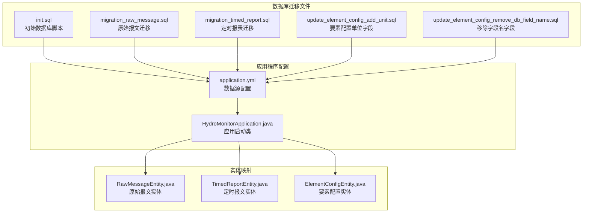

**图表来源**
- [init.sql:1-93](file://src/main/resources/db/init.sql#L1-L93)
- [application.yml:1-86](file://src/main/resources/application.yml#L1-L86)
- [HydroMonitorApplication.java:1-36](file://src/main/java/com/hydro/monitor/HydroMonitorApplication.java#L1-L36)

**章节来源**
- [init.sql:1-93](file://src/main/resources/db/init.sql#L1-L93)
- [application.yml:1-86](file://src/main/resources/application.yml#L1-L86)

## 核心组件

### 初始数据库脚本 (init.sql)

初始脚本负责建立整个数据库的基础结构，包含以下核心表：

1. **心跳报文表 (t_heartbeat)**: 存储遥测站的心跳信息
2. **定时报文表 (t_timed_report)**: 实时监测数据的主表
3. **系统用户表 (sys_user)**: 用户认证和权限管理
4. **要素配置表 (t_element_config)**: 监测要素的配置信息
5. **终端设备表 (t_terminal)**: 遥测终端设备信息

每个表都包含了适当的索引设计以优化查询性能，特别是针对常用查询条件如遥测站地址和观测时间的索引。

### 迁移脚本集合

系统包含多个专门的迁移脚本来处理不同的数据库变更场景：

1. **原始报文迁移脚本**: 用于创建独立的原始报文记录表
2. **定时报表迁移脚本**: 处理复杂的结构变更和数据迁移
3. **要素配置更新脚本**: 添加新字段和移除过时字段

**章节来源**
- [init.sql:6-93](file://src/main/resources/db/init.sql#L6-L93)
- [migration_raw_message.sql:1-14](file://src/main/resources/db/migration_raw_message.sql#L1-L14)
- [migration_timed_report.sql:1-44](file://src/main/resources/db/migration_timed_report.sql#L1-L44)

## 架构概览

水文监测系统的数据库架构采用分层设计，确保数据的一致性和可维护性：

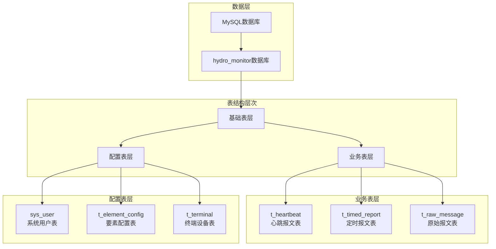

**图表来源**
- [init.sql:6-93](file://src/main/resources/db/init.sql#L6-L93)
- [migration_raw_message.sql:2-13](file://src/main/resources/db/migration_raw_message.sql#L2-L13)

### 数据模型关系

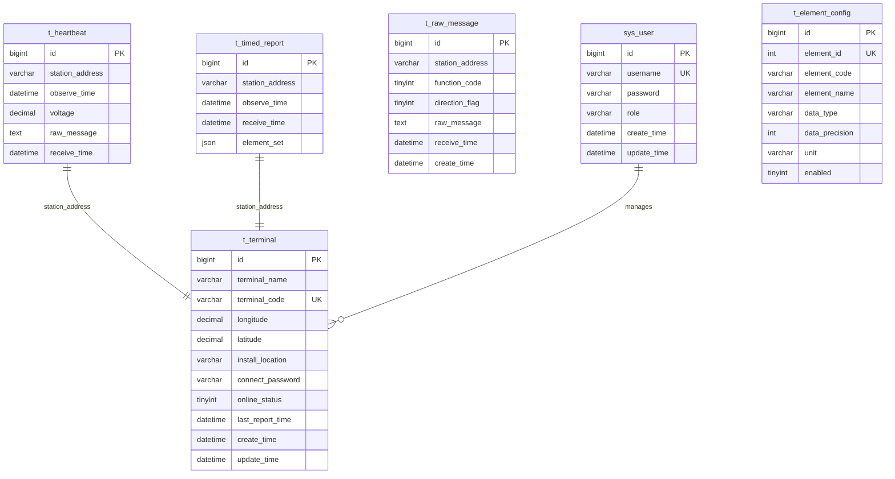

**图表来源**
- [init.sql:6-93](file://src/main/resources/db/init.sql#L6-L93)
- [RawMessageEntity.java:15-55](file://src/main/java/com/hydro/monitor/modules/entity/RawMessageEntity.java#L15-L55)
- [TimedReportEntity.java:15-48](file://src/main/java/com/hydro/monitor/modules/entity/TimedReportEntity.java#L15-L48)
- [ElementConfigEntity.java:15-61](file://src/main/java/com/hydro/monitor/modules/entity/ElementConfigEntity.java#L15-L61)

## 详细组件分析

### 迁移脚本命名规范

系统采用清晰的命名约定来标识不同类型的数据库迁移：

| 脚本类型 | 命名模式 | 示例 | 用途 |
|---------|---------|------|------|
| 初始脚本 | init.sql | init.sql | 创建完整数据库结构 |
| 表结构迁移 | migration_[表名].sql | migration_raw_message.sql | 新增或修改表结构 |
| 数据更新 | update_[表名]_[操作].sql | update_element_config_add_unit.sql | 更新现有数据 |
| 字段变更 | [操作]_[表名]_[字段].sql | update_element_config_remove_db_field_name.sql | 添加或删除字段 |

### 迁移执行顺序和依赖关系

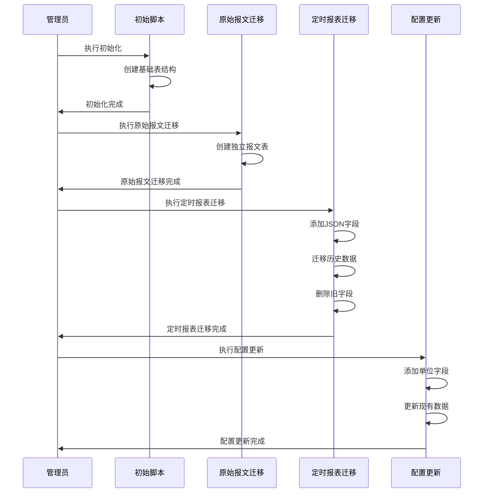

**图表来源**
- [README.md:22-27](file://README.md#L22-L27)
- [migration_timed_report.sql:6-38](file://src/main/resources/db/migration_timed_report.sql#L6-L38)

### 数据库结构变更处理

#### 新增字段策略

系统通过ALTER TABLE语句实现字段的动态添加，采用以下策略：

1. **字段添加**: 使用ADD COLUMN语句添加新字段
2. **数据填充**: 通过UPDATE语句为现有记录填充默认值
3. **索引创建**: 为新字段创建适当的索引以优化查询性能

#### 字段类型修改

字段类型修改采用安全的迁移方式：

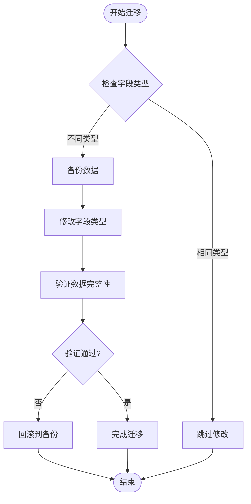

**图表来源**
- [migration_timed_report.sql:11-27](file://src/main/resources/db/migration_timed_report.sql#L11-L27)

#### 索引管理

系统为关键查询字段建立了多级索引策略：

| 表名 | 索引类型 | 字段 | 用途 |
|------|---------|------|------|
| t_heartbeat | 主键 | id | 唯一标识 |
| t_heartbeat | 普通索引 | station_address | 遥测站查询 |
| t_heartbeat | 普通索引 | observe_time | 时间范围查询 |
| t_timed_report | 主键 | id | 唯一标识 |
| t_timed_report | 普通索引 | station_address | 遥测站查询 |
| t_timed_report | 普通索引 | observe_time | 时间范围查询 |
| sys_user | 主键 | id | 唯一标识 |
| sys_user | 唯一索引 | username | 用户名唯一性 |
| t_element_config | 主键 | id | 唯一标识 |
| t_element_config | 唯一索引 | element_id | 要素唯一性 |
| t_element_config | 普通索引 | enabled | 启用状态查询 |
| t_terminal | 主键 | id | 唯一标识 |
| t_terminal | 唯一索引 | terminal_code | 终端编号唯一性 |
| t_terminal | 普通索引 | online_status | 在线状态查询 |
| t_terminal | 普通索引 | last_report_time | 最后上报时间 |

**章节来源**
- [init.sql:15-16](file://src/main/resources/db/init.sql#L15-L16)
- [init.sql:27-28](file://src/main/resources/db/init.sql#L27-L28)
- [init.sql:59-62](file://src/main/resources/db/init.sql#L59-L62)
- [init.sql:89-92](file://src/main/resources/db/init.sql#L89-L92)

### 幂等性设计

系统通过多种机制确保迁移脚本的幂等性：

#### 唯一约束检查

```sql
-- 使用IF NOT EXISTS防止重复创建
CREATE TABLE IF NOT EXISTS `table_name` (...);

-- 使用唯一索引防止重复数据
UNIQUE INDEX `uk_column` (`column_name`);
```

#### 条件更新策略

```sql
-- 使用ON DUPLICATE KEY UPDATE避免重复插入
INSERT INTO table (...) VALUES (...) 
ON DUPLICATE KEY UPDATE column = column;

-- 使用WHERE条件限制更新范围
UPDATE table SET column = value WHERE condition;
```

#### 数据验证机制

每个迁移脚本都包含验证步骤来确认迁移结果：

```sql
-- 验证迁移结果
SELECT COUNT(*) AS total_records,
       COUNT(`element_set`) AS records_with_element_set
FROM `table_name`;
```

**章节来源**
- [init.sql:45-47](file://src/main/resources/db/init.sql#L45-L47)
- [migration_timed_report.sql:41-43](file://src/main/resources/db/migration_timed_report.sql#L41-L43)

### 回滚机制

系统提供了多层次的回滚保护机制：

#### 数据备份策略

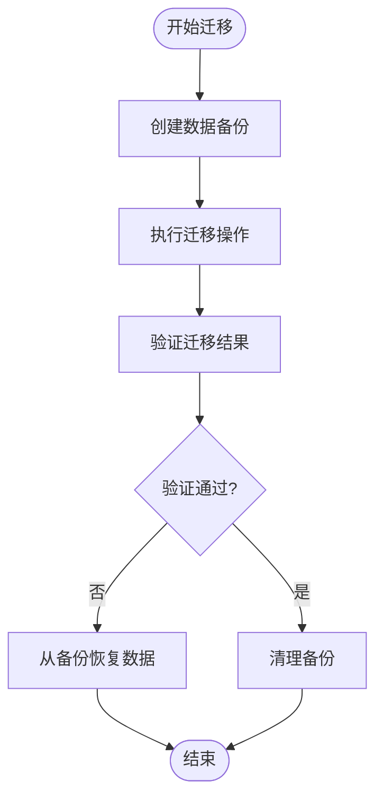

#### 结构回滚方法

对于表结构变更，系统采用以下回滚策略：

1. **字段删除回滚**: 通过重新添加字段和恢复数据
2. **表重建回滚**: 通过备份表恢复到之前的状态
3. **索引管理**: 通过DROP INDEX和CREATE INDEX实现索引的回滚

**章节来源**
- [migration_timed_report.sql:29-38](file://src/main/resources/db/migration_timed_report.sql#L29-L38)

## 依赖关系分析

### 数据库配置依赖

系统通过application.yml文件集中管理数据库连接配置：

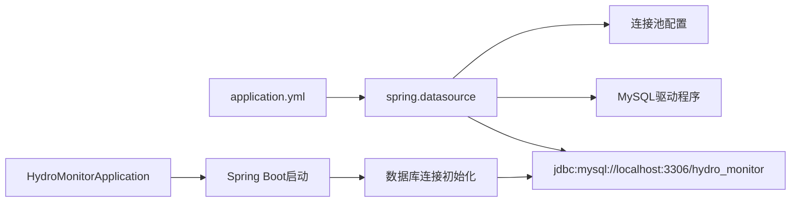

**图表来源**
- [application.yml:8-13](file://src/main/resources/application.yml#L8-L13)
- [HydroMonitorApplication.java:15-16](file://src/main/java/com/hydro/monitor/HydroMonitorApplication.java#L15-L16)

### 实体类映射关系

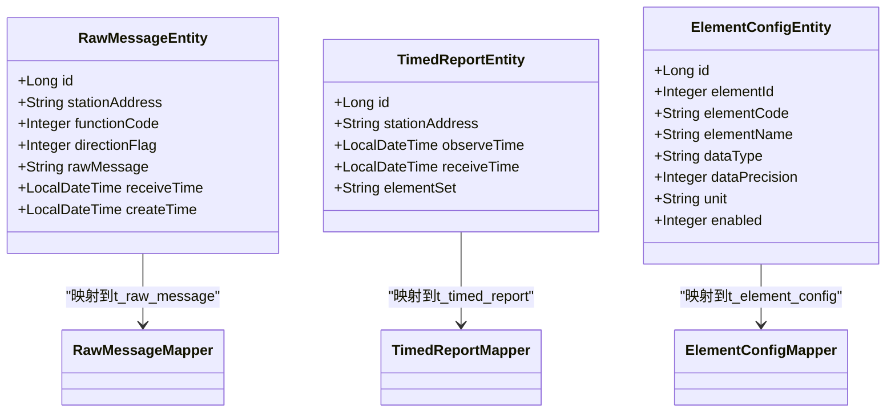

**图表来源**
- [RawMessageEntity.java:15-55](file://src/main/java/com/hydro/monitor/modules/entity/RawMessageEntity.java#L15-L55)
- [TimedReportEntity.java:15-48](file://src/main/java/com/hydro/monitor/modules/entity/TimedReportEntity.java#L15-L48)
- [ElementConfigEntity.java:15-61](file://src/main/java/com/hydro/monitor/modules/entity/ElementConfigEntity.java#L15-L61)

**章节来源**
- [application.yml:8-32](file://src/main/resources/application.yml#L8-L32)
- [HydroMonitorApplication.java:12-13](file://src/main/java/com/hydro/monitor/HydroMonitorApplication.java#L12-L13)

## 性能考虑

### 查询性能优化

系统通过合理的索引设计和查询优化策略提升整体性能：

#### 索引策略

1. **主键索引**: 为所有表的主键建立唯一索引
2. **业务索引**: 为常用查询条件建立普通索引
3. **组合索引**: 为复合查询条件建立组合索引

#### 查询优化

```sql
-- 使用EXPLAIN分析查询计划
EXPLAIN SELECT * FROM table WHERE condition;

-- 优化COUNT查询
SELECT COUNT(*) FROM table;
```

### 数据存储优化

#### JSON字段设计

定时报文表采用JSON字段存储要素集，提供了灵活的数据结构：

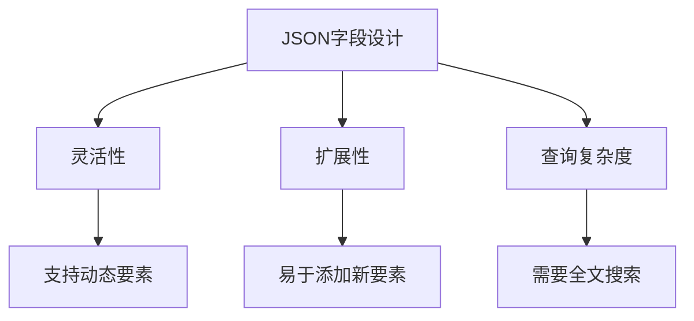

**图表来源**
- [migration_timed_report.sql:7-8](file://src/main/resources/db/migration_timed_report.sql#L7-L8)
- [TimedReportEntity.java:42-46](file://src/main/java/com/hydro/monitor/modules/entity/TimedReportEntity.java#L42-L46)

## 故障排除指南

### 常见迁移问题及解决方案

#### 数据库连接问题

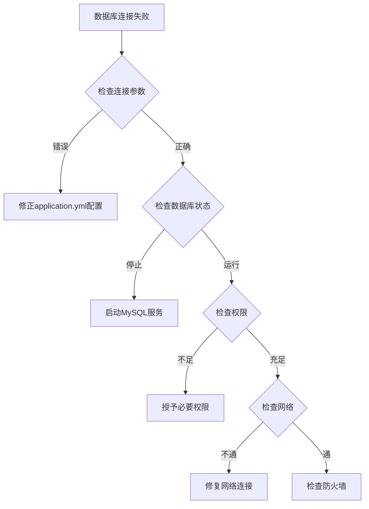

#### 迁移脚本执行失败

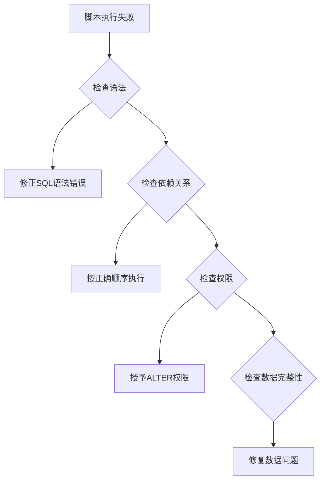

### 诊断工具使用

系统提供了专门的诊断工具来帮助定位问题：

#### 原始报文诊断脚本

```batch
@echo off
echo ========================================
echo 原始报文保存问题诊断工具
echo ========================================
echo.

REM 检查数据库表是否存在
echo [1/3] 检查数据库表 t_raw_message 是否存在...
mysql -u root -p12345678 hydro_monitor -e "SHOW TABLES LIKE 't_raw_message';" 2>nul
if %errorlevel% neq 0 (
    echo ❌ 数据库连接失败或表不存在
    echo.
    echo 请执行以下SQL创建表:
    echo mysql -u root -p12345678 hydro_monitor ^< src\main\resources\db\migration_raw_message.sql
    goto :end
) else (
    echo ✅ 数据库表存在
)
echo.

REM 检查表中是否有数据
echo [2/3] 检查表中数据...
mysql -u root -p12345678 hydro_monitor -e "SELECT COUNT(*) as total FROM t_raw_message;" 2>nul
echo.

REM 检查最近的记录
echo [3/3] 查看最近5条记录...
mysql -u root -p12345678 hydro_monitor -e "SELECT id, station_address, function_code, direction_flag, LEFT(raw_message, 40) as raw_msg_preview, receive_time FROM t_raw_message ORDER BY receive_time DESC LIMIT 5;" 2>nul
echo.

echo ========================================
echo 诊断完成
echo ========================================
echo.
echo 如果表不存在，请执行:
echo   mysql -u root -p12345678 hydro_monitor ^< src\main\resources\db\migration_raw_message.sql
echo.
echo 如果表为空，请检查:
echo   1. Netty服务是否启动（端口9000）
echo   2. 是否有终端发送报文
echo   3. 应用日志中是否有错误信息
echo.
```

**图表来源**
- [check-raw-message.bat:1-46](file://check-raw-message.bat#L1-L46)

### 生产环境安全执行

#### 执行前准备

1. **备份数据库**: 在执行任何迁移前创建完整备份
2. **测试环境验证**: 先在测试环境验证迁移脚本
3. **停机窗口规划**: 选择业务低峰期执行迁移
4. **监控准备**: 准备好监控和告警机制

#### 执行过程监控

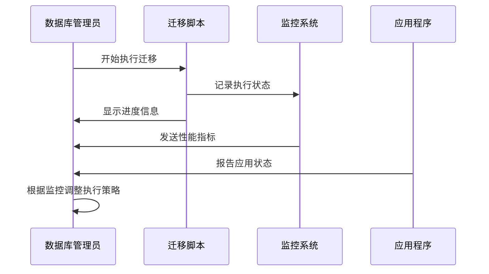

#### 回滚预案

1. **立即回滚**: 如果发现严重问题，立即执行回滚脚本
2. **数据恢复**: 从备份恢复到迁移前的状态
3. **服务恢复**: 重新启动应用程序
4. **问题分析**: 分析失败原因并修复

**章节来源**
- [check-raw-message.bat:8-19](file://check-raw-message.bat#L8-L19)
- [check-raw-message.bat:22-29](file://check-raw-message.bat#L22-L29)

## 结论

水文监测系统的数据库迁移管理展现了良好的工程实践，通过精心设计的脚本体系实现了数据库结构的平滑演进。系统采用的幂等性设计、完善的回滚机制和全面的监控策略确保了迁移过程的安全性和可靠性。

### 关键优势

1. **清晰的版本管理**: 通过命名规范和执行顺序确保迁移的有序性
2. **强大的回滚能力**: 多层次的回滚保护机制应对各种突发情况
3. **性能优化**: 合理的索引设计和查询优化策略
4. **安全性保障**: 完善的权限控制和监控机制
5. **可维护性**: 清晰的代码结构和详细的文档说明

### 最佳实践建议

1. **持续集成**: 将数据库迁移纳入CI/CD流程
2. **自动化测试**: 建立数据库迁移的自动化测试框架
3. **文档更新**: 及时更新迁移文档和变更日志
4. **团队培训**: 确保团队成员了解迁移流程和最佳实践
5. **定期审计**: 定期审查数据库结构和迁移策略的有效性

通过遵循这些原则和实践，水文监测系统能够确保数据库的稳定演进，为业务的持续发展提供可靠的数据基础设施。