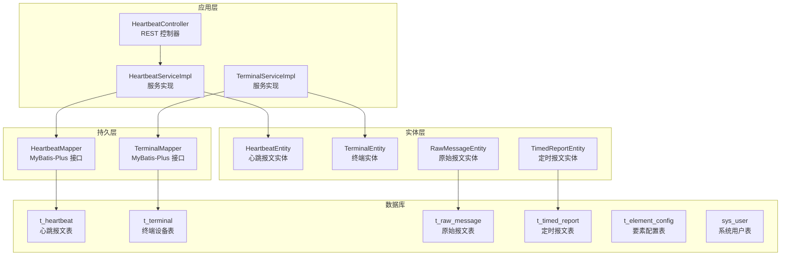
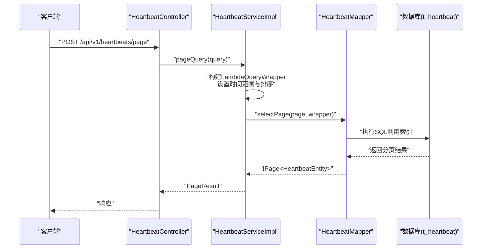
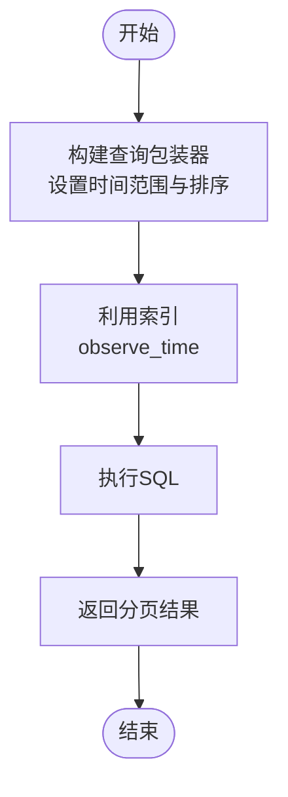
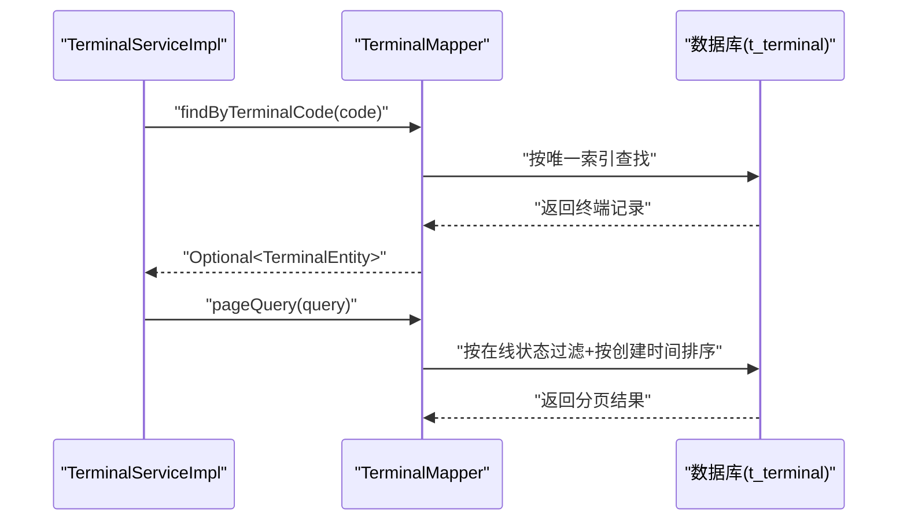
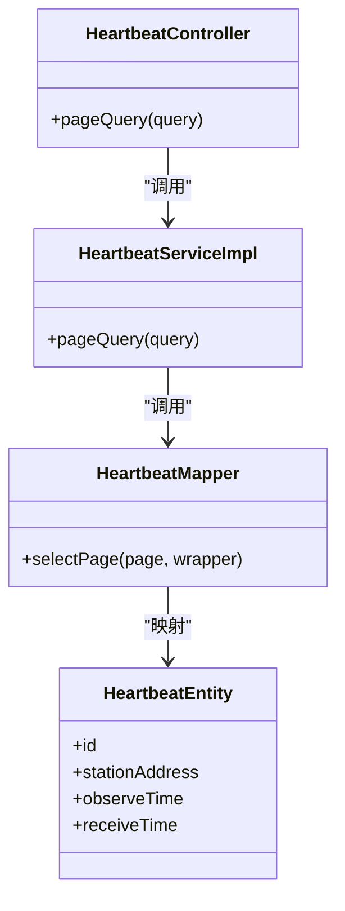

# 索引策略设计

<cite>
**本文引用的文件**
- [init.sql](file://src/main/resources/db/init.sql)
- [migration_raw_message.sql](file://src/main/resources/db/migration_raw_message.sql)
- [migration_timed_report.sql](file://src/main/resources/db/migration_timed_report.sql)
- [application.yml](file://src/main/resources/application.yml)
- [HeartbeatEntity.java](file://src/main/java/com/hydro/monitor/modules/entity/HeartbeatEntity.java)
- [TerminalEntity.java](file://src/main/java/com/hydro/monitor/modules/entity/TerminalEntity.java)
- [RawMessageEntity.java](file://src/main/java/com/hydro/monitor/modules/entity/RawMessageEntity.java)
- [TimedReportEntity.java](file://src/main/java/com/hydro/monitor/modules/entity/TimedReportEntity.java)
- [HeartbeatMapper.java](file://src/main/java/com/hydro/monitor/modules/mapper/HeartbeatMapper.java)
- [TerminalMapper.java](file://src/main/java/com/hydro/monitor/modules/mapper/TerminalMapper.java)
- [HeartbeatQueryDTO.java](file://src/main/java/com/hydro/monitor/modules/dto/HeartbeatQueryDTO.java)
- [TerminalQueryDTO.java](file://src/main/java/com/hydro/monitor/modules/dto/TerminalQueryDTO.java)
- [HeartbeatServiceImpl.java](file://src/main/java/com/hydro/monitor/modules/service/impl/HeartbeatServiceImpl.java)
- [TerminalServiceImpl.java](file://src/main/java/com/hydro/monitor/modules/service/impl/TerminalServiceImpl.java)
- [HeartbeatController.java](file://src/main/java/com/hydro/monitor/modules/controller/HeartbeatController.java)
</cite>

## 目录
1. [简介](#简介)
2. [项目结构](#项目结构)
3. [核心组件](#核心组件)
4. [架构总览](#架构总览)
5. [详细组件分析](#详细组件分析)
6. [依赖关系分析](#依赖关系分析)
7. [性能考量](#性能考量)
8. [故障排查指南](#故障排查指南)
9. [结论](#结论)
10. [附录](#附录)

## 简介
本文件面向水文监测系统的数据库索引策略设计，围绕核心业务表（心跳报文、定时报文、终端设备、原始报文、要素配置、系统用户）给出索引设计方案与优化建议。重点解释以下内容：
- 复合索引、单列索引与唯一索引的选择原则
- 为何查询频率最高的字段需要建立索引（如心跳报文表的 station_address 和 observe_time，终端表的 online_status 和 last_report_time）
- 索引对查询性能、存储开销与维护成本的影响
- 不同查询场景下的索引优化策略（范围查询、精确匹配、排序查询）
- 索引创建最佳实践与性能监控方法
- 索引失效的常见原因与避免策略

## 项目结构
本项目采用典型的分层架构：控制器层负责对外接口；服务层封装业务逻辑；持久层通过 MyBatis-Plus 访问数据库；数据库初始化与迁移脚本定义表结构与索引。

图表来源
- [HeartbeatController.java:1-47](file://src/main/java/com/hydro/monitor/modules/controller/HeartbeatController.java#L1-L47)
- [HeartbeatServiceImpl.java:1-59](file://src/main/java/com/hydro/monitor/modules/service/impl/HeartbeatServiceImpl.java#L1-L59)
- [TerminalServiceImpl.java:1-200](file://src/main/java/com/hydro/monitor/modules/service/impl/TerminalServiceImpl.java#L1-L200)
- [HeartbeatMapper.java:1-15](file://src/main/java/com/hydro/monitor/modules/mapper/HeartbeatMapper.java#L1-L15)
- [TerminalMapper.java:1-14](file://src/main/java/com/hydro/monitor/modules/mapper/TerminalMapper.java#L1-L14)
- [HeartbeatEntity.java:1-50](file://src/main/java/com/hydro/monitor/modules/entity/HeartbeatEntity.java#L1-L50)
- [TerminalEntity.java:1-74](file://src/main/java/com/hydro/monitor/modules/entity/TerminalEntity.java#L1-L74)
- [RawMessageEntity.java:1-55](file://src/main/java/com/hydro/monitor/modules/entity/RawMessageEntity.java#L1-L55)
- [TimedReportEntity.java:1-48](file://src/main/java/com/hydro/monitor/modules/entity/TimedReportEntity.java#L1-L48)
- [init.sql:1-93](file://src/main/resources/db/init.sql#L1-L93)
- [migration_raw_message.sql:1-14](file://src/main/resources/db/migration_raw_message.sql#L1-L14)
- [migration_timed_report.sql:1-44](file://src/main/resources/db/migration_timed_report.sql#L1-L44)

章节来源
- [application.yml:1-86](file://src/main/resources/application.yml#L1-L86)

## 核心组件
本节聚焦与索引设计直接相关的核心业务表及其查询模式，明确各表的主键、唯一索引与普通索引，并结合服务层查询逻辑说明索引选择的依据。

- 心跳报文表（t_heartbeat）
  - 主键：id
  - 普通索引：idx_station(station_address)、idx_observe_time(observe_time)
  - 查询特征：按观测时间范围查询并倒序排序，常用于分页展示最新心跳记录
  - 索引选择理由：station_address 用于按站点过滤，observe_time 用于时间范围过滤与排序

- 定时报文表（t_timed_report）
  - 主键：id
  - 普通索引：idx_station(station_address)、idx_observe_time(observe_time)
  - 查询特征：按观测时间范围查询，支持按站点过滤
  - 索引选择理由：与心跳报文类似，时间字段用于范围查询与排序，站点字段用于过滤

- 终端设备表（t_terminal）
  - 主键：id
  - 唯一索引：uk_terminal_code(terminal_code)
  - 普通索引：idx_online_status(online_status)、idx_last_report_time(last_report_time)
  - 查询特征：按在线状态过滤、按最后上报时间排序或过滤、按终端编号精确查找
  - 索引选择理由：唯一索引保证终端编号唯一性；在线状态与最后上报时间用于高频过滤与排序

- 原始报文表（t_raw_message）
  - 主键：id
  - 普通索引：idx_station_address(station_address)、idx_receive_time(receive_time)、idx_function_code(function_code)
  - 查询特征：按站点、接收时间、功能码进行过滤
  - 索引选择理由：三者均为高频过滤字段，分别对应设备来源、时间窗口与消息类型

- 要素配置表（t_element_config）
  - 主键：id
  - 唯一索引：uk_element_id(element_id)
  - 普通索引：idx_enabled(enabled)
  - 查询特征：按启用状态过滤、按要素ID唯一定位
  - 索引选择理由：唯一索引确保要素ID唯一；启用状态用于快速筛选有效要素

- 系统用户表（sys_user）
  - 主键：id
  - 唯一索引：uk_username(username)
  - 查询特征：按用户名登录认证
  - 索引选择理由：唯一索引保障用户名唯一性，便于登录与鉴权

章节来源
- [init.sql:6-17](file://src/main/resources/db/init.sql#L6-L17)
- [init.sql:19-29](file://src/main/resources/db/init.sql#L19-L29)
- [init.sql:75-92](file://src/main/resources/db/init.sql#L75-L92)
- [migration_raw_message.sql:1-14](file://src/main/resources/db/migration_raw_message.sql#L1-L14)
- [migration_timed_report.sql:1-44](file://src/main/resources/db/migration_timed_report.sql#L1-L44)

## 架构总览
下图展示了控制器、服务与数据库之间的交互，以及与索引相关的查询路径。

图表来源
- [HeartbeatController.java:35-45](file://src/main/java/com/hydro/monitor/modules/controller/HeartbeatController.java#L35-L45)
- [HeartbeatServiceImpl.java:37-57](file://src/main/java/com/hydro/monitor/modules/service/impl/HeartbeatServiceImpl.java#L37-L57)
- [HeartbeatMapper.java:1-15](file://src/main/java/com/hydro/monitor/modules/mapper/HeartbeatMapper.java#L1-L15)
- [HeartbeatEntity.java:1-50](file://src/main/java/com/hydro/monitor/modules/entity/HeartbeatEntity.java#L1-L50)
- [HeartbeatQueryDTO.java:1-51](file://src/main/java/com/hydro/monitor/modules/dto/HeartbeatQueryDTO.java#L1-L51)

## 详细组件分析

### 心跳报文表索引设计
- 设计要点
  - 单列索引 idx_station(station_address)：用于按站点过滤，提升站点级查询效率
  - 单列索引 idx_observe_time(observe_time)：用于时间范围查询与排序，满足“按时间倒序”的分页需求
- 查询模式映射
  - 服务层通过 LambdaQueryWrapper 设置 observe_time 的范围条件并按该字段降序排序
  - 控制器接收分页参数并调用服务层完成查询
- 复杂度与性能
  - 时间范围查询与排序均能利用索引，避免全表扫描与临时文件排序
  - 索引维护成本与存储开销适中，适合高频读取场景

图表来源
- [HeartbeatServiceImpl.java:43-54](file://src/main/java/com/hydro/monitor/modules/service/impl/HeartbeatServiceImpl.java#L43-L54)
- [HeartbeatQueryDTO.java:26-39](file://src/main/java/com/hydro/monitor/modules/dto/HeartbeatQueryDTO.java#L26-L39)
- [HeartbeatController.java:35-45](file://src/main/java/com/hydro/monitor/modules/controller/HeartbeatController.java#L35-L45)

章节来源
- [init.sql:6-17](file://src/main/resources/db/init.sql#L6-L17)
- [HeartbeatServiceImpl.java:37-57](file://src/main/java/com/hydro/monitor/modules/service/impl/HeartbeatServiceImpl.java#L37-L57)
- [HeartbeatController.java:35-45](file://src/main/java/com/hydro/monitor/modules/controller/HeartbeatController.java#L35-L45)

### 终端设备表索引设计
- 设计要点
  - 唯一索引 uk_terminal_code(terminal_code)：保证终端编号唯一，支持精确查找
  - 单列索引 idx_online_status(online_status)：用于在线状态过滤，支撑设备状态统计与告警
  - 单列索引 idx_last_report_time(last_report_time)：用于最后上报时间的过滤与排序
- 查询模式映射
  - 服务层支持按在线状态过滤、按终端编号精确查找、按创建时间倒序排序
  - 自动更新在线状态时，按终端编号精确查找并更新
- 复杂度与性能
  - 唯一索引可快速去重与唯一约束校验
  - 在线状态与最后上报时间的过滤与排序均可走索引，降低 IO 与 CPU 开销

图表来源
- [TerminalServiceImpl.java:130-165](file://src/main/java/com/hydro/monitor/modules/service/impl/TerminalServiceImpl.java#L130-L165)
- [TerminalMapper.java:1-14](file://src/main/java/com/hydro/monitor/modules/mapper/TerminalMapper.java#L1-L14)
- [TerminalEntity.java:1-74](file://src/main/java/com/hydro/monitor/modules/entity/TerminalEntity.java#L1-L74)

章节来源
- [init.sql:75-92](file://src/main/resources/db/init.sql#L75-L92)
- [TerminalServiceImpl.java:130-165](file://src/main/java/com/hydro/monitor/modules/service/impl/TerminalServiceImpl.java#L130-L165)

### 原始报文表与定时报文表索引设计
- 原始报文表（t_raw_message）
  - idx_station_address(station_address)：按站点过滤
  - idx_receive_time(receive_time)：按接收时间过滤
  - idx_function_code(function_code)：按功能码过滤
- 定时报文表（t_timed_report）
  - idx_station(station_address)：按站点过滤
  - idx_observe_time(observe_time)：按观测时间过滤与排序
- 设计原则
  - 三者均为高频过滤字段，分别对应设备来源、时间窗口与消息类型
  - 与心跳报文表一致，时间字段用于范围查询与排序，站点字段用于过滤

章节来源
- [migration_raw_message.sql:1-14](file://src/main/resources/db/migration_raw_message.sql#L1-L14)
- [init.sql:19-29](file://src/main/resources/db/init.sql#L19-L29)

### 要素配置表与系统用户表索引设计
- 要素配置表（t_element_config）
  - uk_element_id(element_id)：唯一索引，保证要素 ID 唯一
  - idx_enabled(enabled)：按启用状态过滤，支撑要素生效控制
- 系统用户表（sys_user）
  - uk_username(username)：唯一索引，保障用户名唯一，支持登录鉴权
- 设计原则
  - 唯一索引用于强约束与快速唯一查找
  - 辅助索引用于常用过滤条件，减少全表扫描

章节来源
- [init.sql:49-62](file://src/main/resources/db/init.sql#L49-L62)
- [init.sql:31-41](file://src/main/resources/db/init.sql#L31-L41)

## 依赖关系分析
- 控制器到服务：控制器负责参数校验与分页参数标准化，服务层构建查询条件并调用 Mapper
- 服务到 Mapper：通过 MyBatis-Plus 的 LambdaQueryWrapper 构造 SQL，底层依赖数据库索引
- 实体到表：实体类映射数据库表字段，命名遵循下划线转驼峰配置

图表来源
- [HeartbeatController.java:1-47](file://src/main/java/com/hydro/monitor/modules/controller/HeartbeatController.java#L1-L47)
- [HeartbeatServiceImpl.java:1-59](file://src/main/java/com/hydro/monitor/modules/service/impl/HeartbeatServiceImpl.java#L1-L59)
- [HeartbeatMapper.java:1-15](file://src/main/java/com/hydro/monitor/modules/mapper/HeartbeatMapper.java#L1-L15)
- [HeartbeatEntity.java:1-50](file://src/main/java/com/hydro/monitor/modules/entity/HeartbeatEntity.java#L1-L50)

章节来源
- [application.yml:22-32](file://src/main/resources/application.yml#L22-L32)

## 性能考量
- 查询性能影响
  - 时间字段索引（observe_time、last_report_time、receive_time）可显著提升范围查询与排序性能
  - 唯一索引（uk_terminal_code、uk_username、uk_element_id）可加速唯一性校验与精确查找
  - 站点字段索引（station_address、terminal_code）可提升过滤效率
- 存储开销与维护成本
  - 索引会增加写入（INSERT/UPDATE/DELETE）的维护成本，但通常可接受
  - 唯一索引带来额外的唯一性约束检查开销，但换取更高的数据一致性
- 优化建议
  - 对高频过滤与排序字段建立单列索引
  - 对唯一约束字段建立唯一索引
  - 合理设计复合索引以覆盖多列过滤场景（见下一节）

## 故障排查指南
- 现象：查询变慢或出现全表扫描
  - 可能原因：缺少必要的单列索引或唯一索引
  - 处理方式：根据查询条件补充索引；确认 SQL 使用了期望的索引
- 现象：唯一约束冲突
  - 可能原因：唯一索引缺失或重复数据
  - 处理方式：检查唯一索引是否存在；清理重复数据
- 现象：排序或范围查询未命中索引
  - 可能原因：查询条件未使用索引列或使用了函数导致索引失效
  - 处理方式：调整查询条件；避免在索引列上使用函数或隐式转换

## 结论
本索引策略围绕高频查询字段与关键约束字段进行设计，兼顾查询性能、存储开销与维护成本。通过单列索引与唯一索引的合理组合，能够有效支撑心跳报文、定时报文、终端设备、原始报文等核心业务场景的查询与维护需求。后续可根据实际运行指标持续优化索引组合与查询模式。

## 附录
- 索引创建最佳实践
  - 优先为过滤频繁的字段建立单列索引
  - 为唯一约束字段建立唯一索引
  - 对于多列过滤场景，评估复合索引的必要性与选择性
  - 定期审查慢查询日志，识别未命中索引的查询并补充索引
- 性能监控方法
  - 启用慢查询日志与执行计划分析
  - 关注索引选择率与回表次数
  - 监控写入放大与索引碎片情况