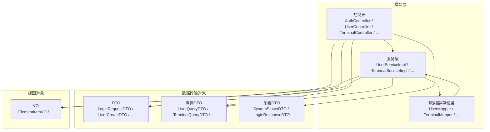
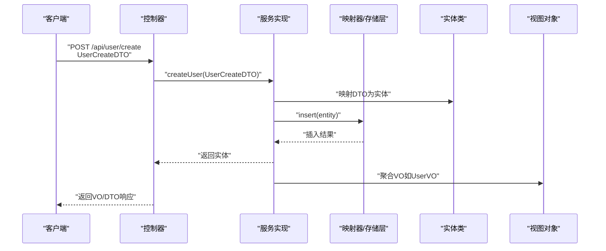
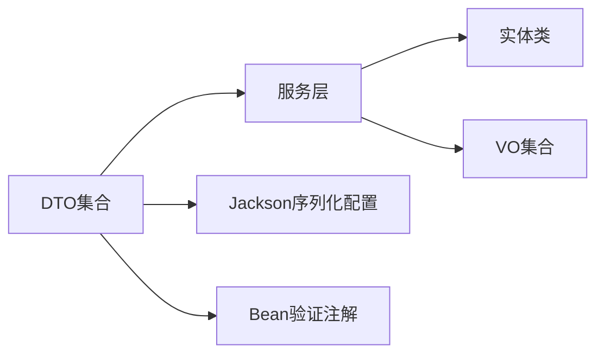

# 数据传输对象设计

<cite>
**本文引用的文件**
- [LoginRequestDTO.java](file://src/main/java/com/hydro/monitor/modules/dto/LoginRequestDTO.java)
- [LoginResponseDTO.java](file://src/main/java/com/hydro/monitor/modules/dto/LoginResponseDTO.java)
- [UserCreateDTO.java](file://src/main/java/com/hydro/monitor/modules/dto/UserCreateDTO.java)
- [UserUpdateDTO.java](file://src/main/java/com/hydro/monitor/modules/dto/UserUpdateDTO.java)
- [UserQueryDTO.java](file://src/main/java/com/hydro/monitor/modules/dto/UserQueryDTO.java)
- [TerminalCreateDTO.java](file://src/main/java/com/hydro/monitor/modules/dto/TerminalCreateDTO.java)
- [TerminalUpdateDTO.java](file://src/main/java/com/hydro/monitor/modules/dto/TerminalUpdateDTO.java)
- [TerminalQueryDTO.java](file://src/main/java/com/hydro/monitor/modules/dto/TerminalQueryDTO.java)
- [ElementConfigCreateDTO.java](file://src/main/java/com/hydro/monitor/modules/dto/ElementConfigCreateDTO.java)
- [ElementConfigUpdateDTO.java](file://src/main/java/com/hydro/monitor/modules/dto/ElementConfigUpdateDTO.java)
- [ElementConfigQueryDTO.java](file://src/main/java/com/hydro/monitor/modules/dto/ElementConfigQueryDTO.java)
- [HeartbeatQueryDTO.java](file://src/main/java/com/hydro/monitor/modules/dto/HeartbeatQueryDTO.java)
- [RawMessageQueryDTO.java](file://src/main/java/com/hydro/monitor/modules/dto/RawMessageQueryDTO.java)
- [TimedReportQueryDTO.java](file://src/main/java/com/hydro/monitor/modules/dto/TimedReportQueryDTO.java)
- [SystemStatusDTO.java](file://src/main/java/com/hydro/monitor/modules/dto/SystemStatusDTO.java)
- [ElementItemVO.java](file://src/main/java/com/hydro/monitor/modules/vo/ElementItemVO.java)
</cite>

## 目录
1. [引言](#引言)
2. [项目结构](#项目结构)
3. [核心组件](#核心组件)
4. [架构概览](#架构概览)
5. [详细组件分析](#详细组件分析)
6. [依赖分析](#依赖分析)
7. [性能考虑](#性能考虑)
8. [故障排查指南](#故障排查指南)
9. [结论](#结论)
10. [附录](#附录)

## 引言
本文件聚焦于水文监测系统中的数据传输对象（DTO）与视图对象（VO）设计，系统性阐述其设计模式、使用场景、字段定义与验证规则，并说明DTO到实体类的转换机制、VO到前端的数据封装过程。文档同时覆盖数据验证策略、字段映射规则与序列化配置，提供使用示例与最佳实践指导，帮助开发者在保持前后端解耦的同时，确保数据一致性与可维护性。

## 项目结构
本项目采用模块化分层组织，DTO与VO位于模块的dto与vo包内，分别承担请求/响应数据封装与前端展示数据聚合的职责。控制器通过服务层调用实现业务逻辑，服务层负责将DTO转换为实体进行持久化或查询，或将实体转换为VO返回给前端。

图表来源
- [LoginRequestDTO.java:1-20](file://src/main/java/com/hydro/monitor/modules/dto/LoginRequestDTO.java#L1-L20)
- [UserCreateDTO.java:1-55](file://src/main/java/com/hydro/monitor/modules/dto/UserCreateDTO.java#L1-L55)
- [UserQueryDTO.java:1-54](file://src/main/java/com/hydro/monitor/modules/dto/UserQueryDTO.java#L1-L54)
- [SystemStatusDTO.java:1-40](file://src/main/java/com/hydro/monitor/modules/dto/SystemStatusDTO.java#L1-L40)
- [ElementItemVO.java:1-41](file://src/main/java/com/hydro/monitor/modules/vo/ElementItemVO.java#L1-L41)

章节来源
- [LoginRequestDTO.java:1-20](file://src/main/java/com/hydro/monitor/modules/dto/LoginRequestDTO.java#L1-L20)
- [UserCreateDTO.java:1-55](file://src/main/java/com/hydro/monitor/modules/dto/UserCreateDTO.java#L1-L55)
- [UserQueryDTO.java:1-54](file://src/main/java/com/hydro/monitor/modules/dto/UserQueryDTO.java#L1-L54)
- [SystemStatusDTO.java:1-40](file://src/main/java/com/hydro/monitor/modules/dto/SystemStatusDTO.java#L1-L40)
- [ElementItemVO.java:1-41](file://src/main/java/com/hydro/monitor/modules/vo/ElementItemVO.java#L1-L41)

## 核心组件
本节对关键DTO与VO进行分类说明，涵盖创建/更新/查询/系统状态/登录相关DTO与要素项VO。

- 登录相关
  - LoginRequestDTO：封装登录请求的用户名与密码，字段简洁明确，便于安全传输与校验。
  - LoginResponseDTO：封装JWT令牌与过期时间戳，用于登录成功后的响应数据结构。
- 用户管理
  - UserCreateDTO：用户创建时的请求DTO，包含用户名、真实姓名、邮箱、手机号、密码、角色与状态等字段，并带有非空与格式校验注解。
  - UserUpdateDTO：用户更新时的请求DTO，包含用户ID与可选更新字段，支持部分字段更新；手机号与邮箱具备格式校验。
  - UserQueryDTO：用户查询的请求DTO，支持多条件模糊查询与分页参数，默认值处理保证健壮性。
- 终端管理
  - TerminalCreateDTO：终端创建请求DTO，包含终端名称、编号、经纬度、安装位置与连接密码等字段，均具备必要性校验。
  - TerminalUpdateDTO：终端更新请求DTO，基于主键ID进行更新，其余字段为可选更新。
  - TerminalQueryDTO：终端查询请求DTO，支持名称/编号模糊查询、在线状态过滤与分页参数。
- 要素配置
  - ElementConfigCreateDTO：要素配置新增DTO，包含要素标识符、编码、名称、数据类型、精度、单位与启用状态等字段；构造块提供默认值处理，确保数据完整性。
  - ElementConfigUpdateDTO：要素配置更新DTO，基于主键ID进行更新，其余字段为可选更新。
  - ElementConfigQueryDTO：要素配置查询DTO，支持按要素标识符、编码/名称模糊查询与启用状态过滤，并提供默认分页参数。
- 报文与报表
  - HeartbeatQueryDTO：心跳报文查询DTO，包含分页参数与起止时间，时间字段通过Jackson序列化配置指定格式与时区。
  - RawMessageQueryDTO：原始报文查询DTO，包含分页参数与遥测站地址、功能码等筛选条件。
  - TimedReportQueryDTO：定时报查询DTO，包含分页参数、起止时间与遥测站地址筛选。
- 系统状态
  - SystemStatusDTO：系统运行状态DTO，包含JVM内存、CPU使用率、线程数与数据库连接池状态等指标。

章节来源
- [LoginRequestDTO.java:1-20](file://src/main/java/com/hydro/monitor/modules/dto/LoginRequestDTO.java#L1-L20)
- [LoginResponseDTO.java:1-20](file://src/main/java/com/hydro/monitor/modules/dto/LoginResponseDTO.java#L1-L20)
- [UserCreateDTO.java:1-55](file://src/main/java/com/hydro/monitor/modules/dto/UserCreateDTO.java#L1-L55)
- [UserUpdateDTO.java:1-52](file://src/main/java/com/hydro/monitor/modules/dto/UserUpdateDTO.java#L1-L52)
- [UserQueryDTO.java:1-54](file://src/main/java/com/hydro/monitor/modules/dto/UserQueryDTO.java#L1-L54)
- [TerminalCreateDTO.java:1-44](file://src/main/java/com/hydro/monitor/modules/dto/TerminalCreateDTO.java#L1-L44)
- [TerminalUpdateDTO.java:1-48](file://src/main/java/com/hydro/monitor/modules/dto/TerminalUpdateDTO.java#L1-L48)
- [TerminalQueryDTO.java:1-43](file://src/main/java/com/hydro/monitor/modules/dto/TerminalQueryDTO.java#L1-L43)
- [ElementConfigCreateDTO.java:1-65](file://src/main/java/com/hydro/monitor/modules/dto/ElementConfigCreateDTO.java#L1-L65)
- [ElementConfigUpdateDTO.java:1-54](file://src/main/java/com/hydro/monitor/modules/dto/ElementConfigUpdateDTO.java#L1-L54)
- [ElementConfigQueryDTO.java:1-51](file://src/main/java/com/hydro/monitor/modules/dto/ElementConfigQueryDTO.java#L1-L51)
- [HeartbeatQueryDTO.java:1-51](file://src/main/java/com/hydro/monitor/modules/dto/HeartbeatQueryDTO.java#L1-L51)
- [RawMessageQueryDTO.java:1-46](file://src/main/java/com/hydro/monitor/modules/dto/RawMessageQueryDTO.java#L1-L46)
- [TimedReportQueryDTO.java:1-57](file://src/main/java/com/hydro/monitor/modules/dto/TimedReportQueryDTO.java#L1-L57)
- [SystemStatusDTO.java:1-40](file://src/main/java/com/hydro/monitor/modules/dto/SystemStatusDTO.java#L1-L40)

## 架构概览
下图展示了典型请求流程：控制器接收DTO，服务层执行业务逻辑，将DTO转换为实体进行持久化或查询，最终将实体转换为VO返回给前端。

图表来源
- [UserCreateDTO.java:1-55](file://src/main/java/com/hydro/monitor/modules/dto/UserCreateDTO.java#L1-L55)
- [UserServiceImpl.java](file://src/main/java/com/hydro/monitor/modules/service/impl/UserServiceImpl.java)
- [UserMapper.java](file://src/main/java/com/hydro/monitor/modules/mapper/UserMapper.java)
- [UserEntity.java](file://src/main/java/com/hydro/monitor/modules/entity/UserEntity.java)
- [UserVO.java](file://src/main/java/com/hydro/monitor/modules/vo/UserVO.java)

## 详细组件分析

### DTO设计模式与使用场景
- 创建型DTO（如UserCreateDTO、TerminalCreateDTO、ElementConfigCreateDTO）
  - 设计目的：接收前端提交的完整或部分创建数据，统一字段与校验规则，降低控制器复杂度。
  - 字段定义：包含业务必需字段与可选字段，必要字段使用非空校验，敏感字段（如手机号、邮箱）使用格式校验。
  - 验证规则：结合Bean验证注解（如非空、邮箱格式、手机号正则），并在构造块中提供默认值处理，提升数据完整性。
- 更新型DTO（如UserUpdateDTO、TerminalUpdateDTO、ElementConfigUpdateDTO）
  - 设计目的：支持部分字段更新，避免全量替换带来的风险；以主键ID作为更新依据。
  - 字段定义：包含主键ID与可选更新字段；密码字段可为空表示不修改。
  - 验证规则：主键非空校验，可选字段按需校验。
- 查询型DTO（如UserQueryDTO、TerminalQueryDTO、ElementConfigQueryDTO、HeartbeatQueryDTO、RawMessageQueryDTO、TimedReportQueryDTO）
  - 设计目的：统一查询参数，支持模糊匹配、范围筛选与分页控制。
  - 字段定义：包含分页参数与业务筛选字段；提供默认值处理，保证查询健壮性。
  - 序列化配置：时间字段通过Jackson注解指定格式与时区，确保前后端时间一致性。
- 系统状态DTO（如SystemStatusDTO）
  - 设计目的：封装系统运行指标，便于监控与展示。
  - 字段定义：内存、CPU、线程数与数据库连接池状态等指标。
- 登录相关DTO（LoginRequestDTO、LoginResponseDTO）
  - 设计目的：登录请求与响应的数据载体，LoginResponseDTO包含JWT与过期时间，便于前端Token管理。

章节来源
- [UserCreateDTO.java:1-55](file://src/main/java/com/hydro/monitor/modules/dto/UserCreateDTO.java#L1-L55)
- [UserUpdateDTO.java:1-52](file://src/main/java/com/hydro/monitor/modules/dto/UserUpdateDTO.java#L1-L52)
- [UserQueryDTO.java:1-54](file://src/main/java/com/hydro/monitor/modules/dto/UserQueryDTO.java#L1-L54)
- [TerminalCreateDTO.java:1-44](file://src/main/java/com/hydro/monitor/modules/dto/TerminalCreateDTO.java#L1-L44)
- [TerminalUpdateDTO.java:1-48](file://src/main/java/com/hydro/monitor/modules/dto/TerminalUpdateDTO.java#L1-L48)
- [TerminalQueryDTO.java:1-43](file://src/main/java/com/hydro/monitor/modules/dto/TerminalQueryDTO.java#L1-L43)
- [ElementConfigCreateDTO.java:1-65](file://src/main/java/com/hydro/monitor/modules/dto/ElementConfigCreateDTO.java#L1-L65)
- [ElementConfigUpdateDTO.java:1-54](file://src/main/java/com/hydro/monitor/modules/dto/ElementConfigUpdateDTO.java#L1-L54)
- [ElementConfigQueryDTO.java:1-51](file://src/main/java/com/hydro/monitor/modules/dto/ElementConfigQueryDTO.java#L1-L51)
- [HeartbeatQueryDTO.java:1-51](file://src/main/java/com/hydro/monitor/modules/dto/HeartbeatQueryDTO.java#L1-L51)
- [RawMessageQueryDTO.java:1-46](file://src/main/java/com/hydro/monitor/modules/dto/RawMessageQueryDTO.java#L1-L46)
- [TimedReportQueryDTO.java:1-57](file://src/main/java/com/hydro/monitor/modules/dto/TimedReportQueryDTO.java#L1-L57)
- [SystemStatusDTO.java:1-40](file://src/main/java/com/hydro/monitor/modules/dto/SystemStatusDTO.java#L1-L40)
- [LoginRequestDTO.java:1-20](file://src/main/java/com/hydro/monitor/modules/dto/LoginRequestDTO.java#L1-L20)
- [LoginResponseDTO.java:1-20](file://src/main/java/com/hydro/monitor/modules/dto/LoginResponseDTO.java#L1-L20)

### VO设计理念与数据聚合策略
- ElementItemVO：面向定时报表的前端展示，聚合单个监测要素的编码、名称、值与单位，字段语义清晰，便于表格/卡片渲染。
- 数据聚合策略：VO通常由多个实体或查询结果聚合而来，减少前端重复计算与网络往返；字段尽量贴近UI需求，避免携带冗余信息。
- 前端展示优化：VO字段标注Swagger描述与示例，有助于接口文档生成与前端联调；数值类型使用高精度类型以避免精度丢失。

章节来源
- [ElementItemVO.java:1-41](file://src/main/java/com/hydro/monitor/modules/vo/ElementItemVO.java#L1-L41)

### DTO到实体类的转换机制
- 映射原则：DTO与实体字段一一对应或按业务语义映射；创建/更新DTO通过服务层转换为实体，再交由映射器持久化。
- 转换流程：控制器接收DTO → 服务层执行业务校验与转换 → 实体类承载业务状态 → 映射器执行持久化/查询 → 返回实体或聚合结果。
- 注意事项：时间字段在DTO侧已通过Jackson注解规范序列化格式，服务层应确保时区一致；数值精度在VO侧使用高精度类型保障。

章节来源
- [UserCreateDTO.java:1-55](file://src/main/java/com/hydro/monitor/modules/dto/UserCreateDTO.java#L1-L55)
- [UserUpdateDTO.java:1-52](file://src/main/java/com/hydro/monitor/modules/dto/UserUpdateDTO.java#L1-L52)
- [ElementConfigCreateDTO.java:1-65](file://src/main/java/com/hydro/monitor/modules/dto/ElementConfigCreateDTO.java#L1-L65)
- [ElementConfigUpdateDTO.java:1-54](file://src/main/java/com/hydro/monitor/modules/dto/ElementConfigUpdateDTO.java#L1-L54)
- [HeartbeatQueryDTO.java:1-51](file://src/main/java/com/hydro/monitor/modules/dto/HeartbeatQueryDTO.java#L1-L51)
- [TimedReportQueryDTO.java:1-57](file://src/main/java/com/hydro/monitor/modules/dto/TimedReportQueryDTO.java#L1-L57)

### VO到前端的数据封装过程
- 封装策略：服务层将查询结果或聚合数据封装为VO，VO直接作为控制器响应返回，减少前端二次处理。
- 字段映射：VO字段与后端实体/查询结果字段保持一致或语义等价，避免跨层数据错配。
- 序列化配置：VO字段通过Swagger注解增强接口文档可读性；时间字段遵循统一格式与时区配置。

章节来源
- [ElementItemVO.java:1-41](file://src/main/java/com/hydro/monitor/modules/vo/ElementItemVO.java#L1-L41)

### 数据验证策略与字段映射规则
- 非空与必填：使用非空注解确保关键字段存在；默认值处理在构造块中完成，避免空值进入业务层。
- 格式校验：手机号使用正则表达式校验，邮箱使用邮箱格式校验；时间字段通过Jackson注解统一序列化格式与时区。
- 分页参数：查询DTO提供默认页码与页大小，防止越界与过大请求；支持可选筛选条件，满足灵活查询需求。
- 字段映射：DTO与实体字段命名尽量一致，必要时通过服务层转换；VO面向前端展示，字段更贴近UI需求。

章节来源
- [UserCreateDTO.java:1-55](file://src/main/java/com/hydro/monitor/modules/dto/UserCreateDTO.java#L1-L55)
- [UserUpdateDTO.java:1-52](file://src/main/java/com/hydro/monitor/modules/dto/UserUpdateDTO.java#L1-L52)
- [TerminalCreateDTO.java:1-44](file://src/main/java/com/hydro/monitor/modules/dto/TerminalCreateDTO.java#L1-L44)
- [TerminalUpdateDTO.java:1-48](file://src/main/java/com/hydro/monitor/modules/dto/TerminalUpdateDTO.java#L1-L48)
- [ElementConfigCreateDTO.java:1-65](file://src/main/java/com/hydro/monitor/modules/dto/ElementConfigCreateDTO.java#L1-L65)
- [ElementConfigUpdateDTO.java:1-54](file://src/main/java/com/hydro/monitor/modules/dto/ElementConfigUpdateDTO.java#L1-L54)
- [HeartbeatQueryDTO.java:1-51](file://src/main/java/com/hydro/monitor/modules/dto/HeartbeatQueryDTO.java#L1-L51)
- [TimedReportQueryDTO.java:1-57](file://src/main/java/com/hydro/monitor/modules/dto/TimedReportQueryDTO.java#L1-L57)

### 序列化配置
- 时间字段：通过Jackson注解指定日期时间格式与时区，确保前后端时间解析一致。
- Swagger注解：为DTO与VO字段添加描述与示例，提升接口文档质量与前端联调效率。

章节来源
- [HeartbeatQueryDTO.java:1-51](file://src/main/java/com/hydro/monitor/modules/dto/HeartbeatQueryDTO.java#L1-L51)
- [TimedReportQueryDTO.java:1-57](file://src/main/java/com/hydro/monitor/modules/dto/TimedReportQueryDTO.java#L1-L57)
- [ElementItemVO.java:1-41](file://src/main/java/com/hydro/monitor/modules/vo/ElementItemVO.java#L1-L41)

### 使用示例与最佳实践
- 创建用户
  - 前端提交UserCreateDTO，包含用户名、真实姓名、邮箱、手机号、密码、角色与状态；服务层进行校验与默认值处理，转换为实体后持久化。
  - 参考路径：[UserCreateDTO.java:1-55](file://src/main/java/com/hydro/monitor/modules/dto/UserCreateDTO.java#L1-L55)
- 更新终端
  - 前端提交TerminalUpdateDTO，包含终端ID与可选字段；服务层仅更新提供的字段，避免覆盖未变更字段。
  - 参考路径：[TerminalUpdateDTO.java:1-48](file://src/main/java/com/hydro/monitor/modules/dto/TerminalUpdateDTO.java#L1-L48)
- 查询要素配置
  - 前端提交ElementConfigQueryDTO，可选择按要素标识符、编码/名称模糊查询与启用状态过滤；服务层应用默认分页参数与筛选条件。
  - 参考路径：[ElementConfigQueryDTO.java:1-51](file://src/main/java/com/hydro/monitor/modules/dto/ElementConfigQueryDTO.java#L1-L51)
- 登录响应
  - 后端返回LoginResponseDTO，包含JWT与过期时间；前端据此进行Token管理与刷新。
  - 参考路径：[LoginResponseDTO.java:1-20](file://src/main/java/com/hydro/monitor/modules/dto/LoginResponseDTO.java#L1-L20)

章节来源
- [UserCreateDTO.java:1-55](file://src/main/java/com/hydro/monitor/modules/dto/UserCreateDTO.java#L1-L55)
- [TerminalUpdateDTO.java:1-48](file://src/main/java/com/hydro/monitor/modules/dto/TerminalUpdateDTO.java#L1-L48)
- [ElementConfigQueryDTO.java:1-51](file://src/main/java/com/hydro/monitor/modules/dto/ElementConfigQueryDTO.java#L1-L51)
- [LoginResponseDTO.java:1-20](file://src/main/java/com/hydro/monitor/modules/dto/LoginResponseDTO.java#L1-L20)

## 依赖分析
- DTO与VO之间无直接依赖，控制器通过服务层间接关联DTO与VO。
- 查询DTO与系统DTO在时间字段上依赖Jackson序列化配置，确保前后端时间一致性。
- 创建/更新DTO依赖Bean验证注解，服务层负责触发校验并处理默认值。

图表来源
- [HeartbeatQueryDTO.java:1-51](file://src/main/java/com/hydro/monitor/modules/dto/HeartbeatQueryDTO.java#L1-L51)
- [TimedReportQueryDTO.java:1-57](file://src/main/java/com/hydro/monitor/modules/dto/TimedReportQueryDTO.java#L1-L57)
- [UserCreateDTO.java:1-55](file://src/main/java/com/hydro/monitor/modules/dto/UserCreateDTO.java#L1-L55)
- [ElementConfigCreateDTO.java:1-65](file://src/main/java/com/hydro/monitor/modules/dto/ElementConfigCreateDTO.java#L1-L65)

章节来源
- [HeartbeatQueryDTO.java:1-51](file://src/main/java/com/hydro/monitor/modules/dto/HeartbeatQueryDTO.java#L1-L51)
- [TimedReportQueryDTO.java:1-57](file://src/main/java/com/hydro/monitor/modules/dto/TimedReportQueryDTO.java#L1-L57)
- [UserCreateDTO.java:1-55](file://src/main/java/com/hydro/monitor/modules/dto/UserCreateDTO.java#L1-L55)
- [ElementConfigCreateDTO.java:1-65](file://src/main/java/com/hydro/monitor/modules/dto/ElementConfigCreateDTO.java#L1-L65)

## 性能考虑
- 分页参数：查询DTO提供默认页码与页大小，避免一次性返回大量数据；建议前端合理设置页大小并配合索引优化查询。
- 时间字段：统一序列化格式与时区，减少前端解析成本与错误。
- VO聚合：在服务层完成数据聚合，减少前端重复处理与网络往返。
- 默认值处理：在DTO构造块中提供默认值，降低服务层判断分支与空指针风险。

## 故障排查指南
- 参数校验失败
  - 症状：请求被拒绝，返回字段校验错误信息。
  - 排查：检查DTO字段注解与默认值处理是否覆盖边界情况；确认前端提交字段与注解约束一致。
- 分页参数异常
  - 症状：查询结果不符合预期或返回过多数据。
  - 排查：确认DTO默认分页参数是否生效；检查前端传入页码与页大小是否合理。
- 时间字段解析错误
  - 症状：前后端时间显示不一致或解析异常。
  - 排查：确认DTO中时间字段的Jackson注解格式与时区配置；确保前端提交格式与后端一致。
- 登录响应异常
  - 症状：登录成功但Token无效或过期时间异常。
  - 排查：检查LoginResponseDTO字段与后端Token生成逻辑；确认前端Token存储与刷新策略。

章节来源
- [UserCreateDTO.java:1-55](file://src/main/java/com/hydro/monitor/modules/dto/UserCreateDTO.java#L1-L55)
- [UserQueryDTO.java:1-54](file://src/main/java/com/hydro/monitor/modules/dto/UserQueryDTO.java#L1-L54)
- [HeartbeatQueryDTO.java:1-51](file://src/main/java/com/hydro/monitor/modules/dto/HeartbeatQueryDTO.java#L1-L51)
- [LoginResponseDTO.java:1-20](file://src/main/java/com/hydro/monitor/modules/dto/LoginResponseDTO.java#L1-L20)

## 结论
本项目的DTO与VO设计遵循“职责分离、参数校验、默认值处理、序列化统一”的原则，既保证了前端交互的简洁性，又提升了后端处理的稳定性与可维护性。通过合理的分页与时间序列化配置，有效降低了网络与解析成本；通过VO聚合与字段映射，进一步优化了前端展示体验。建议在后续迭代中持续完善字段注释与默认值策略，确保系统在扩展过程中保持一致的契约与性能表现。

## 附录
- 关键DTO与VO一览
  - 登录相关：LoginRequestDTO、LoginResponseDTO
  - 用户管理：UserCreateDTO、UserUpdateDTO、UserQueryDTO
  - 终端管理：TerminalCreateDTO、TerminalUpdateDTO、TerminalQueryDTO
  - 要素配置：ElementConfigCreateDTO、ElementConfigUpdateDTO、ElementConfigQueryDTO
  - 报文与报表：HeartbeatQueryDTO、RawMessageQueryDTO、TimedReportQueryDTO
  - 系统状态：SystemStatusDTO
  - 视图对象：ElementItemVO