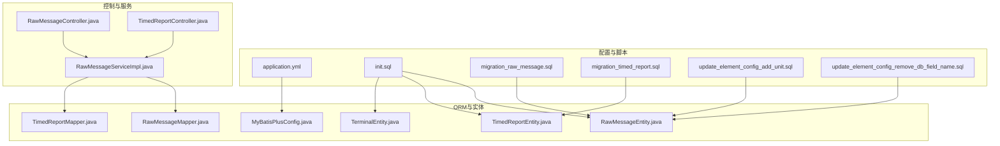
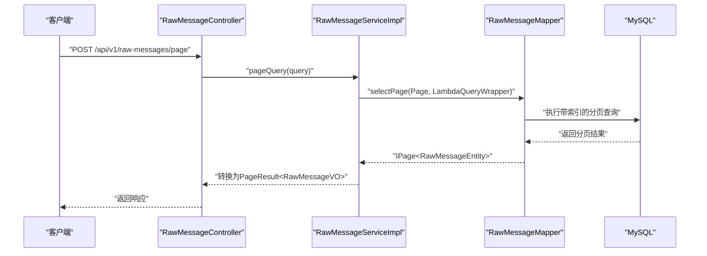
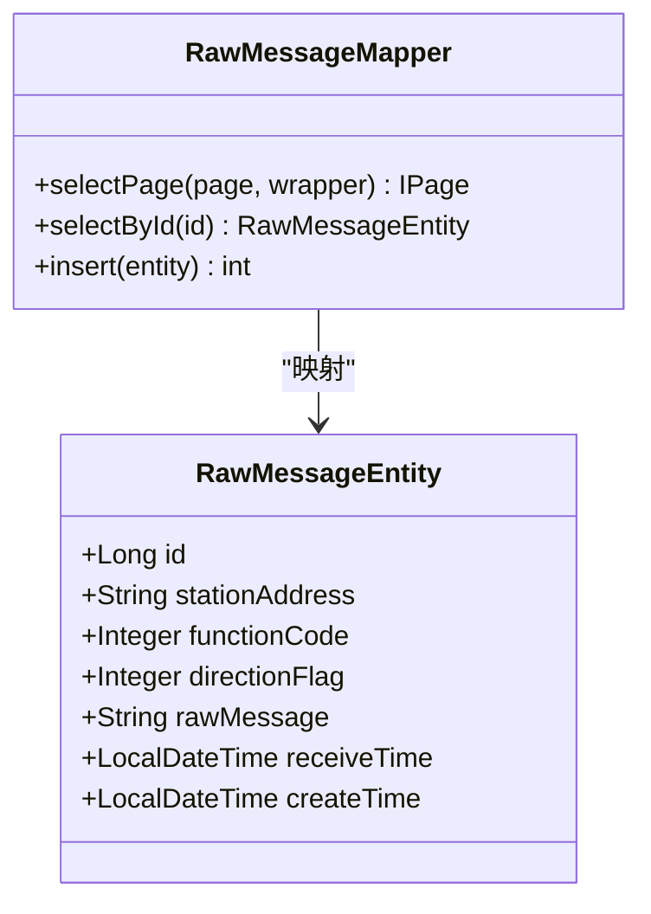
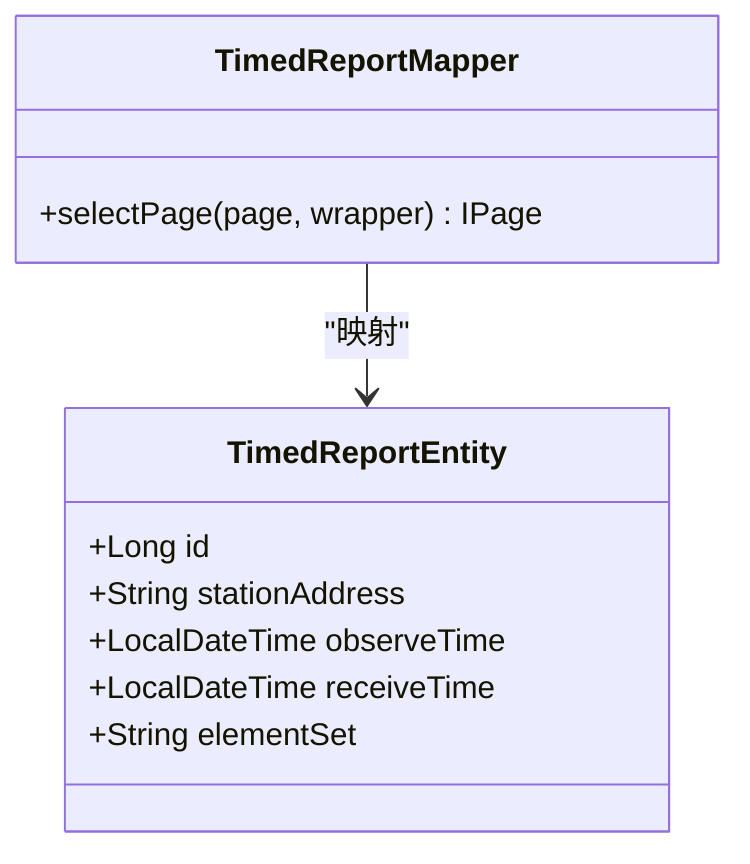
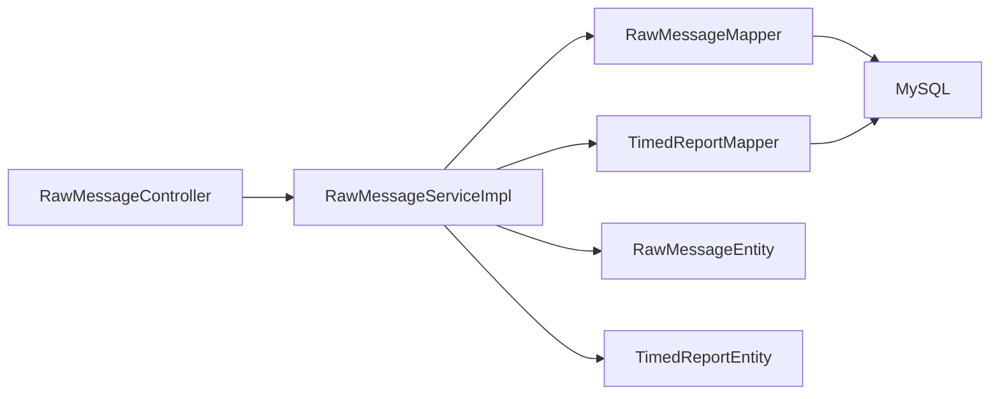

# 数据库优化

<cite>
**本文引用的文件**
- [init.sql](file://src/main/resources/db/init.sql)
- [migration_raw_message.sql](file://src/main/resources/db/migration_raw_message.sql)
- [migration_timed_report.sql](file://src/main/resources/db/migration_timed_report.sql)
- [update_element_config_add_unit.sql](file://src/main/resources/db/update_element_config_add_unit.sql)
- [update_element_config_remove_db_field_name.sql](file://src/main/resources/db/update_element_config_remove_db_field_name.sql)
- [application.yml](file://src/main/resources/application.yml)
- [MyBatisPlusConfig.java](file://src/main/java/com/hydro/monitor/config/MyBatisPlusConfig.java)
- [RawMessageEntity.java](file://src/main/java/com/hydro/monitor/modules/entity/RawMessageEntity.java)
- [TimedReportEntity.java](file://src/main/java/com/hydro/monitor/modules/entity/TimedReportEntity.java)
- [TerminalEntity.java](file://src/main/java/com/hydro/monitor/modules/entity/TerminalEntity.java)
- [RawMessageMapper.java](file://src/main/java/com/hydro/monitor/modules/mapper/RawMessageMapper.java)
- [TimedReportMapper.java](file://src/main/java/com/hydro/monitor/modules/mapper/TimedReportMapper.java)
- [RawMessageController.java](file://src/main/java/com/hydro/monitor/modules/controller/RawMessageController.java)
- [TimedReportController.java](file://src/main/java/com/hydro/monitor/modules/controller/TimedReportController.java)
- [RawMessageServiceImpl.java](file://src/main/java/com/hydro/monitor/modules/service/impl/RawMessageServiceImpl.java)
</cite>

## 目录
1. [简介](#简介)
2. [项目结构](#项目结构)
3. [核心组件](#核心组件)
4. [架构总览](#架构总览)
5. [详细组件分析](#详细组件分析)
6. [依赖分析](#依赖分析)
7. [性能考虑](#性能考虑)
8. [故障排查指南](#故障排查指南)
9. [结论](#结论)
10. [附录](#附录)

## 简介
本文件面向水文监测系统的数据库优化，围绕表结构设计原则、索引策略、查询性能优化、初始化脚本与迁移脚本的版本管理实践、连接池与慢查询优化、批量操作调优、数据分区与读写分离、缓存机制、SQL优化案例与执行计划分析、备份恢复与一致性保障等主题展开。文档同时结合实际的初始化脚本、迁移脚本、实体类与MyBatis-Plus配置，给出可落地的优化建议与最佳实践。

## 项目结构
数据库相关资源集中于 resources/db 目录，包含初始化脚本、迁移脚本与要素配置更新脚本；应用配置位于 application.yml；ORM层通过 MyBatis-Plus 提供分页与逻辑删除支持；实体类映射到数据库表，控制器负责对外接口，服务层承载查询与业务逻辑。

**图表来源**
- [application.yml:1-86](file://src/main/resources/application.yml#L1-L86)
- [init.sql:1-93](file://src/main/resources/db/init.sql#L1-L93)
- [migration_raw_message.sql:1-14](file://src/main/resources/db/migration_raw_message.sql#L1-L14)
- [migration_timed_report.sql:1-44](file://src/main/resources/db/migration_timed_report.sql#L1-L44)
- [update_element_config_add_unit.sql:1-30](file://src/main/resources/db/update_element_config_add_unit.sql#L1-L30)
- [update_element_config_remove_db_field_name.sql:1-21](file://src/main/resources/db/update_element_config_remove_db_field_name.sql#L1-L21)
- [MyBatisPlusConfig.java:1-39](file://src/main/java/com/hydro/monitor/config/MyBatisPlusConfig.java#L1-L39)
- [RawMessageMapper.java:1-15](file://src/main/java/com/hydro/monitor/modules/mapper/RawMessageMapper.java#L1-L15)
- [TimedReportMapper.java:1-15](file://src/main/java/com/hydro/monitor/modules/mapper/TimedReportMapper.java#L1-L15)
- [RawMessageEntity.java:1-55](file://src/main/java/com/hydro/monitor/modules/entity/RawMessageEntity.java#L1-L55)
- [TimedReportEntity.java:1-48](file://src/main/java/com/hydro/monitor/modules/entity/TimedReportEntity.java#L1-L48)
- [TerminalEntity.java:1-74](file://src/main/java/com/hydro/monitor/modules/entity/TerminalEntity.java#L1-L74)
- [RawMessageController.java:1-81](file://src/main/java/com/hydro/monitor/modules/controller/RawMessageController.java#L1-L81)
- [TimedReportController.java:1-111](file://src/main/java/com/hydro/monitor/modules/controller/TimedReportController.java#L1-L111)
- [RawMessageServiceImpl.java:1-160](file://src/main/java/com/hydro/monitor/modules/service/impl/RawMessageServiceImpl.java#L1-L160)

**章节来源**
- [application.yml:1-86](file://src/main/resources/application.yml#L1-L86)
- [init.sql:1-93](file://src/main/resources/db/init.sql#L1-L93)

## 核心组件
- 初始化脚本：创建数据库与核心表（心跳、定时报、用户、要素配置、终端），设置字符集与引擎，建立常用索引，并插入默认数据。
- 迁移脚本：将定时报表从多列要素字段演进为 JSON 存储的 element_set，提升扩展性与查询灵活性。
- ORM配置：MyBatis-Plus 分页拦截器启用，支持最大单页限制与溢出处理；全局逻辑删除字段配置。
- 实体映射：原始报文、定时报、终端实体映射到对应表，字段命名遵循下划线转驼峰映射。
- 控制器与服务：提供分页查询、详情查询、报文解析等接口，服务层基于Lambda条件构造器与分页插件实现高效查询。

**章节来源**
- [init.sql:6-92](file://src/main/resources/db/init.sql#L6-L92)
- [migration_timed_report.sql:6-38](file://src/main/resources/db/migration_timed_report.sql#L6-L38)
- [MyBatisPlusConfig.java:23-37](file://src/main/java/com/hydro/monitor/config/MyBatisPlusConfig.java#L23-L37)
- [RawMessageEntity.java:15-54](file://src/main/java/com/hydro/monitor/modules/entity/RawMessageEntity.java#L15-L54)
- [TimedReportEntity.java:15-47](file://src/main/java/com/hydro/monitor/modules/entity/TimedReportEntity.java#L15-L47)
- [TerminalEntity.java:15-73](file://src/main/java/com/hydro/monitor/modules/entity/TerminalEntity.java#L15-L73)
- [RawMessageController.java:35-45](file://src/main/java/com/hydro/monitor/modules/controller/RawMessageController.java#L35-L45)
- [TimedReportController.java:36-46](file://src/main/java/com/hydro/monitor/modules/controller/TimedReportController.java#L36-L46)

## 架构总览
系统采用“控制器-服务-持久层-数据库”的分层架构。MyBatis-Plus 提供分页与条件查询能力，配合索引与查询规范，确保高并发下的查询性能与稳定性。

**图表来源**
- [RawMessageController.java:35-45](file://src/main/java/com/hydro/monitor/modules/controller/RawMessageController.java#L35-L45)
- [RawMessageServiceImpl.java:54-79](file://src/main/java/com/hydro/monitor/modules/service/impl/RawMessageServiceImpl.java#L54-L79)
- [RawMessageMapper.java:12-14](file://src/main/java/com/hydro/monitor/modules/mapper/RawMessageMapper.java#L12-L14)

## 详细组件分析

### 初始化脚本与表结构设计
- 数据库与字符集：统一使用 utf8mb4，避免表情符号与特殊字符问题。
- 引擎选择：InnoDB 支持事务与行级锁，适合高并发写入场景。
- 主键策略：采用 BIGINT 主键，满足海量数据增长需求。
- 索引设计：
  - t_heartbeat：按 station_address 与 observe_time 建立索引，支撑站点与时间范围查询。
  - t_timed_report：同上，且 element_set 使用 JSON 存储，便于扩展。
  - sys_user：唯一索引 uk_username，保证用户名唯一性。
  - t_terminal：唯一索引 uk_terminal_code，以及 online_status、last_report_time 索引，支撑在线状态与时间排序查询。
- 初始数据：默认管理员用户与要素配置数据，使用 ON DUPLICATE KEY UPDATE 保证幂等。

**章节来源**
- [init.sql:1-93](file://src/main/resources/db/init.sql#L1-L93)

### 迁移脚本与版本管理策略
- 定时报迁移：将多列要素字段合并为 JSON 的 element_set，减少列变更带来的DDL风险，提升扩展性。
- 迁移步骤：
  1) 新增 element_set JSON 字段；
  2) 将旧字段数据映射到 element_set；
  3) 删除旧字段；
  4) 验证迁移结果。
- 版本管理建议：
  - 为每次迁移生成独立脚本文件，明确版本号与目标版本；
  - 在生产环境执行前先在测试环境验证；
  - 使用事务包裹关键 DDL/DML，失败回滚；
  - 记录迁移日志与校验查询，确保数据一致性。

**章节来源**
- [migration_timed_report.sql:6-38](file://src/main/resources/db/migration_timed_report.sql#L6-L38)

### 要素配置表的演进
- 新增 unit 字段：为每个要素配置单位，便于展示与计算。
- 移除 db_field_name 字段：简化配置模型，避免冗余映射字段。
- 更新策略：使用 UPDATE 语句批量赋值单位，随后通过 SELECT 校验结果。

**章节来源**
- [update_element_config_add_unit.sql:6-17](file://src/main/resources/db/update_element_config_add_unit.sql#L6-L17)
- [update_element_config_remove_db_field_name.sql:6-8](file://src/main/resources/db/update_element_config_remove_db_field_name.sql#L6-L8)

### 原始报文表与查询路径
- 表结构：包含 station_address、function_code、direction_flag、raw_message、receive_time 等字段，索引覆盖 station_address 与 receive_time。
- 查询模式：支持按 station_address 与 function_code 筛选，按 receive_time 倒序分页。
- 实体映射：字段名遵循下划线转驼峰规则，ID 使用 ASSIGN_ID（雪花算法）策略。

**图表来源**
- [RawMessageEntity.java:15-54](file://src/main/java/com/hydro/monitor/modules/entity/RawMessageEntity.java#L15-L54)
- [RawMessageMapper.java:12-14](file://src/main/java/com/hydro/monitor/modules/mapper/RawMessageMapper.java#L12-L14)

**章节来源**
- [migration_raw_message.sql:2-13](file://src/main/resources/db/migration_raw_message.sql#L2-L13)
- [RawMessageEntity.java:15-54](file://src/main/java/com/hydro/monitor/modules/entity/RawMessageEntity.java#L15-L54)
- [RawMessageMapper.java:12-14](file://src/main/java/com/hydro/monitor/modules/mapper/RawMessageMapper.java#L12-L14)

### 定时报表与要素集查询
- 表结构：element_set 以 JSON 存储要素集合，便于扩展与查询。
- 查询模式：支持按 station_address 与 observe_time 区间分页，控制器提供多种查询入口（全部站点最新、按站点查询等）。
- 实体映射：element_set 映射为字符串类型，便于序列化与传输。

**图表来源**
- [TimedReportEntity.java:15-47](file://src/main/java/com/hydro/monitor/modules/entity/TimedReportEntity.java#L15-L47)
- [TimedReportMapper.java:12-14](file://src/main/java/com/hydro/monitor/modules/mapper/TimedReportMapper.java#L12-L14)

**章节来源**
- [init.sql:19-29](file://src/main/resources/db/init.sql#L19-L29)
- [TimedReportEntity.java:15-47](file://src/main/java/com/hydro/monitor/modules/entity/TimedReportEntity.java#L15-L47)
- [TimedReportController.java:36-46](file://src/main/java/com/hydro/monitor/modules/controller/TimedReportController.java#L36-L46)

### 终端设备表与索引策略
- 唯一索引：terminal_code 唯一，保证遥测站编号唯一。
- 辅助索引：online_status、last_report_time，支撑在线状态统计与最新上报时间排序。
- 实体映射：包含经纬度、安装位置、连接密码、在线状态与时间戳字段。

**章节来源**
- [init.sql:75-92](file://src/main/resources/db/init.sql#L75-L92)
- [TerminalEntity.java:15-73](file://src/main/java/com/hydro/monitor/modules/entity/TerminalEntity.java#L15-L73)

### MyBatis-Plus 分页与查询优化
- 分页拦截器：启用 PaginationInnerInterceptor，设置最大单页限制与溢出处理，防止超大分页导致性能问题。
- 条件查询：服务层使用 LambdaQueryWrapper 构造查询条件，结合索引字段进行过滤与排序。
- 下划线转驼峰：开启 mapUnderscoreToCamelCase，降低命名不一致带来的映射成本。

**章节来源**
- [MyBatisPlusConfig.java:23-37](file://src/main/java/com/hydro/monitor/config/MyBatisPlusConfig.java#L23-L37)
- [application.yml:24-26](file://src/main/resources/application.yml#L24-L26)
- [RawMessageServiceImpl.java:54-79](file://src/main/java/com/hydro/monitor/modules/service/impl/RawMessageServiceImpl.java#L54-L79)

## 依赖分析
- 控制器依赖服务层，服务层依赖 Mapper 接口，Mapper 通过 MyBatis-Plus 与数据库交互。
- 实体类与表结构一一对应，字段命名遵循下划线转驼峰映射。
- 应用配置提供数据源与 MyBatis-Plus 全局配置，确保分页与逻辑删除生效。

**图表来源**
- [RawMessageController.java:25-45](file://src/main/java/com/hydro/monitor/modules/controller/RawMessageController.java#L25-L45)
- [RawMessageServiceImpl.java:26-52](file://src/main/java/com/hydro/monitor/modules/service/impl/RawMessageServiceImpl.java#L26-L52)
- [RawMessageMapper.java:12-14](file://src/main/java/com/hydro/monitor/modules/mapper/RawMessageMapper.java#L12-L14)
- [TimedReportMapper.java:12-14](file://src/main/java/com/hydro/monitor/modules/mapper/TimedReportMapper.java#L12-L14)
- [RawMessageEntity.java:15-54](file://src/main/java/com/hydro/monitor/modules/entity/RawMessageEntity.java#L15-L54)
- [TimedReportEntity.java:15-47](file://src/main/java/com/hydro/monitor/modules/entity/TimedReportEntity.java#L15-L47)

**章节来源**
- [RawMessageController.java:25-45](file://src/main/java/com/hydro/monitor/modules/controller/RawMessageController.java#L25-L45)
- [TimedReportController.java:28-46](file://src/main/java/com/hydro/monitor/modules/controller/TimedReportController.java#L28-L46)
- [RawMessageServiceImpl.java:26-52](file://src/main/java/com/hydro/monitor/modules/service/impl/RawMessageServiceImpl.java#L26-L52)

## 性能考虑

### 索引策略与查询优化
- 常用过滤字段：station_address、function_code、observe_time、receive_time、online_status 等应建立索引，避免全表扫描。
- 复合索引：对于时间范围+站点的组合查询，优先使用复合索引或合理利用现有单列索引。
- JSON 字段查询：element_set 作为 JSON 存储，建议仅在必要时进行解析，避免在 WHERE 子句中直接对 JSON 键进行函数运算。

**章节来源**
- [init.sql:15-16](file://src/main/resources/db/init.sql#L15-L16)
- [migration_raw_message.sql:10-12](file://src/main/resources/db/migration_raw_message.sql#L10-L12)
- [migration_timed_report.sql:11-27](file://src/main/resources/db/migration_timed_report.sql#L11-L27)

### 分页与大数据量优化
- 单页限制：通过分页拦截器设置最大单页数量，防止超大分页导致内存与锁竞争。
- 排序字段：尽量使用索引字段排序，避免 ORDER BY 非索引字段触发文件排序。
- 选择性过滤：优先使用高选择性的过滤条件，减少扫描行数。

**章节来源**
- [MyBatisPlusConfig.java:28-32](file://src/main/java/com/hydro/monitor/config/MyBatisPlusConfig.java#L28-L32)
- [RawMessageServiceImpl.java:54-79](file://src/main/java/com/hydro/monitor/modules/service/impl/RawMessageServiceImpl.java#L54-L79)

### 批量操作与写入优化
- 批量插入：使用 JDBC 批处理或 MyBatis 批处理工具，减少网络往返。
- 事务边界：将多个写操作放入同一事务，提高一致性与吞吐量。
- 写入热点：对高频写入表（如原始报文）考虑分区或分表策略，降低写放大。

### 缓存机制设计
- 结果缓存：对热点查询（如要素配置、站点基础信息）引入二级缓存，减少数据库压力。
- 查询缓存：对静态或低频变化的数据使用本地缓存，注意缓存失效策略。
- 缓存穿透与击穿：通过布隆过滤器与互斥锁避免缓存穿透与击穿。

### 慢查询优化与执行计划分析
- 开启慢查询日志：定位执行时间长、扫描行数多的 SQL。
- EXPLAIN 分析：检查是否使用索引、是否存在回表、是否触发文件排序。
- 优化手段：重写 SQL、补充索引、拆分复杂查询、使用覆盖索引。

### 数据分区策略
- 按时间分区：对 t_heartbeat、t_timed_report、t_raw_message 按 receive_time 或 observe_time 进行月/季度分区，便于归档与清理。
- 分区裁剪：查询时尽量带上分区键，使分区裁剪生效。

### 读写分离方案
- 主库写入：负责新增与更新（如原始报文入库、定时报更新）。
- 从库读取：对历史查询与报表场景使用从库，降低主库压力。
- 一致性：写后读一致性可通过延迟复制或强一致读策略保障。

### 备份恢复与一致性保障
- 备份策略：全量+增量备份，定期校验恢复演练。
- 一致性：通过事务与幂等写入（如 ON DUPLICATE KEY UPDATE）保证数据一致性。
- 故障切换：主从切换预案与自动化故障检测，缩短 RTO/RPO。

## 故障排查指南
- 连接池问题：检查连接池参数（最大连接数、空闲超时、连接泄漏），结合慢查询日志定位异常SQL。
- 分页异常：确认分页参数与最大单页限制，避免超限导致的异常。
- 查询性能差：使用 EXPLAIN 分析执行计划，检查索引使用情况与排序字段。
- 数据迁移失败：核对迁移脚本顺序与事务边界，必要时回滚并修复后再重试。
- 缓存不命中：检查缓存键生成规则与失效策略，避免缓存雪崩。

**章节来源**
- [application.yml:9-13](file://src/main/resources/application.yml#L9-L13)
- [MyBatisPlusConfig.java:28-32](file://src/main/java/com/hydro/monitor/config/MyBatisPlusConfig.java#L28-L32)
- [RawMessageServiceImpl.java:32-52](file://src/main/java/com/hydro/monitor/modules/service/impl/RawMessageServiceImpl.java#L32-L52)

## 结论
通过合理的表结构设计、索引策略与查询规范，结合 MyBatis-Plus 分页与幂等写入，水文监测系统可在高并发场景下保持稳定与高性能。迁移脚本与版本管理实践确保了Schema演进的可控性；缓存与分区策略进一步提升了整体吞吐与可用性。建议持续监控慢查询与执行计划，定期评估索引有效性，并完善备份与故障切换机制。

## 附录

### SQL优化案例与执行计划分析
- 案例1：按站点与时间范围查询原始报文
  - 优化点：使用 station_address 与 receive_time 索引，避免对非索引字段排序。
  - 执行计划关注：是否走索引范围扫描、是否发生回表、是否触发临时表。
- 案例2：定时报表按要素集查询
  - 优化点：element_set 作为JSON存储，避免在 WHERE 中对键做函数运算；必要时在应用层解析后过滤。
  - 执行计划关注：是否使用覆盖索引、是否触发文件排序。

### 性能监控方法
- 指标采集：QPS、P95/P99 延迟、慢查询数量、连接池利用率、索引命中率。
- 工具：EXPLAIN、慢查询日志、数据库性能监控面板。
- 告警：针对慢查询阈值、连接池耗尽、索引缺失等设置告警。