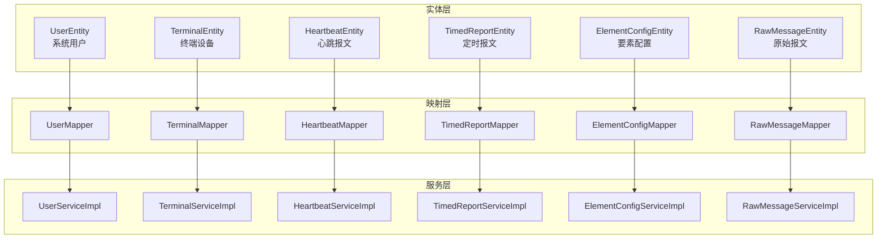
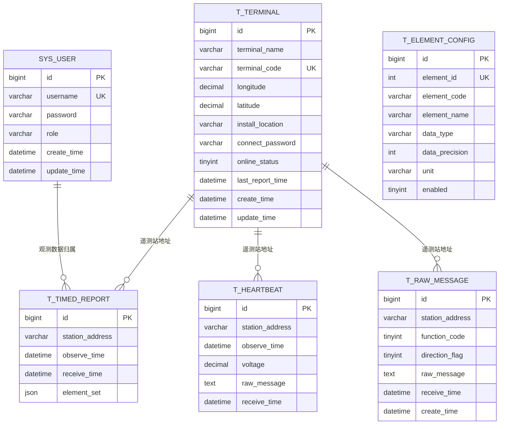
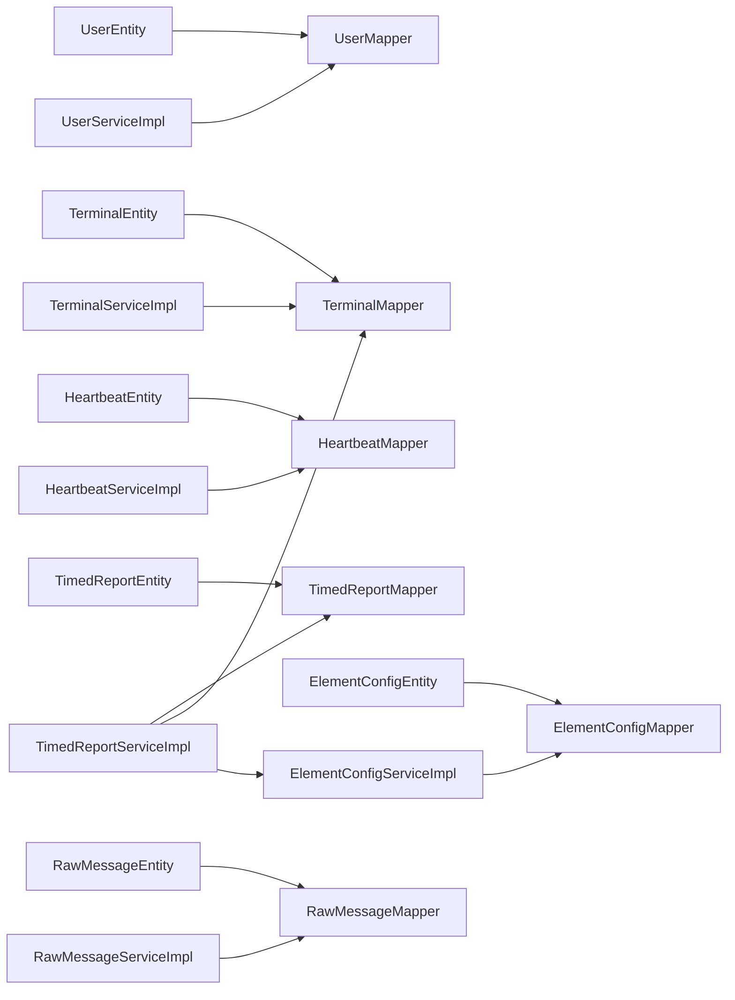

# 数据模型设计

<cite>
**本文引用的文件**
- [UserEntity.java](file://src/main/java/com/hydro/monitor/modules/entity/UserEntity.java)
- [TerminalEntity.java](file://src/main/java/com/hydro/monitor/modules/entity/TerminalEntity.java)
- [HeartbeatEntity.java](file://src/main/java/com/hydro/monitor/modules/entity/HeartbeatEntity.java)
- [TimedReportEntity.java](file://src/main/java/com/hydro/monitor/modules/entity/TimedReportEntity.java)
- [ElementConfigEntity.java](file://src/main/java/com/hydro/monitor/modules/entity/ElementConfigEntity.java)
- [RawMessageEntity.java](file://src/main/java/com/hydro/monitor/modules/entity/RawMessageEntity.java)
- [UserMapper.java](file://src/main/java/com/hydro/monitor/modules/mapper/UserMapper.java)
- [TerminalMapper.java](file://src/main/java/com/hydro/monitor/modules/mapper/TerminalMapper.java)
- [HeartbeatMapper.java](file://src/main/java/com/hydro/monitor/modules/mapper/HeartbeatMapper.java)
- [TimedReportMapper.java](file://src/main/java/com/hydro/monitor/modules/mapper/TimedReportMapper.java)
- [ElementConfigMapper.java](file://src/main/java/com/hydro/monitor/modules/mapper/ElementConfigMapper.java)
- [RawMessageMapper.java](file://src/main/java/com/hydro/monitor/modules/mapper/RawMessageMapper.java)
- [init.sql](file://src/main/resources/db/init.sql)
- [migration_raw_message.sql](file://src/main/resources/db/migration_raw_message.sql)
- [migration_timed_report.sql](file://src/main/resources/db/migration_timed_report.sql)
- [update_element_config_add_unit.sql](file://src/main/resources/db/update_element_config_add_unit.sql)
- [UserServiceImpl.java](file://src/main/java/com/hydro/monitor/modules/service/impl/UserServiceImpl.java)
- [TerminalServiceImpl.java](file://src/main/java/com/hydro/monitor/modules/service/impl/TerminalServiceImpl.java)
- [HeartbeatServiceImpl.java](file://src/main/java/com/hydro/monitor/modules/service/impl/HeartbeatServiceImpl.java)
- [TimedReportServiceImpl.java](file://src/main/java/com/hydro/monitor/modules/service/impl/TimedReportServiceImpl.java)
- [ElementConfigServiceImpl.java](file://src/main/java/com/hydro/monitor/modules/service/impl/ElementConfigServiceImpl.java)
- [RawMessageServiceImpl.java](file://src/main/java/com/hydro/monitor/modules/service/impl/RawMessageServiceImpl.java)
</cite>

## 目录
1. [简介](#简介)
2. [项目结构](#项目结构)
3. [核心组件](#核心组件)
4. [架构总览](#架构总览)
5. [详细组件分析](#详细组件分析)
6. [依赖分析](#依赖分析)
7. [性能考虑](#性能考虑)
8. [故障排查指南](#故障排查指南)
9. [结论](#结论)
10. [附录](#附录)

## 简介
本文件面向水文监测系统的数据模型设计，围绕用户、终端、心跳报文、定时报文、要素配置与原始报文六大实体展开，系统性阐述实体字段设计、业务含义、主外键与约束、数据类型选择原则、字段长度与默认值、业务规则与数据完整性保障机制，并提供使用示例与最佳实践建议。文档同时结合数据库初始化脚本与迁移脚本，说明历史演进与兼容策略。

## 项目结构
系统采用分层架构，数据模型位于 entity 层，MyBatis-Plus 提供 ORM 映射；service 层承载业务规则与数据转换；mapper 层负责数据访问；数据库脚本定义表结构、索引与约束。

图表来源
- [UserEntity.java:1-70](file://src/main/java/com/hydro/monitor/modules/entity/UserEntity.java#L1-L70)
- [TerminalEntity.java:1-74](file://src/main/java/com/hydro/monitor/modules/entity/TerminalEntity.java#L1-L74)
- [HeartbeatEntity.java:1-50](file://src/main/java/com/hydro/monitor/modules/entity/HeartbeatEntity.java#L1-L50)
- [TimedReportEntity.java:1-48](file://src/main/java/com/hydro/monitor/modules/entity/TimedReportEntity.java#L1-L48)
- [ElementConfigEntity.java:1-62](file://src/main/java/com/hydro/monitor/modules/entity/ElementConfigEntity.java#L1-L62)
- [RawMessageEntity.java:1-55](file://src/main/java/com/hydro/monitor/modules/entity/RawMessageEntity.java#L1-L55)
- [UserMapper.java:1-15](file://src/main/java/com/hydro/monitor/modules/mapper/UserMapper.java#L1-L15)
- [TerminalMapper.java:1-14](file://src/main/java/com/hydro/monitor/modules/mapper/TerminalMapper.java#L1-L14)
- [HeartbeatMapper.java](file://src/main/java/com/hydro/monitor/modules/mapper/HeartbeatMapper.java)
- [TimedReportMapper.java](file://src/main/java/com/hydro/monitor/modules/mapper/TimedReportMapper.java)
- [ElementConfigMapper.java](file://src/main/java/com/hydro/monitor/modules/mapper/ElementConfigMapper.java)
- [RawMessageMapper.java](file://src/main/java/com/hydro/monitor/modules/mapper/RawMessageMapper.java)
- [UserServiceImpl.java:1-208](file://src/main/java/com/hydro/monitor/modules/service/impl/UserServiceImpl.java#L1-L208)
- [TerminalServiceImpl.java:1-200](file://src/main/java/com/hydro/monitor/modules/service/impl/TerminalServiceImpl.java#L1-L200)
- [HeartbeatServiceImpl.java:1-59](file://src/main/java/com/hydro/monitor/modules/service/impl/HeartbeatServiceImpl.java#L1-L59)
- [TimedReportServiceImpl.java:1-332](file://src/main/java/com/hydro/monitor/modules/service/impl/TimedReportServiceImpl.java#L1-L332)
- [ElementConfigServiceImpl.java:1-239](file://src/main/java/com/hydro/monitor/modules/service/impl/ElementConfigServiceImpl.java#L1-L239)
- [RawMessageServiceImpl.java:1-160](file://src/main/java/com/hydro/monitor/modules/service/impl/RawMessageServiceImpl.java#L1-L160)

章节来源
- [UserEntity.java:1-70](file://src/main/java/com/hydro/monitor/modules/entity/UserEntity.java#L1-L70)
- [TerminalEntity.java:1-74](file://src/main/java/com/hydro/monitor/modules/entity/TerminalEntity.java#L1-L74)
- [HeartbeatEntity.java:1-50](file://src/main/java/com/hydro/monitor/modules/entity/HeartbeatEntity.java#L1-L50)
- [TimedReportEntity.java:1-48](file://src/main/java/com/hydro/monitor/modules/entity/TimedReportEntity.java#L1-L48)
- [ElementConfigEntity.java:1-62](file://src/main/java/com/hydro/monitor/modules/entity/ElementConfigEntity.java#L1-L62)
- [RawMessageEntity.java:1-55](file://src/main/java/com/hydro/monitor/modules/entity/RawMessageEntity.java#L1-L55)

## 核心组件
本节对六大实体的字段、业务含义、约束与默认值进行逐项说明，并给出数据类型选择原则与长度限制建议。

- UserEntity（系统用户）
  - 字段与含义：主键ID、用户名、真实姓名、邮箱、手机号、密码（BCrypt）、角色、状态、创建/更新时间。
  - 约束与默认值：用户名唯一；角色默认“USER”；创建/更新时间默认当前时间戳。
  - 数据类型选择：字符串型（VARCHAR）用于标识与文本；整型（TINYINT/INT）用于状态与枚举；时间型（DATETIME）用于审计时间。
  - 业务规则：密码必须加密存储；状态1表示正常，0表示禁用；用户名全局唯一。

- TerminalEntity（终端设备）
  - 字段与含义：主键ID、终端名称、终端编号（遥测站编号）、经纬度、安装位置、连接密码、创建/更新时间、在线状态、最后上报时间。
  - 约束与默认值：终端编号唯一；在线状态默认0（离线）；创建/更新时间默认当前时间戳。
  - 数据类型选择：经纬度使用高精度十进制（DECIMAL），便于地理计算；状态使用TINYINT布尔语义。
  - 业务规则：首次发现终端时可自动创建并置为在线；最后上报时间用于状态刷新。

- HeartbeatEntity（心跳报文）
  - 字段与含义：主键ID、遥测站地址、观测时间、电源电压、原始报文（十六进制字符串）、接收时间。
  - 约束与默认值：接收时间默认当前时间戳；索引覆盖遥测站地址与观测时间。
  - 数据类型选择：电压使用DECIMAL保证精度；原始报文使用TEXT以容纳完整十六进制串。
  - 业务规则：用于监测终端在线与供电状态；支持按观测时间分页查询。

- TimedReportEntity（定时报文）
  - 字段与含义：主键ID、遥测站地址、观测时间、接收时间、要素集（JSON）。
  - 约束与默认值：接收时间默认当前时间戳；索引覆盖遥测站地址与观测时间。
  - 数据类型选择：要素集采用JSON类型，便于灵活扩展；历史字段迁移至JSON统一存储。
  - 业务规则：要素集为键值对集合，键为要素编码，值为数值；服务层解析并关联要素配置。

- ElementConfigEntity（要素配置）
  - 字段与含义：主键ID、要素标识符（十六进制）、要素编码、要素名称、数据类型、数据精度、单位、启用状态。
  - 约束与默认值：要素标识符唯一；数据类型默认“数值型”，精度默认1，启用默认1；单位字段已迁移增加。
  - 数据类型选择：要素标识符为整型；单位为短字符串；启用状态为TINYINT。
  - 业务规则：启用状态控制要素是否参与解析；单位用于前端展示与报表输出。

- RawMessageEntity（原始报文）
  - 字段与含义：主键ID、遥测站地址、功能码、上下行标识、原始报文（十六进制字符串）、接收时间、创建时间。
  - 约束与默认值：接收时间默认当前时间戳；索引覆盖遥测站地址、接收时间与功能码。
  - 数据类型选择：原始报文使用TEXT；功能码与方向标志使用TINYINT。
  - 业务规则：支持解析为结构化JSON；用于调试与协议验证。

章节来源
- [UserEntity.java:1-70](file://src/main/java/com/hydro/monitor/modules/entity/UserEntity.java#L1-L70)
- [TerminalEntity.java:1-74](file://src/main/java/com/hydro/monitor/modules/entity/TerminalEntity.java#L1-L74)
- [HeartbeatEntity.java:1-50](file://src/main/java/com/hydro/monitor/modules/entity/HeartbeatEntity.java#L1-L50)
- [TimedReportEntity.java:1-48](file://src/main/java/com/hydro/monitor/modules/entity/TimedReportEntity.java#L1-L48)
- [ElementConfigEntity.java:1-62](file://src/main/java/com/hydro/monitor/modules/entity/ElementConfigEntity.java#L1-L62)
- [RawMessageEntity.java:1-55](file://src/main/java/com/hydro/monitor/modules/entity/RawMessageEntity.java#L1-L55)

## 架构总览
下图展示实体与数据库表的对应关系、索引与典型查询路径。

图表来源
- [init.sql:6-92](file://src/main/resources/db/init.sql#L6-L92)
- [migration_timed_report.sql:6-38](file://src/main/resources/db/migration_timed_report.sql#L6-L38)
- [migration_raw_message.sql:2-13](file://src/main/resources/db/migration_raw_message.sql#L2-L13)
- [update_element_config_add_unit.sql:7-17](file://src/main/resources/db/update_element_config_add_unit.sql#L7-L17)

章节来源
- [init.sql:6-92](file://src/main/resources/db/init.sql#L6-L92)
- [migration_timed_report.sql:6-38](file://src/main/resources/db/migration_timed_report.sql#L6-L38)
- [migration_raw_message.sql:2-13](file://src/main/resources/db/migration_raw_message.sql#L2-L13)
- [update_element_config_add_unit.sql:7-17](file://src/main/resources/db/update_element_config_add_unit.sql#L7-L17)

## 详细组件分析

### UserEntity（系统用户）
- 设计要点
  - 主键采用雪花算法（ASSIGN_ID），确保分布式唯一性。
  - 密码通过BCrypt加密存储，安全合规。
  - 用户名唯一约束，避免重复注册。
  - 创建/更新时间自动维护，便于审计。
- 字段与约束
  - username：唯一索引，长度建议不超过50字符。
  - password：长度建议不小于100字符（BCrypt哈希）。
  - role：默认“USER”，可扩展为枚举或字典。
  - status：1-正常，0-禁用。
- 业务规则
  - 创建用户时校验用户名唯一；更新用户时仅更新非空字段。
  - 密码变更需重新加密；状态变更需权限控制。
- 使用示例与最佳实践
  - 创建用户：填充必要字段后调用服务层创建方法，服务层执行唯一性校验与密码加密。
  - 分页查询：支持按用户名、真实姓名、手机号、角色、状态过滤，按创建时间倒序。
  - 最佳实践：禁止明文存储密码；对敏感字段脱敏输出；统一时间时区。

章节来源
- [UserEntity.java:1-70](file://src/main/java/com/hydro/monitor/modules/entity/UserEntity.java#L1-L70)
- [UserMapper.java:1-15](file://src/main/java/com/hydro/monitor/modules/mapper/UserMapper.java#L1-L15)
- [UserServiceImpl.java:38-101](file://src/main/java/com/hydro/monitor/modules/service/impl/UserServiceImpl.java#L38-L101)
- [init.sql:31-47](file://src/main/resources/db/init.sql#L31-L47)

### TerminalEntity（终端设备）
- 设计要点
  - 终端编号作为唯一标识，便于与SL651协议遥测站地址一致。
  - 经纬度使用DECIMAL(10,6)保证地理精度。
  - 在线状态与最后上报时间用于运行监控。
- 字段与约束
  - terminalCode：唯一索引，长度建议不超过50字符。
  - longitude/latitude：DECIMAL(10,6)，满足地理坐标精度需求。
  - onlineStatus：默认0（离线）。
- 业务规则
  - 首次发现终端自动创建并置为在线，更新最后上报时间。
  - 修改终端编号需保证全局唯一。
- 使用示例与最佳实践
  - 创建终端：传入终端名称、编号、经纬度、安装位置与连接密码。
  - 更新终端：支持部分字段更新；修改编号时进行唯一性校验。
  - 最佳实践：定期清理离线超期终端；经纬度入库前进行有效性校验。

章节来源
- [TerminalEntity.java:1-74](file://src/main/java/com/hydro/monitor/modules/entity/TerminalEntity.java#L1-L74)
- [TerminalMapper.java:1-14](file://src/main/java/com/hydro/monitor/modules/mapper/TerminalMapper.java#L1-L14)
- [TerminalServiceImpl.java:33-108](file://src/main/java/com/hydro/monitor/modules/service/impl/TerminalServiceImpl.java#L33-L108)
- [init.sql:75-92](file://src/main/resources/db/init.sql#L75-L92)

### HeartbeatEntity（心跳报文）
- 设计要点
  - 记录终端心跳周期性上报的观测数据，包括电源电压与原始报文。
  - 接收时间默认当前时间戳，便于统计延迟与异常。
- 字段与约束
  - stationAddress：建立索引，支持按站址查询。
  - voltage：DECIMAL(10,3)，满足电压测量精度。
  - receiveTime：默认当前时间戳。
- 业务规则
  - 保存成功后可用于在线状态判定与告警。
  - 支持按观测时间范围分页查询。
- 使用示例与最佳实践
  - 保存心跳：解析报文后构造实体并调用服务层保存。
  - 查询心跳：按时间区间与站址过滤，按观测时间倒序。
  - 最佳实践：对异常电压阈值进行告警；定期清理过期心跳记录。

章节来源
- [HeartbeatEntity.java:1-50](file://src/main/java/com/hydro/monitor/modules/entity/HeartbeatEntity.java#L1-L50)
- [HeartbeatMapper.java](file://src/main/java/com/hydro/monitor/modules/mapper/HeartbeatMapper.java)
- [HeartbeatServiceImpl.java:26-57](file://src/main/java/com/hydro/monitor/modules/service/impl/HeartbeatServiceImpl.java#L26-L57)
- [init.sql:6-17](file://src/main/resources/db/init.sql#L6-L17)

### TimedReportEntity（定时报文）
- 设计要点
  - 历史字段统一迁移为JSON类型的element_set，提升扩展性与查询灵活性。
  - 支持按遥测站地址与观测时间分页查询。
- 字段与约束
  - element_set：JSON类型，键为要素编码，值为数值。
  - receiveTime：默认当前时间戳。
- 业务规则
  - 服务层解析element_set并与要素配置关联，生成结构化要素列表。
  - 支持按全部站点最新记录、指定站点分页查询。
- 使用示例与最佳实践
  - 保存定时报文：解析报文后构造实体并调用服务层保存。
  - 查询定时报文：支持按站址与时间区间过滤；可关联终端信息与要素配置。
  - 最佳实践：定期归档历史数据；对JSON结构进行校验与异常处理。

章节来源
- [TimedReportEntity.java:1-48](file://src/main/java/com/hydro/monitor/modules/entity/TimedReportEntity.java#L1-L48)
- [TimedReportMapper.java](file://src/main/java/com/hydro/monitor/modules/mapper/TimedReportMapper.java)
- [TimedReportServiceImpl.java:44-183](file://src/main/java/com/hydro/monitor/modules/service/impl/TimedReportServiceImpl.java#L44-L183)
- [migration_timed_report.sql:6-38](file://src/main/resources/db/migration_timed_report.sql#L6-L38)
- [init.sql:19-29](file://src/main/resources/db/init.sql#L19-L29)

### ElementConfigEntity（要素配置）
- 设计要点
  - 配置SL651协议要素标识符与数据库字段映射关系，支持启用/禁用与单位标注。
  - 提供缓存机制，减少频繁查询带来的开销。
- 字段与约束
  - elementId：唯一索引，十六进制要素标识符。
  - dataPrecision：默认1；enabled：默认1（启用）。
  - unit：迁移后新增字段，用于展示与报表。
- 业务规则
  - 启用状态为1的要素参与解析；单位用于前端显示与报表单位转换。
  - 修改要素标识符需保证唯一性。
- 使用示例与最佳实践
  - 新增要素配置：校验要素标识符唯一后插入。
  - 更新要素配置：支持部分字段更新；更新后清除缓存以便下次生效。
  - 最佳实践：定期校验要素配置与协议版本一致性；对单位进行标准化管理。

章节来源
- [ElementConfigEntity.java:1-62](file://src/main/java/com/hydro/monitor/modules/entity/ElementConfigEntity.java#L1-L62)
- [ElementConfigMapper.java](file://src/main/java/com/hydro/monitor/modules/mapper/ElementConfigMapper.java)
- [ElementConfigServiceImpl.java:130-226](file://src/main/java/com/hydro/monitor/modules/service/impl/ElementConfigServiceImpl.java#L130-L226)
- [update_element_config_add_unit.sql:7-17](file://src/main/resources/db/update_element_config_add_unit.sql#L7-L17)
- [init.sql:49-62](file://src/main/resources/db/init.sql#L49-L62)

### RawMessageEntity（原始报文）
- 设计要点
  - 记录原始报文的十六进制字符串、功能码与上下行标识，便于协议解析与调试。
  - 支持按站址、功能码与接收时间分页查询。
- 字段与约束
  - functionCode/directionFlag：TINYINT，分别表示功能码与上下行标识。
  - rawMessage：TEXT，存储完整十六进制字符串。
  - receiveTime：默认当前时间戳。
- 业务规则
  - 保存原始报文后可调用解析器生成结构化JSON。
  - 支持按功能码分类统计与问题定位。
- 使用示例与最佳实践
  - 保存原始报文：解析完成后构造实体并调用服务层保存。
  - 解析报文：将十六进制字符串转字节数组，交由协议解析器处理。
  - 最佳实践：对报文长度与格式进行校验；记录解析异常以便追踪。

章节来源
- [RawMessageEntity.java:1-55](file://src/main/java/com/hydro/monitor/modules/entity/RawMessageEntity.java#L1-L55)
- [RawMessageMapper.java](file://src/main/java/com/hydro/monitor/modules/mapper/RawMessageMapper.java)
- [RawMessageServiceImpl.java:32-110](file://src/main/java/com/hydro/monitor/modules/service/impl/RawMessageServiceImpl.java#L32-L110)
- [migration_raw_message.sql:2-13](file://src/main/resources/db/migration_raw_message.sql#L2-L13)
- [init.sql:1-1](file://src/main/resources/db/init.sql#L1-L1)

## 依赖分析
- 实体与映射
  - 各实体通过MyBatis-Plus注解映射到对应表，主键采用雪花算法。
  - Mapper接口继承BaseMapper，提供通用CRUD能力。
- 服务层依赖
  - 服务层组合Mapper与第三方解析器（如协议解析器），承担业务规则与数据转换。
  - TimedReportServiceImpl依赖TerminalMapper与ElementConfigService，实现要素集解析与VO转换。
- 数据库脚本演进
  - init.sql定义初始表结构与约束。
  - migration_timed_report.sql将历史字段迁移为JSON统一存储。
  - migration_raw_message.sql定义原始报文表结构。
  - update_element_config_add_unit.sql为要素配置表增加单位字段。

图表来源
- [UserEntity.java:1-70](file://src/main/java/com/hydro/monitor/modules/entity/UserEntity.java#L1-L70)
- [TerminalEntity.java:1-74](file://src/main/java/com/hydro/monitor/modules/entity/TerminalEntity.java#L1-L74)
- [HeartbeatEntity.java:1-50](file://src/main/java/com/hydro/monitor/modules/entity/HeartbeatEntity.java#L1-L50)
- [TimedReportEntity.java:1-48](file://src/main/java/com/hydro/monitor/modules/entity/TimedReportEntity.java#L1-L48)
- [ElementConfigEntity.java:1-62](file://src/main/java/com/hydro/monitor/modules/entity/ElementConfigEntity.java#L1-L62)
- [RawMessageEntity.java:1-55](file://src/main/java/com/hydro/monitor/modules/entity/RawMessageEntity.java#L1-L55)
- [UserMapper.java:1-15](file://src/main/java/com/hydro/monitor/modules/mapper/UserMapper.java#L1-L15)
- [TerminalMapper.java:1-14](file://src/main/java/com/hydro/monitor/modules/mapper/TerminalMapper.java#L1-L14)
- [HeartbeatMapper.java](file://src/main/java/com/hydro/monitor/modules/mapper/HeartbeatMapper.java)
- [TimedReportMapper.java](file://src/main/java/com/hydro/monitor/modules/mapper/TimedReportMapper.java)
- [ElementConfigMapper.java](file://src/main/java/com/hydro/monitor/modules/mapper/ElementConfigMapper.java)
- [RawMessageMapper.java](file://src/main/java/com/hydro/monitor/modules/mapper/RawMessageMapper.java)
- [UserServiceImpl.java:1-208](file://src/main/java/com/hydro/monitor/modules/service/impl/UserServiceImpl.java#L1-L208)
- [TerminalServiceImpl.java:1-200](file://src/main/java/com/hydro/monitor/modules/service/impl/TerminalServiceImpl.java#L1-L200)
- [HeartbeatServiceImpl.java:1-59](file://src/main/java/com/hydro/monitor/modules/service/impl/HeartbeatServiceImpl.java#L1-L59)
- [TimedReportServiceImpl.java:1-332](file://src/main/java/com/hydro/monitor/modules/service/impl/TimedReportServiceImpl.java#L1-L332)
- [ElementConfigServiceImpl.java:1-239](file://src/main/java/com/hydro/monitor/modules/service/impl/ElementConfigServiceImpl.java#L1-L239)
- [RawMessageServiceImpl.java:1-160](file://src/main/java/com/hydro/monitor/modules/service/impl/RawMessageServiceImpl.java#L1-L160)

章节来源
- [UserServiceImpl.java:1-208](file://src/main/java/com/hydro/monitor/modules/service/impl/UserServiceImpl.java#L1-L208)
- [TerminalServiceImpl.java:1-200](file://src/main/java/com/hydro/monitor/modules/service/impl/TerminalServiceImpl.java#L1-L200)
- [HeartbeatServiceImpl.java:1-59](file://src/main/java/com/hydro/monitor/modules/service/impl/HeartbeatServiceImpl.java#L1-L59)
- [TimedReportServiceImpl.java:1-332](file://src/main/java/com/hydro/monitor/modules/service/impl/TimedReportServiceImpl.java#L1-L332)
- [ElementConfigServiceImpl.java:1-239](file://src/main/java/com/hydro/monitor/modules/service/impl/ElementConfigServiceImpl.java#L1-L239)
- [RawMessageServiceImpl.java:1-160](file://src/main/java/com/hydro/monitor/modules/service/impl/RawMessageServiceImpl.java#L1-L160)

## 性能考虑
- 索引策略
  - 心跳与定时报文：对station_address与observe_time建立索引，支持高频查询。
  - 终端表：对terminal_code建立唯一索引，对online_status与last_report_time建立普通索引。
  - 原始报文：对station_address、receive_time与function_code建立索引，优化检索与统计。
- 查询优化
  - 分页查询统一按时间倒序，避免全表扫描。
  - TimedReportServiceImpl使用子查询获取各站点最新记录，减少复杂联表。
- 存储与迁移
  - 定时报文采用JSON统一存储要素集，简化schema变更；迁移脚本保证数据一致性。
  - 原始报文使用TEXT存储十六进制字符串，避免二进制字段带来的兼容问题。
- 缓存策略
  - 要素配置采用懒加载+双重检查锁缓存映射关系，降低解析成本。

章节来源
- [init.sql:6-92](file://src/main/resources/db/init.sql#L6-L92)
- [migration_timed_report.sql:6-38](file://src/main/resources/db/migration_timed_report.sql#L6-L38)
- [migration_raw_message.sql:2-13](file://src/main/resources/db/migration_raw_message.sql#L2-L13)
- [ElementConfigServiceImpl.java:34-63](file://src/main/java/com/hydro/monitor/modules/service/impl/ElementConfigServiceImpl.java#L34-L63)

## 故障排查指南
- 用户相关
  - 现象：创建用户时报错“用户名已存在”。
  - 排查：确认用户名是否已在sys_user表中存在；检查唯一索引是否生效。
  - 处理：更换用户名或删除重复记录后重试。
- 终端相关
  - 现象：更新终端编号时报错“终端编号已存在”。
  - 排查：确认新编号是否被其他终端使用；检查unique约束。
  - 处理：修改为唯一编号或调整其他终端编号。
- 心跳与定时报文
  - 现象：保存失败或影响行数为0。
  - 排查：检查主键是否正确生成（雪花算法）；确认表结构与索引。
  - 处理：重试保存；核对观测时间与站址是否合理。
- 原始报文解析
  - 现象：parseMessage抛出异常。
  - 排查：十六进制字符串是否合法；协议解析器是否支持该功能码。
  - 处理：修正报文格式；升级解析器或协议版本。
- 要素配置
  - 现象：要素解析为空或单位缺失。
  - 排查：确认要素配置是否启用；单位字段是否已迁移。
  - 处理：启用对应要素；执行单位字段迁移脚本。

章节来源
- [UserServiceImpl.java:40-48](file://src/main/java/com/hydro/monitor/modules/service/impl/UserServiceImpl.java#L40-L48)
- [TerminalServiceImpl.java:71-81](file://src/main/java/com/hydro/monitor/modules/service/impl/TerminalServiceImpl.java#L71-L81)
- [RawMessageServiceImpl.java:91-110](file://src/main/java/com/hydro/monitor/modules/service/impl/RawMessageServiceImpl.java#L91-L110)
- [ElementConfigServiceImpl.java:169-178](file://src/main/java/com/hydro/monitor/modules/service/impl/ElementConfigServiceImpl.java#L169-L178)
- [update_element_config_add_unit.sql:7-17](file://src/main/resources/db/update_element_config_add_unit.sql#L7-L17)

## 结论
本数据模型围绕水文监测场景，采用MyBatis-Plus进行ORM映射，结合数据库脚本完成表结构与约束定义。六大实体职责清晰、字段设计合理，既满足当前业务需求，又具备良好的扩展性与可维护性。通过索引优化、JSON统一存储与缓存策略，系统在查询性能与开发效率之间取得平衡。建议持续完善要素配置与协议版本的同步机制，加强数据质量与异常处理能力。

## 附录
- 数据类型选择原则
  - 数值型：使用DECIMAL保证精度，如电压、经纬度。
  - 文本型：VARCHAR用于标识与短文本；TEXT用于大文本（如原始报文）。
  - 时间型：DATETIME统一记录创建与更新时间。
  - 布尔型：TINYINT表达1/0语义，如在线状态与启用状态。
- 字段长度与默认值
  - 用户名、要素编码、要素名称等标识字段长度建议不超过50~100字符。
  - 数据精度默认1，单位字段默认空值或标准单位。
  - 时间字段默认当前时间戳，更新时间支持自动更新。
- 最佳实践清单
  - 密码必须加密存储；禁止明文传输与日志输出。
  - 唯一性约束配合业务校验，避免并发冲突。
  - JSON字段解析失败时记录日志并降级处理。
  - 定期清理过期数据，保持索引与查询性能。