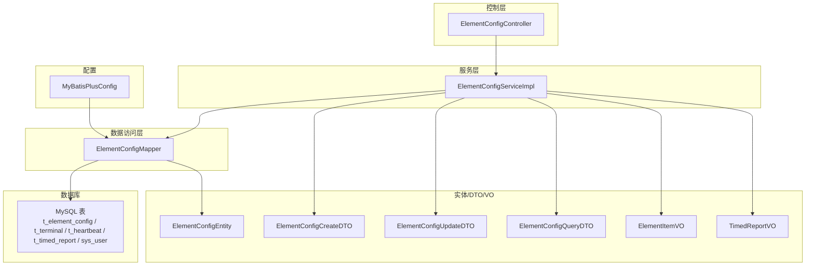
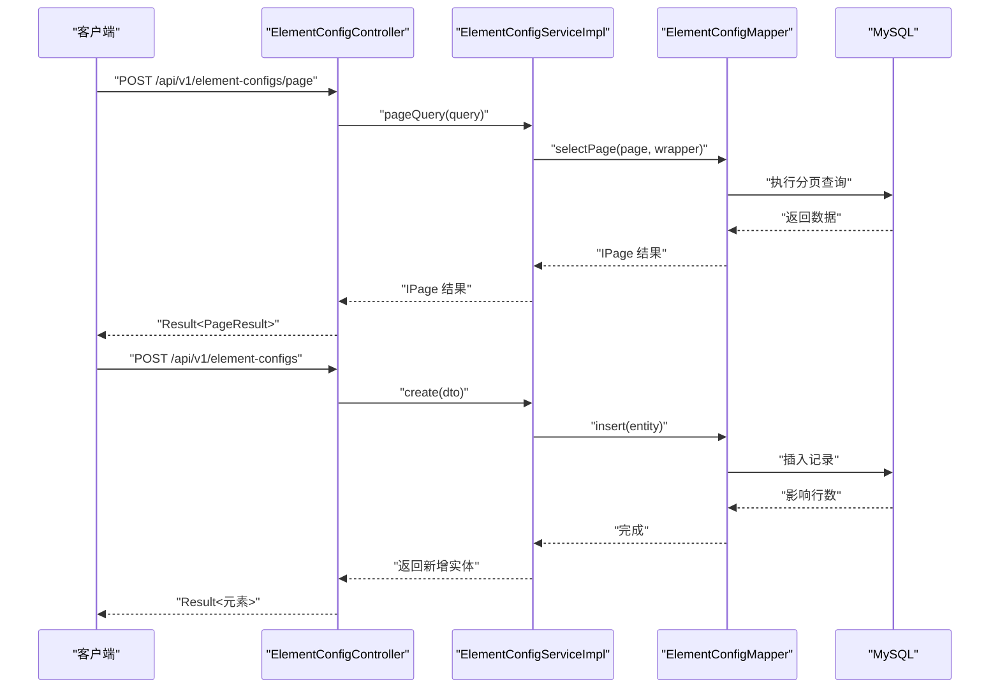
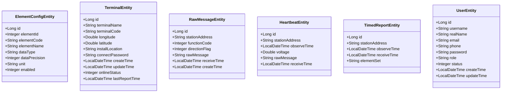
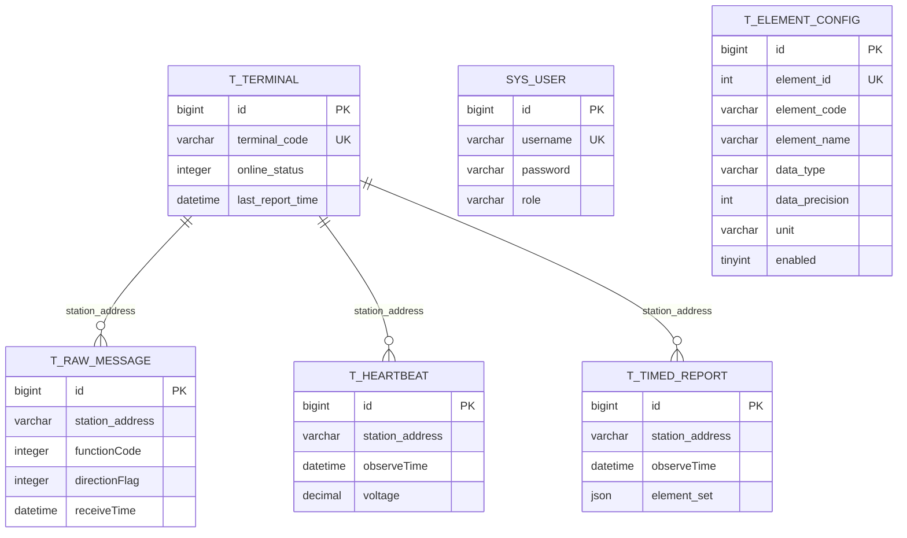
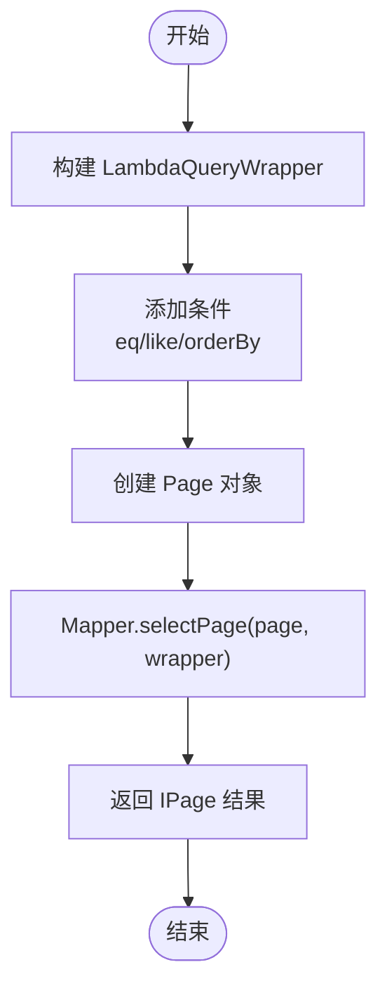
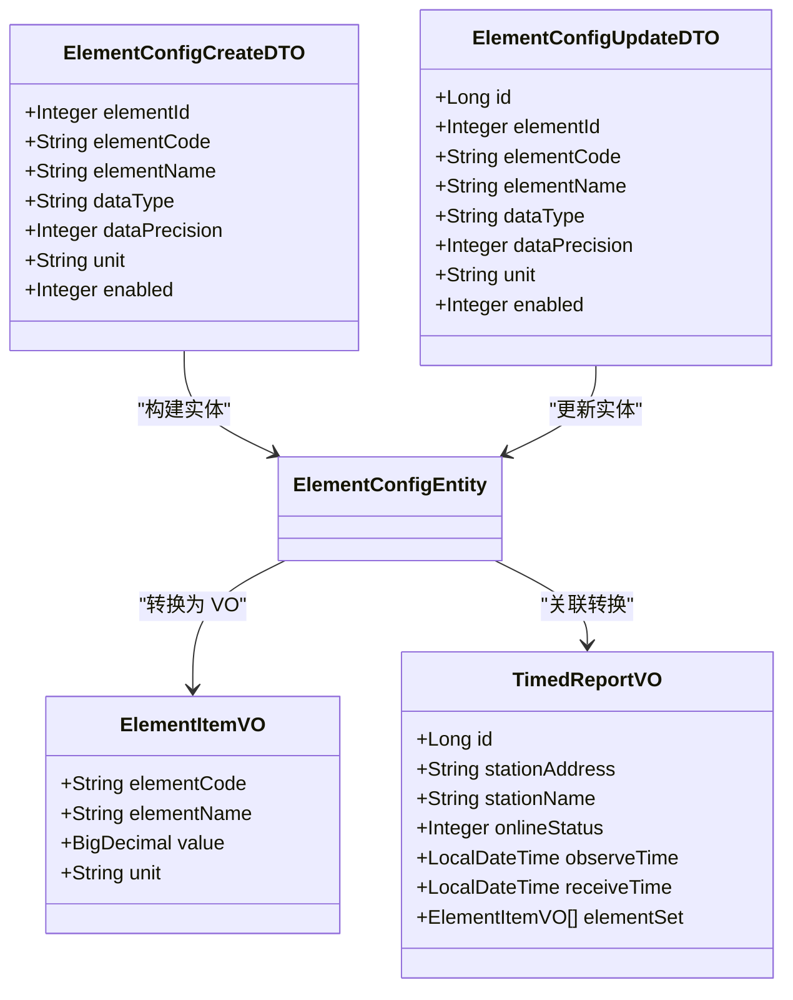
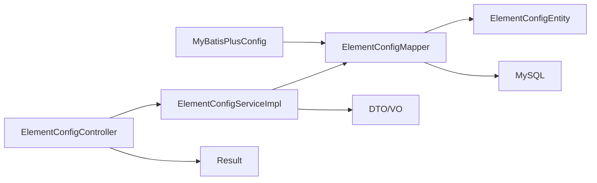

# 数据管理

<cite>
**本文引用的文件**
- [MyBatisPlusConfig.java](file://src/main/java/com/hydro/monitor/config/MyBatisPlusConfig.java)
- [ElementConfigEntity.java](file://src/main/java/com/hydro/monitor/modules/entity/ElementConfigEntity.java)
- [TerminalEntity.java](file://src/main/java/com/hydro/monitor/modules/entity/TerminalEntity.java)
- [RawMessageEntity.java](file://src/main/java/com/hydro/monitor/modules/entity/RawMessageEntity.java)
- [HeartbeatEntity.java](file://src/main/java/com/hydro/monitor/modules/entity/HeartbeatEntity.java)
- [TimedReportEntity.java](file://src/main/java/com/hydro/monitor/modules/entity/TimedReportEntity.java)
- [UserEntity.java](file://src/main/java/com/hydro/monitor/modules/entity/UserEntity.java)
- [ElementConfigMapper.java](file://src/main/java/com/hydro/monitor/modules/mapper/ElementConfigMapper.java)
- [TerminalMapper.java](file://src/main/java/com/hydro/monitor/modules/mapper/TerminalMapper.java)
- [RawMessageMapper.java](file://src/main/java/com/hydro/monitor/modules/mapper/RawMessageMapper.java)
- [ElementConfigCreateDTO.java](file://src/main/java/com/hydro/monitor/modules/dto/ElementConfigCreateDTO.java)
- [ElementConfigUpdateDTO.java](file://src/main/java/com/hydro/monitor/modules/dto/ElementConfigUpdateDTO.java)
- [ElementConfigQueryDTO.java](file://src/main/java/com/hydro/monitor/modules/dto/ElementConfigQueryDTO.java)
- [ElementConfigServiceImpl.java](file://src/main/java/com/hydro/monitor/modules/service/impl/ElementConfigServiceImpl.java)
- [ElementConfigController.java](file://src/main/java/com/hydro/monitor/modules/controller/ElementConfigController.java)
- [ElementItemVO.java](file://src/main/java/com/hydro/monitor/modules/vo/ElementItemVO.java)
- [TimedReportVO.java](file://src/main/java/com/hydro/monitor/modules/vo/TimedReportVO.java)
- [Result.java](file://src/main/java/com/hydro/monitor/common/Result.java)
- [init.sql](file://src/main/resources/db/init.sql)
- [migration_raw_message.sql](file://src/main/resources/db/migration_raw_message.sql)
- [migration_timed_report.sql](file://src/main/resources/db/migration_timed_report.sql)
- [update_element_config_add_unit.sql](file://src/main/resources/db/update_element_config_add_unit.sql)
- [update_element_config_remove_db_field_name.sql](file://src/main/resources/db/update_element_config_remove_db_field_name.sql)
</cite>

## 目录
1. [简介](#简介)
2. [项目结构](#项目结构)
3. [核心组件](#核心组件)
4. [架构总览](#架构总览)
5. [详细组件分析](#详细组件分析)
6. [依赖分析](#依赖分析)
7. [性能考虑](#性能考虑)
8. [故障排查指南](#故障排查指南)
9. [结论](#结论)
10. [附录](#附录)

## 简介
本文件面向水文监测系统的数据管理，系统性阐述数据模型设计原则、实体类定义规范与关系映射策略；深入解析 MyBatis-Plus 在数据持久化中的应用，包括通用 Mapper 接口设计、复杂查询实现与批量操作优化；说明数据传输对象（DTO）与视图对象（VO）的设计模式、使用场景与转换机制；给出数据验证规则、业务约束与数据完整性保障措施；提供数据库表结构设计、索引优化策略与查询性能调优方案，并解释数据生命周期管理、备份恢复策略与数据迁移方案。

## 项目结构
项目采用分层架构，围绕“控制层-服务层-数据访问层-实体/DTO/VO-配置”组织模块。数据管理相关的关键目录与文件如下：
- 实体层：位于 modules/entity，定义与数据库表一一对应的实体类，标注 MyBatis-Plus 表名与主键策略
- 数据访问层：位于 modules/mapper，继承 BaseMapper，提供通用 CRUD 能力
- 服务层：位于 modules/service/impl，封装业务逻辑、事务控制与复杂查询
- 控制层：位于 modules/controller，暴露 REST 接口，统一响应包装
- DTO/VO：位于 modules/dto 与 modules/vo，分别承载请求/响应数据结构
- 配置：config 下的 MyBatisPlusConfig 提供分页拦截器配置
- 数据库脚本：resources/db 下包含初始化与迁移脚本

**图表来源**
- [ElementConfigController.java:1-97](file://src/main/java/com/hydro/monitor/modules/controller/ElementConfigController.java#L1-L97)
- [ElementConfigServiceImpl.java:1-239](file://src/main/java/com/hydro/monitor/modules/service/impl/ElementConfigServiceImpl.java#L1-L239)
- [ElementConfigMapper.java:1-15](file://src/main/java/com/hydro/monitor/modules/mapper/ElementConfigMapper.java#L1-L15)
- [ElementConfigEntity.java:1-62](file://src/main/java/com/hydro/monitor/modules/entity/ElementConfigEntity.java#L1-L62)
- [ElementConfigCreateDTO.java:1-65](file://src/main/java/com/hydro/monitor/modules/dto/ElementConfigCreateDTO.java#L1-L65)
- [ElementConfigUpdateDTO.java:1-54](file://src/main/java/com/hydro/monitor/modules/dto/ElementConfigUpdateDTO.java#L1-L54)
- [ElementConfigQueryDTO.java](file://src/main/java/com/hydro/monitor/modules/dto/ElementConfigQueryDTO.java)
- [ElementItemVO.java:1-41](file://src/main/java/com/hydro/monitor/modules/vo/ElementItemVO.java#L1-L41)
- [TimedReportVO.java:1-58](file://src/main/java/com/hydro/monitor/modules/vo/TimedReportVO.java#L1-L58)
- [MyBatisPlusConfig.java:1-39](file://src/main/java/com/hydro/monitor/config/MyBatisPlusConfig.java#L1-L39)

**章节来源**
- [MyBatisPlusConfig.java:1-39](file://src/main/java/com/hydro/monitor/config/MyBatisPlusConfig.java#L1-L39)
- [ElementConfigEntity.java:1-62](file://src/main/java/com/hydro/monitor/modules/entity/ElementConfigEntity.java#L1-L62)
- [ElementConfigMapper.java:1-15](file://src/main/java/com/hydro/monitor/modules/mapper/ElementConfigMapper.java#L1-L15)
- [ElementConfigServiceImpl.java:1-239](file://src/main/java/com/hydro/monitor/modules/service/impl/ElementConfigServiceImpl.java#L1-L239)
- [ElementConfigController.java:1-97](file://src/main/java/com/hydro/monitor/modules/controller/ElementConfigController.java#L1-L97)
- [ElementConfigCreateDTO.java:1-65](file://src/main/java/com/hydro/monitor/modules/dto/ElementConfigCreateDTO.java#L1-L65)
- [ElementConfigUpdateDTO.java:1-54](file://src/main/java/com/hydro/monitor/modules/dto/ElementConfigUpdateDTO.java#L1-L54)
- [ElementConfigQueryDTO.java](file://src/main/java/com/hydro/monitor/modules/dto/ElementConfigQueryDTO.java)
- [ElementItemVO.java:1-41](file://src/main/java/com/hydro/monitor/modules/vo/ElementItemVO.java#L1-L41)
- [TimedReportVO.java:1-58](file://src/main/java/com/hydro/monitor/modules/vo/TimedReportVO.java#L1-L58)
- [init.sql:1-93](file://src/main/resources/db/init.sql#L1-L93)

## 核心组件
- 实体类（Entity）
  - 使用注解声明表名与主键策略，字段命名遵循数据库规范，时间字段使用 Java 时间类型
  - 典型实体：要素配置、终端设备、原始报文、心跳报文、定时报表、系统用户
- Mapper 接口（Mapper）
  - 继承 BaseMapper，自动获得通用 CRUD 能力；可扩展自定义 SQL 映射
- 服务实现（ServiceImpl）
  - 封装业务流程、参数校验、事务控制与缓存策略；提供分页查询与条件过滤
- 控制器（Controller）
  - 统一响应包装 Result，暴露 REST 接口，对接 DTO/VO
- DTO/VO
  - DTO 用于请求参数校验与传输；VO 用于对外展示的数据结构
- 配置（MyBatisPlusConfig）
  - 注册分页拦截器，设置最大单页限制与溢出策略

**章节来源**
- [ElementConfigEntity.java:1-62](file://src/main/java/com/hydro/monitor/modules/entity/ElementConfigEntity.java#L1-L62)
- [TerminalEntity.java:1-74](file://src/main/java/com/hydro/monitor/modules/entity/TerminalEntity.java#L1-L74)
- [RawMessageEntity.java:1-55](file://src/main/java/com/hydro/monitor/modules/entity/RawMessageEntity.java#L1-L55)
- [HeartbeatEntity.java:1-50](file://src/main/java/com/hydro/monitor/modules/entity/HeartbeatEntity.java#L1-L50)
- [TimedReportEntity.java:1-48](file://src/main/java/com/hydro/monitor/modules/entity/TimedReportEntity.java#L1-L48)
- [UserEntity.java:1-70](file://src/main/java/com/hydro/monitor/modules/entity/UserEntity.java#L1-L70)
- [ElementConfigMapper.java:1-15](file://src/main/java/com/hydro/monitor/modules/mapper/ElementConfigMapper.java#L1-L15)
- [TerminalMapper.java:1-14](file://src/main/java/com/hydro/monitor/modules/mapper/TerminalMapper.java#L1-L14)
- [RawMessageMapper.java:1-15](file://src/main/java/com/hydro/monitor/modules/mapper/RawMessageMapper.java#L1-L15)
- [ElementConfigServiceImpl.java:1-239](file://src/main/java/com/hydro/monitor/modules/service/impl/ElementConfigServiceImpl.java#L1-L239)
- [ElementConfigController.java:1-97](file://src/main/java/com/hydro/monitor/modules/controller/ElementConfigController.java#L1-L97)
- [ElementConfigCreateDTO.java:1-65](file://src/main/java/com/hydro/monitor/modules/dto/ElementConfigCreateDTO.java#L1-L65)
- [ElementConfigUpdateDTO.java:1-54](file://src/main/java/com/hydro/monitor/modules/dto/ElementConfigUpdateDTO.java#L1-L54)
- [ElementItemVO.java:1-41](file://src/main/java/com/hydro/monitor/modules/vo/ElementItemVO.java#L1-L41)
- [TimedReportVO.java:1-58](file://src/main/java/com/hydro/monitor/modules/vo/TimedReportVO.java#L1-L58)
- [MyBatisPlusConfig.java:1-39](file://src/main/java/com/hydro/monitor/config/MyBatisPlusConfig.java#L1-L39)

## 架构总览
下图展示了从控制器到数据库的完整数据通路，体现分层职责与数据流向：

**图表来源**
- [ElementConfigController.java:1-97](file://src/main/java/com/hydro/monitor/modules/controller/ElementConfigController.java#L1-L97)
- [ElementConfigServiceImpl.java:1-239](file://src/main/java/com/hydro/monitor/modules/service/impl/ElementConfigServiceImpl.java#L1-L239)
- [ElementConfigMapper.java:1-15](file://src/main/java/com/hydro/monitor/modules/mapper/ElementConfigMapper.java#L1-L15)
- [MyBatisPlusConfig.java:1-39](file://src/main/java/com/hydro/monitor/config/MyBatisPlusConfig.java#L1-L39)

## 详细组件分析

### 数据模型设计原则与实体类规范
- 设计原则
  - 字段命名与数据库一致，使用驼峰映射；时间字段统一为 Java 时间类型
  - 主键采用雪花算法（ASSIGN_ID），避免分布式冲突
  - 启用状态使用整型枚举（1/0），便于索引与过滤
  - JSON 字段（如定时报表的要素集）以字符串形式存储，配合序列化/反序列化
- 实体类规范
  - 使用 Lombok 注解简化 getter/setter/toString
  - 使用注解标注表名与字段映射，必要时指定 JDBC 类型
  - 对于枚举或状态字段，提供默认值以保证一致性

**图表来源**
- [ElementConfigEntity.java:1-62](file://src/main/java/com/hydro/monitor/modules/entity/ElementConfigEntity.java#L1-L62)
- [TerminalEntity.java:1-74](file://src/main/java/com/hydro/monitor/modules/entity/TerminalEntity.java#L1-L74)
- [RawMessageEntity.java:1-55](file://src/main/java/com/hydro/monitor/modules/entity/RawMessageEntity.java#L1-L55)
- [HeartbeatEntity.java:1-50](file://src/main/java/com/hydro/monitor/modules/entity/HeartbeatEntity.java#L1-L50)
- [TimedReportEntity.java:1-48](file://src/main/java/com/hydro/monitor/modules/entity/TimedReportEntity.java#L1-L48)
- [UserEntity.java:1-70](file://src/main/java/com/hydro/monitor/modules/entity/UserEntity.java#L1-L70)

**章节来源**
- [ElementConfigEntity.java:1-62](file://src/main/java/com/hydro/monitor/modules/entity/ElementConfigEntity.java#L1-L62)
- [TerminalEntity.java:1-74](file://src/main/java/com/hydro/monitor/modules/entity/TerminalEntity.java#L1-L74)
- [RawMessageEntity.java:1-55](file://src/main/java/com/hydro/monitor/modules/entity/RawMessageEntity.java#L1-L55)
- [HeartbeatEntity.java:1-50](file://src/main/java/com/hydro/monitor/modules/entity/HeartbeatEntity.java#L1-L50)
- [TimedReportEntity.java:1-48](file://src/main/java/com/hydro/monitor/modules/entity/TimedReportEntity.java#L1-L48)
- [UserEntity.java:1-70](file://src/main/java/com/hydro/monitor/modules/entity/UserEntity.java#L1-L70)

### 关系映射策略
- 一对一/多对一
  - 定时报表与终端设备：通过遥测站编号关联，查询时可联表获取终端名称与在线状态
- 一对多
  - 终端设备与原始报文/心跳报文：按遥测站地址过滤
- 多对多
  - 通过 JSON 字段存储要素集合，避免额外中间表，提升写入性能
- 索引策略
  - 常用过滤字段建立普通索引（如遥测站地址、观测时间、启用状态）
  - 唯一索引保证关键字段唯一性（如要素标识符、终端编号）

**图表来源**
- [init.sql:1-93](file://src/main/resources/db/init.sql#L1-L93)
- [TimedReportEntity.java:1-48](file://src/main/java/com/hydro/monitor/modules/entity/TimedReportEntity.java#L1-L48)
- [TerminalEntity.java:1-74](file://src/main/java/com/hydro/monitor/modules/entity/TerminalEntity.java#L1-L74)
- [RawMessageEntity.java:1-55](file://src/main/java/com/hydro/monitor/modules/entity/RawMessageEntity.java#L1-L55)
- [HeartbeatEntity.java:1-50](file://src/main/java/com/hydro/monitor/modules/entity/HeartbeatEntity.java#L1-L50)
- [UserEntity.java:1-70](file://src/main/java/com/hydro/monitor/modules/entity/UserEntity.java#L1-L70)
- [ElementConfigEntity.java:1-62](file://src/main/java/com/hydro/monitor/modules/entity/ElementConfigEntity.java#L1-L62)

**章节来源**
- [init.sql:1-93](file://src/main/resources/db/init.sql#L1-L93)
- [TimedReportEntity.java:1-48](file://src/main/java/com/hydro/monitor/modules/entity/TimedReportEntity.java#L1-L48)
- [TerminalEntity.java:1-74](file://src/main/java/com/hydro/monitor/modules/entity/TerminalEntity.java#L1-L74)
- [RawMessageEntity.java:1-55](file://src/main/java/com/hydro/monitor/modules/entity/RawMessageEntity.java#L1-L55)
- [HeartbeatEntity.java:1-50](file://src/main/java/com/hydro/monitor/modules/entity/HeartbeatEntity.java#L1-L50)
- [UserEntity.java:1-70](file://src/main/java/com/hydro/monitor/modules/entity/UserEntity.java#L1-L70)
- [ElementConfigEntity.java:1-62](file://src/main/java/com/hydro/monitor/modules/entity/ElementConfigEntity.java#L1-L62)

### MyBatis-Plus 应用与通用 Mapper 设计
- 通用 Mapper 接口
  - Mapper 继承 BaseMapper，自动获得 insert/select/update/delete 与分页能力
  - 支持 LambdaQueryWrapper 构建动态条件，避免硬编码 SQL
- 复杂查询实现
  - 服务层组合条件查询、模糊匹配、排序与分页
  - 使用 IPage 返回分页结果，结合前端 PageResult 包装
- 批量操作优化
  - 建议在服务层聚合批量插入/更新，减少往返次数
  - 对高频读取的配置数据使用缓存，降低数据库压力

**图表来源**
- [ElementConfigServiceImpl.java:90-119](file://src/main/java/com/hydro/monitor/modules/service/impl/ElementConfigServiceImpl.java#L90-L119)
- [ElementConfigMapper.java:1-15](file://src/main/java/com/hydro/monitor/modules/mapper/ElementConfigMapper.java#L1-L15)

**章节来源**
- [ElementConfigMapper.java:1-15](file://src/main/java/com/hydro/monitor/modules/mapper/ElementConfigMapper.java#L1-L15)
- [ElementConfigServiceImpl.java:1-239](file://src/main/java/com/hydro/monitor/modules/service/impl/ElementConfigServiceImpl.java#L1-L239)
- [MyBatisPlusConfig.java:1-39](file://src/main/java/com/hydro/monitor/config/MyBatisPlusConfig.java#L1-L39)

### DTO 与 VO 的设计模式与转换机制
- DTO 设计
  - ElementConfigCreateDTO/UpdateDTO：承载新增/更新参数，配合 Bean Validation 注解进行参数校验
  - QueryDTO：承载分页与过滤参数，服务层据此构造查询条件
- VO 设计
  - ElementItemVO：展示单个要素的编码、名称、值与单位
  - TimedReportVO：展示定时报表及关联终端信息，包含要素集数组
- 转换机制
  - 服务层将 Entity 转换为 VO，或在控制器层进行轻量转换
  - 对 JSON 字段（如定时报表要素集）进行序列化/反序列化处理

**图表来源**
- [ElementConfigCreateDTO.java:1-65](file://src/main/java/com/hydro/monitor/modules/dto/ElementConfigCreateDTO.java#L1-L65)
- [ElementConfigUpdateDTO.java:1-54](file://src/main/java/com/hydro/monitor/modules/dto/ElementConfigUpdateDTO.java#L1-L54)
- [ElementItemVO.java:1-41](file://src/main/java/com/hydro/monitor/modules/vo/ElementItemVO.java#L1-L41)
- [TimedReportVO.java:1-58](file://src/main/java/com/hydro/monitor/modules/vo/TimedReportVO.java#L1-L58)

**章节来源**
- [ElementConfigCreateDTO.java:1-65](file://src/main/java/com/hydro/monitor/modules/dto/ElementConfigCreateDTO.java#L1-L65)
- [ElementConfigUpdateDTO.java:1-54](file://src/main/java/com/hydro/monitor/modules/dto/ElementConfigUpdateDTO.java#L1-L54)
- [ElementItemVO.java:1-41](file://src/main/java/com/hydro/monitor/modules/vo/ElementItemVO.java#L1-L41)
- [TimedReportVO.java:1-58](file://src/main/java/com/hydro/monitor/modules/vo/TimedReportVO.java#L1-L58)

### 数据验证规则、业务约束与完整性保障
- 参数验证
  - DTO 使用注解进行必填与非空校验，确保输入数据合法性
- 业务约束
  - 要素标识符唯一性：新增/更新时检查重复
  - 启用状态与默认值：未设置时采用默认值，保证一致性
- 完整性保障
  - 数据库层面使用唯一索引与默认值约束
  - 服务层通过异常抛出与日志记录，保证错误可追踪

**章节来源**
- [ElementConfigCreateDTO.java:1-65](file://src/main/java/com/hydro/monitor/modules/dto/ElementConfigCreateDTO.java#L1-L65)
- [ElementConfigUpdateDTO.java:1-54](file://src/main/java/com/hydro/monitor/modules/dto/ElementConfigUpdateDTO.java#L1-L54)
- [ElementConfigServiceImpl.java:130-226](file://src/main/java/com/hydro/monitor/modules/service/impl/ElementConfigServiceImpl.java#L130-L226)
- [init.sql:49-73](file://src/main/resources/db/init.sql#L49-L73)

### 数据库表结构设计、索引优化与查询性能调优
- 表结构设计
  - 采用 InnoDB 引擎，UTF8MB4 字符集，满足中文与特殊字符需求
  - 关键字段设置默认值与注释，提升可维护性
- 索引策略
  - 常用过滤字段建立普通索引（如遥测站地址、观测时间、启用状态）
  - 唯一索引保证关键字段唯一性（要素标识符、终端编号、用户名）
- 性能调优
  - 分页拦截器限制单页最大条数，防止超大数据集查询
  - 对高频查询字段建立复合索引（如 station_address + observe_time）
  - 使用 JSON 字段存储要素集，减少联表查询开销

**章节来源**
- [init.sql:1-93](file://src/main/resources/db/init.sql#L1-L93)
- [MyBatisPlusConfig.java:1-39](file://src/main/java/com/hydro/monitor/config/MyBatisPlusConfig.java#L1-L39)

### 数据生命周期管理、备份恢复与迁移方案
- 生命周期管理
  - 原始报文与心跳报文按时间维度清理过期数据，释放存储空间
  - 定时报表保留历史数据，支持按时间范围查询
- 备份恢复
  - 建议定期导出关键表（要素配置、终端设备、用户）与二进制日志
  - 恢复时先导入结构脚本，再导入数据，最后校验索引与约束
- 迁移方案
  - 使用迁移脚本逐步演进表结构，保持向后兼容
  - 迁移前备份生产数据，迁移后进行数据一致性校验

**章节来源**
- [migration_raw_message.sql](file://src/main/resources/db/migration_raw_message.sql)
- [migration_timed_report.sql](file://src/main/resources/db/migration_timed_report.sql)
- [update_element_config_add_unit.sql](file://src/main/resources/db/update_element_config_add_unit.sql)
- [update_element_config_remove_db_field_name.sql](file://src/main/resources/db/update_element_config_remove_db_field_name.sql)

## 依赖分析
- 控制层依赖服务层，服务层依赖数据访问层与实体类
- 数据访问层依赖实体类与数据库
- 配置层为数据访问层提供拦截器支持
- 统一响应 Result 作为跨层返回包装

**图表来源**
- [ElementConfigController.java:1-97](file://src/main/java/com/hydro/monitor/modules/controller/ElementConfigController.java#L1-L97)
- [ElementConfigServiceImpl.java:1-239](file://src/main/java/com/hydro/monitor/modules/service/impl/ElementConfigServiceImpl.java#L1-L239)
- [ElementConfigMapper.java:1-15](file://src/main/java/com/hydro/monitor/modules/mapper/ElementConfigMapper.java#L1-L15)
- [ElementConfigEntity.java:1-62](file://src/main/java/com/hydro/monitor/modules/entity/ElementConfigEntity.java#L1-L62)
- [MyBatisPlusConfig.java:1-39](file://src/main/java/com/hydro/monitor/config/MyBatisPlusConfig.java#L1-L39)
- [Result.java:1-79](file://src/main/java/com/hydro/monitor/common/Result.java#L1-L79)

**章节来源**
- [ElementConfigController.java:1-97](file://src/main/java/com/hydro/monitor/modules/controller/ElementConfigController.java#L1-L97)
- [ElementConfigServiceImpl.java:1-239](file://src/main/java/com/hydro/monitor/modules/service/impl/ElementConfigServiceImpl.java#L1-L239)
- [ElementConfigMapper.java:1-15](file://src/main/java/com/hydro/monitor/modules/mapper/ElementConfigMapper.java#L1-L15)
- [ElementConfigEntity.java:1-62](file://src/main/java/com/hydro/monitor/modules/entity/ElementConfigEntity.java#L1-L62)
- [MyBatisPlusConfig.java:1-39](file://src/main/java/com/hydro/monitor/config/MyBatisPlusConfig.java#L1-L39)
- [Result.java:1-79](file://src/main/java/com/hydro/monitor/common/Result.java#L1-L79)

## 性能考虑
- 分页与限制
  - 分页拦截器设置最大单页限制，防止大页导致内存与网络压力
- 索引与查询
  - 为高频过滤字段建立索引，避免全表扫描
  - 复合索引覆盖常见查询模式（如遥测站+时间）
- 缓存策略
  - 对要素配置等静态数据进行缓存，降低数据库压力
- 写入优化
  - JSON 字段减少联表写入成本，但需注意查询时的解析开销

[本节为通用指导，无需列出具体文件来源]

## 故障排查指南
- 参数校验失败
  - 检查 DTO 注解与前端传参是否匹配
- 业务异常
  - 查看服务层异常抛出与日志记录，定位重复键或不存在记录
- 数据库约束
  - 核对唯一索引与默认值设置，确认约束冲突原因
- 统一响应
  - 使用 Result 统一包装，便于前端识别错误码与消息

**章节来源**
- [ElementConfigServiceImpl.java:130-226](file://src/main/java/com/hydro/monitor/modules/service/impl/ElementConfigServiceImpl.java#L130-L226)
- [Result.java:1-79](file://src/main/java/com/hydro/monitor/common/Result.java#L1-L79)

## 结论
本系统通过清晰的分层架构与规范的数据模型设计，实现了水文监测数据的高效管理。MyBatis-Plus 的通用 Mapper 与分页拦截器显著提升了开发效率与查询性能；DTO/VO 的分离明确了数据边界与职责；完善的索引与缓存策略保障了高并发下的稳定性。建议持续关注数据生命周期与迁移策略，确保系统长期可维护性与可扩展性。

[本节为总结性内容，无需列出具体文件来源]

## 附录
- 初始化脚本
  - 创建数据库与各核心表，包含索引与默认数据
- 迁移脚本
  - 原始报文与定时报表的结构演进脚本
- 更新脚本
  - 要素配置表的字段变更脚本

**章节来源**
- [init.sql:1-93](file://src/main/resources/db/init.sql#L1-L93)
- [migration_raw_message.sql](file://src/main/resources/db/migration_raw_message.sql)
- [migration_timed_report.sql](file://src/main/resources/db/migration_timed_report.sql)
- [update_element_config_add_unit.sql](file://src/main/resources/db/update_element_config_add_unit.sql)
- [update_element_config_remove_db_field_name.sql](file://src/main/resources/db/update_element_config_remove_db_field_name.sql)