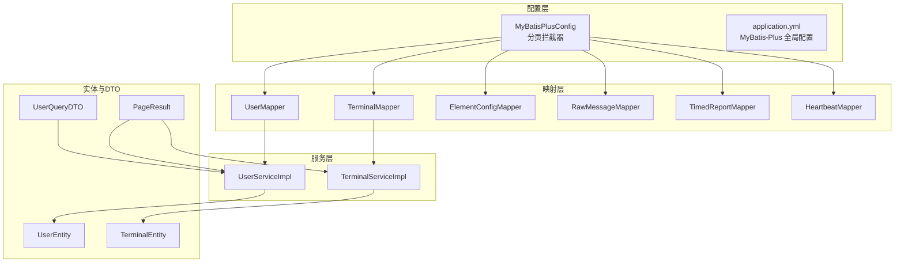
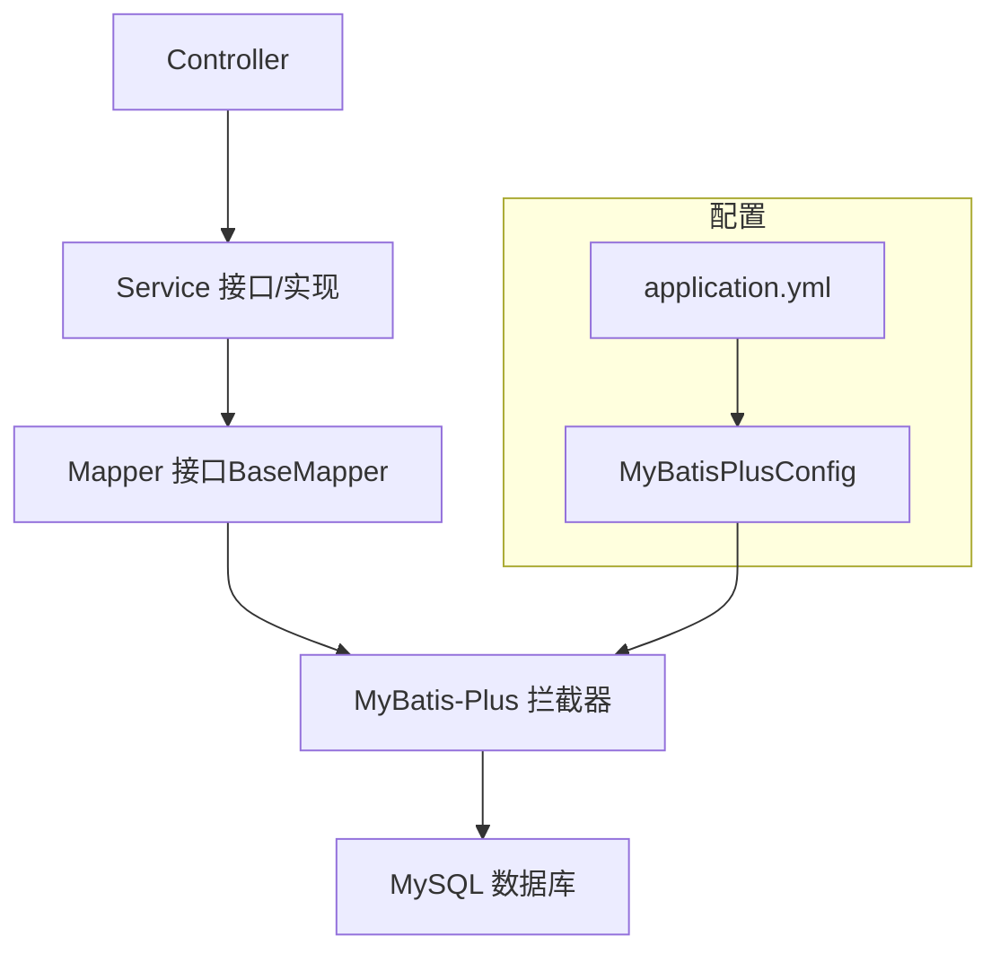
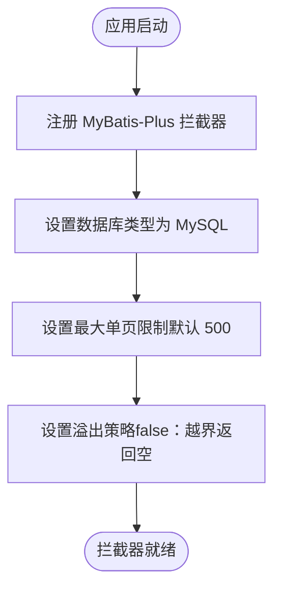
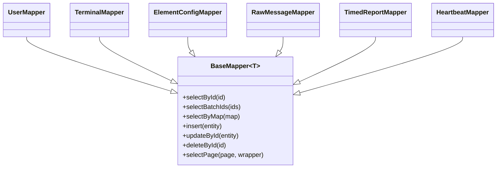
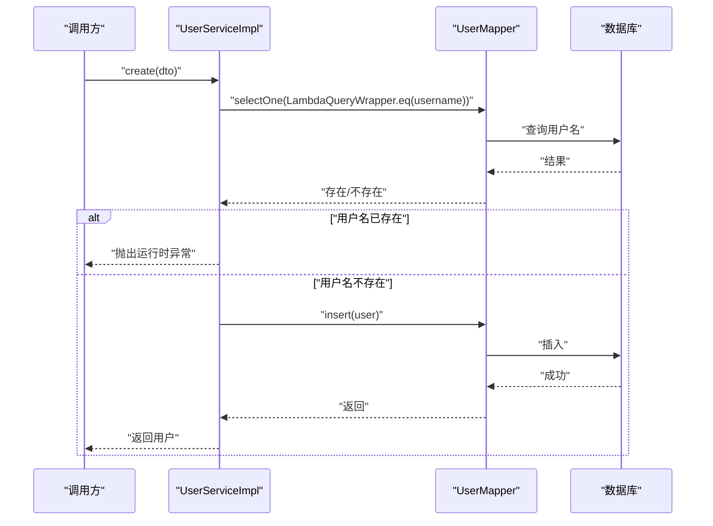
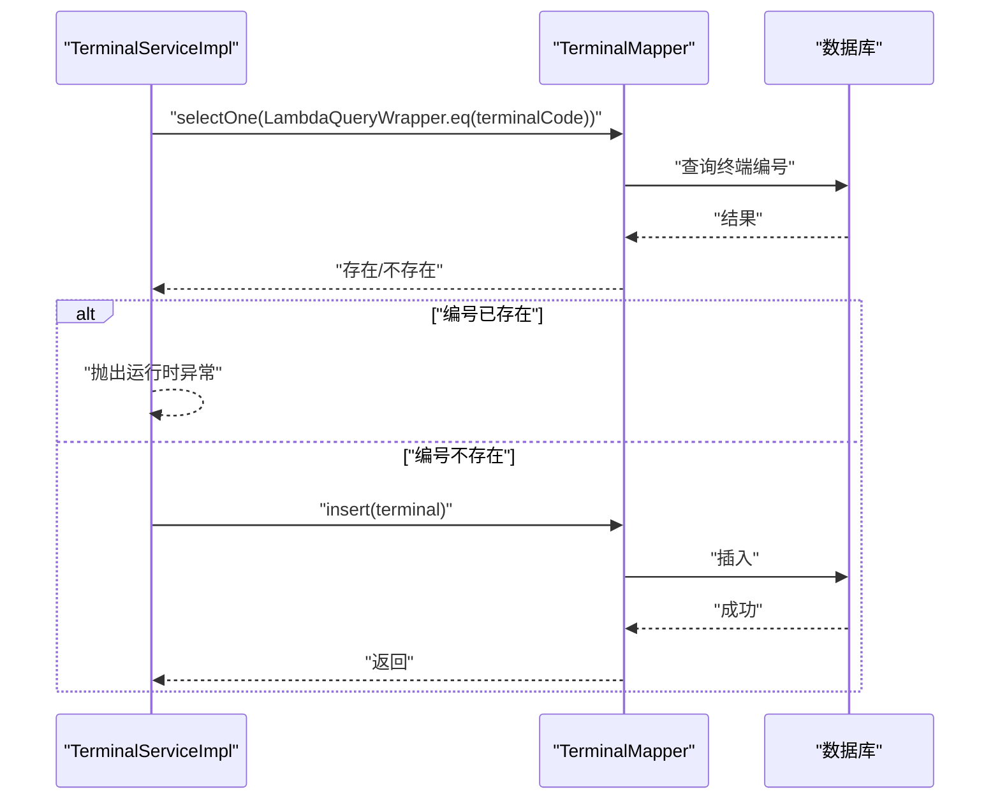
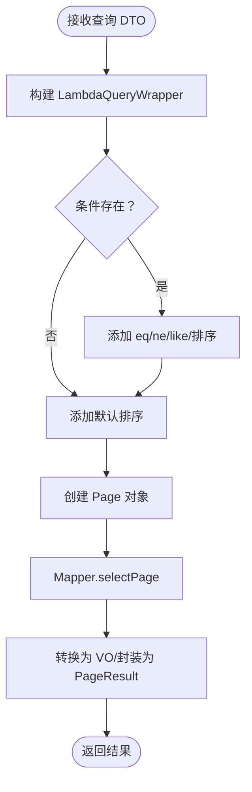

# 数据访问层

<cite>
**本文引用的文件**
- [MyBatisPlusConfig.java](file://src/main/java/com/hydro/monitor/config/MyBatisPlusConfig.java)
- [application.yml](file://src/main/resources/application.yml)
- [UserMapper.java](file://src/main/java/com/hydro/monitor/modules/mapper/UserMapper.java)
- [TerminalMapper.java](file://src/main/java/com/hydro/monitor/modules/mapper/TerminalMapper.java)
- [ElementConfigMapper.java](file://src/main/java/com/hydro/monitor/modules/mapper/ElementConfigMapper.java)
- [RawMessageMapper.java](file://src/main/java/com/hydro/monitor/modules/mapper/RawMessageMapper.java)
- [TimedReportMapper.java](file://src/main/java/com/hydro/monitor/modules/mapper/TimedReportMapper.java)
- [HeartbeatMapper.java](file://src/main/java/com/hydro/monitor/modules/mapper/HeartbeatMapper.java)
- [UserService.java](file://src/main/java/com/hydro/monitor/modules/service/UserService.java)
- [UserServiceImpl.java](file://src/main/java/com/hydro/monitor/modules/service/impl/UserServiceImpl.java)
- [TerminalService.java](file://src/main/java/com/hydro/monitor/modules/service/TerminalService.java)
- [TerminalServiceImpl.java](file://src/main/java/com/hydro/monitor/modules/service/impl/TerminalServiceImpl.java)
- [UserEntity.java](file://src/main/java/com/hydro/monitor/modules/entity/UserEntity.java)
- [TerminalEntity.java](file://src/main/java/com/hydro/monitor/modules/entity/TerminalEntity.java)
- [UserQueryDTO.java](file://src/main/java/com/hydro/monitor/modules/dto/UserQueryDTO.java)
- [PageResult.java](file://src/main/java/com/hydro/monitor/common/PageResult.java)
- [GlobalExceptionHandler.java](file://src/main/java/com/hydro/monitor/common/GlobalExceptionHandler.java)
- [AuthControllerTest.java](file://src/test/java/com/hydro/monitor/modules/controller/AuthControllerTest.java)
</cite>

## 目录
1. [简介](#简介)
2. [项目结构](#项目结构)
3. [核心组件](#核心组件)
4. [架构总览](#架构总览)
5. [详细组件分析](#详细组件分析)
6. [依赖分析](#依赖分析)
7. [性能考虑](#性能考虑)
8. [故障排查指南](#故障排查指南)
9. [结论](#结论)
10. [附录](#附录)

## 简介
本文件聚焦于水文监测系统的“数据访问层”，系统性阐述 MyBatis-Plus 的配置与通用 Mapper 设计、各 Mapper 的 CRUD 实现与复杂查询、分页查询、条件构造器与动态 SQL 使用、事务与异常处理、性能优化策略，并给出常见查询模式与最佳实践。文档同时覆盖测试策略与调试方法，帮助开发者快速理解并高效维护数据访问层。

## 项目结构
数据访问层主要由以下模块组成：
- 配置层：MyBatis-Plus 分页拦截器配置
- 映射层：各业务实体对应的 Mapper 接口（继承通用 BaseMapper）
- 服务层：Service 接口与实现类，封装事务、条件查询与分页转换
- 实体与 DTO：实体映射数据库表，DTO 用于查询参数与默认值处理
- 通用工具：分页结果封装类 PageResult
- 异常处理：全局异常处理器统一处理运行时异常



**图表来源**
- [MyBatisPlusConfig.java:14-37](file://src/main/java/com/hydro/monitor/config/MyBatisPlusConfig.java#L14-L37)
- [application.yml:22-32](file://src/main/resources/application.yml#L22-L32)
- [UserMapper.java:12-14](file://src/main/java/com/hydro/monitor/modules/mapper/UserMapper.java#L12-L14)
- [TerminalMapper.java:12-13](file://src/main/java/com/hydro/monitor/modules/mapper/TerminalMapper.java#L12-L13)
- [ElementConfigMapper.java:12-13](file://src/main/java/com/hydro/monitor/modules/mapper/ElementConfigMapper.java#L12-L13)
- [RawMessageMapper.java:12-13](file://src/main/java/com/hydro/monitor/modules/mapper/RawMessageMapper.java#L12-L13)
- [TimedReportMapper.java:12-13](file://src/main/java/com/hydro/monitor/modules/mapper/TimedReportMapper.java#L12-L13)
- [HeartbeatMapper.java:12-13](file://src/main/java/com/hydro/monitor/modules/mapper/HeartbeatMapper.java#L12-L13)
- [UserServiceImpl.java:33-65](file://src/main/java/com/hydro/monitor/modules/service/impl/UserServiceImpl.java#L33-L65)
- [TerminalServiceImpl.java:29-60](file://src/main/java/com/hydro/monitor/modules/service/impl/TerminalServiceImpl.java#L29-L60)
- [UserEntity.java:16-69](file://src/main/java/com/hydro/monitor/modules/entity/UserEntity.java#L16-L69)
- [TerminalEntity.java](file://src/main/java/com/hydro/monitor/modules/entity/TerminalEntity.java)
- [UserQueryDTO.java:8-53](file://src/main/java/com/hydro/monitor/modules/dto/UserQueryDTO.java#L8-L53)
- [PageResult.java:14-57](file://src/main/java/com/hydro/monitor/common/PageResult.java#L14-L57)

**章节来源**
- [MyBatisPlusConfig.java:14-37](file://src/main/java/com/hydro/monitor/config/MyBatisPlusConfig.java#L14-L37)
- [application.yml:22-32](file://src/main/resources/application.yml#L22-L32)

## 核心组件
- MyBatis-Plus 配置：注册分页拦截器，设置数据库类型、最大单页限制与溢出策略，确保所有分页查询由拦截器统一处理。
- 通用 Mapper：各 Mapper 接口继承 BaseMapper，天然具备标准 CRUD 与分页能力，无需手写 SQL。
- 服务层实现：通过 LambdaQueryWrapper 构造条件，结合 Page 对象实现复杂查询与分页；对敏感字段进行加密处理；统一日志输出。
- 分页结果封装：PageResult 提供与 MyBatis-Plus IPage 的互转能力，便于对外输出。
- 全局异常处理：统一捕获运行时异常，避免异常信息泄露到客户端。

**章节来源**
- [MyBatisPlusConfig.java:23-37](file://src/main/java/com/hydro/monitor/config/MyBatisPlusConfig.java#L23-L37)
- [UserMapper.java:12-14](file://src/main/java/com/hydro/monitor/modules/mapper/UserMapper.java#L12-L14)
- [TerminalMapper.java:12-13](file://src/main/java/com/hydro/monitor/modules/mapper/TerminalMapper.java#L12-L13)
- [UserServiceImpl.java:38-101](file://src/main/java/com/hydro/monitor/modules/service/impl/UserServiceImpl.java#L38-L101)
- [TerminalServiceImpl.java:33-121](file://src/main/java/com/hydro/monitor/modules/service/impl/TerminalServiceImpl.java#L33-L121)
- [PageResult.java:48-56](file://src/main/java/com/hydro/monitor/common/PageResult.java#L48-L56)
- [GlobalExceptionHandler.java](file://src/main/java/com/hydro/monitor/common/GlobalExceptionHandler.java)

## 架构总览
数据访问层遵循“配置—映射—服务—实体”的分层设计，MyBatis-Plus 提供 ORM 能力与分页拦截器，Service 层负责业务逻辑与事务控制，Mapper 层仅承担数据映射职责。



**图表来源**
- [MyBatisPlusConfig.java:23-37](file://src/main/java/com/hydro/monitor/config/MyBatisPlusConfig.java#L23-L37)
- [application.yml:22-32](file://src/main/resources/application.yml#L22-L32)

## 详细组件分析

### MyBatis-Plus 配置与分页拦截器
- 注册分页拦截器，指定数据库类型为 MySQL，并设置最大单页限制与溢出策略，保证分页安全与性能。
- MyBatis-Plus 全局配置中开启下划线到驼峰映射与日志输出，便于开发调试。



**图表来源**
- [MyBatisPlusConfig.java:23-37](file://src/main/java/com/hydro/monitor/config/MyBatisPlusConfig.java#L23-L37)
- [application.yml:22-32](file://src/main/resources/application.yml#L22-L32)

**章节来源**
- [MyBatisPlusConfig.java:23-37](file://src/main/java/com/hydro/monitor/config/MyBatisPlusConfig.java#L23-L37)
- [application.yml:22-32](file://src/main/resources/application.yml#L22-L32)

### 通用 Mapper 接口设计
- 各 Mapper 接口均继承 BaseMapper，获得标准 CRUD 与分页查询能力，无需编写 XML 或注解 SQL。
- 适用于 User、Terminal、ElementConfig、RawMessage、TimedReport、Heartbeat 等实体。



**图表来源**
- [UserMapper.java:12-14](file://src/main/java/com/hydro/monitor/modules/mapper/UserMapper.java#L12-L14)
- [TerminalMapper.java:12-13](file://src/main/java/com/hydro/monitor/modules/mapper/TerminalMapper.java#L12-L13)
- [ElementConfigMapper.java:12-13](file://src/main/java/com/hydro/monitor/modules/mapper/ElementConfigMapper.java#L12-L13)
- [RawMessageMapper.java:12-13](file://src/main/java/com/hydro/monitor/modules/mapper/RawMessageMapper.java#L12-L13)
- [TimedReportMapper.java:12-13](file://src/main/java/com/hydro/monitor/modules/mapper/TimedReportMapper.java#L12-L13)
- [HeartbeatMapper.java:12-13](file://src/main/java/com/hydro/monitor/modules/mapper/HeartbeatMapper.java#L12-L13)

**章节来源**
- [UserMapper.java:12-14](file://src/main/java/com/hydro/monitor/modules/mapper/UserMapper.java#L12-L14)
- [TerminalMapper.java:12-13](file://src/main/java/com/hydro/monitor/modules/mapper/TerminalMapper.java#L12-L13)
- [ElementConfigMapper.java:12-13](file://src/main/java/com/hydro/monitor/modules/mapper/ElementConfigMapper.java#L12-L13)
- [RawMessageMapper.java:12-13](file://src/main/java/com/hydro/monitor/modules/mapper/RawMessageMapper.java#L12-L13)
- [TimedReportMapper.java:12-13](file://src/main/java/com/hydro/monitor/modules/mapper/TimedReportMapper.java#L12-L13)
- [HeartbeatMapper.java:12-13](file://src/main/java/com/hydro/monitor/modules/mapper/HeartbeatMapper.java#L12-L13)

### 用户服务：CRUD、条件查询与分页
- 创建用户：先通过 LambdaQueryWrapper 检查用户名是否存在，再进行插入与密码加密。
- 更新用户：按 ID 查询，逐项判断 DTO 字段非空后更新，最后持久化。
- 删除用户：按 ID 查询确认存在后删除。
- 查询：支持按 ID、用户名查找；分页查询支持用户名、真实姓名、手机号模糊匹配与角色、状态精确匹配，按创建时间倒序。
- 转换：将实体转换为 VO，便于对外输出。



**图表来源**
- [UserServiceImpl.java:38-65](file://src/main/java/com/hydro/monitor/modules/service/impl/UserServiceImpl.java#L38-L65)
- [UserMapper.java:12-14](file://src/main/java/com/hydro/monitor/modules/mapper/UserMapper.java#L12-L14)

**章节来源**
- [UserServiceImpl.java:38-101](file://src/main/java/com/hydro/monitor/modules/service/impl/UserServiceImpl.java#L38-L101)
- [UserServiceImpl.java:136-186](file://src/main/java/com/hydro/monitor/modules/service/impl/UserServiceImpl.java#L136-L186)
- [UserMapper.java:12-14](file://src/main/java/com/hydro/monitor/modules/mapper/UserMapper.java#L12-L14)
- [UserQueryDTO.java:8-53](file://src/main/java/com/hydro/monitor/modules/dto/UserQueryDTO.java#L8-L53)
- [PageResult.java:48-56](file://src/main/java/com/hydro/monitor/common/PageResult.java#L48-L56)

### 终端服务：条件查询、分页与状态更新
- 创建终端：校验终端编号唯一性，设置默认状态与时间戳后插入。
- 更新终端：支持终端编号唯一性约束（排除自身），逐项更新并持久化。
- 删除终端：按 ID 查询确认后删除。
- 查询：支持按名称、编号模糊匹配与在线状态精确匹配，按创建时间倒序。
- 列表：全量查询并按创建时间倒序。
- 在线状态更新：根据终端编号更新在线状态与最近上报时间；若不存在则自动创建。



**图表来源**
- [TerminalServiceImpl.java:33-60](file://src/main/java/com/hydro/monitor/modules/service/impl/TerminalServiceImpl.java#L33-L60)
- [TerminalMapper.java:12-13](file://src/main/java/com/hydro/monitor/modules/mapper/TerminalMapper.java#L12-L13)

**章节来源**
- [TerminalServiceImpl.java:33-121](file://src/main/java/com/hydro/monitor/modules/service/impl/TerminalServiceImpl.java#L33-L121)
- [TerminalServiceImpl.java:137-165](file://src/main/java/com/hydro/monitor/modules/service/impl/TerminalServiceImpl.java#L137-L165)
- [TerminalServiceImpl.java:174-200](file://src/main/java/com/hydro/monitor/modules/service/impl/TerminalServiceImpl.java#L174-L200)

### 条件构造器与动态 SQL 使用
- LambdaQueryWrapper：用于构建条件链，支持 eq、ne、like、orderByDesc 等，避免硬编码字符串与 SQL 注入风险。
- 分页查询：结合 Page 对象与 selectPage，自动注入分页 SQL 并返回 IPage 结果。
- DTO 默认值：UserQueryDTO 在 compact constructor 中处理 pageNum/pageSize 默认值，减少边界条件判断。



**图表来源**
- [UserServiceImpl.java:136-186](file://src/main/java/com/hydro/monitor/modules/service/impl/UserServiceImpl.java#L136-L186)
- [TerminalServiceImpl.java:137-165](file://src/main/java/com/hydro/monitor/modules/service/impl/TerminalServiceImpl.java#L137-L165)
- [UserQueryDTO.java:44-52](file://src/main/java/com/hydro/monitor/modules/dto/UserQueryDTO.java#L44-L52)

**章节来源**
- [UserServiceImpl.java:136-186](file://src/main/java/com/hydro/monitor/modules/service/impl/UserServiceImpl.java#L136-L186)
- [TerminalServiceImpl.java:137-165](file://src/main/java/com/hydro/monitor/modules/service/impl/TerminalServiceImpl.java#L137-L165)
- [UserQueryDTO.java:44-52](file://src/main/java/com/hydro/monitor/modules/dto/UserQueryDTO.java#L44-L52)

### 事务管理与异常处理
- 事务：Service 方法标注 @Transactional(rollbackFor = Exception.class)，确保异常时回滚，保障数据一致性。
- 异常：运行时异常统一由全局异常处理器捕获，避免异常栈泄露至客户端。
- 日志：关键操作前后记录日志，便于审计与问题定位。

**章节来源**
- [UserServiceImpl.java:38-101](file://src/main/java/com/hydro/monitor/modules/service/impl/UserServiceImpl.java#L38-L101)
- [TerminalServiceImpl.java:33-121](file://src/main/java/com/hydro/monitor/modules/service/impl/TerminalServiceImpl.java#L33-L121)
- [GlobalExceptionHandler.java](file://src/main/java/com/hydro/monitor/common/GlobalExceptionHandler.java)

### 性能优化建议
- 分页限制：分页拦截器设置最大单页条数，防止大页导致内存压力与慢查询。
- 索引策略：对高频查询字段（如 username、terminalCode、状态等）建立索引。
- 动态 SQL：优先使用 LambdaQueryWrapper，避免手写复杂 SQL；必要时使用 XML 片段提升可读性。
- 批量操作：对于大批量插入/更新，采用 MyBatis-Plus 的批量方法或自定义 SQL 批处理。
- 缓存：对只读且热点的数据引入缓存（如 Redis），降低数据库压力。
- 连接池与超时：合理配置连接池大小与 SQL 超时，避免资源耗尽。

**章节来源**
- [MyBatisPlusConfig.java:28-34](file://src/main/java/com/hydro/monitor/config/MyBatisPlusConfig.java#L28-L34)
- [application.yml:22-32](file://src/main/resources/application.yml#L22-L32)

### 常见查询模式与最佳实践
- 基础 CRUD：直接使用 BaseMapper 的 insert/updateById/selectById/deleteById。
- 复杂查询：组合 LambdaQueryWrapper 的 eq/ne/like/orderBy，注意条件拼接顺序与性能。
- 分页查询：Page 对象 + selectPage，最后转换为 PageResult 或 VO 列表。
- DTO 默认值：在 DTO 构造阶段处理默认值，减少 Service 层重复判断。
- 安全性：密码使用 PasswordEncoder 加密存储；避免明文传输与日志泄露。

**章节来源**
- [UserMapper.java:12-14](file://src/main/java/com/hydro/monitor/modules/mapper/UserMapper.java#L12-L14)
- [TerminalMapper.java:12-13](file://src/main/java/com/hydro/monitor/modules/mapper/TerminalMapper.java#L12-L13)
- [UserServiceImpl.java:136-186](file://src/main/java/com/hydro/monitor/modules/service/impl/UserServiceImpl.java#L136-L186)
- [TerminalServiceImpl.java:137-165](file://src/main/java/com/hydro/monitor/modules/service/impl/TerminalServiceImpl.java#L137-L165)
- [UserQueryDTO.java:44-52](file://src/main/java/com/hydro/monitor/modules/dto/UserQueryDTO.java#L44-L52)

### 测试策略与调试方法
- 单元测试：使用 WebMvcTest 对控制器进行集成测试，Mock 外部依赖（如 JWT、PasswordEncoder），验证接口行为与响应结构。
- 日志：application.yml 开启 MyBatis-Plus 日志输出，便于查看生成的 SQL 与参数。
- 断点调试：在 Service 层的关键节点（如条件构造、分页转换）设置断点，观察执行路径与数据流向。
- 数据准备：使用初始化脚本与迁移脚本准备测试数据，确保测试环境一致。

**章节来源**
- [AuthControllerTest.java:27-113](file://src/test/java/com/hydro/monitor/modules/controller/AuthControllerTest.java#L27-L113)
- [application.yml:24-26](file://src/main/resources/application.yml#L24-L26)

## 依赖分析
- Mapper 与 Service：各 ServiceImpl 通过构造器注入对应 Mapper，保持低耦合高内聚。
- 分页依赖：Service 层依赖 MyBatis-Plus 的 Page 与 IPage，最终由拦截器完成 SQL 注入与分页计算。
- 实体映射：实体类通过注解映射数据库表与主键策略，与 Mapper 形成稳定契约。

```mermaid
graph LR
UE["UserEntity"] <- --> UM["UserMapper"]
TE["TerminalEntity"] <- --> TM["TerminalMapper"]
USI["UserServiceImpl"] --> UM
TSI["TerminalServiceImpl"] --> TM
USI --> UE
TSI --> TE
```

**图表来源**
- [UserEntity.java:16-69](file://src/main/java/com/hydro/monitor/modules/entity/UserEntity.java#L16-L69)
- [TerminalEntity.java](file://src/main/java/com/hydro/monitor/modules/entity/TerminalEntity.java)
- [UserMapper.java:12-14](file://src/main/java/com/hydro/monitor/modules/mapper/UserMapper.java#L12-L14)
- [TerminalMapper.java:12-13](file://src/main/java/com/hydro/monitor/modules/mapper/TerminalMapper.java#L12-L13)
- [UserServiceImpl.java:35](file://src/main/java/com/hydro/monitor/modules/service/impl/UserServiceImpl.java#L35)
- [TerminalServiceImpl.java:31](file://src/main/java/com/hydro/monitor/modules/service/impl/TerminalServiceImpl.java#L31)

**章节来源**
- [UserServiceImpl.java:35](file://src/main/java/com/hydro/monitor/modules/service/impl/UserServiceImpl.java#L35)
- [TerminalServiceImpl.java:31](file://src/main/java/com/hydro/monitor/modules/service/impl/TerminalServiceImpl.java#L31)

## 性能考虑
- 分页限制：通过拦截器设置最大单页条数，防止大页导致的内存与网络压力。
- SQL 生成：LambdaQueryWrapper 自动生成 SQL，减少手写 SQL 的性能隐患。
- 索引与查询：对高频过滤字段建立索引，避免全表扫描。
- 批量操作：针对大批量场景，采用批量插入/更新或自定义 SQL 批处理。
- 缓存：对只读数据引入缓存，降低数据库访问频率。

**章节来源**
- [MyBatisPlusConfig.java:28-34](file://src/main/java/com/hydro/monitor/config/MyBatisPlusConfig.java#L28-L34)
- [application.yml:22-32](file://src/main/resources/application.yml#L22-L32)

## 故障排查指南
- 分页无效：确认分页拦截器已注册且数据库类型正确；检查 Page 对象与 selectPage 调用。
- SQL 注入风险：统一使用 LambdaQueryWrapper，避免字符串拼接。
- 运行时异常：查看全局异常处理器日志，定位具体异常原因并修正业务逻辑。
- 性能问题：开启 MyBatis-Plus 日志，分析慢查询；结合索引与分页限制优化。
- 测试失败：使用 MockMvc 与 WebMvcTest 验证接口行为，逐步缩小问题范围。

**章节来源**
- [MyBatisPlusConfig.java:23-37](file://src/main/java/com/hydro/monitor/config/MyBatisPlusConfig.java#L23-L37)
- [application.yml:24-26](file://src/main/resources/application.yml#L24-L26)
- [GlobalExceptionHandler.java](file://src/main/java/com/hydro/monitor/common/GlobalExceptionHandler.java)
- [AuthControllerTest.java:27-113](file://src/test/java/com/hydro/monitor/modules/controller/AuthControllerTest.java#L27-L113)

## 结论
本数据访问层以 MyBatis-Plus 为核心，通过通用 Mapper 与条件构造器实现简洁高效的 CRUD 与复杂查询；配合分页拦截器与统一的事务/异常处理策略，形成高内聚、低耦合、易扩展的数据访问体系。遵循本文的最佳实践与性能优化建议，可在保证功能正确性的前提下显著提升系统稳定性与运行效率。

## 附录
- 关键文件清单与职责概览
  - MyBatisPlusConfig：注册分页拦截器与数据库类型
  - application.yml：MyBatis-Plus 全局配置与日志输出
  - 各 Mapper：继承 BaseMapper，提供标准 CRUD 与分页
  - UserServiceImpl/TerminalServiceImpl：封装业务逻辑、事务与分页转换
  - UserQueryDTO：查询参数默认值处理
  - PageResult：分页结果封装与 IPage 互转

**章节来源**
- [MyBatisPlusConfig.java:14-37](file://src/main/java/com/hydro/monitor/config/MyBatisPlusConfig.java#L14-L37)
- [application.yml:22-32](file://src/main/resources/application.yml#L22-L32)
- [UserServiceImpl.java:38-101](file://src/main/java/com/hydro/monitor/modules/service/impl/UserServiceImpl.java#L38-L101)
- [TerminalServiceImpl.java:33-121](file://src/main/java/com/hydro/monitor/modules/service/impl/TerminalServiceImpl.java#L33-L121)
- [UserQueryDTO.java:44-52](file://src/main/java/com/hydro/monitor/modules/dto/UserQueryDTO.java#L44-L52)
- [PageResult.java:48-56](file://src/main/java/com/hydro/monitor/common/PageResult.java#L48-L56)