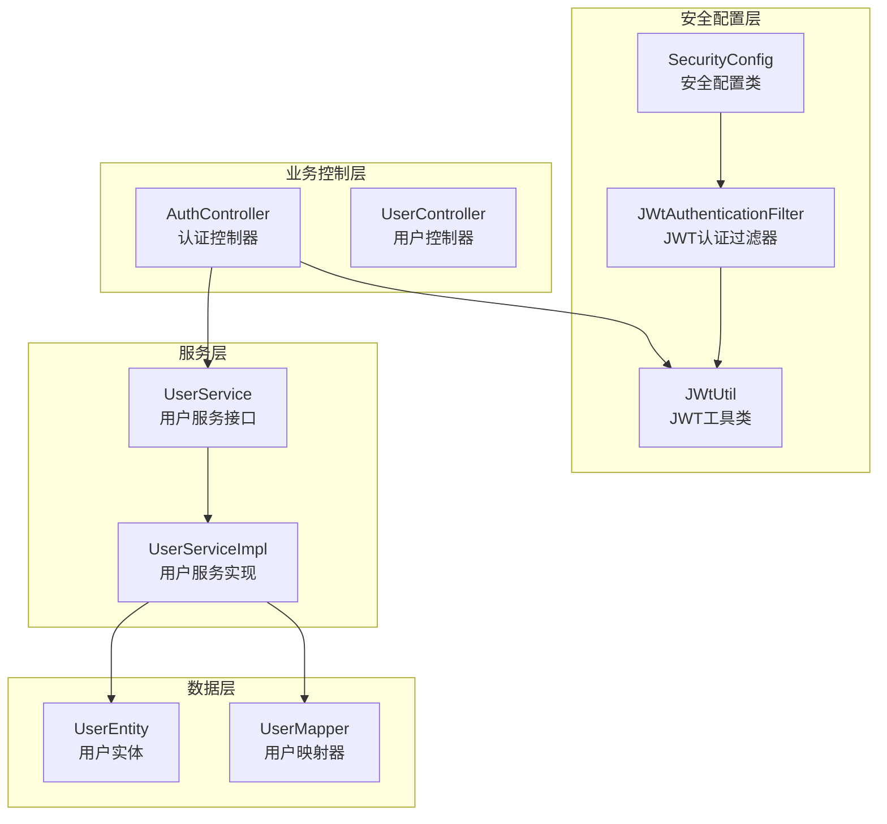
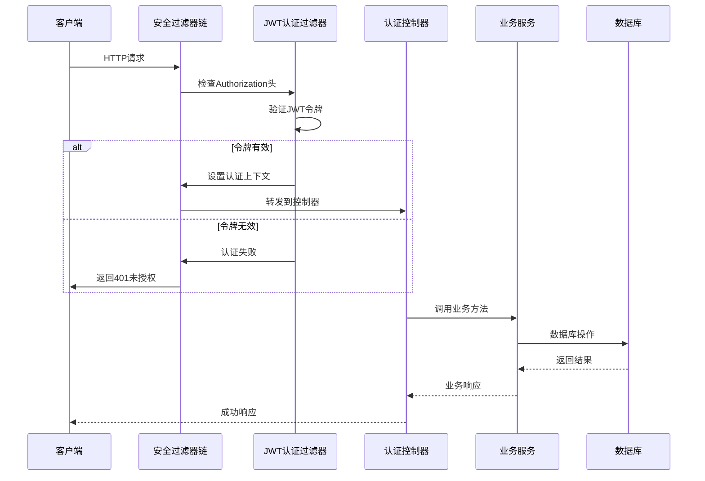
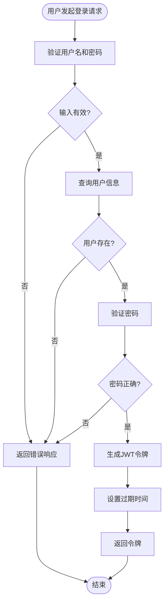
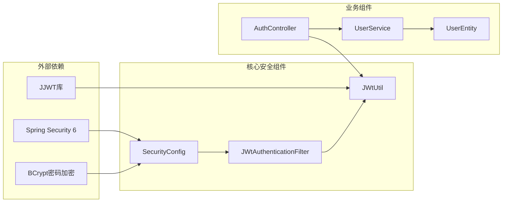

# 安全架构设计

<cite>
**本文档引用的文件**
- [SecurityConfig.java](file://src/main/java/com/hydro/monitor/config/security/SecurityConfig.java)
- [JwtUtil.java](file://src/main/java/com/hydro/monitor/config/security/JwtUtil.java)
- [JwtAuthenticationFilter.java](file://src/main/java/com/hydro/monitor/config/security/JwtAuthenticationFilter.java)
- [AuthController.java](file://src/main/java/com/hydro/monitor/modules/controller/AuthController.java)
- [application.yml](file://src/main/resources/application.yml)
- [GlobalExceptionHandler.java](file://src/main/java/com/hydro/monitor/common/GlobalExceptionHandler.java)
- [JwtUtilTest.java](file://src/test/java/com/hydro/monitor/config/security/JwtUtilTest.java)
- [UserService.java](file://src/main/java/com/hydro/monitor/modules/service/UserService.java)
- [UserEntity.java](file://src/main/java/com/hydro/monitor/modules/entity/UserEntity.java)
- [pom.xml](file://pom.xml)
</cite>

## 目录
1. [项目概述](#项目概述)
2. [项目结构](#项目结构)
3. [核心组件](#核心组件)
4. [架构概览](#架构概览)
5. [详细组件分析](#详细组件分析)
6. [依赖关系分析](#依赖关系分析)
7. [性能考虑](#性能考虑)
8. [故障排除指南](#故障排除指南)
9. [安全最佳实践](#安全最佳实践)
10. [结论](#结论)

## 项目概述

本项目是一个基于Spring Security 6的现代化安全架构设计，采用JWT（JSON Web Token）认证机制构建的企业级水文监测系统。系统通过无状态认证方式实现用户身份验证和授权控制，结合Spring Security的安全过滤器链提供完整的安全防护体系。

### 主要特性
- **JWT无状态认证**：基于JSON Web Token的无状态认证机制
- **Spring Security 6集成**：采用最新的SecurityFilterChain配置方式
- **细粒度权限控制**：支持基于路径的权限管理和角色控制
- **完整安全防护**：包含CSRF防护、CORS配置和全局异常处理
- **可扩展架构**：模块化设计便于功能扩展和维护

## 项目结构

项目采用标准的Spring Boot目录结构，安全相关的核心组件集中在`config/security`包中：

**图表来源**
- [SecurityConfig.java:1-76](file://src/main/java/com/hydro/monitor/config/security/SecurityConfig.java#L1-L76)
- [JwtAuthenticationFilter.java:1-75](file://src/main/java/com/hydro/monitor/config/security/JwtAuthenticationFilter.java#L1-L75)
- [JwtUtil.java:1-126](file://src/main/java/com/hydro/monitor/config/security/JwtUtil.java#L1-L126)

**章节来源**
- [SecurityConfig.java:1-76](file://src/main/java/com/hydro/monitor/config/security/SecurityConfig.java#L1-L76)
- [pom.xml:1-179](file://pom.xml#L1-L179)

## 核心组件

### 安全配置类 SecurityConfig

SecurityConfig是整个安全架构的核心配置类，负责定义安全过滤器链、认证管理器和授权规则。

#### 主要配置功能
- **CSRF防护禁用**：由于使用JWT无状态认证，禁用传统的CSRF保护
- **会话管理**：设置为STATELESS无状态模式
- **授权规则**：定义公开访问接口和受保护接口
- **过滤器链**：配置JWT认证过滤器的执行顺序

#### 授权规则配置
系统采用基于路径的授权策略：
- **完全开放**：认证接口和API文档接口
- **需要认证**：其他所有接口均需身份验证

**章节来源**
- [SecurityConfig.java:24-52](file://src/main/java/com/hydro/monitor/config/security/SecurityConfig.java#L24-L52)

### JWT工具类 JwtUtil

JwtUtil提供完整的JWT令牌生成功能，包括令牌创建、验证和解析。

#### 核心功能
- **令牌生成**：基于用户名生成JWT令牌
- **令牌验证**：验证令牌的有效性和未过期状态
- **令牌解析**：从令牌中提取用户名和过期时间
- **密钥管理**：使用HMAC-SHA算法进行签名

#### 令牌结构
- **头部**：包含令牌类型和签名算法
- **载荷**：包含用户标识和发行时间
- **签名**：基于密钥和头部载荷的数字签名

**章节来源**
- [JwtUtil.java:25-48](file://src/main/java/com/hydro/monitor/config/security/JwtUtil.java#L25-L48)
- [JwtUtil.java:67-75](file://src/main/java/com/hydro/monitor/config/security/JwtUtil.java#L67-L75)

### JWT认证过滤器 JwtAuthenticationFilter

JwtAuthenticationFilter是自定义的过滤器，负责在每个HTTP请求到达时进行JWT认证。

#### 认证流程
1. **令牌提取**：从Authorization头中提取Bearer令牌
2. **令牌验证**：验证令牌格式和有效性
3. **用户认证**：创建认证对象并设置到SecurityContext
4. **请求放行**：将请求传递给后续过滤器

#### 过滤器特点
- 继承OncePerRequestFilter，确保每个请求只处理一次
- 使用线程安全的SecurityContextHolder
- 提供详细的日志记录和错误处理

**章节来源**
- [JwtAuthenticationFilter.java:31-59](file://src/main/java/com/hydro/monitor/config/security/JwtAuthenticationFilter.java#L31-L59)

## 架构概览

系统采用分层架构设计，安全控制贯穿整个请求处理流程：

**图表来源**
- [JwtAuthenticationFilter.java:31-59](file://src/main/java/com/hydro/monitor/config/security/JwtAuthenticationFilter.java#L31-L59)
- [AuthController.java:41-66](file://src/main/java/com/hydro/monitor/modules/controller/AuthController.java#L41-L66)

### 认证流程图

**图表来源**
- [AuthController.java:41-66](file://src/main/java/com/hydro/monitor/modules/controller/AuthController.java#L41-L66)

## 详细组件分析

### 安全配置类深度分析

SecurityConfig类实现了Spring Security 6的现代化配置方式，采用函数式配置风格：

#### 配置要点
- **@EnableWebSecurity注解**：启用Web安全配置
- **SecurityFilterChain Bean**：定义主要的安全过滤器链
- **HttpSecurity配置**：提供链式API配置各种安全特性

#### 过滤器链配置
系统使用标准的过滤器链，JWT认证过滤器位于用户名密码过滤器之前执行，确保在认证阶段就完成用户身份验证。

**章节来源**
- [SecurityConfig.java:33-52](file://src/main/java/com/hydro/monitor/config/security/SecurityConfig.java#L33-L52)

### JWT工具类实现分析

JwtUtil类提供了完整的JWT生命周期管理：

#### 令牌生成策略
- **签名算法**：使用HMAC-SHA256算法
- **过期时间**：默认24小时，可通过配置调整
- **载荷内容**：包含用户名和发行时间戳
- **随机性保证**：每次生成的令牌都不同

#### 验证机制
- **签名验证**：使用相同的密钥验证令牌完整性
- **过期检查**：验证令牌是否在有效期内
- **异常处理**：捕获并处理各种验证异常

**章节来源**
- [JwtUtil.java:37-48](file://src/main/java/com/hydro/monitor/config/security/JwtUtil.java#L37-L48)
- [JwtUtil.java:94-105](file://src/main/java/com/hydro/monitor/config/security/JwtUtil.java#L94-L105)

### 认证控制器分析

AuthController提供用户认证接口，是JWT认证流程的入口点：

#### 登录流程
1. **用户输入验证**：检查用户名和密码格式
2. **用户查询**：从数据库获取用户信息
3. **密码验证**：使用BCrypt算法验证密码
4. **令牌生成**：为认证成功的用户生成JWT令牌
5. **响应返回**：返回令牌和过期时间信息

#### 安全考虑
- **密码加密**：使用BCrypt算法存储密码
- **错误处理**：避免泄露具体认证失败原因
- **日志记录**：记录认证事件但不包含敏感信息

**章节来源**
- [AuthController.java:41-66](file://src/main/java/com/hydro/monitor/modules/controller/AuthController.java#L41-L66)

## 依赖关系分析

系统安全架构的依赖关系呈现清晰的层次结构：

**图表来源**
- [pom.xml:37-41](file://pom.xml#L37-L41)
- [pom.xml:77-94](file://pom.xml#L77-L94)

### 关键依赖说明

#### Spring Security 6
- 提供核心安全框架和过滤器链机制
- 支持现代的函数式配置方式
- 集成多种认证和授权机制

#### JJWT库
- 实现JSON Web Token标准
- 提供完整的令牌生成、验证和解析功能
- 支持多种签名算法和令牌格式

#### BCrypt密码加密
- 提供安全的密码哈希算法
- 包含盐值生成和验证机制
- 防止彩虹表攻击和暴力破解

**章节来源**
- [pom.xml:37-94](file://pom.xml#L37-L94)

## 性能考虑

### JWT认证性能优化

#### 内存使用优化
- **无状态设计**：JWT令牌包含所有必要信息，无需服务器端存储
- **缓存策略**：可以考虑缓存频繁访问的用户信息
- **内存管理**：合理设置令牌过期时间，避免内存泄漏

#### 并发处理
- **线程安全**：JWT工具类和过滤器都是线程安全的
- **无阻塞设计**：基于令牌的认证不需要数据库查询
- **连接池管理**：优化数据库连接池配置

### 性能监控建议

#### 关键指标
- **认证响应时间**：监控JWT验证的平均响应时间
- **令牌生成频率**：跟踪用户登录和令牌刷新的频率
- **并发认证数**：监控同时进行的身份验证数量

## 故障排除指南

### 常见问题及解决方案

#### JWT令牌验证失败
**问题现象**：用户登录后无法访问受保护接口
**可能原因**：
- 令牌格式不正确（缺少Bearer前缀）
- 令牌已过期
- 令牌签名验证失败
- 密钥配置不匹配

**解决步骤**：
1. 检查客户端是否正确添加Authorization头
2. 验证令牌的过期时间
3. 确认服务器端密钥配置
4. 查看服务器日志中的详细错误信息

#### 认证失败但无明确错误
**问题现象**：用户登录失败但没有具体的错误提示
**可能原因**：
- 用户名不存在
- 密码验证失败
- 数据库连接问题

**排查方法**：
1. 检查用户是否存在且状态正常
2. 验证密码加密算法的一致性
3. 确认数据库连接配置正确

#### 权限访问被拒绝
**问题现象**：用户有权限但访问被拒绝
**可能原因**：
- 用户角色配置错误
- 授权规则配置不当
- 安全上下文未正确设置

**解决方法**：
1. 检查用户的角色和权限配置
2. 验证授权规则的正则表达式
3. 确认安全上下文的设置逻辑

**章节来源**
- [GlobalExceptionHandler.java:38-43](file://src/main/java/com/hydro/monitor/common/GlobalExceptionHandler.java#L38-L43)

### 日志分析

系统提供了详细的日志记录机制，有助于问题诊断：

#### 关键日志级别
- **DEBUG**：认证过程的详细信息
- **WARN**：权限拒绝和认证失败
- **ERROR**：系统异常和验证错误

#### 日志字段
- **用户标识**：记录认证用户的用户名
- **请求信息**：记录请求的URL和参数
- **时间戳**：记录事件发生的时间
- **IP地址**：记录客户端的IP地址

**章节来源**
- [JwtAuthenticationFilter.java:52-56](file://src/main/java/com/hydro/monitor/config/security/JwtAuthenticationFilter.java#L52-L56)

## 安全最佳实践

### JWT安全配置

#### 密钥管理
- **强密钥**：使用足够长度和复杂度的密钥
- **定期轮换**：定期更换JWT密钥以降低风险
- **安全存储**：将密钥存储在安全的位置，避免硬编码

#### 令牌配置
- **合理过期时间**：根据业务需求设置合适的过期时间
- **刷新机制**：实现令牌刷新机制而非长期有效令牌
- **撤销机制**：考虑实现黑名单机制撤销特定令牌

### 认证安全

#### 密码策略
- **强密码要求**：要求用户设置复杂密码
- **密码历史**：防止用户重复使用旧密码
- **账户锁定**：实现失败尝试次数限制

#### 多因素认证
- **MFA集成**：考虑集成多因素认证提高安全性
- **设备绑定**：允许用户绑定可信设备

### 授权控制

#### 最小权限原则
- **角色分离**：确保用户只拥有必要的最小权限
- **功能权限**：基于功能点的细粒度权限控制
- **数据权限**：实现数据级别的访问控制

#### 审计日志
- **完整记录**：记录所有重要的安全相关事件
- **实时监控**：建立实时安全监控和告警机制
- **合规要求**：满足相关法规的审计要求

### 网络安全

#### CORS配置
- **严格白名单**：仅允许必要的域名访问API
- **安全头设置**：配置XSS防护等安全头
- **HTTPS强制**：确保所有通信都通过HTTPS

#### 输入验证
- **参数验证**：对所有用户输入进行验证
- **SQL注入防护**：使用参数化查询防止注入攻击
- **XSS防护**：对输出进行适当的HTML转义

### 漏洞防护措施

#### OWASP Top 10防护
- **注入攻击**：使用ORM框架和参数化查询
- **跨站脚本**：实施内容安全策略
- **敏感数据泄露**：加密存储和传输敏感数据
- **安全配置错误**：定期审查安全配置

#### 安全审计方案

##### 定期安全评估
- **代码审计**：定期审查安全相关的代码
- **渗透测试**：模拟攻击测试系统的安全性
- **依赖扫描**：扫描第三方库的安全漏洞

##### 运行时监控
- **异常检测**：监控异常的登录和访问行为
- **性能监控**：监控异常的请求模式
- **日志分析**：分析日志中的安全相关事件

##### 合规性检查
- **数据保护**：遵守GDPR等数据保护法规
- **行业标准**：符合金融、医疗等行业的安全标准
- **内部政策**：遵循公司的信息安全政策

## 结论

本安全架构设计基于Spring Security 6和JWT技术，构建了一个现代化、可扩展的企业级安全体系。系统的主要优势包括：

### 技术优势
- **无状态设计**：JWT令牌实现真正的无状态认证
- **现代化配置**：采用Spring Security 6的函数式配置方式
- **模块化设计**：清晰的组件分离便于维护和扩展
- **完整防护**：涵盖认证、授权、审计等全方位安全需求

### 架构特点
- **高可用性**：无状态设计支持水平扩展
- **高性能**：基于令牌的认证避免了服务器端状态存储
- **易维护性**：清晰的代码结构和完善的测试覆盖
- **可扩展性**：模块化设计支持功能扩展和定制

### 改进建议
- **OAuth2集成**：考虑集成OAuth2/OpenID Connect支持
- **CORS配置**：完善跨域资源共享的安全配置
- **令牌撤销**：实现JWT令牌的撤销和黑名单机制
- **多因素认证**：集成短信验证码等多因素认证

该安全架构为水文监测系统的开发提供了坚实的基础，能够有效保护系统免受常见安全威胁，同时保持良好的性能和可维护性。