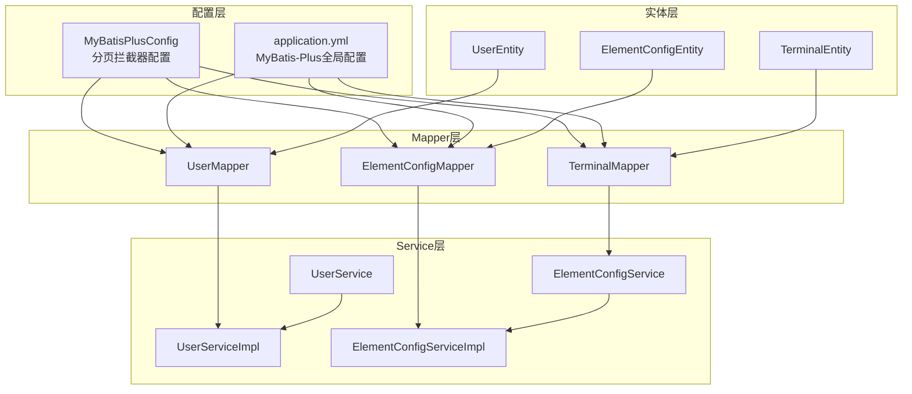
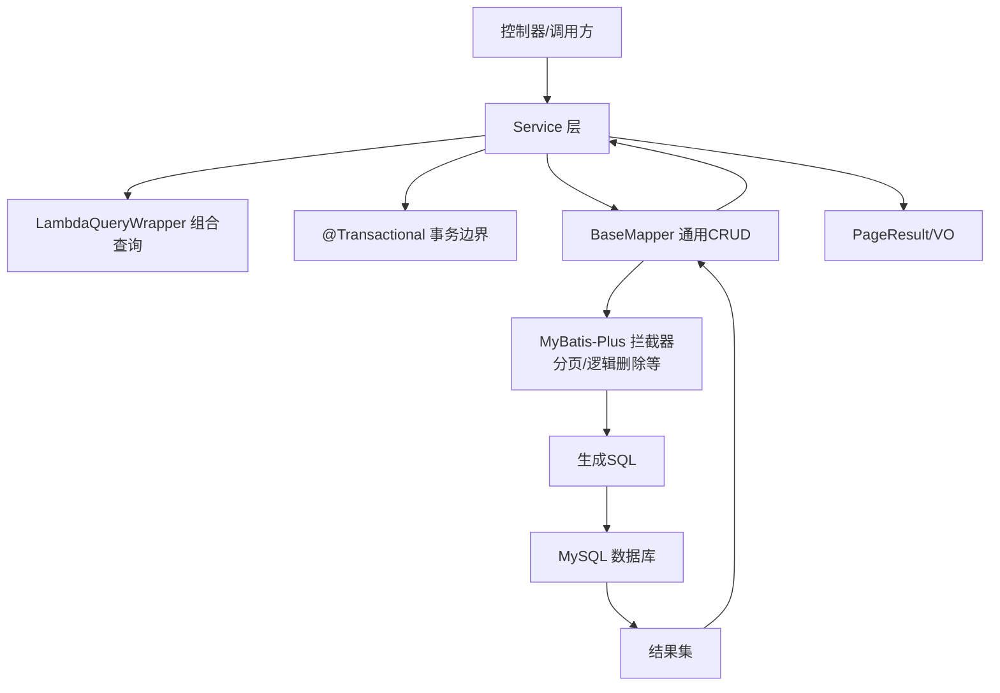
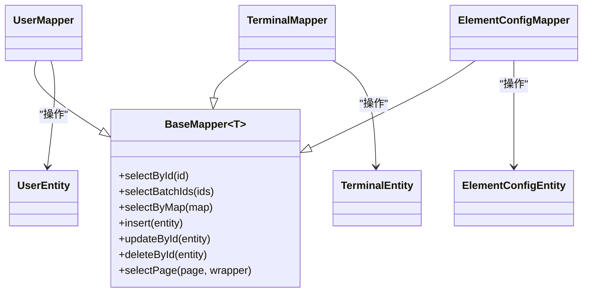
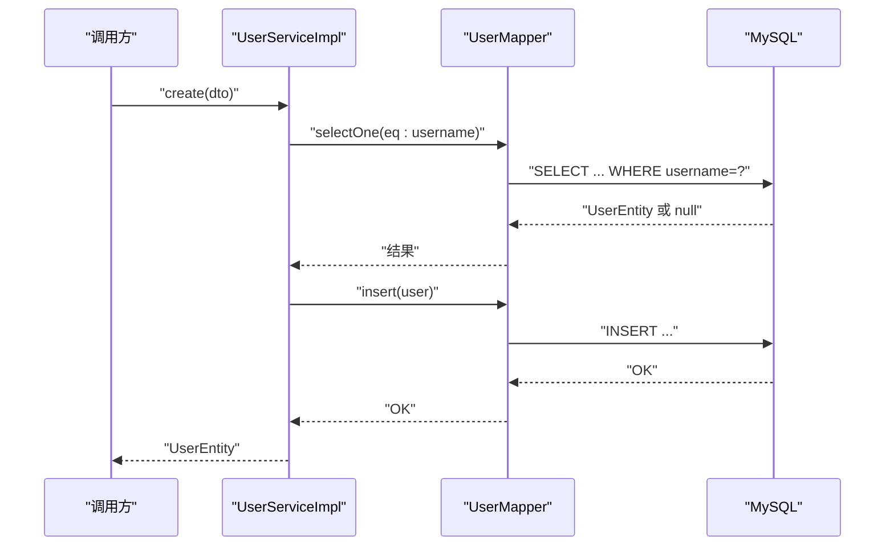
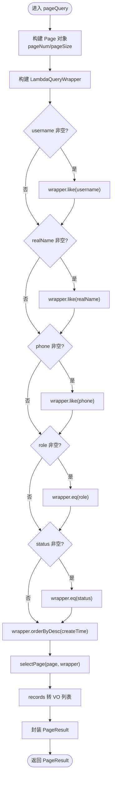
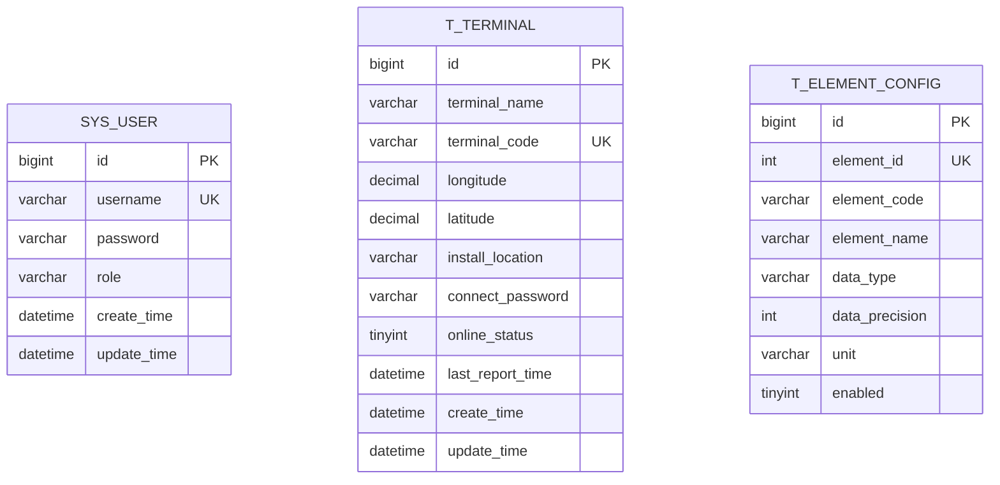
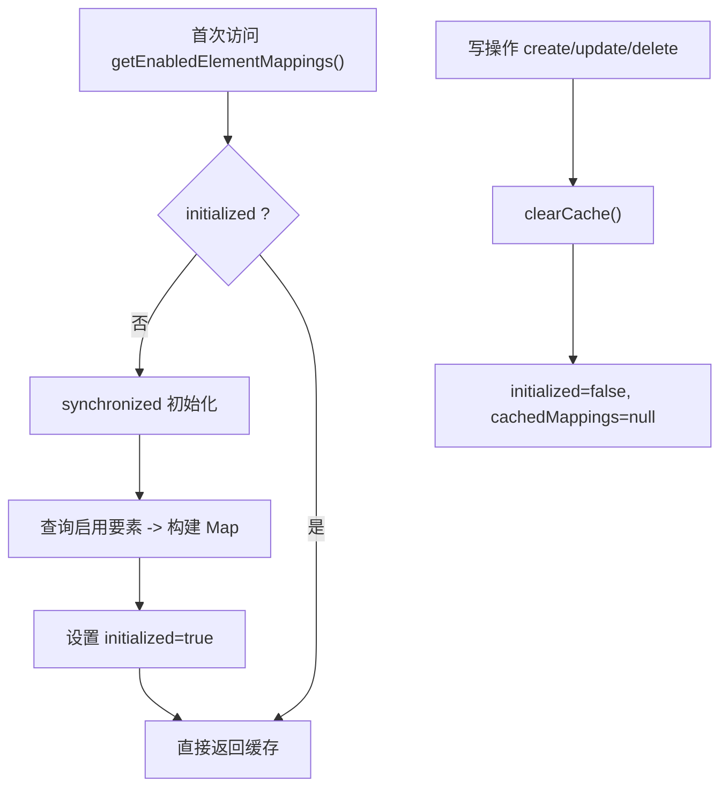
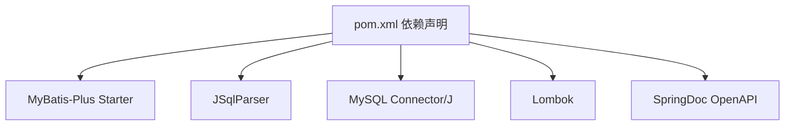

# 数据访问架构

<cite>
**本文引用的文件**
- [MyBatisPlusConfig.java](file://src/main/java/com/hydro/monitor/config/MyBatisPlusConfig.java)
- [application.yml](file://src/main/resources/application.yml)
- [UserMapper.java](file://src/main/java/com/hydro/monitor/modules/mapper/UserMapper.java)
- [UserServiceImpl.java](file://src/main/java/com/hydro/monitor/modules/service/impl/UserServiceImpl.java)
- [UserService.java](file://src/main/java/com/hydro/monitor/modules/service/UserService.java)
- [UserEntity.java](file://src/main/java/com/hydro/monitor/modules/entity/UserEntity.java)
- [UserQueryDTO.java](file://src/main/java/com/hydro/monitor/modules/dto/UserQueryDTO.java)
- [PageResult.java](file://src/main/java/com/hydro/monitor/common/PageResult.java)
- [TerminalMapper.java](file://src/main/java/com/hydro/monitor/modules/mapper/TerminalMapper.java)
- [TerminalEntity.java](file://src/main/java/com/hydro/monitor/modules/entity/TerminalEntity.java)
- [ElementConfigMapper.java](file://src/main/java/com/hydro/monitor/modules/mapper/ElementConfigMapper.java)
- [ElementConfigEntity.java](file://src/main/java/com/hydro/monitor/modules/entity/ElementConfigEntity.java)
- [ElementConfigServiceImpl.java](file://src/main/java/com/hydro/monitor/modules/service/impl/ElementConfigServiceImpl.java)
- [pom.xml](file://pom.xml)
- [init.sql](file://src/main/resources/db/init.sql)
</cite>

## 目录
1. [简介](#简介)
2. [项目结构](#项目结构)
3. [核心组件](#核心组件)
4. [架构总览](#架构总览)
5. [详细组件分析](#详细组件分析)
6. [依赖分析](#依赖分析)
7. [性能考虑](#性能考虑)
8. [故障排查指南](#故障排查指南)
9. [结论](#结论)
10. [附录](#附录)

## 简介
本文件面向Hydro-Monitor后端系统的数据访问层，系统采用Spring Boot 3 + MyBatis-Plus 3.5.9 + MySQL构建，围绕通用Mapper接口设计、CRUD与复杂查询、分页插件配置与性能优化展开。文档同时阐述实体类设计原则、字段映射规则、关系映射策略，给出数据访问层架构图、SQL执行流程图与缓存策略设计，并分析数据一致性、事务管理与并发控制机制，提供性能优化技巧、索引设计建议与查询优化策略。

## 项目结构
数据访问层遵循“接口-实体-服务实现”的分层组织方式：
- 实体层：通过注解定义表名、主键策略与字段映射
- Mapper层：基于BaseMapper提供通用CRUD能力
- Service层：封装业务逻辑、事务控制与复杂查询
- 配置层：MyBatis-Plus拦截器与全局配置

图表来源
- [MyBatisPlusConfig.java:23-37](file://src/main/java/com/hydro/monitor/config/MyBatisPlusConfig.java#L23-L37)
- [application.yml:22-33](file://src/main/resources/application.yml#L22-L33)
- [UserEntity.java:16-69](file://src/main/java/com/hydro/monitor/modules/entity/UserEntity.java#L16-L69)
- [TerminalEntity.java:16-74](file://src/main/java/com/hydro/monitor/modules/entity/TerminalEntity.java#L16-L74)
- [ElementConfigEntity.java:17-61](file://src/main/java/com/hydro/monitor/modules/entity/ElementConfigEntity.java#L17-L61)
- [UserMapper.java:12-14](file://src/main/java/com/hydro/monitor/modules/mapper/UserMapper.java#L12-L14)
- [TerminalMapper.java:12-13](file://src/main/java/com/hydro/monitor/modules/mapper/TerminalMapper.java#L12-L13)
- [ElementConfigMapper.java:12-13](file://src/main/java/com/hydro/monitor/modules/mapper/ElementConfigMapper.java#L12-L13)
- [UserService.java:17-73](file://src/main/java/com/hydro/monitor/modules/service/UserService.java#L17-L73)
- [ElementConfigServiceImpl.java:30-239](file://src/main/java/com/hydro/monitor/modules/service/impl/ElementConfigServiceImpl.java#L30-L239)

章节来源
- [MyBatisPlusConfig.java:14-38](file://src/main/java/com/hydro/monitor/config/MyBatisPlusConfig.java#L14-L38)
- [application.yml:8-33](file://src/main/resources/application.yml#L8-L33)

## 核心组件
- 通用Mapper接口：各模块Mapper继承BaseMapper，自动获得增删改查、分页查询等能力
- 实体类设计：统一使用雪花算法主键、驼峰命名与下划线映射、逻辑删除字段
- 复杂查询与分页：Service层使用LambdaQueryWrapper组合条件，结合MyBatis-Plus分页插件
- 事务管理：Service方法标注@Transactional，确保数据一致性
- 缓存策略：要素配置实现懒加载与双重检查锁，支持降级方案

章节来源
- [UserMapper.java:12-14](file://src/main/java/com/hydro/monitor/modules/mapper/UserMapper.java#L12-L14)
- [UserEntity.java:16-69](file://src/main/java/com/hydro/monitor/modules/entity/UserEntity.java#L16-L69)
- [UserServiceImpl.java:38-186](file://src/main/java/com/hydro/monitor/modules/service/impl/UserServiceImpl.java#L38-L186)
- [ElementConfigServiceImpl.java:34-63](file://src/main/java/com/hydro/monitor/modules/service/impl/ElementConfigServiceImpl.java#L34-L63)

## 架构总览
数据访问层采用“配置驱动 + 通用Mapper + 服务编排”的架构模式。MyBatis-Plus拦截器负责在SQL执行前注入分页逻辑；Service层负责组装查询条件、执行事务与转换结果；实体层通过注解完成表与字段映射。

图表来源
- [MyBatisPlusConfig.java:24-36](file://src/main/java/com/hydro/monitor/config/MyBatisPlusConfig.java#L24-L36)
- [UserServiceImpl.java:137-186](file://src/main/java/com/hydro/monitor/modules/service/impl/UserServiceImpl.java#L137-L186)
- [application.yml:24-32](file://src/main/resources/application.yml#L24-L32)

## 详细组件分析

### 通用Mapper接口设计
- 设计原则
  - 每个实体对应一个Mapper接口，继承BaseMapper以获得通用CRUD与分页能力
  - Mapper接口通过注解声明，交由MyBatis-Plus扫描注册
- 典型实现
  - 用户：UserMapper继承BaseMapper<UserEntity>
  - 终端：TerminalMapper继承BaseMapper<TerminalEntity>
  - 要素配置：ElementConfigMapper继承BaseMapper<ElementConfigEntity>

图表来源
- [UserMapper.java:12-14](file://src/main/java/com/hydro/monitor/modules/mapper/UserMapper.java#L12-L14)
- [TerminalMapper.java:12-13](file://src/main/java/com/hydro/monitor/modules/mapper/TerminalMapper.java#L12-L13)
- [ElementConfigMapper.java:12-13](file://src/main/java/com/hydro/monitor/modules/mapper/ElementConfigMapper.java#L12-L13)
- [UserEntity.java:16-69](file://src/main/java/com/hydro/monitor/modules/entity/UserEntity.java#L16-L69)
- [TerminalEntity.java:16-74](file://src/main/java/com/hydro/monitor/modules/entity/TerminalEntity.java#L16-L74)
- [ElementConfigEntity.java:17-61](file://src/main/java/com/hydro/monitor/modules/entity/ElementConfigEntity.java#L17-L61)

章节来源
- [UserMapper.java:12-14](file://src/main/java/com/hydro/monitor/modules/mapper/UserMapper.java#L12-L14)
- [TerminalMapper.java:12-13](file://src/main/java/com/hydro/monitor/modules/mapper/TerminalMapper.java#L12-L13)
- [ElementConfigMapper.java:12-13](file://src/main/java/com/hydro/monitor/modules/mapper/ElementConfigMapper.java#L12-L13)

### CRUD操作实现
- 创建/更新/删除
  - 使用LambdaQueryWrapper进行条件校验（如用户名唯一性）
  - 使用PasswordEncoder对密码进行加密
  - 使用@Transactional确保原子性
- 查询
  - 支持按ID、用户名等单值查询
  - 支持分页查询，返回PageResult包装

图表来源
- [UserServiceImpl.java:39-65](file://src/main/java/com/hydro/monitor/modules/service/impl/UserServiceImpl.java#L39-L65)
- [UserMapper.java:12-14](file://src/main/java/com/hydro/monitor/modules/mapper/UserMapper.java#L12-L14)

章节来源
- [UserServiceImpl.java:38-114](file://src/main/java/com/hydro/monitor/modules/service/impl/UserServiceImpl.java#L38-L114)
- [UserService.java:17-73](file://src/main/java/com/hydro/monitor/modules/service/UserService.java#L17-L73)

### 复杂查询与分页优化
- 查询条件组合
  - 用户名、真实姓名、手机号支持模糊匹配
  - 角色与状态支持精确匹配
  - 默认按创建时间倒序
- 分页参数
  - 通过compact constructor设置默认pageNum与pageSize
  - 使用Page<UserEntity>构造分页对象
  - selectPage(page, wrapper)执行分页查询
- 结果转换
  - 将实体列表转换为VO列表
  - 使用PageResult封装分页元信息

图表来源
- [UserServiceImpl.java:137-186](file://src/main/java/com/hydro/monitor/modules/service/impl/UserServiceImpl.java#L137-L186)
- [UserQueryDTO.java:44-52](file://src/main/java/com/hydro/monitor/modules/dto/UserQueryDTO.java#L44-L52)
- [PageResult.java:48-56](file://src/main/java/com/hydro/monitor/common/PageResult.java#L48-L56)

章节来源
- [UserServiceImpl.java:137-186](file://src/main/java/com/hydro/monitor/modules/service/impl/UserServiceImpl.java#L137-L186)
- [UserQueryDTO.java:8-53](file://src/main/java/com/hydro/monitor/modules/dto/UserQueryDTO.java#L8-L53)
- [PageResult.java:14-57](file://src/main/java/com/hydro/monitor/common/PageResult.java#L14-L57)

### 实体类设计原则与字段映射
- 表名与主键
  - 通过@TableName指定表名
  - 通过@TableId与IdType.ASSIGN_ID使用雪花算法主键
- 字段映射
  - application.yml开启下划线转驼峰映射
  - ElementConfigEntity使用@TableField覆盖字段名映射
- 逻辑删除
  - application.yml配置逻辑删除字段与取值

图表来源
- [UserEntity.java:16-69](file://src/main/java/com/hydro/monitor/modules/entity/UserEntity.java#L16-L69)
- [TerminalEntity.java:16-74](file://src/main/java/com/hydro/monitor/modules/entity/TerminalEntity.java#L16-L74)
- [ElementConfigEntity.java:17-61](file://src/main/java/com/hydro/monitor/modules/entity/ElementConfigEntity.java#L17-L61)
- [init.sql:32-41](file://src/main/resources/db/init.sql#L32-L41)
- [init.sql:75-92](file://src/main/resources/db/init.sql#L75-L92)
- [init.sql:49-62](file://src/main/resources/db/init.sql#L49-L62)

章节来源
- [UserEntity.java:16-69](file://src/main/java/com/hydro/monitor/modules/entity/UserEntity.java#L16-L69)
- [TerminalEntity.java:16-74](file://src/main/java/com/hydro/monitor/modules/entity/TerminalEntity.java#L16-L74)
- [ElementConfigEntity.java:17-61](file://src/main/java/com/hydro/monitor/modules/entity/ElementConfigEntity.java#L17-L61)
- [application.yml:24-32](file://src/main/resources/application.yml#L24-L32)

### 关系映射策略
- 一对一/多对一：通过外键关联（本项目未见显式外键定义，实体间无直接ORM关系映射）
- 一对多：通过查询侧聚合或多次查询实现
- 关系建议：若后续引入外键，可在实体上使用注解或XML映射增强可读性与约束

[本节为概念性说明，不直接分析具体文件]

### 缓存策略设计
- 要素配置缓存
  - 应用启动后懒加载启用的要素映射
  - 双重检查锁避免重复初始化
  - 写操作后清空缓存，保证一致性
  - 异常时降级到默认映射

图表来源
- [ElementConfigServiceImpl.java:34-63](file://src/main/java/com/hydro/monitor/modules/service/impl/ElementConfigServiceImpl.java#L34-L63)
- [ElementConfigServiceImpl.java:231-237](file://src/main/java/com/hydro/monitor/modules/service/impl/ElementConfigServiceImpl.java#L231-L237)

章节来源
- [ElementConfigServiceImpl.java:34-63](file://src/main/java/com/hydro/monitor/modules/service/impl/ElementConfigServiceImpl.java#L34-L63)
- [ElementConfigServiceImpl.java:231-237](file://src/main/java/com/hydro/monitor/modules/service/impl/ElementConfigServiceImpl.java#L231-L237)

### 数据一致性、事务管理与并发控制
- 事务管理
  - Service方法标注@Transactional，异常即回滚
  - 保证创建/更新/删除的原子性
- 并发控制
  - 唯一性约束（用户名、要素ID、终端编号）由数据库保证
  - 业务层在插入前进行存在性检查，避免并发冲突
- 逻辑删除
  - 通过全局配置启用逻辑删除，避免物理删除造成的数据丢失风险

章节来源
- [UserServiceImpl.java:39-114](file://src/main/java/com/hydro/monitor/modules/service/impl/UserServiceImpl.java#L39-L114)
- [ElementConfigServiceImpl.java:132-226](file://src/main/java/com/hydro/monitor/modules/service/impl/ElementConfigServiceImpl.java#L132-L226)
- [application.yml:27-32](file://src/main/resources/application.yml#L27-L32)

## 依赖分析
- MyBatis-Plus版本与依赖
  - 使用mybatis-plus-spring-boot3-starter与jsqlparser
  - 与Spring Boot 3兼容，提供分页与复杂查询能力
- 数据库驱动
  - mysql-connector-j用于MySQL连接
- 开发工具链
  - Lombok简化实体与DTO
  - SpringDoc提供OpenAPI/Swagger UI

图表来源
- [pom.xml:49-61](file://pom.xml#L49-L61)
- [pom.xml:63-68](file://pom.xml#L63-L68)
- [pom.xml:110-116](file://pom.xml#L110-L116)
- [pom.xml#L96-108:96-108](file://pom.xml#L96-L108)

章节来源
- [pom.xml:21-28](file://pom.xml#L21-L28)
- [pom.xml:49-61](file://pom.xml#L49-L61)

## 性能考虑
- 分页插件配置
  - 设置最大单页限制，防止超大分页导致性能问题
  - 溢出页处理策略按需开启
- 查询优化
  - 为高频查询字段建立合适索引（如心跳表station_address、observe_time）
  - 使用selectPage进行分页，避免一次性加载全量数据
- 缓存优化
  - 启用懒加载与双重检查锁，降低热点数据的重复查询成本
  - 写操作后及时失效缓存，保证一致性
- 字段映射与日志
  - 开启下划线转驼峰映射，减少手工映射开销
  - 生产环境谨慎开启SQL日志输出，避免I/O开销

章节来源
- [MyBatisPlusConfig.java:24-36](file://src/main/java/com/hydro/monitor/config/MyBatisPlusConfig.java#L24-L36)
- [application.yml:24-26](file://src/main/resources/application.yml#L24-L26)
- [init.sql:15-17](file://src/main/resources/db/init.sql#L15-L17)
- [init.sql:27-29](file://src/main/resources/db/init.sql#L27-L29)
- [ElementConfigServiceImpl.java:34-63](file://src/main/java/com/hydro/monitor/modules/service/impl/ElementConfigServiceImpl.java#L34-L63)

## 故障排查指南
- 分页异常
  - 检查分页参数默认值与最大限制
  - 确认分页拦截器已正确注册
- 查询结果为空
  - 核对LambdaQueryWrapper条件拼装逻辑
  - 检查数据库索引是否覆盖查询条件
- 事务未生效
  - 确认Service方法可见性与调用路径
  - 检查异常类型是否触发回滚
- 缓存不一致
  - 确认写操作后缓存清理逻辑
  - 观察降级方案是否被触发

章节来源
- [UserServiceImpl.java:137-186](file://src/main/java/com/hydro/monitor/modules/service/impl/UserServiceImpl.java#L137-L186)
- [ElementConfigServiceImpl.java:231-237](file://src/main/java/com/hydro/monitor/modules/service/impl/ElementConfigServiceImpl.java#L231-L237)
- [MyBatisPlusConfig.java:24-36](file://src/main/java/com/hydro/monitor/config/MyBatisPlusConfig.java#L24-L36)

## 结论
本项目通过MyBatis-Plus通用Mapper与分页插件，实现了简洁高效的持久化层；配合Service层的事务管理与复杂查询封装，满足了业务对一致性与性能的需求。通过合理的实体映射、索引设计与缓存策略，进一步提升了系统在高并发场景下的稳定性与吞吐能力。

## 附录
- 数据库初始化脚本与索引建议
  - 心跳与定时报文表：为station_address与observe_time建立索引
  - 系统用户表：为username建立唯一索引
  - 终端表：为terminal_code、online_status、last_report_time建立索引
  - 要素配置表：为element_id建立唯一索引，enabled建立普通索引

章节来源
- [init.sql:15-17](file://src/main/resources/db/init.sql#L15-L17)
- [init.sql:27-29](file://src/main/resources/db/init.sql#L27-L29)
- [init.sql:39-41](file://src/main/resources/db/init.sql#L39-L41)
- [init.sql:75-92](file://src/main/resources/db/init.sql#L75-L92)
- [init.sql:49-62](file://src/main/resources/db/init.sql#L49-L62)