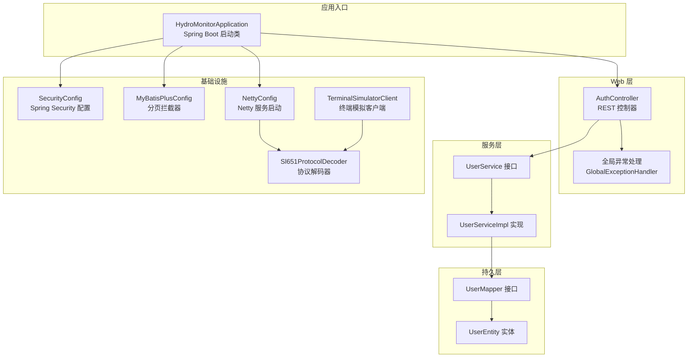
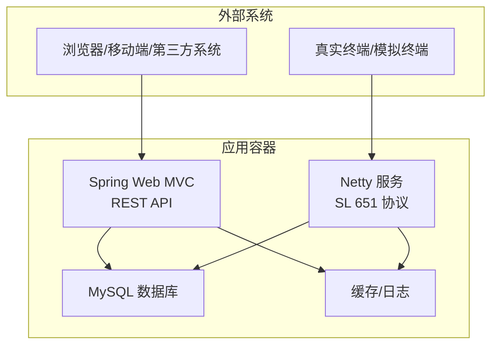
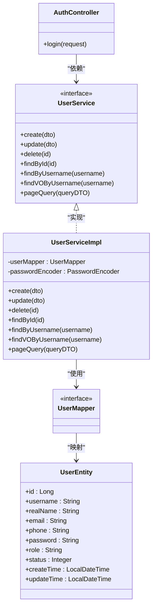
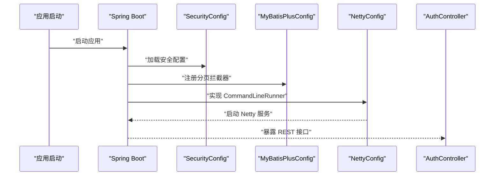
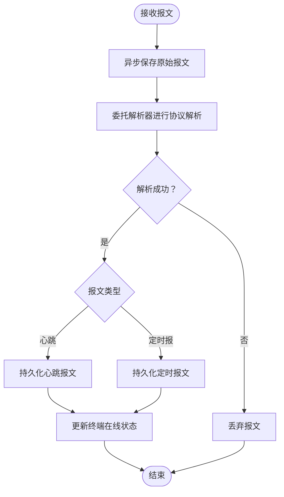
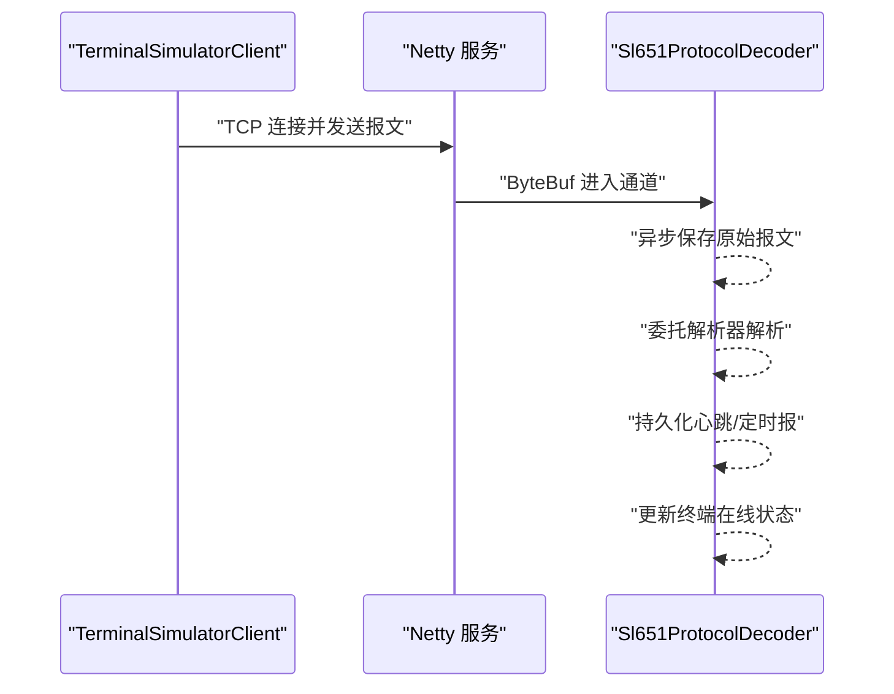
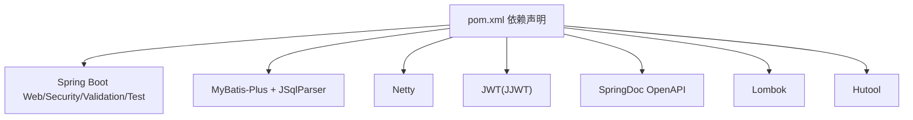

# 整体架构设计

<cite>
**本文引用的文件**
- [HydroMonitorApplication.java](file://src/main/java/com/hydro/monitor/HydroMonitorApplication.java)
- [pom.xml](file://pom.xml)
- [application.yml](file://src/main/resources/application.yml)
- [README.md](file://README.md)
- [GlobalExceptionHandler.java](file://src/main/java/com/hydro/monitor/common/GlobalExceptionHandler.java)
- [SecurityConfig.java](file://src/main/java/com/hydro/monitor/config/security/SecurityConfig.java)
- [MyBatisPlusConfig.java](file://src/main/java/com/hydro/monitor/config/MyBatisPlusConfig.java)
- [NettyConfig.java](file://src/main/java/com/hydro/monitor/config/NettyConfig.java)
- [AuthController.java](file://src/main/java/com/hydro/monitor/modules/controller/AuthController.java)
- [UserService.java](file://src/main/java/com/hydro/monitor/modules/service/UserService.java)
- [UserEntity.java](file://src/main/java/com/hydro/monitor/modules/entity/UserEntity.java)
- [UserMapper.java](file://src/main/java/com/hydro/monitor/modules/mapper/UserMapper.java)
- [UserServiceImpl.java](file://src/main/java/com/hydro/monitor/modules/service/impl/UserServiceImpl.java)
- [Sl651ProtocolDecoder.java](file://src/main/java/com/hydro/monitor/netty/Sl651ProtocolDecoder.java)
- [TerminalSimulatorClient.java](file://src/main/java/com/hydro/monitor/simulation/TerminalSimulatorClient.java)
</cite>

## 目录
1. [简介](#简介)
2. [项目结构](#项目结构)
3. [核心组件](#核心组件)
4. [架构总览](#架构总览)
5. [详细组件分析](#详细组件分析)
6. [依赖分析](#依赖分析)
7. [性能考虑](#性能考虑)
8. [故障排查指南](#故障排查指南)
9. [结论](#结论)
10. [附录](#附录)

## 简介
本项目是一个基于 Java 17、Spring Boot 3.5.9、Netty 4.1、Spring Security 6 与 MyBatis-Plus 3.5.9 的高性能水文监测数据采集与分析平台。系统采用分层架构（Controller-Service-Mapper-Entity）与 MVC 模式，结合 Spring Boot 自动配置与组件扫描，实现 REST API 与 SL 651-2014 协议报文的高性能接入。系统同时提供 Netty 网络服务用于接收实时报文，并内置终端模拟模块用于开发测试。

## 项目结构
项目采用按“模块+层次”混合组织方式：
- config：全局配置（安全、MyBatis-Plus、Netty、OpenAPI、仿真）
- common：公共组件（全局异常、分页、密码生成等）
- modules：业务模块，按层次划分 controller/dto/entity/mapper/service/vo
- netty：SL 651 协议解析与 Netty 通道处理
- simulation：终端模拟上报模块
- resources：配置文件与数据库迁移脚本

**图表来源**
- [HydroMonitorApplication.java:12-35](file://src/main/java/com/hydro/monitor/HydroMonitorApplication.java#L12-L35)
- [AuthController.java:24-67](file://src/main/java/com/hydro/monitor/modules/controller/AuthController.java#L24-L67)
- [UserService.java:17-73](file://src/main/java/com/hydro/monitor/modules/service/UserService.java#L17-L73)
- [UserServiceImpl.java:30-207](file://src/main/java/com/hydro/monitor/modules/service/impl/UserServiceImpl.java#L30-L207)
- [UserMapper.java:12-14](file://src/main/java/com/hydro/monitor/modules/mapper/UserMapper.java#L12-L14)
- [UserEntity.java:15-69](file://src/main/java/com/hydro/monitor/modules/entity/UserEntity.java#L15-L69)
- [SecurityConfig.java:20-75](file://src/main/java/com/hydro/monitor/config/security/SecurityConfig.java#L20-L75)
- [MyBatisPlusConfig.java:14-38](file://src/main/java/com/hydro/monitor/config/MyBatisPlusConfig.java#L14-L38)
- [NettyConfig.java:23-86](file://src/main/java/com/hydro/monitor/config/NettyConfig.java#L23-L86)
- [Sl651ProtocolDecoder.java:35-277](file://src/main/java/com/hydro/monitor/netty/Sl651ProtocolDecoder.java#L35-L277)
- [TerminalSimulatorClient.java:24-206](file://src/main/java/com/hydro/monitor/simulation/TerminalSimulatorClient.java#L24-L206)

**章节来源**
- [README.md:85-106](file://README.md#L85-L106)
- [pom.xml:30-153](file://pom.xml#L30-L153)
- [application.yml:1-86](file://src/main/resources/application.yml#L1-L86)

## 核心组件
- 启动类与自动配置：应用入口负责启动 Spring Boot 容器，自动装配各配置与组件。
- 安全与认证：基于 Spring Security 6 的无状态 JWT 认证链路，开放特定路径并拦截其余请求。
- 持久层：MyBatis-Plus 提供分页与逻辑删除等能力，Mapper 接口继承基础接口即可获得 CRUD 能力。
- 网络层：Netty 服务在应用启动后异步启动，监听指定端口，使用自定义协议解码器处理 SL 651 报文。
- 业务层：以 UserService 为例，Service 接口定义业务契约，实现类承担事务与数据转换。
- 控制器层：REST 控制器负责参数校验、调用服务并返回统一结果包装。

**章节来源**
- [HydroMonitorApplication.java:12-35](file://src/main/java/com/hydro/monitor/HydroMonitorApplication.java#L12-L35)
- [SecurityConfig.java:20-75](file://src/main/java/com/hydro/monitor/config/security/SecurityConfig.java#L20-L75)
- [MyBatisPlusConfig.java:14-38](file://src/main/java/com/hydro/monitor/config/MyBatisPlusConfig.java#L14-L38)
- [NettyConfig.java:23-86](file://src/main/java/com/hydro/monitor/config/NettyConfig.java#L23-L86)
- [UserService.java:17-73](file://src/main/java/com/hydro/monitor/modules/service/UserService.java#L17-L73)
- [UserServiceImpl.java:30-207](file://src/main/java/com/hydro/monitor/modules/service/impl/UserServiceImpl.java#L30-L207)
- [AuthController.java:24-67](file://src/main/java/com/hydro/monitor/modules/controller/AuthController.java#L24-L67)

## 架构总览
系统采用“Web + Netty 并行”的双服务架构：
- Web 服务：基于 Spring MVC，提供 REST API，配合 Spring Security 与 JWT 实现认证鉴权。
- Netty 服务：独立于 Web 容器，接收 SL 651 报文，解析后持久化至数据库。
- 数据访问：MyBatis-Plus 提供分页、逻辑删除与通用 Mapper 能力。
- 统一异常处理：全局异常处理器集中处理业务与系统异常，保证对外响应一致性。
- 配置中心：application.yml 集中管理数据库、日志、JWT、Netty、OpenAPI 等配置。

**图表来源**
- [application.yml:1-86](file://src/main/resources/application.yml#L1-L86)
- [NettyConfig.java:23-86](file://src/main/java/com/hydro/monitor/config/NettyConfig.java#L23-L86)
- [Sl651ProtocolDecoder.java:35-277](file://src/main/java/com/hydro/monitor/netty/Sl651ProtocolDecoder.java#L35-L277)

## 详细组件分析

### 分层架构与 MVC 应用
- Controller 层：以 AuthController 为例，负责接收请求、参数封装与调用服务，返回统一结果包装。
- Service 层：UserService 定义业务契约，UserServiceImpl 实现具体逻辑，包含事务控制与数据转换。
- Mapper 层：UserMapper 继承 MyBatis-Plus 基础 Mapper，提供通用 CRUD 能力。
- Entity 层：UserEntity 映射数据库表结构，使用注解配置主键与字段映射。
- VO/DTO：DTO 用于接口入参，VO 用于接口出参，实现数据隔离与解耦。

**图表来源**
- [AuthController.java:24-67](file://src/main/java/com/hydro/monitor/modules/controller/AuthController.java#L24-L67)
- [UserService.java:17-73](file://src/main/java/com/hydro/monitor/modules/service/UserService.java#L17-L73)
- [UserServiceImpl.java:30-207](file://src/main/java/com/hydro/monitor/modules/service/impl/UserServiceImpl.java#L30-L207)
- [UserMapper.java:12-14](file://src/main/java/com/hydro/monitor/modules/mapper/UserMapper.java#L12-L14)
- [UserEntity.java:15-69](file://src/main/java/com/hydro/monitor/modules/entity/UserEntity.java#L15-L69)

**章节来源**
- [AuthController.java:24-67](file://src/main/java/com/hydro/monitor/modules/controller/AuthController.java#L24-L67)
- [UserService.java:17-73](file://src/main/java/com/hydro/monitor/modules/service/UserService.java#L17-L73)
- [UserServiceImpl.java:30-207](file://src/main/java/com/hydro/monitor/modules/service/impl/UserServiceImpl.java#L30-L207)
- [UserMapper.java:12-14](file://src/main/java/com/hydro/monitor/modules/mapper/UserMapper.java#L12-L14)
- [UserEntity.java:15-69](file://src/main/java/com/hydro/monitor/modules/entity/UserEntity.java#L15-L69)

### Spring Boot 自动配置与组件扫描
- 启动类：@SpringBootApplication 标注启动类，启用组件扫描与自动配置。
- 安全配置：SecurityConfig 使用 @EnableWebSecurity 与 SecurityFilterChain 定义无状态认证链。
- MyBatis-Plus：MyBatisPlusConfig 注册分页拦截器，支持自动分页与逻辑删除。
- Netty：NettyConfig 实现 CommandLineRunner，在应用启动后异步启动 Netty 服务。
- 全局异常：GlobalExceptionHandler 使用 @RestControllerAdvice 统一处理异常。

**图表来源**
- [HydroMonitorApplication.java:12-35](file://src/main/java/com/hydro/monitor/HydroMonitorApplication.java#L12-L35)
- [SecurityConfig.java:20-75](file://src/main/java/com/hydro/monitor/config/security/SecurityConfig.java#L20-L75)
- [MyBatisPlusConfig.java:14-38](file://src/main/java/com/hydro/monitor/config/MyBatisPlusConfig.java#L14-L38)
- [NettyConfig.java:23-86](file://src/main/java/com/hydro/monitor/config/NettyConfig.java#L23-L86)
- [AuthController.java:24-67](file://src/main/java/com/hydro/monitor/modules/controller/AuthController.java#L24-L67)

**章节来源**
- [HydroMonitorApplication.java:12-35](file://src/main/java/com/hydro/monitor/HydroMonitorApplication.java#L12-L35)
- [SecurityConfig.java:20-75](file://src/main/java/com/hydro/monitor/config/security/SecurityConfig.java#L20-L75)
- [MyBatisPlusConfig.java:14-38](file://src/main/java/com/hydro/monitor/config/MyBatisPlusConfig.java#L14-L38)
- [NettyConfig.java:23-86](file://src/main/java/com/hydro/monitor/config/NettyConfig.java#L23-L86)
- [GlobalExceptionHandler.java:15-57](file://src/main/java/com/hydro/monitor/common/GlobalExceptionHandler.java#L15-L57)

### 数据流向与协议处理
- 报文接收：Netty 服务监听端口，Sl651ProtocolDecoder 接收 ByteBuf。
- 原始报文记录：异步保存原始报文，避免阻塞 Netty 线程。
- 协议解析：委托 Sl651MessageParser 进行纯解析，不包含业务逻辑。
- 业务持久化：根据解析结果分别持久化心跳与定时报，同时更新终端在线状态。
- 要素映射：将解析得到的要素 ID 映射为配置表中的要素编码，构建 JSON 存储。

**图表来源**
- [Sl651ProtocolDecoder.java:53-89](file://src/main/java/com/hydro/monitor/netty/Sl651ProtocolDecoder.java#L53-L89)
- [Sl651ProtocolDecoder.java:98-182](file://src/main/java/com/hydro/monitor/netty/Sl651ProtocolDecoder.java#L98-L182)
- [Sl651ProtocolDecoder.java:203-249](file://src/main/java/com/hydro/monitor/netty/Sl651ProtocolDecoder.java#L203-L249)

**章节来源**
- [Sl651ProtocolDecoder.java:35-277](file://src/main/java/com/hydro/monitor/netty/Sl651ProtocolDecoder.java#L35-L277)

### 终端模拟模块
- 终端模拟客户端：每个终端实例独立定时发送 SL 651 报文，支持多终端并发模拟。
- 配置项：中心站地址、密码、站分类码、上报间隔、终端数量等。
- 线程模型：每个终端使用独立调度线程，避免相互干扰。

**图表来源**
- [TerminalSimulatorClient.java:56-90](file://src/main/java/com/hydro/monitor/simulation/TerminalSimulatorClient.java#L56-L90)
- [TerminalSimulatorClient.java:119-156](file://src/main/java/com/hydro/monitor/simulation/TerminalSimulatorClient.java#L119-L156)
- [Sl651ProtocolDecoder.java:53-89](file://src/main/java/com/hydro/monitor/netty/Sl651ProtocolDecoder.java#L53-L89)

**章节来源**
- [TerminalSimulatorClient.java:24-206](file://src/main/java/com/hydro/monitor/simulation/TerminalSimulatorClient.java#L24-L206)

## 依赖分析
- 技术栈选择：
  - Spring Boot 3.5.9：现代化自动配置与生产就绪特性。
  - Netty 4.1：高性能网络通信，适合 SL 651 实时报文处理。
  - Spring Security 6：基于 WebFlux 的安全模型，无状态 JWT 认证。
  - MyBatis-Plus 3.5.9：简化持久层开发，提供分页与逻辑删除。
  - MySQL 8.0+：稳定的关系型数据库。
  - SpringDoc OpenAPI：自动生成 API 文档。
- Maven 依赖：统一管理版本，插件配置支持热部署与 UTF-8 编码。

**图表来源**
- [pom.xml:30-153](file://pom.xml#L30-L153)

**章节来源**
- [pom.xml:21-28](file://pom.xml#L21-L28)
- [pom.xml:30-153](file://pom.xml#L30-L153)
- [application.yml:1-86](file://src/main/resources/application.yml#L1-L86)

## 性能考虑
- Netty 异步非阻塞：报文接收与解析在 Netty 线程中进行，原始报文异步持久化，避免阻塞事件循环。
- 分页与逻辑删除：MyBatis-Plus 分页拦截器限制最大单页条数，防止超大数据量查询；逻辑删除减少物理删除开销。
- 无状态认证：JWT 无状态，降低会话存储与查找成本。
- 线程模型：终端模拟使用独立调度线程，避免相互影响；Netty 使用多线程事件循环组。
- 编码与日志：统一 UTF-8 编码，合理日志级别与滚动策略，降低 I/O 压力。

[本节为通用性能建议，无需特定文件引用]

## 故障排查指南
- 启动失败：检查数据库连接、端口占用与配置文件。
- 认证失败：确认用户名密码正确、JWT 密钥与过期时间配置。
- 报文解析失败：查看原始报文记录与解析器日志，确认报文格式与要素映射配置。
- Netty 服务异常：检查端口监听、通道初始化与优雅停机逻辑。
- 全局异常：通过 GlobalExceptionHandler 统一捕获并记录，定位具体业务异常原因。

**章节来源**
- [application.yml:1-86](file://src/main/resources/application.yml#L1-L86)
- [GlobalExceptionHandler.java:15-57](file://src/main/java/com/hydro/monitor/common/GlobalExceptionHandler.java#L15-L57)
- [NettyConfig.java:75-85](file://src/main/java/com/hydro/monitor/config/NettyConfig.java#L75-L85)
- [Sl651ProtocolDecoder.java:272-277](file://src/main/java/com/hydro/monitor/netty/Sl651ProtocolDecoder.java#L272-L277)

## 结论
本系统通过清晰的分层架构与 MVC 模式，结合 Spring Boot 自动配置与组件扫描，实现了 REST API 与 SL 651 协议的高性能接入。Netty 独立服务确保实时报文处理的低延迟与高吞吐，MyBatis-Plus 提升持久层开发效率，Spring Security 与 JWT 提供安全的认证机制。整体设计具备良好的扩展性与可维护性，适合在生产环境中持续演进。

[本节为总结性内容，无需特定文件引用]

## 附录
- 系统边界：
  - 内部：应用容器、数据库、日志与缓存。
  - 外部：浏览器/移动端/第三方系统、真实终端/模拟终端。
- 技术栈选择理由：
  - Spring Boot 3：现代化特性与生态完善。
  - Netty：高性能网络编程，适配 SL 651 实时场景。
  - MyBatis-Plus：提升开发效率与一致性。
  - SpringDoc：自动生成 API 文档，便于联调。
- 架构演进历史：
  - 初期：单体 Web 应用，逐步拆分网络层与业务层。
  - 近期：引入 Netty 独立服务，增强实时性与稳定性。
  - 未来：可考虑引入消息队列与微服务化改造，进一步提升扩展性。

[本节为概念性内容，无需特定文件引用]