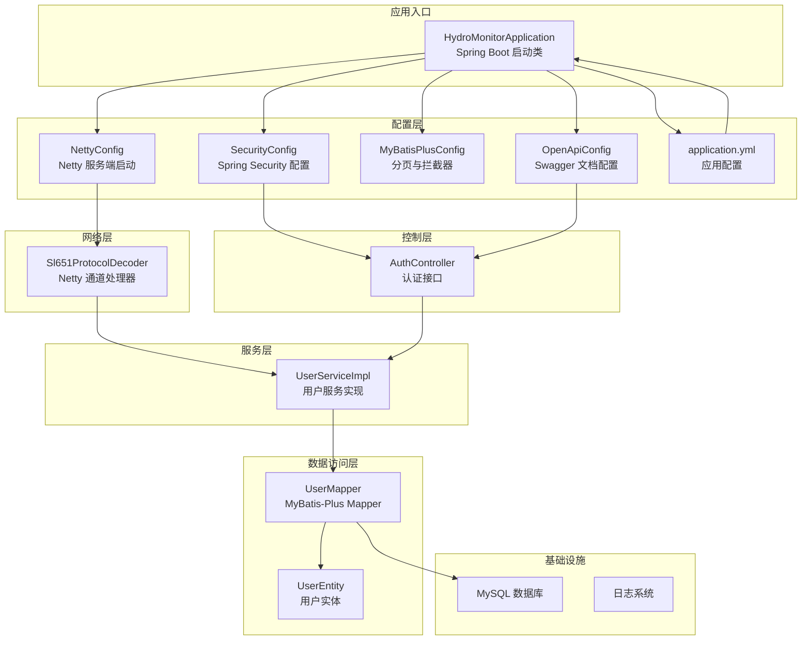
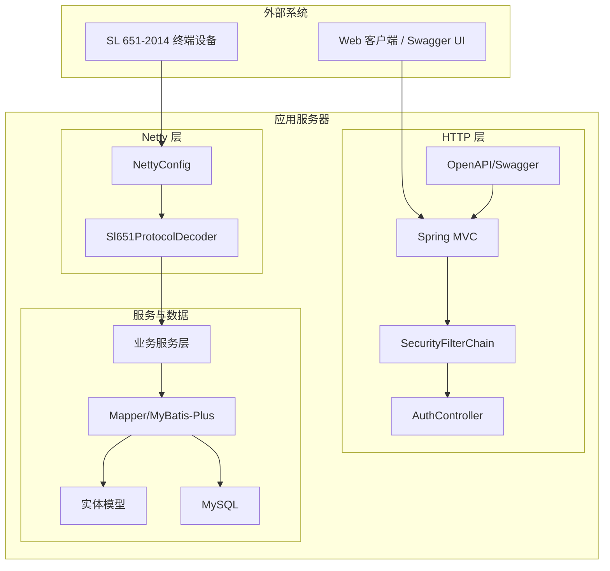
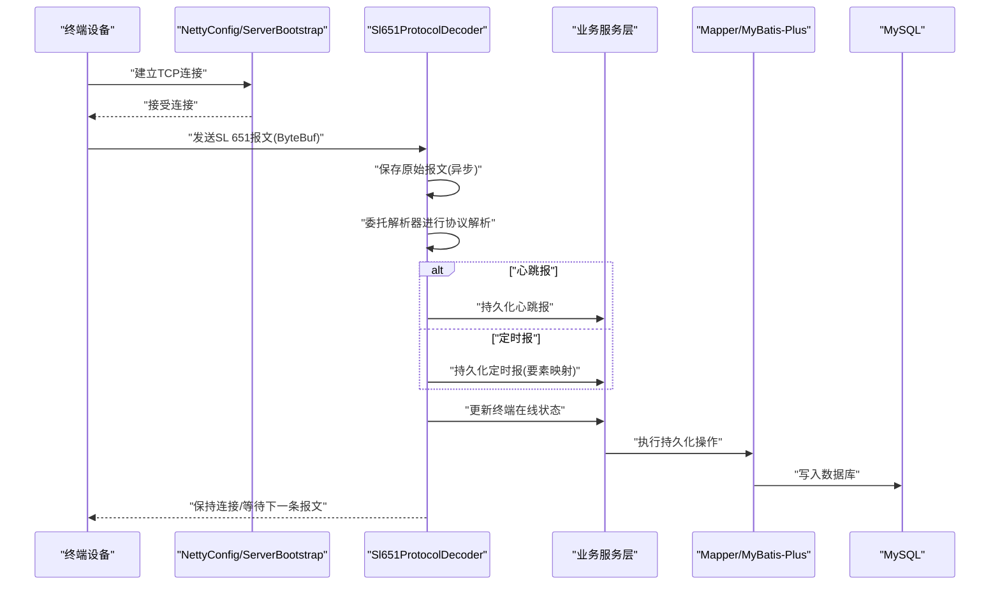
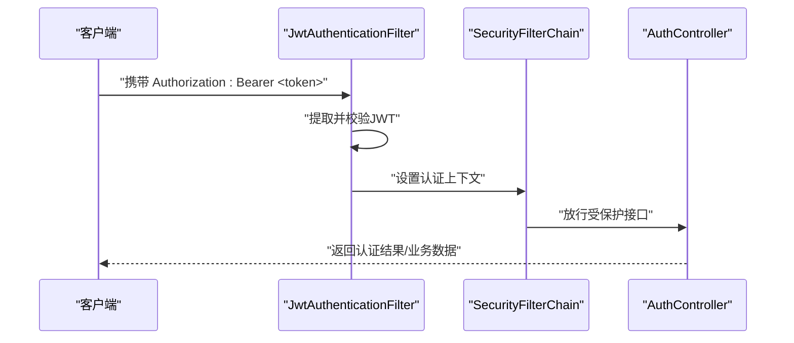
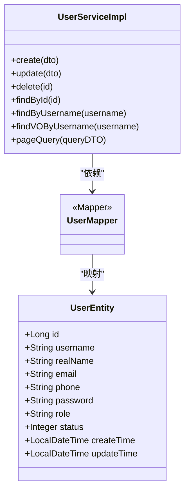
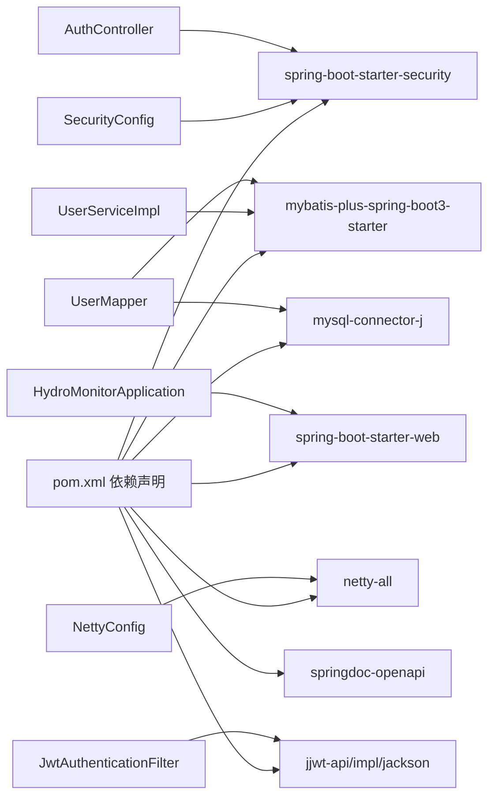

# 架构设计

<cite>
**本文引用的文件**
- [HydroMonitorApplication.java](file://src/main/java/com/hydro/monitor/HydroMonitorApplication.java)
- [application.yml](file://src/main/resources/application.yml)
- [pom.xml](file://pom.xml)
- [README.md](file://README.md)
- [NettyConfig.java](file://src/main/java/com/hydro/monitor/config/NettyConfig.java)
- [SecurityConfig.java](file://src/main/java/com/hydro/monitor/config/security/SecurityConfig.java)
- [JwtAuthenticationFilter.java](file://src/main/java/com/hydro/monitor/config/security/JwtAuthenticationFilter.java)
- [MyBatisPlusConfig.java](file://src/main/java/com/hydro/monitor/config/MyBatisPlusConfig.java)
- [OpenApiConfig.java](file://src/main/java/com/hydro/monitor/config/OpenApiConfig.java)
- [GlobalExceptionHandler.java](file://src/main/java/com/hydro/monitor/common/GlobalExceptionHandler.java)
- [Sl651ProtocolDecoder.java](file://src/main/java/com/hydro/monitor/netty/Sl651ProtocolDecoder.java)
- [AuthController.java](file://src/main/java/com/hydro/monitor/modules/controller/AuthController.java)
- [UserServiceImpl.java](file://src/main/java/com/hydro/monitor/modules/service/impl/UserServiceImpl.java)
- [UserEntity.java](file://src/main/java/com/hydro/monitor/modules/entity/UserEntity.java)
- [UserMapper.java](file://src/main/java/com/hydro/monitor/modules/mapper/UserMapper.java)
</cite>

## 目录
1. [引言](#引言)
2. [项目结构](#项目结构)
3. [核心组件](#核心组件)
4. [架构总览](#架构总览)
5. [详细组件分析](#详细组件分析)
6. [依赖分析](#依赖分析)
7. [性能考虑](#性能考虑)
8. [故障排查指南](#故障排查指南)
9. [结论](#结论)
10. [附录](#附录)

## 引言
本架构设计文档面向“水文监测系统后端”，目标是提供一套清晰、可演进、高性能且安全的系统设计方案。系统采用分层架构（Controller-Service-Mapper-Entity）与MVC模式相结合，并通过模块化理念组织业务域；同时集成Netty高性能网络通信、Spring Security安全体系以及MyBatis-Plus数据访问层，形成统一的系统边界与职责分离。

系统边界与集成点：
- 外部边界：SL 651-2014 终端设备（RTU）、Web客户端、Swagger UI。
- 内部边界：HTTP REST API（Spring Web）、Netty TCP服务、数据库（MySQL）。
- 关键集成：JWT认证贯穿REST API；原始报文通过Netty进入系统，经协议解析后持久化至数据库。

技术选型与动机：
- Spring Boot 3.5.9：现代化生态、稳定的企业级能力。
- Netty 4.1：事件驱动、零拷贝、高并发I/O模型，适合SL 651协议的实时接入。
- Spring Security 6 + JWT：无状态认证，适配微服务与多端访问。
- MyBatis-Plus 3.5.9：简化CRUD、内置分页、逻辑删除等企业级特性。
- SpringDoc OpenAPI：自动生成API文档，便于联调与运维。

## 项目结构
系统采用按“模块域”划分的目录结构，结合分层架构与MVC模式：
- config：系统配置（Netty、Security、MyBatis-Plus、OpenAPI、仿真配置）
- modules：业务模块，包含 controller、service、mapper、entity、dto、vo
- netty：Netty协议编解码与消息解析
- simulation：终端模拟上报模块
- common：全局异常、分页、密码生成等公共组件
- resources：配置文件、数据库迁移脚本

图表来源
- [HydroMonitorApplication.java:1-36](file://src/main/java/com/hydro/monitor/HydroMonitorApplication.java#L1-L36)
- [NettyConfig.java:1-87](file://src/main/java/com/hydro/monitor/config/NettyConfig.java#L1-L87)
- [SecurityConfig.java:1-76](file://src/main/java/com/hydro/monitor/config/security/SecurityConfig.java#L1-L76)
- [MyBatisPlusConfig.java:1-39](file://src/main/java/com/hydro/monitor/config/MyBatisPlusConfig.java#L1-L39)
- [OpenApiConfig.java:1-52](file://src/main/java/com/hydro/monitor/config/OpenApiConfig.java#L1-L52)
- [application.yml:1-86](file://src/main/resources/application.yml#L1-L86)
- [Sl651ProtocolDecoder.java:1-278](file://src/main/java/com/hydro/monitor/netty/Sl651ProtocolDecoder.java#L1-L278)
- [AuthController.java:1-68](file://src/main/java/com/hydro/monitor/modules/controller/AuthController.java#L1-L68)
- [UserServiceImpl.java:1-208](file://src/main/java/com/hydro/monitor/modules/service/impl/UserServiceImpl.java#L1-L208)
- [UserMapper.java:1-15](file://src/main/java/com/hydro/monitor/modules/mapper/UserMapper.java#L1-L15)
- [UserEntity.java:1-70](file://src/main/java/com/hydro/monitor/modules/entity/UserEntity.java#L1-L70)

章节来源
- [README.md:85-106](file://README.md#L85-L106)
- [pom.xml:1-179](file://pom.xml#L1-L179)

## 核心组件
- 启动类与应用配置
  - 启动类负责应用初始化与环境提示（HTTP/Netty端口、Swagger地址）。
  - application.yml集中管理数据库、MyBatis-Plus、Netty、JWT、Swagger、日志等配置。
- Netty网络层
  - NettyConfig在Spring启动后异步启动服务端，绑定端口并注册通道初始化器。
  - Sl651ProtocolDecoder作为通道处理器，负责接收报文、保存原始记录、委托解析器进行协议解析、持久化业务报文并更新终端在线状态。
- 安全与认证
  - SecurityConfig配置无状态会话、CSRF禁用、公开路径放行与JWT过滤链。
  - JwtAuthenticationFilter从请求头提取并验证JWT，填充SecurityContext。
- 数据访问层
  - MyBatisPlusConfig配置分页拦截器（MySQL方言、最大限制、溢出策略）。
  - UserMapper继承BaseMapper，UserServiceImpl封装事务与分页查询，UserEntity映射sys_user表。
- 文档与异常
  - OpenApiConfig提供Swagger文档与安全方案配置。
  - GlobalExceptionHandler统一捕获运行时异常、权限拒绝与通用异常，输出标准Result结构。

章节来源
- [HydroMonitorApplication.java:15-34](file://src/main/java/com/hydro/monitor/HydroMonitorApplication.java#L15-L34)
- [application.yml:1-86](file://src/main/resources/application.yml#L1-L86)
- [NettyConfig.java:39-70](file://src/main/java/com/hydro/monitor/config/NettyConfig.java#L39-L70)
- [Sl651ProtocolDecoder.java:53-89](file://src/main/java/com/hydro/monitor/netty/Sl651ProtocolDecoder.java#L53-L89)
- [SecurityConfig.java:33-52](file://src/main/java/com/hydro/monitor/config/security/SecurityConfig.java#L33-L52)
- [JwtAuthenticationFilter.java:31-59](file://src/main/java/com/hydro/monitor/config/security/JwtAuthenticationFilter.java#L31-L59)
- [MyBatisPlusConfig.java:23-37](file://src/main/java/com/hydro/monitor/config/MyBatisPlusConfig.java#L23-L37)
- [UserMapper.java:12-14](file://src/main/java/com/hydro/monitor/modules/mapper/UserMapper.java#L12-L14)
- [UserServiceImpl.java:38-186](file://src/main/java/com/hydro/monitor/modules/service/impl/UserServiceImpl.java#L38-L186)
- [UserEntity.java:15-69](file://src/main/java/com/hydro/monitor/modules/entity/UserEntity.java#L15-L69)
- [OpenApiConfig.java:27-50](file://src/main/java/com/hydro/monitor/config/OpenApiConfig.java#L27-L50)
- [GlobalExceptionHandler.java:15-57](file://src/main/java/com/hydro/monitor/common/GlobalExceptionHandler.java#L15-L57)

## 架构总览
系统采用“双栈”架构：HTTP REST API与Netty TCP服务并存，分别服务于Web客户端与SL 651-2014终端设备。两者共享同一数据访问层与安全体系，确保数据一致性与访问控制。

图表来源
- [NettyConfig.java:47-65](file://src/main/java/com/hydro/monitor/config/NettyConfig.java#L47-L65)
- [Sl651ProtocolDecoder.java:53-89](file://src/main/java/com/hydro/monitor/netty/Sl651ProtocolDecoder.java#L53-L89)
- [AuthController.java:41-66](file://src/main/java/com/hydro/monitor/modules/controller/AuthController.java#L41-L66)
- [SecurityConfig.java:33-52](file://src/main/java/com/hydro/monitor/config/security/SecurityConfig.java#L33-L52)
- [OpenApiConfig.java:27-50](file://src/main/java/com/hydro/monitor/config/OpenApiConfig.java#L27-L50)
- [UserServiceImpl.java:38-186](file://src/main/java/com/hydro/monitor/modules/service/impl/UserServiceImpl.java#L38-L186)
- [UserMapper.java:12-14](file://src/main/java/com/hydro/monitor/modules/mapper/UserMapper.java#L12-L14)
- [UserEntity.java:15-69](file://src/main/java/com/hydro/monitor/modules/entity/UserEntity.java#L15-L69)

## 详细组件分析

### Netty高性能网络通信架构
- 启动流程
  - NettyConfig在CommandLineRunner回调中启动NIO事件循环组，配置ServerBootstrap，绑定端口并等待连接。
  - 优雅停机：@PreDestroy释放boss/worker线程组，保证资源回收。
- 报文处理
  - Sl651ProtocolDecoder作为Sharable处理器，接收ByteBuf，先异步保存原始报文，再委托Sl651MessageParser进行纯解析。
  - 根据解析结果类型分别持久化心跳报与定时报，并更新终端在线状态。
- 性能要点
  - 使用CompletableFuture.runAsync异步落库，避免阻塞Netty线程。
  - 通道异常捕获后主动关闭，防止资源泄漏。
  - 通道初始化器注入，便于扩展编解码链路。

图表来源
- [NettyConfig.java:47-65](file://src/main/java/com/hydro/monitor/config/NettyConfig.java#L47-L65)
- [Sl651ProtocolDecoder.java:53-89](file://src/main/java/com/hydro/monitor/netty/Sl651ProtocolDecoder.java#L53-L89)
- [Sl651ProtocolDecoder.java:203-249](file://src/main/java/com/hydro/monitor/netty/Sl651ProtocolDecoder.java#L203-L249)
- [Sl651ProtocolDecoder.java:98-119](file://src/main/java/com/hydro/monitor/netty/Sl651ProtocolDecoder.java#L98-L119)
- [Sl651ProtocolDecoder.java:126-182](file://src/main/java/com/hydro/monitor/netty/Sl651ProtocolDecoder.java#L126-L182)

章节来源
- [NettyConfig.java:39-85](file://src/main/java/com/hydro/monitor/config/NettyConfig.java#L39-L85)
- [Sl651ProtocolDecoder.java:35-89](file://src/main/java/com/hydro/monitor/netty/Sl651ProtocolDecoder.java#L35-L89)

### Spring Security安全体系
- 配置要点
  - 禁用CSRF，开启无状态会话（STATELESS）。
  - 公开路径：认证接口、Swagger静态资源。
  - 其余接口均需认证，通过JwtAuthenticationFilter从Authorization头提取并校验JWT。
- 认证流程
  - JwtAuthenticationFilter提取Bearer Token，校验通过后构造认证对象填充SecurityContext。
  - SecurityFilterChain对后续请求进行授权判断。

图表来源
- [JwtAuthenticationFilter.java:31-59](file://src/main/java/com/hydro/monitor/config/security/JwtAuthenticationFilter.java#L31-L59)
- [SecurityConfig.java:33-52](file://src/main/java/com/hydro/monitor/config/security/SecurityConfig.java#L33-L52)
- [AuthController.java:41-66](file://src/main/java/com/hydro/monitor/modules/controller/AuthController.java#L41-L66)

章节来源
- [SecurityConfig.java:33-75](file://src/main/java/com/hydro/monitor/config/security/SecurityConfig.java#L33-L75)
- [JwtAuthenticationFilter.java:27-74](file://src/main/java/com/hydro/monitor/config/security/JwtAuthenticationFilter.java#L27-L74)
- [AuthController.java:41-66](file://src/main/java/com/hydro/monitor/modules/controller/AuthController.java#L41-L66)

### MyBatis-Plus数据访问层设计
- 分页与拦截器
  - MyBatisPlusConfig添加PaginationInnerInterceptor，设置MySQL方言、最大限制与溢出策略，确保分页安全与性能。
- 业务实现
  - UserServiceImpl使用LambdaQueryWrapper进行条件查询与分页，支持用户名、真实姓名、手机号、角色、状态等多维筛选。
  - 使用@Transactional标注关键CRUD方法，保证数据一致性。
- 实体映射
  - UserEntity采用雪花ID策略，字段与sys_user表映射，包含状态与时间戳字段。

图表来源
- [UserMapper.java:12-14](file://src/main/java/com/hydro/monitor/modules/mapper/UserMapper.java#L12-L14)
- [UserEntity.java:15-69](file://src/main/java/com/hydro/monitor/modules/entity/UserEntity.java#L15-L69)
- [UserServiceImpl.java:30-208](file://src/main/java/com/hydro/monitor/modules/service/impl/UserServiceImpl.java#L30-L208)

章节来源
- [MyBatisPlusConfig.java:23-37](file://src/main/java/com/hydro/monitor/config/MyBatisPlusConfig.java#L23-L37)
- [UserServiceImpl.java:38-186](file://src/main/java/com/hydro/monitor/modules/service/impl/UserServiceImpl.java#L38-L186)
- [UserEntity.java:15-69](file://src/main/java/com/hydro/monitor/modules/entity/UserEntity.java#L15-L69)
- [UserMapper.java:12-14](file://src/main/java/com/hydro/monitor/modules/mapper/UserMapper.java#L12-L14)

### MVC模式与模块化设计
- 控制器层：AuthController提供认证接口，遵循REST风格，返回统一Result结构。
- 服务层：UserServiceImpl封装业务逻辑与事务，提供CRUD与分页查询。
- 数据模型：UserEntity定义数据结构，DTO/VO用于接口传输与视图展示。
- 模块化：modules按领域拆分controller/service/mapper/entity/dto/vo，降低耦合度，提升可维护性。

章节来源
- [AuthController.java:24-67](file://src/main/java/com/hydro/monitor/modules/controller/AuthController.java#L24-L67)
- [UserServiceImpl.java:30-208](file://src/main/java/com/hydro/monitor/modules/service/impl/UserServiceImpl.java#L30-L208)
- [UserEntity.java:15-69](file://src/main/java/com/hydro/monitor/modules/entity/UserEntity.java#L15-L69)

## 依赖分析
- 外部依赖
  - Spring Boot Starter Web/Security/Validation/Test
  - MyBatis-Plus 3.5.9 + JSqlParser
  - Netty 4.1
  - MySQL Connector/J
  - jjwt（JWT）
  - SpringDoc OpenAPI
  - Lombok、Hutool
- 内部依赖
  - NettyConfig依赖NettyChannelInitializer（未在本节展开）
  - Sl651ProtocolDecoder依赖业务服务层接口（Heartbeat/TimedReport/ElementConfig/Terminal/RawMessage）
  - SecurityConfig依赖JwtAuthenticationFilter
  - AuthController依赖UserService与JwtUtil

图表来源
- [pom.xml:30-153](file://pom.xml#L30-L153)
- [HydroMonitorApplication.java:12-16](file://src/main/java/com/hydro/monitor/HydroMonitorApplication.java#L12-L16)
- [NettyConfig.java:28-28](file://src/main/java/com/hydro/monitor/config/NettyConfig.java#L28-L28)
- [SecurityConfig.java:24-24](file://src/main/java/com/hydro/monitor/config/security/SecurityConfig.java#L24-L24)
- [JwtAuthenticationFilter.java:29-29](file://src/main/java/com/hydro/monitor/config/security/JwtAuthenticationFilter.java#L29-L29)
- [AuthController.java:31-33](file://src/main/java/com/hydro/monitor/modules/controller/AuthController.java#L31-L33)
- [UserServiceImpl.java:35-36](file://src/main/java/com/hydro/monitor/modules/service/impl/UserServiceImpl.java#L35-L36)
- [UserMapper.java:12-14](file://src/main/java/com/hydro/monitor/modules/mapper/UserMapper.java#L12-L14)

章节来源
- [pom.xml:30-153](file://pom.xml#L30-L153)

## 性能考虑
- Netty
  - 事件驱动与零拷贝减少CPU与内存占用；异步保存原始报文避免阻塞I/O线程。
  - 合理设置SO_BACKLOG与保活参数，提升连接稳定性。
- 数据访问
  - 分页拦截器限制最大单页条数，避免超大数据量查询；逻辑删除字段统一管理软删除。
  - 事务边界明确，批量操作建议合并提交以减少往返。
- 安全与日志
  - JWT无状态认证降低会话存储压力；日志级别按环境调整，避免生产环境过度打印。
- 配置优化
  - application.yml中JVM参数强制UTF-8，避免字符集问题导致的性能损耗。

章节来源
- [NettyConfig.java:52-58](file://src/main/java/com/hydro/monitor/config/NettyConfig.java#L52-L58)
- [Sl651ProtocolDecoder.java:234-244](file://src/main/java/com/hydro/monitor/netty/Sl651ProtocolDecoder.java#L234-L244)
- [MyBatisPlusConfig.java:24-37](file://src/main/java/com/hydro/monitor/config/MyBatisPlusConfig.java#L24-L37)
- [application.yml:15-21](file://src/main/resources/application.yml#L15-L21)
- [application.yml:62-76](file://src/main/resources/application.yml#L62-L76)

## 故障排查指南
- 启动与端口
  - 确认HTTP端口8080与Netty端口9000未被占用；启动日志输出端口与Swagger地址。
- 数据库连接
  - application.yml中的数据库URL、用户名、密码需与实际环境一致；初始化脚本需正确执行。
- JWT与认证
  - 确认Authorization头格式为“Bearer <token>”；检查密钥与过期时间配置。
- Netty报文
  - 若解析失败或入库异常，查看异步保存日志与异常堆栈；确认要素映射配置与终端地址BCD编码。
- 全局异常
  - 运行时异常统一返回错误信息；权限拒绝返回403；通用异常记录系统内部错误。

章节来源
- [HydroMonitorApplication.java:27-33](file://src/main/java/com/hydro/monitor/HydroMonitorApplication.java#L27-L33)
- [application.yml:9-13](file://src/main/resources/application.yml#L9-L13)
- [JwtAuthenticationFilter.java:67-73](file://src/main/java/com/hydro/monitor/config/security/JwtAuthenticationFilter.java#L67-L73)
- [Sl651ProtocolDecoder.java:272-276](file://src/main/java/com/hydro/monitor/netty/Sl651ProtocolDecoder.java#L272-L276)
- [GlobalExceptionHandler.java:25-56](file://src/main/java/com/hydro/monitor/common/GlobalExceptionHandler.java#L25-L56)

## 结论
本系统通过“HTTP REST + Netty TCP”的双栈架构，结合Spring Security与JWT实现统一认证，利用MyBatis-Plus提供高效的数据访问能力，并以模块化方式组织业务域，实现了高并发、可扩展、易维护的水文监测系统后端。通过合理的配置与性能优化策略，系统能够在生产环境中稳定运行并支持未来扩展。

## 附录
- 快速启动与访问
  - 初始化数据库后，按README指引修改application.yml中的数据库连接信息，使用提供的启动脚本启动应用。
  - 访问HTTP服务、Netty服务与Swagger UI地址见启动日志与README说明。

章节来源
- [README.md:20-64](file://README.md#L20-L64)
- [HydroMonitorApplication.java:27-33](file://src/main/java/com/hydro/monitor/HydroMonitorApplication.java#L27-L33)