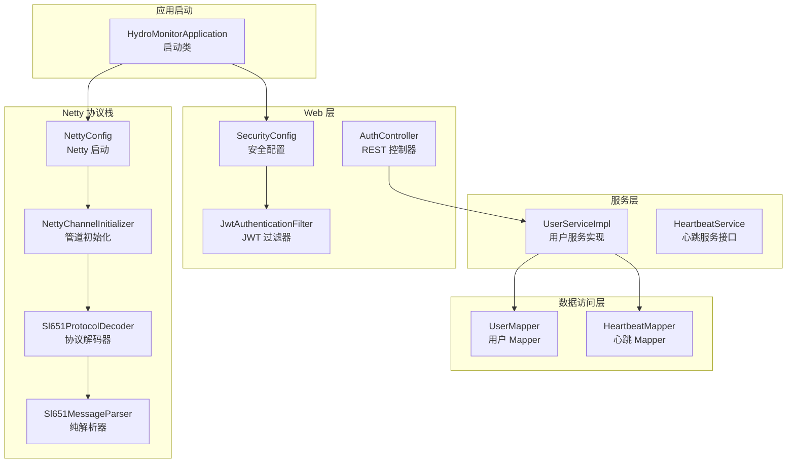
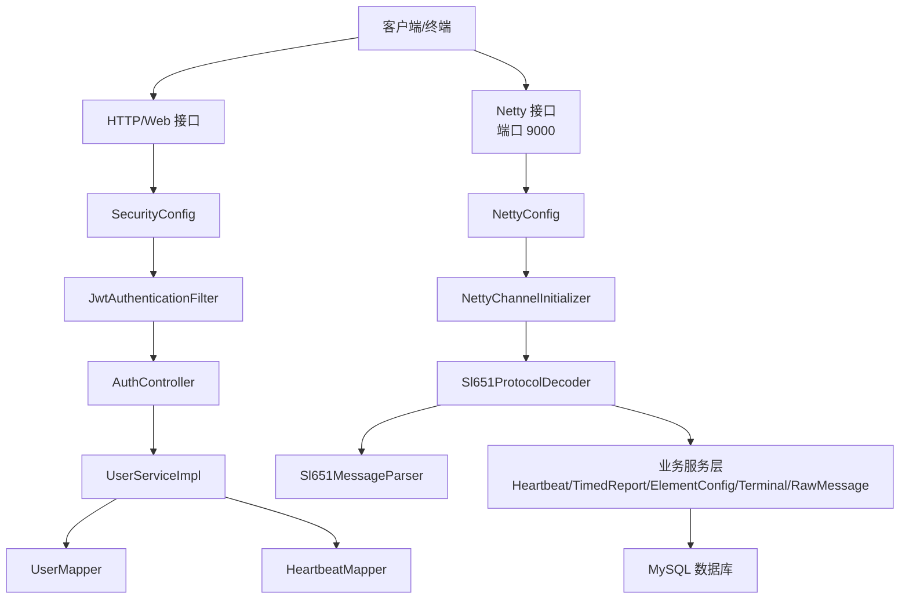
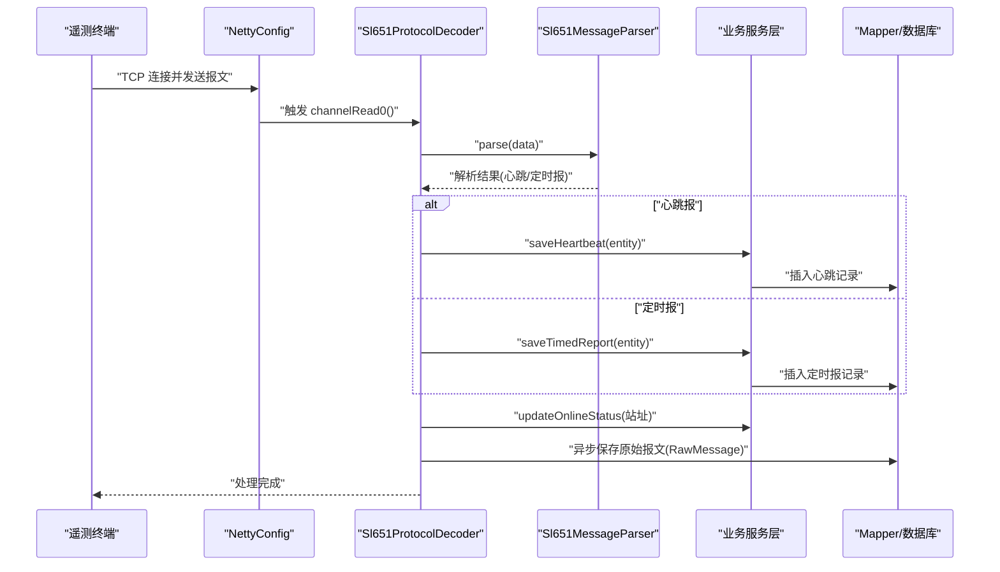
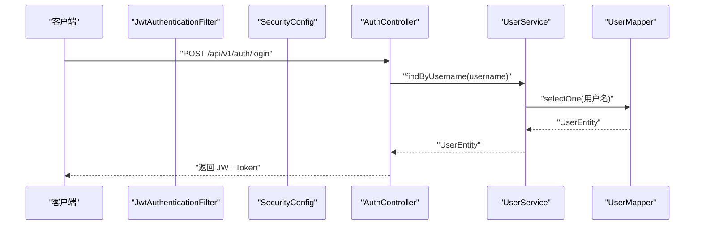
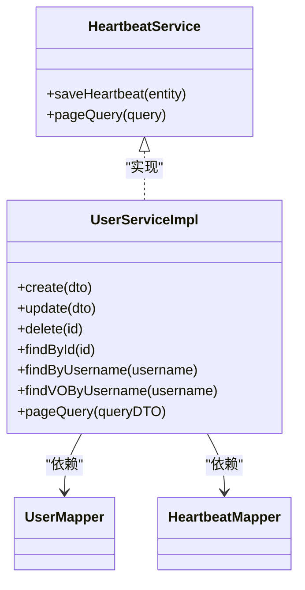
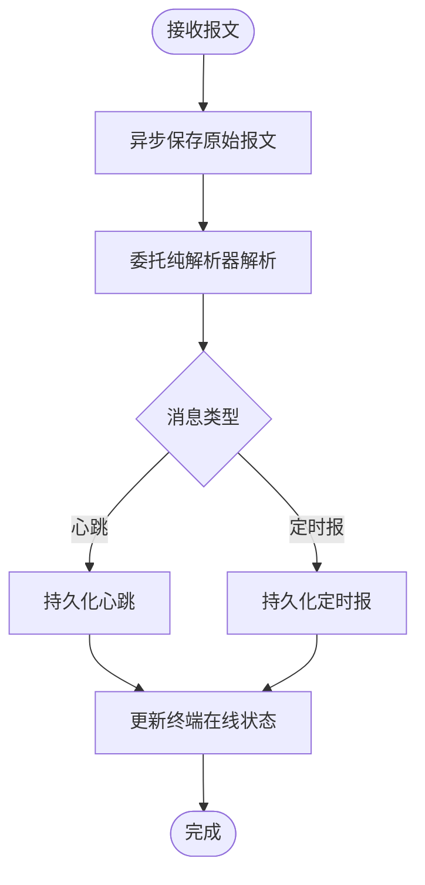
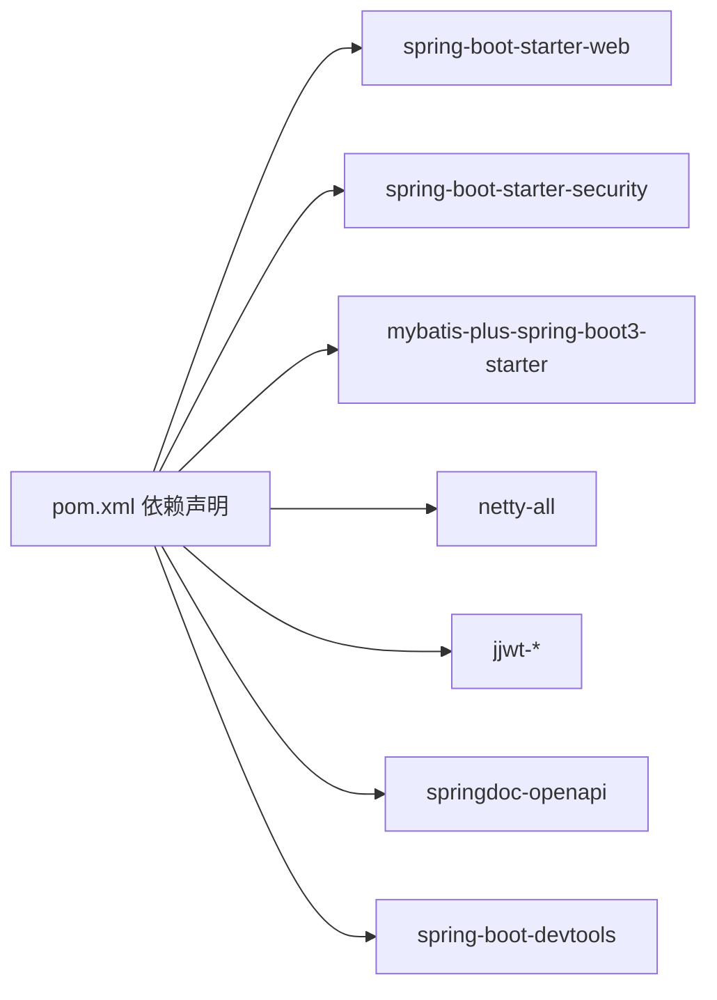

# 组件交互设计

<cite>
**本文引用的文件**
- [HydroMonitorApplication.java](file://src/main/java/com/hydro/monitor/HydroMonitorApplication.java)
- [NettyConfig.java](file://src/main/java/com/hydro/monitor/config/NettyConfig.java)
- [NettyChannelInitializer.java](file://src/main/java/com/hydro/monitor/config/NettyChannelInitializer.java)
- [Sl651ProtocolDecoder.java](file://src/main/java/com/hydro/monitor/netty/Sl651ProtocolDecoder.java)
- [Sl651MessageParser.java](file://src/main/java/com/hydro/monitor/netty/Sl651MessageParser.java)
- [SecurityConfig.java](file://src/main/java/com/hydro/monitor/config/security/SecurityConfig.java)
- [JwtAuthenticationFilter.java](file://src/main/java/com/hydro/monitor/config/security/JwtAuthenticationFilter.java)
- [MyBatisPlusConfig.java](file://src/main/java/com/hydro/monitor/config/MyBatisPlusConfig.java)
- [AuthController.java](file://src/main/java/com/hydro/monitor/modules/controller/AuthController.java)
- [UserServiceImpl.java](file://src/main/java/com/hydro/monitor/modules/service/impl/UserServiceImpl.java)
- [UserMapper.java](file://src/main/java/com/hydro/monitor/modules/mapper/UserMapper.java)
- [HeartbeatService.java](file://src/main/java/com/hydro/monitor/modules/service/HeartbeatService.java)
- [HeartbeatMapper.java](file://src/main/java/com/hydro/monitor/modules/mapper/HeartbeatMapper.java)
- [application.yml](file://src/main/resources/application.yml)
- [pom.xml](file://src/main/resources/pom.xml)
</cite>

## 目录
1. [引言](#引言)
2. [项目结构](#项目结构)
3. [核心组件](#核心组件)
4. [架构总览](#架构总览)
5. [详细组件分析](#详细组件分析)
6. [依赖分析](#依赖分析)
7. [性能考虑](#性能考虑)
8. [故障排查指南](#故障排查指南)
9. [结论](#结论)
10. [附录](#附录)

## 引言
本设计文档聚焦于系统组件间的交互关系与通信机制，覆盖以下主题：
- 控制器层与服务层的依赖注入与调用链
- 服务层与数据访问层（Mapper）的数据传递
- Netty 组件与业务逻辑的集成与解耦
- 组件生命周期管理与依赖注入容器作用
- 循环依赖处理策略
- 异步处理机制、事件驱动与消息传递协议
- 组件解耦策略、接口设计原则与扩展点
- 组件测试方法、Mock 策略与集成测试方案

## 项目结构
系统采用分层与模块化组织方式：
- 启动类负责应用初始化与端口信息输出
- 配置层包含 Spring Security、MyBatis-Plus、Netty 等配置
- 控制器层提供 REST API
- 服务层封装业务逻辑与事务控制
- Mapper 层基于 MyBatis-Plus 访问数据库
- Netty 子系统负责 SL 651 协议报文解析与持久化
- 资源层包含配置文件与数据库迁移脚本

图表来源
- [HydroMonitorApplication.java:12-35](file://src/main/java/com/hydro/monitor/HydroMonitorApplication.java#L12-L35)
- [NettyConfig.java:26-86](file://src/main/java/com/hydro/monitor/config/NettyConfig.java#L26-L86)
- [NettyChannelInitializer.java:18-35](file://src/main/java/com/hydro/monitor/config/NettyChannelInitializer.java#L18-L35)
- [Sl651ProtocolDecoder.java:39-89](file://src/main/java/com/hydro/monitor/netty/Sl651ProtocolDecoder.java#L39-L89)
- [Sl651MessageParser.java:25-126](file://src/main/java/com/hydro/monitor/netty/Sl651MessageParser.java#L25-L126)
- [SecurityConfig.java:22-75](file://src/main/java/com/hydro/monitor/config/security/SecurityConfig.java#L22-L75)
- [JwtAuthenticationFilter.java:27-74](file://src/main/java/com/hydro/monitor/config/security/JwtAuthenticationFilter.java#L27-L74)
- [AuthController.java:29-67](file://src/main/java/com/hydro/monitor/modules/controller/AuthController.java#L29-L67)
- [UserServiceImpl.java:33-207](file://src/main/java/com/hydro/monitor/modules/service/impl/UserServiceImpl.java#L33-L207)
- [UserMapper.java:12-14](file://src/main/java/com/hydro/monitor/modules/mapper/UserMapper.java#L12-L14)
- [HeartbeatService.java:12-28](file://src/main/java/com/hydro/monitor/modules/service/HeartbeatService.java#L12-L28)
- [HeartbeatMapper.java:12-14](file://src/main/java/com/hydro/monitor/modules/mapper/HeartbeatMapper.java#L12-L14)

章节来源
- [HydroMonitorApplication.java:12-35](file://src/main/java/com/hydro/monitor/HydroMonitorApplication.java#L12-L35)
- [application.yml:1-86](file://src/main/resources/application.yml#L1-L86)

## 核心组件
- 启动类与容器
  - 启动类负责应用启动与环境信息输出；通过 Spring Boot 自动装配加载配置与组件。
- Netty 子系统
  - NettyConfig 实现 CommandLineRunner，在应用启动后异步启动 Netty 服务端。
  - NettyChannelInitializer 负责在每个新连接建立时配置 ChannelPipeline。
  - Sl651ProtocolDecoder 作为 Netty 与业务层的桥接，负责调用纯解析器与持久化。
  - Sl651MessageParser 为纯解析器，无状态、线程安全，专注于报文结构化。
- 安全子系统
  - SecurityConfig 配置无状态会话与公开路径放行。
  - JwtAuthenticationFilter 从 Authorization 头提取 JWT 并设置认证上下文。
- 业务与数据访问
  - AuthController 调用 UserService 完成登录认证。
  - UserServiceImpl 使用 UserMapper 与 HeartbeatMapper 进行数据操作，结合 MyBatis-Plus 分页与事务。
  - MyBatisPlusConfig 注册分页拦截器。

章节来源
- [NettyConfig.java:26-86](file://src/main/java/com/hydro/monitor/config/NettyConfig.java#L26-L86)
- [NettyChannelInitializer.java:18-35](file://src/main/java/com/hydro/monitor/config/NettyChannelInitializer.java#L18-L35)
- [Sl651ProtocolDecoder.java:39-89](file://src/main/java/com/hydro/monitor/netty/Sl651ProtocolDecoder.java#L39-L89)
- [Sl651MessageParser.java:25-126](file://src/main/java/com/hydro/monitor/netty/Sl651MessageParser.java#L25-L126)
- [SecurityConfig.java:22-75](file://src/main/java/com/hydro/monitor/config/security/SecurityConfig.java#L22-L75)
- [JwtAuthenticationFilter.java:27-74](file://src/main/java/com/hydro/monitor/config/security/JwtAuthenticationFilter.java#L27-L74)
- [AuthController.java:29-67](file://src/main/java/com/hydro/monitor/modules/controller/AuthController.java#L29-L67)
- [UserServiceImpl.java:33-207](file://src/main/java/com/hydro/monitor/modules/service/impl/UserServiceImpl.java#L33-L207)
- [MyBatisPlusConfig.java:14-38](file://src/main/java/com/hydro/monitor/config/MyBatisPlusConfig.java#L14-L38)

## 架构总览
系统采用“Web + Netty + 业务服务 + 数据访问”的多通道架构：
- Web 通道：HTTP REST API，配合 Spring Security + JWT 实现认证鉴权。
- Netty 通道：SL 651 协议接入，异步解析与持久化，避免阻塞 IO 线程。
- 服务层：统一事务边界与业务编排，面向接口编程，便于替换与扩展。
- 数据访问层：MyBatis-Plus 提供通用 CRUD 与分页能力。

图表来源
- [NettyConfig.java:26-86](file://src/main/java/com/hydro/monitor/config/NettyConfig.java#L26-L86)
- [NettyChannelInitializer.java:18-35](file://src/main/java/com/hydro/monitor/config/NettyChannelInitializer.java#L18-L35)
- [Sl651ProtocolDecoder.java:39-89](file://src/main/java/com/hydro/monitor/netty/Sl651ProtocolDecoder.java#L39-L89)
- [Sl651MessageParser.java:25-126](file://src/main/java/com/hydro/monitor/netty/Sl651MessageParser.java#L25-L126)
- [SecurityConfig.java:22-75](file://src/main/java/com/hydro/monitor/config/security/SecurityConfig.java#L22-L75)
- [JwtAuthenticationFilter.java:27-74](file://src/main/java/com/hydro/monitor/config/security/JwtAuthenticationFilter.java#L27-L74)
- [AuthController.java:29-67](file://src/main/java/com/hydro/monitor/modules/controller/AuthController.java#L29-L67)
- [UserServiceImpl.java:33-207](file://src/main/java/com/hydro/monitor/modules/service/impl/UserServiceImpl.java#L33-L207)
- [HeartbeatMapper.java:12-14](file://src/main/java/com/hydro/monitor/modules/mapper/HeartbeatMapper.java#L12-L14)

## 详细组件分析

### 组件 A：Netty 协议解码与业务集成
- 职责分离
  - Sl651MessageParser 专注纯解析，保持无状态与线程安全。
  - Sl651ProtocolDecoder 作为 Netty 与业务层的桥接，负责调用业务服务与持久化。
- 异步处理
  - 原始报文保存采用异步任务，避免阻塞 Netty IO 线程。
- 生命周期
  - NettyConfig 在应用启动后异步启动服务端，并在容器销毁时优雅关闭。

图表来源
- [Sl651ProtocolDecoder.java:54-89](file://src/main/java/com/hydro/monitor/netty/Sl651ProtocolDecoder.java#L54-L89)
- [Sl651ProtocolDecoder.java:203-249](file://src/main/java/com/hydro/monitor/netty/Sl651ProtocolDecoder.java#L203-L249)
- [Sl651MessageParser.java:66-126](file://src/main/java/com/hydro/monitor/netty/Sl651MessageParser.java#L66-L126)

章节来源
- [NettyConfig.java:26-86](file://src/main/java/com/hydro/monitor/config/NettyConfig.java#L26-L86)
- [NettyChannelInitializer.java:18-35](file://src/main/java/com/hydro/monitor/config/NettyChannelInitializer.java#L18-L35)
- [Sl651ProtocolDecoder.java:39-89](file://src/main/java/com/hydro/monitor/netty/Sl651ProtocolDecoder.java#L39-L89)
- [Sl651MessageParser.java:25-126](file://src/main/java/com/hydro/monitor/netty/Sl651MessageParser.java#L25-L126)

### 组件 B：Web 认证与安全过滤
- 认证流程
  - 客户端携带 Bearer Token 访问受保护接口。
  - JwtAuthenticationFilter 从请求头提取 Token 并验证，成功则设置认证上下文。
  - SecurityConfig 配置无状态会话与公开路径放行。
- 控制器调用
  - AuthController 调用 UserService 完成登录校验与 Token 签发。

图表来源
- [JwtAuthenticationFilter.java:32-59](file://src/main/java/com/hydro/monitor/config/security/JwtAuthenticationFilter.java#L32-L59)
- [SecurityConfig.java:34-52](file://src/main/java/com/hydro/monitor/config/security/SecurityConfig.java#L34-L52)
- [AuthController.java:43-66](file://src/main/java/com/hydro/monitor/modules/controller/AuthController.java#L43-L66)
- [UserServiceImpl.java:123-129](file://src/main/java/com/hydro/monitor/modules/service/impl/UserServiceImpl.java#L123-L129)
- [UserMapper.java:12-14](file://src/main/java/com/hydro/monitor/modules/mapper/UserMapper.java#L12-L14)

章节来源
- [SecurityConfig.java:22-75](file://src/main/java/com/hydro/monitor/config/security/SecurityConfig.java#L22-L75)
- [JwtAuthenticationFilter.java:27-74](file://src/main/java/com/hydro/monitor/config/security/JwtAuthenticationFilter.java#L27-L74)
- [AuthController.java:29-67](file://src/main/java/com/hydro/monitor/modules/controller/AuthController.java#L29-L67)
- [UserServiceImpl.java:33-207](file://src/main/java/com/hydro/monitor/modules/service/impl/UserServiceImpl.java#L33-L207)
- [UserMapper.java:12-14](file://src/main/java/com/hydro/monitor/modules/mapper/UserMapper.java#L12-L14)

### 组件 C：服务层与数据访问层
- 服务层
  - UserServiceImpl 使用 MyBatis-Plus Page 与 LambdaQueryWrapper 实现分页查询与条件筛选。
  - 使用 @Transactional 确保业务一致性。
- 数据访问层
  - Mapper 继承 BaseMapper，自动获得通用 CRUD 能力。
- 配置
  - MyBatisPlusConfig 注册分页拦截器，支持默认最大单页限制与溢出处理。

图表来源
- [UserServiceImpl.java:33-207](file://src/main/java/com/hydro/monitor/modules/service/impl/UserServiceImpl.java#L33-L207)
- [UserMapper.java:12-14](file://src/main/java/com/hydro/monitor/modules/mapper/UserMapper.java#L12-L14)
- [HeartbeatService.java:12-28](file://src/main/java/com/hydro/monitor/modules/service/HeartbeatService.java#L12-L28)
- [HeartbeatMapper.java:12-14](file://src/main/java/com/hydro/monitor/modules/mapper/HeartbeatMapper.java#L12-L14)

章节来源
- [UserServiceImpl.java:33-207](file://src/main/java/com/hydro/monitor/modules/service/impl/UserServiceImpl.java#L33-L207)
- [UserMapper.java:12-14](file://src/main/java/com/hydro/monitor/modules/mapper/UserMapper.java#L12-L14)
- [HeartbeatService.java:12-28](file://src/main/java/com/hydro/monitor/modules/service/HeartbeatService.java#L12-L28)
- [HeartbeatMapper.java:12-14](file://src/main/java/com/hydro/monitor/modules/mapper/HeartbeatMapper.java#L12-L14)
- [MyBatisPlusConfig.java:14-38](file://src/main/java/com/hydro/monitor/config/MyBatisPlusConfig.java#L14-L38)

### 组件 D：异步处理与事件驱动
- 异步处理
  - Sl651ProtocolDecoder 对原始报文保存采用 CompletableFuture.runAsync，避免阻塞 Netty 线程。
- 事件驱动
  - 可扩展点：在业务服务层引入事件发布/订阅，将解析结果转化为领域事件，由订阅者异步处理（如统计、告警、推送）。
- 消息传递协议
  - Netty 通道内采用 SL 651-2014 协议帧结构与功能码区分心跳与定时报；HTTP 通道采用 JSON 与 JWT。

图表来源
- [Sl651ProtocolDecoder.java:203-249](file://src/main/java/com/hydro/monitor/netty/Sl651ProtocolDecoder.java#L203-L249)
- [Sl651ProtocolDecoder.java:54-89](file://src/main/java/com/hydro/monitor/netty/Sl651ProtocolDecoder.java#L54-L89)
- [Sl651MessageParser.java:66-126](file://src/main/java/com/hydro/monitor/netty/Sl651MessageParser.java#L66-L126)

章节来源
- [Sl651ProtocolDecoder.java:203-249](file://src/main/java/com/hydro/monitor/netty/Sl651ProtocolDecoder.java#L203-L249)
- [Sl651ProtocolDecoder.java:54-89](file://src/main/java/com/hydro/monitor/netty/Sl651ProtocolDecoder.java#L54-L89)
- [Sl651MessageParser.java:66-126](file://src/main/java/com/hydro/monitor/netty/Sl651MessageParser.java#L66-L126)

### 组件 E：生命周期管理与依赖注入容器
- 生命周期
  - NettyConfig 通过 CommandLineRunner 在应用启动后异步启动 Netty 服务端。
  - @PreDestroy 在容器关闭时优雅关闭 EventLoopGroup。
- 依赖注入
  - Spring 容器自动注入 Service、Mapper、Filter、Decoder 等组件。
- 循环依赖处理
  - 优先使用构造器注入与按需注入，避免 @Lazy 或 @PostConstruct 的复杂场景；若出现循环，建议拆分接口或引入中间层。

章节来源
- [NettyConfig.java:26-86](file://src/main/java/com/hydro/monitor/config/NettyConfig.java#L26-L86)
- [JwtAuthenticationFilter.java:27-74](file://src/main/java/com/hydro/monitor/config/security/JwtAuthenticationFilter.java#L27-L74)
- [Sl651ProtocolDecoder.java:39-89](file://src/main/java/com/hydro/monitor/netty/Sl651ProtocolDecoder.java#L39-L89)

## 依赖分析
- 外部依赖
  - Spring Boot Web、Security、Validation、MyBatis-Plus、Netty、JWT、OpenAPI/Swagger、DevTools。
- 组件耦合
  - Netty 与业务层通过 Sl651ProtocolDecoder 解耦，纯解析器与业务服务解耦。
  - Web 层与业务层通过控制器与服务接口解耦。
- 循环依赖
  - 当前未见明显循环依赖；若未来扩展，建议通过接口隔离与构造器注入规避。

图表来源
- [pom.xml:30-153](file://src/main/resources/pom.xml#L30-L153)

章节来源
- [pom.xml:30-153](file://src/main/resources/pom.xml#L30-L153)

## 性能考虑
- Netty
  - 使用共享的 ChannelHandler 与纯解析器，减少对象创建；异步保存原始报文降低阻塞风险。
- 数据访问
  - MyBatis-Plus 分页拦截器限制单页最大条数，避免超大数据集查询。
- 安全
  - 无状态会话减少服务器端状态存储开销。
- 建议
  - 对高频查询增加索引；对批量导入使用批处理；对热点数据引入缓存。

## 故障排查指南
- Netty 启动失败
  - 检查端口占用与配置项 netty.server.port；查看日志异常堆栈。
- 报文解析失败
  - 关注 Sl651MessageParser 的日志输出，确认起始符、正文长度、CRC 校验与功能码。
- 认证失败
  - 检查 Authorization 头格式与 JWT 有效性；确认 SecurityConfig 放行规则。
- 数据持久化异常
  - 查看服务层事务回滚日志与 Mapper SQL 输出；确认数据库连接与表结构。

章节来源
- [NettyConfig.java:66-70](file://src/main/java/com/hydro/monitor/config/NettyConfig.java#L66-L70)
- [Sl651MessageParser.java:73-126](file://src/main/java/com/hydro/monitor/netty/Sl651MessageParser.java#L73-L126)
- [JwtAuthenticationFilter.java:54-56](file://src/main/java/com/hydro/monitor/config/security/JwtAuthenticationFilter.java#L54-L56)
- [UserServiceImpl.java:40-48](file://src/main/java/com/hydro/monitor/modules/service/impl/UserServiceImpl.java#L40-L48)

## 结论
本系统通过清晰的分层与解耦设计，实现了 Web 与 Netty 双通道接入、无状态安全认证、纯解析器与业务服务分离以及异步持久化。依赖注入容器承担组件装配与生命周期管理，MyBatis-Plus 提供高效的数据访问能力。未来可在服务层引入事件驱动与缓存策略，进一步提升吞吐与可维护性。

## 附录
- 组件测试方法
  - 单元测试：针对 Sl651MessageParser 的解析逻辑、UserServiceImpl 的业务逻辑进行参数化测试。
  - Mock 策略：使用 Mockito 对 Service 依赖的 Mapper 进行 Mock；对 Netty 组件使用 EmbeddedChannel 进行单元测试。
  - 集成测试：使用 @SpringBootTest 启动容器，结合 H2 数据库与 @AutoConfigureTestDatabase 进行端到端验证。
- 配置参考
  - application.yml 中包含数据库、JWT、Netty、日志等关键配置项。

章节来源
- [application.yml:1-86](file://src/main/resources/application.yml#L1-L86)
- [pom.xml:125-144](file://src/main/resources/pom.xml#L125-L144)