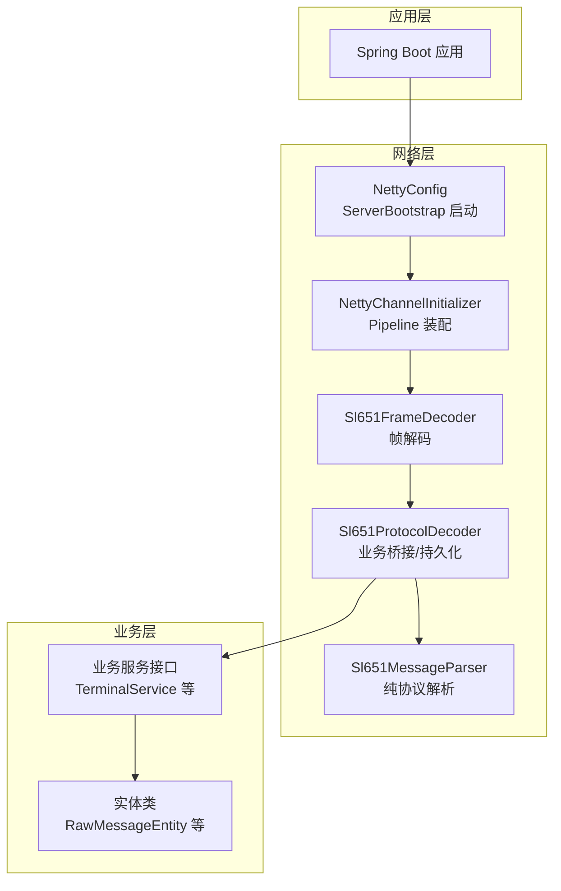
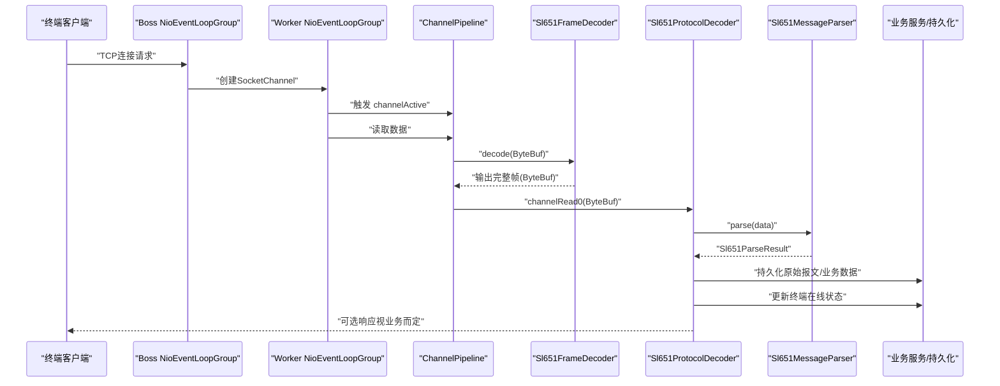
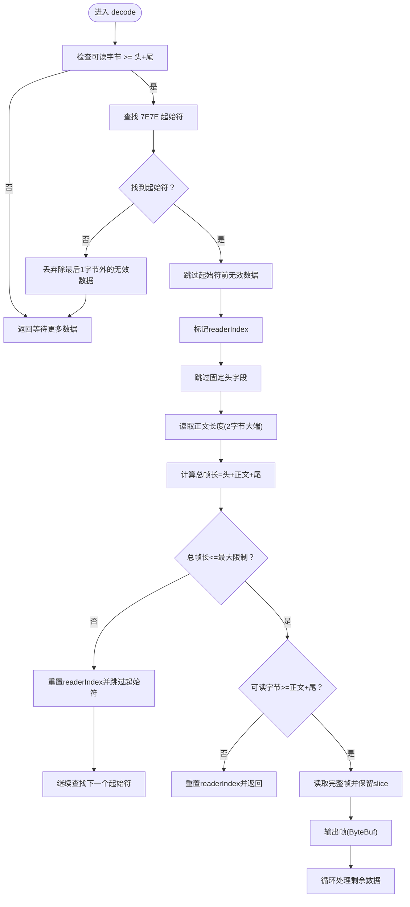
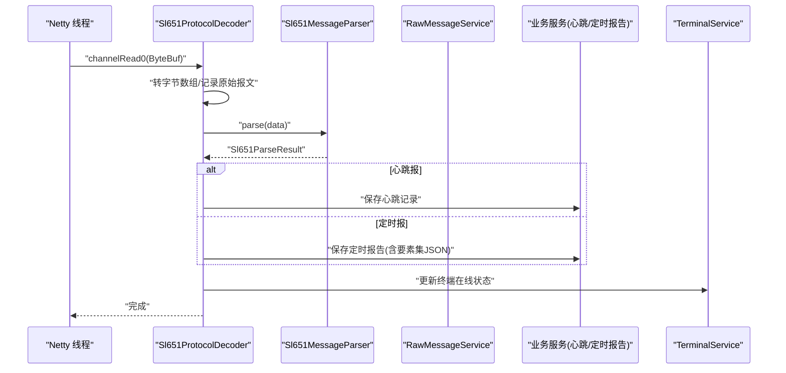
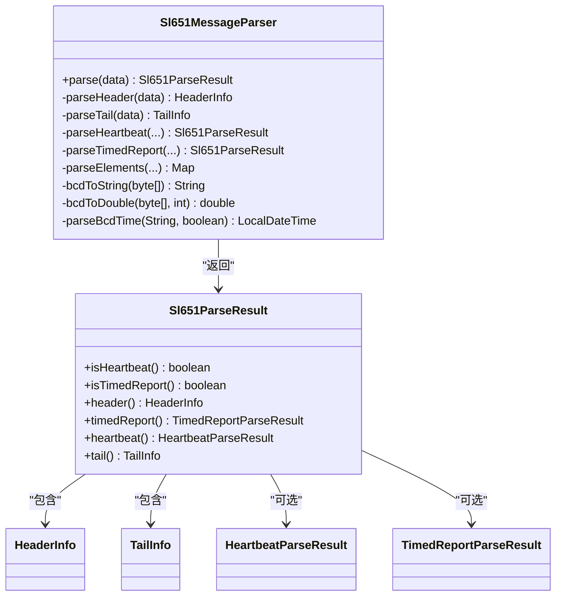
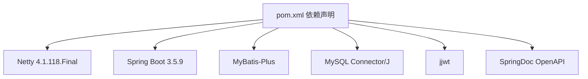

# 网络通信架构

<cite>
**本文引用的文件**
- [NettyConfig.java](file://src/main/java/com/hydro/monitor/config/NettyConfig.java)
- [NettyChannelInitializer.java](file://src/main/java/com/hydro/monitor/config/NettyChannelInitializer.java)
- [Sl651FrameDecoder.java](file://src/main/java/com/hydro/monitor/netty/Sl651FrameDecoder.java)
- [Sl651ProtocolDecoder.java](file://src/main/java/com/hydro/monitor/netty/Sl651ProtocolDecoder.java)
- [Sl651MessageParser.java](file://src/main/java/com/hydro/monitor/netty/Sl651MessageParser.java)
- [application.yml](file://src/main/resources/application.yml)
- [pom.xml](file://pom.xml)
- [Sl651MessageParserTest.java](file://src/test/java/com/hydro/monitor/netty/Sl651MessageParserTest.java)
- [Sl651ProtocolDecoderTest.java](file://src/test/java/com/hydro/monitor/netty/Sl651ProtocolDecoderTest.java)
- [TerminalService.java](file://src/main/java/com/hydro/monitor/modules/service/TerminalService.java)
- [RawMessageEntity.java](file://src/main/java/com/hydro/monitor/modules/entity/RawMessageEntity.java)
</cite>

## 目录
1. [简介](#简介)
2. [项目结构](#项目结构)
3. [核心组件](#核心组件)
4. [架构总览](#架构总览)
5. [详细组件分析](#详细组件分析)
6. [依赖关系分析](#依赖关系分析)
7. [性能考量](#性能考量)
8. [故障排查指南](#故障排查指南)
9. [结论](#结论)
10. [附录](#附录)

## 简介
本文件面向“基于Netty的高性能网络通信架构”，聚焦以下主题：
- NIO事件驱动模型与线程模型设计
- 连接管理策略与优雅停机
- NettyConfig配置类的作用与ServerBootstrap装配
- ChannelInitializer初始化流程与Pipeline处理器链
- SL651协议的网络传输机制、帧解码器实现与消息解析流程
- 网络架构图、数据包流转图与性能优化策略
- 高并发场景下Netty的优势、内存管理与背压处理
- 网络故障排查方法与性能调优建议

## 项目结构
该项目采用Spring Boot + Netty的混合架构，网络层位于独立的netty包内，业务层通过服务接口与持久化交互。关键目录与文件如下：
- 配置层：NettyConfig负责服务端启动；NettyChannelInitializer负责ChannelPipeline装配
- 协议层：Sl651FrameDecoder负责TCP粘包/拆包；Sl651ProtocolDecoder负责业务桥接与持久化；Sl651MessageParser负责纯协议解析
- 配置与依赖：application.yml提供端口等运行参数；pom.xml声明Netty版本与相关依赖
- 测试：针对协议解析器与协议解码器的单元测试覆盖典型场景

图表来源
- [NettyConfig.java:47-70](file://src/main/java/com/hydro/monitor/config/NettyConfig.java#L47-L70)
- [NettyChannelInitializer.java:22-34](file://src/main/java/com/hydro/monitor/config/NettyChannelInitializer.java#L22-L34)
- [Sl651FrameDecoder.java:37-100](file://src/main/java/com/hydro/monitor/netty/Sl651FrameDecoder.java#L37-L100)
- [Sl651ProtocolDecoder.java:53-89](file://src/main/java/com/hydro/monitor/netty/Sl651ProtocolDecoder.java#L53-L89)
- [Sl651MessageParser.java:66-126](file://src/main/java/com/hydro/monitor/netty/Sl651MessageParser.java#L66-L126)

章节来源
- [NettyConfig.java:18-87](file://src/main/java/com/hydro/monitor/config/NettyConfig.java#L18-L87)
- [NettyChannelInitializer.java:11-36](file://src/main/java/com/hydro/monitor/config/NettyChannelInitializer.java#L11-L36)
- [application.yml:43-47](file://src/main/resources/application.yml#L43-L47)

## 核心组件
- NettyConfig：实现CommandLineRunner，在Spring Boot启动后异步启动Netty服务端，配置NioEventLoopGroup、ServerBootstrap、Channel选项与关闭流程
- NettyChannelInitializer：在每个新连接建立时，向ChannelPipeline添加日志处理器（可选）、帧解码器与协议解码器
- Sl651FrameDecoder：基于7E7E起始符与功能码后的正文长度字段进行帧分割，处理TCP粘包/拆包，具备最大帧长保护
- Sl651ProtocolDecoder：作为Netty与业务层的桥接，负责将ByteBuf转为字节数组、调用纯解析器、持久化原始报文与业务数据、更新终端在线状态
- Sl651MessageParser：纯解析器，无状态、无副作用，按功能码分发解析心跳报与定时报，解析正文结构与要素数据，输出结构化结果

章节来源
- [NettyConfig.java:26-87](file://src/main/java/com/hydro/monitor/config/NettyConfig.java#L26-L87)
- [NettyChannelInitializer.java:18-36](file://src/main/java/com/hydro/monitor/config/NettyChannelInitializer.java#L18-L36)
- [Sl651FrameDecoder.java:26-121](file://src/main/java/com/hydro/monitor/netty/Sl651FrameDecoder.java#L26-L121)
- [Sl651ProtocolDecoder.java:39-278](file://src/main/java/com/hydro/monitor/netty/Sl651ProtocolDecoder.java#L39-L278)
- [Sl651MessageParser.java:25-648](file://src/main/java/com/hydro/monitor/netty/Sl651MessageParser.java#L25-L648)

## 架构总览
整体架构遵循“事件驱动 + 线程池 + 管道处理器链”的经典Netty模式。NIO事件由EventLoopGroup驱动，每个Channel的读写事件在对应EventLoop线程中处理，业务逻辑通过Pipeline串联的处理器完成。

图表来源
- [NettyConfig.java:47-70](file://src/main/java/com/hydro/monitor/config/NettyConfig.java#L47-L70)
- [NettyChannelInitializer.java:22-34](file://src/main/java/com/hydro/monitor/config/NettyChannelInitializer.java#L22-L34)
- [Sl651FrameDecoder.java:37-100](file://src/main/java/com/hydro/monitor/netty/Sl651FrameDecoder.java#L37-L100)
- [Sl651ProtocolDecoder.java:53-89](file://src/main/java/com/hydro/monitor/netty/Sl651ProtocolDecoder.java#L53-L89)
- [Sl651MessageParser.java:66-126](file://src/main/java/com/hydro/monitor/netty/Sl651MessageParser.java#L66-L126)

## 详细组件分析

### NettyConfig：服务端启动与线程模型
- 线程模型：bossGroup(1个线程)负责接受连接；workerGroup(默认多线程)负责I/O读写
- ServerBootstrap配置：设置Channel类型、SO_BACKLOG、SO_KEEPALIVE、handler与childHandler
- 生命周期：实现CommandLineRunner在应用启动后异步绑定端口；@PreDestroy优雅停机，释放EventLoopGroup
- 端口来源：从application.yml读取netty.server.port，默认9000

章节来源
- [NettyConfig.java:26-87](file://src/main/java/com/hydro/monitor/config/NettyConfig.java#L26-L87)
- [application.yml:43-47](file://src/main/resources/application.yml#L43-L47)

### NettyChannelInitializer：Pipeline处理器链
- 装配顺序：可选日志处理器（注释掉）→Sl651FrameDecoder→Sl651ProtocolDecoder
- 作用：确保每个新连接都具备正确的帧解码与协议解析能力

章节来源
- [NettyChannelInitializer.java:18-36](file://src/main/java/com/hydro/monitor/config/NettyChannelInitializer.java#L18-L36)

### Sl651FrameDecoder：帧解码与粘包/拆包处理
- 帧格式要点：起始符7E7E、报文头固定14字节、正文长度字段（2字节大端）、正文起始02、报文尾03+CRC
- 解码策略：
  - 扫描7E7E起始符，定位帧边界
  - 读取功能码后的正文长度，计算总帧长
  - 校验最大帧长，避免内存溢出
  - 数据不足则等待更多数据；足够则输出完整帧ByteBuf
- 性能与健壮性：使用mark/reset避免重复拷贝；丢弃无效数据并保留最后1字节以应对跨缓冲区场景

图表来源
- [Sl651FrameDecoder.java:37-100](file://src/main/java/com/hydro/monitor/netty/Sl651FrameDecoder.java#L37-L100)

章节来源
- [Sl651FrameDecoder.java:26-121](file://src/main/java/com/hydro/monitor/netty/Sl651FrameDecoder.java#L26-L121)

### Sl651ProtocolDecoder：业务桥接与持久化
- 职责：接收ByteBuf→转字节数组→记录原始报文→委托纯解析器→根据结果持久化→更新终端在线状态
- 异步持久化：saveRawMessage使用CompletableFuture.runAsync避免阻塞Netty线程
- 结果处理：心跳报与定时报分别持久化；要素集JSON序列化由ElementConfigService映射生成
- 异常处理：exceptionCaught统一记录并关闭通道

图表来源
- [Sl651ProtocolDecoder.java:53-89](file://src/main/java/com/hydro/monitor/netty/Sl651ProtocolDecoder.java#L53-L89)
- [Sl651ProtocolDecoder.java:98-182](file://src/main/java/com/hydro/monitor/netty/Sl651ProtocolDecoder.java#L98-L182)
- [Sl651ProtocolDecoder.java:203-249](file://src/main/java/com/hydro/monitor/netty/Sl651ProtocolDecoder.java#L203-L249)

章节来源
- [Sl651ProtocolDecoder.java:39-278](file://src/main/java/com/hydro/monitor/netty/Sl651ProtocolDecoder.java#L39-L278)
- [TerminalService.java:74-79](file://src/main/java/com/hydro/monitor/modules/service/TerminalService.java#L74-L79)
- [RawMessageEntity.java:15-55](file://src/main/java/com/hydro/monitor/modules/entity/RawMessageEntity.java#L15-L55)

### Sl651MessageParser：纯协议解析器
- 无状态、无副作用，与存储解耦，便于单元测试
- 功能码分发：0x2F心跳报、0x32定时报
- 心跳报：流水号+发报时间（BCD）
- 定时报：流水号+发报时间+正文站地址段+F0F0观测时间段+要素数据循环（标识符+数据定义位+BCD数据）
- 数据定义位：低3位为小数位数，高5位为数据字节数
- BCD解析：支持BCD字符串转数值与时间字符串解析

图表来源
- [Sl651MessageParser.java:66-126](file://src/main/java/com/hydro/monitor/netty/Sl651MessageParser.java#L66-L126)
- [Sl651MessageParser.java:589-646](file://src/main/java/com/hydro/monitor/netty/Sl651MessageParser.java#L589-L646)

章节来源
- [Sl651MessageParser.java:25-648](file://src/main/java/com/hydro/monitor/netty/Sl651MessageParser.java#L25-L648)

### SL651协议传输机制与消息解析流程
- 传输机制：基于TCP，使用7E7E起始符与功能码后的正文长度字段进行帧分割，解决粘包/拆包问题
- 消息解析：先帧解码，再协议解码，最后纯解析器按功能码分发，最终持久化与状态更新
- 典型流程：心跳报（功能码0x2F）与定时报（功能码0x32）两条路径，定时报包含要素数据循环解析

章节来源
- [Sl651FrameDecoder.java:10-24](file://src/main/java/com/hydro/monitor/netty/Sl651FrameDecoder.java#L10-L24)
- [Sl651ProtocolDecoder.java:53-89](file://src/main/java/com/hydro/monitor/netty/Sl651ProtocolDecoder.java#L53-L89)
- [Sl651MessageParser.java:108-126](file://src/main/java/com/hydro/monitor/netty/Sl651MessageParser.java#L108-L126)

## 依赖关系分析
- 版本与依赖：pom.xml声明Netty 4.1.118.Final；Spring Boot 3.5.9；MyBatis-Plus；MySQL驱动；JWT；OpenAPI等
- 运行参数：application.yml提供netty.server.port、数据库连接、日志级别等

图表来源
- [pom.xml:21-179](file://pom.xml#L21-L179)

章节来源
- [pom.xml:21-179](file://pom.xml#L21-L179)
- [application.yml:43-47](file://src/main/resources/application.yml#L43-L47)

## 性能考量
- 线程模型与背压
  - 使用NioEventLoopGroup分离accept与read/write，降低锁竞争
  - 通过ChannelOption.SO_BACKLOG与SO_KEEPALIVE优化连接队列与保活
  - 异步持久化：原始报文保存使用CompletableFuture.runAsync，避免阻塞Netty线程
- 内存管理
  - 帧解码使用ByteBuf.slice保留引用计数，减少不必要的复制
  - 最大帧长保护（MAX_FRAME_LENGTH）防止异常报文导致内存溢出
- 并发与吞吐
  - workerGroup默认多线程，适合高并发场景
  - 建议结合业务线程池与限流策略，避免数据库成为瓶颈
- 可观测性
  - 可选LoggingHandler可用于调试，生产环境建议关闭或降级级别

章节来源
- [NettyConfig.java:47-70](file://src/main/java/com/hydro/monitor/config/NettyConfig.java#L47-L70)
- [Sl651FrameDecoder.java:34-35](file://src/main/java/com/hydro/monitor/netty/Sl651FrameDecoder.java#L34-L35)
- [Sl651ProtocolDecoder.java:203-249](file://src/main/java/com/hydro/monitor/netty/Sl651ProtocolDecoder.java#L203-L249)

## 故障排查指南
- 常见问题与定位
  - 起始符错误：确认报文头7E7E是否存在，检查物理链路与终端设备
  - 正文长度不匹配：核对功能码后的长度字段与正文长度，避免截断
  - 最大帧长超限：调整MAX_FRAME_LENGTH或优化报文结构
  - 异常报文：查看Sl651FrameDecoder日志，定位丢弃与回退逻辑
  - 持久化失败：关注Sl651ProtocolDecoder的日志与异常捕获，检查数据库连接与事务
- 单元测试辅助
  - Sl651MessageParserTest：验证心跳报与定时报解析、要素数据循环解析
  - Sl651ProtocolDecoderTest：验证功能码识别、标识符解析与异常报文处理

章节来源
- [Sl651MessageParserTest.java:19-268](file://src/test/java/com/hydro/monitor/netty/Sl651MessageParserTest.java#L19-L268)
- [Sl651ProtocolDecoderTest.java:19-337](file://src/test/java/com/hydro/monitor/netty/Sl651ProtocolDecoderTest.java#L19-L337)
- [Sl651FrameDecoder.java:77-83](file://src/main/java/com/hydro/monitor/netty/Sl651FrameDecoder.java#L77-L83)
- [Sl651ProtocolDecoder.java:272-276](file://src/main/java/com/hydro/monitor/netty/Sl651ProtocolDecoder.java#L272-L276)

## 结论
该网络通信架构以Netty为核心，结合清晰的Pipeline处理器链与纯解析器设计，实现了对SL651协议的高效、稳定解析与持久化。通过异步持久化与线程模型优化，系统在高并发场景下具备良好的吞吐与稳定性。配合完善的单元测试与日志策略，便于快速定位与修复问题。

## 附录
- 配置项参考
  - netty.server.port：服务端监听端口，默认9000
  - 日志级别：com.hydro.monitor: DEBUG，便于协议解析过程追踪
- 依赖版本参考
  - Netty：4.1.118.Final
  - Spring Boot：3.5.9
  - MyBatis-Plus：3.5.9
  - MySQL Connector/J：8.x
  - jjwt：0.12.6
  - SpringDoc OpenAPI：2.8.9

章节来源
- [application.yml:43-47](file://src/main/resources/application.yml#L43-L47)
- [pom.xml:21-179](file://pom.xml#L21-L179)