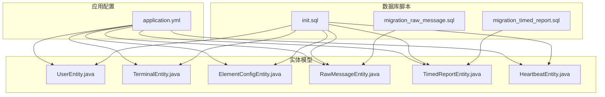
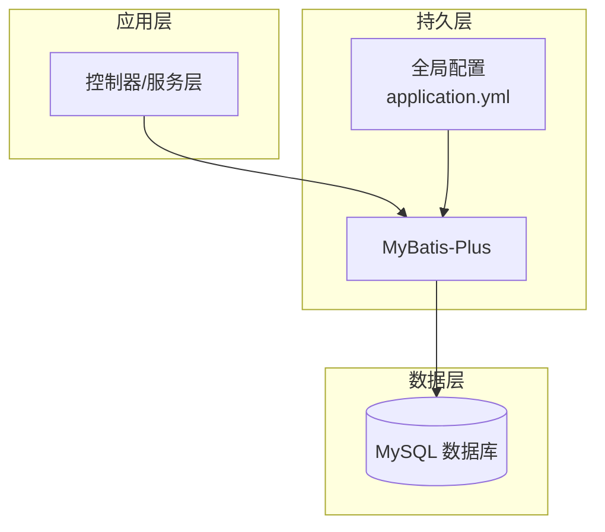
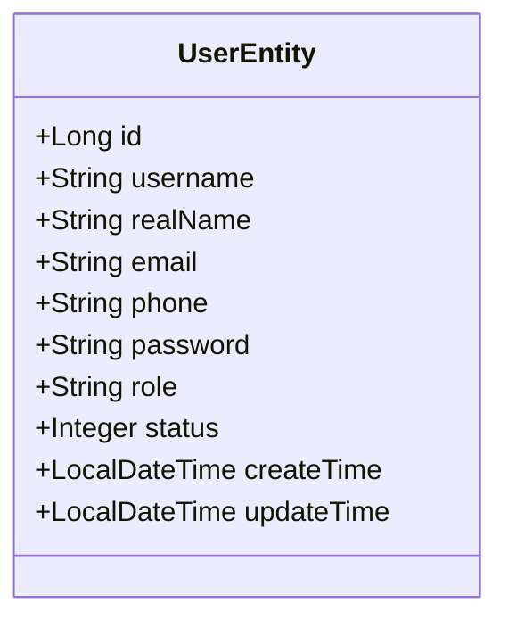
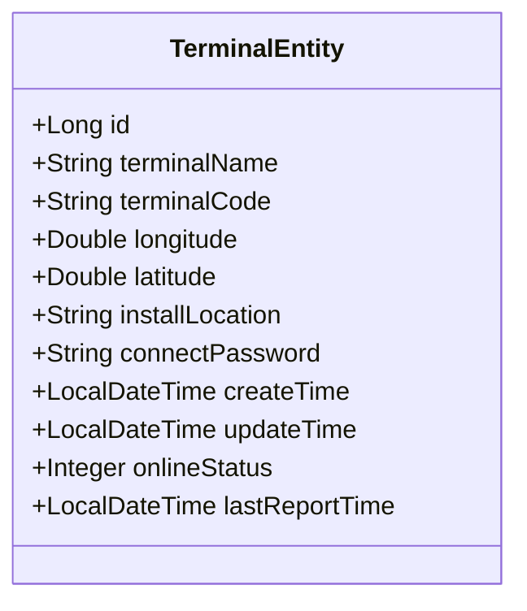
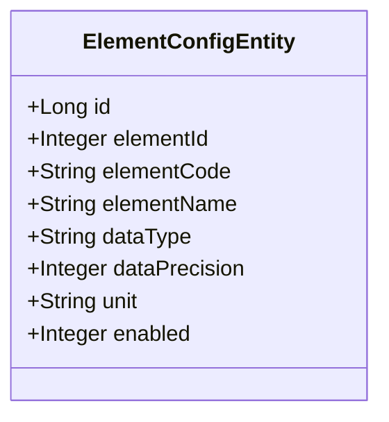
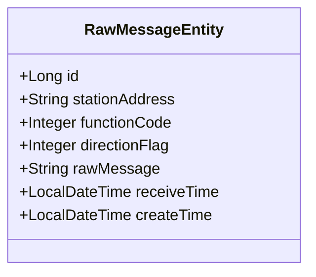
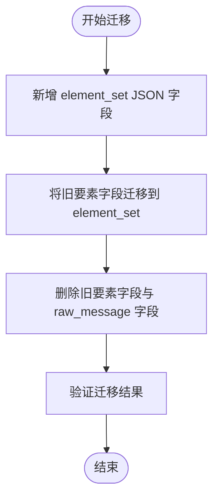
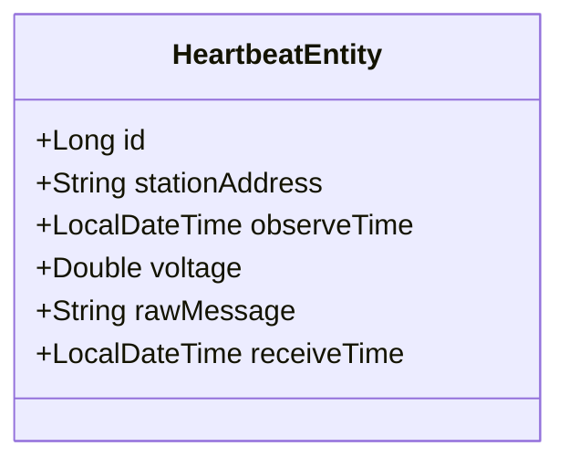
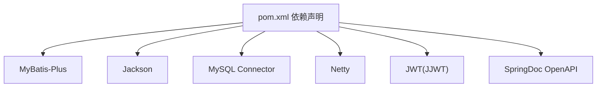

# 实体模型

<cite>
**本文引用的文件**
- [UserEntity.java](file://src/main/java/com/hydro/monitor/modules/entity/UserEntity.java)
- [TerminalEntity.java](file://src/main/java/com/hydro/monitor/modules/entity/TerminalEntity.java)
- [ElementConfigEntity.java](file://src/main/java/com/hydro/monitor/modules/entity/ElementConfigEntity.java)
- [RawMessageEntity.java](file://src/main/java/com/hydro/monitor/modules/entity/RawMessageEntity.java)
- [TimedReportEntity.java](file://src/main/java/com/hydro/monitor/modules/entity/TimedReportEntity.java)
- [HeartbeatEntity.java](file://src/main/java/com/hydro/monitor/modules/entity/HeartbeatEntity.java)
- [application.yml](file://src/main/resources/application.yml)
- [init.sql](file://src/main/resources/db/init.sql)
- [migration_raw_message.sql](file://src/main/resources/db/migration_raw_message.sql)
- [migration_timed_report.sql](file://src/main/resources/db/migration_timed_report.sql)
- [UserCreateDTO.java](file://src/main/java/com/hydro/monitor/modules/dto/UserCreateDTO.java)
- [UserUpdateDTO.java](file://src/main/java/com/hydro/monitor/modules/dto/UserUpdateDTO.java)
- [TerminalCreateDTO.java](file://src/main/java/com/hydro/monitor/modules/dto/TerminalCreateDTO.java)
- [TerminalUpdateDTO.java](file://src/main/java/com/hydro/monitor/modules/dto/TerminalUpdateDTO.java)
- [UserVO.java](file://src/main/java/com/hydro/monitor/modules/vo/UserVO.java)
- [pom.xml](file://pom.xml)
</cite>

## 目录
1. [简介](#简介)
2. [项目结构](#项目结构)
3. [核心组件](#核心组件)
4. [架构总览](#架构总览)
5. [详细组件分析](#详细组件分析)
6. [依赖分析](#依赖分析)
7. [性能考虑](#性能考虑)
8. [故障排查指南](#故障排查指南)
9. [结论](#结论)
10. [附录](#附录)

## 简介
本文件面向实体模型的综合技术文档，围绕水文监测系统中的实体类展开，系统性阐述以下主题：
- JPA注解与MyBatis-Plus注解在实体中的使用方式与映射规则
- 字段映射与关系映射策略（含一对一、一对多、多对多的建模思路）
- 实体类设计原则、属性定义规范与业务字段约束
- 实体模型与数据库表的对应关系、主键策略与索引设计
- 序列化处理、版本控制与数据迁移策略
- 实体建模最佳实践、命名规范与设计模式应用

## 项目结构
实体模型位于模块目录下，采用按功能域分层的组织方式：
- 实体类集中于 entity 包，每个实体类对应一张数据库表
- 配置集中在 application.yml，包含 MyBatis-Plus 全局配置（如主键策略、逻辑删除）
- 初始化与迁移脚本位于 resources/db，定义了表结构、索引与历史迁移路径

**图表来源**
- [application.yml:22-32](file://src/main/resources/application.yml#L22-L32)
- [init.sql:6-92](file://src/main/resources/db/init.sql#L6-L92)
- [migration_raw_message.sql:1-14](file://src/main/resources/db/migration_raw_message.sql#L1-L14)
- [migration_timed_report.sql:1-44](file://src/main/resources/db/migration_timed_report.sql#L1-L44)
- [UserEntity.java:15-69](file://src/main/java/com/hydro/monitor/modules/entity/UserEntity.java#L15-L69)
- [TerminalEntity.java:15-74](file://src/main/java/com/hydro/monitor/modules/entity/TerminalEntity.java#L15-L74)
- [ElementConfigEntity.java:15-62](file://src/main/java/com/hydro/monitor/modules/entity/ElementConfigEntity.java#L15-L62)
- [RawMessageEntity.java:15-55](file://src/main/java/com/hydro/monitor/modules/entity/RawMessageEntity.java#L15-L55)
- [TimedReportEntity.java:15-48](file://src/main/java/com/hydro/monitor/modules/entity/TimedReportEntity.java#L15-L48)
- [HeartbeatEntity.java:15-50](file://src/main/java/com/hydro/monitor/modules/entity/HeartbeatEntity.java#L15-L50)

**章节来源**
- [application.yml:1-86](file://src/main/resources/application.yml#L1-L86)
- [init.sql:1-93](file://src/main/resources/db/init.sql#L1-L93)

## 核心组件
本节概述各实体类的职责与关键字段，便于快速建立整体认知。

- 用户实体（UserEntity）
  - 表名：sys_user
  - 主键：雪花算法（全局唯一）
  - 关键字段：用户名、真实姓名、邮箱、手机号、密码（BCrypt）、角色、状态、创建/更新时间
  - 约束：用户名唯一；密码以BCrypt加密存储

- 终端实体（TerminalEntity）
  - 表名：t_terminal
  - 主键：雪花算法
  - 关键字段：终端名称、终端编号（唯一）、经纬度、安装位置、连接密码、在线状态、最后上报时间、创建/更新时间
  - 约束：终端编号唯一；在线状态与最后上报时间用于运行态监控

- 要素配置实体（ElementConfigEntity）
  - 表名：t_element_config
  - 主键：雪花算法
  - 关键字段：要素标识符（十六进制）、要素编码、要素名称、数据类型、数据精度、单位、启用状态
  - 约束：要素标识符唯一；启用状态用于开关控制

- 原始报文实体（RawMessageEntity）
  - 表名：t_raw_message
  - 主键：雪花算法
  - 关键字段：遥测站地址、功能码、上下行标识、原始报文（十六进制字符串）、接收时间、创建时间
  - 索引：按遥测站地址、接收时间、功能码建立索引

- 定时报文实体（TimedReportEntity）
  - 表名：t_timed_report
  - 主键：雪花算法
  - 关键字段：遥测站地址、观测时间、接收时间、要素集（JSON格式）
  - 索引：按遥测站地址、观测时间建立索引
  - 迁移：从独立要素字段迁移到 JSON 的 element_set 字段

- 心跳报文实体（HeartbeatEntity）
  - 表名：t_heartbeat
  - 主键：雪花算法
  - 关键字段：遥测站地址、观测时间、电源电压、原始报文（十六进制字符串）、接收时间
  - 索引：按遥测站地址、观测时间建立索引

**章节来源**
- [UserEntity.java:15-69](file://src/main/java/com/hydro/monitor/modules/entity/UserEntity.java#L15-L69)
- [TerminalEntity.java:15-74](file://src/main/java/com/hydro/monitor/modules/entity/TerminalEntity.java#L15-L74)
- [ElementConfigEntity.java:15-62](file://src/main/java/com/hydro/monitor/modules/entity/ElementConfigEntity.java#L15-L62)
- [RawMessageEntity.java:15-55](file://src/main/java/com/hydro/monitor/modules/entity/RawMessageEntity.java#L15-L55)
- [TimedReportEntity.java:15-48](file://src/main/java/com/hydro/monitor/modules/entity/TimedReportEntity.java#L15-L48)
- [HeartbeatEntity.java:15-50](file://src/main/java/com/hydro/monitor/modules/entity/HeartbeatEntity.java#L15-L50)

## 架构总览
实体模型与持久层框架（MyBatis-Plus）协同工作，遵循“注解驱动映射 + 全局配置”的设计范式。全局配置统一主键策略、命名转换与逻辑删除，实体类通过注解声明表名、主键与字段映射。

**图表来源**
- [application.yml:22-32](file://src/main/resources/application.yml#L22-L32)
- [pom.xml:49-54](file://pom.xml#L49-L54)

## 详细组件分析

### 用户实体（UserEntity）
- 注解与映射
  - 表名：@TableName("sys_user")
  - 主键：@TableId(type = IdType.ASSIGN_ID)，雪花算法
  - 时间字段：LocalDateTime，自动维护创建/更新时间
- 设计原则
  - 字段最小化：仅保留必要字段，避免冗余
  - 安全性：密码使用BCrypt加密
  - 唯一性：用户名唯一索引
- 业务约束
  - 状态枚举：1-正常，0-禁用
  - 角色：默认USER，支持ADMIN
- 序列化与版本控制
  - Jackson配置：日期格式与时区统一，避免时间戳输出
  - 版本控制：通过更新时间字段进行乐观锁或审计追踪

**图表来源**
- [UserEntity.java:15-69](file://src/main/java/com/hydro/monitor/modules/entity/UserEntity.java#L15-L69)
- [application.yml:15-21](file://src/main/resources/application.yml#L15-L21)

**章节来源**
- [UserEntity.java:15-69](file://src/main/java/com/hydro/monitor/modules/entity/UserEntity.java#L15-L69)
- [application.yml:15-21](file://src/main/resources/application.yml#L15-L21)

### 终端实体（TerminalEntity）
- 注解与映射
  - 表名：@TableName("t_terminal")
  - 主键：@TableId(type = IdType.ASSIGN_ID)
  - 地理坐标：经纬度使用Double类型，保留合理精度
- 设计原则
  - 唯一性：终端编号唯一，便于设备识别
  - 运行态：在线状态与最后上报时间用于设备健康监控
- 业务约束
  - 在线状态：1-在线，0-离线
  - 时间字段：创建/更新时间自动维护

**图表来源**
- [TerminalEntity.java:15-74](file://src/main/java/com/hydro/monitor/modules/entity/TerminalEntity.java#L15-L74)

**章节来源**
- [TerminalEntity.java:15-74](file://src/main/java/com/hydro/monitor/modules/entity/TerminalEntity.java#L15-L74)
- [init.sql:75-92](file://src/main/resources/db/init.sql#L75-L92)

### 要素配置实体（ElementConfigEntity）
- 注解与映射
  - 表名：@TableName("t_element_config")
  - 主键：@TableId(type = IdType.ASSIGN_ID)
  - 字段映射：data_precision 使用 @TableField("data_precision") 映射到数据库字段
- 设计原则
  - 可扩展性：通过要素编码与名称描述SL 651协议要素
  - 启用控制：enabled字段用于动态开关
- 业务约束
  - 唯一性：要素标识符唯一
  - 默认值：数据类型默认数值型，精度默认1

**图表来源**
- [ElementConfigEntity.java:15-62](file://src/main/java/com/hydro/monitor/modules/entity/ElementConfigEntity.java#L15-L62)

**章节来源**
- [ElementConfigEntity.java:15-62](file://src/main/java/com/hydro/monitor/modules/entity/ElementConfigEntity.java#L15-L62)
- [init.sql:49-62](file://src/main/resources/db/init.sql#L49-L62)

### 原始报文实体（RawMessageEntity）
- 注解与映射
  - 表名：@TableName("t_raw_message")
  - 主键：@TableId(type = IdType.ASSIGN_ID)
- 设计原则
  - 原始数据保留：以十六进制字符串存储原始报文，便于溯源与重放
  - 索引优化：按遥测站地址、接收时间、功能码建立索引
- 业务约束
  - 方向标识：0-上行，1-下行
  - 时间字段：接收时间与创建时间分离

**图表来源**
- [RawMessageEntity.java:15-55](file://src/main/java/com/hydro/monitor/modules/entity/RawMessageEntity.java#L15-L55)

**章节来源**
- [RawMessageEntity.java:15-55](file://src/main/java/com/hydro/monitor/modules/entity/RawMessageEntity.java#L15-L55)
- [migration_raw_message.sql:1-14](file://src/main/resources/db/migration_raw_message.sql#L1-L14)

### 定时报文实体（TimedReportEntity）
- 注解与映射
  - 表名：@TableName("t_timed_report")
  - 主键：@TableId(type = IdType.ASSIGN_ID)
  - JSON字段：element_set 使用 @TableField 并指定JdbcType为VARCHAR（JSON存储）
- 设计原则
  - 结构化存储：要素集以JSON形式存储，便于扩展新要素
  - 索引优化：按遥测站地址、观测时间建立索引
- 迁移策略
  - 从独立要素字段迁移到 element_set JSON 字段，确保历史数据可用
  - 迁移脚本完成字段新增、数据迁移与旧字段删除

**图表来源**
- [migration_timed_report.sql:6-38](file://src/main/resources/db/migration_timed_report.sql#L6-L38)

**章节来源**
- [TimedReportEntity.java:15-48](file://src/main/java/com/hydro/monitor/modules/entity/TimedReportEntity.java#L15-L48)
- [migration_timed_report.sql:1-44](file://src/main/resources/db/migration_timed_report.sql#L1-L44)
- [init.sql:19-29](file://src/main/resources/db/init.sql#L19-L29)

### 心跳报文实体（HeartbeatEntity）
- 注解与映射
  - 表名：@TableName("t_heartbeat")
  - 主键：@TableId(type = IdType.ASSIGN_ID)
- 设计原则
  - 轻量存储：仅保留关键字段（电压、原始报文、接收时间）
  - 索引优化：按遥测站地址、观测时间建立索引
- 业务约束
  - 电源电压：数值型，保留合理精度

**图表来源**
- [HeartbeatEntity.java:15-50](file://src/main/java/com/hydro/monitor/modules/entity/HeartbeatEntity.java#L15-L50)

**章节来源**
- [HeartbeatEntity.java:15-50](file://src/main/java/com/hydro/monitor/modules/entity/HeartbeatEntity.java#L15-L50)
- [init.sql:6-17](file://src/main/resources/db/init.sql#L6-L17)

## 依赖分析
- 持久层框架
  - MyBatis-Plus：提供注解驱动的ORM能力与全局配置（主键策略、命名转换、逻辑删除）
- 数据库
  - MySQL：提供表结构、索引与约束定义
- 序列化与格式化
  - Jackson：统一日期格式与时区，避免时间戳输出
- 依赖注入与构建
  - Spring Boot、Lombok、Netty、JWT、OpenAPI 等

**图表来源**
- [pom.xml:30-153](file://pom.xml#L30-L153)

**章节来源**
- [pom.xml:1-179](file://pom.xml#L1-L179)

## 性能考虑
- 主键策略
  - 全局雪花算法（ASSIGN_ID）：减少跨节点冲突，提升写入吞吐
- 命名转换
  - 下划线转驼峰（map-underscore-to-camel-case）：降低SQL书写复杂度
- 索引设计
  - 按查询热点字段建立索引（遥测站地址、观测/接收时间、启用状态等）
- JSON字段
  - element_set 使用JSON存储，便于扩展但需注意查询与排序成本
- 逻辑删除
  - 全局配置逻辑删除字段与值，避免物理删除带来的数据丢失风险

**章节来源**
- [application.yml:22-32](file://src/main/resources/application.yml#L22-L32)
- [init.sql:14-16](file://src/main/resources/db/init.sql#L14-L16)
- [init.sql:26-28](file://src/main/resources/db/init.sql#L26-L28)
- [init.sql:59-61](file://src/main/resources/db/init.sql#L59-L61)
- [init.sql:89-91](file://src/main/resources/db/init.sql#L89-L91)

## 故障排查指南
- 主键冲突
  - 症状：插入失败，提示唯一约束冲突
  - 排查：确认主键策略与唯一键（如终端编号、用户名、要素标识符）是否重复
- JSON字段解析异常
  - 症状：读取 element_set 失败或格式错误
  - 排查：检查字段类型与JdbcType配置，确认存储为合法JSON
- 索引失效
  - 症状：查询慢、全表扫描
  - 排查：确认查询条件是否命中索引（遥测站地址、观测/接收时间）
- 时间字段显示异常
  - 症状：时间以时间戳显示或时区不正确
  - 排查：检查Jackson日期格式与时区配置

**章节来源**
- [application.yml:15-21](file://src/main/resources/application.yml#L15-L21)
- [TimedReportEntity.java:45-46](file://src/main/java/com/hydro/monitor/modules/entity/TimedReportEntity.java#L45-L46)

## 结论
本实体模型以MyBatis-Plus注解为核心，结合全局配置实现了高内聚、低耦合的数据访问层。通过雪花算法主键、下划线转驼峰映射、索引优化与JSON结构化存储，兼顾了性能与可扩展性。配合初始化与迁移脚本，确保了历史数据的平滑演进与一致性。

## 附录

### 字段映射与注解一览
- 表名映射：@TableName
- 主键映射：@TableId(type = IdType.ASSIGN_ID)
- 字段别名映射：@TableField
- 时间字段：LocalDateTime（自动维护）
- JSON字段：@TableField + JdbcType.VARCHAR

**章节来源**
- [UserEntity.java:15-69](file://src/main/java/com/hydro/monitor/modules/entity/UserEntity.java#L15-L69)
- [TerminalEntity.java:15-74](file://src/main/java/com/hydro/monitor/modules/entity/TerminalEntity.java#L15-L74)
- [ElementConfigEntity.java:15-62](file://src/main/java/com/hydro/monitor/modules/entity/ElementConfigEntity.java#L15-L62)
- [RawMessageEntity.java:15-55](file://src/main/java/com/hydro/monitor/modules/entity/RawMessageEntity.java#L15-L55)
- [TimedReportEntity.java:15-48](file://src/main/java/com/hydro/monitor/modules/entity/TimedReportEntity.java#L15-L48)
- [HeartbeatEntity.java:15-50](file://src/main/java/com/hydro/monitor/modules/entity/HeartbeatEntity.java#L15-L50)

### 数据库表与实体对应关系
- sys_user ↔ UserEntity
- t_terminal ↔ TerminalEntity
- t_element_config ↔ ElementConfigEntity
- t_raw_message ↔ RawMessageEntity
- t_timed_report ↔ TimedReportEntity
- t_heartbeat ↔ HeartbeatEntity

**章节来源**
- [init.sql:6-92](file://src/main/resources/db/init.sql#L6-L92)

### 序列化处理与版本控制
- 序列化处理：Jackson统一日期格式与时区，避免时间戳输出
- 版本控制：通过更新时间字段与逻辑删除字段实现审计与软删除

**章节来源**
- [application.yml:15-21](file://src/main/resources/application.yml#L15-L21)
- [application.yml:27-32](file://src/main/resources/application.yml#L27-L32)

### 数据迁移策略
- 原始报文表：新增索引，保持兼容
- 定时报表：从独立要素字段迁移到 element_set JSON 字段，脚本完成新增、迁移与删除

**章节来源**
- [migration_raw_message.sql:1-14](file://src/main/resources/db/migration_raw_message.sql#L1-L14)
- [migration_timed_report.sql:1-44](file://src/main/resources/db/migration_timed_report.sql#L1-L44)

### 验证规则与DTO对照
- 用户创建DTO：用户名、真实姓名、邮箱、手机号、密码、角色、状态
- 用户更新DTO：用户ID、真实姓名、邮箱、手机号、密码（可选）、角色、状态
- 终端创建DTO：终端名称、终端编号、经纬度、安装位置、连接密码
- 终端更新DTO：ID、终端名称、终端编号、经纬度、安装位置、连接密码
- 用户视图对象VO：用户ID、用户名、真实姓名、邮箱、手机号、角色、状态、创建/更新时间

**章节来源**
- [UserCreateDTO.java:12-53](file://src/main/java/com/hydro/monitor/modules/dto/UserCreateDTO.java#L12-L53)
- [UserUpdateDTO.java:12-50](file://src/main/java/com/hydro/monitor/modules/dto/UserUpdateDTO.java#L12-L50)
- [TerminalCreateDTO.java:11-43](file://src/main/java/com/hydro/monitor/modules/dto/TerminalCreateDTO.java#L11-L43)
- [TerminalUpdateDTO.java:11-47](file://src/main/java/com/hydro/monitor/modules/dto/TerminalUpdateDTO.java#L11-L47)
- [UserVO.java:10-55](file://src/main/java/com/hydro/monitor/modules/vo/UserVO.java#L10-L55)