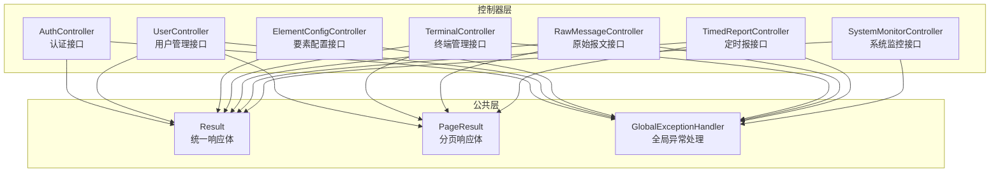
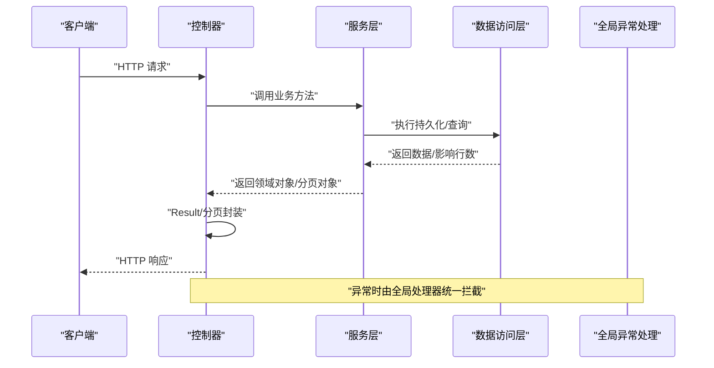
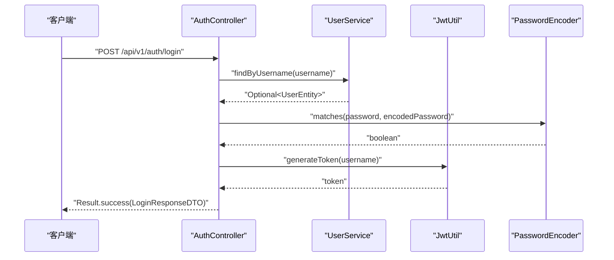
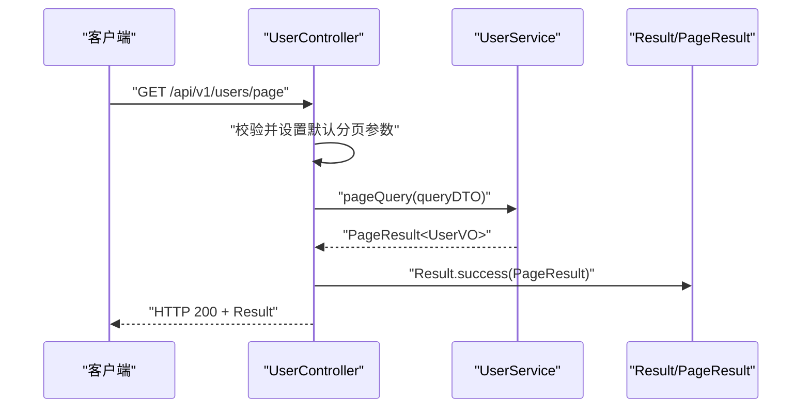
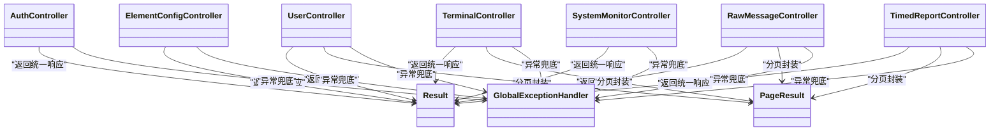

# 控制器层

<cite>
**本文引用的文件**
- [AuthController.java](file://src/main/java/com/hydro/monitor/modules/controller/AuthController.java)
- [UserController.java](file://src/main/java/com/hydro/monitor/modules/controller/UserController.java)
- [ElementConfigController.java](file://src/main/java/com/hydro/monitor/modules/controller/ElementConfigController.java)
- [TerminalController.java](file://src/main/java/com/hydro/monitor/modules/controller/TerminalController.java)
- [RawMessageController.java](file://src/main/java/com/hydro/monitor/modules/controller/RawMessageController.java)
- [TimedReportController.java](file://src/main/java/com/hydro/monitor/modules/controller/TimedReportController.java)
- [SystemMonitorController.java](file://src/main/java/com/hydro/monitor/modules/controller/SystemMonitorController.java)
- [GlobalExceptionHandler.java](file://src/main/java/com/hydro/monitor/common/GlobalExceptionHandler.java)
- [Result.java](file://src/main/java/com/hydro/monitor/common/Result.java)
- [PageResult.java](file://src/main/java/com/hydro/monitor/common/PageResult.java)
- [LoginRequestDTO.java](file://src/main/java/com/hydro/monitor/modules/dto/LoginRequestDTO.java)
- [UserCreateDTO.java](file://src/main/java/com/hydro/monitor/modules/dto/UserCreateDTO.java)
- [UserQueryDTO.java](file://src/main/java/com/hydro/monitor/modules/dto/UserQueryDTO.java)
- [UserVO.java](file://src/main/java/com/hydro/monitor/modules/vo/UserVO.java)
- [UserEntity.java](file://src/main/java/com/hydro/monitor/modules/entity/UserEntity.java)
</cite>

## 目录
1. [引言](#引言)
2. [项目结构](#项目结构)
3. [核心组件](#核心组件)
4. [架构总览](#架构总览)
5. [详细组件分析](#详细组件分析)
6. [依赖分析](#依赖分析)
7. [性能考虑](#性能考虑)
8. [故障排查指南](#故障排查指南)
9. [结论](#结论)
10. [附录](#附录)

## 引言
本文件聚焦于控制器层（Controller Layer）的技术文档，系统性阐述RESTful API设计原则、HTTP方法映射与URL路由规则；详解各控制器的职责边界、请求参数处理机制与响应数据封装策略；说明控制器与服务层的交互模式、异常处理流程与全局异常管理；给出具体API接口示例、参数校验规则与错误码定义；并总结性能优化、并发处理与安全防护的最佳实践与调试技巧。

## 项目结构
控制器层位于模块路径下，采用按功能域划分的目录组织方式，每个领域控制器负责一组相关的资源操作，并通过统一的响应包装类对外输出结果。公共层提供统一响应体、分页结果与全局异常处理。

图表来源
- [AuthController.java:1-68](file://src/main/java/com/hydro/monitor/modules/controller/AuthController.java#L1-L68)
- [UserController.java:1-142](file://src/main/java/com/hydro/monitor/modules/controller/UserController.java#L1-L142)
- [ElementConfigController.java:1-97](file://src/main/java/com/hydro/monitor/modules/controller/ElementConfigController.java#L1-L97)
- [TerminalController.java:1-138](file://src/main/java/com/hydro/monitor/modules/controller/TerminalController.java#L1-L138)
- [RawMessageController.java:1-81](file://src/main/java/com/hydro/monitor/modules/controller/RawMessageController.java#L1-L81)
- [TimedReportController.java:1-111](file://src/main/java/com/hydro/monitor/modules/controller/TimedReportController.java#L1-L111)
- [SystemMonitorController.java:1-84](file://src/main/java/com/hydro/monitor/modules/controller/SystemMonitorController.java#L1-L84)
- [Result.java:1-79](file://src/main/java/com/hydro/monitor/common/Result.java#L1-L79)
- [PageResult.java:1-58](file://src/main/java/com/hydro/monitor/common/PageResult.java#L1-L58)
- [GlobalExceptionHandler.java:1-58](file://src/main/java/com/hydro/monitor/common/GlobalExceptionHandler.java#L1-L58)

章节来源
- [AuthController.java:1-68](file://src/main/java/com/hydro/monitor/modules/controller/AuthController.java#L1-L68)
- [UserController.java:1-142](file://src/main/java/com/hydro/monitor/modules/controller/UserController.java#L1-L142)
- [ElementConfigController.java:1-97](file://src/main/java/com/hydro/monitor/modules/controller/ElementConfigController.java#L1-L97)
- [TerminalController.java:1-138](file://src/main/java/com/hydro/monitor/modules/controller/TerminalController.java#L1-L138)
- [RawMessageController.java:1-81](file://src/main/java/com/hydro/monitor/modules/controller/RawMessageController.java#L1-L81)
- [TimedReportController.java:1-111](file://src/main/java/com/hydro/monitor/modules/controller/TimedReportController.java#L1-L111)
- [SystemMonitorController.java:1-84](file://src/main/java/com/hydro/monitor/modules/controller/SystemMonitorController.java#L1-L84)
- [Result.java:1-79](file://src/main/java/com/hydro/monitor/common/Result.java#L1-L79)
- [PageResult.java:1-58](file://src/main/java/com/hydro/monitor/common/PageResult.java#L1-L58)
- [GlobalExceptionHandler.java:1-58](file://src/main/java/com/hydro/monitor/common/GlobalExceptionHandler.java#L1-L58)

## 核心组件
- 统一响应体 Result：提供成功/失败两类静态工厂方法，封装标准响应字段（状态码、消息、数据），并支持泛型承载任意数据类型。
- 分页响应体 PageResult：基于MyBatis-Plus的IPage构建，封装当前页、每页大小、总记录数、总页数与记录列表。
- 全局异常处理 GlobalExceptionHandler：集中捕获运行时异常、权限拒绝与通用异常，统一返回Result格式的错误响应，确保接口契约一致。

章节来源
- [Result.java:1-79](file://src/main/java/com/hydro/monitor/common/Result.java#L1-L79)
- [PageResult.java:1-58](file://src/main/java/com/hydro/monitor/common/PageResult.java#L1-L58)
- [GlobalExceptionHandler.java:1-58](file://src/main/java/com/hydro/monitor/common/GlobalExceptionHandler.java#L1-L58)

## 架构总览
控制器层遵循“薄控制器、厚服务”的分层思想：控制器仅负责参数绑定、简单校验与调用服务层，复杂业务逻辑在服务层实现；所有响应均通过Result/分页封装，异常由全局处理器兜底。

图表来源
- [AuthController.java:1-68](file://src/main/java/com/hydro/monitor/modules/controller/AuthController.java#L1-L68)
- [UserController.java:1-142](file://src/main/java/com/hydro/monitor/modules/controller/UserController.java#L1-L142)
- [GlobalExceptionHandler.java:1-58](file://src/main/java/com/hydro/monitor/common/GlobalExceptionHandler.java#L1-L58)

## 详细组件分析

### 认证控制器 AuthController
- 路由与方法
  - POST /api/v1/auth/login：登录获取JWT令牌
- 参数与校验
  - 请求体：LoginRequestDTO（用户名、密码）
- 处理流程
  - 根据用户名查询用户；若不存在或密码不匹配，返回错误响应
  - 校验通过后生成JWT令牌与过期时间，封装为登录响应DTO
- 响应封装
  - 成功：Result.success(LoginResponseDTO)
  - 失败：Result.error(错误信息)
- 安全要点
  - 密码使用PasswordEncoder进行匹配
  - 返回敏感信息最小化（仅令牌与过期时间）

图表来源
- [AuthController.java:1-68](file://src/main/java/com/hydro/monitor/modules/controller/AuthController.java#L1-L68)
- [LoginRequestDTO.java:1-20](file://src/main/java/com/hydro/monitor/modules/dto/LoginRequestDTO.java#L1-L20)

章节来源
- [AuthController.java:1-68](file://src/main/java/com/hydro/monitor/modules/controller/AuthController.java#L1-L68)
- [LoginRequestDTO.java:1-20](file://src/main/java/com/hydro/monitor/modules/dto/LoginRequestDTO.java#L1-L20)

### 用户管理控制器 UserController
- 路由与方法
  - POST /api/v1/users：创建用户
  - PUT /api/v1/users：更新用户
  - DELETE /api/v1/users/{id}：删除用户
  - GET /api/v1/users/{id}：按ID查询用户详情
  - GET /api/v1/users/username/{username}：按用户名查询用户
  - GET /api/v1/users/page：分页查询用户
- 参数与校验
  - 创建/更新：UserCreateDTO/UserUpdateDTO（含NotBlank、Email、手机号正则等）
  - 分页：UserQueryDTO（默认页码=1，每页大小≥1）
- 处理流程
  - 调用UserService完成增删改查；查询类接口对“不存在”场景返回错误封装
- 响应封装
  - 成功：Result.success(实体/VO/分页)
  - 失败：Result.error(异常消息)

图表来源
- [UserController.java:1-142](file://src/main/java/com/hydro/monitor/modules/controller/UserController.java#L1-L142)
- [UserQueryDTO.java:1-54](file://src/main/java/com/hydro/monitor/modules/dto/UserQueryDTO.java#L1-L54)

章节来源
- [UserController.java:1-142](file://src/main/java/com/hydro/monitor/modules/controller/UserController.java#L1-L142)
- [UserCreateDTO.java:1-55](file://src/main/java/com/hydro/monitor/modules/dto/UserCreateDTO.java#L1-L55)
- [UserQueryDTO.java:1-54](file://src/main/java/com/hydro/monitor/modules/dto/UserQueryDTO.java#L1-L54)
- [UserVO.java:1-57](file://src/main/java/com/hydro/monitor/modules/vo/UserVO.java#L1-L57)
- [UserEntity.java:1-70](file://src/main/java/com/hydro/monitor/modules/entity/UserEntity.java#L1-L70)

### 要素配置控制器 ElementConfigController
- 路由与方法
  - POST /api/v1/element-configs/page：分页查询
  - GET /api/v1/element-configs/{id}：按ID查询
  - POST /api/v1/element-configs：新增
  - PUT /api/v1/element-configs：更新
  - DELETE /api/v1/element-configs/{id}：删除
- 参数与校验
  - 新增/更新：对应Create/Update DTO（由服务层约束）
- 响应封装
  - 成功：Result.success(实体/分页)
  - 失败：Result.error(异常消息)

章节来源
- [ElementConfigController.java:1-97](file://src/main/java/com/hydro/monitor/modules/controller/ElementConfigController.java#L1-L97)

### 终端管理控制器 TerminalController
- 路由与方法
  - POST /api/v1/terminals：创建
  - PUT /api/v1/terminals：更新
  - DELETE /api/v1/terminals/{id}：删除
  - GET /api/v1/terminals/{id}：按ID查询
  - GET /api/v1/terminals/page：分页查询
  - GET /api/v1/terminals/list：获取全部终端（不分页）
- 参数与校验
  - 创建/更新：对应Create/Update DTO
  - 分页：TerminalQueryDTO（由服务层约束）
- 响应封装
  - 成功：Result.success(实体/列表/分页)
  - 失败：Result.error(异常消息)

章节来源
- [TerminalController.java:1-138](file://src/main/java/com/hydro/monitor/modules/controller/TerminalController.java#L1-L138)

### 原始报文控制器 RawMessageController
- 路由与方法
  - POST /api/v1/raw-messages/page：分页查询
  - GET /api/v1/raw-messages/{id}：按ID查询详情
  - GET /api/v1/raw-messages/{id}/parse：解析报文
- 参数与校验
  - 分页：RawMessageQueryDTO（由服务层约束）
- 响应封装
  - 成功：Result.success(VO/分页/解析结果)
  - 失败：Result.error(异常消息)

章节来源
- [RawMessageController.java:1-81](file://src/main/java/com/hydro/monitor/modules/controller/RawMessageController.java#L1-L81)

### 定时报控制器 TimedReportController
- 路由与方法
  - POST /api/v1/timed-reports/page：分页查询（支持时间区间与站点过滤）
  - GET /api/v1/timed-reports/latest：分页查询所有站点最新数据
  - GET /api/v1/timed-reports/station/{stationAddress}：按站点分页查询
  - GET /api/v1/timed-reports/station/{stationAddress}/latest：按站点查询最新数据
- 参数与校验
  - 分页：pageNum/pageSize（默认值处理）
  - 路径参数：stationAddress
- 响应封装
  - 成功：Result.success(VO/分页)
  - 失败：Result.error(异常消息)

章节来源
- [TimedReportController.java:1-111](file://src/main/java/com/hydro/monitor/modules/controller/TimedReportController.java#L1-L111)

### 系统监控控制器 SystemMonitorController
- 路由与方法
  - GET /api/v1/system/status：获取系统运行状态（内存、CPU、线程、数据库连接等）
- 参数与校验
  - 无
- 响应封装
  - 成功：Result.success(SystemStatusDTO)
  - 失败：Result.error(异常消息)

章节来源
- [SystemMonitorController.java:1-84](file://src/main/java/com/hydro/monitor/modules/controller/SystemMonitorController.java#L1-L84)

## 依赖分析
- 控制器到服务层：各控制器通过构造注入服务接口，调用其业务方法，保持控制器无业务逻辑。
- 控制器到公共层：统一使用Result/PageResult封装响应；异常统一交由GlobalExceptionHandler处理。
- DTO/VO/Entity：控制器仅面向DTO/VO进行输入输出，实体类用于服务层与数据访问层之间传递。

图表来源
- [AuthController.java:1-68](file://src/main/java/com/hydro/monitor/modules/controller/AuthController.java#L1-L68)
- [UserController.java:1-142](file://src/main/java/com/hydro/monitor/modules/controller/UserController.java#L1-L142)
- [ElementConfigController.java:1-97](file://src/main/java/com/hydro/monitor/modules/controller/ElementConfigController.java#L1-L97)
- [TerminalController.java:1-138](file://src/main/java/com/hydro/monitor/modules/controller/TerminalController.java#L1-L138)
- [RawMessageController.java:1-81](file://src/main/java/com/hydro/monitor/modules/controller/RawMessageController.java#L1-L81)
- [TimedReportController.java:1-111](file://src/main/java/com/hydro/monitor/modules/controller/TimedReportController.java#L1-L111)
- [SystemMonitorController.java:1-84](file://src/main/java/com/hydro/monitor/modules/controller/SystemMonitorController.java#L1-L84)
- [Result.java:1-79](file://src/main/java/com/hydro/monitor/common/Result.java#L1-L79)
- [PageResult.java:1-58](file://src/main/java/com/hydro/monitor/common/PageResult.java#L1-L58)
- [GlobalExceptionHandler.java:1-58](file://src/main/java/com/hydro/monitor/common/GlobalExceptionHandler.java#L1-L58)

## 性能考虑
- 分页查询
  - 使用PageResult与IPage配合，避免一次性加载大量数据；合理设置默认页大小与最大限制。
- 缓存与降级
  - 对热点查询（如系统状态）可引入缓存；对下游依赖失败进行快速失败与降级。
- 并发与限流
  - 在网关或控制器层增加限流策略，防止突发流量击穿服务；对写操作使用幂等设计。
- 日志与追踪
  - 对关键链路埋点日志，结合Trace ID定位性能瓶颈；避免在高频路径打印大对象。
- 序列化开销
  - 控制响应体字段数量，避免过度封装导致序列化成本上升。

## 故障排查指南
- 统一错误响应
  - 所有异常最终由GlobalExceptionHandler转换为Result.error，便于前端统一处理。
- 常见错误码
  - 403：权限拒绝（如鉴权失败）
  - 500：系统内部错误（运行时异常、未知异常）
- 排查步骤
  - 查看控制器日志与服务层日志，确认入参与业务分支
  - 检查DTO校验是否触发（如必填/格式不正确）
  - 关注全局异常处理器日志，定位异常根因
- 安全相关
  - 登录失败与权限拒绝会记录告警级别日志，便于审计与风控

章节来源
- [GlobalExceptionHandler.java:1-58](file://src/main/java/com/hydro/monitor/common/GlobalExceptionHandler.java#L1-L58)

## 结论
控制器层以清晰的REST风格与统一的响应封装为核心，通过严格的参数校验与全局异常处理保障接口稳定性；与服务层解耦使业务逻辑内聚，便于扩展与维护。建议在生产环境中结合限流、缓存与可观测性工具进一步提升性能与可靠性。

## 附录

### API 接口清单与参数校验规则

- 认证管理
  - POST /api/v1/auth/login
    - 请求体：LoginRequestDTO（用户名、密码）
    - 成功：Result.success(LoginResponseDTO)
    - 失败：Result.error(用户名或密码错误)
  - 章节来源
    - [AuthController.java:1-68](file://src/main/java/com/hydro/monitor/modules/controller/AuthController.java#L1-L68)
    - [LoginRequestDTO.java:1-20](file://src/main/java/com/hydro/monitor/modules/dto/LoginRequestDTO.java#L1-L20)

- 用户管理
  - POST /api/v1/users
    - 请求体：UserCreateDTO（用户名、真实姓名、邮箱、手机号、密码、角色、状态）
    - 成功：Result.success(UserEntity)
    - 失败：Result.error(异常消息)
  - PUT /api/v1/users
    - 请求体：UserUpdateDTO（同上字段）
    - 成功：Result.success(UserEntity)
    - 失败：Result.error(异常消息)
  - DELETE /api/v1/users/{id}
    - 路径参数：id(Long)
    - 成功：Result.success()
    - 失败：Result.error(异常消息)
  - GET /api/v1/users/{id}
    - 路径参数：id(Long)
    - 成功：Result.success(UserEntity)
    - 失败：Result.error(用户不存在)
  - GET /api/v1/users/username/{username}
    - 路径参数：username(String)
    - 成功：Result.success(UserVO)
    - 失败：Result.error(用户不存在)
  - GET /api/v1/users/page
    - 查询参数：pageNum、pageSize（默认pageNum=1，pageSize≥1）
    - 成功：Result.success(PageResult<UserVO>)
    - 失败：Result.error(异常消息)
  - 章节来源
    - [UserController.java:1-142](file://src/main/java/com/hydro/monitor/modules/controller/UserController.java#L1-L142)
    - [UserCreateDTO.java:1-55](file://src/main/java/com/hydro/monitor/modules/dto/UserCreateDTO.java#L1-L55)
    - [UserQueryDTO.java:1-54](file://src/main/java/com/hydro/monitor/modules/dto/UserQueryDTO.java#L1-L54)
    - [UserVO.java:1-57](file://src/main/java/com/hydro/monitor/modules/vo/UserVO.java#L1-L57)
    - [UserEntity.java:1-70](file://src/main/java/com/hydro/monitor/modules/entity/UserEntity.java#L1-L70)

- 要素配置管理
  - POST /api/v1/element-configs/page
    - 请求体：ElementConfigQueryDTO（由服务层约束）
    - 成功：Result.success(PageResult<ElementConfigEntity>)
    - 失败：Result.error(异常消息)
  - GET /api/v1/element-configs/{id}
    - 路径参数：id(Long)
    - 成功：Result.success(ElementConfigEntity)
    - 失败：Result.error(异常消息)
  - POST /api/v1/element-configs
    - 请求体：ElementConfigCreateDTO（由服务层约束）
    - 成功：Result.success(ElementConfigEntity)
    - 失败：Result.error(异常消息)
  - PUT /api/v1/element-configs
    - 请求体：ElementConfigUpdateDTO（由服务层约束）
    - 成功：Result.success(ElementConfigEntity)
    - 失败：Result.error(异常消息)
  - DELETE /api/v1/element-configs/{id}
    - 路径参数：id(Long)
    - 成功：Result.success()
    - 失败：Result.error(异常消息)
  - 章节来源
    - [ElementConfigController.java:1-97](file://src/main/java/com/hydro/monitor/modules/controller/ElementConfigController.java#L1-L97)

- 终端管理
  - POST /api/v1/terminals
    - 请求体：TerminalCreateDTO（由服务层约束）
    - 成功：Result.success(TerminalEntity)
    - 失败：Result.error(异常消息)
  - PUT /api/v1/terminals
    - 请求体：TerminalUpdateDTO（由服务层约束）
    - 成功：Result.success(TerminalEntity)
    - 失败：Result.error(异常消息)
  - DELETE /api/v1/terminals/{id}
    - 路径参数：id(Long)
    - 成功：Result.success()
    - 失败：Result.error(异常消息)
  - GET /api/v1/terminals/{id}
    - 路径参数：id(Long)
    - 成功：Result.success(TerminalEntity)
    - 失败：Result.error(终端不存在)
  - GET /api/v1/terminals/page
    - 查询参数：pageNum、pageSize（默认pageNum=1，pageSize≥1）
    - 成功：Result.success(PageResult<TerminalEntity>)
    - 失败：Result.error(异常消息)
  - GET /api/v1/terminals/list
    - 成功：Result.success(List<TerminalEntity>)
    - 失败：Result.error(异常消息)
  - 章节来源
    - [TerminalController.java:1-138](file://src/main/java/com/hydro/monitor/modules/controller/TerminalController.java#L1-L138)

- 原始报文管理
  - POST /api/v1/raw-messages/page
    - 请求体：RawMessageQueryDTO（由服务层约束）
    - 成功：Result.success(PageResult<RawMessageVO>)
    - 失败：Result.error(异常消息)
  - GET /api/v1/raw-messages/{id}
    - 路径参数：id(Long)
    - 成功：Result.success(RawMessageVO)
    - 失败：Result.error(异常消息)
  - GET /api/v1/raw-messages/{id}/parse
    - 路径参数：id(Long)
    - 成功：Result.success(String)
    - 失败：Result.error(异常消息)
  - 章节来源
    - [RawMessageController.java:1-81](file://src/main/java/com/hydro/monitor/modules/controller/RawMessageController.java#L1-L81)

- 定时报管理
  - POST /api/v1/timed-reports/page
    - 请求体：TimedReportQueryDTO（由服务层约束）
    - 成功：Result.success(PageResult<TimedReportVO>)
    - 失败：Result.error(异常消息)
  - GET /api/v1/timed-reports/latest
    - 查询参数：pageNum、pageSize（默认值）
    - 成功：Result.success(PageResult<TimedReportVO>)
    - 失败：Result.error(异常消息)
  - GET /api/v1/timed-reports/station/{stationAddress}
    - 路径参数：stationAddress(String)
    - 查询参数：pageNum、pageSize（默认值）
    - 成功：Result.success(PageResult<TimedReportVO>)
    - 失败：Result.error(异常消息)
  - GET /api/v1/timed-reports/station/{stationAddress}/latest
    - 路径参数：stationAddress(String)
    - 成功：Result.success(TimedReportVO)
    - 失败：Result.error(未找到...)
  - 章节来源
    - [TimedReportController.java:1-111](file://src/main/java/com/hydro/monitor/modules/controller/TimedReportController.java#L1-L111)

- 系统监控
  - GET /api/v1/system/status
    - 成功：Result.success(SystemStatusDTO)
    - 失败：Result.error(异常消息)
  - 章节来源
    - [SystemMonitorController.java:1-84](file://src/main/java/com/hydro/monitor/modules/controller/SystemMonitorController.java#L1-L84)

### 参数校验规则摘要
- 用户创建/更新
  - 用户名、真实姓名、密码、角色：非空
  - 邮箱：符合Email格式
  - 手机号：符合中国大陆手机号格式
- 分页参数
  - pageNum：默认1，非法时回退为1
  - pageSize：默认10，非法时回退为10
- 登录
  - 用户名、密码：非空

章节来源
- [UserCreateDTO.java:1-55](file://src/main/java/com/hydro/monitor/modules/dto/UserCreateDTO.java#L1-L55)
- [UserQueryDTO.java:1-54](file://src/main/java/com/hydro/monitor/modules/dto/UserQueryDTO.java#L1-L54)
- [LoginRequestDTO.java:1-20](file://src/main/java/com/hydro/monitor/modules/dto/LoginRequestDTO.java#L1-L20)

### 错误码定义
- 403：无权访问该资源（权限拒绝）
- 500：系统内部错误（运行时异常、通用异常）
- 业务错误：Result.error(具体错误消息)，由控制器或服务层抛出

章节来源
- [GlobalExceptionHandler.java:1-58](file://src/main/java/com/hydro/monitor/common/GlobalExceptionHandler.java#L1-L58)
- [Result.java:1-79](file://src/main/java/com/hydro/monitor/common/Result.java#L1-L79)

### 开发最佳实践
- 控制器只做“薄薄一层”：参数绑定、简单校验、调用服务、封装响应
- DTO/VO分离：控制器面向DTO/VO，避免直接暴露实体类
- 统一异常处理：不要在控制器中重复try/catch，交由全局处理器
- 明确HTTP语义：GET用于查询、POST用于创建、PUT用于更新、DELETE用于删除
- 文档即代码：使用OpenAPI注解完善接口文档，便于联调与测试
- 安全优先：登录与权限控制必须严格，日志记录敏感行为但不泄露敏感数据