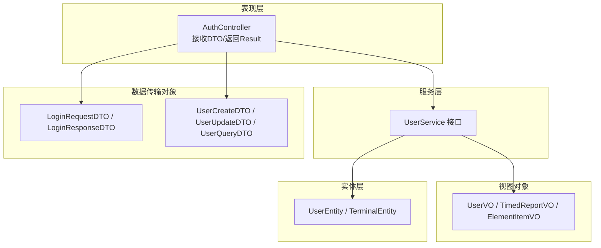
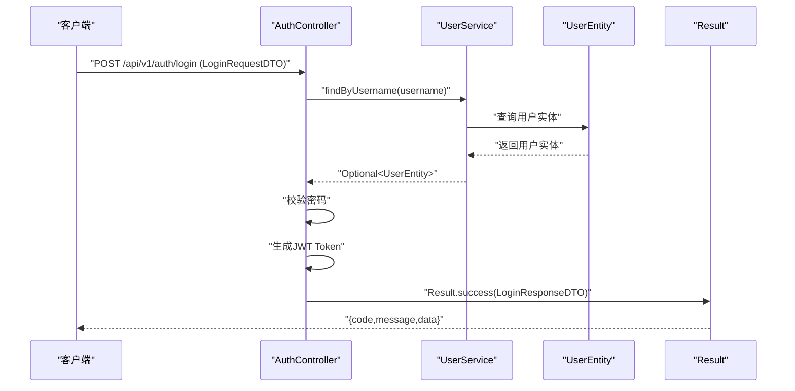
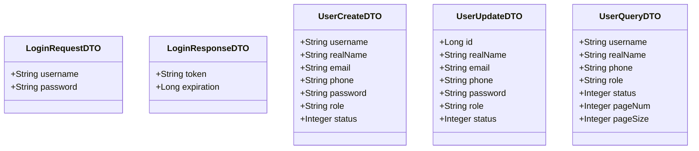
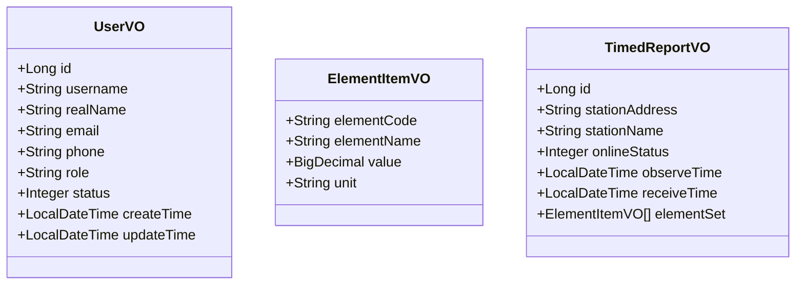
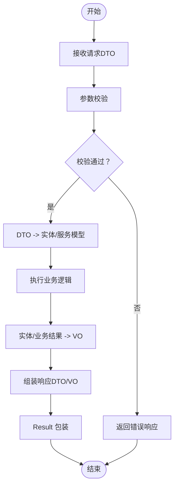
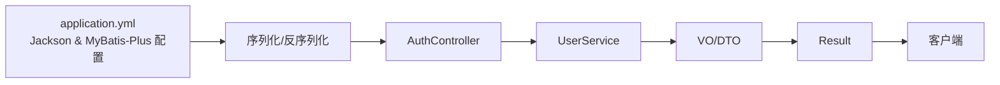
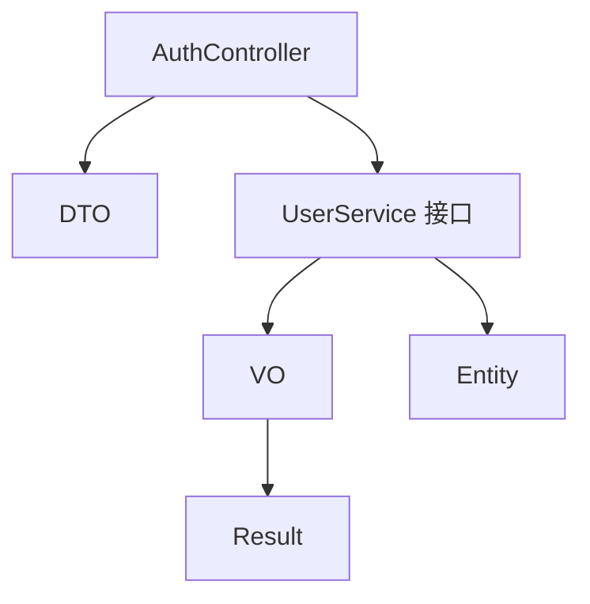

# 数据传输对象

<cite>
**本文引用的文件**
- [LoginRequestDTO.java](file://src/main/java/com/hydro/monitor/modules/dto/LoginRequestDTO.java)
- [LoginResponseDTO.java](file://src/main/java/com/hydro/monitor/modules/dto/LoginResponseDTO.java)
- [UserCreateDTO.java](file://src/main/java/com/hydro/monitor/modules/dto/UserCreateDTO.java)
- [UserUpdateDTO.java](file://src/main/java/com/hydro/monitor/modules/dto/UserUpdateDTO.java)
- [UserQueryDTO.java](file://src/main/java/com/hydro/monitor/modules/dto/UserQueryDTO.java)
- [UserVO.java](file://src/main/java/com/hydro/monitor/modules/vo/UserVO.java)
- [ElementItemVO.java](file://src/main/java/com/hydro/monitor/modules/vo/ElementItemVO.java)
- [TimedReportVO.java](file://src/main/java/com/hydro/monitor/modules/vo/TimedReportVO.java)
- [UserEntity.java](file://src/main/java/com/hydro/monitor/modules/entity/UserEntity.java)
- [TerminalEntity.java](file://src/main/java/com/hydro/monitor/modules/entity/TerminalEntity.java)
- [AuthController.java](file://src/main/java/com/hydro/monitor/modules/controller/AuthController.java)
- [UserService.java](file://src/main/java/com/hydro/monitor/modules/service/UserService.java)
- [Result.java](file://src/main/java/com/hydro/monitor/common/Result.java)
- [application.yml](file://src/main/resources/application.yml)
</cite>

## 目录
1. [引言](#引言)
2. [项目结构](#项目结构)
3. [核心组件](#核心组件)
4. [架构总览](#架构总览)
5. [详细组件分析](#详细组件分析)
6. [依赖分析](#依赖分析)
7. [性能考量](#性能考量)
8. [故障排查指南](#故障排查指南)
9. [结论](#结论)
10. [附录](#附录)

## 引言
本文件围绕数据传输对象（DTO）与值对象（VO）在系统中的设计目的、使用场景、区别与联系展开，结合项目现有实现，系统阐述请求参数DTO的验证规则、响应数据VO的数据转换与业务封装、DTO/VO与实体类的映射关系与字段选择策略、数据脱敏机制、序列化配置、跨层传递机制、性能优化与内存管理，并给出最佳实践、命名规范与版本兼容性建议。

## 项目结构
项目采用分层架构，按功能域组织模块，其中与DTO/VO密切相关的目录包括：
- modules/dto：请求参数DTO集合，承载输入校验与参数封装
- modules/vo：响应视图对象VO集合，承载输出数据模型与业务封装
- modules/entity：领域实体，承载持久化字段与ORM映射
- modules/controller：控制器层，负责接收DTO、调用服务、返回统一响应包装
- modules/service：服务接口层，定义业务契约与数据转换边界
- common：通用响应包装类，统一对外输出结构

**图表来源**
- [AuthController.java:1-68](file://src/main/java/com/hydro/monitor/modules/controller/AuthController.java#L1-L68)
- [UserService.java:1-74](file://src/main/java/com/hydro/monitor/modules/service/UserService.java#L1-L74)
- [UserCreateDTO.java:1-55](file://src/main/java/com/hydro/monitor/modules/dto/UserCreateDTO.java#L1-L55)
- [UserUpdateDTO.java:1-52](file://src/main/java/com/hydro/monitor/modules/dto/UserUpdateDTO.java#L1-L52)
- [UserQueryDTO.java:1-54](file://src/main/java/com/hydro/monitor/modules/dto/UserQueryDTO.java#L1-L54)
- [LoginRequestDTO.java:1-20](file://src/main/java/com/hydro/monitor/modules/dto/LoginRequestDTO.java#L1-L20)
- [LoginResponseDTO.java:1-20](file://src/main/java/com/hydro/monitor/modules/dto/LoginResponseDTO.java#L1-L20)
- [UserVO.java:1-57](file://src/main/java/com/hydro/monitor/modules/vo/UserVO.java#L1-L57)
- [TimedReportVO.java:1-58](file://src/main/java/com/hydro/monitor/modules/vo/TimedReportVO.java#L1-L58)
- [ElementItemVO.java:1-41](file://src/main/java/com/hydro/monitor/modules/vo/ElementItemVO.java#L1-L41)
- [UserEntity.java:1-70](file://src/main/java/com/hydro/monitor/modules/entity/UserEntity.java#L1-L70)
- [TerminalEntity.java:1-74](file://src/main/java/com/hydro/monitor/modules/entity/TerminalEntity.java#L1-L74)

**章节来源**
- [AuthController.java:1-68](file://src/main/java/com/hydro/monitor/modules/controller/AuthController.java#L1-L68)
- [UserService.java:1-74](file://src/main/java/com/hydro/monitor/modules/service/UserService.java#L1-L74)

## 核心组件
- 请求参数DTO：承载入参校验与参数封装，典型如登录请求DTO、用户创建/更新/查询DTO等。通过校验注解保证输入质量，避免脏数据进入业务层。
- 响应视图VO：面向前端的输出模型，聚焦展示需求，可进行字段裁剪、组合与格式化，降低耦合与暴露敏感信息风险。
- 实体类Entity：持久化载体，字段覆盖范围广，包含业务与非业务字段，通常不直接对外暴露。
- 统一响应包装：Result类统一输出结构，便于前端与网关侧解析。

**章节来源**
- [UserCreateDTO.java:1-55](file://src/main/java/com/hydro/monitor/modules/dto/UserCreateDTO.java#L1-L55)
- [UserUpdateDTO.java:1-52](file://src/main/java/com/hydro/monitor/modules/dto/UserUpdateDTO.java#L1-L52)
- [UserQueryDTO.java:1-54](file://src/main/java/com/hydro/monitor/modules/dto/UserQueryDTO.java#L1-L54)
- [LoginRequestDTO.java:1-20](file://src/main/java/com/hydro/monitor/modules/dto/LoginRequestDTO.java#L1-L20)
- [LoginResponseDTO.java:1-20](file://src/main/java/com/hydro/monitor/modules/dto/LoginResponseDTO.java#L1-L20)
- [UserVO.java:1-57](file://src/main/java/com/hydro/monitor/modules/vo/UserVO.java#L1-L57)
- [TimedReportVO.java:1-58](file://src/main/java/com/hydro/monitor/modules/vo/TimedReportVO.java#L1-L58)
- [ElementItemVO.java:1-41](file://src/main/java/com/hydro/monitor/modules/vo/ElementItemVO.java#L1-L41)
- [UserEntity.java:1-70](file://src/main/java/com/hydro/monitor/modules/entity/UserEntity.java#L1-L70)
- [Result.java:1-79](file://src/main/java/com/hydro/monitor/common/Result.java#L1-L79)

## 架构总览
下图展示了从控制器到服务层再到视图对象与实体的典型调用链路，体现DTO/VO在不同层之间的传递与职责边界。

**图表来源**
- [AuthController.java:35-66](file://src/main/java/com/hydro/monitor/modules/controller/AuthController.java#L35-L66)
- [UserService.java:50-64](file://src/main/java/com/hydro/monitor/modules/service/UserService.java#L50-L64)
- [UserEntity.java:1-70](file://src/main/java/com/hydro/monitor/modules/entity/UserEntity.java#L1-L70)
- [Result.java:35-50](file://src/main/java/com/hydro/monitor/common/Result.java#L35-L50)
- [LoginRequestDTO.java:8-18](file://src/main/java/com/hydro/monitor/modules/dto/LoginRequestDTO.java#L8-L18)
- [LoginResponseDTO.java:8-18](file://src/main/java/com/hydro/monitor/modules/dto/LoginResponseDTO.java#L8-L18)

## 详细组件分析

### DTO 设计与验证规则
- 登录请求DTO：仅包含用户名与密码两个字段，作为最小必要参数，避免冗余字段污染。
- 用户创建DTO：对用户名、真实姓名、邮箱、手机号、密码、角色等字段施加非空与格式校验，确保入库前的数据质量。
- 用户更新DTO：对ID进行非空校验；邮箱与手机号进行格式校验；密码为可选更新字段。
- 用户查询DTO：支持多字段模糊查询与分页参数，默认值处理保障健壮性。

**图表来源**
- [LoginRequestDTO.java:8-18](file://src/main/java/com/hydro/monitor/modules/dto/LoginRequestDTO.java#L8-L18)
- [LoginResponseDTO.java:8-18](file://src/main/java/com/hydro/monitor/modules/dto/LoginResponseDTO.java#L8-L18)
- [UserCreateDTO.java:12-53](file://src/main/java/com/hydro/monitor/modules/dto/UserCreateDTO.java#L12-L53)
- [UserUpdateDTO.java:12-50](file://src/main/java/com/hydro/monitor/modules/dto/UserUpdateDTO.java#L12-L50)
- [UserQueryDTO.java:8-52](file://src/main/java/com/hydro/monitor/modules/dto/UserQueryDTO.java#L8-L52)

**章节来源**
- [UserCreateDTO.java:1-55](file://src/main/java/com/hydro/monitor/modules/dto/UserCreateDTO.java#L1-L55)
- [UserUpdateDTO.java:1-52](file://src/main/java/com/hydro/monitor/modules/dto/UserUpdateDTO.java#L1-L52)
- [UserQueryDTO.java:1-54](file://src/main/java/com/hydro/monitor/modules/dto/UserQueryDTO.java#L1-L54)

### VO 设计与数据转换
- 用户VO：面向前端展示的用户信息，包含常用字段与时间戳，避免直接暴露密码等敏感信息。
- 要素项VO：定时报表中单个监测要素的聚合视图，包含要素编码、名称、值与单位，便于前端渲染。
- 定时报表VO：包含终端信息与要素集列表，形成“报表级”聚合视图，减少多次往返与前端拼装成本。

**图表来源**
- [UserVO.java:10-55](file://src/main/java/com/hydro/monitor/modules/vo/UserVO.java#L10-L55)
- [ElementItemVO.java:15-39](file://src/main/java/com/hydro/monitor/modules/vo/ElementItemVO.java#L15-L39)
- [TimedReportVO.java:14-56](file://src/main/java/com/hydro/monitor/modules/vo/TimedReportVO.java#L14-L56)

**章节来源**
- [UserVO.java:1-57](file://src/main/java/com/hydro/monitor/modules/vo/UserVO.java#L1-L57)
- [ElementItemVO.java:1-41](file://src/main/java/com/hydro/monitor/modules/vo/ElementItemVO.java#L1-L41)
- [TimedReportVO.java:1-58](file://src/main/java/com/hydro/monitor/modules/vo/TimedReportVO.java#L1-L58)

### DTO/VO 与实体的映射关系与字段选择策略
- 映射边界：DTO/VO仅承载对外交互所需字段，实体承载持久化与业务全量字段。服务层负责在DTO/VO与实体之间进行转换与裁剪。
- 字段选择策略：
  - 输入层（DTO）：仅包含必要字段与校验信息，避免冗余字段与敏感字段进入业务流程。
  - 输出层（VO）：按展示需求裁剪字段，必要时进行组合与格式化，避免泄露内部实现细节。
  - 实体层（Entity）：保留完整字段，便于持久化与复杂业务计算。
- 示例映射：
  - 登录响应DTO：仅包含token与过期时间，不携带用户敏感信息。
  - 用户VO：不包含密码字段，仅包含展示所需字段。
  - 定时报表VO：聚合终端信息与要素集，形成单一响应体。

**图表来源**
- [AuthController.java:41-66](file://src/main/java/com/hydro/monitor/modules/controller/AuthController.java#L41-L66)
- [UserService.java:17-73](file://src/main/java/com/hydro/monitor/modules/service/UserService.java#L17-L73)
- [Result.java:35-50](file://src/main/java/com/hydro/monitor/common/Result.java#L35-L50)

**章节来源**
- [AuthController.java:1-68](file://src/main/java/com/hydro/monitor/modules/controller/AuthController.java#L1-L68)
- [UserService.java:1-74](file://src/main/java/com/hydro/monitor/modules/service/UserService.java#L1-L74)
- [Result.java:1-79](file://src/main/java/com/hydro/monitor/common/Result.java#L1-L79)

### 数据脱敏机制
- 密码字段：实体中存储加密后的密码，VO中不暴露密码字段；登录响应DTO仅返回token与过期时间，不包含明文或密钥材料。
- 手机号/邮箱：在展示层可按需进行脱敏处理（如中间位替换为星号），但当前实现未见显式脱敏逻辑，建议在服务层或视图层增加统一脱敏策略。
- 其他敏感字段：根据业务需要在VO中进行裁剪或脱敏，避免越权访问。

**章节来源**
- [UserEntity.java:46-48](file://src/main/java/com/hydro/monitor/modules/entity/UserEntity.java#L46-L48)
- [UserVO.java:10-55](file://src/main/java/com/hydro/monitor/modules/vo/UserVO.java#L10-L55)
- [LoginResponseDTO.java:8-18](file://src/main/java/com/hydro/monitor/modules/dto/LoginResponseDTO.java#L8-L18)

### 序列化配置与跨层传递
- Jackson配置：日期格式、时区、日期序列化策略在应用配置中集中设置，确保前后端一致。
- 统一响应：Result类统一输出结构，包含状态码、消息与数据体，便于前端与网关侧解析。
- 跨层传递：控制器接收DTO，服务层处理业务并返回VO，最终由Result包装统一输出，减少重复样板代码。

**图表来源**
- [application.yml:15-26](file://src/main/resources/application.yml#L15-L26)
- [Result.java:11-27](file://src/main/java/com/hydro/monitor/common/Result.java#L11-L27)
- [AuthController.java:41-66](file://src/main/java/com/hydro/monitor/modules/controller/AuthController.java#L41-L66)

**章节来源**
- [application.yml:1-86](file://src/main/resources/application.yml#L1-L86)
- [Result.java:1-79](file://src/main/java/com/hydro/monitor/common/Result.java#L1-L79)

## 依赖分析
- 控制器依赖：控制器依赖DTO、服务接口与统一响应包装类，不直接依赖实体。
- 服务接口依赖：服务接口定义了DTO/VO与实体之间的契约边界，便于测试与替换实现。
- 实体依赖：实体仅承担持久化与ORM映射职责，不参与对外交互。

**图表来源**
- [AuthController.java:1-68](file://src/main/java/com/hydro/monitor/modules/controller/AuthController.java#L1-L68)
- [UserService.java:1-74](file://src/main/java/com/hydro/monitor/modules/service/UserService.java#L1-L74)
- [Result.java:1-79](file://src/main/java/com/hydro/monitor/common/Result.java#L1-L79)

**章节来源**
- [AuthController.java:1-68](file://src/main/java/com/hydro/monitor/modules/controller/AuthController.java#L1-L68)
- [UserService.java:1-74](file://src/main/java/com/hydro/monitor/modules/service/UserService.java#L1-L74)

## 性能考量
- 对象不可变性：DTO/VO采用记录类（record）形式，具备不可变性与线程安全优势，降低并发问题与拷贝成本。
- 字段裁剪：VO仅包含展示所需字段，减少序列化体积与网络开销。
- 默认值处理：查询DTO在构造阶段设置默认分页参数，避免无效请求与数据库压力。
- 序列化策略：集中配置Jackson，避免各处重复设置导致的性能与一致性问题。
- 内存管理：合理使用不可变对象与轻量VO，避免在高频接口中产生大量临时对象。

**章节来源**
- [UserQueryDTO.java:44-52](file://src/main/java/com/hydro/monitor/modules/dto/UserQueryDTO.java#L44-L52)
- [application.yml:15-26](file://src/main/resources/application.yml#L15-L26)

## 故障排查指南
- 参数校验失败：检查DTO上的校验注解是否正确配置，确认控制器方法签名与请求体匹配。
- 登录失败：核对用户名是否存在、密码是否匹配、JWT生成逻辑是否异常。
- 统一响应结构：确认Result类的静态方法使用是否正确，避免遗漏data字段或状态码设置错误。
- 序列化异常：检查application.yml中的Jackson配置是否生效，确认日期格式与时区设置。

**章节来源**
- [UserCreateDTO.java:1-55](file://src/main/java/com/hydro/monitor/modules/dto/UserCreateDTO.java#L1-L55)
- [AuthController.java:41-66](file://src/main/java/com/hydro/monitor/modules/controller/AuthController.java#L41-L66)
- [Result.java:35-77](file://src/main/java/com/hydro/monitor/common/Result.java#L35-L77)
- [application.yml:15-26](file://src/main/resources/application.yml#L15-L26)

## 结论
本项目通过清晰的DTO/VO分层与严格的参数校验，实现了输入输出的规范化与安全性；通过实体与视图对象的职责分离，降低了耦合并提升了可维护性。建议在后续迭代中补充统一脱敏策略、完善分页与排序参数、增强异常与日志处理，以进一步提升系统的稳定性与可扩展性。

## 附录

### DTO/VO 使用示例与路径
- 登录请求DTO：[LoginRequestDTO.java:1-20](file://src/main/java/com/hydro/monitor/modules/dto/LoginRequestDTO.java#L1-L20)
- 登录响应DTO：[LoginResponseDTO.java:1-20](file://src/main/java/com/hydro/monitor/modules/dto/LoginResponseDTO.java#L1-L20)
- 用户创建DTO：[UserCreateDTO.java:1-55](file://src/main/java/com/hydro/monitor/modules/dto/UserCreateDTO.java#L1-L55)
- 用户更新DTO：[UserUpdateDTO.java:1-52](file://src/main/java/com/hydro/monitor/modules/dto/UserUpdateDTO.java#L1-L52)
- 用户查询DTO：[UserQueryDTO.java:1-54](file://src/main/java/com/hydro/monitor/modules/dto/UserQueryDTO.java#L1-L54)
- 用户视图对象：[UserVO.java:1-57](file://src/main/java/com/hydro/monitor/modules/vo/UserVO.java#L1-L57)
- 要素项视图对象：[ElementItemVO.java:1-41](file://src/main/java/com/hydro/monitor/modules/vo/ElementItemVO.java#L1-L41)
- 定时报表视图对象：[TimedReportVO.java:1-58](file://src/main/java/com/hydro/monitor/modules/vo/TimedReportVO.java#L1-L58)

### 验证注解使用要点
- 非空与格式：用户名、真实姓名、邮箱、手机号、密码、角色等字段使用非空与正则校验，确保输入合法性。
- 可选更新：密码字段在更新场景中可为空，表示不修改密码。
- 默认值：分页参数在DTO构造阶段设置默认值，避免无效请求。

**章节来源**
- [UserCreateDTO.java:1-55](file://src/main/java/com/hydro/monitor/modules/dto/UserCreateDTO.java#L1-L55)
- [UserUpdateDTO.java:1-52](file://src/main/java/com/hydro/monitor/modules/dto/UserUpdateDTO.java#L1-L52)
- [UserQueryDTO.java:44-52](file://src/main/java/com/hydro/monitor/modules/dto/UserQueryDTO.java#L44-L52)

### 命名规范与版本兼容性
- 命名规范：DTO/VO采用名词短语+DTO/VO结尾，字段使用驼峰命名，保持与数据库字段映射的一致性。
- 版本兼容性：DTO/VO作为对外契约，应遵循向后兼容原则；新增字段建议可选，避免破坏既有客户端行为。

**章节来源**
- [UserCreateDTO.java:1-55](file://src/main/java/com/hydro/monitor/modules/dto/UserCreateDTO.java#L1-L55)
- [UserUpdateDTO.java:1-52](file://src/main/java/com/hydro/monitor/modules/dto/UserUpdateDTO.java#L1-L52)
- [UserQueryDTO.java:1-54](file://src/main/java/com/hydro/monitor/modules/dto/UserQueryDTO.java#L1-L54)
- [UserVO.java:1-57](file://src/main/java/com/hydro/monitor/modules/vo/UserVO.java#L1-L57)
- [TimedReportVO.java:1-58](file://src/main/java/com/hydro/monitor/modules/vo/TimedReportVO.java#L1-L58)