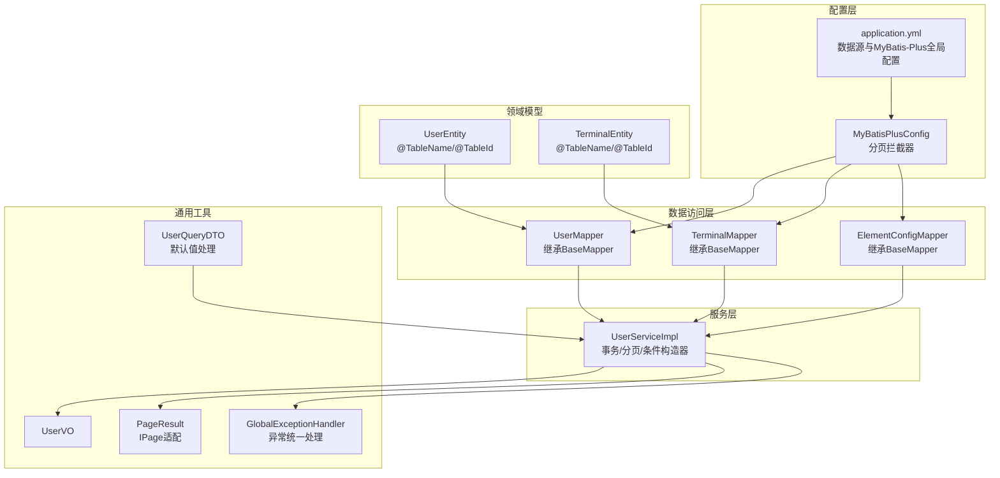
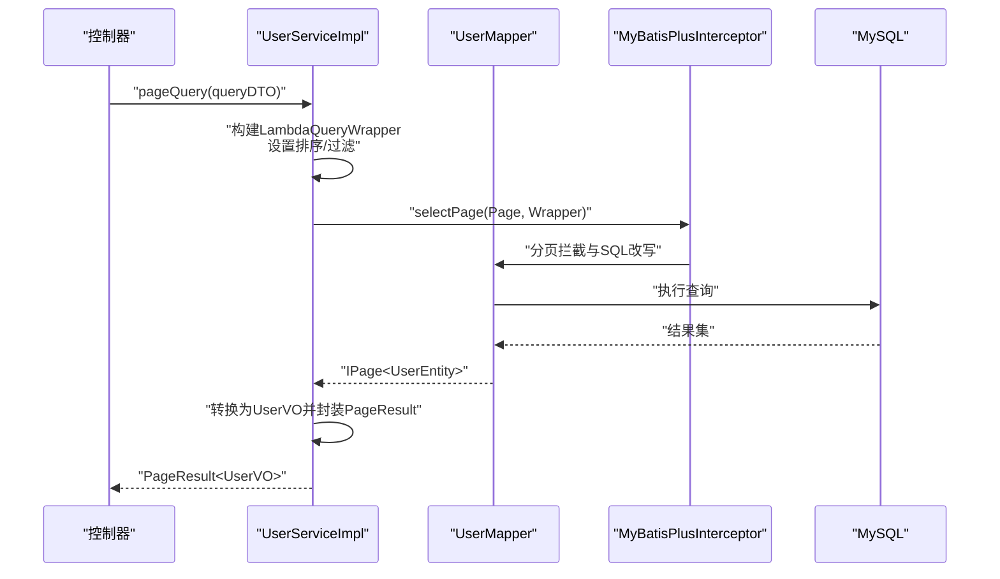
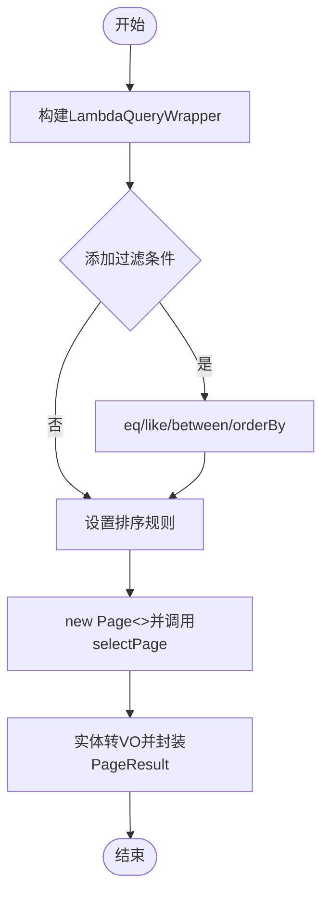
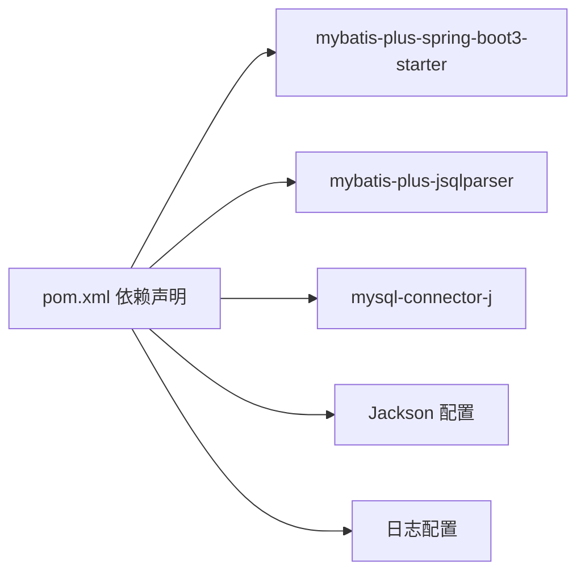

# 数据访问层

<cite>
**本文引用的文件**
- [MyBatisPlusConfig.java](file://src/main/java/com/hydro/monitor/config/MyBatisPlusConfig.java)
- [application.yml](file://src/main/resources/application.yml)
- [UserMapper.java](file://src/main/java/com/hydro/monitor/modules/mapper/UserMapper.java)
- [TerminalMapper.java](file://src/main/java/com/hydro/monitor/modules/mapper/TerminalMapper.java)
- [ElementConfigMapper.java](file://src/main/java/com/hydro/monitor/modules/mapper/ElementConfigMapper.java)
- [UserEntity.java](file://src/main/java/com/hydro/monitor/modules/entity/UserEntity.java)
- [TerminalEntity.java](file://src/main/java/com/hydro/monitor/modules/entity/TerminalEntity.java)
- [UserServiceImpl.java](file://src/main/java/com/hydro/monitor/modules/service/impl/UserServiceImpl.java)
- [UserQueryDTO.java](file://src/main/java/com/hydro/monitor/modules/dto/UserQueryDTO.java)
- [UserVO.java](file://src/main/java/com/hydro/monitor/modules/vo/UserVO.java)
- [PageResult.java](file://src/main/java/com/hydro/monitor/common/PageResult.java)
- [GlobalExceptionHandler.java](file://src/main/java/com/hydro/monitor/common/GlobalExceptionHandler.java)
- [pom.xml](file://pom.xml)
- [init.sql](file://src/main/resources/db/init.sql)
- [migration_raw_message.sql](file://src/main/resources/db/migration_raw_message.sql)
</cite>

## 目录
1. [简介](#简介)
2. [项目结构](#项目结构)
3. [核心组件](#核心组件)
4. [架构总览](#架构总览)
5. [详细组件分析](#详细组件分析)
6. [依赖分析](#依赖分析)
7. [性能考虑](#性能考虑)
8. [故障排查指南](#故障排查指南)
9. [结论](#结论)
10. [附录](#附录)

## 简介
本文件聚焦于数据访问层（DAO/Repository 层）的技术实现与最佳实践，围绕 MyBatis-Plus 的配置与使用展开，涵盖以下主题：
- MyBatis-Plus 的拦截器与分页配置
- 通用 Mapper 接口的使用与实体注解
- CRUD 实现方式与复杂查询构建
- 动态 SQL 的使用场景与建议
- 性能优化策略、批量操作与连接池管理
- 分页处理与排序规则
- 事务管理、异常处理与日志记录
- 开发规范与性能调优技巧

## 项目结构
数据访问层采用“实体-映射器-服务”三层结构，结合 Spring Boot 自动装配与 MyBatis-Plus 的通用能力，实现低代码高效率的数据持久化。

图表来源
- [MyBatisPlusConfig.java:14-37](file://src/main/java/com/hydro/monitor/config/MyBatisPlusConfig.java#L14-L37)
- [application.yml:22-33](file://src/main/resources/application.yml#L22-L33)
- [UserMapper.java:12-14](file://src/main/java/com/hydro/monitor/modules/mapper/UserMapper.java#L12-L14)
- [TerminalMapper.java:12-14](file://src/main/java/com/hydro/monitor/modules/mapper/TerminalMapper.java#L12-L14)
- [ElementConfigMapper.java:12-14](file://src/main/java/com/hydro/monitor/modules/mapper/ElementConfigMapper.java#L12-L14)
- [UserEntity.java:16-23](file://src/main/java/com/hydro/monitor/modules/entity/UserEntity.java#L16-L23)
- [TerminalEntity.java:16-23](file://src/main/java/com/hydro/monitor/modules/entity/TerminalEntity.java#L16-L23)
- [UserServiceImpl.java:30-33](file://src/main/java/com/hydro/monitor/modules/service/impl/UserServiceImpl.java#L30-L33)
- [UserQueryDTO.java:8-53](file://src/main/java/com/hydro/monitor/modules/dto/UserQueryDTO.java#L8-L53)
- [PageResult.java:14-57](file://src/main/java/com/hydro/monitor/common/PageResult.java#L14-L57)
- [GlobalExceptionHandler.java:15-57](file://src/main/java/com/hydro/monitor/common/GlobalExceptionHandler.java#L15-L57)

章节来源
- [MyBatisPlusConfig.java:14-37](file://src/main/java/com/hydro/monitor/config/MyBatisPlusConfig.java#L14-L37)
- [application.yml:22-33](file://src/main/resources/application.yml#L22-L33)

## 核心组件
- MyBatis-Plus 配置：通过拦截器注入分页能力，并设置数据库类型、最大单页限制与溢出策略。
- 通用 Mapper 接口：各模块 Mapper 继承 BaseMapper，自动获得常用 CRUD 方法。
- 实体注解：使用 @TableName、@TableId 等注解映射表与主键策略（雪花算法）。
- 服务层实现：使用 LambdaQueryWrapper 构建复杂查询；分页使用 Page 对象；事务通过注解控制。
- 分页与 VO：PageResult 适配 MyBatis-Plus IPage；服务层将实体转换为 VO 返回。
- 异常与日志：全局异常处理器统一捕获运行时异常与权限异常；日志级别与输出格式在配置中定义。

章节来源
- [MyBatisPlusConfig.java:23-37](file://src/main/java/com/hydro/monitor/config/MyBatisPlusConfig.java#L23-L37)
- [UserMapper.java:12-14](file://src/main/java/com/hydro/monitor/modules/mapper/UserMapper.java#L12-L14)
- [TerminalMapper.java:12-14](file://src/main/java/com/hydro/monitor/modules/mapper/TerminalMapper.java#L12-L14)
- [ElementConfigMapper.java:12-14](file://src/main/java/com/hydro/monitor/modules/mapper/ElementConfigMapper.java#L12-L14)
- [UserEntity.java:16-23](file://src/main/java/com/hydro/monitor/modules/entity/UserEntity.java#L16-L23)
- [TerminalEntity.java:16-23](file://src/main/java/com/hydro/monitor/modules/entity/TerminalEntity.java#L16-L23)
- [UserServiceImpl.java:38-186](file://src/main/java/com/hydro/monitor/modules/service/impl/UserServiceImpl.java#L38-L186)
- [PageResult.java:48-56](file://src/main/java/com/hydro/monitor/common/PageResult.java#L48-L56)
- [GlobalExceptionHandler.java:25-56](file://src/main/java/com/hydro/monitor/common/GlobalExceptionHandler.java#L25-L56)

## 架构总览
下图展示数据访问层的关键交互：控制器通过服务层调用 Mapper，MyBatis-Plus 拦截器负责分页与 SQL 改写，应用配置提供数据源与全局特性。

图表来源
- [UserServiceImpl.java:137-186](file://src/main/java/com/hydro/monitor/modules/service/impl/UserServiceImpl.java#L137-L186)
- [MyBatisPlusConfig.java:24-36](file://src/main/java/com/hydro/monitor/config/MyBatisPlusConfig.java#L24-L36)
- [application.yml:9-13](file://src/main/resources/application.yml#L9-L13)

## 详细组件分析

### MyBatis-Plus 配置与分页拦截器
- 拦截器注册：通过 @Bean 注册 MybatisPlusInterceptor，并添加 PaginationInnerInterceptor。
- 数据库类型：指定 DbType.MYSQL，确保分页 SQL 适配。
- 单页限制：setMaxLimit 控制最大单页条数，防止超大数据量查询。
- 溢出策略：setOverflow 控制越界页行为（false 表示越界返回空数据）。
- 应用配置：application.yml 中开启驼峰映射与日志实现，便于调试。

章节来源
- [MyBatisPlusConfig.java:23-37](file://src/main/java/com/hydro/monitor/config/MyBatisPlusConfig.java#L23-L37)
- [application.yml:22-26](file://src/main/resources/application.yml#L22-L26)

### 通用 Mapper 接口与实体映射
- Mapper 接口：UserMapper、TerminalMapper、ElementConfigMapper 均继承 BaseMapper，天然具备 CRUD 能力。
- 实体注解：@TableName 指定表名；@TableId(type=ASSIGN_ID) 使用雪花算法 ID。
- 全局逻辑删除：application.yml 中配置逻辑删除字段与取值，实体层无需额外注解即可生效。

章节来源
- [UserMapper.java:12-14](file://src/main/java/com/hydro/monitor/modules/mapper/UserMapper.java#L12-L14)
- [TerminalMapper.java:12-14](file://src/main/java/com/hydro/monitor/modules/mapper/TerminalMapper.java#L12-L14)
- [ElementConfigMapper.java:12-14](file://src/main/java/com/hydro/monitor/modules/mapper/ElementConfigMapper.java#L12-L14)
- [UserEntity.java:16-23](file://src/main/java/com/hydro/monitor/modules/entity/UserEntity.java#L16-L23)
- [TerminalEntity.java:16-23](file://src/main/java/com/hydro/monitor/modules/entity/TerminalEntity.java#L16-L23)
- [application.yml:27-32](file://src/main/resources/application.yml#L27-L32)

### CRUD 实现与复杂查询
- 创建/更新/删除：服务层使用 @Transactional 包裹，先校验再执行 Mapper 操作，并记录日志。
- 查询：使用 LambdaQueryWrapper 构建条件，支持等值、模糊、范围、排序等组合。
- 分页：构造 Page 对象传入 selectPage，服务层将 IPage 转换为 PageResult 并映射为 VO。
- 排序：示例中按创建时间倒序；可扩展为多字段排序或动态排序。

图表来源
- [UserServiceImpl.java:137-186](file://src/main/java/com/hydro/monitor/modules/service/impl/UserServiceImpl.java#L137-L186)

章节来源
- [UserServiceImpl.java:38-114](file://src/main/java/com/hydro/monitor/modules/service/impl/UserServiceImpl.java#L38-L114)
- [UserServiceImpl.java:137-186](file://src/main/java/com/hydro/monitor/modules/service/impl/UserServiceImpl.java#L137-L186)

### 动态 SQL 使用场景与建议
- 条件拼接：使用 LambdaQueryWrapper 的链式方法动态拼接 where 条件，避免手写 XML。
- 复杂联表/子查询：若需跨表聚合或复杂筛选，可在 Mapper 中编写 XML 映射文件，使用 <script> 或 <where> 片段组织 SQL。
- 注意点：尽量保持 SQL 可读性与可维护性，必要时配合注释与单元测试。

（本节为概念性说明，未直接分析具体文件）

### 分页处理与排序规则
- 分页对象：服务层接收 UserQueryDTO 的 pageNum/pageSize，构造 Page 并传入 selectPage。
- 排序规则：示例中按创建时间倒序；可扩展为根据前端传参动态排序。
- 结果封装：PageResult 提供 of 静态方法将 IPage 转换为通用分页响应。

章节来源
- [UserQueryDTO.java:8-53](file://src/main/java/com/hydro/monitor/modules/dto/UserQueryDTO.java#L8-L53)
- [UserServiceImpl.java:137-186](file://src/main/java/com/hydro/monitor/modules/service/impl/UserServiceImpl.java#L137-L186)
- [PageResult.java:48-56](file://src/main/java/com/hydro/monitor/common/PageResult.java#L48-L56)

### 事务管理、异常处理与日志记录
- 事务：服务层方法使用 @Transactional(rollbackFor = Exception.class)，保证业务一致性。
- 异常：全局异常处理器捕获运行时异常与权限异常，统一返回 Result 响应。
- 日志：application.yml 配置根日志级别与包日志级别，StdOutImpl 输出 MyBatis SQL。

章节来源
- [UserServiceImpl.java:38-114](file://src/main/java/com/hydro/monitor/modules/service/impl/UserServiceImpl.java#L38-L114)
- [GlobalExceptionHandler.java:25-56](file://src/main/java/com/hydro/monitor/common/GlobalExceptionHandler.java#L25-L56)
- [application.yml:62-77](file://src/main/resources/application.yml#L62-L77)

### 数据库表结构与索引
- sys_user：系统用户表，唯一索引 username，用于快速查找。
- t_terminal：终端设备表，包含经纬度、在线状态、最后上报时间等字段，建立相应索引。
- t_heartbeat/t_timed_report：心跳与定时报文表，包含遥测站地址与观测时间索引。
- t_raw_message：原始报文记录表，按 station_address/receive_time/function_code 建立索引。

章节来源
- [init.sql:32-41](file://src/main/resources/db/init.sql#L32-L41)
- [init.sql:76-92](file://src/main/resources/db/init.sql#L76-L92)
- [init.sql:6-17](file://src/main/resources/db/init.sql#L6-L17)
- [init.sql:19-29](file://src/main/resources/db/init.sql#L19-L29)
- [migration_raw_message.sql:1-14](file://src/main/resources/db/migration_raw_message.sql#L1-L14)

## 依赖分析
- MyBatis-Plus 与 JSqlParser：通过 spring-boot3-starter 与独立 jsqlparser 依赖引入，确保分页与解析能力。
- MySQL 驱动：mysql-connector-j 提供 JDBC 访问。
- 日志与 Jackson：StdOutImpl 输出 SQL，Jackson 时间格式与时区配置提升可观测性。

图表来源
- [pom.xml:49-61](file://pom.xml#L49-L61)
- [application.yml:15-21](file://src/main/resources/application.yml#L15-L21)
- [application.yml:62-77](file://src/main/resources/application.yml#L62-L77)

章节来源
- [pom.xml:49-61](file://pom.xml#L49-L61)
- [application.yml:15-21](file://src/main/resources/application.yml#L15-L21)
- [application.yml:62-77](file://src/main/resources/application.yml#L62-L77)

## 性能考虑
- 分页限制：setMaxLimit 控制单页最大数量，避免大页扫描导致内存压力。
- 索引设计：依据高频查询字段建立索引（如遥测站地址、观测时间、用户名唯一索引）。
- SQL 日志：开发阶段开启 StdOutImpl，生产环境建议调整日志级别或接入结构化日志。
- 连接池：Spring Boot 默认使用 HikariCP，可通过 application.yml 调整连接池参数（如最小空闲、最大池大小、连接超时等）。
- 批量操作：对于大批量插入/更新，优先使用 MyBatis-Plus 的批量方法或 JDBC 批处理，减少往返次数。
- 逻辑删除：全局逻辑删除字段减少物理删除风险，同时注意查询时的过滤策略。

（本节提供通用指导，未直接分析具体文件）

## 故障排查指南
- 分页无效：确认分页拦截器已注册且 DbType 与数据库一致。
- 查询结果为空：检查 LambdaQueryWrapper 条件是否正确拼接，或是否存在逻辑删除未过滤。
- 事务不生效：确认方法可见性与调用路径，避免同类内自调用导致代理失效。
- 异常未被捕获：检查全局异常处理器是否注册，以及具体异常类型是否匹配。
- 日志缺失：核对 application.yml 中 logging.level 与 log-impl 配置。

章节来源
- [MyBatisPlusConfig.java:23-37](file://src/main/java/com/hydro/monitor/config/MyBatisPlusConfig.java#L23-L37)
- [GlobalExceptionHandler.java:25-56](file://src/main/java/com/hydro/monitor/common/GlobalExceptionHandler.java#L25-L56)
- [application.yml:22-26](file://src/main/resources/application.yml#L22-L26)
- [application.yml:62-77](file://src/main/resources/application.yml#L62-L77)

## 结论
本项目通过 MyBatis-Plus 的通用 Mapper 与拦截器机制，实现了简洁高效的 CRUD 与分页能力；结合实体注解与全局配置，提升了开发效率与可维护性。建议在复杂查询场景引入 XML 映射，在生产环境优化索引与连接池参数，并持续关注日志与监控指标以保障稳定性。

## 附录
- 开发规范
  - Mapper 接口命名遵循模块+Mapper 命名约定，继承 BaseMapper。
  - 实体类使用 @TableName/@TableId/@FieldFill 等注解明确映射关系。
  - 服务层方法使用 @Transactional 标注事务边界，异常统一由全局处理器处理。
  - 分页查询统一使用 Page 与 PageResult，避免直接暴露 IPage。
- 性能调优要点
  - 合理设置分页上限，避免一次性加载过多数据。
  - 为高频查询字段建立索引，避免全表扫描。
  - 使用逻辑删除替代物理删除，减少锁竞争与数据迁移成本。
  - 批量操作使用批处理或 MyBatis-Plus 批量方法，降低网络往返。