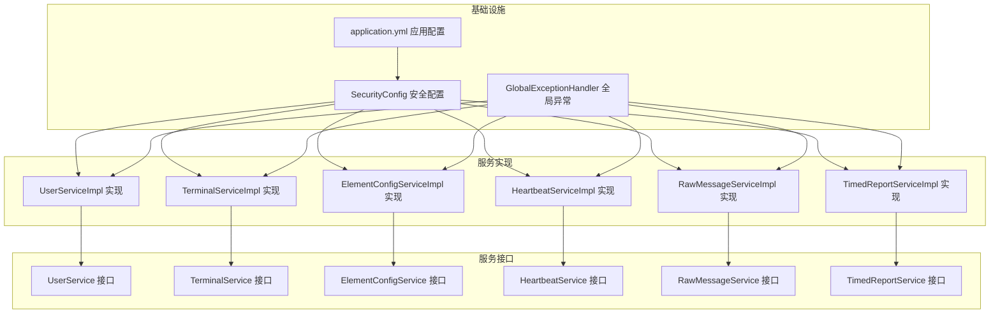
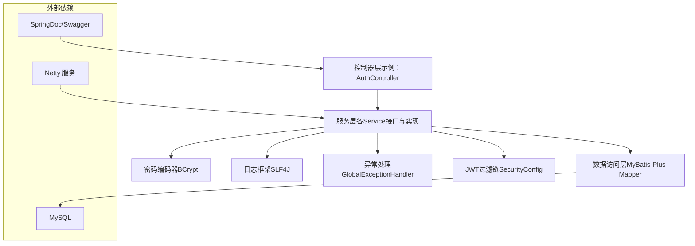
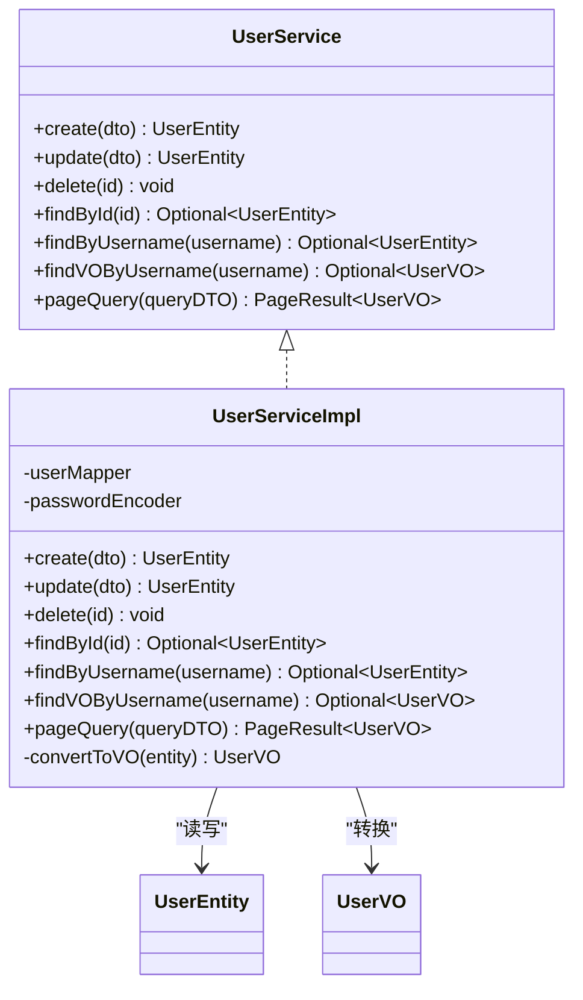
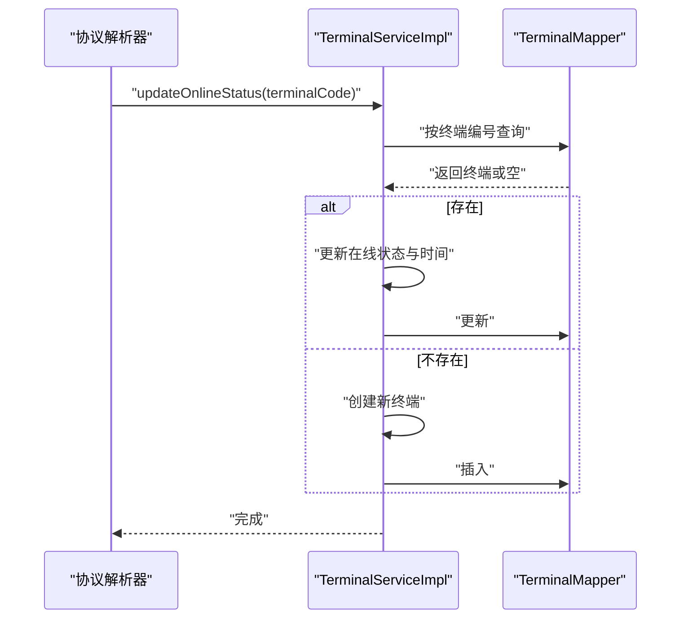
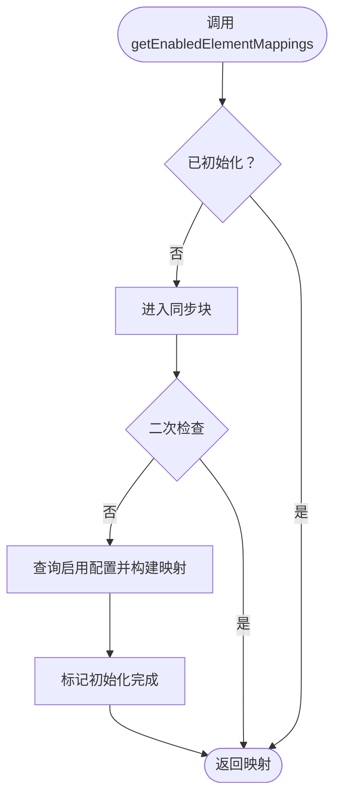
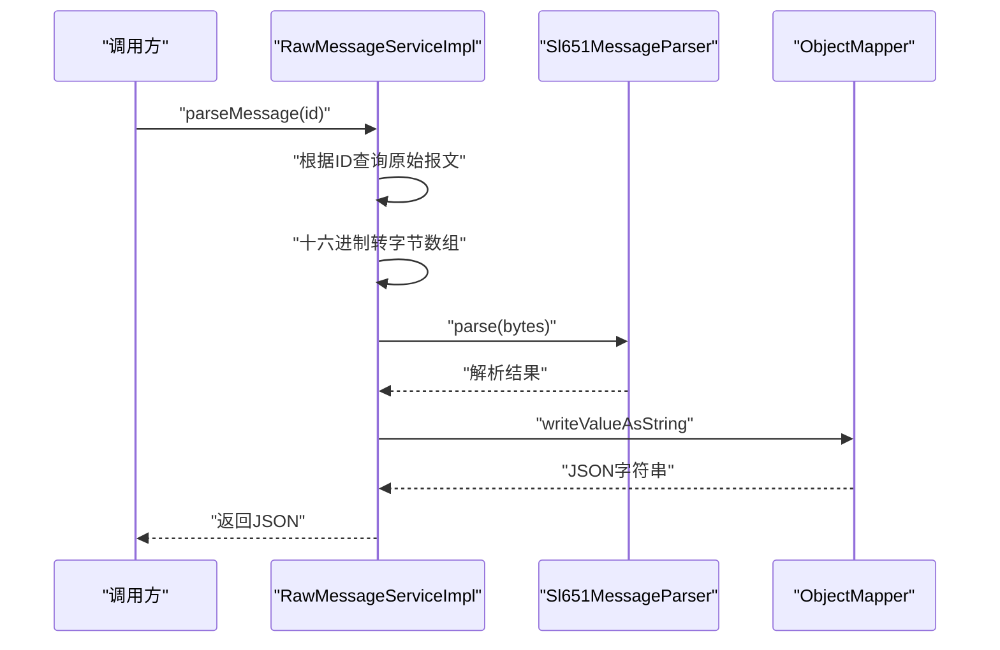
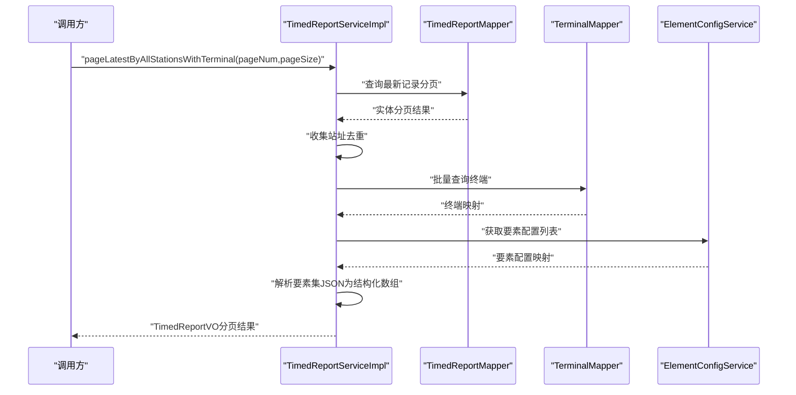
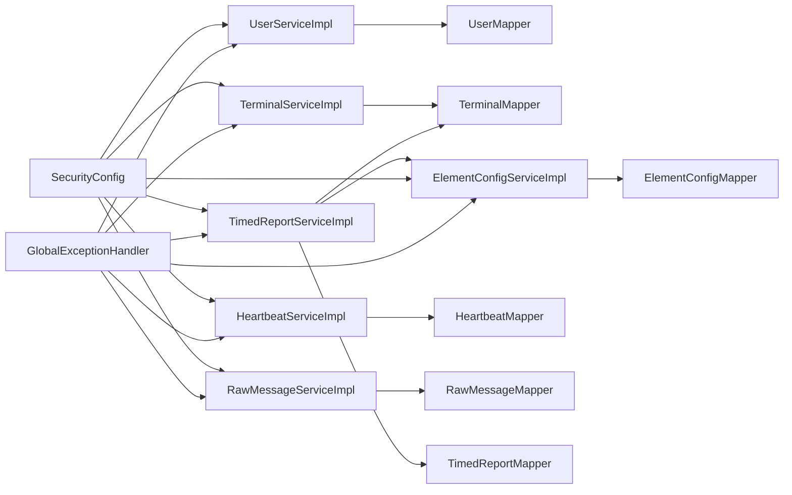

# 服务层

<cite>
**本文引用的文件**
- [UserService.java](file://src/main/java/com/hydro/monitor/modules/service/UserService.java)
- [UserServiceImpl.java](file://src/main/java/com/hydro/monitor/modules/service/impl/UserServiceImpl.java)
- [TerminalService.java](file://src/main/java/com/hydro/monitor/modules/service/TerminalService.java)
- [TerminalServiceImpl.java](file://src/main/java/com/hydro/monitor/modules/service/impl/TerminalServiceImpl.java)
- [ElementConfigService.java](file://src/main/java/com/hydro/monitor/modules/service/ElementConfigService.java)
- [ElementConfigServiceImpl.java](file://src/main/java/com/hydro/monitor/modules/service/impl/ElementConfigServiceImpl.java)
- [HeartbeatService.java](file://src/main/java/com/hydro/monitor/modules/service/HeartbeatService.java)
- [HeartbeatServiceImpl.java](file://src/main/java/com/hydro/monitor/modules/service/impl/HeartbeatServiceImpl.java)
- [RawMessageService.java](file://src/main/java/com/hydro/monitor/modules/service/RawMessageService.java)
- [RawMessageServiceImpl.java](file://src/main/java/com/hydro/monitor/modules/service/impl/RawMessageServiceImpl.java)
- [TimedReportService.java](file://src/main/java/com/hydro/monitor/modules/service/TimedReportService.java)
- [TimedReportServiceImpl.java](file://src/main/java/com/hydro/monitor/modules/service/impl/TimedReportServiceImpl.java)
- [UserEntity.java](file://src/main/java/com/hydro/monitor/modules/entity/UserEntity.java)
- [TerminalEntity.java](file://src/main/java/com/hydro/monitor/modules/entity/TerminalEntity.java)
- [GlobalExceptionHandler.java](file://src/main/java/com/hydro/monitor/common/GlobalExceptionHandler.java)
- [SecurityConfig.java](file://src/main/java/com/hydro/monitor/config/security/SecurityConfig.java)
- [application.yml](file://src/main/resources/application.yml)
</cite>

## 目录
1. [引言](#引言)
2. [项目结构](#项目结构)
3. [核心组件](#核心组件)
4. [架构总览](#架构总览)
5. [详细组件分析](#详细组件分析)
6. [依赖分析](#依赖分析)
7. [性能考虑](#性能考虑)
8. [故障排查指南](#故障排查指南)
9. [结论](#结论)
10. [附录](#附录)

## 引言
本文件面向服务层的综合技术文档，聚焦以下目标：
- 业务逻辑封装与事务管理
- 数据一致性保障机制
- 服务接口设计原则与实现类职责分工
- 依赖注入与Spring组件模型
- 异常处理策略、日志记录与性能监控
- 典型业务流程、数据转换规则与缓存策略
- 扩展性设计、代码复用与测试驱动实践
- 最佳实践、代码规范与质量保证

## 项目结构
服务层位于模块路径 modules/service 下，采用“接口 + 实现类”的分层设计，并通过Spring注解完成依赖注入与事务声明。各服务实现类均以 @Service 注解注册为Spring Bean，使用 @Transactional 标注关键写操作，确保事务边界与回滚策略。

**图表来源**
- [UserService.java:17-73](file://src/main/java/com/hydro/monitor/modules/service/UserService.java#L17-L73)
- [UserServiceImpl.java:33-207](file://src/main/java/com/hydro/monitor/modules/service/impl/UserServiceImpl.java#L33-L207)
- [TerminalService.java:17-79](file://src/main/java/com/hydro/monitor/modules/service/TerminalService.java#L17-L79)
- [TerminalServiceImpl.java:29-199](file://src/main/java/com/hydro/monitor/modules/service/impl/TerminalServiceImpl.java#L29-L199)
- [ElementConfigService.java:17-71](file://src/main/java/com/hydro/monitor/modules/service/ElementConfigService.java#L17-L71)
- [ElementConfigServiceImpl.java:30-238](file://src/main/java/com/hydro/monitor/modules/service/impl/ElementConfigServiceImpl.java#L30-L238)
- [HeartbeatService.java:12-28](file://src/main/java/com/hydro/monitor/modules/service/HeartbeatService.java#L12-L28)
- [HeartbeatServiceImpl.java:19-58](file://src/main/java/com/hydro/monitor/modules/service/impl/HeartbeatServiceImpl.java#L19-L58)
- [RawMessageService.java:13-47](file://src/main/java/com/hydro/monitor/modules/service/RawMessageService.java#L13-L47)
- [RawMessageServiceImpl.java:23-159](file://src/main/java/com/hydro/monitor/modules/service/impl/RawMessageServiceImpl.java#L23-L159)
- [TimedReportService.java:13-87](file://src/main/java/com/hydro/monitor/modules/service/TimedReportService.java#L13-L87)
- [TimedReportServiceImpl.java:33-331](file://src/main/java/com/hydro/monitor/modules/service/impl/TimedReportServiceImpl.java#L33-L331)
- [SecurityConfig.java:20-75](file://src/main/java/com/hydro/monitor/config/security/SecurityConfig.java#L20-L75)
- [GlobalExceptionHandler.java:15-57](file://src/main/java/com/hydro/monitor/common/GlobalExceptionHandler.java#L15-L57)
- [application.yml:1-86](file://src/main/resources/application.yml#L1-L86)

**章节来源**
- [UserService.java:1-74](file://src/main/java/com/hydro/monitor/modules/service/UserService.java#L1-L74)
- [TerminalService.java:1-79](file://src/main/java/com/hydro/monitor/modules/service/TerminalService.java#L1-L79)
- [ElementConfigService.java:1-72](file://src/main/java/com/hydro/monitor/modules/service/ElementConfigService.java#L1-L72)
- [HeartbeatService.java:1-29](file://src/main/java/com/hydro/monitor/modules/service/HeartbeatService.java#L1-L29)
- [RawMessageService.java:1-48](file://src/main/java/com/hydro/monitor/modules/service/RawMessageService.java#L1-L48)
- [TimedReportService.java:1-88](file://src/main/java/com/hydro/monitor/modules/service/TimedReportService.java#L1-L88)

## 核心组件
- 用户服务：负责用户生命周期管理、登录凭据安全与分页查询；使用密码编码器进行安全存储；事务性写操作保证一致性。
- 终端服务：负责终端设备的增删改查、唯一性约束校验与在线状态维护；支持自动创建未知终端。
- 要素配置服务：提供要素映射缓存与懒加载、双重检查锁保护、降级策略；写操作后清理缓存确保一致性。
- 心跳报文服务：持久化心跳数据与分页查询，统一日志记录。
- 原始报文服务：保存原始报文、分页查询、解析SL651协议报文并输出JSON。
- 定时报文服务：保存定时数据、多维度分页查询、聚合最新记录、关联终端与要素配置进行结构化解析。

**章节来源**
- [UserServiceImpl.java:38-206](file://src/main/java/com/hydro/monitor/modules/service/impl/UserServiceImpl.java#L38-L206)
- [TerminalServiceImpl.java:34-199](file://src/main/java/com/hydro/monitor/modules/service/impl/TerminalServiceImpl.java#L34-L199)
- [ElementConfigServiceImpl.java:38-237](file://src/main/java/com/hydro/monitor/modules/service/impl/ElementConfigServiceImpl.java#L38-L237)
- [HeartbeatServiceImpl.java:26-57](file://src/main/java/com/hydro/monitor/modules/service/impl/HeartbeatServiceImpl.java#L26-L57)
- [RawMessageServiceImpl.java:32-158](file://src/main/java/com/hydro/monitor/modules/service/impl/RawMessageServiceImpl.java#L32-L158)
- [TimedReportServiceImpl.java:44-330](file://src/main/java/com/hydro/monitor/modules/service/impl/TimedReportServiceImpl.java#L44-L330)

## 架构总览
服务层围绕“接口隔离 + 实体映射 + 事务边界 + 统一日志”展开，配合全局异常处理与安全配置，形成清晰的职责边界与可测试性。

**图表来源**
- [SecurityConfig.java:33-51](file://src/main/java/com/hydro/monitor/config/security/SecurityConfig.java#L33-L51)
- [GlobalExceptionHandler.java:25-56](file://src/main/java/com/hydro/monitor/common/GlobalExceptionHandler.java#L25-L56)
- [application.yml:4-33](file://src/main/resources/application.yml#L4-L33)

## 详细组件分析

### 用户服务（UserService/Impl）
- 设计原则
  - 接口最小职责：仅暴露业务方法签名，避免泄露数据访问细节。
  - 实现类专注业务：封装校验、转换、事务与日志。
- 关键流程
  - 创建用户：用户名唯一性校验、密码加密、默认状态与时间戳设置、事务提交与日志记录。
  - 更新用户：按需字段更新、密码加密更新、事务提交与日志记录。
  - 删除用户：存在性校验、删除并记录日志。
  - 分页查询：基于Lambda条件构造器的多字段模糊/精确查询、排序与VO转换。
- 事务与一致性
  - 写操作均标注事务，异常即回滚，保证原子性。
- 数据转换
  - 实体与VO之间一对一映射，保持对外暴露的数据结构稳定。
- 安全与依赖注入
  - 依赖注入密码编码器，确保凭据安全。
- 日志与异常
  - 成功与失败均有明确日志；运行时异常统一由全局异常处理器包装为标准响应。

**图表来源**
- [UserService.java:17-73](file://src/main/java/com/hydro/monitor/modules/service/UserService.java#L17-L73)
- [UserServiceImpl.java:33-206](file://src/main/java/com/hydro/monitor/modules/service/impl/UserServiceImpl.java#L33-L206)
- [UserEntity.java:15-69](file://src/main/java/com/hydro/monitor/modules/entity/UserEntity.java#L15-L69)

**章节来源**
- [UserServiceImpl.java:38-206](file://src/main/java/com/hydro/monitor/modules/service/impl/UserServiceImpl.java#L38-L206)
- [UserEntity.java:15-69](file://src/main/java/com/hydro/monitor/modules/entity/UserEntity.java#L15-L69)

### 终端服务（TerminalService/Impl）
- 设计原则
  - 唯一性约束：终端编号唯一，更新时避免与他人冲突。
  - 自动创建：协议解析发现未知终端时自动创建。
- 关键流程
  - 创建：唯一性校验、默认在线状态与时间戳设置、事务提交与日志。
  - 更新：唯一性校验（若修改编号）、按需字段更新、事务提交与日志。
  - 删除：存在性校验、删除并记录日志。
  - 在线状态：更新在线状态与最后上报时间，或自动创建新终端。
- 事务与一致性
  - 写操作事务化，异常回滚。
- 日志与异常
  - 成功与失败均有日志；运行时异常统一处理。

**图表来源**
- [TerminalServiceImpl.java:174-199](file://src/main/java/com/hydro/monitor/modules/service/impl/TerminalServiceImpl.java#L174-L199)

**章节来源**
- [TerminalServiceImpl.java:34-199](file://src/main/java/com/hydro/monitor/modules/service/impl/TerminalServiceImpl.java#L34-L199)
- [TerminalEntity.java:15-73](file://src/main/java/com/hydro/monitor/modules/entity/TerminalEntity.java#L15-L73)

### 要素配置服务（ElementConfigService/Impl）
- 设计原则
  - 映射缓存：懒加载+双重检查锁，首次访问加载全部启用配置，构建要素ID到字段名的映射。
  - 降级策略：加载失败时使用默认映射，保证系统可用性。
  - 写后失效：新增/更新/删除后清空缓存，确保下次读取最新配置。
- 关键流程
  - 获取映射：双重检查锁保护初始化，异常时降级。
  - 分页查询：多条件组合查询与排序。
  - 新增/更新/删除：唯一性校验、按需更新、清缓存。
- 事务与一致性
  - 写操作事务化，异常回滚。
- 性能与缓存
  - 应用启动时一次性加载，后续读取O(1)，写操作触发缓存失效。

**图表来源**
- [ElementConfigServiceImpl.java:38-63](file://src/main/java/com/hydro/monitor/modules/service/impl/ElementConfigServiceImpl.java#L38-L63)

**章节来源**
- [ElementConfigServiceImpl.java:38-237](file://src/main/java/com/hydro/monitor/modules/service/impl/ElementConfigServiceImpl.java#L38-L237)

### 心跳报文服务（HeartbeatService/Impl）
- 设计原则
  - 简洁职责：保存心跳与分页查询。
- 关键流程
  - 保存：插入并记录日志，异常统一抛出。
  - 分页：时间区间查询与排序。
- 日志与异常
  - 统一记录与异常包装。

**章节来源**
- [HeartbeatServiceImpl.java:26-57](file://src/main/java/com/hydro/monitor/modules/service/impl/HeartbeatServiceImpl.java#L26-L57)

### 原始报文服务（RawMessageService/Impl）
- 设计原则
  - 协议解析：调用专用解析器，输出结构化JSON。
  - 数据转换：实体与VO分离，便于接口演进。
- 关键流程
  - 保存：插入并记录日志，异常统一抛出。
  - 分页：按站址与功能码筛选，按接收时间倒序。
  - 解析：十六进制字符串转字节数组，调用解析器，序列化为JSON。
- 日志与异常
  - 详细日志记录站址、功能码与报文长度，异常统一抛出。

**图表来源**
- [RawMessageServiceImpl.java:90-110](file://src/main/java/com/hydro/monitor/modules/service/impl/RawMessageServiceImpl.java#L90-L110)

**章节来源**
- [RawMessageServiceImpl.java:32-158](file://src/main/java/com/hydro/monitor/modules/service/impl/RawMessageServiceImpl.java#L32-L158)

### 定时报文服务（TimedReportService/Impl）
- 设计原则
  - 多维查询：按站址、时间范围、最新记录等维度分页。
  - 关联查询：批量获取终端与要素配置，构建结构化VO。
  - 结构化解析：将JSON要素集映射为带名称与单位的元素项。
- 关键流程
  - 保存：插入并记录日志。
  - 分页：多条件组合查询与排序。
  - 最新记录：使用子查询按站址取最大ID对应记录。
  - 关联VO：批量查询终端与要素配置，构建TimedReportVO。
  - 解析要素集：JSON反序列化为Map，结合要素配置映射生成ElementItemVO列表。
- 性能优化
  - 批量查询终端与要素配置，减少N+1查询。
  - 要素映射缓存来自ElementConfigService，降低重复构建成本。
- 日志与异常
  - 详细日志记录查询条件与结果，异常统一抛出。

**图表来源**
- [TimedReportServiceImpl.java:131-246](file://src/main/java/com/hydro/monitor/modules/service/impl/TimedReportServiceImpl.java#L131-L246)

**章节来源**
- [TimedReportServiceImpl.java:44-330](file://src/main/java/com/hydro/monitor/modules/service/impl/TimedReportServiceImpl.java#L44-L330)

## 依赖分析
- 组件耦合
  - 服务实现类依赖Mapper与第三方解析器（如协议解析器），通过构造函数注入，降低紧耦合。
  - TimedReportServiceImpl依赖TerminalService与ElementConfigService，体现跨领域协作。
- 事务边界
  - 所有写操作（创建/更新/删除/保存）均在事务内执行，异常回滚，保证一致性。
- 安全与异常
  - SecurityConfig配置无状态JWT过滤链，统一鉴权。
  - GlobalExceptionHandler集中处理运行时异常与权限异常，返回标准化错误响应。
- 配置与日志
  - application.yml集中配置数据源、MyBatis-Plus、JWT、日志级别与文件滚动策略。

**图表来源**
- [UserServiceImpl.java:35-36](file://src/main/java/com/hydro/monitor/modules/service/impl/UserServiceImpl.java#L35-L36)
- [TerminalServiceImpl.java:31-32](file://src/main/java/com/hydro/monitor/modules/service/impl/TerminalServiceImpl.java#L31-L32)
- [ElementConfigServiceImpl.java:32-32](file://src/main/java/com/hydro/monitor/modules/service/impl/ElementConfigServiceImpl.java#L32-L32)
- [HeartbeatServiceImpl.java:24-24](file://src/main/java/com/hydro/monitor/modules/service/impl/HeartbeatServiceImpl.java#L24-L24)
- [RawMessageServiceImpl.java:28-29](file://src/main/java/com/hydro/monitor/modules/service/impl/RawMessageServiceImpl.java#L28-L29)
- [TimedReportServiceImpl.java:38-41](file://src/main/java/com/hydro/monitor/modules/service/impl/TimedReportServiceImpl.java#L38-L41)
- [SecurityConfig.java:24-49](file://src/main/java/com/hydro/monitor/config/security/SecurityConfig.java#L24-L49)
- [GlobalExceptionHandler.java:25-56](file://src/main/java/com/hydro/monitor/common/GlobalExceptionHandler.java#L25-L56)

**章节来源**
- [SecurityConfig.java:20-75](file://src/main/java/com/hydro/monitor/config/security/SecurityConfig.java#L20-L75)
- [GlobalExceptionHandler.java:15-57](file://src/main/java/com/hydro/monitor/common/GlobalExceptionHandler.java#L15-L57)
- [application.yml:1-86](file://src/main/resources/application.yml#L1-L86)

## 性能考虑
- 查询优化
  - 分页查询统一使用LambdaQueryWrapper，避免SQL拼接，提升可维护性与可读性。
  - TimedReportServiceImpl对终端与要素配置进行批量查询，减少多次往返。
- 缓存策略
  - 要素映射采用懒加载+双重检查锁+降级方案，写操作后清缓存，兼顾性能与一致性。
- 日志与监控
  - 统一使用SLF4J记录关键事件与异常，application.yml配置日志级别与文件滚动，便于生产问题定位。
- 安全与事务
  - 密码使用BCrypt编码，事务边界明确，异常统一处理，降低业务层出错风险。

[本节为通用性能建议，不直接分析具体文件，故无“章节来源”]

## 故障排查指南
- 常见异常类型
  - 运行时异常：服务层抛出的业务异常，会被全局异常处理器捕获并返回标准错误响应。
  - 权限异常：访问被拒时返回403，记录警告日志。
  - 通用异常：未覆盖的异常统一返回系统内部错误。
- 排查步骤
  - 查看服务层日志：确认事务边界内的操作是否成功执行。
  - 检查全局异常处理器：确认错误响应格式与状态码。
  - 核对安全配置：确认JWT过滤链生效与会话策略为无状态。
  - 校验数据源与MyBatis-Plus配置：确认驼峰映射与ID策略一致。
- 关键日志点
  - 用户/终端/要素配置/心跳/原始报文/定时报文保存成功/失败日志。
  - 要素映射加载成功/失败与降级日志。
  - 协议解析失败与参数长度日志。

**章节来源**
- [GlobalExceptionHandler.java:25-56](file://src/main/java/com/hydro/monitor/common/GlobalExceptionHandler.java#L25-L56)
- [UserServiceImpl.java:62-113](file://src/main/java/com/hydro/monitor/modules/service/impl/UserServiceImpl.java#L62-L113)
- [TerminalServiceImpl.java:57-120](file://src/main/java/com/hydro/monitor/modules/service/impl/TerminalServiceImpl.java#L57-L120)
- [ElementConfigServiceImpl.java:52-58](file://src/main/java/com/hydro/monitor/modules/service/impl/ElementConfigServiceImpl.java#L52-L58)
- [HeartbeatServiceImpl.java:30-34](file://src/main/java/com/hydro/monitor/modules/service/impl/HeartbeatServiceImpl.java#L30-L34)
- [RawMessageServiceImpl.java:37-51](file://src/main/java/com/hydro/monitor/modules/service/impl/RawMessageServiceImpl.java#L37-L51)
- [TimedReportServiceImpl.java:48-52](file://src/main/java/com/hydro/monitor/modules/service/impl/TimedReportServiceImpl.java#L48-L52)
- [SecurityConfig.java:33-51](file://src/main/java/com/hydro/monitor/config/security/SecurityConfig.java#L33-L51)
- [application.yml:62-76](file://src/main/resources/application.yml#L62-L76)

## 结论
服务层通过清晰的接口划分、严格的事务边界、统一的日志与异常处理，以及合理的缓存与批量查询策略，实现了高内聚、低耦合且易于扩展的业务能力。配合安全配置与标准化日志，整体具备良好的可维护性与可运维性。

[本节为总结性内容，不直接分析具体文件，故无“章节来源”]

## 附录
- 业务流程示例（以用户创建为例）
  - 控制器接收请求 → 服务层校验用户名唯一 → 加密密码 → 写入数据库 → 记录日志 → 返回结果
- 数据转换规则
  - 实体与VO之间保持一一对应字段映射，避免在服务层做复杂转换。
- 缓存策略
  - 要素映射缓存：懒加载+双重检查锁+降级；写操作后清缓存。
- 扩展性设计
  - 新增服务遵循“接口 + 实现类 + Mapper + DTO/VO”的标准结构，便于单元测试与集成测试。
- 测试驱动实践
  - 建议为每个服务实现类编写单元测试，覆盖正常路径、边界条件与异常场景；对涉及事务的方法使用集成测试验证回滚行为。

[本节为通用指导内容，不直接分析具体文件，故无“章节来源”]