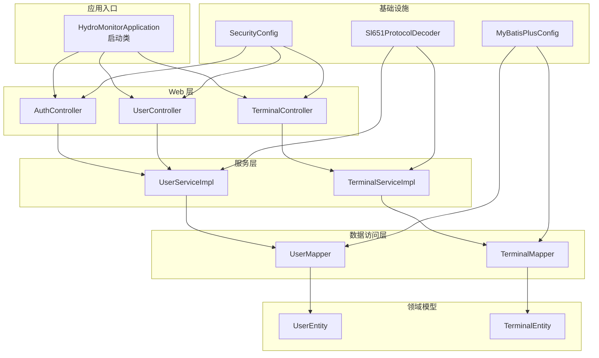
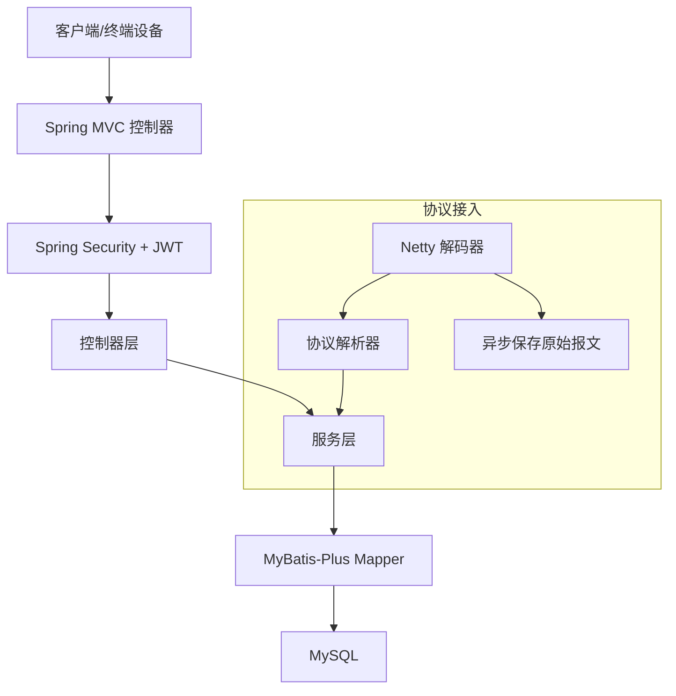
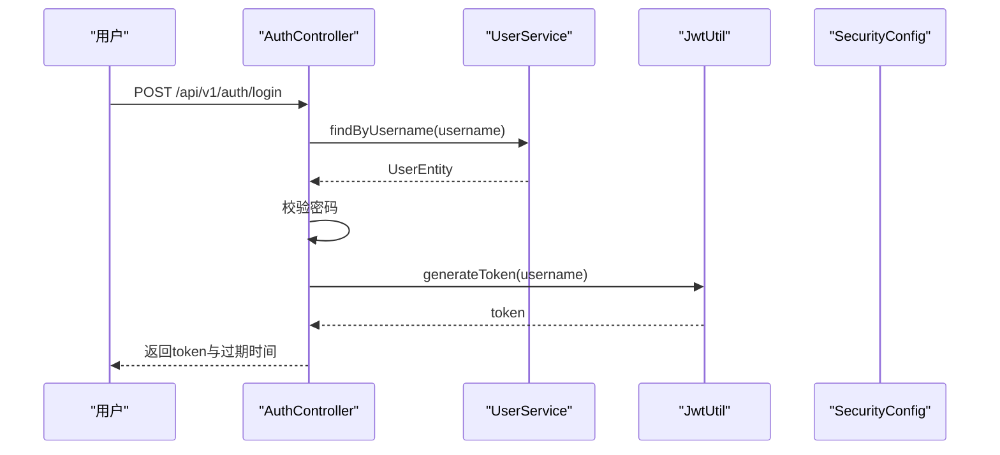
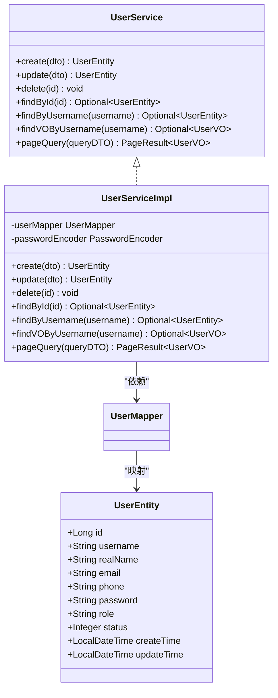
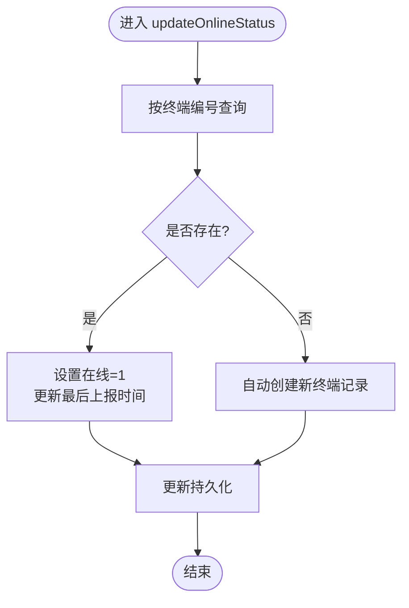
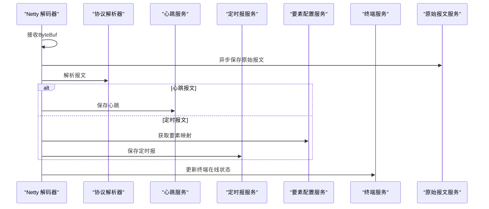
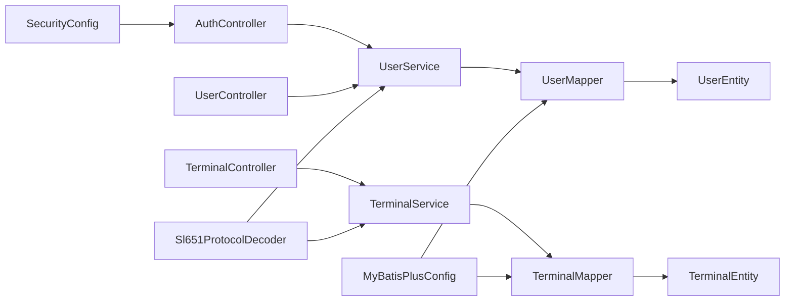

# 核心模块

<cite>
**本文引用的文件**
- [HydroMonitorApplication.java](file://src/main/java/com/hydro/monitor/HydroMonitorApplication.java)
- [GlobalExceptionHandler.java](file://src/main/java/com/hydro/monitor/common/GlobalExceptionHandler.java)
- [SecurityConfig.java](file://src/main/java/com/hydro/monitor/config/security/SecurityConfig.java)
- [MyBatisPlusConfig.java](file://src/main/java/com/hydro/monitor/config/MyBatisPlusConfig.java)
- [JwtUtil.java](file://src/main/java/com/hydro/monitor/config/security/JwtUtil.java)
- [JwtAuthenticationFilter.java](file://src/main/java/com/hydro/monitor/config/security/JwtAuthenticationFilter.java)
- [AuthController.java](file://src/main/java/com/hydro/monitor/modules/controller/AuthController.java)
- [UserController.java](file://src/main/java/com/hydro/monitor/modules/controller/UserController.java)
- [TerminalController.java](file://src/main/java/com/hydro/monitor/modules/controller/TerminalController.java)
- [UserService.java](file://src/main/java/com/hydro/monitor/modules/service/UserService.java)
- [UserServiceImpl.java](file://src/main/java/com/hydro/monitor/modules/service/impl/UserServiceImpl.java)
- [UserMapper.java](file://src/main/java/com/hydro/monitor/modules/mapper/UserMapper.java)
- [UserEntity.java](file://src/main/java/com/hydro/monitor/modules/entity/UserEntity.java)
- [UserCreateDTO.java](file://src/main/java/com/hydro/monitor/modules/dto/UserCreateDTO.java)
- [TerminalService.java](file://src/main/java/com/hydro/monitor/modules/service/TerminalService.java)
- [TerminalServiceImpl.java](file://src/main/java/com/hydro/monitor/modules/service/impl/TerminalServiceImpl.java)
- [TerminalMapper.java](file://src/main/java/com/hydro/monitor/modules/mapper/TerminalMapper.java)
- [TerminalEntity.java](file://src/main/java/com/hydro/monitor/modules/entity/TerminalEntity.java)
- [TerminalCreateDTO.java](file://src/main/java/com/hydro/monitor/modules/dto/TerminalCreateDTO.java)
- [Sl651ProtocolDecoder.java](file://src/main/java/com/hydro/monitor/netty/Sl651ProtocolDecoder.java)
- [Sl651MessageParser.java](file://src/main/java/com/hydro/monitor/netty/Sl651MessageParser.java)
- [application.yml](file://src/main/resources/application.yml)
</cite>

## 目录
1. [引言](#引言)
2. [项目结构](#项目结构)
3. [核心组件](#核心组件)
4. [架构总览](#架构总览)
5. [详细组件分析](#详细组件分析)
6. [依赖分析](#依赖分析)
7. [性能考量](#性能考量)
8. [故障排查指南](#故障排查指南)
9. [结论](#结论)
10. [附录](#附录)

## 引言
本文件面向水文监测系统后端核心业务模块，围绕MVC三层架构展开，系统性梳理模块职责、接口设计原则、异常处理机制、模块间依赖与数据流、事务管理策略、性能优化与可扩展性，并给出最佳实践与测试策略，帮助开发者快速理解并高效迭代系统。

## 项目结构
系统采用基于包的分层组织：controller（控制层）、service（服务层）、mapper（数据访问层）、entity/dto/vo（数据模型与视图对象）、common（通用工具与异常）、config（配置与安全）、netty（协议编解码与接入）、simulation（模拟上报）等。整体遵循“高内聚、低耦合”的模块化设计，便于扩展与维护。

图表来源
- [HydroMonitorApplication.java:1-36](file://src/main/java/com/hydro/monitor/HydroMonitorApplication.java#L1-L36)
- [AuthController.java:1-68](file://src/main/java/com/hydro/monitor/modules/controller/AuthController.java#L1-L68)
- [UserController.java:1-200](file://src/main/java/com/hydro/monitor/modules/controller/UserController.java#L1-L200)
- [TerminalController.java:1-138](file://src/main/java/com/hydro/monitor/modules/controller/TerminalController.java#L1-L138)
- [UserServiceImpl.java:1-208](file://src/main/java/com/hydro/monitor/modules/service/impl/UserServiceImpl.java#L1-L208)
- [TerminalServiceImpl.java:1-200](file://src/main/java/com/hydro/monitor/modules/service/impl/TerminalServiceImpl.java#L1-L200)
- [UserMapper.java:1-15](file://src/main/java/com/hydro/monitor/modules/mapper/UserMapper.java#L1-L15)
- [TerminalMapper.java:1-200](file://src/main/java/com/hydro/monitor/modules/mapper/TerminalMapper.java#L1-L200)
- [UserEntity.java:1-70](file://src/main/java/com/hydro/monitor/modules/entity/UserEntity.java#L1-L70)
- [TerminalEntity.java:1-200](file://src/main/java/com/hydro/monitor/modules/entity/TerminalEntity.java#L1-L200)
- [SecurityConfig.java:1-76](file://src/main/java/com/hydro/monitor/config/security/SecurityConfig.java#L1-L76)
- [MyBatisPlusConfig.java:1-39](file://src/main/java/com/hydro/monitor/config/MyBatisPlusConfig.java#L1-L39)
- [Sl651ProtocolDecoder.java:1-278](file://src/main/java/com/hydro/monitor/netty/Sl651ProtocolDecoder.java#L1-L278)

章节来源
- [HydroMonitorApplication.java:1-36](file://src/main/java/com/hydro/monitor/HydroMonitorApplication.java#L1-L36)
- [application.yml:1-86](file://src/main/resources/application.yml#L1-L86)

## 核心组件
- 启动类：负责应用启动与环境信息输出，便于本地开发调试。
- 控制器层：提供REST接口，统一返回包装结构，负责参数校验与日志记录。
- 服务层：封装业务逻辑，声明事务边界，屏蔽数据访问细节。
- 数据访问层：基于MyBatis-Plus，提供基础CRUD能力与分页支持。
- 领域模型：实体类映射数据库表，DTO/VO用于接口传输与视图剥离。
- 安全与配置：基于Spring Security与JWT，提供无状态鉴权；MyBatis-Plus配置分页拦截器。
- 协议接入：Netty解码器对接SL 651协议，解析并持久化心跳与定时报文，异步落库原始报文。

章节来源
- [AuthController.java:1-68](file://src/main/java/com/hydro/monitor/modules/controller/AuthController.java#L1-L68)
- [UserService.java:1-74](file://src/main/java/com/hydro/monitor/modules/service/UserService.java#L1-L74)
- [UserServiceImpl.java:1-208](file://src/main/java/com/hydro/monitor/modules/service/impl/UserServiceImpl.java#L1-L208)
- [UserMapper.java:1-15](file://src/main/java/com/hydro/monitor/modules/mapper/UserMapper.java#L1-L15)
- [UserEntity.java:1-70](file://src/main/java/com/hydro/monitor/modules/entity/UserEntity.java#L1-L70)
- [UserCreateDTO.java:1-55](file://src/main/java/com/hydro/monitor/modules/dto/UserCreateDTO.java#L1-L55)
- [TerminalService.java:1-79](file://src/main/java/com/hydro/monitor/modules/service/TerminalService.java#L1-L79)
- [TerminalServiceImpl.java:1-200](file://src/main/java/com/hydro/monitor/modules/service/impl/TerminalServiceImpl.java#L1-L200)
- [TerminalMapper.java:1-200](file://src/main/java/com/hydro/monitor/modules/mapper/TerminalMapper.java#L1-L200)
- [TerminalEntity.java:1-200](file://src/main/java/com/hydro/monitor/modules/entity/TerminalEntity.java#L1-L200)
- [TerminalCreateDTO.java:1-200](file://src/main/java/com/hydro/monitor/modules/dto/TerminalCreateDTO.java#L1-L200)
- [Sl651ProtocolDecoder.java:1-278](file://src/main/java/com/hydro/monitor/netty/Sl651ProtocolDecoder.java#L1-L278)
- [SecurityConfig.java:1-76](file://src/main/java/com/hydro/monitor/config/security/SecurityConfig.java#L1-L76)
- [MyBatisPlusConfig.java:1-39](file://src/main/java/com/hydro/monitor/config/MyBatisPlusConfig.java#L1-L39)

## 架构总览
系统采用MVC分层与无状态鉴权，控制器负责请求接入与结果封装，服务层承载业务规则与事务，数据访问层抽象持久化操作，Netty独立处理协议接入与异步落库，保证主线程不被阻塞。

图表来源
- [AuthController.java:1-68](file://src/main/java/com/hydro/monitor/modules/controller/AuthController.java#L1-L68)
- [SecurityConfig.java:1-76](file://src/main/java/com/hydro/monitor/config/security/SecurityConfig.java#L1-L76)
- [Sl651ProtocolDecoder.java:1-278](file://src/main/java/com/hydro/monitor/netty/Sl651ProtocolDecoder.java#L1-L278)
- [MyBatisPlusConfig.java:1-39](file://src/main/java/com/hydro/monitor/config/MyBatisPlusConfig.java#L1-L39)

## 详细组件分析

### 认证与安全模块
- 设计要点
  - 基于Spring Security 6的无状态鉴权，禁用CSRF，使用JWT令牌。
  - 自定义过滤器链，将JWT过滤器置于标准认证之前。
  - 提供密码编码器与认证提供者配置。
- 接口与流程
  - 控制器接收用户名/密码，调用服务查询用户并校验密码，生成JWT返回。
- 异常处理
  - 全局异常处理器统一捕获运行时异常、权限拒绝与通用异常，返回标准化错误响应。

图表来源
- [AuthController.java:1-68](file://src/main/java/com/hydro/monitor/modules/controller/AuthController.java#L1-L68)
- [UserService.java:1-74](file://src/main/java/com/hydro/monitor/modules/service/UserService.java#L1-L74)
- [UserServiceImpl.java:1-208](file://src/main/java/com/hydro/monitor/modules/service/impl/UserServiceImpl.java#L1-L208)
- [JwtUtil.java:1-200](file://src/main/java/com/hydro/monitor/config/security/JwtUtil.java#L1-L200)
- [SecurityConfig.java:1-76](file://src/main/java/com/hydro/monitor/config/security/SecurityConfig.java#L1-L76)

章节来源
- [AuthController.java:1-68](file://src/main/java/com/hydro/monitor/modules/controller/AuthController.java#L1-L68)
- [SecurityConfig.java:1-76](file://src/main/java/com/hydro/monitor/config/security/SecurityConfig.java#L1-L76)
- [GlobalExceptionHandler.java:1-58](file://src/main/java/com/hydro/monitor/common/GlobalExceptionHandler.java#L1-L58)

### 用户管理模块
- 职责与接口
  - 提供用户创建、更新、删除、查询、分页查询与按用户名查找VO等接口。
- 实现要点
  - 使用MyBatis-Plus分页插件，支持多字段模糊/精确查询。
  - 事务注解确保一致性，密码使用BCrypt编码。
- 数据模型
  - 实体类映射sys_user表，DTO用于入参校验，VO用于出参展示。

图表来源
- [UserService.java:1-74](file://src/main/java/com/hydro/monitor/modules/service/UserService.java#L1-L74)
- [UserServiceImpl.java:1-208](file://src/main/java/com/hydro/monitor/modules/service/impl/UserServiceImpl.java#L1-L208)
- [UserMapper.java:1-15](file://src/main/java/com/hydro/monitor/modules/mapper/UserMapper.java#L1-L15)
- [UserEntity.java:1-70](file://src/main/java/com/hydro/monitor/modules/entity/UserEntity.java#L1-L70)

章节来源
- [UserServiceImpl.java:1-208](file://src/main/java/com/hydro/monitor/modules/service/impl/UserServiceImpl.java#L1-L208)
- [UserEntity.java:1-70](file://src/main/java/com/hydro/monitor/modules/entity/UserEntity.java#L1-L70)
- [UserCreateDTO.java:1-55](file://src/main/java/com/hydro/monitor/modules/dto/UserCreateDTO.java#L1-L55)

### 终端管理模块
- 职责与接口
  - 提供终端的增删改查、分页查询、列表查询与在线状态更新接口。
- 实现要点
  - 事务边界明确，防止并发重复与非法更新。
  - 在线状态更新时若终端不存在则自动创建，提升协议解析健壮性。
- 数据模型
  - 终端实体包含经纬度、安装位置、连接密码、在线状态与最后上报时间等。

图表来源
- [TerminalServiceImpl.java:174-200](file://src/main/java/com/hydro/monitor/modules/service/impl/TerminalServiceImpl.java#L174-L200)

章节来源
- [TerminalController.java:1-138](file://src/main/java/com/hydro/monitor/modules/controller/TerminalController.java#L1-L138)
- [TerminalServiceImpl.java:1-200](file://src/main/java/com/hydro/monitor/modules/service/impl/TerminalServiceImpl.java#L1-L200)
- [TerminalEntity.java:1-200](file://src/main/java/com/hydro/monitor/modules/entity/TerminalEntity.java#L1-L200)
- [TerminalCreateDTO.java:1-200](file://src/main/java/com/hydro/monitor/modules/dto/TerminalCreateDTO.java#L1-L200)

### 协议接入与消息处理模块
- 职责与流程
  - Netty解码器接收二进制报文，异步保存原始报文，委托解析器进行协议解析，按心跳/定时报两类结果持久化，同时更新终端在线状态。
- 关键点
  - 解码器仅承担桥接职责，协议解析逻辑由独立解析器承担，保证线程安全与可测试性。
  - 原始报文异步落库，避免阻塞Netty线程。
  - 要素集映射通过要素配置服务获取，将解析ID转换为要素编码并序列化为JSON存储。

图表来源
- [Sl651ProtocolDecoder.java:1-278](file://src/main/java/com/hydro/monitor/netty/Sl651ProtocolDecoder.java#L1-L278)
- [Sl651MessageParser.java:1-200](file://src/main/java/com/hydro/monitor/netty/Sl651MessageParser.java#L1-L200)

章节来源
- [Sl651ProtocolDecoder.java:1-278](file://src/main/java/com/hydro/monitor/netty/Sl651ProtocolDecoder.java#L1-L278)

## 依赖分析
- 控制器依赖服务接口，服务实现依赖Mapper与配置组件。
- 安全配置贯穿控制器层，统一鉴权策略。
- MyBatis-Plus配置全局生效，提供分页与驼峰映射。
- 协议解码器依赖多个业务服务，形成跨模块协作。

图表来源
- [AuthController.java:1-68](file://src/main/java/com/hydro/monitor/modules/controller/AuthController.java#L1-L68)
- [UserController.java:1-200](file://src/main/java/com/hydro/monitor/modules/controller/UserController.java#L1-L200)
- [TerminalController.java:1-138](file://src/main/java/com/hydro/monitor/modules/controller/TerminalController.java#L1-L138)
- [UserService.java:1-74](file://src/main/java/com/hydro/monitor/modules/service/UserService.java#L1-L74)
- [TerminalService.java:1-79](file://src/main/java/com/hydro/monitor/modules/service/TerminalService.java#L1-L79)
- [UserMapper.java:1-15](file://src/main/java/com/hydro/monitor/modules/mapper/UserMapper.java#L1-L15)
- [TerminalMapper.java:1-200](file://src/main/java/com/hydro/monitor/modules/mapper/TerminalMapper.java#L1-L200)
- [SecurityConfig.java:1-76](file://src/main/java/com/hydro/monitor/config/security/SecurityConfig.java#L1-L76)
- [MyBatisPlusConfig.java:1-39](file://src/main/java/com/hydro/monitor/config/MyBatisPlusConfig.java#L1-L39)
- [Sl651ProtocolDecoder.java:1-278](file://src/main/java/com/hydro/monitor/netty/Sl651ProtocolDecoder.java#L1-L278)

章节来源
- [application.yml:1-86](file://src/main/resources/application.yml#L1-L86)

## 性能考量
- 异步落库：原始报文通过异步任务保存，避免阻塞网络线程，提升吞吐量。
- 分页与限制：MyBatis-Plus分页拦截器设置最大单页条数与溢出处理，防止大页查询导致内存压力。
- 无状态鉴权：JWT无状态设计降低会话开销，适合高并发场景。
- 日志级别：生产环境建议调整日志级别，减少高频日志对I/O的影响。
- 数据库连接池与索引：结合实际查询条件建立合适索引，优化分页与模糊查询性能。

## 故障排查指南
- 认证失败
  - 检查用户名是否存在与密码是否匹配；确认密码编码器配置一致。
- 权限拒绝
  - 核对请求路径是否在放行列表，或是否携带有效JWT。
- 业务异常
  - 查看全局异常处理器返回的错误信息与日志堆栈，定位具体异常类型。
- 协议解析问题
  - 检查原始报文是否完整、要素配置映射是否正确、解析器是否返回有效结果。
- 数据库异常
  - 关注分页参数合法性、唯一性约束冲突与事务回滚原因。

章节来源
- [GlobalExceptionHandler.java:1-58](file://src/main/java/com/hydro/monitor/common/GlobalExceptionHandler.java#L1-L58)
- [Sl651ProtocolDecoder.java:1-278](file://src/main/java/com/hydro/monitor/netty/Sl651ProtocolDecoder.java#L1-L278)

## 结论
本系统通过清晰的MVC分层、无状态鉴权、事务边界与异步处理，实现了高内聚低耦合的模块化设计。控制器统一入口、服务层承载业务、数据访问层抽象持久化，配合Netty协议接入与异步落库，满足水文监测实时性与可靠性要求。建议持续完善测试覆盖、监控告警与容量规划，保障系统稳定演进。

## 附录
- 开发与测试建议
  - 控制器层：统一返回包装结构，严格参数校验，详尽日志记录。
  - 服务层：明确事务边界，避免跨服务长事务；对幂等性敏感操作增加去重逻辑。
  - 数据访问层：合理使用分页与条件构造器，避免N+1查询；为高频查询字段建立索引。
  - 安全层：定期轮换JWT密钥，限制令牌有效期；对敏感接口开启细粒度权限控制。
  - 协议层：解析器保持纯函数特性，单元测试覆盖典型报文与边界情况。
  - 测试策略：接口测试、集成测试与压测相结合；对异步落库与协议解析增加异步测试与并发测试。