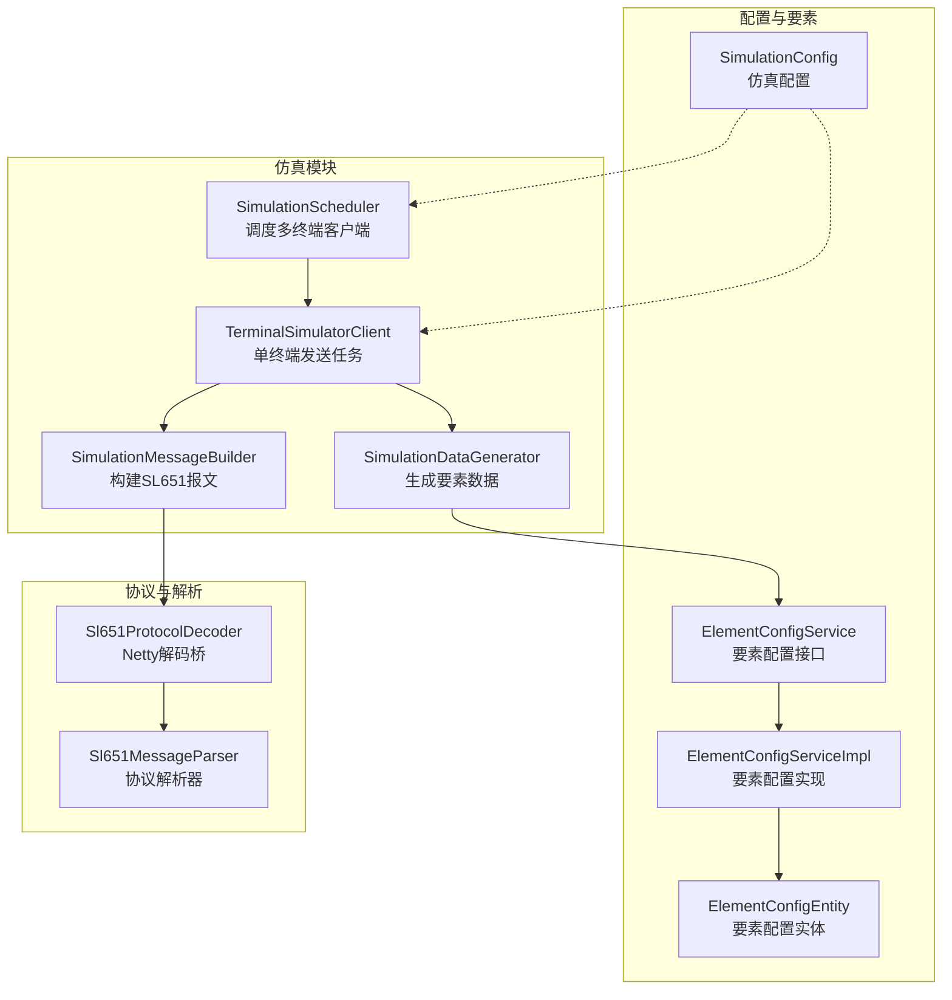
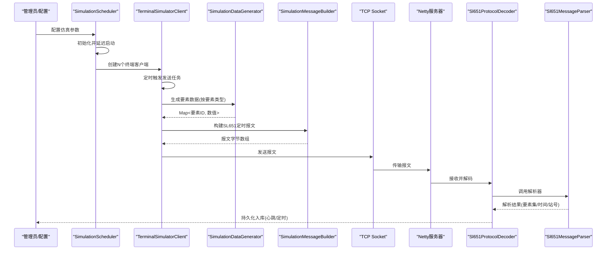
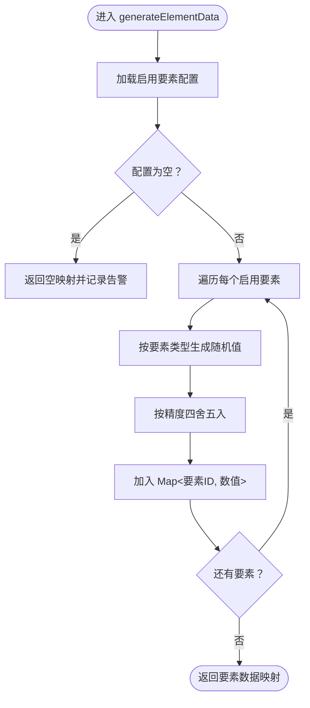
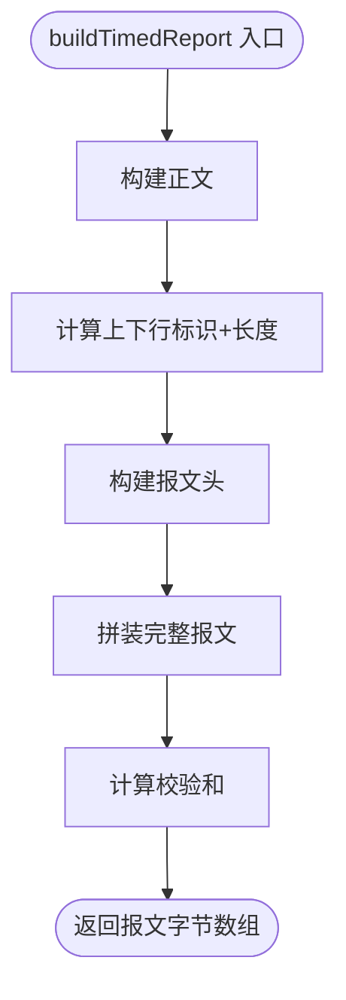
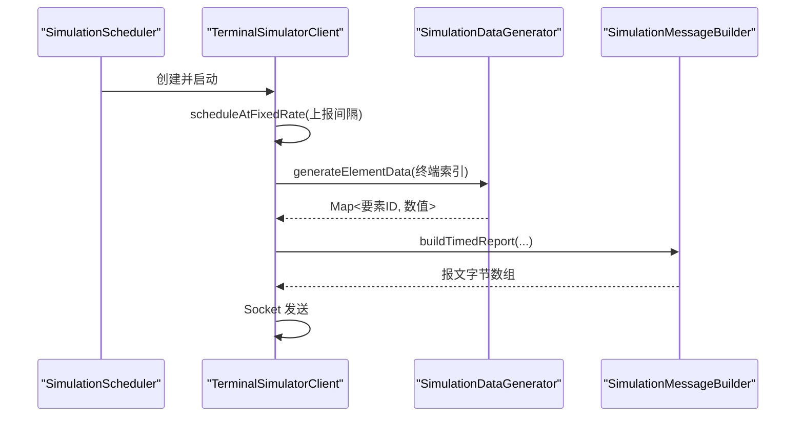
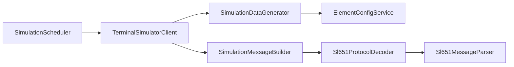

# 数据生成器

<cite>
**本文引用的文件**
- [SimulationDataGenerator.java](file://src/main/java/com/hydro/monitor/simulation/SimulationDataGenerator.java)
- [SimulationMessageBuilder.java](file://src/main/java/com/hydro/monitor/simulation/SimulationMessageBuilder.java)
- [SimulationScheduler.java](file://src/main/java/com/hydro/monitor/simulation/SimulationScheduler.java)
- [TerminalSimulatorClient.java](file://src/main/java/com/hydro/monitor/simulation/TerminalSimulatorClient.java)
- [SimulationConfig.java](file://src/main/java/com/hydro/monitor/config/SimulationConfig.java)
- [ElementConfigService.java](file://src/main/java/com/hydro/monitor/modules/service/ElementConfigService.java)
- [ElementConfigServiceImpl.java](file://src/main/java/com/hydro/monitor/modules/service/impl/ElementConfigServiceImpl.java)
- [ElementConfigEntity.java](file://src/main/java/com/hydro/monitor/modules/entity/ElementConfigEntity.java)
- [application.yml](file://src/main/resources/application.yml)
- [Sl651ProtocolDecoder.java](file://src/main/java/com/hydro/monitor/netty/Sl651ProtocolDecoder.java)
- [Sl651MessageParser.java](file://src/main/java/com/hydro/monitor/netty/Sl651MessageParser.java)
- [SimulationDataGeneratorTest.java](file://src/test/java/com/hydro/monitor/simulation/SimulationDataGeneratorTest.java)
</cite>

## 目录
1. [简介](#简介)
2. [项目结构](#项目结构)
3. [核心组件](#核心组件)
4. [架构总览](#架构总览)
5. [详细组件分析](#详细组件分析)
6. [依赖关系分析](#依赖关系分析)
7. [性能考量](#性能考量)
8. [故障排查指南](#故障排查指南)
9. [结论](#结论)
10. [附录](#附录)

## 简介
本文件面向“数据生成器”组件，系统性阐述其在水文监测场景下的设计与实现，重点覆盖：
- 随机数据生成算法与要素类型控制
- 数值范围、分布与时间序列特性
- 符合 SL 651-2014 协议的数据格式转换、BCD 编码与校验和
- 单位换算与精度控制机制
- 数据验证、边界值处理与异常过滤策略
- 配置项、性能优化与测试验证方法

该组件贯穿“模拟终端 → 生成数据 → 构建报文 → 发送至 Netty 服务器 → 解析入库”的完整链路，确保生成数据既满足规范又具备工程可用性。

## 项目结构
数据生成器位于仿真模块，配合配置、要素配置服务、Netty 协议栈与测试用例共同构成闭环。

图表来源
- [SimulationDataGenerator.java:1-164](file://src/main/java/com/hydro/monitor/simulation/SimulationDataGenerator.java#L1-L164)
- [SimulationMessageBuilder.java:1-447](file://src/main/java/com/hydro/monitor/simulation/SimulationMessageBuilder.java#L1-L447)
- [SimulationScheduler.java:1-136](file://src/main/java/com/hydro/monitor/simulation/SimulationScheduler.java#L1-L136)
- [TerminalSimulatorClient.java:1-207](file://src/main/java/com/hydro/monitor/simulation/TerminalSimulatorClient.java#L1-L207)
- [SimulationConfig.java:1-59](file://src/main/java/com/hydro/monitor/config/SimulationConfig.java#L1-L59)
- [ElementConfigService.java:1-72](file://src/main/java/com/hydro/monitor/modules/service/ElementConfigService.java#L1-L72)
- [ElementConfigServiceImpl.java:1-239](file://src/main/java/com/hydro/monitor/modules/service/impl/ElementConfigServiceImpl.java#L1-L239)
- [ElementConfigEntity.java:1-62](file://src/main/java/com/hydro/monitor/modules/entity/ElementConfigEntity.java#L1-L62)
- [Sl651ProtocolDecoder.java:1-278](file://src/main/java/com/hydro/monitor/netty/Sl651ProtocolDecoder.java#L1-L278)
- [Sl651MessageParser.java:1-515](file://src/main/java/com/hydro/monitor/netty/Sl651MessageParser.java#L1-L515)

章节来源
- [SimulationDataGenerator.java:1-164](file://src/main/java/com/hydro/monitor/simulation/SimulationDataGenerator.java#L1-L164)
- [SimulationMessageBuilder.java:1-447](file://src/main/java/com/hydro/monitor/simulation/SimulationMessageBuilder.java#L1-L447)
- [SimulationScheduler.java:1-136](file://src/main/java/com/hydro/monitor/simulation/SimulationScheduler.java#L1-L136)
- [TerminalSimulatorClient.java:1-207](file://src/main/java/com/hydro/monitor/simulation/TerminalSimulatorClient.java#L1-L207)
- [SimulationConfig.java:1-59](file://src/main/java/com/hydro/monitor/config/SimulationConfig.java#L1-L59)
- [ElementConfigService.java:1-72](file://src/main/java/com/hydro/monitor/modules/service/ElementConfigService.java#L1-L72)
- [ElementConfigServiceImpl.java:1-239](file://src/main/java/com/hydro/monitor/modules/service/impl/ElementConfigServiceImpl.java#L1-L239)
- [ElementConfigEntity.java:1-62](file://src/main/java/com/hydro/monitor/modules/entity/ElementConfigEntity.java#L1-L62)
- [Sl651ProtocolDecoder.java:1-278](file://src/main/java/com/hydro/monitor/netty/Sl651ProtocolDecoder.java#L1-L278)
- [Sl651MessageParser.java:1-515](file://src/main/java/com/hydro/monitor/netty/Sl651MessageParser.java#L1-L515)

## 核心组件
- SimulationDataGenerator：根据启用的要素配置生成随机数据，按要素类型控制数值范围与精度，并对结果进行四舍五入。
- SimulationMessageBuilder：严格遵循 SL 651-2014 协议，构建定时报文，包含报文头、正文、校验和与报文尾；负责 BCD 编码、数据定义位与要素标识符组装。
- SimulationScheduler：管理多个终端客户端，按配置启动、调度与销毁，支持延迟启动与优雅停机。
- TerminalSimulatorClient：每个终端的独立发送任务，周期性生成数据、构建报文并通过 Socket 发送到 Netty 服务器。
- SimulationConfig：集中式配置项，控制仿真开关、终端数量、上报间隔、中心站地址、密码、站分类码与服务器地址端口。
- ElementConfigService/Impl：提供启用要素的映射与列表，支持缓存与降级策略，保障运行期稳定性。
- Sl651ProtocolDecoder/Parser：Netty 侧解码与解析，将真实报文还原为结构化数据并持久化，形成闭环验证。

章节来源
- [SimulationDataGenerator.java:1-164](file://src/main/java/com/hydro/monitor/simulation/SimulationDataGenerator.java#L1-L164)
- [SimulationMessageBuilder.java:1-447](file://src/main/java/com/hydro/monitor/simulation/SimulationMessageBuilder.java#L1-L447)
- [SimulationScheduler.java:1-136](file://src/main/java/com/hydro/monitor/simulation/SimulationScheduler.java#L1-L136)
- [TerminalSimulatorClient.java:1-207](file://src/main/java/com/hydro/monitor/simulation/TerminalSimulatorClient.java#L1-L207)
- [SimulationConfig.java:1-59](file://src/main/java/com/hydro/monitor/config/SimulationConfig.java#L1-L59)
- [ElementConfigService.java:1-72](file://src/main/java/com/hydro/monitor/modules/service/ElementConfigService.java#L1-L72)
- [ElementConfigServiceImpl.java:1-239](file://src/main/java/com/hydro/monitor/modules/service/impl/ElementConfigServiceImpl.java#L1-L239)
- [Sl651ProtocolDecoder.java:1-278](file://src/main/java/com/hydro/monitor/netty/Sl651ProtocolDecoder.java#L1-L278)
- [Sl651MessageParser.java:1-515](file://src/main/java/com/hydro/monitor/netty/Sl651MessageParser.java#L1-L515)

## 架构总览
数据生成器的端到端流程如下：

图表来源
- [SimulationScheduler.java:45-96](file://src/main/java/com/hydro/monitor/simulation/SimulationScheduler.java#L45-L96)
- [TerminalSimulatorClient.java:119-156](file://src/main/java/com/hydro/monitor/simulation/TerminalSimulatorClient.java#L119-L156)
- [SimulationDataGenerator.java:37-59](file://src/main/java/com/hydro/monitor/simulation/SimulationDataGenerator.java#L37-L59)
- [SimulationMessageBuilder.java:34-106](file://src/main/java/com/hydro/monitor/simulation/SimulationMessageBuilder.java#L34-L106)
- [Sl651ProtocolDecoder.java:54-89](file://src/main/java/com/hydro/monitor/netty/Sl651ProtocolDecoder.java#L54-L89)
- [Sl651MessageParser.java:66-106](file://src/main/java/com/hydro/monitor/netty/Sl651MessageParser.java#L66-L106)

## 详细组件分析

### SimulationDataGenerator：要素数据生成器
- 设计要点
  - 依据启用的要素配置动态生成数据，避免无效或禁用要素参与。
  - 按要素类型选择不同的随机分布与范围，保证水文要素的合理性。
  - 对数值进行定点精度控制，统一采用四舍五入策略。
- 算法与范围
  - 5分钟时段降雨量：范围 0.0-50.0，保留1位小数；基于终端索引引入差异化基线。
  - 当前降雨量：范围 0.0-100.0，保留1位小数。
  - 水位：范围 50.000-200.000，保留3位小数。
  - 平均流速：范围 0.500-5.000，保留3位小数。
  - 瞬时流速：范围 0.500-6.000，保留3位小数。
  - 累计流量：范围 100.000-10000.000，保留3位小数。
  - 电源电压：范围 11.000-14.000，保留3位小数。
  - 默认值：范围 0.0-100.0，保留2位小数。
- 时间序列特性
  - 通过终端索引与模运算引入时间维度差异，不同终端在同一时刻呈现差异化趋势。
- 精度与单位
  - 采用 BigDecimal 进行定点计算与四舍五入，避免浮点误差累积。
  - 单位换算在协议层以 BCD 编码体现，生成器仅负责数值与精度。
- 错误处理
  - 无启用配置时返回空映射并记录告警日志，避免空指针或异常传播。

图表来源
- [SimulationDataGenerator.java:37-59](file://src/main/java/com/hydro/monitor/simulation/SimulationDataGenerator.java#L37-L59)
- [SimulationDataGenerator.java:68-162](file://src/main/java/com/hydro/monitor/simulation/SimulationDataGenerator.java#L68-L162)

章节来源
- [SimulationDataGenerator.java:1-164](file://src/main/java/com/hydro/monitor/simulation/SimulationDataGenerator.java#L1-L164)

### SimulationMessageBuilder：SL 651 报文构建器
- 报文结构与协议遵循
  - 报文头：起始符、中心站地址、遥测站地址（BCD）、密码（HEX）、功能码、上下行标识+长度。
  - 正文：流水号、发报时间（BCD）、站地址标识符、站地址（BCD）、站分类码、观测时间标识符、观测时间（BCD）、要素数据段。
  - 报文尾：0x03 + 校验和（2字节，累加和）。
- 数据定义位与 BCD 编码
  - 数据定义位高5位表示数据字节数，低3位表示小数位数。
  - 数值先按小数位缩放为整数，再按每两位数字占用1字节的方式进行 BCD 编码。
- 关键流程
  - 构建正文时，将要素ID从数据库十六进制字符串解析为十进制协议值，再按协议规范写入。
  - 计算校验和时，对有效字节进行无符号累加并截取低16位。
- 日志与可观测性
  - 详尽记录各阶段字节组成与十六进制输出，便于调试与验证。

图表来源
- [SimulationMessageBuilder.java:34-106](file://src/main/java/com/hydro/monitor/simulation/SimulationMessageBuilder.java#L34-L106)
- [SimulationMessageBuilder.java:162-269](file://src/main/java/com/hydro/monitor/simulation/SimulationMessageBuilder.java#L162-L269)
- [SimulationMessageBuilder.java:279-285](file://src/main/java/com/hydro/monitor/simulation/SimulationMessageBuilder.java#L279-L285)

章节来源
- [SimulationMessageBuilder.java:1-447](file://src/main/java/com/hydro/monitor/simulation/SimulationMessageBuilder.java#L1-L447)

### SimulationScheduler 与 TerminalSimulatorClient：调度与发送
- SimulationScheduler
  - 读取 SimulationConfig，按配置创建 N 个终端客户端。
  - 提供延迟启动（默认10秒）与优雅停机（关闭调度器与客户端）。
- TerminalSimulatorClient
  - 每个终端独立调度，立即执行一次后按固定间隔重复。
  - 发送前生成流水号（自增且截断为16位）、要素数据、构建报文并通过 Socket 发送。
  - 每次发送记录日志，异常捕获并记录，确保不影响其他终端。

图表来源
- [SimulationScheduler.java:78-96](file://src/main/java/com/hydro/monitor/simulation/SimulationScheduler.java#L78-L96)
- [TerminalSimulatorClient.java:56-90](file://src/main/java/com/hydro/monitor/simulation/TerminalSimulatorClient.java#L56-L90)
- [TerminalSimulatorClient.java:119-156](file://src/main/java/com/hydro/monitor/simulation/TerminalSimulatorClient.java#L119-L156)

章节来源
- [SimulationScheduler.java:1-136](file://src/main/java/com/hydro/monitor/simulation/SimulationScheduler.java#L1-L136)
- [TerminalSimulatorClient.java:1-207](file://src/main/java/com/hydro/monitor/simulation/TerminalSimulatorClient.java#L1-L207)

### 配置与要素映射
- SimulationConfig
  - 控制仿真开关、终端数量、上报间隔、中心站地址、密码、站分类码与服务器地址端口。
  - application.yml 提供默认值，便于开发与测试环境快速启用。
- ElementConfigService/Impl
  - 提供启用要素映射（要素ID→要素编码）与列表，支持缓存与降级策略。
  - 降级时使用硬编码映射，保证系统在数据库异常时仍可运行。

章节来源
- [SimulationConfig.java:1-59](file://src/main/java/com/hydro/monitor/config/SimulationConfig.java#L1-L59)
- [application.yml:78-86](file://src/main/resources/application.yml#L78-L86)
- [ElementConfigService.java:1-72](file://src/main/java/com/hydro/monitor/modules/service/ElementConfigService.java#L1-L72)
- [ElementConfigServiceImpl.java:38-63](file://src/main/java/com/hydro/monitor/modules/service/impl/ElementConfigServiceImpl.java#L38-L63)
- [ElementConfigEntity.java:1-62](file://src/main/java/com/hydro/monitor/modules/entity/ElementConfigEntity.java#L1-L62)

### 协议解析与闭环验证
- Sl651ProtocolDecoder
  - 接收 ByteBuf，保存原始报文，调用解析器并持久化心跳/定时报文。
  - 在解析定时报时，将要素ID（十进制）转换为十六进制字符串并与要素配置映射匹配，构建要素集 JSON。
- Sl651MessageParser
  - 纯解析器，无状态、线程安全，负责报文头、正文、尾部与要素段解析。
  - 对异常报文（长度不足、标识符错误、时间解析失败）进行容错处理并返回空结果。

章节来源
- [Sl651ProtocolDecoder.java:54-89](file://src/main/java/com/hydro/monitor/netty/Sl651ProtocolDecoder.java#L54-L89)
- [Sl651ProtocolDecoder.java:126-182](file://src/main/java/com/hydro/monitor/netty/Sl651ProtocolDecoder.java#L126-L182)
- [Sl651MessageParser.java:66-106](file://src/main/java/com/hydro/monitor/netty/Sl651MessageParser.java#L66-L106)

## 依赖关系分析
- 组件内聚与耦合
  - SimulationDataGenerator 仅依赖 ElementConfigService，职责单一，耦合度低。
  - SimulationMessageBuilder 为纯工具类，不依赖业务服务，便于单元测试与复用。
  - SimulationScheduler 与 TerminalSimulatorClient 通过构造注入依赖配置与生成器，保持松耦合。
- 外部依赖
  - Netty 通道处理器负责接收真实报文并解析入库，形成闭环验证。
  - 数据库层面的要素配置表提供要素编码、单位与精度等元数据，驱动生成与解析行为。

图表来源
- [SimulationDataGenerator.java:28-29](file://src/main/java/com/hydro/monitor/simulation/SimulationDataGenerator.java#L28-L29)
- [TerminalSimulatorClient.java:27-50](file://src/main/java/com/hydro/monitor/simulation/TerminalSimulatorClient.java#L27-L50)
- [SimulationMessageBuilder.java:1-17](file://src/main/java/com/hydro/monitor/simulation/SimulationMessageBuilder.java#L1-L17)
- [Sl651ProtocolDecoder.java:39-48](file://src/main/java/com/hydro/monitor/netty/Sl651ProtocolDecoder.java#L39-L48)

章节来源
- [SimulationDataGenerator.java:1-164](file://src/main/java/com/hydro/monitor/simulation/SimulationDataGenerator.java#L1-L164)
- [SimulationMessageBuilder.java:1-447](file://src/main/java/com/hydro/monitor/simulation/SimulationMessageBuilder.java#L1-L447)
- [Sl651ProtocolDecoder.java:1-278](file://src/main/java/com/hydro/monitor/netty/Sl651ProtocolDecoder.java#L1-L278)

## 性能考量
- 生成器
  - 使用定点运算与固定精度，避免频繁的浮点转换开销。
  - 随机数生成器为单例，减少对象创建成本。
- 报文构建
  - 预分配正文缓冲区，避免扩容与复制。
  - BCD 编码采用预计算字节数与填充策略，减少字符串操作。
- 发送与调度
  - 每终端独立调度线程，避免相互阻塞。
  - Socket 连接超时设置为 5 秒，防止阻塞影响整体吞吐。
- 缓存与降级
  - 要素映射采用懒加载与双重检查锁，首次加载后常驻内存，降低查询开销。
  - 数据库不可用时使用默认映射，保证系统可用性。

[本节为通用性能建议，无需特定文件引用]

## 故障排查指南
- 无启用要素配置
  - 现象：生成空数据映射并记录告警。
  - 处理：检查要素配置表启用状态与数据精度字段。
- 报文解析失败
  - 现象：解码器返回空结果或记录告警。
  - 处理：确认报文长度、起始符、功能码与校验和；核对要素ID与数据定义位。
- Socket 发送异常
  - 现象：终端日志出现发送失败。
  - 处理：检查服务器地址端口、网络连通性与防火墙策略。
- 精度与单位问题
  - 现象：入库数值与预期不符。
  - 处理：核对要素配置表的 data_precision 与 unit 字段；确认 BCD 编码与小数位对应关系。

章节来源
- [SimulationDataGenerator.java:40-43](file://src/main/java/com/hydro/monitor/simulation/SimulationDataGenerator.java#L40-L43)
- [Sl651ProtocolDecoder.java:70-73](file://src/main/java/com/hydro/monitor/netty/Sl651ProtocolDecoder.java#L70-L73)
- [TerminalSimulatorClient.java:179-181](file://src/main/java/com/hydro/monitor/simulation/TerminalSimulatorClient.java#L179-L181)

## 结论
数据生成器通过“要素配置驱动 + 类型化随机生成 + SL 651 协议严格编码”的方式，实现了与水文监测规范高度一致的模拟数据生成与传输闭环。其设计强调：
- 可配置性：通过 SimulationConfig 与要素配置表灵活控制数据范围与精度。
- 可靠性：要素映射缓存与降级策略、异常日志与优雅停机。
- 可验证性：详尽的日志输出与 Netty 解析入库形成闭环，便于回归测试与生产验证。

[本节为总结性内容，无需特定文件引用]

## 附录

### 数据生成配置选项
- 仿真开关：simulation.enabled
- 终端数量：simulation.terminal-count
- 上报间隔（秒）：simulation.report-interval-seconds
- 中心站地址：simulation.center-station-address
- 密码（BCD）：simulation.password
- 站分类码：simulation.station-category-code
- 服务器地址：simulation.server-host
- 服务器端口：simulation.server-port

章节来源
- [application.yml:78-86](file://src/main/resources/application.yml#L78-L86)
- [SimulationConfig.java:19-57](file://src/main/java/com/hydro/monitor/config/SimulationConfig.java#L19-L57)

### 数据验证与边界处理
- 生成器层面
  - 无启用配置时返回空映射并记录告警。
  - 不同终端索引引入差异化基线，保证时间序列多样性。
- 解析器层面
  - 长度不足、标识符错误、时间解析失败等异常直接返回空结果并记录告警。
- 测试用例
  - 验证生成数据范围、空配置返回、不同终端差异性等关键行为。

章节来源
- [SimulationDataGenerator.java:40-43](file://src/main/java/com/hydro/monitor/simulation/SimulationDataGenerator.java#L40-L43)
- [Sl651MessageParser.java:73-100](file://src/main/java/com/hydro/monitor/netty/Sl651MessageParser.java#L73-L100)
- [SimulationDataGeneratorTest.java:37-110](file://src/test/java/com/hydro/monitor/simulation/SimulationDataGeneratorTest.java#L37-L110)

### 性能优化技巧
- 使用定点运算与固定精度，减少浮点误差与转换成本。
- 预分配缓冲区，避免多次扩容与复制。
- 懒加载要素映射并缓存，降低数据库访问频率。
- 每终端独立线程调度，避免相互阻塞。

[本节为通用优化建议，无需特定文件引用]